# 2021上半年选择题

- 来源标题: 2021年上半年软件设计师考试基础知识真题（专业解析+参考答案）
- 试卷介绍页: https://wangxiao.xisaiwang.com/tiku2/136/tp20419206.html?cid=136
- 练习页: https://wangxiao.xisaiwang.com/tiku2/exam534903364.html
- 题量: 57

## 第1题（单选题）

在CPU中，用（  ）给出将要执行的下一条指令在内存中的地址。

- A. 程序计数器
- B. 指令寄存器
- C. 主存地址寄存器
- D. 状态条件寄存器

## 第2题（单选题）

以下关于RISC和CISC计算机的叙述中，正确的是（  ）。

- A. RISC不采用流水线技术，CISC采用流水线技术
- B. RISC使用复杂的指令，CISC使用简单的指令
- C. RISC采用很少的通用寄存器，CISC采用很多的通用寄存器
- D. RISC采用组合逻辑控制器，CISC普遍采用微程序控制器

## 第3题（单选题）

采用DMA方式传送数据时，每传送一个数据都需要占用一个（  ）。

- A. 指令周期
- B. 总线周期
- C. 存储周期
- D. 机器周期

## 第4题（单选题）

以下关于闪存（Flash Memory）的叙述中，错误的是（  ）。

- A. 掉电后信息不会丢失，属于非易失性存储器
- B. 以块为单位进行删除操作
- C. 采用随机访问方式，常用来代替主存
- D. 在嵌入式系统中可以用Flash来代替ROM存储器

## 第5题（单选题）

若磁盘的转速提高一倍，则（  ）。

- A. 平均存取时间减半
- B. 平均寻道时间加倍
- C. 旋转等待时间减半
- D. 数据传输速率加倍

## 第6题（单选题）

异常是指令执行过程中在处理器内部发生的特殊事件，中断是来自处理器外部的请求事件。以下关于中断和异常的叙述中，正确的是（  ）。

- A. “DMA传送结束”、“除运算时除数为0”都为中断
- B. “DMA传送结束”为中断，“除运算时除数为0”为异常
- C. “DMA传送结束”为异常，“除运算时除数为0”为中断
- D. “DMA传送结束”、“除运算时除数为0”都为异常

## 第7题（单选题）

下列协议中，属于安全远程登录协议的是（  ）。

- A. TLS
- B. TCP
- C. SSH
- D. TFTP

## 第8题（单选题）

下列攻击类型中，（  ）是以被攻击对象不能继续提供服务为首要目标。

- A. 跨站脚本
- B. 拒绝服务
- C. 信息篡改
- D. 口令猜测

## 第9题（单选题）

下列算法中属于非对称加密算法的是（  ）。

- A. DES
- B. RSA
- C. AES
- D. MD5

## 第10题（单选题）

SQL是一种数据库结构化查询语言，SQL注入攻击的首要目标是（  ）。

- A. 破坏Web服务
- B. 窃取用户口令等机密信息
- C. 攻击用户浏览器，以获得访问权限
- D. 获得数据库的权限

## 第11题（单选题）

通常使用（  ）为IP数据报文进行加密。

- A. IPSec
- B. PP2P
- C. HTTPS
- D. TLS

## 第12题（单选题）

根据《计算机软件保护条例》的规定，对软件著作权的保护不包括（  ）。

- A. 目标程序
- B. 软件文档
- C. 源程序
- D. 开发软件所有的操作方法

## 第13题（单选题）

甲、乙两互联网公司于2020年7月7日就各自开发的库存管理软件分别申请“宏达”和“鸿达”商标注册，两个库存管理软件相似，甲第一次使用时间为2019年7月，乙第一次使用时间为2019年5月，此情形下，（  ）能获准注册。

- A. “宏达”
- B. “宏达”和“鸿达”均
- C. 由甲、乙协商哪个
- D. “鸿达”

## 第14题（单选题）

A经销商擅自复制并销售B公司开发的OA软件光盘已构成侵权，C企业在未知情形下从A处购入100张并已安装使用，在C企业知道了所使用的软件为侵权复制的情形下，以下说法正确的是（  ）。

- A. C企业的使用行为侵权，须承担赔偿责任
- B. C企业的使用行为侵权，支付合理费用后可以继续使用这100张软件光盘
- C. C企业的使用行为不侵权，可以继续使用这100张软件光盘
- D. C企业的使用行为不侵权，不需承担任何法律责任

## 第15题（单选题）

下列关于结构化分析方法的数据字典中加工逻辑的叙述中，不正确的是（  ）。

- A. 对每一个基本加工，应该有一个加工逻辑
- B. 加工逻辑描述输入数据流变换为输出数据的加工规则
- C. 加工逻辑必须描述实现加工的数据结构和算法
- D. 结构化语言，判定树和判定表可以用来表示加工逻辑

## 第16题（单选题）

在软件设计阶段进行模块划分时，一个模块的（  ）。

- A. 控制范围应该在其作用范围之内
- B. 作用范围应该在其控制范围之内
- C. 作用范围与控制范围互不包含
- D. 作用范围与控制范围不受任何限制

## 第17题（单选题）

下图是一个软件项目的活动图，其中顶点表示项目里程碑，连接顶点的边表示包含的活动，边上的权重表示活动的持续时间（天），则关键路径长度为（  ）天。在该活动图中，活动（  ）晚16天开始不会影响工期。
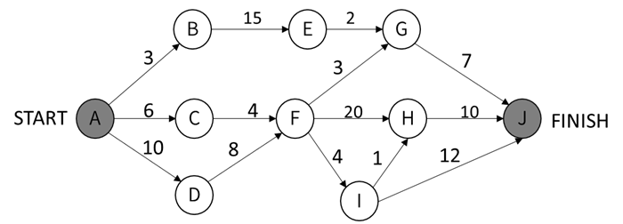

### 问题1
- A. 20
- B. 25
- C. 27
- D. 48
### 问题2
- A. AC
- B. BE
- C. FI
- D. IH

## 第18题（单选题）

下列关于风险的叙述中，不正确的是（  ）。

- A. 风险是可能发生的事件
- B. 如果能预测到风险，则可以避免其发生
- C. 风险是可能会带来损失的事件
- D. 对于风险进行干预，以期减少损失

## 第19题（单选题）

算数表达式a*(b+c/d)-e的后缀式为（  ）。

- A. a b c d/+*e-
- B. a b c de*+/-
- C. a*b+c/d-e
- D. ab*cd/+e-

## 第20题（单选题）

以编译方式翻译C/C++源程序的过程中，类型检查在（  ）阶段处理。

- A. 词法分析
- B. 语义分析
- C. 语法分析
- D. 目标代码生成

## 第21题（单选题）

Java语言符合的特征有（  ）和自动的垃圾回收处理。
①采用即时编译
②采用静态优化编译
③对象在堆空间分配
④对象在栈空间分配

- A. ①③
- B. ①④
- C. ②③
- D. ②④

## 第22题（单选题）

云计算有多种部署模型（Deployment Models）
。若云的基础设施是为某个客户单独使用而构建的，那么该部署模型属于（  ）。

- A. 公有云
- B. 私有云
- C. 社区云
- D. 混合云

## 第23题（单选题）

某计算机系统的字长为128位，磁盘的容量为2048GB，物理块的大小为8MB，假设文件管理系统采用位示图（bitmap）法记录该计算机系统磁盘的使用情况，那么位示图的大小需要（  ）个字。

- A. 1024
- B. 2048
- C. 4096
- D. 8192

## 第24题（单选题）

进程P有5个页面，页号为0~4，页面变换表及状态位、访问位和修改位的含义如下图所示。若系统给进程P分配了3个存储块，当访问的页面3不在内存时，应该淘汰表中页号为（  ）的页面。
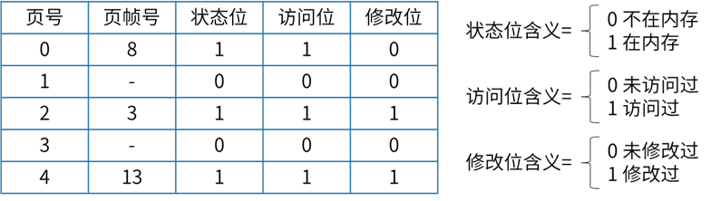

- A. 0
- B. 1
- C. 2
- D. 4

## 第25题（单选题）

进程P1、P2、P3、P4、P5和P6的前驱图如下所示：
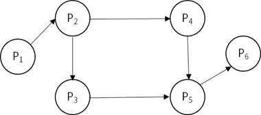
若用PV操作控制进程P1、P2、P3、P4、P5和P6并发执行的过程，需要设置6个信号量S1、S2、S3、S4、S5和S6，且信号量S1~S6的初值都等于零。下面的进程执行图中a和b处应分别填写（ 
），c和d处应分别填写（  ），e和f处应分别填写（  ）。
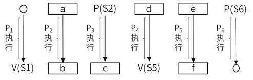

### 问题1
- A. V(S1)和P(S2)V(S3)
- B. P(S1)和P(S2)V(S3)
- C. V(S1)和V(S2)V(S3)
- D. P(S1)和V(S2)V(S3)
### 问题2
- A. P(S2)和P(S4)
- B. V(S4)和P(S3)
- C. P(S2)和V(S4)
- D. V(S2)和V(S4)
### 问题3
- A. P(S4)V(S5)和V(S6)
- B. P(S4)V(S5)和P(S6)
- C. P(S4)P(S5)和V(S6)
- D. P(S4)P(S5)和P(S6)

## 第26题（单选题）

关于螺旋模型，下列陈述中不正确的是（  ）。该过程模型的特点不包括（  ）。

### 问题1
- A. 将风险分析加入到瀑布模型中
- B. 将开发过程划分为几个螺旋周期，每个周期大致和瀑布模型相符合
- C. 适合于大规模、复杂且具有高风险的项目
- D. 可以快速地提供一个初始版本让用户测试
### 问题2
- A. 支持用户需求的动态变化
- B. 要求开发人员具有风险分析能力
- C. 基于该模型进行软件开发，开发成本低
- D. 过多的迭代次数可能会增加开发成本，进而延迟提交时间

## 第27题（单选题）

模块A通过非正常入口转入模块B内部，则这两个模块之间是（  ）耦合。

- A. 数据
- B. 公共
- C. 外部
- D. 内容

## 第28题（单选题）

软件详细设计阶段的主要任务不包括（  ）。

- A. 数据结构设计
- B. 算法设计
- C. 模块之间的接口设计
- D. 数据库的物理设计

## 第29题（单选题）

以下关于文档的叙述中，不正确的是（  ）。

- A. 文档也是软件产品的一部分，没有文档的软件就不能称之为软件
- B. 文档只对软件维护活动有用，对开发活动意义不大
- C. 软件文档的编制在软件开发工作中占有突出的地位和相当大的工作量
- D. 高质量文档对于发挥软件产品的效益有着重要的意义

## 第30题（单选题）

用白盒测试技术对下面流程图进行测试，至少采用（  ）个测试用例才可以实现路径覆盖。
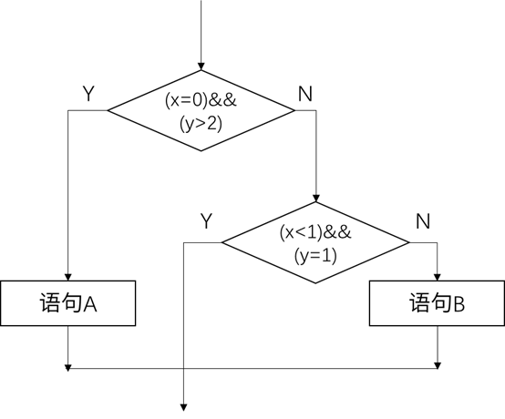

- A. 3
- B. 4
- C. 6
- D. 8

## 第31题（单选题）

软件可维护性是一个系统在特定的时间间隔内可以正常进行维护活动的概率。用MTTF和MTTR分别表示平均无故障时间和平均故障修复时间，则软件可维护性计算公式为（  ）。

- A. MTTF/(1+MTTF)
- B. 1/(1+MTTF)
- C. MTTR/(1+MTTR)
- D. 1/(1+MTTR)

## 第32题（单选题）

某搜索引擎在交付后，开发人员修改了其中的索引方法，使得用户可以更快地得到搜索结果。这种修改属于（  ）维护。

- A. 正确性
- B. 适应性
- C. 完善性
- D. 预防性

## 第33题（单选题）

面向对象分析时，执行的活动顺序通常是（  ）。

- A. 认定对象、组织对象、描述对象的相互作用、确定对象的操作
- B. 认定对象、定义属性、组织对象、确定对象的操作
- C. 认定对象、描述对象间的相互作用、确定对象的操作、识别包
- D. 识别类及对象、识别关系、定义属性、确定对象的操作

## 第34题（单选题）

采用面向对象方法进行系统设计时，不应该强迫客户依赖于他们不用的方法，即：依赖于抽象，不要依赖于具体，同时在抽象级别不应该有对于细节的依赖。这属于（  ）原则。

- A. 单一责任
- B. 开放-封闭
- C. 接口分离
- D. 里氏替换

## 第35题（单选题）

假设Bird和Cat是Animal的子类，Parrot是Bird的子类，bird是Bird的一个对象，cat是Cat的一个对象，parrot是Parrot的一个对象。以下叙述中，不正确的是（  ）。假设Animal类中定义接口move()，Bird、Cat和Parrot分别实现自己的move ()，调用move()时，不同对象收到同一消息可以产生各自不同的结果，这一现象称为（  ）。

### 问题1
- A. cat和bird可看作是Animal的对象
- B. parrot和bird可看作是Animal的对象
- C. bird可以看作是Parrot的对象
- D. parrot可以看作是Bird的对象
### 问题2
- A. 封装
- B. 继承
- C. 消息传递
- D. 多态

## 第36题（单选题）

当UML状态图用于对系统、类或用例的动态方面建模时，通常是对（ ）进行建模。以下UML状态图中，假设活动的状态是A，事件b=0发生并且a > 5为true，会发生的是（ ），D变为活动的状态。有关状态图的叙述中，不正确的是（ ）。
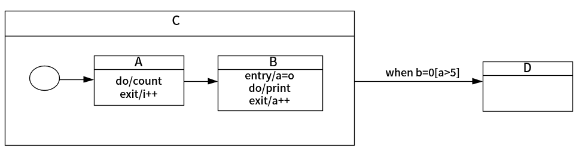

### 问题1
- A. 系统的词汇
- B. 反应型对象
- C. 活动流程
- D. 对象快照
### 问题2
- A. 一旦状态A的exit动作完成，或如果当前执行do动作，则终止执行
- B. 一旦状态A和B的所有动作完成
- C. 一旦正在进行的状态A完成
- D. 一旦状态B的exit动作完成
### 问题3
- A. 动作可以在状态内执行，也可以在状态转换时执行
- B. 当触发转换的事件发生并且转换没有指定的监护条件时，对象将离开当前状态，并且其do动作终止
- C. when(…)称为时间事件
- D. 状态由事件触发

## 第37题（单选题）

股票交易中，股票代理（Broker）根据客户发出的股票操作指示进行股票的买卖操作，设计如下所示类图。该设计采用（ ）模式将一个请求封装为一个对象，从而使得可以用不同的请求对客户进行参数化；对请求排队或记录请求日志，以及支持可撤销的操作。其中，（ ）声明执行操作的接口。该模式属于（ ）模式，该模式适用于：（ ）。
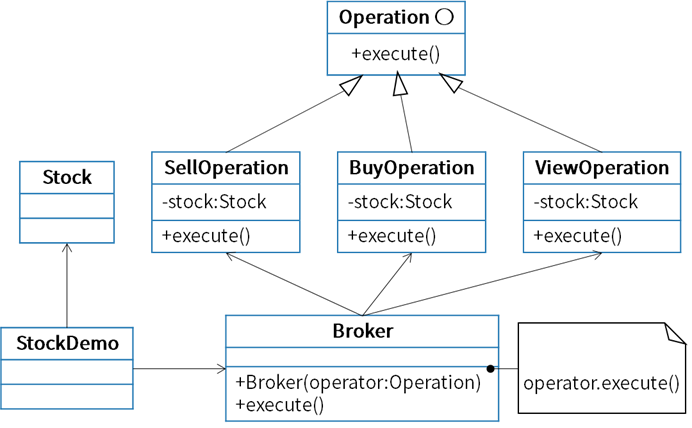

### 问题1
- A. 命令（Command）
- B. 观察者（Observer）
- C. 状态（State）
- D. 中介者（Mediator）
### 问题2
- A. Operation
- B. sellOperation/BayOperation/ViewOperation
- C. Broker
- D. Stock
### 问题3
- A. 结构类型
- B. 结构型对象
- C. 创建类型
- D. 行为型对象
### 问题4
- A. 一个对象必须通知其他对象，而它又不能假定其他对象是谁
- B. 抽象出待执行的动作以参数化某对象
- C. 一个对象的行为决定于其状态且必须在运行时刻根据状态改变行为
- D. 一个对象引用其他对象并且直接与这些对象通信而导致难以复用该对象

## 第38题（单选题）

设有描述简单算术表达的上下文无关文法如下，其中id表示单字母。
E→E+T|T
T→F*T|F
F→id
与使用该文法描述的表达式a+b*c*d相符的语法树为（ ），

- A. 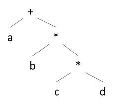
- B. 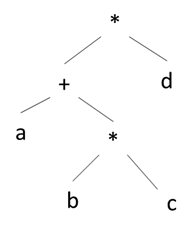
- C. 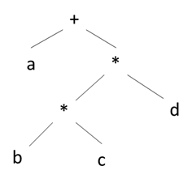
- D. 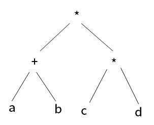

## 第39题（单选题）

下图所示有限自动机（FA）是（  ）。
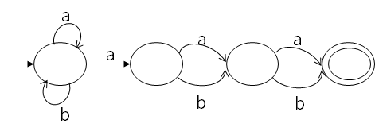

- A. 确定的有限自动机，它能识别以bab结尾的
- B. 确定的有限自动机，他不能识别以bab结尾的
- C. 非确定的有限自动机，他能识别以bab结尾的
- D. 非确定的有限自动机，他不能识别以bab结尾的

## 第40题（单选题）

函数foo、hoo的含义如下所示，函数调用hoo(a,x)的两个参数分别采用引用调用（call by reference）和值调用（call by value）方式传递，则函数调用foo(5)的输出结果为（  ）。
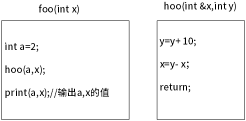

- A. 2，5
- B. 2，15
- C. 13，5
- D. 13，15

## 第41题（单选题）

如下E-R图中，两个实体R1、R2之间有一个联系E。当E的类型为（  ）时，必须将E转换成一个独立的关系模式。
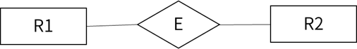

- A. 1：1
- B. 1：*
- C. *：1
- D. *：*

## 第42题（单选题）

给定关系R (U,F)，其中U={A,B,C,D,E,H}，F={A→B,B→DH,A→H,C→E}。关系有（  ），F中（  ）。

### 问题1
- A. 1个候选码A
- B. 2个候选码A、B
- C. 1个候选码AC
- D. 2个候选码A、C
### 问题2
- A. 不存在传递依赖，但存在冗余函数依赖
- B. 既不存在传递依赖，也不存在冗余函数依赖
- C. 存在传递依赖A→D和A→H，但不存在冗余函数依赖
- D. 存在传递依赖A→D和A→H，并且还存在冗余函数依赖

## 第43题（单选题）

某销售公司员工关系E（工号，姓名，部门名，电话，住址）、商品关系C（商品号，商品名，库存数）和销售关系EC（工号，商品号，销售数，销售日期）。查询销售部1在2020年11月11日销售“HUWEI Mate40”商品的员工工号、姓名、部门名及其销售的商品名、销售数的关系代数表达式为π1,2,3,7,8( (  )  ⋈ ( (  ) ⋈ (  ) ) )。

### 问题1
- A. σ3=销售部1(E)
- B. σ3=销售部1(C)
- C. σ3=‘销售部1’(E)
- D. σ3=‘销售部1’(C)
### 问题2
- A. π2,3(σ2=‘HUWEI Mate40’(C))
- B. π1,2(σ2=‘HUWEI Mate40’(C))
- C. π2,3(σ2=‘HUWEI Mate40’(EC))
- D. π1,2(σ2=‘HUWEI Mate40’(EC))
### 问题3
- A. σ4=‘2020年11月11日’(C)
- B. σ3=‘2020年11月11日’(C)
- C. σ4=‘2020年11月11日’(EC)
- D. σ3=‘2020年11月11日’(EC)

## 第44题（单选题）

设有栈S和队列Q且其初始状态为空，数据元素序列a,b,c,d,e,f依次通过栈S，且每个元素从S出栈后立即进入队列Q，若出队列的序列是b,d,f,e,c,a，则S中的元素最多时，从栈底到栈顶的元素依次为（  ）。

- A. a,b,c
- B. a,c,d
- C. a,c,e,f
- D. a,d,f,e

## 第45题（单选题）

当二叉树中的结点数目确定时，（  ）的高度一定是最小的。

- A. 二叉排序树
- B. 完全二叉树
- C. 线索二叉树
- D. 最优二叉树

## 第46题（单选题）

（  ）是对稀疏矩阵进行压缩存储的方式。

- A. 二维数组和双向链表
- B. 三元组顺序表和十字链表
- C. 邻接矩阵和十字链表
- D. 索引顺序表和双向链表

## 第47题（单选题）

设用线性探查法解决冲突构造哈希表且哈希函数为H(key)=key%m，若在该哈希表中查找某关键字e是成功的且与多个关键字进行了比较，则（  ）。

- A. 这些关键字形成一个有序序列
- B. 这些关键字都不是e的同义词
- C. 这些关键字都是e的同义词
- D. 这些关键字的第一个可以不是e的同义词

## 第48题（单选题）

对于一个初始无序的关键字序列，在下面的排序方法中，（  ）第一趟排序结束后，一定能将序列中的某个元素在最终有序序列中的位置确定下来。
①直接插入排序②冒泡排序③简单选择排序④堆排序⑤快速排序⑥归并排序

- A. ①②③⑥
- B. ①②③⑤⑥
- C. ②③④⑤
- D. ③④⑤⑥

## 第49题（单选题）

对数组A=(2,8,7,1,3,5,6,4)构建大顶堆为（  ）（用数组表示）。

- A. (1,2,3,4,5,6,7,8)
- B. (1,2,5,4,3,7,6,8)
- C. (8,4,7,2,3,5,6,1)
- D. (8,7,6,5,4,3,2,1)

## 第50题（单选题）

最大子段和问题描述为，在n个整数（包含负数）的数组A中，求元素之和最大的非空连续子数组，如数组A= (-2,11,-4,13,-5,-2) ，其中子数组B= (11,-4,13)具有最大子段和20 (11-4+13=20) 。求解该问题时，可以将数组分为两个n/2个整数的子数组，则最大子段或者在前半段，或者在后半段，或者跨越中间元素，通过该方法继续划分子问题，直至最后求出最大子段和，该算法的时间复杂度为（  ）。

- A. O(nlgn)
- B. O(n2)
- C. O(n2lgn)
- D. O(n3)

## 第51题（单选题）

在求解某问题时，经过分析发现该问题具有最优子结构和重叠子问题性质。则适宜采用（  ）算法设计策略得到最优解；若定义问题的解空间，并以广度优先的方式搜索解空间，则采用的是（  ）算法设计策略。

### 问题1
- A. 分治
- B. 贪心
- C. 动态规划
- D. 回溯
### 问题2
- A. 动态规划
- B. 贪心
- C. 回溯
- D. 分支限界

## 第52题（单选题）

IPv6地址长度为（  ）bit。

- A. 16
- B. 32
- C. 64
- D. 128

## 第53题（单选题）

在地址栏输入www.abc.com，浏览器默认的应用层协议是（  ）。

- A. HTTP
- B. DNS
- C. TCP
- D. FTP

## 第54题（单选题）

使用电子邮件客户端向服务器发送邮件的协议是（  ）。

- A. SMTP
- B. POP3
- C. IMAP4
- D. MIME

## 第55题（单选题）

以下Windows系统中，用于清除本地DNS缓存的命令是（  ）。

- A. ipconfig /release
- B. ipconfig /flushdns
- C. ipconfig /displaydns
- D. ipconfig /registerdns

## 第56题（单选题）

在网络系统设计时，不可能使所有设计目标都能达到最优，下列措施中较为合理的是（  ）。

- A. 尽量让最低建设成本目标达到最优
- B. 尽量让最短的故障时间目标达到最优
- C. 尽量让最大的安全性目标达到最优
- D. 尽量让优先级较高的目标达到最优

## 第57题（单选题）

Designing object-oriented software is hard,and designing（  ）object-oriented software is even harder.You must find pertinent（相关的）objects,factor them into class at the right granularity,define class interfaces and inheritances,and establish key relationships among them.You design should be specific to the problem at hand but also（  ）enough to address future problems and requirements.You also want to avoid redesign,or at least minimize it.Experienced object-oriented designers will tell you that a reusable and flexible design is difficult if not impossible to get "right" the first time.Before a design is finished,they usually try to reuse it several times,modifying it each time.
Yet experienced object-oriented designers do make good designs.Meanwhile new designers are（  ）by the options available and tend to fall back on non-object-oriented techniques they've used before.lt takes a long time for novices to learn what good object-oriented design is all about.Experienced designers evidently know something inexperienced ones don't.What is it?
One thing expert designers know not to do is solve every problem from first principles.Rather, they reuse solutions that have worked for them in the past.When they find a good（  ）,they use it again and again.Such experience is part of what makes them experts.Consequently,you'll find（  ）patterns of classes and communicating objects in many object-oriented systems.

### 问题1
- A. runnable
- B. right
- C. reusable
- D. pertinent
### 问题2
- A. clear
- B. general
- C. personalized
- D. customized
### 问题3
- A. excited
- B. shocken
- C. surprised
- D. overwhelmed
### 问题4
- A. tool
- B. component
- C. system
- D. solution
### 问题5
- A. recurring
- B. right
- C. experienced
- D. past
