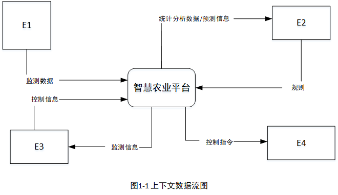
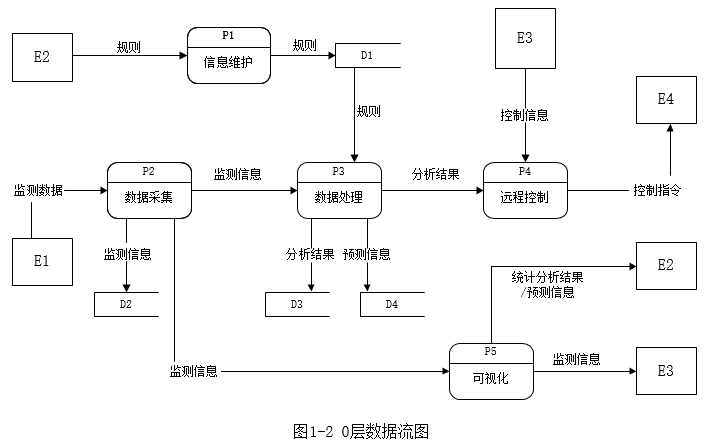
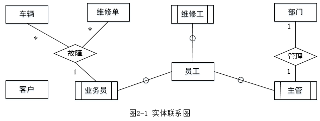
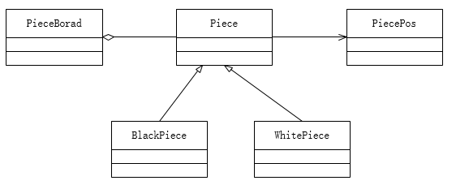
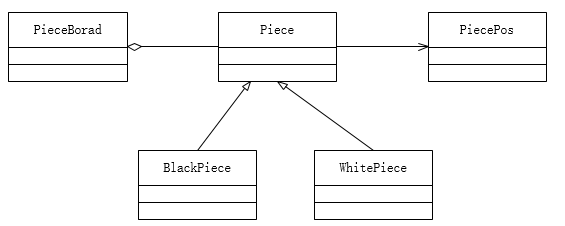

# 2021下半年案例题

- 来源标题: 2021年下半年软件设计师考试应用技术真题（专业解析+参考答案）
- 试卷介绍页: https://wangxiao.xisaiwang.com/tiku2/136/tp30361029.html?cid=136
- 练习页: https://wangxiao.xisaiwang.com/tiku2/exam534904272.html
- 题量: 6

## 第1题（案例题）

阅读下列说明和图，回答问题1至问题4，将解答填入答题纸的对应栏内。
【说明】某现代农业种植基地为进一步提升农作物种植过程的智能化，欲开发智慧农业平台，集管理和销售于一体，该平台的主要功能有：
1.信息维护。农业专家对农作物、环境等监测数据的监控处理规则进行维护。
2.数据采集。获取传感器上传的农作物长势、土壤墒情、气候等连续监测数据，解析后将监测信息进行数据处理、可视化和存储等操作。
3.数据处理。对实时监测信息根据监控处理规则进行监测分析，将分析结果进行可视化并进行存储、远程控制对历史监测信息进行综合统计和预测，将预测信息进行可视化和存储。
4.远程控制。根据监控处理规则对分析结果进行判定，依据判定结果自动对控制器进行远程控制。平台也可以根据农业人员提供的控制信息对控制器进行远程控制。
5.可视化。实时向农业人员展示监测信息，实时给农业专家展示统计分析结果和预测信息或根据农业专家请求进行展示。
现采用结构化方法对智慧农业平台进行分析与设计，获得如图1-1所示的上下文数据流图和图1-2所示的0层数据流图。

### 补充题面

【问题1】（4分）
使用说明中的词语，给出图1-1中的实体E1~E4的名称。
【问题2】（4分）
使用说明中的词语，给出图1-2中的数据存储D1~D4的名称。
【问题3】（4分）
根据说明和图中术语，补充图1-2中缺失的数据流及其起点和终点。
【问题4】（3分）
根据说明，“数据处理”可以分解为哪些子加工？进一步进行分解时，需要注意哪三种常见的错误？

### 参考答案

【问题1】
E1:传感器;E2:农业专家;E3:农业人员;E4:控制器
【问题2】
D1:监控处理规则文件 D2:监测信息文件 D3:分析结果文件 D4:预测信息文件
【问题3】
起点D1，终点P4，监控规则
起点D2，终点P3，历史监测信息
起点P3，终点P5，分析结果
起点P3，终点P5，预测信息
【问题4】
数据处理加工分为数据分析，可视化与存储；
黑洞、奇迹、灰洞

### 解析

问题1：补充实体名，找出题干给出的名词形式。
可以通过下方0层图对比，根据“农业专家对农作物、环境等监测数据的监控处理规则进行维护。”描述，我们可知E2是农业专家；根据“获取传感器上传的农作物长势、土壤墒情、气候等连续监测数据”得知E1是传感器；根据“平台也可以根据农业人员提供的控制信息对控制器进行远程控制”，得知E3是农业人员；根据“根据监控处理规则对分析结果进行判定，依据判定结果自动对控制器进行远程控制。”，得知E4是控制器。
问题2：补充数据存储，给出题干关键信息，文件，数据、表、信息等名词。
通过下文0层图信息得知，根据“农业专家对农作物、环境等监测数据的监控处理规则进行维护。”，可知D1是存储相关监控处理规则文件；根据“解析后将监测信息进行数据处理、可视化和存储等操作。”得知D2是监测信息文件；根据“对实时监测信息根据监控处理规则进行监测分析，将分析结果进行可视化并进行存储”，可知D3和D4分别是分析结果文件和预测信息文件。
问题3：补充数据流，根据平衡原则和题干的提示。
根据题干描述，对于加工和数据存储或加工与加工之间的数据流。
根据题干“根据监控处理规则对分析结果进行判定”得知存在一条有D1-P4监控规则；
根据题干“实时给农业专家展示统计分析结果和预测信息”得知存在P3-P5的分析结果和P3-P5的预测结果。
 说明3中“对历史监测信息进行综合统计分析和预测”，而在图1-2中缺少从D2到P3的数据流“历史监测信息”。  
问题4：数据处理根据题干描述“对实时监测信息根据监控处理规则进行监测分析，将分析结果进行可视化并进行存储、远程控制对历史监测信息进行综合统计和预测，将预测信息进行可视化和存储。”可分为数据分析，可视化和存储三个步骤。需要注意哪三种常见的错误：黑洞、奇迹、灰洞。

## 第2题（案例题）

回答问题1至问题4
【说明】
某汽车维修公司为了便于管理车辆的维修情况，拟开发一套汽车维修管理系统，请根据下述需求描述完成该系统的数据库设计。
【需求描述】
（1）客户信息包括：客户号、客户名、客户性质、折扣率、联系人、联系电话。客户性质有个人或单位。客户号唯一标识客户关系中的每一个元组。
（2）车辆信息包括：车牌号、车型、颜色和车辆类别。一个客户至少有一辆车，一辆车只属于一个客户。
（3）员工信息包括：员工号、员工名、岗位、电话、家庭住址。其中，员工号唯一标识员工关系中的每一个元组。岗位有业务员、维修工、主管。业务员根据车辆的故障情况填写维修单。
（4）部门信息包括：部门号、名称、主管和电话，其中部门号唯一确定部门关系的每一个元组。每个部门只有一名主管，但每个部门有多名员工，每名员工只属于一个部门。
（5）维修单信息包括：维修单号、车牌号、维修内容、工时、维修员工号。维修单号唯一标识维修单关系中的每一个元组。一个维修工可接多张维修单，但一张维修单只对应一个维修工。
【概念模型设计】根据需求阶段收集的信息，设计的实体联系图(不完整)如图2-1所示

【逻辑结构设计】
根据概念模型设计阶段完成的实体联系图，得出如下关系模式(不完整):
客户(客户号，客户名，(a)，折扣率，联系人，联系电话)
车辆(车牌号，(b)，车型，颜色，车辆类别)
员工(员工号，员工名，岗位，(c)，电话，家庭住址)
部门(部门号，名称，主管，电话)
维修单(维修单号，(d)，维修内容，工时)

### 补充题面

【问题1】(6分)
根据问题描述，补充3个联系，完善图2-1的实体联系图。联系名可用联系1、联系2和联系3代替，联系的类型为1:1、1:n和m:n(或1:1、1:*和*.*)。
【问题2】(4分)
根据题意，将关系模式中的空(a)~(d)的属性补充完整，并填入答题纸对应的位置上。
【问题3】(2分)
分别给出车辆关系和维修单关系的主键与外键。
【问题4】(3分)
如果一张维修单涉及多项维修内容，需要多个维修工来处理，那么哪个联系类型会发生何种变化?你认为应该如何解决这一问题?

### 参考答案

【问题1】(6分)
联系1:客户和车辆：1:n
联系2:部门和员工：1:n
联系3:维修工和维修单：1:n
【问题2】(4分)
a：客户性质  b：客户号  c：部门号  d：车牌号，维修员工号
【问题3】(2分)
车辆关系的主键：车牌号    外键：客户号
维修单关系的主键：维修单号  外键：车牌号，维修员工号
【问题4】(3分)
维修工和维修单之间的联系类型会发生变化，从1:n变成m:n。
对应的需要增加维修关系，m：n关系不能归并，需要将其单独加入一个联系中，将维修单的属性员工号（维修工）删掉，新建一个关系模式维修。
维修（员工号（维修工），维修单号，维修地点，维修时间）

### 解析

问题1：补充实体联系图，根据题干描述，进行补充。
根据题干描述：“一个客户至少有一辆车，一辆车只属于一个客户”，可知客户与车辆的联系为客户和车辆：1:n；根据“但每个部门有多名员工，每名员工只属于一个部门。”得知部门与员工的联系为部门和员工：1:n；根据“一个维修工可接多张维修单，但一张维修单只对应一个维修工。”维修工与维修单的联系为维修工和维修单：1:n。
问题2：补充相关关系的属性。结合E-R转换为关系模式的三种原则和题干补充关系属性。
a空，根据题干描述“客户信息包括：客户号、客户名、客户性质、折扣率、联系人、联系电话。”，可知缺失属性客户性质，由于其与车辆为1：n，没有相对应的归并过程，应该将1端的主键客户号加入到车辆关系中。所以a空填写客户性质；
b空，根据题干描述“车辆信息包括：车牌号、车型、颜色和车辆类别”，与关系模式对比，没有缺少，缺失的应该是上方提到的将1端的主键客户号加入到车辆关系中，所以b空应该填写车辆号；
c空，根据题干描述“员工信息包括：员工号、员工名、岗位、电话、家庭住址。”与关系模式相比，没有缺失，根据第一问得知，存在部门与员工的1：n关系，应该将部门的主键部门号归并到员工信息中，故c空应该填写部门号；
d空，根据题干描述“维修单信息包括：维修单号、车牌号、维修内容、工时、维修员工号。”对比发现缺失车牌号属性，其次在问题1中提到维修工和维修单存在1：n的联系，应该将维修工的主键归并到维修单信息中，可以填写维修工，员工号，或维修员工号都可以。d空填写车牌号，维修员工号。
问题3：找出对应的主外键，结合E-R转换为关系模式的三种原则和题干给出的信息找出主、外键。
对于车辆关系而言，主键应该为多端车牌号，车牌号唯一标识主键。外键为归并过来的客户主键客户号。
对于维修单关系而言，主键应该为唯一标识的维修单号，外键为归并过来的车牌号和员工号。
问题4：如果一张维修单涉及多项维修内容，需要多个维修工来处理，应该将前面维修单与维修工的比值1：n变成m：n，对应的需要增加维修关系，m：n关系不能归并，需要将其单独加入一个联系中，将维修单的属性员工号（维修工）删掉，新建一个关系模式维修。
维修（员工号（维修工），维修单号，维修地点，维修时间）

## 第3题（案例题）

阅读下列说明和图，回答问题1至问题3，将解答填入答题纸的对应栏内。
【说明】
某游戏公司欲开发一款吃金币游戏。游戏的背景为一种回廊式迷宫(Maze)，在迷宫的不同位置上设置有墙。迷宫中有两种类型的机器人(Robots)：小精灵(PacMan)和幽灵(Ghost)。游戏的目的就是控制小精灵在迷宫内游走，吞吃迷宫路径上的金币，且不能被幽灵抓到。幽灵在迷宫中游走，并会吃掉遇到的小精灵。机器人游走时，以单位距离的倍数计算游走路径的长度。当迷宫中至少存在一个小精灵和一个幽灵时，游戏开始。
机器人上有两种传感器，使机器人具有一定的感知能力。这两种传感器分别是：
（1）前向传感器(FrontSensor)，探测在机器人当前位置的左边、右边和前方是否有墙(机器人遇到墙时，必须改变游走方向)。机器人根据前向传感器的探测结果，决定朝哪个方向运动。
（2）近距离传感器(ProxiSesor)，探测在机器人的视线范围内(正前方)是否存在隐藏的金币或幽灵。近距离传感器并不报告探测到的对象是否正在移动以及朝哪个方向移动。但是如果近距离传感器的连续两次探测结果表明被探测对象处于不同的位置，则可以推导出该对象在移动。
另外，每个机器人都设置有一个计时器(Timer)，用于支持执行预先定义好的定时事件。
机器人的动作包括：原地向左或向右旋转90°；向前或向后移动。
建立迷宫：用户可以使用编辑器(Editor) 编写迷宫文件，建立用户自定义的迷宫。将迷宫文件导入游戏系统建立用户自定义的迷宫。
现采用面对对象分析与设计方法开发该游戏，得到如图3-1所示的用例图以及图3-2所示的初始类图。

### 补充题面

【问题1】(3分)
根据说明中的描述，给出图3-1中U1~U3所对应的用例名。
【问题2】(4分)
图3-1中用例U1~U3分别与哪个(哪些)用例之间有关系，是何种关系?
【问题3】(8分)
根据说明中的描述，给出图3-2中C1~C8所对应的类名。

### 参考答案

【问题1】(3分)
U1编写迷宫文件;
U2导入迷宫文件;
U3设置计时器。
或者
U1是导入文件，U2,U3分别是旋转、移动
【问题2】(4分)
U1和U2与建立迷宫用例是泛化关系;U3与操作机器人是包含关系。
或者
导入文件与建立迷宫是包含关系。
旋转、移动 和 操作机器人 是泛化关系。
【问题3】(8分)
C1 机器人(Robots)；C2 计时器(Timer)；C3小精灵(PacMan)；C4幽灵(Ghost) ； C5 传感器（Sensor) ；  C6 前向传感器(FrontSensor) ； C7 近距离传感器(ProxiSesor)； C8 迷宫(Maze)
其中C3与C4可换；C6与C7可换

### 解析

【问题1】
在用例图中，U1、U2、U3并没有与其它用例相连，无法得到直接的信息。
但是可以从距离上得出一些信息。U1和建立迷宫应该有关，U3和操作机器人有关，
U2可能和两者中任意一个有关。找到题干中和操作机器人有关的内容，发现有设置计时器、
以及四个动作。四个动作肯定是要排除的，因为用例图中没有。所以，暂时留下设置计时器。
接下来找到建立迷宫有关的内容，发现有两种方式建立迷宫。这跟用例图此时可以对应上。
所以目前来说比较合适的答案就是U1编写迷宫文件、U2导入迷宫文件、U3设置计时器。
或者 可以把U1看成导入文件，U2,U3就看成简单旋转和移动，不描述具体的方向。
【问题2】
U1和U2与建立迷宫用例是泛化关系;U3与操作机器人是包含关系。
通过问题的分析，U1和U2是具体用例，建立迷宫是特殊用例，双方之间是泛化关系。
机器人每次操作前，都需要用传感器进行周边环境扫描，这个需要启动计时器执行，所以
操作机器人包含U3。
也可以 说导入文件与建立迷宫是包含关系。
旋转、移动 是操作机器人的两种具体方式，是泛化关系。
【问题3】
通过观察类图，发现C1与C3、C4有子父关系，C5和C6、C7有子父关系，同时C1包含C5，所以先从这6者开始分析。
先把题干中所有英文单词找出来，可以轻松发现C1 机器人(Robots)、C3小精灵(PacMan)、C4幽灵(Ghost) 、 C5 传感器（Sensor) 、C6 前向传感器(FrontSensor) 、C7 近距离传感器(ProxiSesor)。剩下的C8和C2只能是Timer以及Maze。结合C1包含C2，C8包含C1，可以确定C8 迷宫(Maze)、C2 计时器(Timer)。
其中C3与C4可换；C6与C7可换。

## 第4题（案例题）

生物学上通常采用编辑距离来定义两个物种DNA序列的相似性，从而刻画物种之间的进化关系。具体来说，编辑距离是指将一个字符串变换为另一个字符串所需要的最小操作次数。操作有三种，分别为：插入一个字符、删除一个字符以及将一个字符修改为另一个字符。用字符数组str1和str2分别表示长度分别为len1和len2的字符串，定义二维数组d记录求解编辑距离的子问题最优解，则该二维数组可以递归定义为：

【C代码】
下面是算法的C语言实现。
（1）常量和变量说明
A，B：两个字符数组
d：二维数组
i，j：循环变量
temp：临时变量
（2）C程序
#include
#define N 100
char A[N]="CTGA";
char B[N]="ACGCTA";
int d[N][N];
int min(int a, int b){
return a **}
int editdistance(char *str1, int len1, char *str2, int len2){
int i, j;
int diff;
int temp;
for(i=0; i<=len1; i++){
 d[i][0]=i;
}
for(j=0; j<=len2; j++){
 （1） ；
}
for(i=1;i<=len1;i++){
for(j=1; j<=len2; j++){
 if( （2） ){
d[i][j]=d[i-1][j-1];
 }else{
temp=min(d[i-1][j]+1, d[i][j-1]+1);
d[i][j]=min(temp, （3） );
 }
 }
 }
return （4） ;
}
**
**
**

### 补充题面

【问题1】(8分)
根据说明和C代码，填充C代码中的空(1)~(4)。
【问题2】(4分)
根据说明和C代码，算法采用了(5)设计策略，时间复杂度为(6)(用O符号表示，两个字符串的长度分别用m和n表示)。
【问题3】(3分)
已知两个字符串A="CTGA"和B="ACGCTA"，根据说明和C代码，可得出这两个字符串的编辑距离为(7)。

### 参考答案

问题1：
  (1) d[0][j]=j
  (2) str1[i-1]==str2[j-1]
  (3) d[i-1][j-1] +1
  (4) d[len1][len2]
问题2：
（5）动态规划法    （6）O(mn)
问题3：
 （7）4

### 解析

（1）前面一个循环是初始化，所以考虑第一空循环内，也应该是对d[i][]进行初始化，因此填写d[0][j]=j。
第3空是题干中的递归式的迭代实现，因此（2）应填写str1[i-1]==str2[j-1]，而空（3）应填写d[i-1][j-1]+ 1，即在d[i-1][i] +1, d[i][j-1]+ 1和d[i-1]j-1]+ 1三个值中选择最小的一个作为子问题的编辑距离。
（4）是要返回求得的最优解的值，即两个序列的编辑距离等于多少，因此填写d[len1 ][len2]。
从题干说明来看这是一个动态规划算法，问题的最优解通过子问题的最优解来描述，因此（5）应填写动态规划。
（6）是考查考生通过阅读程序来分析时间复杂度，此程序有两个单层循环，一个两层循环，所以是O(mn)，（6）应填写O(mn)。
（7）是4，也就是B字符串删除ACG，再插入一个G即可。

## 第5题（案例题）

阅读下列说明和C++代码，将应填入（n）处的字句写在答题纸的对应栏内。
【说明】
享元(flyweight)模式主要用于减少创建对象的数量，以降低内存占用,提高性能。现要开发一个网络围棋程序，允许多个玩家联机下棋。由于只有一台服务器，为节省内存空间，采用享元模式实现该程序，得到如图5-1所示的类图。

图5-1 类图

### 补充题面

【C++代码】
#include<iostream>
#include<vector>
using namespace std;
enum PieceColor{ BLACK, WHITE}; //棋子颜色
class PiecePos{ //棋子位置
private:
 int x;
int y;
public:
PiecePos(int a, int b): x(a), y(b){}
int getX(){ return x;}
int getY()( return y;)
};
class Piece{ //棋子定义
protected:
PieceColor m_color; //颜色
PiecePos m_pos; //位置
Public:
Piece（pieceColor color, PiecePos pos ）: m_color（color）, m_pos（pos）{}
（1）；
}；
class BlackPiece:public Piece{
public:
BlackPiece（PieceColor color, PiecePos pos）:Piece（color; pos）{}
void Draw（）{cout<<“draw a black piece”<<endl;（4）;
}
else{ //放白子
piece=new WhitePiece（color,pos）; //获取一颗白子
cout<<m_whiteName<<“在位置（“<<”,“<<pos.gety（）<<”）”;
（5）;
}
m_vecPiece.push_back（piece）;
}
};
</endl;}
</endl;}

### 参考答案

(1) virtual void Draw()=0
(2) Piece*
(3) Piece *
(4) piece->Draw()
(5) piece->Draw()

### 解析

（1）要求填写的是Piece 中的一个成员函数。Piece 需要提供一个供其子类使用的接口。可以使用纯虚拟函数来实现接口。结合子类BlackPiece和WhitePiece的定义，确定（1）空处填入的是virtual void Draw()= 0。
（2）空确定类PieceBoard中m_ vecPiece 的类型。这里使用容器vector 来表达棋子，因此（2）空应填入Piece *。同理（3）空填入Piece *。（4）空和（5）空考查享元模式的使用，调用享元提供的操作，（4）、（5）空都填入piece->Draw（）。

## 第6题（案例题）

阅读下列说明和Java代码，将应填入（n）处的字句写在题纸的对应栏内。
【说明】
享元（flyweight）模式主要用于减少创建对象的数量，以低内存占用，提高性能。现要开发一个网络围棋程序允许多个玩家联机下棋。由于只有一台服务器，为节内存空间，采用享元模式实现该程序，得到如图6-1所的类图。

图6-1 类图
【Java代码】
import java.util.*:
enum PieceColor ｛BLACK，WHITE｝／／棋子颜色
class PiecePos｛／／棋子位置
private intx;
private int y;
pubic PiecePos(int a,int b){
x=a;
y=b;
}
public int getX( ){
return x;
}
public int getY( ){
return y;
  }
}
abstract class Piece｛／／棋子定义
protected PieceColor m＿color；／／颜色
protected Piecemopos m＿pos；／／位置
public Piece(PieceColor color,PiecePos pos){
m_color=color;
m＿pos=pos;
}
(1);
}
class BlackPiece extends Piece{
public BlackPiece(PieceColor  color,PiecePos pos){
super(color,pos);
}
public void draw ( ) {
System out println("draw a black piece");
  }
}
class WhitePiece extends Piece{
public WhitePiece(PieceColor  color,PiecePos pos){
super(color,pos);
}
public void draw( ) {
System.out.println("draw a white piece");
  }
}
class PieceBoard{
／／棋盘上已有的棋子
private static final  ArrayList<(2)>m_arrayPiece=new ArrayList
private String m＿blackName；／／黑方名称
private String m＿whiteName；／／白方名称
public PieceBoard(String black,String  white){
m_blackName=black;
m_whiteName=white;
 }
／／一步棋，在棋盘上放一颗棋子
public void SetePiece(PieceColor  color,PiecePos pos){
(3)piece=null;
if（color＝＝PieceColor.BLACK）{／／放黑子
piece＝new BlackPiece（color，pos）；／／获取一颗黑子
System．out．println（m＿blackName＋＂在位置（＂＋pos．getX( )+","+pos.getY( )+")");
(4) ;
}
else｛／／放白子
piece＝new WhitePiece（color，pos）；／／获取一颗白子
System．out．println（m whiteName＋＂在位置（＂＋pos．getX0）＋","+pos.getYO+")");
(5) ;
}
m_arrayPiece.add(piece);
}
}

### 参考答案

（1）public abstract void draw( )
（2）Piece
（3）Piece
（4）piece.draw( )
（5）piece.draw( )

### 解析

对于第一空，可知该空需要填写的是 Piece类里面的方法，对于其方法在图中都无法找出，可以根据其实现类（BlackPiece和WhitePiece类）来看，对应得是方法public  void draw( )，又由于其在抽象类Piece里面，所以是抽象方法，需要加上关键词abstract，则为public abstract void draw( )
对于第二空，可知该空填写的是动态数组Arraylist的泛型，<>里面填写得应该是对应的m_arrayPiece的类型，用类进行修饰，可知其属于Piece类，填写的应该是Piece
对于第三空，可知该空填写的是对象创建的声明对象过程，格式应该为类名 对象名称=null，可知该对象piece对应的类是Piece（类名字母大写）
对于第四空和第五空，根据注释来看，是放黑子和白子的过程，已知实例化该对象piece，具体的放黑子和白子过程，都需要调用draw（）方法来指向，故 第4空和第5空填写的应该都是piece.draw( )
