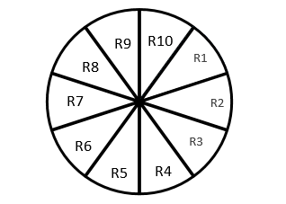
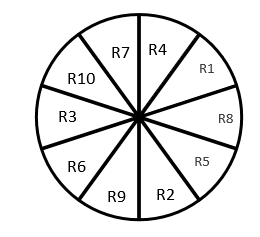
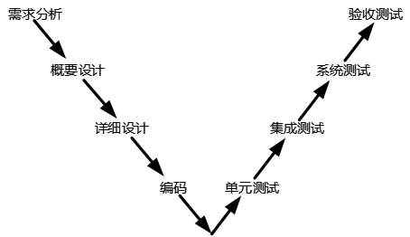
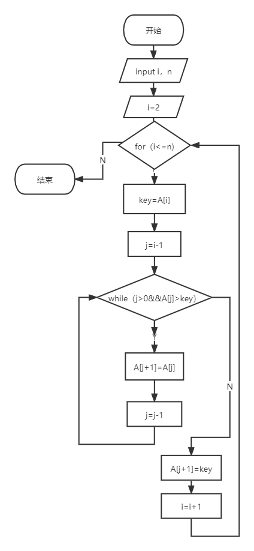
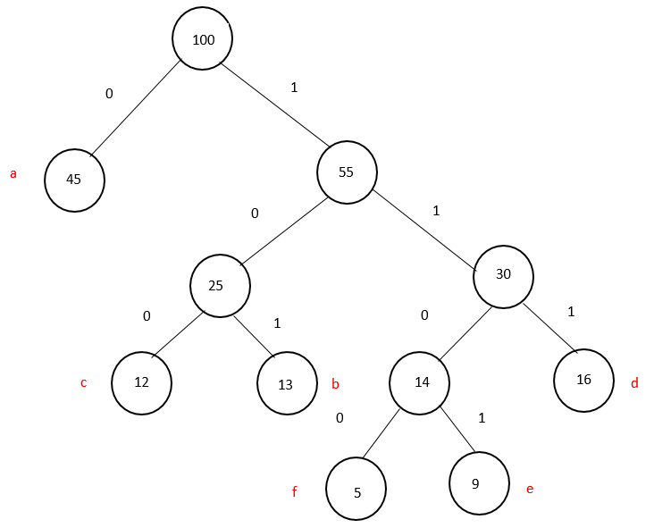

# 2021下半年选择题

- 来源标题: 2021年下半年软件设计师考试基础知识真题（专业解析+参考答案）
- 试卷介绍页: https://wangxiao.xisaiwang.com/tiku2/136/tp30361022.html?cid=136
- 练习页: https://wangxiao.xisaiwang.com/tiku2/exam534904275.html
- 题量: 56

## 第1题（单选题）

计算机指令系统采用多种寻址方式。立即寻址是指操作数包含在指令中，寄存器寻址是指操作数在寄存器中，直接寻址是指操作数的地址在指令中。这三种寻址方式操作数的速度（A）。

- A. 立即寻址最快，寄存器寻址次之，直接寻址最慢
- B. 寄存器寻址最快，立即寻址次之，直接寻址最慢
- C. 直接寻址最快， 寄存器寻址次之，立即寻址最慢
- D. 寄存器寻址最快，直接寻址次之，立即寻址最慢

### 正确答案

A

### 解析

本题考查的是寻址方式。
有关于寻址方式查询速度：
立即寻址是操作数直接在指令中，速度是最快的；
寄存器寻址是将操作数存放在寄存器中，速度中间；
直接寻址方式是指令中存放操作数的地址，速度最慢。
BCD描述错误，本题应选择A选项。

## 第2题（单选题）

以下关于PCI总线和SCSI总线的叙述中，正确的是（D）。

- A. PCI总线是串行外总线，SCSI总线是并行内总线
- B. PCI总线是串行内总线，SCSI总线是串行外总线
- C. PCI总线是并行内总线，SCSI总线是串行内总线
- D. PCI总线是并行内总线，SCSI总线是并行外总线

### 正确答案

D

### 解析

本题考查的是常见总线的分类。
PCI总线：是目前微型机上广泛采用的内总线，采用并行传输方式。
SCSI总线：小型计算机系统接口时一条并行外总线，广泛用于连接软硬磁盘、光盘、扫描仪等。
综上所述，本题选择D选项。

## 第3题（单选题）

以下关于中断方式与DMA方式的叙述中，正确的是（A）。

- A. 中断方式与DMA方式都可实现外设与CPU之间的并行工作
- B. 程序中断方式和DMA方式在数据传输过程中都不需要CPU的干预
- C. 采用DMA方式传输数据的速度比程序中断方式的速度慢
- D. 程序中断方式和DMA方式都不需要CPU保护现场

### 正确答案

A

### 解析

本题考查的是输入/输出技术的方式。
输入/输出技术的三种方式：
直接查询控制：有无条件传送和程序查询方式，都需要通过CPU执行程序来查询外设的状态，判断外设是否准备好接收数据或准备好了向CPU输入的数据。在这种情况下CPU不做别的事情，只是不停地对外设的状态进行查询。
中断方式：当I/O系统与外设交换数据时，CPU无须等待也不必查询I/O的状态，而可以抽身来处理其他任务。当I/O系统准备好以后，则发出中断请求信号通知CPU，CPU接到中断请求信号后，保存正在执行的程序的现场，转入I/O中断服务程序的执行，完成与I/O系统的数据交换，然后再返回被打断的程序继续执行。与程序控制方式相比，中断方式因为CPU无需等待而提高了效率。
DMA：直接寄存器存取方式，是指数据在内存与I/O设备间的直接成块传送，即在内存与I/O设备间传送一个数据块的过程中，不需要CPU的任何干涉，只需要CPU在过程开始启动与过程结束时的处理，实际操作由DMA硬件直接执行完成。
所以中断方式与DMA方式都可实现外设与CPU之间的并行工作，BCD描述错误，本题选择A选项。

## 第4题（单选题）

中断向量提供（C）。

- A. 被选中设备的地址
- B. 待传送数据的起始地址
- C. 中断服务程序入口地址
- D. 主程序的断点地址

### 正确答案

C

### 解析

本题考查的是输入输出技术的中断方式。
中断向量表：中断向量表用来保存各个中断源的中断服务程序的入口地址。当外设发出中断请求信号以后，由中断控制器确定其中断号，并根据中断号查找中断向量表来取得其中断服务程序的入口地址，同时INTC把中断请求信号提交给CPU。A、B、D选项中的地址中断向量表并不提供，本题选择C项。

## 第5题（单选题）

（B）是一种需要通过周期性刷新来保持数据的存储器件。

- A. SRAM
- B. DRAM
- C. FLASH
- D. EEPROM

### 正确答案

B

### 解析

本题考查的是存储器类型。
DRAM：动态随机存取存储器，又叫主存，是与CPU直接交换数据的内部存储器。它可以随时读写（刷新时除外），而且速度很快，通常作为操作系统或其他正在运行中的程序的临时数据存储媒介，通过周期性刷新来保持数据的存储器件，断电丢失。
SRAM：静态随机存取存储器，静态随机存取存储器是随机存取存储器的一种。所谓的“静态”，是指这种存储器只要保持通电，里面储存的数据就可以恒常保持。B选项正确。
FLASH：闪存，特性介于EPROM和EEPROM之间，类似于EEPROM，也可以使用电信号进行信息的擦除操作。整块闪存可以在数秒内删除。
EEPROM：电擦除可编程的只读存储器，与EPROM相似，EEPROM中的内容既可以读出，也可以进行改写。
ACD不符合题意，本题选择B选项。

## 第6题（单选题）

某种机器的浮点数表示格式如下(允许非规格化表示)。若阶码以补码表示，尾数以原码表示，则1 0001 0 0000000001表示的浮点数是（B）。

- A. 2-16×2-10
- B. 2-15×2-10
- C. 2-16× （1-2-10）
- D. 2-15× （1-2-10）

### 正确答案

B

### 解析

本题考查浮点数表示。
浮点数表示：N=尾数*基数^指数
其中尾数是用原码表示，是一个小数，通过表格和题干可知， 0 0000000001是尾数部分，共计后11位，其中第1位为0表示正数，展开得2-10阶码部分是用补码表示，是一个整数，通过表格和题干可知，1 0001是整数部分，共计前5位，要计算其具体数值需要将其转换成原码，通过第1位符号位1可知其为负数，补码：10001  ，反码：10000    原码：11111，数据为-15，基数在浮点数表示为2，可得2-15×2-10  。
ACD不符合，本题选择B选项。

## 第7题（单选题）

以下可以有效防治计算机病毒的策略是（C）。

- A. 部署防火墙
- B. 部署入侵检测系统
- C. 安装并及时升级防病毒软件
- D. 定期备份数据文件

### 正确答案

C

### 解析

本题考查的是网络安全控制技术。
A选项、部署防火墙：防火墙技术是通过有机结合各类用于安全管理与筛选的软件和硬件设备，帮助计算机网络于其内、外网之间构建一道相对隔绝的保护屏障，以保护用户资料与信息安全性的一种技术，并不能有效的防范病毒。
B选项、部署入侵检测系统：入侵检测系统（intrusion detection system，简称“IDS”）是一种对网络传输进行即时监视，在发现可疑传输时发出警报或者采取主动反应措施的网络安全设备。是对一种网络传输的监视技术，并不能有效的防范病毒。
C选项、安装并及时升级防病毒软件：针对于防病毒软件本身就是防范病毒最有效最直接的方式。C选项正确。
D选项、定期备份数据文件：数据备份是容灾的基础，是指为防止系统出现操作失误或系统故障导致数据丢失，而将全部或部分数据集合从应用主机的硬盘或阵列复制到其它的存储介质的过程。是为了防止系统数据流失，不能有效的防范病毒。
综上所述，本题选择C选项。

## 第8题（单选题）

AES是一种（C）算法。

- A. 公钥加密
- B. 流密码
- C. 分组加密
- D. 消息摘要

### 正确答案

C

### 解析

本题考查的是加密算法。
A、公钥加密，也叫非对称（密钥）加密（public key encryption），属于通信科技下的网络安全二级学科，指的是由对应的一对唯一性密钥（即公开密钥和私有密钥）组成的加密方法，常见的公钥加密算法有RSA、EIGama、背包算法等。
B、流加密，是对称加密算法的一种，加密和解密双方使用相同伪随机加密数据流作为密钥，明文数据每次与密钥数据流顺次对应加密，得到密文数据流。常见的流密码加密算法有：RC4、ORYX、SEAL等。
C、分组加密将明文分成多个等长的模块（block），使用确定的算法和对称密钥对每组分别加密解密，常见的分组加密算法有DES、AES等。所以C选项正确。
D、消息摘要（Message Digest）又称为数字摘要（Digital Digest）。它是唯一对应一个消息或文本的固定长度的值，它由一个单向Hash加密函数对消息进行作用而产生。常见的消息摘要算法有MD、SHA、MAC等。
综上所述，答案选择C项。

## 第9题（单选题）

下列不能用于远程登录或控制的是（A）。

- A. IGMP
- B. SSH
- C. Telnet
- D. RFB

### 正确答案

A

### 解析

本题考查的是网络安全协议。
IGMP：属于网络的组播协议，不能实现相关应用层的远程登录。A选项正确。
SSH：SSH 为建立在应用层基础上的安全协议。SSH 是较可靠，专为远程登录会话和其他网络服务提供安全性的协议。
Telnet：Telnet协议是TCP/IP协议族中的一员，是Internet远程登录服务的标准协议和主要方式。它为用户提供了在本地计算机上完成远程主机工作的能力。在终端使用者的电脑上使用telnet程序，用它连接到服务器。
RFB：RFB （ Remote Frame Buffer 远程帧缓冲） 协议是一个用于远程访问图形用户界面的简单协议。由于 RFB 协议工作在帧缓冲层，因此它适用于所有的窗口系统和应用程序。
综上所述，本题选择A项。

## 第10题（单选题）

包过滤防火墙对（C）的数据报文进行检查。

- A. 应用层
- B. 物理层
- C. 网络层
- D. 链路层

### 正确答案

C

### 解析

本题考查的是包过滤防火墙的工作原理。
包过滤防火墙是最简单的一种防火墙，它在网络层截获网络数据包，根据防火墙的规则表，来检测攻击行为。包过滤防火墙一般作用在网络层（IP层），故也称网络层防火墙（Network Lev Firewall）或IP过滤器（IP filters）。数据包过滤（Packet Filtering）是指在网络层对数据包进行分析、选择。通过检查数据流中每一个数据包的源IP地址、目的IP地址、源端口号、目的端口号、协议类型等因素或它们的组合来确定是否允许该数据包通过。在网络层提供较低级别的安全防护和控制。
所以答案选择C选项。

## 第11题（单选题）

防火墙通常分为内网、外网和DMZ三个区域，按照受保护程度，从低到高正确的排列次序为（B）。

- A. 内网、外网和DMZ
- B. 外网、 DMZ和内网
- C. DMZ、内网和外网
- D. 内网、DMZ和外网

### 正确答案

B

### 解析

本题考查的是应用级关于屏蔽子网的防火墙。
在一个用路由器连接的局域网中，我们可以将网络划分为三个区域：安全级别最高的LAN Area（内网），安全级别中等的DMZ区域和安全级别最低的Internet区域（外网）。三个区域因担负不同的任务而拥有不同的访问策略。所以受保护程度由低到高为外网、DMZ、内网。
综上所述，B选项正确。

## 第12题（单选题）

（C）是构成我国保护计算机软件著作权的两个基本法律文件。

- A. 《计算机软件保护条例》和《软件法》
- B. 《中华人民共和国著作权法》和《软件法》
- C. 《中华人民共和国著作权法》和《计算机软件保护条例》
- D. 《中华人民共和国版权法》和《中华人民共和国著作权法》

### 正确答案

C

### 解析

本题考查知识产权的保护范围和对象。
保护软件著作权的法律有：《计算机软件保护条例》、《中华人民共和国著作权法》等法律法规。对自然人软件著作权的保护期为自然人终生及其死亡后50年。
所以C选项符合条件，答案选C。

## 第13题（单选题）

X公司接受Y公司的委托开发了一款应用软件，双方没有订立任何书面合同。在此情形下，（B）享有该软件的著作权。

- A. X、Y公司共同
- B. X公司
- C. Y公司
- D. X、Y公司均不

### 正确答案

B

### 解析

考查委托开发的情况。
有合同约定，著作权归委托方，那么就归属委托方；而在合同中未约定著作权归属，归创作方。
对于题干描述说明未签订书面合同，则该著作权归创作方，（X公司接受Y公司的委托），即创作方X公司。
所以答案选择B项。

## 第14题（单选题）

广大公司（经销商）擅自复制并销售恭大公司开发的OA软件已构成侵权。鸿达公司在不知情时从广大公司（经销商）处购入该软件并已安装使用，在鸿达公司知道了所使用的软件为侵权复制的情形下其使用行为（A）。

- A. 侵权， 支付合理费用后可以继续使用该软件
- B. 侵权， 须承担赔偿责任
- C. 不侵权，可继续使用该软件
- D. 不侵权， 不需承担任何法律责任

### 正确答案

A

### 解析

本题考查知识产权。
我国计算机软件保护条例第30条规定“软件的复制品持有人不知道也没有合理理由应当知道该软件是侵权复制品的，不承担赔偿责任；但是，应当停止使用、销毁该侵权复制品。如果停止使用并销毁该侵权复制品将给复制品使用人造成重大损失的，复制品使用人可以在向软件著作权人支付合理费用后继续使用。”
鸿达公司在获得软件复制品的形式上是合法的（向经销商购买），但是由于其没有得到真正软件权利人的授权,其取得的复制品仍是非法的，所以鸿达公司的使用行为属于侵权行为。
鸿达公司应当承担的法律责任种类和划分根据主观状态来确定。首先，法律确立了软件著作权人的权利进行绝对的保护原则，即软件复制品持有人不知道也没有合理理由应当知道该软件是侵权复制品的，也必须承担停止侵害的法律责任，只是在停止使用并销毁该侵权复制品将给复制品使用人造成重大损失的情况下，软件复制品使用人可继续使用，但前提是必须向软件著作权人支付合理费用。其次，如果软件复制品持有人能够证明自己确实不知道并且也没有合理理由应当知道该软件是侵权复制品的，软件复制品持有人除承担停止侵害外，不承担赔偿责任。
软件复制品持有人一旦知道了所使用的软件为侵权复制品时，应当履行停止使用、销毁该软件的义务。不履行该义务，软件著作权人可以诉请法院判决停止使用并销毁侵权软件。如果软件复制品持有人在知道所持有软件是非法复制品后继续使用给权利人造成损失的，应该承担赔偿责任。
综上所述，答案选择A项。

## 第15题（单选题）

绘制分层数据流图（DFD）时需要注意的问题中，不包括（B）。

- A. 给图中的每个数据流、加工、数据存储和外部实体命名
- B. 图中要表示出控制流
- C. 一个加工不适合有过多的数据流
- D. 分解尽可能均匀

### 正确答案

B

### 解析

本题考查的是数据流图的绘制。
绘制分层数据流图，应该严格遵循父子图平衡原则。这就规定了不能出现黑洞、灰洞和奇迹的三种状况，分解子图尽可能细致一些。
所以给图中的每个数据流、加工、数据存储和外部实体命名、一个加工不适合有过多的数据流、分解尽可能均匀都是需要注意的。A、C、D正确。
仅有B选项表示图中要表示出控制流不符合，绘制分层数据流图并没有强调过需要表示出控制流。B错误。
所以，本题答案选B。

## 第16题（单选题）

以下关于软件设计原则的叙述中，不正确的是（C）。

- A. 将系统划分为相对独立的模块
- B. 模块之间的耦合尽可能小
- C. 模块规模越小越好
- D. 模块的扇入系数和扇出系数合理

### 正确答案

C

### 解析

考查关于软件设计原则。
软件设计原则始终强调高内聚、低耦合的设计原则。
具体包括：
①保持模块的大小适中（C选项错误）
②尽可能减少调用的深度（A、B选项正确）
③多扇入，少扇出。（D选项正确）
④单入口，单出口
⑤模块的作用域应该在模块之内
⑥功能应该是可以被预测的。
综上所述，仅有C选项模块规模越小越好是不符合设计原则的。

## 第17题（单选题）

在风险管理中，通常需要进行风险监测，其目的不包括（A）。

- A. 消除风险
- B. 评估所预测的风险是否发生
- C. 保证正确实施了风险缓解步骤
- D. 收集用于后续进行风险分析的信息

### 正确答案

A

### 解析

本题考查的是风险监测。
风险监测主要是对风险进行预测，评估，收集相关的信息，用来防止风险，从而做好相关的防范措施。
对于评估所预测的风险是否发生、保证正确实施了风险缓解步骤、收集用于后续进行风险分析的信息都是风险监测的目的
对于A选项消除风险，风险是无法被消除掉的，只能尽量避免。
本题答案选A。

## 第18题（单选题）

下图是一个软件项目的活动图，其中顶点表示项目里程碑，连接顶点的边表示活动，边上的权重表示完成该活动所需要的时间(天)，则活动（B/B）不在关键路径上。活动BI和EG的松弛时间分别是（  ）。

### 问题1
- A. BD
- B. BI
- C. GH
- D. KL
### 问题2
- A. 0和1
- B. 1和0
- C. 0和2
- D. 2和0

### 正确答案

B、B

### 解析

本题考查项目管理计算问题。
对于关键路径有三条分别是：ABDIJKL、
ABDIJL、
AEGHKL，长度为20.
针对第一问，不在关键路径上的活动是BI，其余的BD，GH，KL都在关键路径上。
由此得到第一空答案为B。
针对第二问，要求BI和EG的松弛时间，BI活动通过的路径有两条ABIJKL和ABIJL，其中两条路径的长度都为19，（如果有两条不同的路径应该选择最大的一条），用关键路径减去该路径的长度20-19=1，表示该活动的松弛时间。
活动EG位于该关键路径AEGHKL上，无法延误，即松弛时间为0。
由此得到第二空答案为B。

## 第19题（单选题）

下图所示的二叉树表示的算术表达式是（C）（其中的*、/、一表示乘、除、减运算）。

- A. a*b/c- d
- B. a*b/(c-d)
- C. a*(b/c- d)
- D. a*(b-c/d)

### 正确答案

C

### 解析

本题考查算术表达式相关问题。
算术表达式与树的中缀表达式类似，按照左根右的顺序，其中在算术表达式中符号位表示根。
根据该二叉树的表示，我们可以得知*为该树的总根，将左子树和右子树分隔开来。左边部分是a，右边部分是以-作为右子树的总根，左边是b/c，右边是d
综合得出算术表达式应该为a*（b/c-d）。
因此，ABD描述与题意不符，本题选择C选项。

## 第20题（单选题）

对高级程序语言进行编译的过程中，使用（B）来记录源程序中各个符号的必要信息，以辅助语义的正确性检查和代码生成。

- A. 决策表
- B. 符号表
- C. 广义表
- D. 索引表

### 正确答案

B

### 解析

考查分析语义分析阶段相关问题。
语义分析阶段主要是分析各语法结构的含义，检查源程序是否包含静态语义错误，并收集类型信息提供给代码生成阶段使用。在确认源程序的语法和语义后，可以对其进行翻译并给出源程序的内部表示。对于声明语句，需要记录所遇到的符号的信息，所以应该进行符号表的填查工作，用来记录源程序中各个符号的必要信息，以辅助语义的正确性检查和代码生成。B选项正确。
至于决策表是用于测试的，广义表是针对数据结构的表示，索引表是数据库中指示逻辑和物理记录对应的关系。A、C、D选项错误。
综上所述，答案选B。

## 第21题（单选题）

下图所示为一个非确定有限自动机（NFA），S0为初态，S3为终态。该NFA识别的字符串（D）。

- A. 不能包含连续的字符“0”
- B. 不能包含连续的字符“1”
- C. 必须以“101”开头
- D. 必须以“101”结尾

### 正确答案

D

### 解析

本题考查NFA有限自动机相关问题。
针对这类问题，可以采取找出对应反例的形式表示。
S0是初态，S3是终态，识别出从S0为初态到S3为终态的路径。
可以看到无论如何到达S3终态都需要经过S1-S2，即末尾必须存在”101“结尾的。D选项正确。
对于A和B选项不能包含连续字符的”0“和“1”，我们可以看到在S0初态中，有1个字符串0和1自循环，是可以包含连续的”0“和”1“的，所以错误。
对于C选项必须以“101”开头，说法错误，可以任意10的字符开头。
因此，ABC描述与题意不符，本题选择D选项。

## 第22题（单选题）

在单处理机计算机系统中有1台打印机、1台扫描仪，系统采用先来先服务调度算法。假设系统中有进程P1、P2、P3、P4,其中P1为运行状态，P2为就绪状态，P3等待打印机，P4等待扫描仪。此时，若P1释放了扫描仪，则进程P1、P2、P3、P4的状态分别为（B）。

- A. 等待、 运行、等待、就绪
- B. 运行、就绪、等待、就绪
- C. 就绪、就绪、等待、运行
- D. 就绪、运行、等待、就绪

### 正确答案

B

### 解析

考查三态模型相关问题。
在题干提示有相关进程P1，P2，P3，P4，两个资源打印机和扫描仪，三个状态：运行，就绪，等待。
首先题干已经明确说明P1处于运行态，释放了扫描仪，此时P1还有打印机没有运行完成，应该仍处于运行状态。
对于P2而言，单处理机计算机系统只允许拥有1个运行状态，P1此时还未运行完成，未分配对应的CPU，仍处于就绪态。
对于P3而言，等待打印机，处于等待状态，此时没有关于打印机的资源释放，仍处于等待状态。
对于P4而言，等待扫描仪，处于等待状态，有相关的扫描仪资源释放，应该得到相应的资源发生，从等待状态变成了就绪状态。
ACD描述错误，本题选择B选项。

## 第23题（单选题）

进程P1、 P2、P3、P4、P5和P6的前趋图如下所示。用PV操作控制这6个进程之间同步与互斥的程序如下，程序中的空①和空②处应分别为（D/B/A），空③和空④处应分别为（  ）， 空⑤和空⑥处应分别为（  ）。

### 问题1
- A. V(S1)和P(S2)P(S3)
- B. V(S1)和V(S2)V(S3)
- C. P(S1)和P(S2)V(S3)
- D. P(S1)和V(S2)V(S3)
### 问题2
- A. V(S3)和P(S3)
- B. V(S4)和P(S3)
- C. P(S3)和P(S4)
- D. V(S4)和P(S4)
### 问题3
- A. V(S6)和P(S5)
- B. V(S5)和P(S6)
- C. P(S5)和V(S6)
- D. P(S5)和V(S5)

### 正确答案

D、B、A

### 解析

本题考查P,V操作前驱图相关问题。
对于这种问题，根据箭头的指向判断相应的PV操作，先理清楚前趋图中的逻辑关系：P1没有前驱，P2的前驱是P1，P3的前驱是P2，P4的前驱是P2，P5的前驱是P3，P6的前驱是P4，P5。前驱就是指只有在前驱进程完成后，该进程才能开始执行。由图可知，这里进程之间有6条有向弧，分别表示为P1→P2，P2→P3，P2→P4，P3→P5，P4→P6，P5→P6，各个进程间的逻辑关系，那么我们需要设定6个信号量（S1、S2、S3、S4、S5、S6），利用PV操作来控制这些过程。
对于进程P1，完成之后，需要通知P2，所以在P1执行了之后，实现了V（S1）操作。
对于进程P2，开始之前需要申请资源S1，实现P（S1），P2执行完成之后，需要通知P3和P4，实现两个V操作，分别是V（S2）和V（S3）。第一空选D。
对于进程P3，开始之前需要申请资源S2，实现P（S2），P3执行完成之后，需要通知P5，实现V操作，为V（S4）。
对于进程P4，开始之前需要申请资源S3，实现P（S3），P4执行完成之后，需要通知P6，实现V操作，为V（S5）。
所以第二空选B。
对于进程P5，开始之前需要申请资源S4，实现P（S4），P5执行完成之后，需要通知P6，实现V操作，为V（S6）。
对于进程P6，开始之前需要申请资源S5和S6，实现两个P操作，分别为P（S5）和P（S6）。
所以第三空选A。

## 第24题（单选题）

在磁盘上存储数据的排列方式会影响I/O服务的总时间。假设每个磁道被划分成10个物理块，每个物理块存放1个逻辑记录。逻辑记录R1,R2....R10存放在同一个磁道上，记录的排列顺序如下表所示：

假定磁盘的旋转速度为10ms/周，磁头当前处在R1的开始处。若系统顺序处理这些记录，使用单缓冲区，每个记录处理时间为2ms，则处理这10个记录的最长时间为（D/A）。若对存储数据的排列顺序进行优化，处理10个记录的最少时间为（  ）。

### 问题1
- A. 30ms
- B. 60ms
- C. 94ms
- D. 102ms
### 问题2
- A. 30ms
- B. 60ms
- C. 102ms
- D. 94ms

### 正确答案

D、A

### 解析

考查磁盘管理相关计算问题。
整个磁盘如下图所示，整个磁盘的旋转速度为10ms/周，共10个磁盘，可知每个磁盘的读取时间为1ms，对于每个磁盘而言，有读取的时间1ms，处理时间2ms。
接下来具体的看分析：对于磁盘R1而言，磁头首先位于R1的开始处（即R10的末尾位置那条线），读取R1花费1ms时间，磁头到了R1的末尾处，又需要花费2ms处理它，所以可以得知经过3ms时候，磁头已经旋转到了R4的开始处（即R3的末尾处），接下来需要读取R2并处理R2，这个时候需要将磁头旋转到R2的开始处位置，那么需要顺时针移动（R4-R1，共计8个磁盘）才到R2的开始处，接下来，读取R2并处理R2同样需要花费3ms时间，磁盘也到了R5的开始，也需要旋转同样的8个磁盘，依次类推。
除第一个磁盘R1不需要移动磁头位置，其余9个磁盘都需要移动8个磁盘，即总时间为R1的时间（1+2）ms，后面9个磁盘的时间9*（8+1+2），共计102ms，所以第一空选择D选项。

改善后的磁盘，避免了磁头的移动，即每个磁盘读取和处理共计3ms，总共10个磁盘，需要花费3*10=30ms（如下图所示），所以第二空选择A选项。

## 第25题（单选题）

以下关于增量模型优点的叙述中，不正确的是（D）。

- A. 强调开发阶段性早期计划
- B. 第一个可交付版本所需要的时间少和成本低
- C. 开发由增量表示的小系统所承担的风险小
- D. 系统管理成本低、效率高、配置简单

### 正确答案

D

### 解析

本题考查的是增量模型的优缺点。
增量模型作为瀑布模型的一个变体，具有瀑布模型的所有优点。
此外，它还具有以下优点：
强调开发阶段在早期做好增量和迭代计划。（A选项正确）
第一个可交付版本所需要的成本和时间很少；（B选项正确）
开发由增量表示的小系统所承担的风险不大；（C选项正确）
增量模型有以下不足之处：如果没有对用户变更的要求进行规划，那么产生的初始量可能会造成后来增量的不稳定；如果需求不像早期思考的那样稳定和完整，那么一些增量就可能需要重新开发，重新发布；管理发生的成本、进度和配置的复杂性可能会超出组织的能力。（D选项错误）
综上所述，本题答案选D。

## 第26题（单选题）

以下关于敏捷统一过程（AUP） 的叙述中，不正确的是（C）。

- A. 在大型任务上连续
- B. 在小型活动上迭代
- C. 每一个不同的系统都需要一套不同的策略、约定和方法论
- D. 采用经典的UP阶段性活动，即初始、精化、构建和转换

### 正确答案

C

### 解析

本题考查的是敏捷统一过程（AUP）。
敏捷统一过程（AUP）采用“在大型上连续”以及在“小型上迭代”的原理来构建软件系统（A、B选项正确）。采用经典的UP阶段性活动（初始、精化、构建和转换）（D选项正确），提供了一系列活动，能够使团队为软件项目构想出一个全面的过程流。在每个活动里，一个团队迭代使用敏捷，并将有意义的软件增量尽可能快地交付给最终用户。
而C选项所描述的在每一个不同的系统都需要一套不同的策略、约定和方法论是属于敏捷方法——水晶法的描述。所以答案选C。
注意区别这里面是考查敏捷统一过程，而非敏捷方法，两者之间有区别。
本题选择C选项。

## 第27题（单选题）

在ISO/IEC软件质量模型中，可移植性是指与软件可从某环境转移到另一环境的能力有关的一组属性，其子特性不包括（B）。

- A. 适应性
- B. 易测试性
- C. 易安装性
- D. 易替换性

### 正确答案

B

### 解析

考查ISO/IEC的几大质量特性。
可移植性包括：
①适应性，A选项正确。
②易安装性，C选项正确。
③一致性
④易替换性，D选项正确。
易测试性属于可维护性的范畴，不属于可移植性。所以答案选B。

## 第28题（单选题）

在软件开发过程中，系统测试阶段的测试目标来自于（A）阶段。

- A. 需求分析
- B. 概要设计
- C. 详细设计
- D. 软件实现

### 正确答案

A

### 解析

考查软件工程测试相关问题。
可以根据V模型来理解，V模型测试贯穿于始终。

其中系统测试和验收测试是针对于需求分析，集成测试针对于概要设计，单元测试针对于详细设计，软件实现应该是针对于编码部分。
本题选择A选项。

## 第29题（单选题）

信息系统的文档是开发人员与用户交流的工具。在系统规划和系统分析阶段，用户与系统分析人员交流所使用的文档不包括（D）。

- A. 可行性研究报告
- B. 总体规划报告
- C. 项目开发计划
- D. 用户使用手册

### 正确答案

D

### 解析

本题考查软件开发工程需求分析相关问题。
用户与系统分析人员交流所使用的文档可以包括以下：
A、可行性研究报告：可行性研究报告是从事一种经济活动（投资）之前，双方要从经济、技术、生产、供销直到社会各种环境、法律等各种因素进行具体调查、研究、分析，确定有利和不利的因素、项目是否可行，估计成功率大小、经济效益和社会效果程度，为决策者和主管机关审批的上报文件。
是需求分析和客户人员之间交流所使用或参考的文档。A选项正确。
B、总体规划报告：至少市场/客户、新产品、人（引进、培养）、设备、成本等方面包括，也是需求分析和客户人员之间交流所使用或参考的文档。B选项正确。
C、项目开发计划：是指通过使用项目其他专项计划过程所生成的结果(即项目的各种专项计划)，运用整合和综合平衡的方法，制定出用于指导项目实施和管理的整合性、综合性、全局性、协调统一的整合计划文件。是对需求分析和客户人员交流所必要的文档。C选项正确。
D、用户使用手册是详细描述软件的功能、性能和用户界面，使用户了解到如何使用该软件的说明书。一般是开发完成之后交付给客户的。D选项错误。
综上所述，本题选D。

## 第30题（单选题）

如下所示代码（用缩进表示程序块），要实现语句覆盖，至少需要（A/C）个测试用例。采用McCabe度量法计算该代码对应的程序流程图的环路复杂性为（  ）。
input A,n
for i = 2 to n
        key = A[i]
        j = i-1
        while j > 0 and A[j]>key
                  A[j+1]=A[j]
                  j = j-1
        A[j+1] = key

### 问题1
- A. 1
- B. 2
- C. 3
- D. 4
### 问题2
- A. 2
- B. 1
- C. 3
- D. 4

### 正确答案

A、C

### 解析

本题考查环路复杂度和Mccabe度量计算的结合考查。

首先对于第一个问题，我们可以先作个图，由图可得只需要一组数据就能使两个判断先走Y，再走N，实现语句覆盖，所以本题选A。
第二个问题，计算环路复杂度，如上图所示。可以根据环路公式V（G）=m-n+2也可以直接数闭环+1，得出其结果为3，所以本题选C。

## 第31题（单选题）

系统可维护性是指维护人员理解、改正、改动和改进软件系统的难易程度，其评价指标不包括（D）。

- A. 可理解性
- B. 可测试性
- C. 可修改性
- D. 一致性

### 正确答案

D

### 解析

本题考查软件维护的问题。
注意区别这里面的软件维护不是ISO/IEC软件质量保证的维护性，两者需要进行区别。
在这里的软件维护的可维护性应该包括：可理解性，可测试性，可修改性。A、B、C正确。
其中一致性属于可移植性的范畴。D选项错误。
综上所述，本题选D。

## 第32题（单选题）

面向对象设计时包含的主要活动是（D）。

- A. 认定对象、组织对象、描述对象间的相互作用、确定对象的操作
- B. 认定对象、定义属性、组织对象、确定对象的操作
- C. 识别类及对象、确定对象的操作、描述对象间的相互作用、识别关系
- D. 识别类及对象、定义属性、定义服务、识别关系、识别包

### 正确答案

D

### 解析

考查关于面向对象的开发阶段。
面向对象分析阶段：认定对象、组织对象、对象间的相互作用、基于对象的操作。
面向对象设计阶段：识别类及对象、定义属性、定义服务、识别关系、识别包。D选项符合其描述。
面向对象程序设计：程序设计范型、选择一种OOPL。
面向对象测试：算法层、类层、模板层、系统层。
综上所述，本题选D。

## 第33题（单选题）

在面向对象设计时，如果重用了包中的一个类，那么就要重用包中的所有类，这属于（D）原则。

- A. 接口分离
- B. 开放-封闭
- C. 共同封闭
- D. 共同重用

### 正确答案

D

### 解析

考查关于面向对象设计的几大原则。
接口分离原则：使用多个专门的接口要比使用单一的总接口要好。A选项不符合。
开放-封闭原则：对扩展开放，对修改关闭。B选项不符合。
共同封闭原则：包中的所有类对于同一性质的变化应该是共同封闭的。一个变化若对一个包产生影响，则将对该包里的所有类产生影响，而对于其他的包不造成任何影响。C选项不符合。
共同重用原则：一个包里的所有类应该是共同重用的。如果重用了包里的一个类，那么就要重用包中的所有类。D选项符合题目描述。
综上所述，本题选D。

## 第34题（单选题）

某电商系统在采用面向对象方法进行设计时，识别出网店、商品、购物车、订单买家、库存、支付（微信、支付宝）等类。其中，购物车与商品之间适合采用（D/C）关系，网店与商品之间适合采用（  ）关系。

### 问题1
- A. 关联
- B. 依赖
- C. 组合
- D. 聚合
### 问题2
- A. 依赖
- B. 关联
- C. 组合
- D. 聚合

### 正确答案

D、C

### 解析

本题考查UML类图的几种关系。
关联关系：描述了一组链，链是对象之间的连接。
依赖关系：一件事物发生改变影响到另一个事物。
聚合关系：整体与部分生命周期不同的关系。
组合关系：整体与部分生命周期相同的关系。
对于购物车和商品而言，网上商店的购物车要能跟踪顾客所选的商品，记录下所选商品，还要能随时更新，可以支付购买，能给顾客提供很大的方便。购物车用于存放商品，购物车是整体，商品是部分，它们之间生命周期不同。属于聚合关系。答案选D。
对于网店和商品而言，网店里面包含商品，属于整体和部分生命周期相同的情况，属于组合关系。答案选C。

## 第35题（单选题）

某软件系统限定：用户登录失败的次数不能超过3次。采用如所示的UML状态图对用户登录状态进行建模，假设活动状态是Logging in，那么当Valid Entry发生时，（B/C/C）。 其中，[tries < 3]和tries+ +分别为（  ）和（  ）。

### 问题1
- A. 保持在Logging in状态
- B. 若[tries < 3]为true，则Logged in变为下一个活动状态
- C. Logged in立刻变为下一 个活动状态
- D. 若tries=3为true，则Logging Denied变为下一个活动状态
### 问题2
- A. 状态
- B. 转换
- C. 监护条件
- D. 转换后效果
### 问题3
- A. 状态
- B. 转换
- C. 转换后效果
- D. 监护条件

### 正确答案

B、C、C

### 解析

本题考查UML状态图的问题。
通过状态图图示可知，假设活动状态是Logging in，那么当Valid Entry发生时，当限制条件【tries=3】会到达Logging   Denied状态，当限制条件【tries < 3】Logged  in状态。针对于第一问的描述，仅有B符合状态图的表示。第一空选B。
[tries < 3]和tries+ +分别表示监护条件和转换后效果，带有【】表示限制条件，没带【】的具体操作表示一个状态到另外一个状态的转换。第二空选C，第三空选C。

## 第36题（单选题）

在某系统中，不同组（GROUP）访问数据的权限不同，每个用户（User）可以是一个或多个组中的成员，每个组包含零个或多个用户。现要求在用户和组之间设计映射，将用户和组之间的关系由映射进行维护，得到如下所示的类图。该设计采用（D/C/D）模式，用一个对象来封装系列的对象交互；使用户对象和组对象不需要显式地相互引用，从而使其耦合松散，而且可以独立地改变它们之间的交互。该模式属于（  ）模式，该模式适用 （  ）。

### 问题1
- A. 状态（State）
- B. 策略（Strategy）
- C. 解释器（Interpreter）
- D. 中介者（Mediator）
### 问题2
- A. 创建型类
- B. 创建型对象
- C. 行为型对象
- D. 行为型类
### 问题3
- A. 需要使用一个算法的不同变体
- B. 有一个语言需要解释执行，并且可将句子表示为一个抽象语法树
- C. 一个对象的行为决定于其状态且必须在运行时刻根据状态改变行为
- D. 一个对象引用其他对象并且直接与这些对象通信而导致难以复用该对象

### 正确答案

D、C、D

### 解析

本题考查设计模式的问题。
针对于题干和图示来看，不同组（GROUP）访问数据的权限不同，每个用户（User）可以是一个或多个组中的成员，每个组包含零个或多个用户。现要求在用户和组之间设计映射，将用户和组之间的关系由映射
进行维护，在组和用户之间用UserGroupMapper实现两者的交互，两者之间不直接交互，用一个对象来封装系列的对象交互；使用户对象和组对象不需要显式地相互引用，从而使其耦合松散，而且可以独立地改
变它们之间的交互，是典型关于中介者模式的描述和应用。
所以本题选择D项。
中介者模式属于行为型对象模型，可以适用于一组对象以定义良好但是复杂的方式进行通信，产生的相互依赖关系结构混乱且难以理解。所以本题选择C项。
其中以下场景中A选项是对策略模式的描述，B选项是对解释器的描述，C选项是对状态模式的描述。所以本题选择D项。

## 第37题（单选题）

在设计某购物中心的收银软件系统时，要求能够支持在不同时期推出打折、返利、满减等不同促销活动，则适合采用（A）模式。

- A. 策略（Strategy）
- B. 访问者（Visitor）
- C. 观察者（Observer）
- D. 中介者（Mediator）

### 正确答案

A

### 解析

本题考查的是设计模式。
A选项策略设计模式， 该模式定义了一系列算法，并将每个算法封装起来，使它们可以相互替换，且算法的变化不会影响使用算法的客户，符合题干应用场景，A选项正确。
B选项访问者设计模式，封装一些作用于某种数据结构中的各元素的操作，它可以在不改变这个数据结构的前提下定义作用于这些元素的新的操作。不适合题目场景，B选项错误。
C选项观察者模式，又被称为发布－订阅（Publish/Subscribe）模式，它定义了一种一对多的依赖关系，让多个观察者对象同时监听某一个主题对象。不适合题目场景，C选项错误。
D选项中介者模式，又叫调停模式，定义一个中介角色来封装一系列对象之间的交互，使原有对象之间的耦合松散，且可以独立地改变它们之间的交互。不适合题目场景，D选项错误。
综上所述，本题选A。

## 第38题（单选题）

Python语言的特点不包括（B）。

- A. 跨平台、开源
- B. 编译型
- C. 支持面向对象程序设计
- D. 动态编程

### 正确答案

B

### 解析

本题考查python相关问题。
python语言的特点：
跨平台、开源、简单易学、面向对象、可移植性、解释性、开源、高级语言、可扩展性、丰富的库、动态编程等。
B选项错误，python不是编译型语言，而是解释型语言。
因此，ACD描述不符，本题选择B选项。

## 第39题（单选题）

在Python语言中，（C）是一种可变的、有序的序列结构，其中元素可以重复。

- A. 元组(tuple)
- B. 字符串(str)
- C. 列表(list)
- D. 集合(set)

### 正确答案

C

### 解析

本题考查的是Pythson数据类型相关内容。
不可变数据（3 个）：Number（数字）、String（字符串）、Tuple（元组）。
可变数据（3 个）：List（列表）、Dictionary（字典）、Set（集合）。
A、tuple（元组）类似于list列表，元组用 () 标识。内部元素用逗号隔开。但是元组不能二次赋值，相当于只读列表。
B、dict（字典）是除列表以外python之中最灵活的内置数据结构类型；列表是有序的对象集合，字典是无序的对象集合；字典用"{ }"标识；字典由索引（key）和它对应的值value组成。
C、list（列表）可以完成大多数集合类的数据结构实现。它支持字符，数字，字符串甚至可以包含列表（即嵌套或者叫多维列表，可以用来表示多维数组）。列表用 [ ] 标识，是 python 最通用的复合数据类型。本题描述的可变、有序、可重复的数据类型应该是C选项列表。
D、set（集合）是由一个或数个形态各异的大小整体组成的，构成集合的事物或对象称作元素或是成员；基本功能是进行成员关系测试和删除重复元素；可以使用大括号 { } 或者 set() 函数创建集合。
因此，ABD描述不符，本题选择C选项。

## 第40题（单选题）

以下Python语言的模块中，（B）不支持深度学习模型。

- A. TensorFlow
- B. Matplotlib
- C. PyTorch
- D. Keras

### 正确答案

B

### 解析

本题考查python语言的语法相关。
A选项TensorFlow：Tensorflow拥有多层级结构，可部署于各类服务器、PC终端和网页并支持GPU和TPU高性能数值计算，被广泛应用于谷歌内部的产品开发和各领域的科学研究，支持Python语言深度学习。
B选项Matplotlib：Matplotlib 是一个 Python 的 2D绘图库，它以各种硬拷贝格式和跨平台的交互式环境生成出版质量级别的图形，不支持深度学习。答案选B。
C选项PyTorch：PyTorch是一个针对深度学习，并且使用GPU和CPU来优化的tensor library（张量库）是由Torch7团队开发，是一个以Python优先的深度学习框架，不仅能实现强大的GPU加速，同时还支持动态的神经网络。
D选项Keras：Keras是一个由Python编写的开源人工神经网络库，可以作为Tensorflow、Microsoft-CNTK和Theano的高阶应用程序接口，进行深度学习模型的设计、调试、评估、应用和可视化。
因此，ACD描述不符，本题选择B选项。

## 第41题（单选题）

采用三级模式结构的数据库系统中，如果对一个表创建聚簇索引，那么改变的是数据库的（C）。

- A. 外模式
- B. 模式
- C. 内模式
- D. 用户模式

### 正确答案

C

### 解析

本题考查数据库三级模式两级映射。
对于三级模式，分为外模式，模式和内模式。
外模式又称用户模式，对应视图级别，是用户与数据库系统的接口，是用户用到那部分数据的描述，比如说：用户视图；A、D选项排除。
对于模式而言，又叫概念模式，对于表级，是数据库中全部数据的逻辑结构和特质的描述，由若干个概念记录类型组成，只涉及类型的描述，不涉及具体的值；B选项排除。
而对于内模式而言，又叫存储模式，对应文件级，是数据物理结构和存储方式的描述，是数据在数据库内部表示的表示方法，定义所有内部的记录类型，索引和文件的组织方式，以及数据控制方面的细节。例如：树结构存储，Hash方法存储，聚簇索引等。C选项正确。
综上所述，本题选C。

## 第42题（单选题）

设关系模式R（U，F），U={A1，A2，A3，A4}，函数依赖集F={A1→A2，A1→A3，A2→A4}，关系R的候选码是（A/D）。下列结论错误的是（ ）。

### 问题1
- A. A1
- B. A2
- C. A1A2
- D. A1A3
### 问题2
- A. A1→A2A3为F所蕴涵
- B. A1→A4为F所蕴涵
- C. A1A2→A4为F所蕴涵
- D. A2→A3为F所蕴涵

### 正确答案

A、D

### 解析

本题考查候选键的求法和函数依赖的判断问题。
第一问求候选键，采用图示法，能够遍历所有属性的即为候选键，首先应该找出入度为0的节点，只有A1。如果入度为0的节点遍历不了所有节点，那么需要加入一些中间节点（既有入度又有出度）进行遍历，以它们的组合键作为候选键。
根据方法，找到入度为0的节点A1，可以发现第一步能够通过A1决定所有属性A2（A1→A2），A3（A1→A3），A4（A1→A2，A2→A4，传递律得A1→A4）
得出A1为候选键。答案选A。
第二问考查AmStrong公理：
A.A1→A2A3为F所蕴涵，通过A1→A2，A1→A3，得出A1→A2A3（合并规则）
B.A1→A4为F所蕴涵，通过A1→A2，A2→A4，得出A1→A4（传递律）
C.A1A2→A4为F所蕴涵，通过A2→A4，A1→A4（传递律），那么两者的结合键为A1A2→A4自然能被F所蕴涵。
D.A2→A3为F所蕴涵，不能推导得出。答案选D。

## 第43题（单选题）

给定学生关系S（学号，姓名，学院名，电话，家庭住址）、课程关系C（课程号，课程名，选修课程号）、选课关系SC（学号，课程号，成绩）。查询“张晋”选修了“市场营销”课程的学号、学生名、学院名、成绩的关系代数表达式为： π1,2,3,7（ π  1,2,3（B/C）∞（  ））。

### 问题1
- A. σ2=张晋(S)
- B. σ2='张晋'(S)
- C. σ2=张晋(SC)
- D. σ2='张晋'(SC)
### 问题2
- A. π2,3(σ2='市场营销'(C))∞SC
- B. π2,3(σ2=市场营销(SC))∞C
- C. π1,2(σ2='市场营销'(C))∞SC
- D. π1,2(σ2=市场营销 (SC))∞C

### 正确答案

B、C

### 解析

[['本题考查数据关系代数相关问题。
根据题干要求，查询“张晋”选修了“市场营销”课程的学号、学生名、学院名、成绩的关系代数表达式
给出以下三个关系表：
学生关系S(学号，姓名，学院名，电话，家庭住址)
课程关系C(课程号，课程名，选修课程号)
选课关系SC(学号，课程号，成绩)
根据题干的描述和选项的结合来看，这个表达式应该是由C和SC先进行自然连接，然后S再与 C和SC先自然连接后的关系再进行自然连接。
针对与表达式π1,2,3,7( π  1,2,3(  ) ∞(  ) )。
内层表达式里面进行自然连接，对于第一空，
 π  1,2,3，投影1，2，3列，应该来源于题干描述的来着S学生关系的张晋， 正确表达应该是σ2='张晋'(S)，人名字符串需要加引号。答案选B。
'],['
']]

## 第44题（单选题）

数据库的安全机制中，通过提供（B）供第三方开发人员调用进行数据更新，从而保证数据库的关系模式不被第三方所获取。

- A. 触发器
- B. 存储过程
- C. 视图
- D. 索引

### 正确答案

B

### 解析

本题考查的是数据库基础知识。
A、触发器可以作为更新机制，但是无法避免数据库的关系模式被第三方所获取，并不安全。
B、存储过程方式，可以定义一段代码，从而提供给用户程序来调用，具体更新过程通过代码调用，避免了向第三方提供系统表结构的过程，体现了数据库的安全机制。所以本题选择B选项。
C、视图一般是提供查询数据的，具有一定安全机制，但是不能进行数据更新。
D、索引是数据库中提高查询效率的一种机制，不能进行数据更新。
综上所述，本题选B。

## 第45题（单选题）

若栈采用顺序存储方式，现有两栈共享空间V[1..n]， top[i]代表i( i=1,2)个栈的栈顶（两个栈都空时top[1]= 1、top[2]= n），栈1的底在V[1]，栈2的底在V[n]，则栈满（即n个元素暂存在这两个栈）的条件是（D）。

- A. top[1]= top[2]
- B. top[1]+ top[2]==1
- C. top[1]+ top[2]==n
- D. top[1]- top[2]== 1

### 正确答案

D

### 解析

本题考查栈的相关问题。
题干中明确说明“两栈共享空间V[1..n]”，因此这个存储空间V[1..n]表示了2个栈。又根据题干中明确说明“栈1的底在V[1]，栈2的底在V[n]”，因此栈底的位置也是明确的，栈1的栈底如果记作bottom[1]，则此时bottom[1]=1，栈2的栈底如果记作bottom[2]，则此时bottom[2]=n。
当栈为空的时候，栈顶指针和栈底指针重合，也就是题干中描述的“两个栈都空时top[1]=1、top[2]=n”，此时栈1的栈顶仍然在V[1]，栈2的栈顶仍然在V[n]。

当有元素入栈时，栈1的栈顶指针会加1，而栈2的栈顶指针会减1。

正常情况下，栈1的栈顶指针会小于或等于栈2的栈顶指针，若栈满，则栈1和栈2的栈内元素个数有n个，此时栈1和栈2的栈顶指针会错位，导致栈1指针大于栈2指针，如下图所示：

所以栈满的条件是：top[1]-top[2]==1。本题选择D选项。

## 第46题（单选题）

采用循环队列的优点是（B）。

- A. 入队和出队可以在队列的同端点进行操作
- B. 入队和出队操作都不需要移动队列中的其他元素
- C. 避免出现队列满的情况
- D. 避免出现队列空的情况

### 正确答案

B

### 解析

本题考查数据结构循环队列的问题。
1、循环队列的优点：
可以有效的利用资源。用数组实现队列时，如果不移动，随着数据的不断读写，会出现假满队列的情况。即尾数组已满但头数组还是空的；循环队列也是一种数组，只是它在逻辑上把数组的头和尾相连，形成循环队列，当数组尾满的时候，要判断数组头是否为空，不为空继续存放数据。
2、循环队列的缺点：
循环队列中，由于入队时尾指针向前追赶头指针；出队时头指针向前追赶尾指针，造成队空和队满时头尾指针均相等。因此，无法通过条件front==rear来判别队列是"空"是"满"。
3、拓展知识：
为充分利用向量空间，克服"假溢出"现象的方法是：将向量空间想象为一个首尾相接的圆环，并称这种向量为循环向量。存储在其中的队列称为循环队列。
C，D都不属于其优点，B选项是循环队列的优点，A是对栈的描述。
因此，ACD描述与题意不符，本题选择B选项。

## 第47题（单选题）

二叉树的高度是指其层数， 空二叉树的高度为0，仅有根结点的二叉树高度为1，若某二叉树中共有1024个结点，则该二叉树的高度是整数区间（D）中的任一值。

- A. (10, 1024)
- B. [10, 1024]
- C. (11, 1024)
- D. [11, 1024]

### 正确答案

D

### 解析

本题考查关于二叉树的构造问题。
根据题干描述， 空二叉树的高度为0，仅有根结点的二叉树高度为1，若某二叉树中共有1024个结点，求其取值范围？
我们不妨求出取值范围的极限值，当1024个结点都为根结点的时候，表示1024个二叉树高度为1，高度累计为1024，区间能够取到1024，属于闭区间，排除A，C。
再求出其最小值的情况，最小值应该是按照满二叉树进行排列，对于二叉树的规律如下：第一层的结点树2^0=1，第二层2^1=2，第3层2^2=4，依次类推。
对于1024而言，2^10=1024，所以我们不能取到11层，应该先取到第10层2^9=512，此时10层共累计的结点有：2^0+2^1+...+2^9=1023，距离1024还缺少1个结点，只能存放到第11层，第11层仅有1个结点，但是它的层次已经到了11层，所以能取到11，属于闭区间，排除B选项，故表达式取值范围应该是[11, 1024]。
因此，ABC描述与题意不符，本题选择D选项。

## 第48题（单选题）

n个关键码构成的序列{k1,k2, ...Kn}当且仅当满足下列关系时称其为堆。

以下关键码序列中，（C）不是堆。

- A. 15,25,21,53,73, 65,33
- B. 15,25,21,33,73,65,53
- C. 73,65,25,21,15,53,33
- D. 73,65,25,33,53,15,21

### 正确答案

C

### 解析

本题考查堆排序的算法问题。
堆分为大顶堆（根节点大于左孩子和右孩子节点）和小顶堆（根节点小于左孩子节点和右孩子节点）。
根据选项来看，共7个节点，应该是3层的满二叉树，符号堆的有A，B，D三个选项。
仅有C选项73,65,25,21,15,53,33，73作为根节点，根大于其左孩子节点65和右孩子节点25，是大顶堆的构造，第二层65作为左子树的根节点，大于其左孩子节点21和右孩子节点15，符合大顶堆的构造；25作为右子树的根节点，却小于其左孩子节点53和右孩子节点33，不符合大顶堆的构造了，故其不是堆。
综上所述，本题选C。

## 第49题（单选题）

对有向图G进行拓扑排序得到的拓扑序列中，顶点Vi在顶点Vj之前，则说明G中（B）。

- A. 一定存在有向弧 < Vi, Vj >
- B. 一定不存在有向弧 < Vj, Vi >
- C. 必定存在从Vi到Vj的路径
- D. 必定存在从Vj到Vi的路径

### 正确答案

B

### 解析

本题考查拓扑序列的相关问题。
对于拓扑序列，需要按照有向弧的指向，明确其先后顺序，例如：存在一条Vi指向Vj的有向弧，那么在拓扑序列中Vi需要写在Vj前面，其次对于属于同一层次或者毫无关联的两个节点可以不用在意先后顺序。
根据题干描述，对有向图G进行拓扑排序得到的拓扑序列中，顶点Vi在顶点Vj之前，我们试着对以下选项进行分析：
A、一定存在有向弧 < Vi, Vj > ，说法错误，不一定存在，Vi和Vj可以是并列的，并不一定要存在Vi到Vj的有向弧。
B、一定不存在有向弧 < Vj, Vi > ，说法正确，如果存在有向弧 < Vj, Vi > ，那么Vj是需要在顶点Vi之前的，则与题干相悖，所以必定不存在。
C、必定存在从Vi到Vj的路径，说法错误，不一定存在，Vi和Vj可以是两个毫无关联没有指向的关系，不会存在相关的路径。
D、必定存在从Vj到Vi的路径，说法错误，如果存在Vj到Vi的路径，Vj就会出现在Vi前面。
因此，ACD描述与题意不符，本题选择B选项。

## 第50题（单选题）

归并排序算法在排序过程中，将待排序数组分为两个大小相同的子数组，分别对两个子数组采用归并排序算法进行排序，排好序的两个子数组采用时间复杂度为O(n)的过程合并为一个大数组。根据上述描述，归并排序算法采用了（A/C）算法设计策略。归并排序算法的最好和最坏情况下的时间复杂度为（  ）。

### 问题1
- A. 分治
- B. 动态规划
- C. 贪心
- D. 回溯
### 问题2
- A. Θ(n)和Θ(nlgn)
- B. Θ(n)和Θ(n2)
- C. Θ(nlgn)和Θ(nlgn)
- D. Θ(nlgn)和Θ(n2)

### 正确答案

A、C

### 解析

本题考查归并排序相关算法。
归并排序（Merge Sort）是建立在归并操作上的一种有效，稳定的排序算法，该算法是采用分治法（Divide and Conquer）的一个非常典型的应用。将已有序的子序列合并，得到完全有序的序列；即先使每个子序列有序，再使子序列段间有序。若将两个有序表合并成一个有序表，称为二路归并。归并排序是运用分治法相关策略，其时间复杂度是由外层的n循环，与内层的归并过程log2n结合起来得到Θ（nlgn），所以答案选A。
归并排序没有所谓的最好和最坏排序算法，都为Θ（nlgn）。所以答案选C。

## 第51题（单选题）

已知一个文件中出现的各字符及其对应的频率如下表所示。采用Huffman编码，则该文件中字符a和c的码长分别为（A/A）。若采用Huffman编码，则字序列 “110001001101” 的编码应为（  ）。

### 问题1
- A. 1和3
- B. 1和4
- C. 3和3
- D. 3和4
### 问题2
- A. face
- B. bace
- C. acde
- D. fade

### 正确答案

A、A

### 解析

本题考查哈夫曼树的构造问题。
根据题中表格字符构造出如下的哈夫曼树。

根据哈夫曼树可得：图中a的长度为1，c的长度为3，答案选A。
根据构造出的哈夫曼树，对于字序列 “110001001101” 编码为face，答案选A。

## 第52题（单选题）

用户在电子商务网站上使用网上银行支付时，必须通过（A）在Internet与银行专用网之间进行数据交换。

- A. 支付网关
- B. 防病毒网关
- C. 出口路由器
- D. 堡垒主机

### 正确答案

A

### 解析

本题考查计算机网络相关交互协议。
用户在电子商务网站上使用网上银行支付时，必须通过支付网关才能在Internet与银行专用网之间进行数据交换。
A、支付网关：是银行金融网络系统和Internet网络之间的接口，是由银行操作的将Internet上传输的数据转换为金融机构内部数据的一组服务器设备，或由指派的第三方处理商家支付信息和顾客的支付指令。与题目场景相符，A选项正确。
B、防病毒网关：防病毒网关是一种网络设备，用以保护网络内（一般是局域网）进出数据的安全。主要体现在病毒杀除、关键字过滤（如色情、反动）、垃圾邮件阻止的功能，同时部分设备也具有一定防火墙（划分Vlan）的功能。如果与互联网相连，就需要网关的防病毒软件。
与题目场景不符，B选项错误。
C、出口路由器：一般指局域网出外网的路由器，或者指一个企业、小区、单位、城域网、省级网络、国家网络与外界网络直接相连的那台路由器。在网络间起网关的作用，是读取每一个数据包中的地址然后决定如何传送的专用智能性的网络设备。
与题目场景不符，C选项错误。
D、堡垒主机：堡垒主机是一种被强化的可以防御进攻的计算机，作为进入内部网络的一个检查点，以达到把整个网络的安全问题集中在某个主机上解决，从而省时省力，不用考虑其它主机的安全的目的。
与题目场景不符，D选项错误。
综上所述，本题选A。

## 第53题（单选题）

ARP 报文分为ARP Request和ARP Response，其中ARP Request采用（A/D）进行传送，ARP Response采用（  ）进行传送。

### 问题1
- A. 广播
- B. 组播
- C. 多播
- D. 单播
### 问题2
- A. 组播
- B. 广播
- C. 多播
- D. 单播

### 正确答案

A、D

### 解析

本题考查计算机网络ARP协议。
ARP协议：地址解析协议，作用是由IP地址转换成MAC地址
RARP协议：反地址解析协议，作用是MAC地址转换成IP地址
对于ARP而言，请求是广播发送，ARP响应是单播发送。 
故有ARP Request采用广播进行传送，ARP Response采用单播进行传送。
故第一空选A，第二空选D。

## 第54题（单选题）

页面的标记对中（A）用于表示网页代码的起始和终止。

- A. < html > < /html >
- B. < head > < /head >
- C. < body > < /body >
- D. < meta > < /meta >

### 正确答案

A

### 解析

考查关于html相关知识。
A、 < html > < /html > 标签限定了文档的开始点和结束点，在它们之间是文档的头部和主体。A选项正确。
B、 < head > < /head > 标签就是我们常说的头部标签，在 < head > 与  < /head > 之间是用来存放一个文档的头部元素的。B选项错误。
C、 < body > < /body > 主体标签，body 元素定义文档的主体。C选项错误。
D、 < meta >  < /meta > 标签位于文档的头部，不包含任何内容。 < meta >  标签的属性定义了与文档相关联的名称/值对。D选项错误。
综上所述，本题选A。

## 第55题（单选题）

以下对于路由协议的叙述中，错误的是（C）。

- A. 路由协议是通过执行一个算法来完成路由选择的一种协议
- B. 动态路由协议可以分为距离矢量路由协议和链路状态路由协议
- C. 路由协议是一种允许数据包在主机之间传送信息的种协议
- D. 路由器之间可以通过路由协议学习网络的拓扑结构

### 正确答案

C

### 解析

本题考查计算机网络路由协议。
路由协议：是一种指定数据包转送方式的网上协议。Internet网络的主要节点设备是路由器，路由器通过路由表来转发接收到的数据。转发策略可以是人工指定的（通过静态路由、策略路由等方法）。在具有较小规模的网络中，人工指定转发策略没有任何问题。但是在具有较大规模的网络中（如跨国企业网络、ISP网络），如果通过人工指定转发策略，将会给网络管理员带来巨大的工作量，并且在管理、维护路由表上也变得十分困难。为了解决这个问题，动态路由协议应运而生。动态路由协议可以让路由器自动学习到其他路由器的网络，并且网络拓扑发生改变后自动更新路由表。网络管理员只需要配置动态路由协议即可，相比人工指定转发策略，工作量大大减少，其中动态路由协议又分为距离矢量路由协议和链路状态路由协议。
工作原理：路由协议通过在路由器之间共享路由信息来支持可路由协议。路由信息在相邻路由器之间传递，确保所有路由器知道到其它路由器的路径。总之，路由协议创建了路由表，描述了网络拓扑结构；路由协议与路由器协同工作，执行路由选择和数据包转发功能。
综上所述，本题选C。

## 第56题（单选题）

One is that of a software engineer and the other is a DevOps engineer. The biggest different is in their （A/D/B/C/B）. Software engineers focus on how well the computer software fits the needs of the client while a DevOps engineer has a broader focus that includes software development, how the software is deployed and providing (  ) support through the cloud while the software is continually (  ).
A software engineer creates computer programs for people to use based upon their security and function ability needs. A DevOps engineer also works on computer applications, but manages the building, deployment and operation as a (  ) automated process. Software engineers often work separately from the operations side of a business. They create the software a business client needs and then monitor the performance of their software products to determine if up grades are necessary or if more serious improvements are needed. DevOps engineers work with the operational side of a business and manage the workflow to (  ) software to smoothly function with automated processes. Both professions require knowledge of Computer programming languages.

### 问题1
- A. focus
- B. process
- C. goal
- D. function
### 问题2
- A. developing
- B. deploying
- C. training
- D. operational
### 问题3
- A. developed
- B. functional
- C. constructed
- D. secure
### 问题4
- A. single
- B. whole
- C. continuous
- D. independent
### 问题5
- A. develop
- B. integrate
- C. analyse
- D. maintain

### 正确答案

A、D、B、C、B

### 解析

本题考查英语专业知识。
译文：一个是软件工程师，另一个是DevOps工程师。最大的不同在于他们的关注点。软件工程师关注计算机软件如何满足客户的需求，而DevOps工程师关注的范围更广，包括软件开发、软件如何部署以及在软件持续运行时通过云提供操作支持。
软件工程师根据人们的安全性和功能需求创建计算机程序供人们使用。DevOps工程师也处理计算机应用程序，但将构建、部署和操作作为一个连续的自动匹配过程进行管理。软件工程师通常与企业的运营部门分开工作。他们创建业务客户所需的软件，然后监控其软件产品的性能，以确定是否需要升级或是否需要更大的改进。DevOps工程师与业务的运营部门合作，并管理工作流，以集成软件，使其与自动化流程顺利运行。这两种职业都需要计算机编程语言的知识。
选项翻译：
A、focus  关注点    B、process   过程     C、goal  目标    D、function作用
A、developing发展中的  B、deploying 使展开，部署  C、training 训练、培养   D、operational 操作的
A、developed 先进的，发达的  B、functional  功能的   C、constructed 构件  D、secure 保护
A、 single 单一的       B、 whole 完整的，全部的     C、continuous  连续的    D、independent 自主的，不相干的
A、develop 发展  B、integrate 整合   C、analyse  分析  D、maintain 维持
