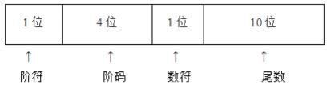
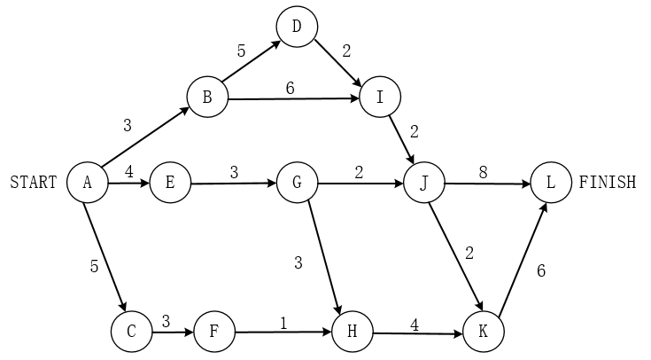
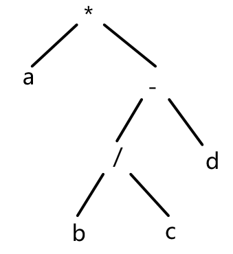
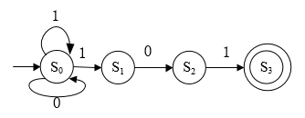
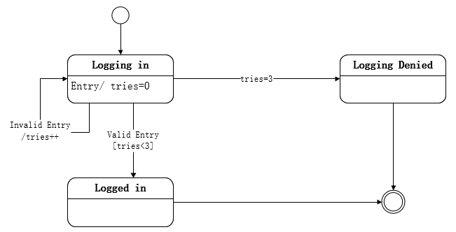
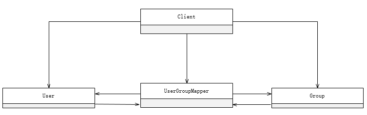
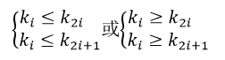
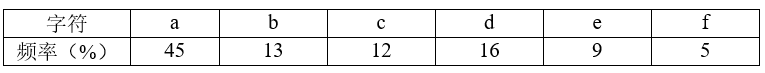

# 2021下半年选择题

- 来源标题: 2021年下半年软件设计师考试基础知识真题（专业解析+参考答案）
- 试卷介绍页: https://wangxiao.xisaiwang.com/tiku2/136/tp30361022.html?cid=136
- 练习页: https://wangxiao.xisaiwang.com/tiku2/exam534903352.html
- 题量: 56

## 第1题（单选题）

计算机指令系统采用多种寻址方式。立即寻址是指操作数包含在指令中，寄存器寻址是指操作数在寄存器中，直接寻址是指操作数的地址在指令中。这三种寻址方式操作数的速度（  ）。

- A. 立即寻址最快，寄存器寻址次之，直接寻址最慢
- B. 寄存器寻址最快，立即寻址次之，直接寻址最慢
- C. 直接寻址最快， 寄存器寻址次之，立即寻址最慢
- D. 寄存器寻址最快，直接寻址次之，立即寻址最慢

## 第2题（单选题）

以下关于PCI总线和SCSI总线的叙述中，正确的是（  ）。

- A. PCI总线是串行外总线，SCSI总线是并行内总线
- B. PCI总线是串行内总线，SCSI总线是串行外总线
- C. PCI总线是并行内总线，SCSI总线是串行内总线
- D. PCI总线是并行内总线，SCSI总线是并行外总线

## 第3题（单选题）

以下关于中断方式与DMA方式的叙述中，正确的是（  ）。

- A. 中断方式与DMA方式都可实现外设与CPU之间的并行工作
- B. 程序中断方式和DMA方式在数据传输过程中都不需要CPU的干预
- C. 采用DMA方式传输数据的速度比程序中断方式的速度慢
- D. 程序中断方式和DMA方式都不需要CPU保护现场

## 第4题（单选题）

中断向量提供（  ）。

- A. 被选中设备的地址
- B. 待传送数据的起始地址
- C. 中断服务程序入口地址
- D. 主程序的断点地址

## 第5题（单选题）

（  ）是一种需要通过周期性刷新来保持数据的存储器件。

- A. SRAM
- B. DRAM
- C. FLASH
- D. EEPROM

## 第6题（单选题）

某种机器的浮点数表示格式如下(允许非规格化表示)。若阶码以补码表示，尾数以原码表示，则1 0001 0 0000000001表示的浮点数是（  ）。

- A. 2-16×2-10
- B. 2-15×2-10
- C. 2-16× （1-2-10）
- D. 2-15× （1-2-10）

## 第7题（单选题）

以下可以有效防治计算机病毒的策略是（  ）。

- A. 部署防火墙
- B. 部署入侵检测系统
- C. 安装并及时升级防病毒软件
- D. 定期备份数据文件

## 第8题（单选题）

AES是一种（  ）算法。

- A. 公钥加密
- B. 流密码
- C. 分组加密
- D. 消息摘要

## 第9题（单选题）

下列不能用于远程登录或控制的是（  ）。

- A. IGMP
- B. SSH
- C. Telnet
- D. RFB

## 第10题（单选题）

包过滤防火墙对（  ）的数据报文进行检查。

- A. 应用层
- B. 物理层
- C. 网络层
- D. 链路层

## 第11题（单选题）

防火墙通常分为内网、外网和DMZ三个区域，按照受保护程度，从低到高正确的排列次序为（  ）。

- A. 内网、外网和DMZ
- B. 外网、 DMZ和内网
- C. DMZ、内网和外网
- D. 内网、DMZ和外网

## 第12题（单选题）

（  ）是构成我国保护计算机软件著作权的两个基本法律文件。

- A. 《计算机软件保护条例》和《软件法》
- B. 《中华人民共和国著作权法》和《软件法》
- C. 《中华人民共和国著作权法》和《计算机软件保护条例》
- D. 《中华人民共和国版权法》和《中华人民共和国著作权法》

## 第13题（单选题）

X公司接受Y公司的委托开发了一款应用软件，双方没有订立任何书面合同。在此情形下，（  ）享有该软件的著作权。

- A. X、Y公司共同
- B. X公司
- C. Y公司
- D. X、Y公司均不

## 第14题（单选题）

广大公司（经销商）擅自复制并销售恭大公司开发的OA软件已构成侵权。鸿达公司在不知情时从广大公司（经销商）处购入该软件并已安装使用，在鸿达公司知道了所使用的软件为侵权复制的情形下其使用行为（  ）。

- A. 侵权， 支付合理费用后可以继续使用该软件
- B. 侵权， 须承担赔偿责任
- C. 不侵权，可继续使用该软件
- D. 不侵权， 不需承担任何法律责任

## 第15题（单选题）

绘制分层数据流图（DFD）时需要注意的问题中，不包括（  ）。

- A. 给图中的每个数据流、加工、数据存储和外部实体命名
- B. 图中要表示出控制流
- C. 一个加工不适合有过多的数据流
- D. 分解尽可能均匀

## 第16题（单选题）

以下关于软件设计原则的叙述中，不正确的是（  ）。

- A. 将系统划分为相对独立的模块
- B. 模块之间的耦合尽可能小
- C. 模块规模越小越好
- D. 模块的扇入系数和扇出系数合理

## 第17题（单选题）

在风险管理中，通常需要进行风险监测，其目的不包括（  ）。

- A. 消除风险
- B. 评估所预测的风险是否发生
- C. 保证正确实施了风险缓解步骤
- D. 收集用于后续进行风险分析的信息

## 第18题（单选题）

下图是一个软件项目的活动图，其中顶点表示项目里程碑，连接顶点的边表示活动，边上的权重表示完成该活动所需要的时间(天)，则活动（  ）不在关键路径上。活动BI和EG的松弛时间分别是（  ）。

### 问题1
- A. BD
- B. BI
- C. GH
- D. KL
### 问题2
- A. 0和1
- B. 1和0
- C. 0和2
- D. 2和0

## 第19题（单选题）

下图所示的二叉树表示的算术表达式是（  ）（其中的*、/、一表示乘、除、减运算）。

- A. a*b/c- d
- B. a*b/(c-d)
- C. a*(b/c- d)
- D. a*(b-c/d)

## 第20题（单选题）

对高级程序语言进行编译的过程中，使用（  ）来记录源程序中各个符号的必要信息，以辅助语义的正确性检查和代码生成。

- A. 决策表
- B. 符号表
- C. 广义表
- D. 索引表

## 第21题（单选题）

下图所示为一个非确定有限自动机（NFA），S0为初态，S3为终态。该NFA识别的字符串（  ）。

- A. 不能包含连续的字符“0”
- B. 不能包含连续的字符“1”
- C. 必须以“101”开头
- D. 必须以“101”结尾

## 第22题（单选题）

在单处理机计算机系统中有1台打印机、1台扫描仪，系统采用先来先服务调度算法。假设系统中有进程P1、P2、P3、P4,其中P1为运行状态，P2为就绪状态，P3等待打印机，P4等待扫描仪。此时，若P1释放了扫描仪，则进程P1、P2、P3、P4的状态分别为（  ）。

- A. 等待、 运行、等待、就绪
- B. 运行、就绪、等待、就绪
- C. 就绪、就绪、等待、运行
- D. 就绪、运行、等待、就绪

## 第23题（单选题）

进程P1、 P2、P3、P4、P5和P6的前趋图如下所示。用PV操作控制这6个进程之间同步与互斥的程序如下，程序中的空①和空②处应分别为（  ），空③和空④处应分别为（  ）， 空⑤和空⑥处应分别为（  ）。

### 问题1
- A. V(S1)和P(S2)P(S3)
- B. V(S1)和V(S2)V(S3)
- C. P(S1)和P(S2)V(S3)
- D. P(S1)和V(S2)V(S3)
### 问题2
- A. V(S3)和P(S3)
- B. V(S4)和P(S3)
- C. P(S3)和P(S4)
- D. V(S4)和P(S4)
### 问题3
- A. V(S6)和P(S5)
- B. V(S5)和P(S6)
- C. P(S5)和V(S6)
- D. P(S5)和V(S5)

## 第24题（单选题）

在磁盘上存储数据的排列方式会影响I/O服务的总时间。假设每个磁道被划分成10个物理块，每个物理块存放1个逻辑记录。逻辑记录R1,R2....R10存放在同一个磁道上，记录的排列顺序如下表所示：

假定磁盘的旋转速度为10ms/周，磁头当前处在R1的开始处。若系统顺序处理这些记录，使用单缓冲区，每个记录处理时间为2ms，则处理这10个记录的最长时间为（  ）。若对存储数据的排列顺序进行优化，处理10个记录的最少时间为（  ）。

### 问题1
- A. 30ms
- B. 60ms
- C. 94ms
- D. 102ms
### 问题2
- A. 30ms
- B. 60ms
- C. 102ms
- D. 94ms

## 第25题（单选题）

以下关于增量模型优点的叙述中，不正确的是（ ）。

- A. 强调开发阶段性早期计划
- B. 第一个可交付版本所需要的时间少和成本低
- C. 开发由增量表示的小系统所承担的风险小
- D. 系统管理成本低、效率高、配置简单

## 第26题（单选题）

以下关于敏捷统一过程（AUP） 的叙述中，不正确的是（ ）。

- A. 在大型任务上连续
- B. 在小型活动上迭代
- C. 每一个不同的系统都需要一套不同的策略、约定和方法论
- D. 采用经典的UP阶段性活动，即初始、精化、构建和转换

## 第27题（单选题）

在ISO/IEC软件质量模型中，可移植性是指与软件可从某环境转移到另一环境的能力有关的一组属性，其子特性不包括（  ）。

- A. 适应性
- B. 易测试性
- C. 易安装性
- D. 易替换性

## 第28题（单选题）

在软件开发过程中，系统测试阶段的测试目标来自于（  ）阶段。

- A. 需求分析
- B. 概要设计
- C. 详细设计
- D. 软件实现

## 第29题（单选题）

信息系统的文档是开发人员与用户交流的工具。在系统规划和系统分析阶段，用户与系统分析人员交流所使用的文档不包括（  ）。

- A. 可行性研究报告
- B. 总体规划报告
- C. 项目开发计划
- D. 用户使用手册

## 第30题（单选题）

如下所示代码（用缩进表示程序块），要实现语句覆盖，至少需要（  ）个测试用例。采用McCabe度量法计算该代码对应的程序流程图的环路复杂性为（  ）。
input A,n
for i = 2 to n
        key = A[i]
        j = i-1
        while j > 0 and A[j]>key
                  A[j+1]=A[j]
                  j = j-1
        A[j+1] = key

### 问题1
- A. 1
- B. 2
- C. 3
- D. 4
### 问题2
- A. 2
- B. 1
- C. 3
- D. 4

## 第31题（单选题）

系统可维护性是指维护人员理解、改正、改动和改进软件系统的难易程度，其评价指标不包括（  ）。

- A. 可理解性
- B. 可测试性
- C. 可修改性
- D. 一致性

## 第32题（单选题）

面向对象设计时包含的主要活动是（  ）。

- A. 认定对象、组织对象、描述对象间的相互作用、确定对象的操作
- B. 认定对象、定义属性、组织对象、确定对象的操作
- C. 识别类及对象、确定对象的操作、描述对象间的相互作用、识别关系
- D. 识别类及对象、定义属性、定义服务、识别关系、识别包

## 第33题（单选题）

在面向对象设计时，如果重用了包中的一个类，那么就要重用包中的所有类，这属于（  ）原则。

- A. 接口分离
- B. 开放-封闭
- C. 共同封闭
- D. 共同重用

## 第34题（单选题）

某电商系统在采用面向对象方法进行设计时，识别出网店、商品、购物车、订单买家、库存、支付（微信、支付宝）等类。其中，购物车与商品之间适合采用（  ）关系，网店与商品之间适合采用（  ）关系。

### 问题1
- A. 关联
- B. 依赖
- C. 组合
- D. 聚合
### 问题2
- A. 依赖
- B. 关联
- C. 组合
- D. 聚合

## 第35题（单选题）

某软件系统限定：用户登录失败的次数不能超过3次。采用如所示的UML状态图对用户登录状态进行建模，假设活动状态是Logging in，那么当Valid Entry发生时，（  ）。 其中，[tries < 3]和tries+ +分别为（  ）和（  ）。

### 问题1
- A. 保持在Logging in状态
- B. 若[tries < 3]为true，则Logged in变为下一个活动状态
- C. Logged in立刻变为下一 个活动状态
- D. 若tries=3为true，则Logging Denied变为下一个活动状态
### 问题2
- A. 状态
- B. 转换
- C. 监护条件
- D. 转换后效果
### 问题3
- A. 状态
- B. 转换
- C. 转换后效果
- D. 监护条件

## 第36题（单选题）

在某系统中，不同组（GROUP）访问数据的权限不同，每个用户（User）可以是一个或多个组中的成员，每个组包含零个或多个用户。现要求在用户和组之间设计映射，将用户和组之间的关系由映射进行维护，得到如下所示的类图。该设计采用（  ）模式，用一个对象来封装系列的对象交互；使用户对象和组对象不需要显式地相互引用，从而使其耦合松散，而且可以独立地改变它们之间的交互。该模式属于（  ）模式，该模式适用 （  ）。

### 问题1
- A. 状态（State）
- B. 策略（Strategy）
- C. 解释器（Interpreter）
- D. 中介者（Mediator）
### 问题2
- A. 创建型类
- B. 创建型对象
- C. 行为型对象
- D. 行为型类
### 问题3
- A. 需要使用一个算法的不同变体
- B. 有一个语言需要解释执行，并且可将句子表示为一个抽象语法树
- C. 一个对象的行为决定于其状态且必须在运行时刻根据状态改变行为
- D. 一个对象引用其他对象并且直接与这些对象通信而导致难以复用该对象

## 第37题（单选题）

在设计某购物中心的收银软件系统时，要求能够支持在不同时期推出打折、返利、满减等不同促销活动，则适合采用（  ）模式。

- A. 策略（Strategy）
- B. 访问者（Visitor）
- C. 观察者（Observer）
- D. 中介者（Mediator）

## 第38题（单选题）

Python语言的特点不包括（  ）。

- A. 跨平台、开源
- B. 编译型
- C. 支持面向对象程序设计
- D. 动态编程

## 第39题（单选题）

在Python语言中，（  ）是一种可变的、有序的序列结构，其中元素可以重复。

- A. 元组(tuple)
- B. 字符串(str)
- C. 列表(list)
- D. 集合(set)

## 第40题（单选题）

以下Python语言的模块中，（  ）不支持深度学习模型。

- A. TensorFlow
- B. Matplotlib
- C. PyTorch
- D. Keras

## 第41题（单选题）

采用三级模式结构的数据库系统中，如果对一个表创建聚簇索引，那么改变的是数据库的（  ）。

- A. 外模式
- B. 模式
- C. 内模式
- D. 用户模式

## 第42题（单选题）

设关系模式R（U，F），U={A1，A2，A3，A4}，函数依赖集F={A1→A2，A1→A3，A2→A4}，关系R的候选码是（ ）。下列结论错误的是（ ）。

### 问题1
- A. A1
- B. A2
- C. A1A2
- D. A1A3
### 问题2
- A. A1→A2A3为F所蕴涵
- B. A1→A4为F所蕴涵
- C. A1A2→A4为F所蕴涵
- D. A2→A3为F所蕴涵

## 第43题（单选题）

给定学生关系S（学号，姓名，学院名，电话，家庭住址）、课程关系C（课程号，课程名，选修课程号）、选课关系SC（学号，课程号，成绩）。查询“张晋”选修了“市场营销”课程的学号、学生名、学院名、成绩的关系代数表达式为： π1,2,3,7（ π  1,2,3（  ）∞（  ））。

### 问题1
- A. σ2=张晋(S)
- B. σ2='张晋'(S)
- C. σ2=张晋(SC)
- D. σ2='张晋'(SC)
### 问题2
- A. π2,3(σ2='市场营销'(C))∞SC
- B. π2,3(σ2=市场营销(SC))∞C
- C. π1,2(σ2='市场营销'(C))∞SC
- D. π1,2(σ2=市场营销 (SC))∞C

## 第44题（单选题）

数据库的安全机制中，通过提供（  ）供第三方开发人员调用进行数据更新，从而保证数据库的关系模式不被第三方所获取。

- A. 触发器
- B. 存储过程
- C. 视图
- D. 索引

## 第45题（单选题）

若栈采用顺序存储方式，现有两栈共享空间V[1..n]， top[i]代表i( i=1,2)个栈的栈顶（两个栈都空时top[1]= 1、top[2]= n），栈1的底在V[1]，栈2的底在V[n]，则栈满（即n个元素暂存在这两个栈）的条件是（  ）。

- A. top[1]= top[2]
- B. top[1]+ top[2]==1
- C. top[1]+ top[2]==n
- D. top[1]- top[2]== 1

## 第46题（单选题）

采用循环队列的优点是（  ）。

- A. 入队和出队可以在队列的同端点进行操作
- B. 入队和出队操作都不需要移动队列中的其他元素
- C. 避免出现队列满的情况
- D. 避免出现队列空的情况

## 第47题（单选题）

二叉树的高度是指其层数， 空二叉树的高度为0，仅有根结点的二叉树高度为1，若某二叉树中共有1024个结点，则该二叉树的高度是整数区间（  ）中的任一值。

- A. (10, 1024)
- B. [10, 1024]
- C. (11, 1024)
- D. [11, 1024]

## 第48题（单选题）

n个关键码构成的序列{k1,k2, ...Kn}当且仅当满足下列关系时称其为堆。

以下关键码序列中，（  ）不是堆。

- A. 15,25,21,53,73, 65,33
- B. 15,25,21,33,73,65,53
- C. 73,65,25,21,15,53,33
- D. 73,65,25,33,53,15,21

## 第49题（单选题）

对有向图G进行拓扑排序得到的拓扑序列中，顶点Vi在顶点Vj之前，则说明G中（  ）。

- A. 一定存在有向弧 < Vi, Vj >
- B. 一定不存在有向弧 < Vj, Vi >
- C. 必定存在从Vi到Vj的路径
- D. 必定存在从Vj到Vi的路径

## 第50题（单选题）

归并排序算法在排序过程中，将待排序数组分为两个大小相同的子数组，分别对两个子数组采用归并排序算法进行排序，排好序的两个子数组采用时间复杂度为O(n)的过程合并为一个大数组。根据上述描述，归并排序算法采用了（  ）算法设计策略。归并排序算法的最好和最坏情况下的时间复杂度为（  ）。

### 问题1
- A. 分治
- B. 动态规划
- C. 贪心
- D. 回溯
### 问题2
- A. Θ(n)和Θ(nlgn)
- B. Θ(n)和Θ(n2)
- C. Θ(nlgn)和Θ(nlgn)
- D. Θ(nlgn)和Θ(n2)

## 第51题（单选题）

已知一个文件中出现的各字符及其对应的频率如下表所示。采用Huffman编码，则该文件中字符a和c的码长分别为（  ）。若采用Huffman编码，则字序列 “110001001101” 的编码应为（  ）。

### 问题1
- A. 1和3
- B. 1和4
- C. 3和3
- D. 3和4
### 问题2
- A. face
- B. bace
- C. acde
- D. fade

## 第52题（单选题）

用户在电子商务网站上使用网上银行支付时，必须通过（  ）在Internet与银行专用网之间进行数据交换。

- A. 支付网关
- B. 防病毒网关
- C. 出口路由器
- D. 堡垒主机

## 第53题（单选题）

ARP 报文分为ARP Request和ARP Response，其中ARP Request采用（  ）进行传送，ARP Response采用（  ）进行传送。

### 问题1
- A. 广播
- B. 组播
- C. 多播
- D. 单播
### 问题2
- A. 组播
- B. 广播
- C. 多播
- D. 单播

## 第54题（单选题）

页面的标记对中（  ）用于表示网页代码的起始和终止。

- A. < html > < /html >
- B. < head > < /head >
- C. < body > < /body >
- D. < meta > < /meta >

## 第55题（单选题）

以下对于路由协议的叙述中，错误的是（  ）。

- A. 路由协议是通过执行一个算法来完成路由选择的一种协议
- B. 动态路由协议可以分为距离矢量路由协议和链路状态路由协议
- C. 路由协议是一种允许数据包在主机之间传送信息的种协议
- D. 路由器之间可以通过路由协议学习网络的拓扑结构

## 第56题（单选题）

One is that of a software engineer and the other is a DevOps engineer. The biggest different is in their (  ). Software engineers focus on how well the computer software fits the needs of the client while a DevOps engineer has a broader focus that includes software development, how the software is deployed and providing (  ) support through the cloud while the software is continually (  ).
A software engineer creates computer programs for people to use based upon their security and function ability needs. A DevOps engineer also works on computer applications, but manages the building, deployment and operation as a (  ) automated process. Software engineers often work separately from the operations side of a business. They create the software a business client needs and then monitor the performance of their software products to determine if up grades are necessary or if more serious improvements are needed. DevOps engineers work with the operational side of a business and manage the workflow to (  ) software to smoothly function with automated processes. Both professions require knowledge of Computer programming languages.

### 问题1
- A. focus
- B. process
- C. goal
- D. function
### 问题2
- A. developing
- B. deploying
- C. training
- D. operational
### 问题3
- A. developed
- B. functional
- C. constructed
- D. secure
### 问题4
- A. single
- B. whole
- C. continuous
- D. independent
### 问题5
- A. develop
- B. integrate
- C. analyse
- D. maintain
