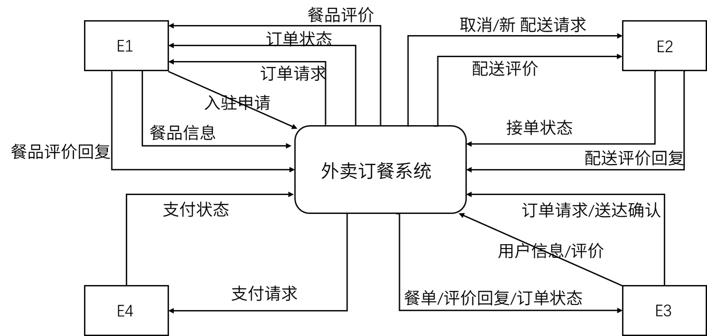
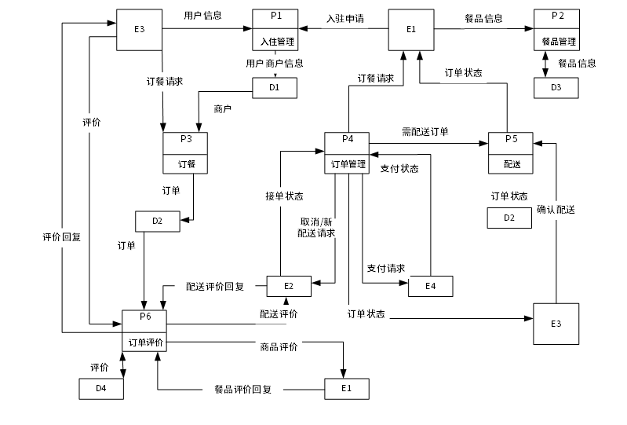
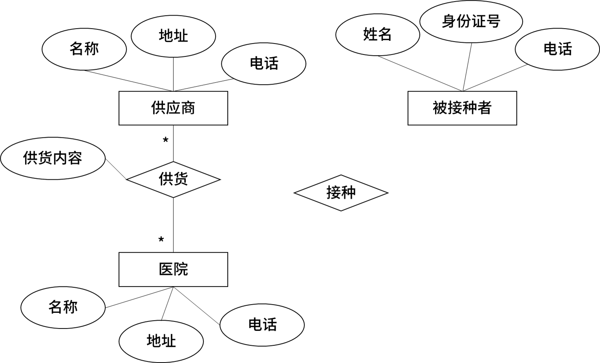
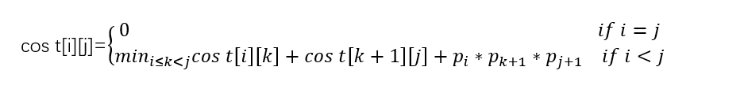
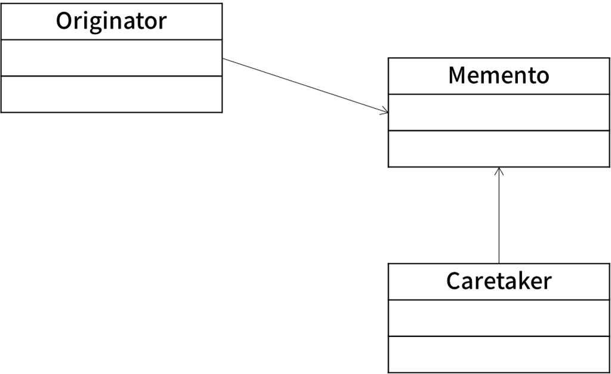

# 2022上半年案例题

- 来源标题: 2022年上半年软件设计师考试应用技术真题（专业解析+参考答案）
- 试卷介绍页: https://wangxiao.xisaiwang.com/tiku2/136/tp30382486.html?cid=136
- 练习页: https://wangxiao.xisaiwang.com/tiku2/exam534903330.html
- 题量: 6

## 第1题（案例题）

阅读下列说明和图，回答问题1至问题4，将解答填入答题纸的对应栏内。
【说明】
某公司欲开发一款外卖订餐系统，集多家外卖平台和商户为一体，为用户提供在线浏览餐品、订餐和配送等服务。该系统的主要功能是：
1.入驻管理。用户注册、商户申请入驻，设置按时间段接单数量阈值等。系统存储商户/用户信息。
2.餐品管理。商户对餐品的基本信息和优惠信息进行发布、修改、删除。系统存储相关信息。
3.订餐。用户浏览商户餐单，选择餐品及数量后提交订餐请求。系统存储订餐订单。
4.订单处理。收到订餐请求后，向外卖平台请求配送。外卖平台接到请求后发布配送单，由平台骑手接单，外卖平台根据是否有骑手接单返回接单状态。若外卖平台接单成功，系统给支付系统发送支付请求，接收支付状态。支付成功，更新订单状态为已接单，向商户发送订餐请求并由商户打印订单，给用户发送订单状态；若支付失败，更新订单状态为下单失败，向外卖平台请求取消配送，向用户发送下单失败。若系统接到外卖平台返回接单失败或超时未返回接单状态，则更新订单状态为下单失败，向用户发送下单失败。
5.配送。商户备餐后，由骑手取餐配送给用户。送达后由用户扫描骑手出示的订单上的配送码后确认送达，订单状态更改为已送达，并发送给商户。
6.订单评价。用户可以对订单餐品、骑手配送服务进行评价，推送给对应的商户、所在外卖平台，商户和外卖平台对用户的评价进行回复。系统存储评价。
现采用结构化方法对外卖订餐系统进行分析与设计，获得如图1-1所示的上下文数据流图和图1-2所示的0层数据流图。

图1-1 上下文数据流图

图1-2 0层数据流图

### 补充题面

【问题1】（4分）
使用说明中的词语，给出图1-1中实体E1~E4的名称。
【问题2】（4分）
使用说明中的词语，给出图1-2中的数据存储D1-D4 的名称。
【问题3】（4分）
根据说明和图中术语，补充图1-2中缺失的数据流及其起点和终点。
【问题4】（3分）
根据说明，采用结构化语言对“订单处理”的加工逻辑进行描述。

## 第2题（案例题）

按照下列图表，填写答题纸的对应栏内。
【说明】
为了提高接种工作的效率，并为了抗击疫情提供疫苗接种数据支撑，需要开发一个信息系统，根据下述需求完成该系统的数据库设计。
（1）记录疫苗供应商的信息，包括供应商名称，地址和一个电话。
（2）记录接种医院的信息，包括医院名称、地址和一个电话。
（3）记录接种者个人信息，包括姓名、身份证号和一个电话。
（4）记录接种者疫苗接种信息，包括接种医院信息，被接种者信息，疫苗供应商名称和接种日期，为了提高免疫力，接种者可能需要进行多次疫苗接种，（每天最多接种一次，每次都可以在全市任意一家医院进行疫苗接种）。
【概念模型设计】
根据需求分析阶段收集的信息，设计的实体联系图（不完整）如图2-1所示。

图2-1 E-R图
【逻辑结构设计】
根据概念模型设计阶段完成的实体联系图，得出如下关系模式（不完整）
供应商（供应商名称、地址、电话）
医院（医院名称、地址、电话）
供货（供应商名称、（a）、供货内容）
被接种者（姓名、身份证号、电话）
接种（接种者身份证号、（b）、医院名称、供应商名称）

### 补充题面

【问题1】（4分）
根据问题描述，补充图2-1的实体联系图（不增加新的实体）。
【问题2】（4分）
补充逻辑结构设计结果中的（a）（b）两处空缺，并标注主键和外键完整性约束。
【问题3】（7分）
若医院还兼有核酸检测的业务，检测时可能需要进行多次核酸检测（每天最多检测一次），但每次都可以在全市任意一家医院进行检测。请在图2-1中增加“被检测者”实体及相应的属性，医院与被检测者之间的“检测”联系及必要的属性，并给出新增加的关系模式。
“被检测者”实体包括姓名、身份证号、地址和一个电话。“检测”联系需要包括检测日期和检测结果等。

## 第3题（案例题）

阅读下列说明和图，回答问题1至问题3，将解答填入答题纸的对应栏内。
[说明]
某公司的人事部门拥有一个地址簿（AddressBook）管理系统（AddressBookSystem），用于管理公司所有员工的地址记录（PersonAddress）。员工的地址记录包括：姓名、住址、城市、省份、邮政编码以及联系电话等信息。
管理员可以完成对地址簿中地址记录的管理操作，包括：
（1）管理地址记录。根据公司的人员变动情况，对地址记录进行添加、修改、删除等操作。
（2）排序。按照员工姓氏的字典顺序或邮政编码对系统中的所有记录进行排序。
（3）打印地址记录。以邮件标签的格式打印一个地址单独的地址簿。
系统会对地址记录进行管理，为便于管理，管理员在系统中为公司的不同部门建立员工的地址簿的操作，包括：
（1）创建地址簿。新建一个地址簿并保存。
（2）打开地址簿。打开一个已有的地址簿。
（3）修改地址簿。对打开的地址簿进行修改并保存。
系统将提供一个GUI（图形用户界面）实现对地址簿的各种操作。
现采用面向对象方法分析并设计该地址簿管理系统，得到如图3-1所示的用例图和图3-2所示的类图。

图3-2 类图

### 补充题面

[问题1]（6分）
根据说明中的描述，给出图3-1中U1～U6所对应的用例名。
[问题2]（5分）
根据说明中的描述，给出图3-2中类AddressBook的主要属性和方法以及类PersonAddress的主要属性（可以使用说明中的文字）。
[问题3]（4分）
根据说明中的描述以及图3-1所示的用例图，请简要说明extend和include关系的含义是什么?

## 第4题（案例题）

阅读下列说明和C代码，回答问题1至问题3，将解答写在答题纸的对应栏内。
【说明】
某工程计算中经常要完成多个矩阵相乘（链乘）的计算任务，对矩阵相乘进行以下说明。
（1）两个矩阵相乘要求第一个矩阵的列数等于第二个矩阵的行数，计算量主要由进行乘法运算的次数决定，假设采用标准的矩阵相乘算法，计算Amxn*Bnxp需要m*n*p次行乘法运算的次数决定、乘法运算，即时间复杂度为O（m*n*p）。
（2）矩阵相乘满足结合律，多个矩阵相乘时不同的计算顺序会产生不同的计算量。以矩阵A15×100，A2100*8，A38x50三个矩阵相乘为例，若按（A1*A2）*A3计算，则需要进行5*100*8+5*8*50=6000次乘法运算，若按A1*（A2*A3）计算，则需要进行100*8*50+5*100*50=65000次乘法运算。
矩阵链乘问题可描述为：给定n个矩阵，对较大的n，可能的计算顺序数量非常庞大，用蛮力法确定计算顺序是不实际的。经过对问题进行分析，发现矩阵链乘问题具有最优子结构，即若A1*A2**An的一个最优计算顺序从第k个矩阵处断开，即分为A1*A2*…*Ak和Ak+1*Ak+2*...*An两个子问题，则该最优解应该包含
A1*A2*…*Ak的一个最优计算顺序和
Ak+1*Ak+2*...*An  的一个最优计算顺序。据此构造递归式：

其中，cost[i][j]表示Ai+1*Ai+2*...Aj+1的最优计算的计算代价。最终需要求解cost[0][n-1]。
【C代码】
算法实现采用自底向上的计算过程。首先计算两个矩阵相乘的计算量，然后依次计算3个矩阵、4个矩阵、…、n个矩阵相乘的最小计算量及最优计算顺序。下面是该算法的语言实现。
（1） 主要变量说明
n：矩阵数
seq[]：矩阵维数序列
cost[i][j]：二维数组，长度为n*n，其中元素cost[i][j]表示Ai+1*Ai+2**Aj+1的最优的计算代价。
trace[][]:二维数组，长度为n*n，其中元素trace[i][j]表示Ai+1*Ai+2**Aj+1的最优计算顺序对应的划分位置，即k。
（2）函数cmm
#define N100
int cost[N[N];
int trace[N][N]; 
int cmm(int n,int seq[]){ 
    int tempCost; 
    int tempTrace; 
    int i,j,k,p; 
    int temp; 
     for( i=0;i<n;i++){ cost[i][i] = 0;}      for(p=1;p<n;p++){         for(i=0; i<n-p;i++){
            （1）  ; 
            tempCost = -1; 
            for(k = i;  （2） ;k++){    
                temp=  （3）  ; 
                if(tempCost==-1 || tempCost>temp){                
                    tempCost = temp;
                    tempTrace=k; 
                } 
            } 
            cost[i][j] = tempCost; 
            （4）  ;        } 
    } 
    return cost[0][n-1]; 
}

### 补充题面

【问题1】（8分）
根据以上说明和C代码，填充C代码中的空（1）～（4）。
【问题2】（4分）
根据以上说明和C代码，该问题采用了（5）算法设计策略，时间复杂度为（6）（用O符号表示）。
【问题3】（3分）
考虑实例n=4，各个矩阵的维数为A1为15*5，A2为5*10，A3为10*20，A4为20*25，即维度序列为15，5，10，20和25。则根据上述C代码得到的一个最优计算顺序为（7）（用加括号方式表示计算顺序），所需要的乘法运算次数为 （8）。

## 第5题（案例题）

阅读下列说明和C++代码。将应填入（n）处的字句写在答题纸的对应栏内。
【说明】
在软件系统中，通常不会给用户提供取消、不确定或者错误操作的选择，允许将系统恢复到原先的状态。现使用备忘录（Memento）模式实现该要求，得到如图5-1所示的类图。Memento 包含了要被恢复的状态。Originator创建并在Memento中存储状态。Caretaker负责从Memento中恢复状态。

图5-1 类图
【C++代码】
#include
#include
#include
using namespace std;
class Memento{
private:
string state;
public:
Memento(string state){
        this->state=state;
}
string getState(){
        return state; 
}
}
class Originator{
private:
string state;
public:
void setState(string state){
        this>sate=state;
}
string getState(){
        return state;
}
Memento saveStateToMemento(){
           return (1）
}
void getStateFromMemento(Memento Memento){
        state (2)
}
class CareTaker{
private:
vector mementoList;
pubilc:
void(3){
    mementoList.push back（state）
    （4）;return mementoList（index);
}
int mian(){
Originator*originator=new Originator();
CareTaker*careTaker=new CareTaker();
originator->setState("State #1");
originator->setState("State #2");
careTaker->add(_(5)_);
originator->setState("State #3");
careTaker->add((6));
originator->setState（"State #4"）;
cout <<"Current State:"<<"+" <<originator->getState( )<<endl;
originator->getStateFromMemento(careTaker->get(0);
cout<<"First saved State:"<<originator->getStatee( )<<endl;
originator->getStateFromMemento(careTaker->get(1);
cout<<"second save State"<<"+" <<originator>getState( )<<endl;
return 0;
}

## 第6题（案例题）

阅读下列说明和Java代码，将应填入（n）处的字句写在答题纸的对应栏内。
【说明】
在软件系统中，通常都会给用户提供取消、不确定或者错误操作的选择，允许将系统恢复到原先的状态。现使用备忘录（Memento）模式实现该要求，得到如图6-1所示的类图。Memento包含了要被恢复的状态。Originator创建并在Memento中存储状态。Caretaker负责从Memento中恢复状态。

图6-1 类图
【Java代码】
import java.util.*；
class Memento {
    private String state；
    public Memento（String state）{this.state=state;}
    public String getState（）{return state；}
}
class Originator{
    private String state；
    public void setState（String state）{this.state=state；}
    public String getState（）{ retum state；}
    public Memento saveStateToMemento( ){
        return （1）;
    }
   public void getStateFromMemento（Memento Memento）{
      state =（2）;
   }
}
class CareTaker｛
    private List<Memento> mementoList= new ArrayList<Memento>();
    public（3）{
        mementoList.add(state);
    }
    public （4）{
        return memensoList.get(index);
    }
}
class MementoPaneDems{
    public static void main(String[] args) {
        Originator originator =new Originator();
        CareTaker careTaker=new careTaker();
        originator.setState("State #1");
        originator.setState("State #2");
        careTaker.add( （5） );
        originator.setState("State #3");
        careTaker.add( （6） );
        originator.setState("State #4");
        System.out.println("Current State"+originator.getState());
        originator.getStateFromMemento(careTaker.get(0));
        System.out.println("Frist saved State"+originator.getState());
        originator.getStateFromMemento(careTaker.get(1));
        System.out.println("Second saved State"+originator.getState());
    ｝
}
