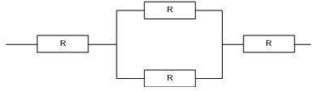
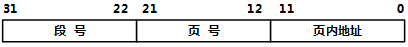
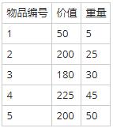
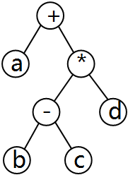
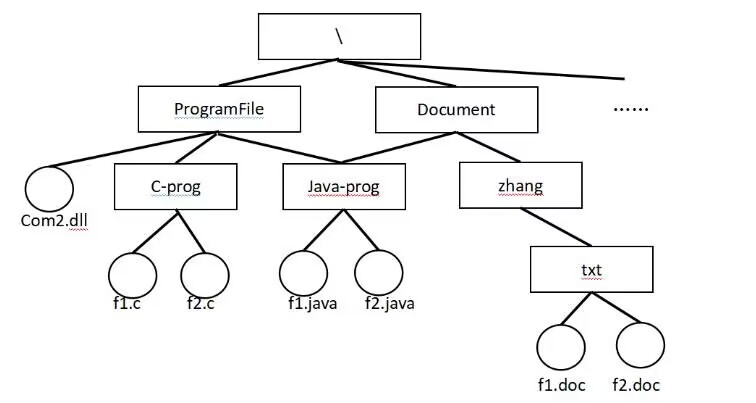
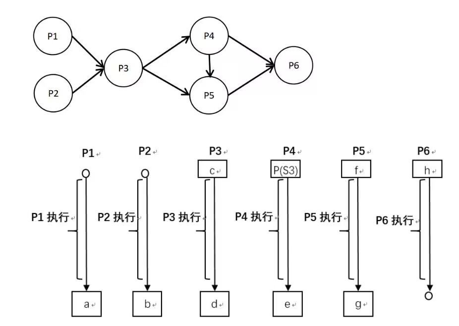
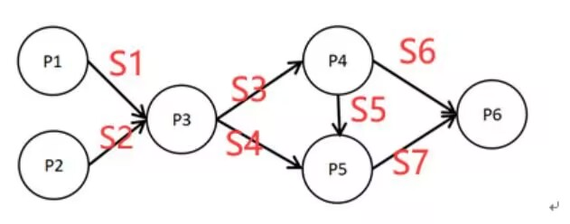
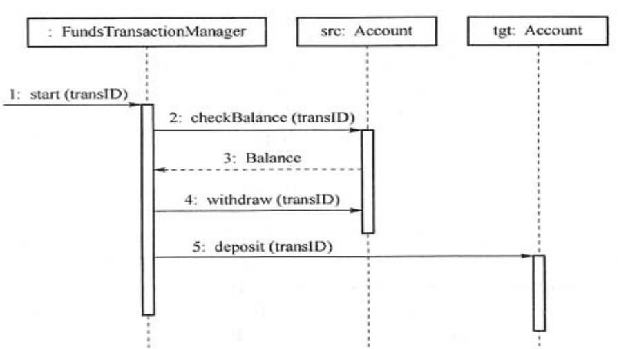
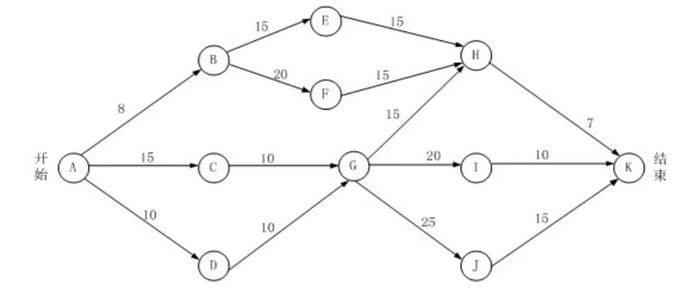

# 2022上半年选择题

- 来源标题: 2022年上半年软件设计师考试基础知识真题（专业解析+参考答案）
- 试卷介绍页: https://wangxiao.xisaiwang.com/tiku2/136/tp30382482.html?cid=136
- 练习页: https://wangxiao.xisaiwang.com/tiku2/exam534904258.html
- 题量: 56

## 第1题（单选题）

以下关于冯诺依曼计算机的叙述中，不正确的是（B）。

- A. 程序指令和数据都采用二进制表示
- B. 程序指令总是存储在主存中，而数据则存储在高速缓存中
- C. 程序的功能都由中央处理器（CPU）执行指令来实现
- D. 程序的执行工作由指令进行自动控制

### 正确答案

B

### 解析

本题考查的是计算机体系结构相关知识。
在冯诺依曼结构中，程序指令和数据存在同一个存储器中。B选项描述错误。本题选择B选项，其他描述都是正确的。

## 第2题（单选题）

以下关于SRAM和DRAM储存器的叙述中正确的是（A）。

- A. 与DRAM相比，SRAM集成率低，功率小、不需要定期刷新
- B. 与DRAM相比，SRAM集成率高，功率小、需要定期刷新
- C. 与SRAM相比，DRAM集成率高，功率大、不需要定期刷新
- D. 与SRAM相比，DRAM集成率低，功率大、需要定期刷新

### 正确答案

A

### 解析

本题考查存储器分类相关知识。
DRAM集成率相对较高，功耗高，需要定期刷新。
SRAM集成率相对较低，功耗低，不需要定期刷新。
BCD描述错误，本题选择A选项。

## 第3题（单选题）

为了实现多级中断 ，保存程序现场信息最有效的方法是使用（C）。

- A. 通用寄存器
- B. 累加器
- C. 堆栈
- D. 程序计数器

### 正确答案

C

### 解析

本题考查的是中断相关概念。
在中断过程中，程序现场信息保存在堆栈部分。
通用寄存器、累加器、程序计数器都是属于CPU内部的子部件，与本题无关。
ABD描述错误，本题选择C选项。

## 第4题（单选题）

以下关于RISC和CISC的叙述中，不正确的是（B）。

- A. RISC的大多指令在一个时钟周期内完成
- B. RISC普遍采用微程序控制器，CISC则普遍采用硬布线控制器
- C. RISC的指令种类和寻址方式相对于CISC更少
- D. RISC和CISC都采用流水线技术

### 正确答案

B

### 解析

本题考查指令系统基础知识。
在RISC架构下，由于指令较为精简，所以通常能够在较少的1个时钟周期内完成，RISC采用硬布线逻辑控制，CISC采用微程序控制,
RISC的指令种类和寻指方式相对于CISC更少。
RISC与CISC都可以采用流水线技术，RISC更适合。
ACD描述正确，B选项描述错误，本题选择B选项。

## 第5题（单选题）

某计算机系统构成如下图所示，假设每个软件的千小时可靠度R为0.95，则该系统的千小时可靠度约为（A）。

- A. 0.95×(1-(1-0.95)2)×0.95
- B. 0.95×(1-0.95)2×0.95
- C. 0.95×2×(1-0.95)×0.95
- D. 0.954×(1-0.95)

### 正确答案

A

### 解析

本题考查的是混联模型可靠性计算。
可以将图示分解为3个部分R1、R2、R3串联，整个系统可靠度为R1*R2*R3。
其中R1、R3的可靠度都为R=0.95，R2的可靠度为1-(1-R)2=1-(1-0.95)2。代入表达式可得，系统最终的可靠度为0.95*(1-(1-0.95)2)*0.95，本题选择A选项。

## 第6题（单选题）

以下信息交换情形中，采用异步传输方式的是（D）。

- A. CPU与内存储器之间交换信息
- B. CPU与PCI总线交换信息
- C. CPU与l/O接口间交换信息
- D. I/O接口与打印设备间交换

### 正确答案

D

### 解析

本题考查的是I/O接口相关概念。
CPU与内存储器之间的信息交换是同步的，内存访问需要按照严格的时序进行，以确保数据的正确性和一致性。
CPU与PCI总线上的设备交换信息是同步的，PCI总线协议定义了严格的时序和数据传输规则。
CPU与I/O接口之间的信息交换通常也是同步的，I/O操作需要按照系统的时钟周期进行。
I/O接口与打印机交换信息则采用基于缓存池的异步方式。因为打印机等外部设备通常具有较慢的响应速度，而且其操作是单独的，不需要与CPU保持严格的同步。
ABC描述不符合，D选项描述正确，本题选项D选项。

## 第7题（单选题）

下列协议中，可以用于文件安全传输的是（B）。

- A. FTP
- B. SFTP
- C. TFTP
- D. ICMP

### 正确答案

B

### 解析

本题考查的是TCP/IP协议簇相关知识。
FTP文件共享是可靠但不安全的方式，TFTP文件共享是不可靠且不安全的。ICMP是Internet控制报文协议，与文件传输功能无关。
在计算机领域，SSH文件传输协议（英语：SSH File Transfer Protocol，也称Secret File Transfer Protocol，中文：安全文件传送协议，英文：Secure FTP或字母缩写：SFTP）是一数据流连接，提供文件访问、传输和管理功能的网络传输协议。只有SFTP涉及文件安全传输。本题选择B选项。

## 第8题（单选题）

下列不属于计算机病毒的是（D）。

- A. 永恒之蓝
- B. 蠕虫
- C. 特洛伊木马
- D. DDOS

### 正确答案

D

### 解析

本题考查的是网络威胁相关内容。
本题将木马也归于病毒一类了。
DDoS指的是分布式拒绝服务攻击，不属于计算机病毒与木马，其他选项都属于计算机病毒或木马，本题选择D选项。

## 第9题（单选题）

以下关于杀毒软件的描述中，错误的是（C）。

- A. 应当为计算机安装杀毒软件并及时更新病毒库信息
- B. 安装杀毒软件可以有效防止蠕虫病毒
- C. 安装杀毒软件可以有效防止网站信息被篡改
- D. 服务器操作系统也需要安装杀毒软件

### 正确答案

C

### 解析

本题考查的是网络安全管理相关内容。
在杀毒软件的使用过程中，我们应该为个人计算机、服务器都安装杀毒软件，并且应当及时更新病毒库信息，可以有效防止蠕虫病毒等。ABD选项描述都是正确的。
杀毒软件只能防病毒，不能有效防止网站信息被篡改，所以C选项描述错误，本题选择C选项。

## 第10题（单选题）

通过在出口防火墙上配置（A）功能可以阻止外部未授权用户访问内部网络。

- A. ACL
- B. SNAT
- C. 入侵检测
- D. 防病毒

### 正确答案

A

### 解析

本题考查的是网络防护相关概念。
ACL一般指访问控制列表。访问控制列表（ACL）是一种基于包过滤的访问控制技术，它可以根据设定的条件对接口上的数据包进行过滤，允许其通过或丢弃。本题描述的是ACL，其他选项与本题描述不符，选择A选项。

## 第11题（单选题）

SQL注入是常见的web攻击，以下不能够有效防御SQL注入的手段是（C）。

- A. 对用户输入做关键字过滤
- B. 部署Web应用防火墙进行防护
- C. 部署入侵检测系统阻断攻击
- D. 定期扫描系统漏洞并及时修复

### 正确答案

C

### 解析

本题考查的是SQL注入攻击相关内容。对用户输入做关键字过滤、Web应用防火墙、定期扫描系统漏洞并及时修复都可以有效防御SQL注入攻击，入侵检测系统无法防御SQL注入。本题选择C选项。

## 第12题（单选题）

甲乙丙三者分别就相同内容的发明创造，先后向专利管理部门提出申请，（B）可以获得专利申请权。

- A. 甲乙丙均
- B. 先申请者
- C. 先试用者
- D. 先发明者

### 正确答案

B

### 解析

本题考查的是知识产权人确定的相关内容。
对于专利权，谁先申请就给谁；同时申请则协商。
本题选择B选项

## 第13题（单选题）

（C）的保护期是可以延长的。

- A. 著作权
- B. 专利权
- C. 商标权
- D. 商业秘密权

### 正确答案

C

### 解析

本题考查的是知识产权保护期限相关内容。
知识产权中，软件著作权的署名权、修改权，以及普通著作权作品的署名权、修改权、保护作品完整权，都可以永久保护。其他著作权的保护期限是作者终身及其死后50年。特殊的保护期限中，商标权可以续注延长，商业秘密权保密期限不确定。
本题描述的是C选项。

## 第14题（单选题）

针对月收入小于等于3500元免征个人所得税的需求，现分别输入3499，3500和3501进行测试，则采用的测试方法（B）。

- A. 判定覆盖
- B. 边界值分析
- C. 路径覆盖
- D. 因果图

### 正确答案

B

### 解析

本题考查的是边界值覆盖的相关应用。
常见黑盒测试方法包括因果图、有效等价类和边界值分析等。白盒测试包括语句覆盖、判断覆盖、条件覆盖、路径覆盖等。
判断覆盖和路径覆盖都需要了解模块内部执行过程，与本题不符。
因果图（又名因果图、石川图、鱼骨图），指的是一种发现问题“根本原因”的分析方法，常用在项目管理中，黑盒测试也可以使用该方法。

## 第15题（单选题）

以下关于软件维护的叙述中，正确的是（C）。

- A. 工作量相对于软件开发而言要小很多
- B. 成本相对于软件开发而言要更低
- C. 时间相对于软件开发而言通常更长
- D. 只对软件代码进行修改的行为

### 正确答案

C

### 解析

本题考查的是软件维护相关概念。
软件开发一般为定长时间，而软件维护是指软件从开始使用至消亡的过程，属于软件生命周期中最长的阶段，工作量、成本也是最大的，可以对软件代码、软件软硬件等多种内容进行修改。本题只有C选项说法是正确的。

## 第16题（单选题）

在运行时将调用和响应调用所需执行的代码加以结合的机制是（D）。

- A. 强类型
- B. 弱类型
- C. 静态绑定
- D. 动态绑定

### 正确答案

D

### 解析

本题考查的是面向对象基本概念。
在程序运行过程中，把函数（方法或者过程）调用与响应调用所需要的代码相结合的过程称为动态绑定。在程序编译过程中，把函数（方法或者过程）调用与响应调用所需的代码结合的过程称之为静态绑定。本题描述的动态绑定，选择D选项。

## 第17题（单选题）

进行面向对象系统设计时，在包的依赖关系图中不允许存在环，这属于（B）原则。

- A. 单一责任
- B. 无环依赖
- C. 依赖倒置
- D. 里氏替换

### 正确答案

B

### 解析

本题考查的是面向对象设计原则相关内容。
单一责任原则：设计目的单一的类。
无环依赖原则：在包的依赖关系图中不允许存在环，即包之间的结构必须是一个直接的无环图形。本题描述的是B选项。
依赖倒置原则：要依赖于抽象，而不是具体实现；针对接口编程，不要针对实现编程。
里氏替换原则：子类可以替换父类。
本题选择B选项

## 第18题（单选题）

面向对象分析的第一项活动是（C/D）；面向对象程序设计语言为面向对象（ ）。

### 问题1
- A. 组织对象
- B. 描述对象间的相互作用
- C. 认定对象
- D. 确定对象的操作
### 问题2
- A. 用例设计
- B. 分析
- C. 需求分析
- D. 实现

### 正确答案

C、D

### 解析

本题考查的是面向对象分析与设计相关内容。
面向对象分析的活动有：认定对象（名词）、组织对象（抽象成类）、对象间的相互作用、基于对象的操作，第一项活动是认定对象，本题选择C选项。
面向对象实现需要选择一种面向对象程序设计语言。第二空选择D选项。

## 第19题（单选题）

用pip安装numpy模块的命令为（B）。

- A. pip numpy
- B. pip install numpy
- C. install numpy
- D. import num

### 正确答案

B

### 解析

本题考查的是命令相关内容。
pip numpy 这是不正确的，因为缺少了install命令。
install numpy 这也不是一个有效的命令，因为它没有指定是使用pip来安装。
import num 这是在Python脚本或交互式环境中导入模块的命令，而不是安装命令。  
因此，ACD描述错误，本题选择B选项。

## 第20题（单选题）

某Python程序中定义了X=[1，2]，那么X*2的值为（A）。

- A. [1，2，1，2]
- B. [1，1，2，2]
- C. [2，4]
- D. 出错

### 正确答案

A

### 解析

本题考查的是Python基础语法。
列表（list）的乘法操作 * 并不是用于将列表中的每个元素都乘以某个数，而是用于将列表复制指定的次数。
所以，当你执行 X*2 时，实际上是在将列表 X 复制一次，然后将两个相同的列表拼接在一起。
给定 X = [1, 2]，执行 X*2 的结果将是 [1, 2, 1, 2]。  
因此，BCD描述与题意不符，本题选择A选项。

## 第21题（单选题）

在Python语言中，（A）是一种不可变的、有序的序列结构，其中元素可以重复。

- A. tuple(元组)
- B. dict(字典)
- C. list(列表)
- D. set(集合)

### 正确答案

A

### 解析

本题考查的是Pythson数据类型相关内容。
不可变数据（3 个）：Number（数字）、String（字符串）、Tuple（元组）。
可变数据（3 个）：List（列表）、Dictionary（字典）、Set（集合）。
tuple(元组)类似于list列表，元组用 () 标识。内部元素用逗号隔开。但是元组不能二次赋值，相当于只读列表。
dict(字典)是除列表以外python之中最灵活的内置数据结构类型；列表是有序的对象集合，字典是无序的对象集合；字典用"{ }"标识；字典由索引(key)和它对应的值value组成。
list(列表)可以完成大多数集合类的数据结构实现。它支持字符，数字，字符串甚至可以包含列表（即嵌套或者叫多维列表，可以用来表示多维数组）。列表用 [ ] 标识，是 python 最通用的复合数据类型。
set(集合)是由一个或数个形态各异的大小整体组成的，构成集合的事物或对象称作元素或是成员；基本功能是进行成员关系测试和删除重复元素；可以使用大括号 { } 或者 set() 函数创建集合。

## 第22题（单选题）

数据库中的视图是一个虚拟表。若设计师为user表创建一个user1视图，那数据字典中保存的是（B）。

- A. user1查询语句
- B. user1视图定义
- C. user1查询结果
- D. 所引用的基本表

### 正确答案

B

### 解析

本题考查的是视图相关概念。
视图在数据字典中保存的是视图定义。本题选择B选项。

## 第23题（单选题）

给定关系R（A，B，C，D）和关系S（A，D，E，F），若对这两个关系进行自然连接运算R▷◁S后的属性列有（C/B）个；关系代数表达式σR.B  ＞ S.F(R▷◁S)与（ ）等价。

### 问题1
- A. 4
- B. 5
- C. 6
- D. 8
### 问题2
- A. σ2>8(RxS)
- B. π1，2，3，4，7，8(σ1=5∧2＞8∧4=6(R×S))
- C. σ”2">"8"(RxS)
- D. π1，2，3，4，7，8(σ1=5∧＂2＂＞＂8＂∧4=6(RxS))

### 正确答案

C、B

### 解析

本题考查关系代数相关知识。
自然连接的属性列数是二者之和减去重复列数，本题R和S进行自然连接后，结果属性列数为4+4-2=6，第一空选择C选项。
判断自然连接与笛卡尔积关系表达式是否等价时，需要注意同名属性列取值相等才可以与自然连接等价，题目中R.B＞S.F在笛卡尔积中用属性列表示即【2>8】，不需要引号，因此本题应该选择B选项，其他选项都不满足。

## 第24题（单选题）

以下关于散列表（哈希表)，及其查找特点的叙述中，正确的是（C）。

- A. 在散列表中进行查找时，只需要与待查找关键字及其同义词进行比较
- B. 只要散列表的装填因子不大于1/2，就能避免冲突
- C. 用线性探测法解决冲突容易产生聚集问题
- D. 用链地址法解决冲突可确保平均查找长度为1

### 正确答案

C

### 解析

本题考查算法基础-散列表。
A选项错误，考查的是散列表查找时对应位置填写的可能是关键字、也可能是同义词、也可能是非同义词。在放置数据时，首次放置关键字本身或者同义词（计算结果一致的元素），但也有可能在前面的处理过程中因为冲突的原因，将某个非同义词放置到该位置了，在查找过程中，这3类都有可能出现在计算结果对应的位置，所以只需要与查找关键字及同义词比较的说法是错误的。
B选项错误，装填因子越大，表示装填的记录越满，发生冲突的可能性越大，反之发生冲突的可能性越小。并不会避免冲突发生。
C选项正确，线性探测法解决冲突空间利用率高，但容易发生聚集现象。
D选项错误，链地址解决冲突时，可能会出现多个同义词放在同一个链表，平均查找长度无法确保为1。
因此，ABD描述错误，本题选择C选项。

## 第25题（单选题）

对长度为n的有序顺序进行折半查找（即二分查找）的过程可用一棵判定树表示，该判定树的形态符合（B）的特点。

- A. 最优二叉树（即哈夫曼树）
- B. 平衡二叉树
- C. 完全二叉树
- D. 最小生成树

### 正确答案

B

### 解析

本题考查的是二分查找相关内容。
最优二叉树，也称为哈夫曼树或最优前缀码树，是一种特殊的二叉树结构，广泛应用于数据压缩中的编码技术。它的主要目的是为了构造平均长度最短的编码方式，这种编码方式称为哈夫曼编码。
特点：
树的每个叶子节点都代表一个字符，且都有一个权值（通常是该字符在文本中出现的频率）。
树的带权路径长度（从根节点到叶子节点的路径长度乘以叶子节点的权值）是所有可能的二叉树中最小的。
非叶子节点（内部节点）的权值是其子节点权值之和。  
完全二叉树是一种特殊的二叉树结构，其特点是在完全二叉树中，除了最后一层外，每一层都被完全填满，并且最后一层中的所有节点都尽可能地向左对齐。
特点：
叶子节点只可能出现在层次最大的两层。
对于任一节点，如果其右子树的最大层次为h，则其左子树的最大层次为h或h+1。
每一层（除了可能不完整的最后一层）都完全填满节点。  
最小生成树是图论中的一个概念，用于在加权无向图中找到一棵边权重和最小的生成树。生成树是原图的一个子图，它包含原图中的所有顶点，并且是一个树（即无环的连通图）。
特点：
包含图中所有顶点。
是一个无环的连通图。
边的权重和在所有可能的生成树中是最小的。  
平衡二叉树，又称AVL树，是一种特殊的二叉排序树。它要求树中任意节点的左右子树的高度差的绝对值不超过1，并且左右子树也都是平衡二叉树，这是其最大的特点。
二分查找是将序列均分，不论序列元素是偶数个还是奇数个。如果是奇数个元素，那么左右子树的结点个数刚好相同，如果是偶数个，那么左右子树结点树相差1，这刚好符合平衡二叉树的特点。
注意：虽然也存在部分序列二分查找满足完全二叉树的形态，不过只是特例，但一定是都满足平衡二叉树形态的。
因此，ACD描述与题意不符，本题选择B选项。

## 第26题（单选题）

已知树T的度为4，且度为4的节点数为7个、度为3的节点数为5个、度为2的节点数为8个、度为1的节点数为10个，那么T的叶子节点个数为（C）。（注：树中节点个数称为节点的度，节点的度中的最大值称为树的度。）

- A. 30
- B. 35
- C. 40
- D. 49

### 正确答案

C

### 解析

本题考查的是二叉树特性。
假设度为4的节点个数记作n4，度为3的节点个数记作n3，度为2的节点个数记作n2，度为1的节点个数记作n1，度为0的节点个数记作n0。
此时节点总数为n4+n3+n2+n1+n0，每个节点可以根据树枝找到其父节点，除了根，所以此时树枝的数量为n4+n3+n2+n1+n0－1。
又因为度与树枝的定义，树枝的个数又可以计算为：4*n4+3*n3+2*n2+1*n1+0*n0。
综上可得n4+n3+n2+n1+n0－1=4*n4+3*n3+2*n2+1*n1+0*n0，此时n4=7，n3=5，n2=8，n1=10，代入表达式计算可得，n0=40，本题选择C选项。

## 第27题（单选题）

排序算法的稳定性是指将待排序列排序后，能确保排序码中的相对位置保持不变。（A）是稳定的排序算法。

- A. 冒泡排序
- B. 快速排序
- C. 堆排序
- D. 简单选择排序

### 正确答案

A

### 解析

本题考查常见算法的应用。
将待排序列排序后，能确保排序码中的相对位置保持不变指的是稳定性排序，本题中只有冒泡排序是稳定的排序，快速排序、堆排序、简单选择排序都是不稳定排序。
因此，BCD描述与题意不符，本题选择A选项。

## 第28题（单选题）

某图G的邻接表中共有奇数个表示边的表节点，则图G（D）。

- A. 有奇数个顶点
- B. 有偶数个顶点
- C. 是无向图
- D. 是有向图

### 正确答案

D

### 解析

本题考查的是图的存储相关知识。
在邻接表中，奇数个表示边的表节点说明在图中有奇数条边，无法说明顶点个数是奇数还是偶数，所以A、B选项都是错误的。
由于无向图的边一定是对称存在的，所以边的个数一定是偶数，不满足题意，C选项错误。
因此，ABC描述与题意不符，本题选择D选项。

## 第29题（单选题）

在OSI参考模型中，（B）在物理线路上提供可靠的数据传输。

- A. 物理层
- B. 数据链路层
- C. 网络层
- D. 应用层

### 正确答案

B

### 解析

本题考查OSI/RM七层模型。
物理层：利用传输介质为数据链路层提供物理连接，负责处理数据传输并监控数据出错率，以便数据流的透明传输。
数据链路层：在物理层提供的服务基础上，在通信的实体间建立数据链路连接，传输以“帧”为单位的数据包，并采用差错控制与流量控制方法，使有差错的物理线路变成无差错的数据链路。
网络层：为数据在节点之间传输创建逻辑链路，通过路由选择算法为分组通过通信子网选择最适当的路径，以及实现拥塞控制、网络互联等功能。
应用层：为应用软件提供了很多服务，实现具体的应用功能。
题干的内容符合B选项的描述，因此本题正确答案为B选项。

## 第30题（单选题）

在TCP/IP协议栈中，远程登录采用的协议为（B）。

- A. HTTP
- B. TELNET
- C. SMTP
- D. FTP

### 正确答案

B

### 解析

本题考查TCP/IP协议簇相关知识。
HTTP是超文本传输协议，SMTP是邮件传输协议，FTP是文件传输协议，都与远程登录无关，只有B选项TELNET是远程登录服务的标准协议和主要方式。本题选择B选项。

## 第31题（单选题）

浏览器开启无痕浏览模式时，（C）仍然会被保存。

- A. 浏览历史
- B. 搜索历史
- C. 下载的文件
- D. 临时文件

### 正确答案

C

### 解析

本题考查的是浏览器应用。
在浏览器开启无痕浏览模式时，浏览历史、搜索历史和临时文件都不会被保存，只有下载的文件可以被保存。本题选择C选项。

## 第32题（单选题）

下列不属于电子邮件收发协议的是（D）。

- A. SMTP
- B. POP3
- C. IMAP
- D. FTP

### 正确答案

D

### 解析

本题考查TCP/IP协议簇相关知识。
SMTP是邮件传送协议，POP3是邮件收取协议，IMAP是交互邮件访问协议，这3类协议都与电子邮件相关。
只有D选项FTP是文件传输协议，与电子邮件无关，本题选择D选项。

## 第33题（单选题）

已知文法G: S— > A0|B1，A
— >   S1|1, B
— >   S0|0,其中S是开始符号。从S出发可以推导出（C）。

- A. 所有由0构成的字符串
- B. 所有由1构成的字符串
- C. 某些0和1个数相等的字符串
- D. 所有0和1个数不同的字符串

### 正确答案

C

### 解析

本题考查文法推导知识。
对于文法可推导出的字符串分析，考试一般可对文法举例，然后总结规律。
以本题文法为例，可以产生的字符串包括：
（1）10
推导过程：S→A0；A→1。
（2）01
推导过程：S→B1；B→0。
（3）1010
推导过程：S→A0；A→S1：S→A0，A→1。
因此，选项A、B、D的描述都可以排除，本题选择C选项。

## 第34题（单选题）

假设段页式存储管理系统中的地址结构如下图所示，则系统（D）。

- A. 最多可有2048个段，每个段的大小均为2048个页，页的大小为2K
- B. 最多可有2048个段，每个段最大允许有2048个页，页的大小为2K
- C. 最多可有1024个段，每个段的大小均为1024个页，页的大小为4K
- D. 最多可有1024个段，每个段最大允许有1024个页，页的大小为4K

### 正确答案

D

### 解析

从图中可见，页内地址的长度为12位，212=4096，即4K，页号长度为21-12+1=10，210=1024，段号长度为31-22+1=10，210=1024。故正确答案为D。

## 第35题（单选题）

某文件管理系统采用位示图（bitmap）记录磁盘的使用情况。如果系统的字长为32位，磁盘物理块的大小为4MB，物理块依次编号为：0、1、2、位示图字依次编号为：0、1、2、那么16385号物理块的使用情况在位示图中的第（C/D）个字中描述；如果磁盘的容量为1000GB，那么位示图需要（  ）个字来表示。

### 问题1
- A. 128
- B. 256
- C. 512
- D. 1024
### 问题2
- A. 1200
- B. 3200
- C. 6400
- D. 8000

### 正确答案

C、D

### 解析

由于物理块是从0开始编号的，所以16385号物理块是第16386块。16386/32=512．0625，所以16385号物理块的使用情况在位示图中的第513个字中描述。由于字从0开始编号，所以对应的字的编号为512
磁盘的容量为1000GB，物理块的大小为4MB，则磁盘共1000×1024/4个物理块，一个字对应32个物理块，位示图的大小为1000×1024/（32×4） =8000个字。

## 第36题（单选题）

考虑下述背包问题的实例。有5件物品，背包容量为100，每件物品的价值和重量如下表所示，并已经按照物品的单位重量价值从大到小排好序，根据物品单位重量价值大优先的策略装入背包中，则采用了（B/A）设计策略。考虑0/1背包问题（每件物品或者全部放入或者全部不装入背包）和部分背包问题（物品可以部分装入背包），求解该实例，得到的最大价值分别为（  ）。

### 问题1
- A. 分治
- B. 贪心
- C. 动态规划
- D. 回溯
### 问题2
- A. 605和630
- B. 605和605
- C. 430和630
- D. 630和430

### 正确答案

B、A

### 解析

本题考查贪心算法和背包问题的知识点。
分治：分治策略通常是将问题分解成若干个子问题，递归地解决这些子问题，然后将子问题的解合并以得到原问题的解。在这个背包问题中，并没有明显地将问题分解成子问题的过程，因此这不是分治策略。
贪心：贪心策略是在每一步选择中都采取在当前状态下最好或最优（即最有利）的选择，从而希望导致结果是全局最好或最优的算法。在这个背包问题中，按照单位重量价值从大到小排序并优先装入，正是贪心策略的体现，因为它在每一步都选择了当前看来最优的物品装入背包。
动态规划：动态规划通常用于解决具有重叠子问题和最优子结构的问题。它通过将原问题分解为相对简单的子问题的方式求解复杂问题。在这个背包问题中，虽然动态规划是一个可能的解决方案（特别是当需要考虑所有可能的物品组合时），但题目描述的策略并不符合动态规划的特点。
回溯：回溯算法通过探索所有可能的候选解来找出所有的解。如果候选解被确认不是一个解（或者至少不是最后一个解），回溯算法会通过在上一步进行一些变化来丢弃该解，即“回溯”并通过不同的路径来搜索解空间。在这个背包问题中，并没有使用回溯算法来搜索所有可能的解，而是采用了贪心策略来直接寻找一个解。
对问题2，需要把`0/1背包`和`部分背包`严格分开：
1. `0/1背包`中每件物品只能整件拿或整件不拿。枚举关键可行组合可得：
   - `1+2+3`：重量 `5+25+30=60`，价值 `50+200+180=430`
   - `1+4+5`：重量 `5+45+50=100`，价值 `50+225+200=475`
   - `2+3+4`：重量 `25+30+45=100`，价值 `200+180+225=605`
   其中最优组合是 `2+3+4`，所以 `0/1背包`最大价值为 `605`。
2. `部分背包`允许拆分物品。按单位重量价值从大到小装入时，先装 `1、2、3` 号物品，累计重量 `60`、价值 `430`；剩余容量 `40`，再装入 `4` 号物品的 `40/45`，增加价值 `225 * 40 / 45 = 200`，故总价值为 `630`。
综上所述，本题选择 `B、A` 选项。

## 第37题（单选题）

一个高度为h的满二叉树的结点总数为2h-1，从根结点开始，自上而下、同层次结点从左至右，对结点按照顺序依次编号，即根结点编号为1，其左、右孩子结点编号分别为2和3，再下一层从左到右的编号为4、5、6、7，依此类推。那么，在一棵满二叉树中，对于编号为m和n的两个结点，若n=2m+1,则（D）。

- A. m是n的左孩子
- B. m是n的右孩子
- C. n是m的左孩子
- D. n是m的右孩子

### 正确答案

D

### 解析

本题考查二叉树的相关特性。
由于该二叉树为满二叉树，除最后一层无任何子节点外，每一层上的所有结点都有两个子结点（最后一层上的无子结点的结点为叶子结点）。根据满二叉树的性质可知父结点m和右孩子n之间的关系式为n=2m+1。
因此，ABC描述与题意不符，本题选择D选项。

## 第38题（单选题）

对n个基本有序的整数进行排序，若采用插入排序算法，则时间和空间复杂度分别为（D/C）；若采用快速排序算法，则时间和空间复杂度分别为（  ）。

### 问题1
- A. O（n2）和O（n）
- B. O（n）和O（n）
- C. O（n2）和O（1）
- D. O（n）和O（1）
### 问题2
- A. O（n2）和O（n）
- B. O（nlgn）和O（n）
- C. O（n2）和O（1）
- D. O（nlgn）和O（1）

### 正确答案

D、C

### 解析

本题考查算法分析的基础知识。排序和查找是基本的计算问题。存在很多相关的算法，不同的算法适用于不同的场合。不同的数据输入特点相同的算法也有不同的计算时间。若数据基本有序，对插入排序算法而言，则可以在近似线性时间内完成排序。即
 O(n)；而对于快速排序而言，则是其最坏情况，需要二次时间才能完成排序，即O(n2)。两个算法在排序时仅需要一个额外的存储空间，即空间复杂度为常数O(1)。（这里比较特殊，基本有序的情况下，快速排序因为不需要做交换处理，所以不需要存储额外数据，每一轮记录一次基准数值，空间复杂度只需要O(1)。）

## 第39题（单选题）

在浏览器地址栏输入ftp://ftp.tsinghua.edu.cn/进行访问时，首先执行的操作是（A）

- A. 域名解析
- B. 建立控制命令连接
- C. 建立文件传输连接
- D. 发送FTP命令

### 正确答案

A

### 解析

在浏览器输入想要访问的域名之后，浏览器会进行域名解析获得IP地址，再建立TCP连接，再进行FTP控制连接和数据连接，最后响应TCP命令。

## 第40题（单选题）

以下关于数据流图中基本加工的叙述，不正确的是（C）。

- A. 对每一个基本加工，必须有一个加工规格说明
- B. 加工规格说明必须描述把输入数据流变换为输出数据流的加工规则
- C. 加工规格说明应该采用实现软件的程序设计语言来描述以提高开发效率
- D. 决策表可以用来表示加工规格说明

### 正确答案

C

### 解析

对基本加工的说明有三种描述方式：结构化语言、判断表（决策表）、判断树（决策树）。基本加工逻辑描述的基本原则为：
 1、对数据流图的每一个基本加工，必须有一个基本加工逻辑说明。
 2、基本加工逻辑说明必须描述基本加工如何把输入数据流变换为输出数据流的加工规则。
 3、加工规格说明采用结构化语言、决策表、决策树表示，而不是采用具体的程序设计语言来描述。
 4、加工逻辑说明中包含的信息应是充足的，完备的，有用的，无冗余的。

## 第41题（单选题）

在划分模块时，一个模块的作用范围应该在其控制范围之内。若发现其作用范围不在其控制范围内，则（D）不是适当的处理方法。

- A. 将判定所在模块合并到父模块中，使判定处于较高层次
- B. 将受判定影响的模块下移到控制范围内
- C. 将判定上移到层次较高的位置
- D. 将父模块下移，使判定处于较高层次

### 正确答案

D

### 解析

本题考察模块设计。
 一个模块的作用范围（或称影响范围）指受该模块内一个判定影响的所有模块的集合。
 一个模块的控制范围指模块本身以及其所有下属模块（直接或间接从属于它的模块）的集合。
 一个模块的作用范围应在其控制范围之内，且判定所在的模块应在其影响的模块在层次上尽量靠近。如果再设计过程中，发现模块作用范围不在其控制范围之内，可以用“上移判点”或“下移受判断影响的模块，将它下移到判断所在模块的控制范围内”的方法加以改进。
本题选择D选项。

## 第42题（单选题）

在风险管理中，降低风险危害的策略不包括（C）。

- A. 回避风险
- B. 转移风险
- C. 消除风险
- D. 接受风险并控制损失

### 正确答案

C

### 解析

风险管理有四种基本方法，分别是：风险回避、损失控制、风险转移和风险保留。

## 第43题（单选题）

程序运行过程中常使用参数在函数（过程）间传递消息，引用调用传递的是实参的（A）。

- A. 地址
- B. 类型
- C. 名称
- D. 值

### 正确答案

A

### 解析

本题考查函数调用方式基础知识。
程序运行时，对函数的调用一般有两种形式：传值调用和引用调用。
 传值调用：形参取的是实参的值，形参的改变不会导致调用点所传的实参的值发生改变。
 引用（传址）调用：形参取的是实参的地址，即相当于实参存储单元的地址引用，因此其值的改变同时就改变了实参的值。
因此，BCD描述与题意不符，本题选择A选项。

## 第44题（单选题）

算术表达式a+（b-c）*d的后缀式是（B）（-、+、*表示算术的减、加、乘运算，运算符的优先级和结合性遵循惯例）。

- A. bc-d*a+
- B. abc-d*+
- C. ab+c-d*
- D. abcd-*+

### 正确答案

B

### 解析

本题要求算术表达式的后缀式，解决该类问题的方法是将算术表达式构造成一棵二叉树，然后对二叉树进行后序遍历，得到后缀式。题目中算术表达式可以构造为以下二叉树：
 
 对该二叉树进行后序遍历结果为：a b c - d * +。

## 第45题（单选题）

从减少成本和缩短研发周期考虑，要求嵌入式操作系统能运行在不同的微处理器平台上，能针对硬件变化进行结构与功能上的配置。该要求体现了嵌入式操作系统的（A）。

- A. 可定制性
- B. 实时性
- C. 可靠性
- D. 易移植性

### 正确答案

A

### 解析

本题考查嵌入式操作系统的基本概念。
嵌入式操作系统的特点：
（1）微型化，从性能和成本角度考虑，希望占用的资源和系统代码量少；
（2）可定制性，从减少成本和缩短研发周期考虑，要求嵌入式操作系统能运行在不同的微处理器平台上，能针对硬件变化进行结构与功能上的配置，以满足不同应用的需求；
（3）实时性，嵌入式操作系统主要应用于过程控制、数据采集、传输通信、多媒体信息及关键要害领域需要迅速响应的场合，所以对实时性要求较高；
（4）可靠性，系统构件、模块和体系结构必须达到应有的可靠性，对关键要害应用还要提供容错和防故障措施；
（5）易移植性，为了提高系统的易移植性，通常采用硬件抽象层和板级支撑包的底层设计技术。
本题描述的内容为可定制特性。BCD描述不符合，本题选择A选项。

## 第46题（单选题）

在多态的几种不同形式中，（C）多态是一种特定的多态，指同一个名字在不同上下文中可代表不同的含义。

- A. 参数
- B. 包含
- C. 过载
- D. 强制

### 正确答案

C

### 解析

一般将多态分为通用多态和特殊多态。通用多态包括参数多态和包含多态。
 参数多态采用参数化模板，通过给出不同的类型参数，使得一个结构有多种类型。
 包含多态同样的操作可用于一个类型及其子类型。（注意是子类型，不是子类。）包含多态一般需要进行运行时的类型检查。如Pascal中的子界。
 特殊多态包括强制多态和过载多态。
 强制多态编译程序通过语义操作，把操作对象的类型强行加以变换，以符合函数或操作符的要求。程序设计语言中基本类型的大多数操作符，在发生不同类型的数据进行混合运算时，编译程序一般都会进行强制多态
 过载多态是一种特定的多态，指同一个名（操作符、函数名）在不同上下文中可代表不同的含义。

## 第47题（单选题）

（A）开发过程模型最不适用开发初期对软件需求缺乏准确全面认识的情况。

- A. 瀑布
- B. 演化
- C. 螺旋
- D. 增量

### 正确答案

A

### 解析

瀑布模型是一种经典的开发模型，开发过程是通过设计一系列阶段顺序展开的，从系统需求分析开始直到产品发布和维护，每个阶段都会产生循环反馈，因此，如果有信息未被覆盖或者发现了问题，那么最好 “返回”上一个阶段并进行适当的修改，项目开发进程从一个阶段“流动”到下一个阶段，这也是瀑布模型名称的由来。
 瀑布模型的突出缺点是不适应用户需求的变化。

## 第48题（单选题）

编译过程中，对高级语言程序语名的翻译主要考虑声明语名和可执行语句。对声明语句，主要是将所需要的信息正确地填入合理组织的（A/C）中；对可执行语句，则是（  ）。

### 问题1
- A. 符号表
- B. 栈
- C. 队列
- D. 树
### 问题2
- A. 翻译成机器代码并加以执行
- B. 转换成语法树
- C. 翻译成中间代码或目标代码
- D. 转换成有限自动机

### 正确答案

A、C

### 解析

本题考查编译器工作过程相关知识。
对声明语句的处理：
主要是将所需要的信息正确地填入合理组织的符号表中。
符号表是一种用于记录源程序中各个符号（如变量名、函数名等）的必要信息的数据结构。这些信息包括符号名、类型、作用域等，以辅助语义的正确性检查和代码生成。在编译过程中，符号表需要支持快速有效的查找、插入、修改和删除等操作。
对可执行语句的处理：
对于可执行语句，编译器会将其翻译成中间代码或目标代码。
中间代码是一种在源代码和目标代码之间的表示形式，它可以使程序的结构在逻辑上更为简单明确，特别是可使目标代码的优化比较容易实现。目标代码则是可以直接被计算机执行的机器语言代码。
综上，本题答案选择AC。

## 第49题（单选题）

软件著作人与被许可方签订一份软件使用许可合同。若在该合同约定的时间和地域范围内，软件权利人不得再许可任何第三人以此相同的方法使用该项软件，但软件权利人可以自己使用，则该项许可使用是（A）。

- A. 独家许可使用
- B. 独占许可使用
- C. 普通许可使用
- D. 部分许可使用

### 正确答案

A

### 解析

软件许可使用一般有独占许可使用，独家许可使用和普通许可使用三种形式。独占许可使用，许可的是专有使用权。实施独占许可使用后，软件著作权人不得将软件使用权授予第三方，软件著作权人不能使用该软件；独家许可使用，许可的是专有使用权，实施独家许可使用后，软件著作权人不得将软件使用授予第三方，软件著作权人自己可以使用该软件；普通许可使用，许可的是非专有使用权，实施普通许可使用后，软件著作权人可以将软件使用权授予第三方、软件著作权人自己可以使用该软件。本题选择A。

## 第50题（单选题）

Windows文件系统的目录结构（C盘下）如下图所示，假设用户要访问文件f2．java，则该文件的全文件名为（D/B）。若系统当前工作目录为ProgramFile，那么该文件的相对路径为（  ）。  

### 问题1
- A. C:\f2.java
- B. C\Document\java-prog\f2.java
- C. \ProgramFile\java-prog\f2.java
- D. C:\ProgramFile\java-prog\f2.java
### 问题2
- A. \java-prog\
- B. java-prog\
- C. Program\java-prog
- D. \Program\java-prog

### 正确答案

D、B

### 解析

全文件名＝全路径文件名＝绝对路径＝完整的路径 相对路径，相对路径不以“”开头，而是从当前目录开始。文件的全文件名应包括盘符及从根目录开始的路径名，根据题目图可以看出f2．Java的全文件名为C：＼ProgramFile＼java-prog＼f2．java。文件的相对路径是当前 工作目录下的路径名，根据题目图可以看出f2．java的 相对路径java—prog＼。本题选择D、B选项。

## 第51题（单选题）

进程P1、P2、P3、P4、P5和P6的前趋势图如下所示，若用PV操作控制进程P1、P2、P3、P4、P5和P6并发 执行的过程，则需要设置7个信号量S1、S2、S3、S 4、S5、S6和S7，且信号量S1～S7的初值都等于零。
P 1—P6的进程执行图中，a和b处应分别填写（A/C/D/B）；c 和d处应分别填写（  ）；e和f处应分别填写（  ）；g 和h处应分别填写（  ）  

### 问题1
- A. V（S1）和V（S2）
- B. P（S1）和P（S2）
- C. P（S1）和V（S2）
- D. V（S1）和P（S2）
### 问题2
- A. P（S1）P（S2）和P（S3）和P（S4）
- B. V（S1）V（S2）和V（S3）和V（S4）
- C. P（S1）P（S2）和V（S3）和V（S4）
- D. V（S1）V（S2）和P（S3）和P（S4）
### 问题3
- A. P（S5）P（S6）和P（S4）和P（S5）
- B. V（S5）V（S6）和V（S4）和V（S5）
- C. P（S5）P（S6）和V（S4）和V（S5）
- D. V（S5）V（S6）和P（S4）和P（S5）
### 问题4
- A. P（S7）和P（S6）P（S7）
- B. V（S7）和P（S6）P（S7）
- C. P（S7）和V（S6）V（S7）
- D. V（S7）和V（S6）V（S7）

### 正确答案

A、C、D、B

### 解析

将信号量标于箭线之上，在这类题 中，S1—S5具体标在哪个箭线上值得注意，标注的基 本原则是：从结点标号小的开始标。如：

再以此原则进行PV操作填充：
（1）若从P进程结点引出某些信号量，则在P进程末尾对这些信号量执行V操作。
（2）若有信号量指向某进程P，则在P进程开始位置 有这些信号量的P操作。
执行P1：P1引出了信号量S1，则P1末尾有：V（S 1）。a是V（S1）；
执行P2：P2引出了信号量S2，则P2末尾有：V（S 2）。b是V（S2）；
执行P3：S1和S2指向P3，所以P3开始位置有P（S1） P（S2）；
P3引出了信号量S3和S4，则P3末尾有：V （S3）V（S4）。c是P（S1）P（S2）；d是V（S3）V (S4)
执行P4：S3指向P4，所以P4开始位置有P（S3）；P4 引出了信号量S5和S6，则P4末尾有：V（S5）V（S 6）。e是V（S5） V （S6）
执行P5：S4和S5指向P5，所以P5开始位置有P（S4） P（S5）；P5引出了信号量S7，则P5末尾有：V（S 7）。f是P（S4）P（S5）；g是V（S7）
执行P6：S6和S7指向P6，所以P6开始位置有P（S6） P（S7）。h是P（S6） P （S7）

## 第52题（单选题）

UML序列图是业务场景的图形化表示，描述了以（B/B/D）顺序组织的对象之间的交互活动。某系统中的一个UML序列图如下图所示，（  ）表示返回消息，Accoun t类必须实现的方法有（  ）。  

### 问题1
- A. 活动
- B. 时间
- C. 消息
- D. 调用
### 问题2
- A. tanslD
- B. balance
- C. withdraw
- D. deposit
### 问题3
- A. start()
- B. checkBalance()和withdraw()
- C. deposit()
- D. checkBalance()、withdraw()和deposit()

### 正确答案

B、B、D

### 解析

序列图描述了以时间顺序组织的对象之间的交互活动。
序列图以二维图的形式显示对象之间交互，纵轴自上而下表示时间，横轴表示要交互的对象，主要体现对象间消息传递的时间顺序，强调参与交互的对象及其间消息交互的时序。序列图中包括的建模元素主要有:活动者，对象，生命线，控制焦点和消息。其中对象名标有下划线;生命线表示为虚线，沿竖线向下延伸;消息在序列图中标记为箭头;控制焦点由薄矩形表示。消息是从一个对象的生命线到另一个对象生命线的箭头，用从上而下的时间顺序来安排。一般分为同步消息，异步消息以及返回消息。题目中balance是返回消息，其他是同步消息。
src和tgt为Account对象，所以Account应该实现为checkBalance( )、withdraw( )和deposit( )方法，FundsTransactionManager应该实现start( )方法。
本题选择B、B、D选项

## 第53题（单选题）

实现Prim算法利用的算法是（C/A），采用Prim算法求解下图的最小生成树，该算法的设计策树的权值是（  )。  

### 问题1
- A. 分治法
- B. 动态规划法
- C. 贪心算法
- D. 递归算法
### 问题2
- A. 15
- B. 18
- C. 24
- D. 27

### 正确答案

C、A

### 解析

Prim算法：从某一个顶点开始构建生成树，每次将代 价最小的新顶点纳入生成树，直到所有的顶点都纳入 为止。
贪心法做出的选择是对于当前所处状态的最优选择， 它的解决问题的视角是微观的“局部”，而不是从全局 宏观的角度思考和看待问题，根据这样的性质，要求 贪心法解决的问题有“无后效性”。
Prim算法是非常典型的贪心算法应用，几乎体现了贪 心法的全部特点，prim算法的贪心策略是每次以选取 距离已经生成的部分权值最小的边作为“贪心选择的标 准”。
根据prim算法的贪心策略是每次以选取距离已经生成 的部分权值最小的边作为“贪心选择的标准”，选择边 AC，DF，BE，CF，BC，即1＋2＋3＋4＋5＝15

## 第54题（单选题）

（D/C）设计模式能使一个对象的状态发生改变时通所有依赖它的监听者。（  ）设计模式限制类的实例对象只能由一个。

### 问题1
- A. 责任链（chainofresponsibility）
- B. 命令（command）
- C. 抽象工厂（abstractfactory）
- D. 观察者（observer）
### 问题2
- A. 原型（prototype）
- B. 工厂方法（factorymethod）
- C. 单例（singleton）
- D. 生成器（builder）

### 正确答案

D、C

### 解析

原型模式虽然是创建型的模式，但是与工程模式没有 关系，从名字即可看出，该模式的思想就是将一个对 象作为原型，对其进行复制、克隆，产生一个和原对 象类似的新对象。
工厂模式定义一个用于创建对象的接口，让子类决定 实例化哪一个类。FactoryMethod使一个类的实例化 延迟到其子类。
单例模式是一种常用的软件设计模式。在它的核心结 构中只包含一个被称为单例类的特殊类。通过单例模 式可以保证系统中一类只有一个实例而且该实例已与 外界访问，从而方便对实例个数的控制并节约系统资 源。生成器模式（建造者模式）将一个复杂对象的构建与 它的表示分离，使得同样的构建过程可以创建不同的 表示。
责任链模式，有多个对象，每个对象持有对下一个对 象的引用，这样就会形成一条链，请求在这条链上传 递，直到某一对象决定处理该请求。但是发出者并不 清楚到底最终那个对象会处理该请求，所以，责任链 模式可以实现，在隐瞒客户端的情况下，对系统进行 动态的调整。
命令模式的目的就是达到命令的发出者和执行者之间 解耦，实现请求和执行分开。
抽象工厂模式，提供一个创建一系列相关或相互依赖 对象的接口，而无需指定它们具体的类。抽象工厂需 要创建一些列产品，着重点在于“创建哪些＂产品上， 也就是说，如果你开发，你的主要任务是划分不同差 异的产品线，并且尽量保持每条产品线接口一致，从 而可以从同一个抽象工厂继承。
观察者模式（有时又被称为发布—订阅模式、模型—视 图模式、源—收听着模式或从属这模式）是软件设计模 式的一种。在此种模式中，一个目标物件管理所有相 依于它的观察者物件，并且在它本身的状态状态改变 时主动发出通知。这通常透过呼叫各观察者所提供的 方法来实现。  
本题选择D、C选项

## 第55题（单选题）

下图是一个软件项目的活动图，其中顶点表示项目里程碑，连接顶点的边表示包含的活动，则里程碑（【#题号#】）在关键路径上。若在实际项目进展中，活动AD在活动AC开始3天后才开始，而完成活动DG过程中，由于有临时事件发生，实际需要15天才能完成，则完成该项目的最短时间比原计划多了（【#题号#】）天。  

 问题1
 问题2

### 补充题面

["{\"A\":\"B\",\"B\":\"C\",\"C\":\"D\",\"D\":\"I\"}","{\"A\":\"8\",\"B\":\"3\",\"C\":\"5\",\"D\":\"6\"}"]

### 正确答案

B、B

### 解析

关键路径：A—C—G—J—K，65天，C一定在关键路径上
和DG有关的活动：ADGHK，42天；ADGIK，50天 ；ADGJK，60天；所以最长时间为最终确定时间。 用关键路径65天分别减去减去42，50，60，得到65— 42＝33天，65—50＝15天，65—60＝5天，取最小值5 天，该项目只能推迟5天。
现在活动AD活动AC开始3天才开始而完成活动DG过 程由于临时事件发生实际需要15天（原计划是10天） 才能完成。也就是要推迟8天：3＋5＝8天。AD在AC之 后的3天＋（现在DG时间15天—原计划DG时间10天）＝ 3＋（15—10）＝8天。原计划是可以推迟5天，现在却 要推迟8天，8—5＝3天。  
关键路径：A—C—G—J—K，65天，C一定在关键路径上
和DG有关的活动：ADGHK，42天；ADGIK，50天 ；ADGJK，60天；所以最长时间为最终确定时间。 用关键路径65天分别减去减去42，50，60，得到65— 42＝33天，65—50＝15天，65—60＝5天，取最小值5 天，该项目只能推迟5天。
现在活动AD活动AC开始3天才开始而完成活动DG过 程由于临时事件发生实际需要15天（原计划是10天） 才能完成。也就是要推迟8天：3＋5＝8天。AD在AC之 后的3天＋（现在DG时间15天—原计划DG时间10天）＝ 3＋（15—10）＝8天。原计划是可以推迟5天，现在却 要推迟8天，8—5＝3天。

## 第56题（单选题）

Regardless of how well designed,constructed, and tested a system or application maybe, errors or bugs will inevitably occur. 
Once a system has been（B/A/C/D/A）, it enters operations and support.
        Systems support is the ongoing technical support for user, as well as the maintenance required to fix any errors, omissions,
or new requirements that may arise. Before an information system can be (  ), it must be in operation. System operation is the 
day-to-day,week-to-week,month-to-month,and year- to-year (  ) of an information system's business processes and application programs.
        Unlikesystems analysis,design,and implementation,systems support cannot sensibly be (  ) into actual phases that a support project 
must perform. Rather,systems support consists of four ongoing activities that are program maintenance,system recovery,technical support, 
and system enhancement.Each activity is a type of support project that is (  ) by a particular problem,event, or opportunity enco untered with 
the implemented system.

### 问题1
- A. designed
- B. implemented
- C. investigated
- D. analyzed
### 问题2
- A. supported
- B. tested
- C. implemented
- D. constructed
### 问题3
- A. construction
- B. maintenance
- C. execution
- D. implementation
### 问题4
- A. broke
- B. formed
- C. composed
- D. decomposed
### 问题5
- A. triggered
- B. leaded
- C. caused
- D. produced

### 正确答案

B、A、C、D、A

### 解析

一个系统或者应用不论设计建造的多好，以及经过多 么严格的测试，都不可避免会产生一些错误。一旦一 个系统被（），它就进入了运营和支持阶段。
系统的支持与维护工作给用户提供持续不断的技术支 持，修复错误和提供新的需求。在一个信息系统被（）之前，它就已经处于运营阶段。系统运营就是信息 系统的业务流程和应用在日复一日、周复一周、月复 一月、年复一年的（）。与系统分析、设计、实施 不同，系统支持不能被（）为实际要执行的阶段。 相反，系统支持由四个阶段组成，程序维护、系统恢 复、技术支持、系统增强。每一项活动都会执行中的 系统遇到的特定的问题，事件和机会所（）。
一个系统或者应用不论设计建造的多好，以及经过多 么严格的测试，都不可避免会产生一些错误。一旦一 个系统被实施，它就进入了运营和支持阶段。
