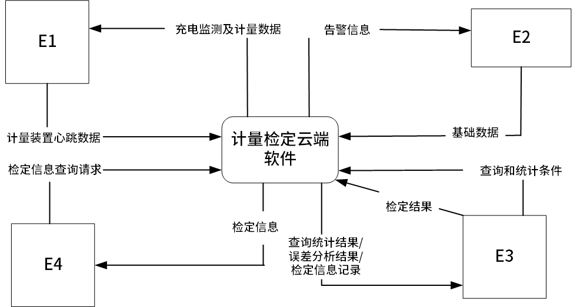
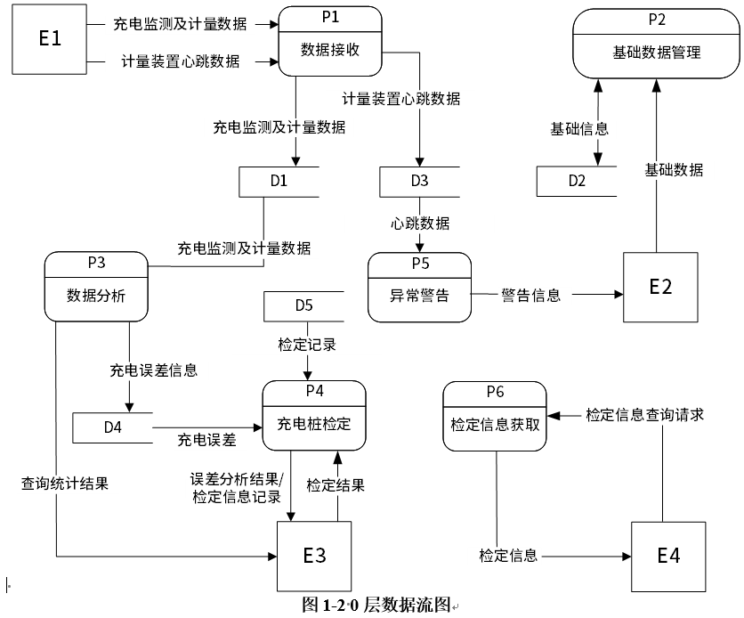
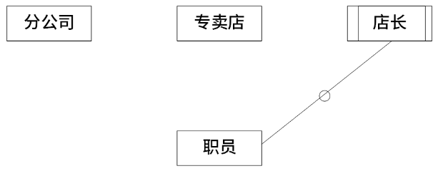
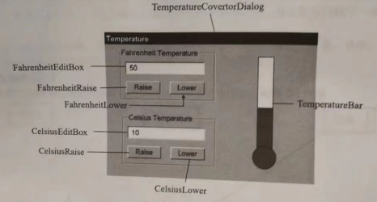
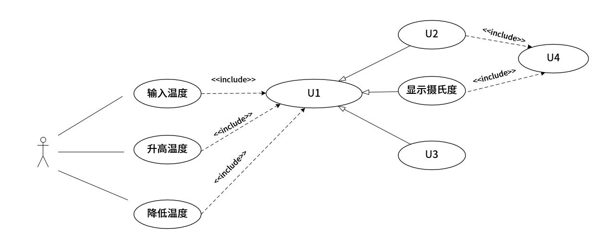
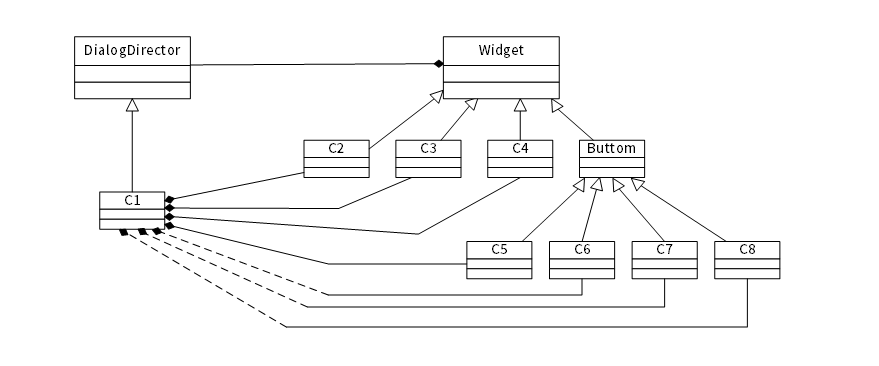
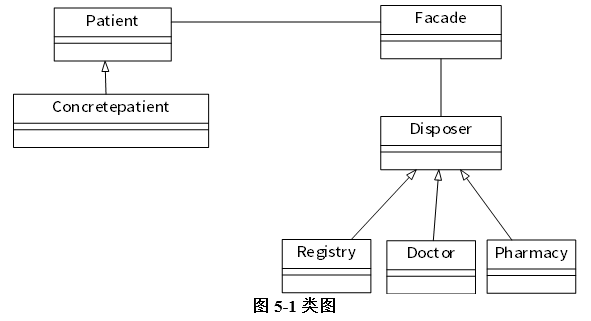
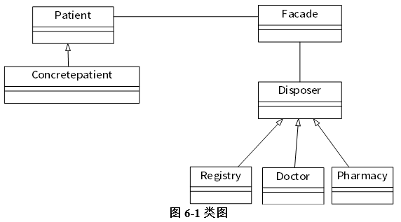

# 2022下半年案例题

- 来源标题: 2022年下半年软件设计师考试应用技术真题（专业解析+参考答案）
- 试卷介绍页: https://wangxiao.xisaiwang.com/tiku2/136/tp30387941.html?cid=136
- 练习页: https://wangxiao.xisaiwang.com/tiku2/exam534903313.html
- 题量: 6

## 第1题（案例题）

阅读下列说明和图，回答问题1至问题4，将解答填入答题纸的对应栏内。
随着新能源车数量的迅猛增长，全国各地电动汽车配套充电桩急速增长，同时也带来了充电桩计量准确性的问题。充电桩都需要配备相应的电能计量和电费计费功能，需要对充电计量准确性强制进行检定。现需开发计量检定云端软件，其主要功能是：
(1)数据接收。接收计量装置上报的充电数据，即充电过程中电压、电流、电能等充电监测数据和计量数据（充电监测数据为充电桩监测的数据，计量数据为计量装置计量的数据，以秒为间隔单位)，接收计量装置心跳数据，并分别进行存储。
(2)基础数据维护。管理员对充电桩、计量检定装置等基础数据进行维护。
(3)数据分析。实现电压、电流、电能数据的对比，进行误差分析，记录充电桩的充电误差，供计量装置检定。系统根据计量检测人员给出的查询和统计条件展示查询统计结果。
(4)充电桩检定。分析充电误差：计量检测人员根据误差分析结果和检定信息记录，对充电桩进行检定，提交检定结果：系统更新充电桩中的检定信息（检定结果和检定时间），并存储于检定记录。
(5)异常告警。检测计量装置心跳，当心跳停止时，向管理员发出告警。
(6)检定信息获取，供其它与充电桩相关的第三方服务查询充电桩中的检定信息。
现采用结构化方法对计量检定云端软件进行分析与设计，获得如图1-1所示的上下文数据流图和图1-2所示的0层数据流图。

### 补充题面

【问题1】(4分)
使用说明中的词语，给出图1-1 中的实体E1~ E4的名称。
【问题2】(5分)
使用说明中的词语，给出图1-2中的数据存储D1~D5的名称。
【问题3】(4分)
根据说明和图中未语，补充图1-2中缺失的数据流及其起点和终点。
【问题4】(2分)
根据说明，给出“充电监测与计量数据”数据流的组成。

## 第2题（案例题）

阅读下列说明和图，回答问题1至问愿3，将解答填入答题纸的对应栏内。
【说明】
某营销公司为了便于对各地的分公司及专卖店进行管理，拟开发一套业务管理系统，请根据下述需求描述完成该系统的数据库设计。
【需求描述】
(1) 分公司信息包括：分公司编号、分公司名、地址和电话。其中，分公司编号唯一确定分公司关系的每一个元组。每个分公司拥有多家专卖店，每家专卖店只属于一个分公司。
(2) 专卖店信息包括：专卖店号、专卖店名、店长、分公司编号、地址、电话，其中店号唯一确定专卖店关系中的每一个元组。每家专卖店只有一名店长，负责专卖店的各项业务：每名店长只负责一家专卖店：每家专卖店有多名职员，每名职员只属于一家专卖店。
(3)职员信息包括：职员号、职员名、专卖店号、岗位、电话、薪资。其中，职员号唯一标识职员关系中的每一个元组。岗位有店长、营业员等。
【概念模型设计】
根据需求阶段收集的信息，设计的实体联系图（不完整）如图2-1所示。

【逻辑结构设计】
根据概念模型设计阶段完成的实体联系图，得出如下关系模式（不完整）：
分公司（分公司编号，分公司名，地址，电话）
专卖店（专卖店号，专卖店名，___（a）__，地址，电话)
职员（职员号，职员名，____（b）___，岗位，电话，薪资）

### 补充题面

【问题1】(6分)
根据需求描述，图21实体联系图中缺少三个联系。请在答题纸对应的实体联系图中补充三个联系及联系类型。
注：联系名可用联系1、联系2、联系3：也可根据你对题意的理解取联系名。
【问题2】 (6分)
（1）将关系校式中的空____（a）___、____（b）___的属性补充完整，并填入答题纸对应的位置上。
（2）专卖店关系的主键：____（c）___ 和外键:____（d）___。
职员关系的主键：____（e）___ 和外键:____（f）___。
【问题3】(3分)
为了在紧急情况发生时，能及时联系到职员的家人，专卖店要求每位职员至少要填写位紧急联系人的姓名、与本人关系和联系电话。根把这种情况，在用2-1中还需要的实体是____（g）___ ，职员关系与该实体的联系类型为____（h）___。
（3）给出该实体的关系模式。

## 第3题（案例题）

阅读下列说明和图，回答问题1至问题3，将解答填入答题纸的对应栏内。
【说明】
图3-1所示为某软件系统中一个温度控制模块的界面。 界面上提供了两种温度计量单位，即华氏度(Farechet)和摄氏度(Celsius)。软件支持两种计量单位之间的自动换算，即若输入一个华氏度的温度，其对应的摄氏度温度值会自动出现在摄氏度的显示框内，反之亦然。
用户可以通过该界面上的按钮Raise (升高温度)和Lower (降低温度)来改变温度的值。界面右侧是个温度计， 将数字形式的温度转换成温度计上的制度比例进行显示。当温度值改变时，温度计的显示也随之同步变化。

现在采用面向对象方法现实该温度控制模板，得到如图3-2所示的用例图和3-3所示的类图。

图3-2 用例图

图3-3 类图

### 补充题面

【问题1】(4分)
根据说明中的描述，给出图3.2中U1~U4所对应的用例名。
【问题2】(8分)
根据说明中的描述，给出图3-3中C1~C8所对应的类名(类名使用图3-1中标注的词汇)。
【问题3】(3分)
现需将图3-1所示的界面改造为个更为通用的 GUI应用，能够实现任意计量单位之间的换算，例如千克和磅之间的换算、厘米和英寸之间的换算等等。为了实现这个新的需求，可以在图 3-3所示的类图上增加哪种设计模式？请解释选择该设计模式的原因(不超过50字)。

## 第4题（案例题）

阅读下列说明和C代码，回答问题1至问题3，将解答写在答题纸的对应栏内。
【说明】
排序是将一组无序的数据元素调整为非递减顺序的数据序列的过程，堆排序是一种常用的排序算法。用顺序存储结构存储堆中元素。非递减堆排序的步骤是：
(1)将含n个元素的待排序数列构造成一个初始大顶堆，存储在数组R(R[1]，R[2]，...，R[n])中。此时堆的规模为 n，堆顶元素R[1]就是序列中最大的元素，R[n]是堆中最后一个元素。
(2)将堆顶元素和堆中最后一个元素交换，最后一个元素脱离堆结构，堆的规模减1，将堆中剩余的元素调整成大顶堆；
(3)重复步骤(2)，直到只剩下最后一个元素在堆结构中，此时数组R是一个非递减的数据序列。
【C代码】
下面是该算法的C语言实现。
(1)主要变量说明
n:待排序的数组长度
R[]：待排序数组，n个数放在R[1]，R[2]，...，R[n]中
（2）代码
＃include ＜ stdio.h＞
＃define MAXITEM 100
/*
调整堆
R:待排序数组：
v:节点编号，以v为根的二又树，R[v]≥R[2v]，R[v]≥R[2v+1]，且其左子树和右子树都是大顶堆：
n:堆结构的规模，即堆中的元素数
*/
void Heapify(int R[MAXITEM],int v,int n){
 int i,j;
 i=v;
 j=2*i;
R[0]=R[i]:
while (j < =n){
         if(j < n&& R[j] < R[j+1]){
         j++;
    }
    if(_____(1)______){
        R[i]=R[j];
        i=j:
        j=2*i;
    }
    else{
         j=n+1;
    }
}
R[i]=R[0];
}
/* 堆排序，R为待排序数组；n为数组大小 */
void HeapSort(int R[MAXITEM],int n){
int i;
for(i=n/2；i > =1;i--){
    (_____(2)______);
}
for(i=n;(_____(3)______;i--){
     R[0]=R[i]:
     R[i]=R[1]:
     ____(4)__;
     Heapify (R,1,i-1);
 }
 }

### 补充题面

【问题1】(8分)
根据以上说明和C代码，填充C代码中的空(1)～(4)。
【问题2】(2分)
根据以上说明和C代码，算法的时间复杂度为(5)（用O符号表示）。
【问题3】(5分)
考虑数据序列R=(7，10，13，15，4，20，19，8)，n=8，则构建的初始大顶堆为(6)，
第一个元素脱离堆结构，对剩余元素再调整成大顶堆后的数组R为（7）。

## 第5题（案例题）

阅读下列说明和Java代码，将应填入(n)处的字句写在答题纸的对应栏内。
【说明】
Facade(外观)模式是一种通过为多个复杂子系统提供一个一致的接口，而使这些子系统更加容易被访问的模式。以医院为例，就医时患者需要与医院不同的职能部门交互，完成挂号、门诊、取药等操作。为简化就医流程，设置了一个接待员的职位，代患者完成上述就医步骤，患者只需与接待员交互即可。5-1给出了以外观模式实现该场景的类图。

【Java 代码】
import java.util.*;
interface Patient{
 (1);
}
interface Disposer{
 (2);
}
class Registry implements Disposer｛ //挂号
     public void dispose(Patient patient){
        System.out.println("I am registering..."+patient.getName());
     }
}
class Doctor implements Disposer{ //医生门诊
     public void dispose(Patient patient){
         System.out.println("I am diagnosing..."+patient.getName());
    }
}
class Pharmacy implements Disposer{
    public void dispose(Patient patient){
        System.out.println("I am giving medicine..."+patient.getName());
    }
}
class Facade{
    private Patient patient;
    public Facade(Patient patient){  this.patient = patient ; }
    public void dispose(){
        Registry registry = new Registry();
        Doctor doctor = new Doctor();
        Pharmacy ph = new Pharmacy();
        registry.dispose(patient);
        doctor.dispose(patient);
        ph.dispose(patient);
    }
}
class ConcretePatient implements Patient{
    private String name;
    public ConcretePatient(String name){this.name = name;}
    public String getName(){  return name;}
}
class FacadeTest{
    public static void main(String[] args){
        Patient patient = (3) ;
        (4) f = (5);
        (6);
    }
}

## 第6题（案例题）

阅读下列说明和C++代码，将应填入(n)处的字句写在答题纸的对应栏内。
【说明】
Facade(外观)模式是一种通过为多个复杂子系统提供一个一致的接口，而使这些子系统更加容易被访问的模式，以医院为例，就医时患者需要与医院不同的职能部门交互，完成挂号、门诊、取药等操作。为简化就医流程，设置了一个接待员的职位，代患者完成上述就医步骤，患者只需与接待员交互即可。6-1给出了以外观模式实现该场景的类图。

### 补充题面

【C+代码】
#include  < iostream > 
#include  < string > 
using namespace std;
class Patient{
public:
(1)
};
class Disposer{
public:
(2)
};
class Registry:public Disposer{ //挂号
public:
 void dispose(Patient *patient){
 cout <  <"I am registering...." < < patient->getName() < < endl;
 }
};
class Doctor : public Disposer｛// 医生门诊
public:
void dispose(Patient *patient){
cont < <  "l am diagnosing..." < < patient->getName() <  < endl;
 }
};
class Pharmacy : public Disposer{ //取药
public:
 void dispose(Patient *patient） {
 cout  < < "I am giving medicine..." < <  patient->getName() < < endl;
};
class Facade {
private
 Patient *patient;
public:
Facade(Patient *patient）{this->patient=patient;}
void dispose(){
 Registry *registry=new Registry();
 Doctor *doctor= new Doctor();
 Pharmacy *ph=new Pharmacy();
 registry>dispose(patient）;
 doctor>dispose(patient);
 ph->dispose(patient);
 }
};
class ConcretePatient： public Patient {
private:
 string name;
public:
 ConcretePatient(string name）{this->name=name;}
 string getName(){return name;}
};
int main(){
 Patient *patient=（3）;
 （4）f=(5）;
 （6）;
return()；
}
