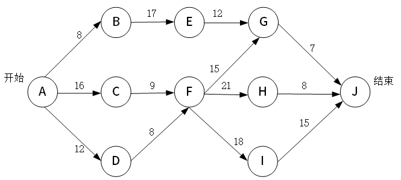
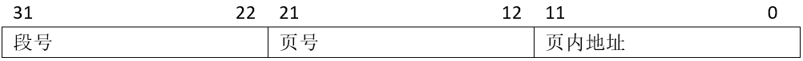
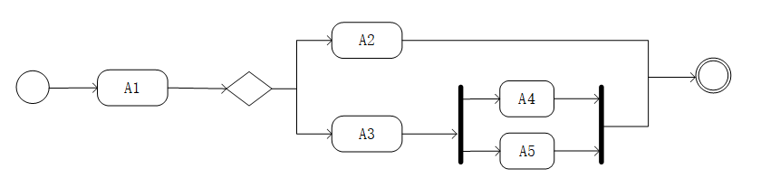
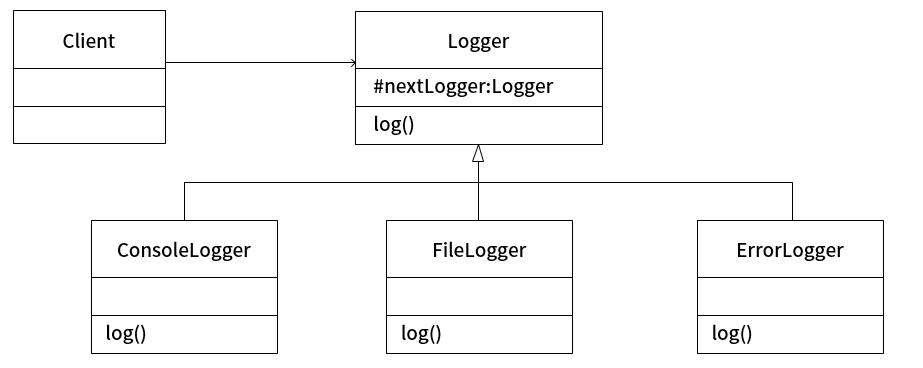
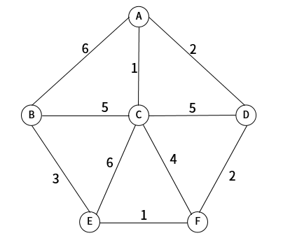

# 2022下半年选择题

- 来源标题: 2022年下半年软件设计师考试基础知识真题（专业解析+参考答案）
- 试卷介绍页: https://wangxiao.xisaiwang.com/tiku2/136/tp30387920.html?cid=136
- 练习页: https://wangxiao.xisaiwang.com/tiku2/exam534904235.html
- 题量: 59

## 第1题（单选题）

以下关于RISC（精简指令集计算机）特点的叙述中，错误的是（B）。

- A. 对存储器操作进行限制，使控制简单化
- B. 指令种类多，指令功能强
- C. 设置大量通用寄存器
- D. 选取使用频率较高的一些指令，提高执行速度

### 正确答案

B

### 解析

RISC的指令格式统一、种类少、寻址方式少，处理速度提高很多。
所以B是错误的。

## 第2题（单选题）

CPU（中央处理单元）的基本组成部件不包括（B）。

- A. 算术逻辑运算单元
- B. 系统总线
- C. 控制单元
- D. 寄存器组

### 正确答案

B

### 解析

本题考查CPU组成基础知识。
系统总线是主板上各个部件之间通讯的线路，不是CPU内部组成内容。
算术逻辑运算单元、控制单元、寄存器组都属于CPU组成部件，本题选择B选项。

## 第3题（单选题）

某种部件用在2000台计算机系统中，运行工作1000小时后，其中有4台计算机的这种部件失效，则该部件的千小时可靠度R为（D）。

- A. 0.990
- B. 0.992
- C. 0.996
- D. 0.998

### 正确答案

D

### 解析

本题考查系统可靠性计算。
相当于是1000台计算机有2台失效，所以998台正常工作，可靠度是0.998。
“2000台计算机系统中，运行工作1000小时后，其中有4台计算机的这种部件失效”则每小时失效率为 4/(2000*1000)=2*10-6。
其千小时可靠度=1-每小时失效率*1000=1-2*10-6*1000=1-0.002=0.998。
ABC描述错误，本题选择D选项。

## 第4题（单选题）

以下存储器中，（A）使用电容存储信息且需要周期性地进行刷新。

- A. DRAM
- B. EPROM
- C. SRAM
- D. EEPROM

### 正确答案

A

### 解析

DRAM，即动态随机存储器，一般用于内存，需要不断地刷新电路，否则数据就消失了。
EPROM是一种断电后仍能保留数据的计算机储存芯片——即非易失性的（非挥发性）。
SRAM是随机存取存储器的一种。这种存储器只要保持通电，里面储存的数据就可以恒常保持
*EEPROM* 是指带电可擦可编程只读存储器。是一种掉电后数据不丢失的存储芯片

## 第5题（单选题）

对于长度相同但格式不同的两种浮点数，假设前者阶码长、尾数短，后者阶码短、尾数长，其他规定都相同，则二者可表示数值的范围和精度情况为（C）。

- A. 二者可表示的数的范围和精度相同
- B. 前者所表示的数的范围更大且精度更高
- C. 前者所表示的数的范围更大但精度更低
- D. 前者所表示的数的范围更小但精度更高

### 正确答案

C

### 解析

浮点数的阶码决定范围，尾数决定精度。
根据题目描述，应该是前者所表示的数的范围更大但精度更低。

## 第6题（单选题）

计算机系统中采用补码表示有符号的数值，（D）。

- A. 可以保持加法和减法运算过程与手工运算方式一致
- B. 可以提高运算过程和结果的精准程度
- C. 可以提高加法和减法运算的速度
- D. 可以将减法运算转化为加法运算从而简化运算器的设计

### 正确答案

D

### 解析

本题考查码制基础知识。
补码是为了运算结果一致，不是为了运算方式一致，手工减法运算方式是不需要转成加法的，补码运算不可以提升运算的精准程度和速度。
使用补码的好处有：
1、可以将符号位和有效数值位统一处理，简化运算规则；
2、减法运算可按加法来处理，进一步简化计算机中运算器的线路设计。
ABC描述错误，本题选择D选项。

## 第7题（单选题）

下列认证方式安全性较低的是（C）。

- A. 生物认证
- B. 多因子认证
- C. 口令认证
- D. U盾认证

### 正确答案

C

### 解析

除了C，其他都是唯一的，无法复制，安全性更大。

## 第8题（单选题）

X.509数字证书标准推荐使用的密码算法是（【#题号#】），而国密SM2数字证书采用的公钥密码算法是（【#题号#】）。
 问题1
 问题2

### 补充题面

["{\"A\":\"RSA\",\"B\":\"DES\",\"C\":\"AES\",\"D\":\"ECC\"}","{\"A\":\"RSA\",\"B\":\"DES\",\"C\":\"AES\",\"D\":\"ECC\"}"]

### 正确答案

A、D

### 解析

X.509数字证书标准推荐使用的密码算法是RSA，
而国密SM2数字证书采用的公钥密码算法是ECC。
该题是常识题，建议使用技巧记忆。
X.509数字证书标准推荐使用的密码算法是RSA，
而国密SM2数字证书采用的公钥密码算法是ECC。
该题是常识题，建议使用技巧记忆。

## 第9题（单选题）

某单位网站首页被恶意篡改，应部署（C）设备阻止恶意攻击。

- A. 数据库审计
- B. 包过滤防火墙
- C. Web应用防火墙
- D. 入侵检测

### 正确答案

C

### 解析

网站属于web应用，可以使用web应用防火墙阻止外部的攻击。

## 第10题（单选题）

使用漏洞扫描系统对信息系统和服务器进行定期扫描可以（A）。

- A. 发现高危风险和安全漏洞
- B. 修复高危风险和安全漏洞
- C. 获取系统受攻击的日志信息
- D. 关闭非必要的网络端口和服务

### 正确答案

A

### 解析

本题考查网络安全技术
漏洞扫描的主要功能是发现并报告漏洞。
修复漏洞还需要下载对应的补丁。
本题选择A选项

## 第11题（单选题）

以下关于某委托开发软件的著作权归属的叙述中，正确的是（C）。

- A. 该软件的著作权归属仅依据委托人与受托人在书面合同中的约定来确定
- B. 无论是否有合同约定，该软件的著作权都由委托人和受托人共同享有
- C. 若无书面合同或合同中未明确约定，则该软件的著作权由受托人享有
- D. 若无书面合同或合同中未明确约定，则该软件的著作权由委托人享有

### 正确答案

C

### 解析

委托开发中，有明确规定，按照规定来。
无明确规定，由开发人员所有。

## 第12题（单选题）

《计算机软件保护条例》第八条第一款第八项规定的软件著作权中的翻译权是将原软件由（D）的权利。

- A. 源程序语言转换成目标程序语言
- B. 一种程序设计语言转换成另一种程序设计语言
- C. 一种汇编语言转换成一种自然语言
- D. 一种自然语言文字转换成另一种自然语言文字

### 正确答案

D

### 解析

《计算机软件保护条例》第八条第一款原文：
软件著作权人享有下列各项权利：
(一)发表权，即决定软件是否公之于众的权利；
(二)署名权，即表明开发者身份，在软件上署名的权利；
(三)修改权，即对软件进行增补、删节，或者改变指令、语句顺序的权利；
(四)复制权，即将软件制作一份或者多份的权利；
(五)发行权，即以出售或者赠与方式向公众提供软件的原件或者复制件的权利；
(六)出租权，即有偿许可他人临时使用软件的权利，但是软件不是出租的主要标的的除外；
(七)信息网络传播权，即以有线或者无线方式向公众提供软件，使公众可以在其个人选定的时间和地点获得软件的权利；
(八)翻译权，即将原软件从一种自然语言文字转换成另一种自然语言文字的权利；
(九)应当由软件著作权人享有的其他权利。
注意：在《软件设计师教程（第5版）》中软件著作权翻译权是将原软件由一种程序设计语言转换成另一种程序设计语言。但本题考查的是“《计算机软件保护条例》第八条第一款第八项规定的软件著作权中的翻译权”内容，此时根据法规原文判断，应该选择D选项。

## 第13题（单选题）

M公司将其开发的某软件产品注册商标为S，为确保公司在市场竞争中占据优势地位，M公司对员工进行了保密约束，此情形下，该公司不享有（B）。

- A. 软件著作权
- B. 专利权
- C. 商业秘密权
- D. 商标权

### 正确答案

B

### 解析

本题考查的是知识产权的相关概念。
软件著作权在作品完成之时就已经存在，所以M公司享有软件著作权。
专利权和商标权都需要申请，本题已注册商标S，但是没有提到专利权申请，所以M公司享有商标权不享有专利权，本题选择B选项。
商业秘密权需要有保密措施才能保护，本题已有保密约束，所以M公司享有商业秘密权。

## 第14题（单选题）

某零件厂商的信息系统中，一个基本加工根据客户类型、订单金额、客户信用等信息的不同采取不同的行为，此时最适宜采用（C）来描述该加工规格说明。

- A. 自然语言
- B. 流程图
- C. 判定表
- D. 某程序设计语言

### 正确答案

C

### 解析

判定表对于有大量判断的加工能很清楚地进行分解。
根据题目意思，此时选择判定表。
自然语言和其他程序设计语言是在实现过程中应用。
流程图是在描述流程时使用 ，在描述加工时不适用。

## 第15题（单选题）

优化模块结构时，（C）不是适当的处理方法。

- A. 使模块功能完整
- B. 消除重复功能，改善软件结构
- C. 只根据模块功能确定规模大小
- D. 避免或减少模块之间的病态连接

### 正确答案

C

### 解析

不能只看模块本身功能，还要看模块之间的关系确定规模大小。
模块的独立性要强；模块的大小的设计不能过大也不能过小，设计的出发点应是保证功能划分的合理性。

## 第16题（单选题）

下图是一个软件项目的活动图，其中顶点表示项目里程碑，连接顶点的边表示包含的活动，边上的数字表示完成该活动所需要的天数。则关键路径长度为（D/B）。若在实际项目进展中，在其他活动都能正常进行的前提下，活动（  ）一旦延期就会影响项目的进度。

### 问题1
- A. 34
- B. 47
- C. 54
- D. 58
### 问题2
- A. A→B
- B. C→F
- C. D→F
- D. F→H

### 正确答案

D、B

### 解析

找到4个选项中最大值58，发现路径ACFIJ符合该值。
所以58就是关键路径长度。
CF处于关键路径，一旦延期，整个进度就会延期。
找到4个选项中最大值58，发现路径ACFIJ符合该值。
所以58就是关键路径长度。
CF处于关键路径，一旦延期，整个进度就会延期。

## 第17题（单选题）

以下关于风险管理的叙述中，不正确的是（B）。

- A. 承认风险是客观存在的，不可能完全避免
- B. 同时管理所有的风险
- C. 风险管理应该贯穿整个项目管理过程
- D. 风险计划本身可能会带来新的风险

### 正确答案

B

### 解析

风险管理不可能管理所有风险，最好决策是根据风险曝光度优先处理损失大的风险。

## 第18题（单选题）

当函数调用执行时，在栈顶创建且用来支持被调用函数执行的一段存储空间称为活动记录或栈帧，栈帧中不包括（B）。

- A. 形参变量
- B. 全局变量
- C. 返回地址
- D. 局部变量

### 正确答案

B

### 解析

本题考查程序设计语言基础知识。
栈帧是虚拟机栈的一个单位，是运行时数据区。
包含局部变量、返回地址、形参变量、动态数据等。
全局变量通常不直接存储在栈帧中，而是存储在程序的静态数据区（或称为全局/静态存储区）。
因此，ACD描述与题意不符，本题选择B选项。

## 第19题（单选题）

编译器与解释器是程序语言翻译的两种基本形态，以下关于编译器工作方式及特点的叙述中，正确的是（D）。

- A. 边翻译边执行，用户程序运行效率低且可移植性差
- B. 先翻译后执行，用户程序运行效率高且可移植性好
- C. 边翻译边执行，用户程序运行效率低但可移植性好
- D. 先翻译后执行，用户程序运行效率高但可移植性差

### 正确答案

D

### 解析

编译器把源程序先翻译，得到目标代码。
最后由机器直接执行。
整个过程运行效率高，但是只适合特定的机器，所以可移植性差。

## 第20题（单选题）

对高级语言源程序进行编译或解释过程中需进行语法分析，递归子程序分析属于（A）的分析法。

- A. 自上而下
- B. 自下而上
- C. 从左至右
- D. 从右至左

### 正确答案

A

### 解析

本题考查编译器工作过程相关知识。
自上而下：这通常指的是编译器在构建抽象语法树或中间代码时，从程序的最高级别（如主函数或入口点）开始，然后逐步向下（到更小的函数、语句、表达式等）进行分析和转换。递归子程序分析可以被视为这种策略的一部分，因为它可能从主程序开始，然后递归地进入子程序。
自下而上：这种方法与自上而下相反，它通常从最小的语法单元（如标识符、运算符、字面量等）开始，然后逐步向上构建更大的语法结构（如表达式、语句、函数等）。虽然某些编译器优化或代码生成阶段可能采用这种方法，但递归子程序分析本身并不直接对应这种策略。
从左至右：这更多地与词法分析和句法分析的扫描方向有关，指的是编译器从左到右扫描源代码。这不是一个描述递归子程序分析方向的术语。
从右至左：同样，这也是一个与扫描方向相关的术语，但在大多数编程语言中，源代码的语法结构并不是从右到左构建的。
递归子程序法是一种确定的自顶向下语法分析方法，所有从递归两字可以知道，是 从上到下的分析方式。
因此，BCD描述与题意不符，本题选择A选项。

## 第21题（单选题）

在计算机系统中，若P1进程正在运行，操作系统强行撤下P1进程所占用的CPU，让具有更高优先级的进程P2运行，这种调度方式称为（C）。

- A. 中断方式
- B. 先进先出方式
- C. 可剥夺方式
- D. 不可剥夺方式

### 正确答案

C

### 解析

本题考查进程状态相关知识。
撤下当前进程，让优先级更高的进程运行。
这种调度方式称为可剥夺方式。反之，就是不可剥夺方式。
中断方式是程序因为IO造成阻塞的处理方式。
先进先出是队列存储数据的顺序。
因此，ABD描述错误，本题选择C选项。

## 第22题（单选题）

进程P1、P2、P3、P4、P5和P6的前趋图如下所示。假设用PV操作来控制这6个进程的同步与互斥的程序如下，程序中的空①和空②处应分别为（C/C/D），空③和空④处应分别为（ ），空⑤和空⑥处应分别为（ ）。

### 问题1
- A. V（S1）V（S2）和P（S2）P（S3）
- B. V（S1）P（S2）和V（S3）P（S4）
- C. V（S1）V（S2）和V（S3）V（S4）
- D. P（S1）P(S2）和V（S2）V（S3）
### 问题2
- A. V（S3）和V（S6）V（S7）
- B. V（S3）和V（S6）P（S7）
- C. P（S3）和V（S6）V（S7）
- D. P（S3）和P（S6）V（S7）
### 问题3
- A. V（S6）和P（S7）P（S8）
- B. P（S8）和P（S7）P（S8）
- C. P（S8）和P（S7）V（S8）
- D. V（S8）和P（S7）P（S8）

### 正确答案

C、C、D

### 解析

P1的后继是P2和P3，P2锁定S1，P3锁定S2，
所以P1要释放S1,S2，第一空就是 V(S1) V（S2）。
P2的后继是P3、P4，所以第二空是 V(S3),V(S4)。
P3的前驱是P2和P1，所以第三空是 P（S3）。
P4的后继是P5和P6，所以第四空是 V(S6) V(S7)。
P5的后继是P6，所以第五空是V（S8）。
P6的前驱是P5和P4，所以第六空是P（S7）P（S8）。
P1的后继是P2和P3，P2锁定S1，P3锁定S2，
所以P1要释放S1,S2，第一空就是 V(S1) V（S2）。
P2的后继是P3、P4，所以第二空是 V(S3),V(S4)。
P3的前驱是P2和P1，所以第三空是 P（S3）。
P4的后继是P5和P6，所以第四空是 V(S6) V(S7)。
P5的后继是P6，所以第五空是V（S8）。
P6的前驱是P5和P4，所以第六空是P（S7）P（S8）。
P1的后继是P2和P3，P2锁定S1，P3锁定S2，
所以P1要释放S1,S2，第一空就是 V(S1) V（S2）。
P2的后继是P3、P4，所以第二空是 V(S3),V(S4)。
P3的前驱是P2和P1，所以第三空是 P（S3）。
P4的后继是P5和P6，所以第四空是 V(S6) V(S7)。
P5的后继是P6，所以第五空是V（S8）。
P6的前驱是P5和P4，所以第六空是P（S7）P（S8）。

## 第23题（单选题）

假设段页式存储管理系统中的地址结构如下图所示，则系统（D）。

- A. 最多可有512个段，每个段的大小均为2048个页，页的大小为8K
- B. 最多可有512个段，每个段最大允许有2048个页，页的大小为8K
- C. 最多可有1024个段，每个段的大小均为1024个页，页的大小为4K
- D. 最多可有1024个段，每个段最大允许有1024个页，页的大小为4K

### 正确答案

D

### 解析

本题考查段页式存储相关计算。
页内地址有12个位，能表示的大小是 2的12次方，也就是4k。
页号地址有10位，最多能表示1024个页即210页。
段号地址有10位，最多能表示1024个段即210。
因此，ABC描述错误，本题选择D选项。

## 第24题（单选题）

假设磁盘磁头从一个磁道移至相邻磁道需要2ms。文件在磁盘上非连续存放，逻辑上相邻数据块的平均移动距离为5个磁道，每块的旋转延迟时间及传输时间分别为10ms和1ms，则读取一个100块的文件需要（C）ms。

- A. 1100
- B. 1200
- C. 2100
- D. 2200

### 正确答案

C

### 解析

本题考查磁盘管理相关计算。
读取一块数据的时间=移动时间+旋转延迟时间+传输时间。
根据题目意思，此时读取一块数据的时间是 2*5+10+1=21ms。
现在要读100个文件块，那么时间是2100ms。
因此，ABD错误，本题选择C选项。

## 第25题（单选题）

以下关于快速原型模型优点的叙述中，不正确的是（B）。

- A. 有助于满足用户的真实需求
- B. 适用于大型软件系统的开发
- C. 开发人员快速开发出原型系统，因此可以加速软件开发过程，节约开发成本
- D. 原型系统已经通过与用户的交互得到验证，因此对应的规格说明文档能正确描述用户需求

### 正确答案

B

### 解析

考察软件开发模型的特点
快速原型模型虽然能够迅速反馈用户需求，但在处理大型系统的复杂性和长期稳定性方面存在一定的挑战。它更适用于小型的软件系统，或者用户不能清晰描述需求和需求可能变化较大的情况。

## 第26题（单选题）

以下关于三层C/S结构的叙述中，不正确的是（C）。

- A. 允许合理划分三层结构的功能，使之在逻辑上保持相对独立性，提高系统的可维护性和可扩展性
- B. 允许更灵活有效地选用相应的软硬件平台和系统
- C. 应用的各层可以并行开发，但需要相同的开发语言
- D. 利用功能层有效地隔开表示层和数据层，便于严格的安全管理

### 正确答案

C

### 解析

本题考察三层结构
对于典型的MVC结构。
前端用HTML语言，控制层和模型层用Java语言。
所以不一定需要相同的开发语言。

## 第27题（单选题）

若模块A和模块B通过外部变量来交换输入、输出信息，则这两个模块的耦合类型是（D）耦合。

- A. 数据
- B. 标记
- C. 控制
- D. 公共

### 正确答案

D

### 解析

多个模块共享同一个公共的数据环境，同享多个变量，则是公共耦合。
数据耦合：一个模块访问另一个模块时，彼此之间是通过简单数据参数（不是控制参数、公共数据结构或外部变量）来交换输入、输出信息的。
标记耦合：一组模块通过参数表传递记录信息。这个记录是某一数据结构的子结构，而不是简单变量。
控制耦合：如果一个模块通过传送开关、标志、名字等控制信息，明显地控制选择另一模块的功能，就是控制耦合。
公共耦合：若一组模块都访问同一个公共数据环境，则它们之间的耦合就称为公共耦合。公共的数据环境可以是全局数据结构共享的通信区、内存的公共覆盖区等。

## 第28题（单选题）

软件开发的目标是开发出高质量的软件系统，这里的高质量不包括（C）。

- A. 软件必须满足用户规定的需求
- B. 软件应遵循规定标准所定义的一系列开发准则
- C. 软件开发应采用最新的开发技术
- D. 软件应满足某些隐含的需求，如可理解性、可维护性等

### 正确答案

C

### 解析

高质量不包括用最新的技术。
最新技术往往不稳定，容易造成软件系统也不稳定。
本题选择C选项。

## 第29题（单选题）

白盒测试技术的各种覆盖方法中，（B）具有最弱的错误发现能力。

- A. 判定覆盖
- B. 语句覆盖
- C. 条件覆盖
- D. 路径覆盖

### 正确答案

B

### 解析

语句覆盖：设计若干个测试用例，运行被测程序，使得每一可执行语句至少执行一次。
判定覆盖：使设计的测试用例保证程序中每个判断的每个取值分支至少经历一次。
条件覆盖：选择足够的测试用例，使得运行这些测试用例时，判定中每个条件的所有可能结果至少出现一次，但未必能覆盖全部分支。
判定条件覆盖：设计足够的测试用例，使得判断中每个条件的所有可能取值至少执行一次，同时每个判断的所有可能判断结果至少执行，即要求各个判断的所有可能的条件取值组合至少执行一次。
条件组合覆盖：选择足够的测试用例，使所有判定中各条件判断结果的所有组合至少出现一次，满足这种覆盖标准成为条件组合覆盖。
路径覆盖：是每条可能执行到的路径至少执行一次。
语句覆盖是最弱的路径覆盖，包含的情况少，发现错误能力弱。

## 第30题（单选题）

文档是软件的重要因素，关于高质量文档，以下说法不正确的是（A）。

- A. 不论项目规模和复杂程度如何，都要用统一的标准指定相同类型和相同要素的文档
- B. 应该分清读者对象
- C. 应当是完整的、独立的、自成体系的
- D. 行文应十分确切，不出现多义性描述

### 正确答案

A

### 解析

本题考察软件文档的相关概念。
软件文档根据使用者不同分成不同类型。
所以有不同标准和不同要素。
本题选择A选项。

## 第31题（单选题）

某财务系统的一个组件中，某个变量没有正确初始化，（A）最可能发现该错误。

- A. 单元测试
- B. 集成测试
- C. 接受测试
- D. 安装测试

### 正确答案

A

### 解析

组件就是模块，单个模块的测试我们用单元测试。
集成测试，也叫组装测试或联合测试。在单元测试的基础上，将所有模块按照设计要求（如根据结构图）组装成为子系统或系统，进行集成测试
接受测试是基于客户或终用户的规格书的终测试,或基于用户一段时间的使用后,看软件是否满足客户要求
安装测试确保该软件在正常情况和异常情况的不同条件下，例如，进行首次安装、升级、完整的或自定义的安装都能进行安装。
本题选择A选项。

## 第32题（单选题）

软件交付给用户之后进入维护阶段，根据维护具体内容的不同将维护分为不同的类型，其中“采用专用的程序模块对文件或数据中的记录进行增加、修改和删除等操作”的维护属于（B）。

- A. 程序维护
- B. 数据维护
- C. 代码维护
- D. 设备维护

### 正确答案

B

### 解析

题目明确说明对于数据进行增删查改，所以是数据维护。

## 第33题（单选题）

采用面向对象方法进行某游戏设计，游戏中有野鸭、红头鸭等各种鸭子边游泳戏水边呱呱叫，不同种类的鸭子具有不同颜色，设计鸭子类负责呱呱叫和游泳方法的实现，显示颜色设计为抽象方法，由野鸭和红头鸭各自具体实现，这一机制称为（A/D）。当给这些类型的一组不同对象发送同一显示颜色消息时，能实现各自显示自己不同颜色的结果，这种现象称为（  ）。

### 问题1
- A. 继承
- B. 聚合
- C. 组合
- D. 多态
### 问题2
- A. 覆盖
- B. 重载
- C. 动态绑定
- D. 多态

### 正确答案

A、D

### 解析

本题考查面向对象的基本概念。
父类定义抽象，子类实现具体，这一机制叫做继承。
聚合是一个类由多个子类对象组成。
组合是一个类包含多个子类对象
同一消息传递，得到不同结果，这种现象叫做多态。
本题选择A选项
子类重写父类方法叫做覆盖。
同一个类中多个方法同名叫做重载。
在程序运行时，才能确定具体调用方法，叫做动态绑定。
同一消息传递，得到不同结果，这种现象就叫做多态。
本题选择A、D选项。

## 第34题（单选题）

采用面向对象方法分析时，首先要在应用领域中按自然存在的实体认定对象，即将自然存在的“（C）”作为一个对象。

- A. 问题
- B. 关系
- C. 名词
- D. 动词

### 正确答案

C

### 解析

本题考查面向对象的基本概念。
实体或者对象一般都是名词。
本题选择C选项。

## 第35题（单选题）

进行面向对象系统设计时，修改某个类的原因有且只有一个，即一个类只做一种类型的功能，这属于（A）原则。

- A. 单一责任
- B. 开放-封闭
- C. 接口分离
- D. 依赖倒置

### 正确答案

A

### 解析

开放-封闭：软件实体应该是可扩展，而不可修改的。也就是说，对扩展是开放的，而对修改是封闭的
接口分离原则指在设计时采用多个与特定客户类有关的接口比采用一个通用的接口要好
依赖倒置原则(Dependence Inversion Principle)是程序要依赖于抽象接口，不要依赖于具体实现
修改某个类的原因有且只有一个，即一个类只做一种类型的功能，该原则叫做单一责任。

## 第36题（单选题）

UML活动图用于建模（C/D）。以下活动图中，活动A1之后，可能的活动执行序列顺序是（  ）。

### 问题1
- A. 系统在它的周边环境的语境中所提供的外部可见服务
- B. 某一时刻一组对象以及它们之间的关系
- C. 系统内从一个活动到另一个活动的流程
- D. 对象的生命周期中某个条件或者状态
### 问题2
- A. A2、A3、A4和A5
- B. A3、A4和A5，或A2、A4和A5
- C. A2、A4和A5
- D. A2或A3、A4和A5

### 正确答案

C、D

### 解析

活动图用于表示系统内从一个活动到另一个活动的流程。
根据分支可得，A2是一个分支，A3、A4、A5是一个分支，
两者只能执行一个。只有D满足。

## 第37题（单选题）

UML构件图（component diagram）展现了一组构件之间的组织和依赖，专注于系统的静态（B）视图，图中通常包括构件、接口以及各种关系。

- A. 关联
- B. 实现
- C. 结构
- D. 行为

### 正确答案

B

### 解析

构件图用于表示系统部署、实现时，各个构建之间的关系。
所以，是系统的静态实现图。选择B。

## 第38题（单选题）

在某系统中，不同级别的日志信息记录方式不同，每个级别的日志处理对象根据信息级别高低，采用不同方式进行记录。每个日志处理对象检查消息的级别，如果达到它的级别则进行记录，否则不记录；然后将消息传递给它的下一个日志处理对象。针对此需求，设计如下所示类图。该设计采用（A/B/B）模式使多个前后连接的对象都有机会处理请求，从而避免请求的发送者和接收者之间的耦合关系。该模式属于（  ）模式，该模式适用于（  ）。

### 问题1
- A. 责任链（Chain of Responsibility）
- B. 策略（Strategy）
- C. 过滤器（Filter）
- D. 备忘录（Memento）
### 问题2
- A. 行为型类
- B. 行为型对象
- C. 结构型类
- D. 结构型对象
### 问题3
- A. 不同的标准过滤一组对象，并通过逻辑操作以解耦的方式将它们链接起来
- B. 可处理一个请求的对象集合应被动态指定
- C. 必须保存一个对象在某一个时刻的状态，需要时它才能恢复到先前的状态
- D. 一个类定义了多种行为，并且以多个条件语句的形式出现

### 正确答案

A、B、B

### 解析

本题考察的是设计模式的相关概念
创建型模式，共五种：工厂方法模式、抽象工厂模式、单例模式、建造者模式、原型模式。结构型模式，共七种：适配器模式、装饰器模式、代理模式、外观模式、桥接模式、组合模式、享元模式。行为型模式，共十一种：策略模式、模板方法模式、观察者模式、迭代子模式、责任链模式、命令模式、备忘录模式、状态模式、访问者模式、中介者模式、解释器模式。
根据题干“使多个前后连接的对象都有机会处理请求”可知，
责任链模式适合实现该功能。
责任链模式属于行为型对象模式。
该模式适用于“可处理一个请求的对象集合应被动态指定”。
A是过滤器模式，C是备忘录模式，D是策略模式

## 第39题（单选题）

驱动新能源汽车的发动机时，电能和光能汽车分别采用不同驱动方法，而客户端希望使用统一的驱动方法，需定义一个统一的驱动接口屏蔽不同的驱动方法，该要求适合采用（D）模式。

- A. 中介者（Mediator）
- B. 访问者（Visitor）
- C. 观察者（Observer）
- D. 适配器（Adapter）

### 正确答案

D

### 解析

根据题干“客户端使用接口统一”，选择D适配器模式。
中介者模式:用一个中介者对象来封装一系列的对象交互,中介者使各对象不需要显示地相互引用,从而使其松散耦合,而且可以独 立地改变它们之间的交互
观察者模式定义了对象之间一对多依赖关系,当目标对象(被观察者)的状态发生改变时,它的所有依赖者(观察者)都会收到通知
访问者模式,即在不改变聚合对象内元素的前提下,为聚合对象内每个元素提供多种访问方式,即聚合对象内的每个元素都有多个访问者对象

## 第40题（单选题）

在Python3中，（C）不是合法的异常处理结构。

- A. try…except…
- B. try…except…finally
- C. try…catch…
- D. raise

### 正确答案

C

### 解析

Java中处理异常使用try-catch，Python使用try-except。

## 第41题（单选题）

在Python3中，表达式list(range(11))[10:0:-2]的值为（B）。

- A. [10,8,6,4,2,0]
- B. [10,8,6,4,2]
- C. [0,2,4,6,8,10]
- D. [0,2,4,6,8）

### 正确答案

B

### 解析

本题考查python基础知识。
range(11)产生0-10共11个数据。
[10:0:-2]表示从下标为10遍历到下标为0，递减是2。
但是不包含下标为0的数据，
也就是 10 8 6 4 2。
ACD描述与题意不符，本题选择B选项。

## 第42题（单选题）

在Python3中，执行语句x=input()，如果从键盘输入123并按回车键，则x的值为（D）。

- A. 123
- B. 1,2,3
- C. 1 2 3
- D. '123'

### 正确答案

D

### 解析

[['本题考查Python语言基础语法。
input()方法把输入内容都当成字符串返回，即x是字符串'123'。
因此，ABC描述与题意不符，本题选择D选项。
']]

## 第43题（单选题）

E-R模型向关系模型转换时，两个实体E1和E2之间的多对多联系R应该转换为一个独立的关系模式，且该关系模式的关键字由（C）组成。

- A. 联系R的属性
- B. E1或E2的关键字
- C. E1和E2的关键字
- D. E1和E2的关键字加上R的属性

### 正确答案

C

### 解析

本题考查概念结构设计
多对多关系的中间表关键字由两张表的关键字组合而成。
本题选择C选项

## 第44题（单选题）

某高校人力资源管理系统的数据库中，教师关系模式为T（教师号，姓名，部门号，岗位，联系地址，薪资），函数依赖集F={教师号→（姓名，部门号，岗位，联系地址），岗位→薪资｝。T关系的主键为（A/B），函数依赖集F（  ）。

### 问题1
- A. 教师号，T存在冗余以及插入异常和删除异常的问题
- B. 教师号，T不存在冗余以及插入异常和删除异常的问题
- C. （教师号，岗位），T存在冗余以及插入异常和删除异常的问题
- D. （教师号，岗位），T不存在冗余以及插入异常和删除异常的问题
### 问题2
- A. 存在传递依赖，故关系模式T最高达到1NF
- B. 存在传递依赖，故关系模式T最高达到2NF
- C. 不存在传递依赖，故关系模式T最高达到3NF
- D. 不存在传递依赖，故关系模式T最高达到4NF

### 正确答案

A、B

### 解析

根据题干可知，T关系的主键就是“教师号”。
“教师号”可以决定其他所有字段。
由于存在非主属性“岗位”可推导出其他属性“薪资”，
所以该关系存在传递函数依赖，有数据操作异常问题。
达不到第三范式，只达到第二范式。
根据题干可知，T关系的主键就是“教师号”。
“教师号”可以决定其他所有字段。
由于存在非主属性“岗位”可推导出其他属性“薪资”，
所以该关系存在传递函数依赖，有数据操作异常问题。
达不到第三范式，只达到第二范式。

## 第45题（单选题）

给定员工关系E(员工号，员工名，部门名，电话，家庭住址）、工程关系P（工程号，工程名，前期工程号）、参与关系EP（员工号，工程号，工作量）。查询“005”员工参与了“虎头山隧道”工程的员工名、部门名、工程名、工作量的关系代数表达式如下：
π2,3,5,6 (π1,2,3（（B/D））⋈（（  ））)

### 问题1
- A. 𝜎2=‘005’（E）
- B. 𝜎1=‘005’（E）
- C. 𝜎2=‘005’（P）
- D. 𝜎1=‘005’（P）
### 问题2
- A. π2,3(σ2=’虎头山隧道’(P)) ⋈ EP
- B. π2,3 (σ2=’虎头山隧道’(EP)) ⋈ P
- C. π1,2 (σ2=’虎头山隧道’(EP)) ⋈ P
- D. π1,2 (σ2=’虎头山隧道’(P)) ⋈ EP

### 正确答案

B、D

### 解析

[['首先在员工关系表中，查询1号字段“员工号”为'005'的员工信息，第一空选B。
然后把工程关系和参与关系进行连接查询，得到“虎头山隧道”的详细信息，第二空选D。
'],['首先在员工关系表中，查询1号字段“员工号”为'005'的员工信息，第一空选B。
然后把工程关系和参与关系进行连接查询，得到“虎头山隧道”的详细信息，第二空选D。
']]

## 第46题（单选题）

假设事务程序A中的表达式x/y，若y取值为0，则计算该表达式时，会产生故障。该故障属于（B）。

- A. 系统故障
- B. 事务故障
- C. 介质故障
- D. 死机

### 正确答案

B

### 解析

本题考查事务的特性
y为0的时候，会发生被除数为0的错误。
此时是在事务程序中发生的错误，叫做事务故障。
本题选择B选项

## 第47题（单选题）

设栈初始时为空，对于入栈序列1，2，3,...,n,这些元素经过栈之后得到出栈序列p1，p2，p3，... ，pn，若p3=4，则p1，p2不可能的取值为（C）。

- A. 6,5
- B. 2,3
- C. 3,1
- D. 3,5

### 正确答案

C

### 解析

本题考查队列与栈基础知识。
A项1,2,3,4,5,6依次入栈，之后p1=6出栈，p2=5出栈，p3=4出栈，符合。
B项1,2入栈，之后p1=2出栈，3入栈，p2=3出栈，4入栈，p3=4出栈，符合。
C项中，当p1是3的时候，栈中从上到下是2,1，2必须在1之前出栈，所以p2不可能是1。
D项1,2,3入栈，p1=3出栈，4,5入栈，p2=5出栈，p3=4出栈，符合。
本题选择C选项。

## 第48题（单选题）

设m和n是某二叉树上的两个节点，中序遍历时，n排在m之前的条件是（D）。

- A. m是n的祖先节点
- B. m是n的子孙节点
- C. m在n的左边
- D. m在n的右边

### 正确答案

D

### 解析

本题考查二叉树的遍历。
中序遍历的顺序标准是左-根-右。
A项如果m是n的祖先结点，但n在m的右子树中，那么在中序遍历中，n会在m之后被访问。
B项如果m是n的子孙结点，但m在n的左子树中，那么在中序遍历中，n会在m之后被访问。
C项m在n的左边，那么在中序遍历中，n会在m之后被访问。
因此，ABC描述与题意不符，本题选择D选项。

## 第49题（单选题）

若无向图G有n个顶点e条边，则G采用邻接矩阵存储时，矩阵的大小为（B）。

- A. n*e
- B. n2
- C. n2+e2
- D. （n+e)2

### 正确答案

B

### 解析

采用邻接矩阵存储图中点与点的关系，
有N个点，就有N*N个元素。
有e条边，所有有e个元素为1。

## 第50题（单选题）

以下关于m阶B-树的说法中，错误的是（D）。

- A. 根节点最多有m棵子树
- B. 所有叶子节点都在同一层次上
- C. 节点中的关键字有序排列
- D. 叶子节点通过指针链接为有序表

### 正确答案

D

### 解析

本题考查二叉树的相关特点。
在m阶B-树中，一个非叶子节点最多可以有m棵子树，也意味着它最多可以有m-1个关键字（因为子树的数量比关键字数量多1）。
B-树的一个重要特性是所有叶子节点都在同一层次上，这意味着B-树总是平衡的。
在B-树中，每个节点的关键字都是按升序或降序排列的。这使得在B-树中查找、插入和删除操作更为高效。
在标准的B-树定义中，叶子节点之间并不通过指针链接为有序表。它们只是简单地存储关键字（可能还有指向相应数据记录的指针），但叶子节点之间并没有直接的链接。这种通过指针链接叶子节点的结构是B+树（B+-tree）的一个特性，而不是B-树的特性。  
因此，ABC说法正确，本题选择D选项。

## 第51题（单选题）

下列排序算法中，占用辅助存储空间最多的是（A）。

- A. 归并排序
- B. 快速排序
- C. 堆排序
- D. 冒泡排序

### 正确答案

A

### 解析

本题考查排序算法-空间复杂度。
归并排序需要n个空间，
快速排序需要lgn个空间，
堆排序需要1个空间，
冒泡排序需要1个空间。
因此，BCD描述与题意不符，本题选择A选项。

## 第52题（单选题）

折半查找在有序数组A中查找特定的记录K：通过比较K和数组中的中间元素A[mid]进行，如果相等，则算法结束；如果K小于A[mid]，则对数组的前半部分进行折半查找；否则对数组的后半部分进行折半查找。根据上述描述，折半查找算法采用了（A/C）算法设计策略。对有序数组（3，14，27，39，42，55，70，85，93，98），成功查找和失败查找所需要的平均比较次数分别是（  ）（假设查找每个元素的概率是相同的）

### 问题1
- A. 分治
- B. 动态规划
- C. 贪心
- D. 回溯
### 问题2
- A. 29/10和29/11
- B. 30/10和30/11
- C. 29/10和39/11
- D. 30/10和40/11

### 正确答案

A、C

### 解析

本题考查算法基础-二分法。
折半查找算法通过不断将待查找的区间分成两半，并根据待查找元素与区间中间元素的比较结果，决定是继续在左半部分查找还是右半部分查找。这种“分而治之”的策略正是分治算法的核心思想。第一问选择A选项。
折半查找成功的过程，可以理解为对这10个元素分别查找成功。
对各个元素进行编号依次为1、2、3、......、10，此时：
（1）1次查找成功的元素是（1+10）/2=5号元素，也就是42；
（2）2次查找成功的元素可能是（1+4）/2=2或者（6+10）/2=8，也就是2号位置14，或者8号位置85；
（3）3次查找成功的元素可能是1号元素、3号元素27、6号元素55或者9号元素93；
（4）4次查找成功的元素可能是4号元素39、7号元素70或者10号元素98。
此时平均查找次数为（1+2*2+4*3+3*4）/10=29/10。
折半查找失败的过程，可以理解为对处于这10个元素之前的间隔位置的数进行了查找，对各个元素间隔进行编号依次为1、2、3、......、11，此时：
（1）1号间隔位于3的左侧，此时需要分别与元素42、14、3比较后才会查找失败，比较次数为3；
（2）2号位置位于3和14之间，此时需要分别与元素42、14、3比较后才会查找失败，比较次数为3；
（3）3号位置位于14和27之间，此时需要分别与元素42、14、27比较后才会查找失败，比较次数为3；
（4）4号位置位于27和39之间，此时需要分别与元素42、14、27、39比较后才会查找失败，比较次数为4；
（5）5号位置位于39和42之间，此时需要分别与元素42、14、27、39比较后才会查找失败，比较次数为4；
（6）6号位置位于42和55之间，此时需要分别与元素42、85、55比较后才会查找失败，比较次数为3；
（7）7号位置位于55和77之间，此时需要分别与元素42、85、55、77比较后才会查找失败，比较次数为4；
（8）8号位置位于77和85之间，此时需要分别与元素42、85、55、77比较后才会查找失败，比较次数为4；
（9）9号位置位于85和93之间，此时需要分别与元素42、85、93比较后才会查找失败，比较次数为3；
（10）10号位置位于93和98之间，此时需要分别与元素42、85、93、98比较后才会查找失败，比较次数为4；
（11）11号位置位于98右侧，此时需要分别与元素42、85、93、98比较后才会查找失败，比较次数为4；
此时平均查找次数为（3*5+4*6）/11=39/11。
把成功查找出所有元素的比较次数加起来是29，然后除10，就是29/10。
找出11个中间数，进行失败查询。先把总的比较次数加起来是39，然后除11，就是39/11。
因此第二问选择C选项。

## 第53题（单选题）

采用Dijkstra算法求解下图A点到E点的最短路径，采用的算法设计策略是（C/A）。该最短路径的长度是（  ）。

### 问题1
- A. 分治法
- B. 动态规划
- C. 贪心算法
- D. 回溯法
### 问题2
- A. 5
- B. 6
- C. 7
- D. 9

### 正确答案

C、A

### 解析

本题考查算法基础知识。
Dijkstra算法算是贪心思想实现的，首先把起点到所有点的距离存下来找个最短的，然后松弛一次再找出最短的。第一问选择C选项。
本题可以利用选项验证，找到最小值5，然后对比题干图示，最短路径ADFE的长度为5，第二问选择A选项。

## 第54题（单选题）

VLAN tag在OSI参考模型的（C）实现。

- A. 网络层
- B. 传输层
- C. 数据链路层
- D. 物理层

### 正确答案

C

### 解析

本题考查开放系统互连模型
VLAN tag技术主要用于交换机，交换机属于OSI中的数据链路层。 
本题选择C选项。

## 第55题（单选题）

Telnet协议是一种（C）的远程登录协议。

- A. 安全
- B. B/S模式
- C. 基于TCP
- D. 分布式

### 正确答案

C

### 解析

Telnet属于远程登录协议，对于通信质量要求较高，采用了TCP协议确保高质量的通讯。

## 第56题（单选题）

以下关于HTTPS和HTTP协议的叙述中，错误的是（D）。

- A. HTTPS协议使用加密传输
- B. HTTPS协议默认服务端口号是443
- C. HTTP协议默认服务端口号是80
- D. 电子支付类网站应使用HTTP协议

### 正确答案

D

### 解析

本题考查网络安全协议
电子支付类网站对于安全性要求很高，要采用https协议，所以D错误。
Http协议默认端口是80，Https协议默认端口是443。
Https的s表示安全，属于加密传输协议。  
本题选择D选项。

## 第57题（单选题）

将网址转换为IP地址要用（A）协议。

- A. 域名解析
- B. IP地址解析
- C. 路由选择
- D. 传输控制

### 正确答案

A

### 解析

域名解析协议用于把文本标识的网址转换成数字标识的IP地址。ARP协议是根据IP地址获取物理地址的一个TCP/IP协议。

## 第58题（单选题）

下面关于IP地址和MAC地址说法错误的是（D）。

- A. IP地址长度32或128位，MAC地址的长度48位
- B. IP地址工作在网络层，MAC地址工作在数据链路层
- C. IP地址的分配是基于网络拓扑，MAC地址的分配是基于制造商
- D. IP地址具有唯一性，MAC地址不具有唯一性

### 正确答案

D

### 解析

本题考查IP地址分类
IP地址由服务器分配，不具备唯一性。
MAC地址具有唯一性，每一个硬件设备都有唯一的MAC地址。
本题选择D选项。

## 第59题（单选题）

We initially described SOA without mentioning Web services, and vice versa. This is because they are orthogonal : service-orientation is an architectural（B/C/B/A/D）, while Web services are an implementation（ ）. The two can be used together, and they frequently are, but they are not mutually dependent.
For example, although it is widely considered to be a distributed-computing solution, SOA can be applied to advantage in a single system, where services might be individual processes with well-defined（ ）that communicate using local channels, or in self-contained cluster, where they might communicate across a high-speed interconnect.
Similarly, while Web services are （ ）as the basis for a service-oriented environment, there is nothing in their definition that requires them to embody the SOA principles. While （ ）is often held up as a key characteristic of Web services, there is no technical reason that they should be stateless—that would be a design choice of the developer, which may be dictated by the architectural style of the environment in which the service is intended to participate.

### 问题1
- A. design
- B. style
- C. technology
- D. structure
### 问题2
- A. structure
- B. style
- C. technology
- D. method
### 问题3
- A. interfaces
- B. functions
- C. logics
- D. formats
### 问题4
- A. regarded
- B. well-suited
- C. worked
- D. used
### 问题5
- A. distribution
- B. interconnection
- C. dependence
- D. statelessness

### 正确答案

B、C、B、A、D

### 解析

我们最初描述SOA时没有提到Web服务，反之亦然。这是因为它们是正交的，面向服务是一种体系结构（style风格）。
而Web服务是一个实现（technology技术）。两者可以一起使用，而且经常是，但它们并不相互依赖。
例如，尽管SOA被广泛认为是一种分布式计算解决方案，但它可以在单个系统中得到应用，其中服务可能是使用本地通道开始的定义明确的单独进程（functions功能），或者在自己的集群中，它们可以通过高速互联进行通信。
同样，虽然Web服务被（regarded视为）是面向服务环境的基础，但它们的定义中没有任何内容要求它们遵循SOA原则。
虽然（statelessness无状态）通常被认为是Web服务的一个关键特性，但没有技术上的理由认为它们应该是无状态的，这将是开发人员的一个设计选择，这可能取决于由服务要参与的环境架构风格。
