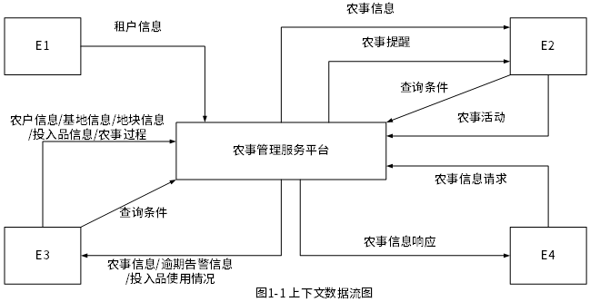
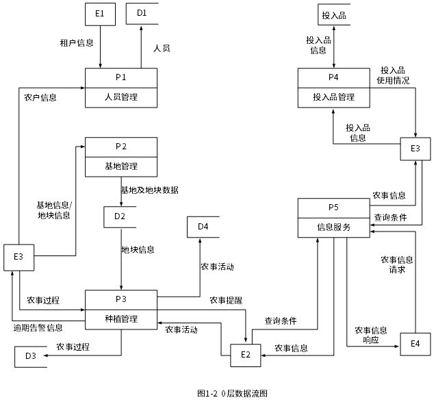
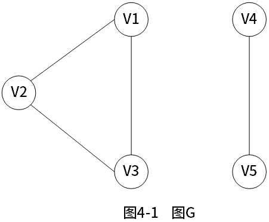
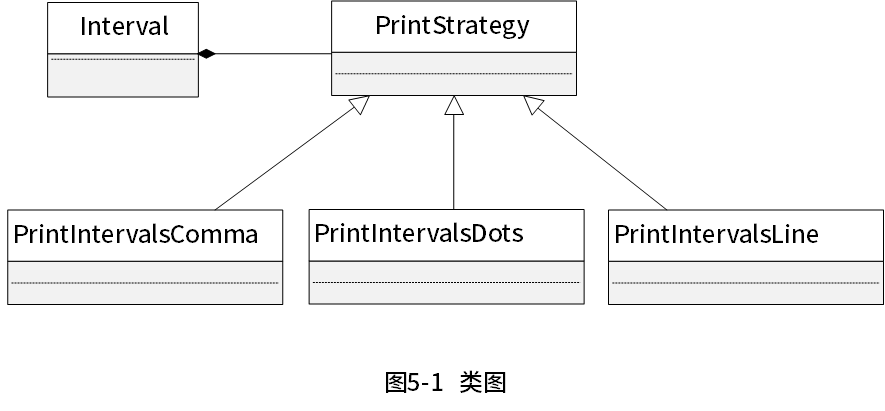

# 2023上半年案例题

- 来源标题: 2023年上半年软件设计师考试应用技术真题（专业解析+参考答案）
- 试卷介绍页: https://wangxiao.xisaiwang.com/tiku2/136/tp30397886.html?cid=136
- 练习页: https://wangxiao.xisaiwang.com/tiku2/exam534903307.html
- 题量: 6

## 第1题（案例题）

阅读下列说明和图，回答问题1至问题4，将解答填入答题纸的对应栏内。
随着农业领域科学种植的发展，需要对农业基地及农事进行信息化管理，为租户和农户等人员提供种植相关服务。现欲开发农事管理服务平台，其主要功能是：
（1）人员管理。平台管理员管理租户；租户管理农户并为其分配负责的地块。租户和农户以人员类型区分。
（2）基地管理。租户填写基地名称、地域等描述信息，在显示的地图上绘制地块。
（3）种植管理。租户设定作物及其从种植到采收的整个农事过程，包括农事活动及其实施计划；农户根据相应农事过程提醒进行农事活动并记录。系统会在设定时间向农户进行农事提醒；对逾期未实施活动向租户发出逾期告警。
（4）投入品管理。租户统一维护化肥、杀虫剂等投入品信息，农户在农事活动中设定投入品的实际消耗。
（5）信息服务。用户按查询条件发起农事信息请求，对相关地块农事活动实施情况（如与农事过程比对）等农事信息进行筛选、对比和统计等处理，并将响应信息进行展示。系统也给其他第三方软件提供API接口，通过接口访问的方式，提供账号、密码和查询条件发起农事信息请求，返回特定格式的农事信息。无查询条件时默认返回账号下的所有信息，多查询条件时返回满足全部条件的信息。
现采用结构化方法对农事管理服务平台进行分析与设计，获得如图1-1所示的上下文数据流图和图1-2所示的0层数据流图。

### 补充题面

【问题1】（4分）
使用说明中的词语，给出图1-1中的实体E1~E4的名称。
【问题2】（4分）
使用说明中的词语，给出图1-2中的数据存储D1~D4的名称。
【问题3】（4分）
根据说明和图中术语，补充图1-2中缺失的数据流及其起点和终点。
【问题4】（3分）
根据说明，给出“农事信息请求”数据流的组成。

## 第2题（案例题）

阅读下列说明，回答问题1至问题3，将解答填入答题纸的对应栏内。
【说明】
某新能源汽车公司为了提升效率，需要开发一个汽车零件采购系统。请根据下述需求描述完成该系统的数据库设计。
【需求描述】
（1）记录供应商的信息，包括供应商的名称、地址和一个电话。
（2）记录零件的信息，包括零件的编码、名称和价格。
（3）记录车型信息，包括车型的编号、名称和规格。
（4）记录零件采购信息。某个车型的某种零件可以从多家供应商采购，某种零件也可以被多个车型采用，某家供应商也可以供应多种零件；还包括采购数量和采购日期。
【概念结构设计】
根据需求阶段收集的信息，设计的实体联系图（不完整）如图2-1所示。

图2-1 实体联系图
【逻辑结构设计】
根据概念结构设计阶段完成的实体联系图，得出如下关系模式（不完整）：
供应商（名称，地址，电话）
零件（编码，名称，价格）
车型（编号，名称，规格）
采购（车型编号，供应商名称，（a），（b），采购日期）

### 补充题面

【问题1】（5分）
根据问题描述，补充图2-1的实体联系图（不增加新的实体）。
【问题2】（3分）
补充逻辑结构设计结果中的（a）、（b）两处空缺，并标注主键和外键完整性约束。
【问题3】（7分）
该汽车公司现新增如下需求：记录车型在全国门店的销售情况。门店信息包括门店的编号、地址和电话；销售包括销售数量和销售日期等。
对原有设计进行以下修改以实现该需求：
（1）在图2-1中体现门店信息及其车型销售情况，并标明新增的实体和联系，及其必要属性。
（2）给出新增加的关系模式，并标注主键和外键完整性约束。
注：
（1）本题为学员回忆版本，题干、问题、分值、答案、解析等内容都仅供参考。
（2）本题完整性约束，建议主键用实线下划线，外键用虚线下划线。因为编辑方式的影响，本题答案以文字形式进行说明。

## 第3题（案例题）

阅读下列说明和图，回答问题1至问题3，将解答填入答题纸的对应栏内。
【说明】
某高校图书馆购买了若干学术资源的镜像数据库（MirrorDB）资源，现要求开发一套数字图书馆
（Digital Library）
系统，面向校内用户
（User）
提供学术资源
（Resource）
的浏览、检索和下载服务，系统的主要要求描述如下：
（1）系统中存储了每个镜像数据库的基本信息，包括：数据库名称、访问地址、数据库属性以及数据库简介等信息，用户进入某个镜像数据库后，可以浏览、检索以及下载其中的学术资源。
（2）学术资源包括会议论文（Conference Paper）、期刊论文（Journal Article）以及学位论文（Thesis）等。系统中存储了每个学术资源的题名、作者、发表时间、来源（哪个镜像数据库）、被引次数、下载次数等信息。对于会议论文，还需记录会议名称、召开时间以及召开地点；同一次会议的论文被收录在会议集（Proceeding）中。对于期刊论文，还需记录期刊名称、出版月份、期号以及主办单位；同一期号的论文被收录在一本期刊（Edition）中。对于学位论文，记录了学位类别
（博士/硕士）、毕业学校、专业以及指导教师。
会议集包含发表在该会议
（在某个特定时间段、特定地点召开）
上的所有文章。期刊的每一期在特定时间发行，其中包含若干篇文章。
（3）系统用户
（User）
包括在校学生
（Student）、教师
（Teacher）
以及其他在职人员
（Staff）
。用户使用学校的统一身份认证登录系统后，使用系统提供的各项服务。
（4）系统提供多种资源检索的方式，主要包括：按照资源的题名检索
（Search By Title） 、按照作者名称检索
（Search By Author） 、按照来源检索
（Search By Source）
等。
（5）用户可以下载资源，系统记录每个资源被下载的次数。
现采用面向对象分析与设计方法开发该系统，得到如图3-1所示的用例图以及图3-2所示的初始类图。

### 补充题面

【问题1】（8分）
根据说明中的描述，给出图3-2中的C1~C8所对应的类名。
【问题2】（4分）
根据说明中的描述，给出图3-2中的类C1~C4的关键属性。
【问题3】（3分）
在该系统的开发过程中遇到了新的要求：用户能够在系统中对其所关注的数字资源注册他引通知，若该资源的他引次数发生变化，系统可以及时通知该用户。为了实现这个新的要求，可以在图3-2所示的类图中增加哪种设计模式？用150字以内文字解释选择该模式的原因。

## 第4题（案例题）

阅读下列说明和C代码，回答问题1至问题2，将解答写在答题纸的对应栏内。
【说明】
下面的C程序采用深度优先遍历（DFS）来计算图G中的连通分量数。其中图G采用邻接表表示。
【C代码】
（1）主要变量说明
G：图，用邻接表存储
visited[]：数组，长度为Max Vnum，visited[i] = 0 表示顶点i未被访问；visited[i] = 1 表示顶点i已经被访问
count：图G的连通分量数
（2）函数定义
#include  < stdio.h >  
#define Max Vnum 100
int visited[Max Vnum]={0};
/* 顶点节点 */
typedef struct ArcNode{
          int          adjvex;   /*顶点编号，从0开始*/
          struct  ArcNode *nextarc; /*指向下一个邻接点*/
}ArcNode;
  /* 顶点单链表头节点 */
typedef struct {
           char      *data;  /*顶点标签，如“v1" */
           ArcNode    *firstarc; /*指向第一个邻接点*/
}AdjList[Max Vnum];
/* 图 */
typedef struct {
            int vexnum, arcnum; /*图的顶点数和边数*/
            AdjList    vertices;     /*图的邻接表*/
}AGraph;
/* 从顶点v开始深度优先遍历DFS图G */
void DFS(AGraph G, int v){
      ArcNode *p;
      visited[v]= 1;
      p = G.vertices[v].firstarc;
      while(p != NULL){
      if(visited[__(1)___]==0){
           DFS(G,p- > adjvex);
    }      
     _____(2)_____;
   }
}
/* 计算图G的连通分量数 */ 
int getNum(AGraph G){
       int i, count = 1; 
       ____(3)____;
       for(i = 0; i < G.vexnum;i++){
              if(visited[i] ==0){
                   ____(4)____;
                   DFS(G,i);
              }
        }
    ____(5)____;
}

### 补充题面

【问题1】（10分）
根据以上说明和C代码，填充C代码中的空(1) ~ (5)。
【问题2】（5分）
给出图4-1中图G的邻接表表示。

## 第5题（案例题）

阅读下列说明和Java代码，将应填入 （n） 处的字句写在答题纸的对应栏内。
【说明】
在某系统中，类Interval代表由下界（lower bound）和上界 （upper bound） 定义的区间，要求采用不同的格式显示区间范围，如[lower bound，upper bound]、[lower bound…upper bound]、[lower bound - upper bound]等。现采用策略 （strategy） 模式实现该要求，得到如图5-1所示的类图。

【Java代码】
import java.util.*;
enum TYPE { COMMA, DOTS, LINE};
interface PrintStrategy {
    public        （1）      ;
}
class Interval {
    private double lowerBound;
    private double upperBound;
    public Interval(double p_lower, double p_upper) {
            lowerBound = p_lower; upperBound = p_upper;
    }
    public void printInterval( PrintStrategy   ptr ) {
                 （2）      ;
    }
    public double getLower() {   retun lowerBound;    }
    public double getUpper() {   return upperBound;   }
}
class PrintIntervalsComma implements PrintStrategy {
    public void doPrint(Interval val) {
        System.out.println("[" + val.getLower() + "," + val.getUpper() + "]");
    }  
}
class PrintIntervalsDots implements PrintStrategy{
    public void doPrint(Interval val) {
        System.out.println("[" + val.getLower() +"…" + val.getUpper() + "]");
    } 
}
class PrintIntervalsLine implements PrintStrategy {
    public void doPrint(Interval val) {
           System.out.println("[" + val.getLower() +"-" + val.getUpper() + "]");
     }  
}
class Strategy{
     public static PrintStrategy getStrategy(TYPE type) {
          PrintStrategy st = null;
          switch(type) {
              case COMMA:
                        （3）     ;
                  break;
              case DOTS:
                         （4）     ;
                  break;
              case LINE:
                         （5）     ;
                  break;
            }
           return st;
      }
      public static void main(String[] args) {
          Interval a = new Interval(1.7,2.1);
          a.printInterval(getStrategy(TYPE.COMMA));
          a.printInterval(getStrategy(TYPE.DOTS));
          a.printInterval(getStrategy(TYPE.LINE));
       }   
}

## 第6题（案例题）

阅读下列说明和C++代码，将应填入 （n） 处的字句写在答题纸的对应栏内。
【说明】
在某系统中，类Interval代表由下界（lower bound）和上界 （upper bound） 定义的区间，要求采用不同的格式显示区间范围，如[lower bound，upper bound]、[lower bound...upper bound]、[lower bound - upper bound]等。现采用策略 （Strategy） 模式实现该要求，得到如图6-1所示的类图。

【c++代码】
#include  < iostream > 
using namespace std;
class Interval;
class PrintStrategy {
    public:
               （1）      ;
};
class Interval {
    private:
        double lowerBound;
        double upperBound;
    public:
        Interval(double p_lower, double p_upper) {
               lowerBound = p_lower;
               upperBound = p_upper;
        }
        void printInterval(PrintStrategy*ptr){
                         （2）      ;
        }
        double getLower() {   return lowerBound;    }
        double getUpper() {   return upperBound;    }
}；
class PrintIntervalsComma : public PrintStrategy {
    public:
        void doPrint(Interval *val) {
            cout < <  "["  <  <  val- > getLower()  < <  ","  < <  val- > getUpper()  < <  "]"  < <  endl; }
};
class PrintIntervalsDots : public PrintStrategy {
    public:
         void doPrint(Interval *val) {
             cout  < <  "["  < <  val-  > getLower()  < <  "..."  <  <  val- > getUpper()  < <  "]"  < <  endl; }
};
class PrintIntervalsLine:public PrintStrategy {
    public:
        void doPrint(Interval *val) {
            cout  < <  "["  < <  val- > getLower()  < <  "-"  < <  val- > getUpper()  < <  "]"  < <  endl; }
};
enum TYPE {COMMA, DOTS, LINE};
PrintStrategy* getStrategy(int type) {
    PrintStrategy* st;
    switch(type){
        case COMMA:
                    （3）      ;
           break;
        case DOTS:
                    （4）      ;
           break;
        case LINE:
                    （5）      ;
           break;
         }
         return st;
}
int main() {
        Interval a(1.7,2.1);
        a.printInterval(getStrategy(COMMA));
        a.printInterval(getStrategy(DOTS));
        a.printInterval(getStrategy(LINE));
        return 0;
}
