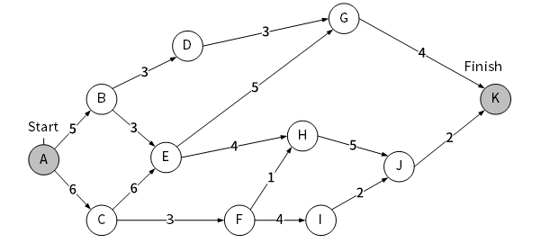
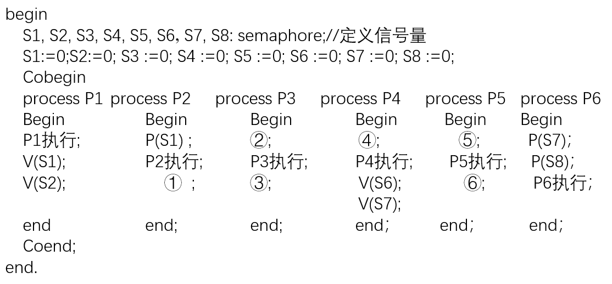

# 2023上半年选择题

- 来源标题: 2023年上半年软件设计师考试基础知识真题（专业解析+参考答案）
- 试卷介绍页: https://wangxiao.xisaiwang.com/tiku2/136/tp30397887.html?cid=136
- 练习页: https://wangxiao.xisaiwang.com/tiku2/exam534903294.html
- 题量: 57

## 第1题（单选题）

计算机中，系统总线用于（  ）连接。

- A. 接口和外设
- B. 运算器、控制器和寄存器
- C. 主存和外设部件
- D. DMA控制器和中断控制器

## 第2题（单选题）

在由高速缓存、主存和硬盘构成的三级存储体系中，CPU执行指令时需要读取数据，那么DMA控制器和中断CPU发出的数据地址是（  ）。

- A. 高速缓存地址
- B. 主存物理地址
- C. 硬盘的扇区地址
- D. 虚拟地址

## 第3题（单选题）

设信息位是8位，用海明码来发现并纠正1位出错的情况，则校验位的位数至少为（   ）。

- A. 1
- B. 2
- C. 4
- D. 8

## 第4题（单选题）

中断向量提供的是（  ）。

- A. 中断源的设备地址
- B. 中断服务程序的入口地址
- C. 传递数据的起始地址
- D. 主程序的断点地址

## 第5题（单选题）

计算机系统中，定点数常采用补码表示，以下关于补码表示的叙述中，错误的是（  ）。

- A. 补码零的表示是唯一的
- B. 可以将减法运算转化为加法运算
- C. 符号位可以与数值位一起参加运算
- D. 与真值的对应关系简单且直观

## 第6题（单选题）

设指令流水线将一指令的执行分为取指、分析、执行三段，已知取指时间是2ns，分析时间需2ns，执行时间为1ns，则执行完1000条指令所需时间为（  ）。

- A. 1004ns
- B. 1998ns
- C. 2003ns
- D. 2008ns

## 第7题（单选题）

在OSI参考模型中，负责对应用层消息进行压缩、加密功能的层次为（  ）。

- A. 传输层
- B. 会话层
- C. 表示层
- D. 应用层

## 第8题（单选题）

PKI体系中，由SSL/TSL实现HTTPS应用。浏览器和服务器之间用于加密HTTP消息的方式是（  ）。如果服务器证书被撤销，那么所产生的后果是（  ）。

### 问题1
- A. 对方公钥+公钥加密
- B. 本方公钥+公钥加密
- C. 会话密钥+公钥加密
- D. 会话密钥+对称加密
### 问题2
- A. 服务器不能执行加解密
- B. 服务器不能执行签名
- C. 客户端无法再信任服务器
- D. 客户端无法发送加密信息给服务器

## 第9题（单选题）

以下关于入侵防御系统功能的描述中，不正确的是（  ）。

- A. 监测并分析用户和系统的网络活动
- B. 匹配特征库识别已知的网络攻击行为
- C. 联动入侵检测系统使其阻断网络攻击行为
- D. 检测僵尸网络，木马控制等僵尸主机行为

## 第10题（单选题）

Web应用防火墙无法有效保护（  ）。

- A. 登录口令暴力破解
- B. 恶意注册
- C. 抢票机器人
- D. 流氓软件

## 第11题（单选题）

著作权中，（  ）的保护期不受限制。

- A. 发表权
- B. 发行权
- C. 署名权
- D. 展览权

## 第12题（单选题）

国际上为保护计算机软件知识产权不受侵犯所采用的主要方式是实施（  ）。

- A. 合同法
- B. 物权法
- C. 版权法
- D. 刑法

## 第13题（单选题）

以下关于计算机软件著作权的叙述中，不正确的是（  ）。

- A. 软件著作权人可以许可他人行使其软件著作权，并有权获得报酬
- B. 软件著作权人可以全部或者部分转让其软件著作权，并有权获得报酬
- C. 软件著作权属于自然人的，该自然人死亡后，在软件著作权的保护期内、继承人能继承软件著作权的所有权利
- D. 为了学习和研究软件内含的设计思想和原理，通过安装、显示、传输或者存储软件等方式使用软件的，可以不经软件著作权人许可，不向其支付报酬

## 第14题（单选题）

以下关于数据流图中基本加工的叙述中，不正确的是（   ）。

- A. 对每一个基本加工，必须有一个加工规格说明
- B. 加工规格说明必须描述把输入数据流变换为输出数据流的加工规则
- C. 加工规格说明要给出实现加工的细节
- D. 决策树、决策表可以用来表示加工规格说明

## 第15题（单选题）

以下关于好的软件设计原则的叙述中，不正确的是 （  ） 。

- A. 模块化
- B. 提高模块独 立性
- C. 集中化
- D. 提高抽象层次

## 第16题（单选题）

下图是一个软件项目的活动图，其中顶点表示项目里程碑，连接顶点的边表示活动，则里程碑（  ）在关键路径上，关键路径长度为（  ）。

### 问题1
- A. B
- B. E
- C. G
- D. I
### 问题2
- A. 15
- B. 17
- C. 19
- D. 23

## 第17题（单选题）

由8位成员组成的开发团队中，一共有（  ）条沟通路径。

- A. 64
- B. 56
- C. 32
- D. 28

## 第18题（单选题）

对布尔表达式 “a or ((cb < c)and d)”求值时，（ ）时可进行短路计算。

- A. a为true
- B. b为true
- C. c为true
- D. d为true

## 第19题（单选题）

设有正规式s=(0 | 10)*，则其所描述正规集中字符串的特点是（  ）。

- A. 长度必须是偶数
- B. 长度必须是奇数
- C. 0不能连续出现
- D. 1不能连续出现

## 第20题（单选题）

设函数foo和hoo的定义如下图所示，在函数foo中调用函数hoo，hoo的第一个参数采用传引用方式(call by reference)，第二个参数采用传值方式(call by value)，那么函数foo中的Print((a，b)将输出（  ）。

- A. 8,5
- B. 39,5
- C. 8,40
- D. 39,40

## 第21题（单选题）

某文件管理系统采用位示图(bitmap)来记录磁盘的使用情况，若计算机系统的字长为64位，磁盘容量为512GB，物理块的大小为4MB，那么位示图的大小为（  ）个字。

- A. 1024
- B. 2048
- C. 4096
- D. 9600

## 第22题（单选题）

磁盘调度分为移臂调度和旋转调度两类，在移臂调度的算法中，（  ）算法可能会随时改变移动臂的运行方向。

- A. 单向扫描和先来先服务
- B. 电梯调度和先来先服务
- C. 电梯调度和最短寻道时间优先
- D. 先来先服务和最短寻道时间优先

## 第23题（单选题）

在支持多线程的操作系统中，假设进程P创建了t1、t2、t3线程，那么（  ）。

- A. 该进程的代码段不能被t1、t2、t3共享
- B. 该进程的全局变量只能被共享
- C. 该进程中t1、t2、t3的栈指针不能被共享
- D. 该进程中t1的栈指针可以被t2、t3共享

## 第24题（单选题）

进程P1、P2、P3、P4、P5和P6的前趋图如下所示：

若用PV操作控制进程P1、P2、P3、P4、P5和P6并发执行的过程，需要设置8个信号量S1、S2、S3、S4、S5、S6、S7和S8，且信号量S1-S8的初值都等于零。下面P1-P6的进程执行过程中，①和②处应分别填写（  ）；③和④处应分别填写（  ）：⑤和⑥处应分别填写（  ）。

### 问题1
- A. P（S1）P（S2）和V（S3）V（S4）
- B. P（S1）P（S2）和V（S1）V（S2）
- C. V（S3）V（S4）和P（S1）P（S2）
- D. V（S3）V（S4）和P（S2）P（S3）
### 问题2
- A. V（S5）和P（S4）P（S5）
- B. V（S3）和P（S4）V（S5）
- C. P（S5）和V（S4）V（S5）
- D. P（S3）和P（S4）P（S5）
### 问题3
- A. V（S6）和V（S8）
- B. P（S6）和P（S7）
- C. P（S6）和V（S8）
- D. P（S6）和P（S8）

## 第25题（单选题）

以下关于增量模型优点的叙述中，不正确的是（  ）。

- A. 能够在较短的时间提交一个可用的产品系统
- B. 可以尽早让用户熟悉系统
- C. 优先级高的功能首先交付，这些功能将接受更多的测试
- D. 系统的设计更加容易

## 第26题（单选题）

以下敏捷开发方法中，（  ）使用迭代的方法，把一段短的时间（如30天）的迭代称为一个冲刺，并按照需求优先级来实现产品。

- A. 极限编程(XP)
- B. 水晶法(Crystal)
- C. 并列争球法(Scrum)
- D. 自适应软件开发(ASD)

## 第27题（单选题）

若模块A通过控制参数来传递信息给模块B，从而确定执行模块B中的哪部分语句，则这两个模块的耦合类型是（  ）耦合。

- A. 数据
- B. 标记
- C. 控制
- D. 公共

## 第28题（单选题）

在设计中实现可移植性设计的规则不包括（  ）。

- A. 将设备相关程序和设备无关程序分开设计
- B. 可使用特定环境的专用功能
- C. 采用平台无关的程序设计语言
- D. 不使用依赖于某一平台的类库

## 第29题（单选题）

以下关于管道-过滤器软件体系结构风格优点的叙述中，不正确的是（  ）。

- A. 构件具有良好的高内聚、低耦合的特点
- B. 支持软件复用
- C. 支持并行执行
- D. 适合交互处理应用

## 第30题（单选题）

以下流程图中，至少需要（  ）个测试用例才能覆盖所有路径。采用McCabe方法计算程序复杂度为（  ）。

### 问题1
- A. 3
- B. 4
- C. 5
- D. 6
### 问题2
- A. 2
- B. 3
- C. 4
- D. 5

## 第31题（单选题）

在软件系统交付给用户使用后，为了使用户界面更友好，对系统的图形输出进行改进，该行为属于（  ）维护。

- A. 改正性
- B. 适应性
- C. 改善性
- D. 预防性

## 第32题（单选题）

采用面向对象方法开发学生成绩管理系统，学生的姓名、性别、出生日期、期末考试成绩、查看成绩操作均被（  ）在学生对象中。系统中定义不同类，不同类的对象之间通过（  ）进行通信。

### 问题1
- A. 封装
- B. 继承
- C. 多态
- D. 信息
### 问题2
- A. 继承
- B. 多态
- C. 消息
- D. 重载

## 第33题（单选题）

对采用面向对象方法开发的系统进行测试时，通常从不同层次进行测试。测试类中定义的每个方法属于（  ）层。

- A. 算法
- B. 类
- C. 模板
- D. 系统

## 第34题（单选题）

在面向对象系统设计中，如果重用了一个包中的某个类，那么就要重用该包中所有类，这属于（  ）原则。

- A. 共同封闭
- B. 共同重用
- C. 开放封闭
- D. 接口分离

## 第35题（单选题）

如下所示的UML图中，展现了（  ）；下图中（  ）是可能的消息序列。

### 问题1
- A. 系统在它的周边环境的语境中所提供的外部可见服务
- B. 某一时刻一组对象以及它们之间的关系
- C. 系统内从一个活动到另一个活动的流程
- D. 以时间顺序组织的对象之间的交互活动
### 问题2
- A. a→b→c→a→b
- B. c
- C. a→b→a→b→c
- D. a→b→c→a→b→c

## 第36题（单选题）

UML包图展现由模型本身分解而成的组织单元及其依赖关系，以下关于包图的叙述中，不正确的是（  ）。

- A. 可以拥有类、接口构件、节点
- B. 一个元素可以被多个包拥有
- C. 一个包可以嵌套其他包
- D. 一个包内元素不能重名

## 第37题（单选题）

在某招聘系统中，要求实现求职简历自动生成功能。简历的基本内容包括求职者的姓名、性别、年龄及工作经历等。希望每份简历中的工作经历有所不同，并尽量减少程序中的重复代码。针对此需求，设计如下所示类图。该设计采用了（  ）模式，由xx实例指定创建对象的种类，声明一个复制自身的接口，并且通过复制这些Resume xx WorkExperience的对象来创建新的对象。该模式属于（  ）模式。

### 问题1
- A. 单例(Singleton)
- B. 抽象工厂(Abstract Factory)
- C. 生成器(Builder)
- D. 原型(Prototype)
### 问题2
- A. 混合型
- B. 行为型
- C. 结构型
- D. 创建型

## 第38题（单选题）

某旅游公司欲开发一套软件系统，要求能根据季节、节假日等推出不同的旅行定价包，如淡季打折、一口价等。实现该要求适合采用（  ）模式，该模式的主要意图是（  ）。

### 问题1
- A. 策略(Strategy)
- B. 状态(State)
- C. 观察者(Observer)
- D. 命令(Command)
### 问题2
- A. 将一个请求封装为对象，从而可以用不同的请求对客户进行参数化
- B. 当一个对象的状态发生改变时，依赖于它的对象都得到通知并被自动更新
- C. 允许一个对象在其内部状态改变时改变它的行为
- D. 定义一系列的算法，把它们一个个封装起来，并且使它们可以相互替换

## 第39题（单选题）

Python中采用（  ）方法来获得一个对象的类型。

- A. str ()
- B. type ()
- C. id ()
- D. object ()

## 第40题（单选题）

在Python语言中，语句x=（  ）不能定义一个元组。

- A. (1,2,1,2)
- B. 1,2,1,2
- C. tuple ()
- D. (1)

## 第41题（单选题）

关于Python语言的叙述中，不正确的是（  ）。

- A. for语句可以用于在序列（如列表、元组和字符串）上进行迭代访问
- B. 循环结构如for和while后可以加else语句
- C. 可以用if...else和switch..case语句表示选择结构
- D. 支持嵌套循环

## 第42题（单选题）

在数据库应用系统的开发过程中，开发人员需要通过视图层、逻辑层和物理层三个层次上的抽象来对用户屏蔽系统的复杂性，简化用户与系统的交互过程。错误的是（  ）。

- A. 视图层是最高层次的抽象
- B. 逻辑层是比视图层更低一层的抽象
- C. 物理层是最低层次的抽象
- D. 物理层是比逻辑层更高一层的抽象

## 第43题（单选题）

给定关系模式R < U,F > ，其中U为属性集，F是U上的一组函数依赖，那么Armstrong公理系统的自反律是指（  ）。

- A. 若Y⊆ X⊆ U，则X→ Y为F所蕴涵
- B. X→ Y，Y→ Z、则X→ Y为F所蕴涵
- C. 若X→ Y，Z⊆ Y，则X→ Z为F所蕴涵
- D. 若X→ Y，X→ Z，则X→ YZ为F所蕴涵

## 第44题（单选题）

给定关系模式R(U，F)，U=｛A，B，C，D}，函数依赖集F=｛AB→C，CD→B}。关系模式R（  ），主属性和非主属性个数分别为（  ）。

### 问题1
- A. 只有1个候选关键字ACB
- B. 只有1个候选关键字BCD
- C. 有2个候选关键字ABD和ACD
- D. 有2个候选关键字ACB和BCD
### 问题2
- A. 4和0
- B. 3和1
- C. 2和2
- D. 1和3

## 第45题（单选题）

如果将Students表的插入权限赋予用户User1，并允许其将该权限授予他人，那么正确的SQL语句如下：
GRANT（  ）TABLE Students TO User1（  ）

### 问题1
- A. INSERT
- B. INSERT ON
- C. UPDATE
- D. UPDATE ON
### 问题2
- A. FOR ALL
- B. PUBLIC
- C. WITH GRANT OPTION
- D. WITH CHECK OPTION

## 第46题（单选题）

利用栈对算术表达式10*（40-30/5）+20求值时，存放操作数的栈（初始为空）的容量至少为（  ），才能满足暂存该表达式中的运算数或运算结果的要求。

- A. 2
- B. 3
- C. 4
- D. 5

## 第47题（单选题）

设有5个字符，根据其使用频率为其构造哈夫曼编码。以下编码方案中，（   ）是不可能的。

- A. {111,110,101,100,0}
- B. {0000,0001,001,01,1}
- C. {11,10,01,001,000}
- D. {11,10,011,010,000}

## 第48题（单选题）

设有向图G具有n个顶点、e条弧，采用邻接表存储，则完成广度优先遍历的时间复杂度为（  ）。

- A. O(n+e)
- B. O(n2)
- C. O(e2)
- D. O(n*e)

## 第49题（单选题）

对某有序表进行折半查找（二分查找）时，进行比较的关键字序列不可能是（  ）。

- A. 42，61，90，85，77
- B. 42，90，85，61，77
- C. 90，85，61，77，42
- D. 90，85，77，61，42

## 第50题（单选题）

设由三棵树构成的森林中，第一棵树、第二棵树和第三棵树的结点总数分别为n1、n2和n3。将该森林转换为一棵二叉树，那么该二叉树的右子树包含（  ）个结点。

- A. n1
- B. n1+n2
- C. n3
- D. n2+n3

## 第51题（单选题）

对一组数据进行排序要求排序算法的时间复杂度为O(nlgn)，且要求排序是稳定的，则可采用（  ）算法。若要求排序算法的时间复杂度为O(nlgn)，且在原数据上进行，即空间复杂度为O(1)，则可采用（  ）算法。

### 问题1
- A. 直接插入排序
- B. 堆排序
- C. 快速排序
- D. 归并排序
### 问题2
- A. 直接插入排序
- B. 堆排序
- C. 快速排序
- D. 归并排序

## 第52题（单选题）

采用Kruskal算法求解下图的最小生成树，采用的算法设计策略是（  ）。该小生成树的权值是（  ）。

### 问题1
- A. 分治法
- B. 动态规划
- C. 贪心法
- D. 追溯法
### 问题2
- A. 14
- B. 16
- C. 20
- D. 32

## 第53题（单选题）

www的控制协议是（  ）。

- A. FTP
- B. HTTP
- C. SSL
- D. DNS

## 第54题（单选题）

在Linux操作系统中通常使用（  ）作为Web服务器，其默认的Web站点的目录为（  ）。

### 问题1
- A. IIS
- B. Apache
- C. NFS
- D. MYSQL
### 问题2
- A. /etc/httpd
- B. /var/log/httpd
- C. /etc/home
- D. /home/httpd

## 第55题（单选题）

SNMP的传输层协议是（  ）。

- A. UDP
- B. TCP
- C. IP
- D. ICMP

## 第56题（单选题）

某电脑无法打开任意网页，但是互联网即时聊天软件使用正常，造成该故障的原因可能是（  ）。

- A. IP地址配置错误
- B. DNS配置错误
- C. 网卡故障
- D. 链路故障

## 第57题（单选题）

Low-code and no code software development solutions have emerged as viable and convenient alternatives to the traditional development process.
Low-code is a rapid application development (RAD)approach that enables automated code generation through（【#题号#】）building blocks like drag-and-drop and pull-down menu interfaces. This（【#题号#】）allows low-code users to focus on the differentiator rather than the common denominator of programming.
Low-code is a balanced middle ground between manual coding and no-code as its users can still add code over auto-generated code. While in low-code there is some handholding done by developers in the form of scripting or manual coding, no-code has a completely（【#题号#】）approach, with 100%dependence on visual tools.
A low-code application platform (LCAP)-also called a low-code development platform(LCDP)-contains an integrated development environment(IDE) with （【#题号#】）features like APIs, code templates, reusable plug-in modules and graphical connectors to automate a significant percentage of the application development process. LCAPs are typically available as cloud-based Platform-as-a-Service (PaaS)solutions.
A low-code platform works on the principle of lowering complexity by using visual tools, and techniques like process modeling, where users employ visual tools to define workflow, business rules, user interfaces and the like. Behind the scenes, the complete workflow is automatically converted into code. LCAPs are used predominantly by professional developers to automate the generic aspects of coding to redirect effort on the last mile of（【#题号#】）.
 问题1
 问题2
 问题3
 问题4
 问题5

### 补充题面

["{\"A\":\"visual\",\"B\":\"component-based\",\"C\":\"object-oriented\",\"D\":\"structural\"}","{\"A\":\"block\",\"B\":\"automation\",\"C\":\"function\",\"D\":\"method\"}","{\"A\":\"modern\",\"B\":\"hands-off\",\"C\":\"generic\",\"D\":\"labor-free\"}","{\"A\":\"reusable\",\"B\":\"built-in\",\"C\":\"existed\",\"D\":\"well-known\"}","{\"A\":\"delivery\",\"B\":\"automation\",\"C\":\"development\",\"D\":\"success\"}"]
