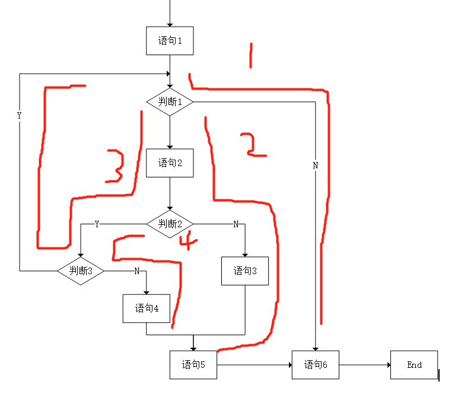
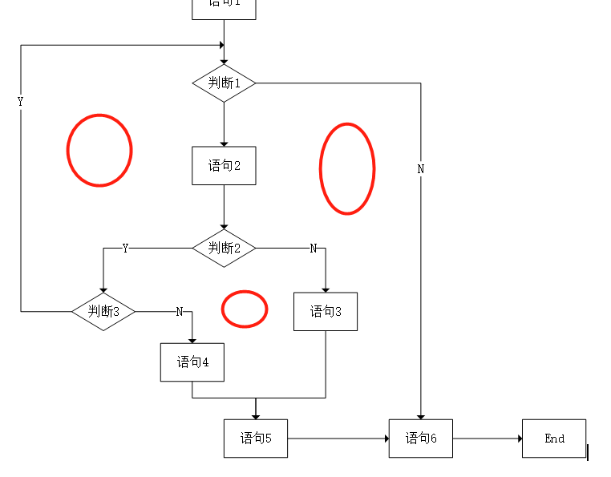
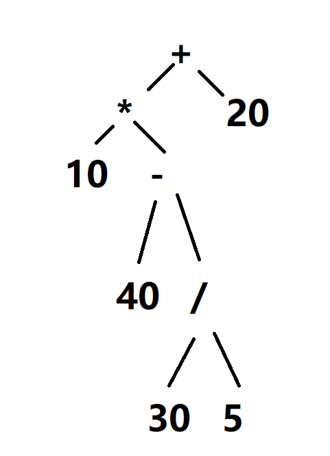
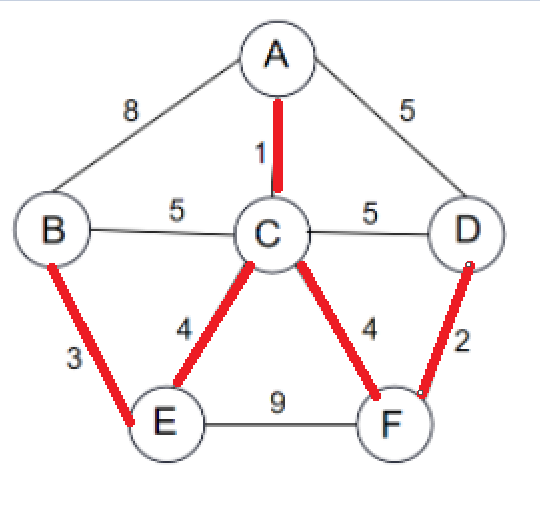

# 2023上半年选择题

- 来源标题: 2023年上半年软件设计师考试基础知识真题（专业解析+参考答案）
- 试卷介绍页: https://wangxiao.xisaiwang.com/tiku2/136/tp30397887.html?cid=136
- 练习页: https://wangxiao.xisaiwang.com/tiku2/exam534904206.html
- 题量: 57

## 第1题（单选题）

计算机中，系统总线用于（C）连接。

- A. 接口和外设
- B. 运算器、控制器和寄存器
- C. 主存和外设部件
- D. DMA控制器和中断控制器

### 正确答案

C

### 解析

本题考查计算机硬件相关知识。
系统总线通常用来连接计算机中的各个部件（如CPU、内存和I/O设备）。
寄存器和运算器部件主要用片内总线连接，B选项错误。接口和外设、DMA控制器和中断控制器由外部总线进行连接。
ABD描述错误，本题选择C选项。

## 第2题（单选题）

在由高速缓存、主存和硬盘构成的三级存储体系中，CPU执行指令时需要读取数据，那么DMA控制器和中断CPU发出的数据地址是（B）。

- A. 高速缓存地址
- B. 主存物理地址
- C. 硬盘的扇区地址
- D. 虚拟地址

### 正确答案

B

### 解析

本题考查的是数据传输相关概念。
程序中用到的是虚拟地址，硬件中访问的通常是物理地址。
高速缓存地址：高速缓存（Cache）是CPU和主存之间的一个高速数据存储器，它用于存储CPU最近访问过的数据。当CPU需要读取数据时，它会首先检查高速缓存中是否有所需数据。然而，DMA控制器和中断CPU通常不会直接与高速缓存交互，而是与主存交互。
主存物理地址：主存（或称为RAM）是计算机中的主要存储设备，用于存储程序和数据。当高速缓存中不存在所需数据时，CPU会从主存中读取数据。DMA控制器负责在I/O设备和主存之间传输数据，而不需要CPU的干预。因此，DMA控制器和中断CPU在涉及数据传输时，会引用主存的物理地址。
硬盘的扇区地址：硬盘是计算机中的长期存储设备，用于存储大量数据。然而，在CPU执行指令需要读取数据时，它通常首先会检查高速缓存和主存，而不是直接从硬盘中读取。此外，DMA控制器通常不会直接与硬盘的扇区地址交互，而是通过文件系统等中间层来访问硬盘上的数据。
虚拟地址：虚拟地址是操作系统为应用程序提供的一种内存抽象，使得应用程序可以访问比实际物理内存更大的内存空间。然而，在DMA和中断操作中，通常涉及的是物理内存地址，而不是虚拟地址。
ACD描述错误，本题选择B选项。

## 第3题（单选题）

设信息位是8位，用海明码来发现并纠正1位出错的情况，则校验位的位数至少为（C）。

- A. 1
- B. 2
- C. 4
- D. 8

### 正确答案

C

### 解析

本题考查的是海明校验位计算。
根据海明校验位计算公式2^r-1 > =m+r，本题中信息为位数是8，代入不等式进行计算，r > =4，因此校验位的位数至少为4位，本题选择C选项。

## 第4题（单选题）

中断向量提供的是（B）。

- A. 中断源的设备地址
- B. 中断服务程序的入口地址
- C. 传递数据的起始地址
- D. 主程序的断点地址

### 正确答案

B

### 解析

本题是对中断的概念考查。
中断是这样一个过程: 在CPU执行程序的过程中，由于某一个外部的或CPU内部事件的发生，使CPU暂时中止正在执行的程序，转去处理这一事件（即执行中断服务程序），当事件处理完毕后又回到原先被中止的程序，接着中止前的状态继续向下执行。这一过程就称为中断。
其中对于中断源的识别标志，是可用来形成相应的中断服务程序的入口地址或存放中断服务程序的首地址，也称为中断向量。其他选项为干扰项。本题选择B选项。

## 第5题（单选题）

计算机系统中，定点数常采用补码表示，以下关于补码表示的叙述中，错误的是（D）。

- A. 补码零的表示是唯一的
- B. 可以将减法运算转化为加法运算
- C. 符号位可以与数值位一起参加运算
- D. 与真值的对应关系简单且直观

### 正确答案

D

### 解析

本题考查码制相关特点。
补码中，零的表示是唯一的，补码为了方便运算，将减法运算转化为加法运算，其符号位可以与数值位一起参加运算。
负数的补码需要通过转换才能找到其真值，对应关系并不直观。
ABC描述描述正确，D选项描述错误，本题选择D选项。

## 第6题（单选题）

设指令流水线将一指令的执行分为取指、分析、执行三段，已知取指时间是2ns，分析时间需2ns，执行时间为1ns，则执行完1000条指令所需时间为（C）。

- A. 1004ns
- B. 1998ns
- C. 2003ns
- D. 2008ns

### 正确答案

C

### 解析

本题考查流水线相关计算问题。
根据流水线执行时间计算公式：流水线执行时间=1条指令执行时间+（指令条数-1）*流水线周期。
本题1条流水线执行时间为（2+2+1），指令条数为1000，流水线周期为其中最长的一段2ns，将相关参数代入公式可得：
流水线执行时间=（2+2+1）+(1000-1)*2=2003，本题选择C选项。

## 第7题（单选题）

在OSI参考模型中，负责对应用层消息进行压缩、加密功能的层次为（C）。

- A. 传输层
- B. 会话层
- C. 表示层
- D. 应用层

### 正确答案

C

### 解析

应用层：实现具体的应用功能。
表示层：数据的格式与表达、加密、压缩。
会话层：建立、管理和终止会话。
传输层：端到端的连接。
网络层：分组传输和路由选择。
数据链路层：传送以帧为单位的信息。
物理层：二进制传输。
所以，选择C选项。

## 第8题（单选题）

PKI体系中，由SSL/TSL实现HTTPS应用。浏览器和服务器之间用于加密HTTP消息的方式是（D/C）。如果服务器证书被撤销，那么所产生的后果是（  ）。

### 问题1
- A. 对方公钥+公钥加密
- B. 本方公钥+公钥加密
- C. 会话密钥+公钥加密
- D. 会话密钥+对称加密
### 问题2
- A. 服务器不能执行加解密
- B. 服务器不能执行签名
- C. 客户端无法再信任服务器
- D. 客户端无法发送加密信息给服务器

### 正确答案

D、C

### 解析

客户端和浏览器通过双方协商一致的安全等级，建立会话密钥，后续的数据通信使用对称密钥进行加密
。所以第一空选D选项。
证书是用来做身份验证，没了证书，客户端无法确认服务端的真实性、合法性。所以第二空选C选项。

## 第9题（单选题）

以下关于入侵防御系统功能的描述中，不正确的是（C）。

- A. 监测并分析用户和系统的网络活动
- B. 匹配特征库识别已知的网络攻击行为
- C. 联动入侵检测系统使其阻断网络攻击行为
- D. 检测僵尸网络，木马控制等僵尸主机行为

### 正确答案

C

### 解析

本题考察网络安全相关技术
入侵捡测系统一般只做检测，不做防御，所以C选项错误。

## 第10题（单选题）

Web应用防火墙无法有效保护（D）。

- A. 登录口令暴力破解
- B. 恶意注册
- C. 抢票机器人
- D. 流氓软件

### 正确答案

D

### 解析

本题考查防火墙技术的相关概念。
Web应用防火墙认为内部是安全的，只会对外部请求进行处理。
流氓软件属于系统内部，不是防火墙处理范围。所以选择D选项。

## 第11题（单选题）

著作权中，（C）的保护期不受限制。

- A. 发表权
- B. 发行权
- C. 署名权
- D. 展览权

### 正确答案

C

### 解析

本题考察知识产权的相关概念
署名权、修改权、保护作品完整权无时间限制，其它著作权有时间限制。所以选择C选项。

## 第12题（单选题）

国际上为保护计算机软件知识产权不受侵犯所采用的主要方式是实施（C）。

- A. 合同法
- B. 物权法
- C. 版权法
- D. 刑法

### 正确答案

C

### 解析

本题考察的是知识产权的相关概念
著作权也称为版权。版权法是一个统称，包含各种与著作权有关的法律法规。

## 第13题（单选题）

以下关于计算机软件著作权的叙述中，不正确的是（C）。

- A. 软件著作权人可以许可他人行使其软件著作权，并有权获得报酬
- B. 软件著作权人可以全部或者部分转让其软件著作权，并有权获得报酬
- C. 软件著作权属于自然人的，该自然人死亡后，在软件著作权的保护期内、继承人能继承软件著作权的所有权利
- D. 为了学习和研究软件内含的设计思想和原理，通过安装、显示、传输或者存储软件等方式使用软件的，可以不经软件著作权人许可，不向其支付报酬

### 正确答案

C

### 解析

本题考察的是知识产权的相关概念
在有效期内，继承人只能继承特定权利，不是所有权利。比如署名权就不能继承。

## 第14题（单选题）

以下关于数据流图中基本加工的叙述中，不正确的是（C）。

- A. 对每一个基本加工，必须有一个加工规格说明
- B. 加工规格说明必须描述把输入数据流变换为输出数据流的加工规则
- C. 加工规格说明要给出实现加工的细节
- D. 决策树、决策表可以用来表示加工规格说明

### 正确答案

C

### 解析

本题考察的是数据流图的概念
加工细节的实现指代码编写。现阶段是需求分析阶段，还未到达代码编写写点。

## 第15题（单选题）

以下关于好的软件设计原则的叙述中，不正确的是 （C） 。

- A. 模块化
- B. 提高模块独 立性
- C. 集中化
- D. 提高抽象层次

### 正确答案

C

### 解析

本题考察的是对模块设计原则的掌握程度
软件开发提倡进行合理的模块划分，可提高开发、维护效率。集中化违背了该原则。

## 第16题（单选题）

下图是一个软件项目的活动图，其中顶点表示项目里程碑，连接顶点的边表示活动，则里程碑（B/D）在关键路径上，关键路径长度为（  ）。

### 问题1
- A. B
- B. E
- C. G
- D. I
### 问题2
- A. 15
- B. 17
- C. 19
- D. 23

### 正确答案

B、D

### 解析

该题可以从第二问先入手，在ABCD四个选项中找到最大的23，然后对比发现A-C-E-H-J-K满足该数值。所以该条路线就是关键路径，关键路径长度就是23。第一空选择B，第二空选择D。

## 第17题（单选题）

由8位成员组成的开发团队中，一共有（D）条沟通路径。

- A. 64
- B. 56
- C. 32
- D. 28

### 正确答案

D

### 解析

如果采用有主程序员的沟通方式，只要7条路径。但是选项中没有7，所以应该算的是无主程序员的沟通方式。计算7+6+5+4+3+2+1，结果是28。所以选择D选项。

## 第18题（单选题）

对布尔表达式 “a or ((cb < c)and d)”求值时，（A）时可进行短路计算。

- A. a为true
- B. b为true
- C. c为true
- D. d为true

### 正确答案

A

### 解析

题干中当逻辑表达式是“A or B”的时候，只要A为true，不管B是什么，结果都为true。所以就不会计算B，这就是短路。所以选择A选项。

## 第19题（单选题）

设有正规式s=(0 | 10)*，则其所描述正规集中字符串的特点是（D）。

- A. 长度必须是偶数
- B. 长度必须是奇数
- C. 0不能连续出现
- D. 1不能连续出现

### 正确答案

D

### 解析

本题考查对正规式的理解
此题可以用排除法。
0是符合条件的字符串，所以A是错的。
10是符合条件的字符串，所以B是错的。
00是符合条件的字符串，所以C是错的。

## 第20题（单选题）

设函数foo和hoo的定义如下图所示，在函数foo中调用函数hoo，hoo的第一个参数采用传引用方式(call by reference)，第二个参数采用传值方式(call by value)，那么函数foo中的Print((a，b)将输出（B）。

- A. 8,5
- B. 39,5
- C. 8,40
- D. 39,40

### 正确答案

B

### 解析

本题考察的是传值与传址
由于hoo()中x传递的是地址即&x，所以当x值改变时，foo()中x值也会随之改变。选B

## 第21题（单选题）

某文件管理系统采用位示图(bitmap)来记录磁盘的使用情况，若计算机系统的字长为64位，磁盘容量为512GB，物理块的大小为4MB，那么位示图的大小为（B）个字。

- A. 1024
- B. 2048
- C. 4096
- D. 9600

### 正确答案

B

### 解析

512G=512*1024M。所以总容量除以物理块大小除以字长即 512*1024 / 4 / 64=2048，选择B选项。

## 第22题（单选题）

磁盘调度分为移臂调度和旋转调度两类，在移臂调度的算法中，（D）算法可能会随时改变移动臂的运行方向。

- A. 单向扫描和先来先服务
- B. 电梯调度和先来先服务
- C. 电梯调度和最短寻道时间优先
- D. 先来先服务和最短寻道时间优先

### 正确答案

D

### 解析

本题考查磁盘调度算法知识。
电梯调度和单向扫描都有固定的路线，不会更改。所以A、B、C都排除。
先来先服务和最短寻道都会根据当前情况重新计算选择磁道，所以会进行移臂方向调转。
因此，ABC描述与题意不符，本题选择D选项。

## 第23题（单选题）

在支持多线程的操作系统中，假设进程P创建了t1、t2、t3线程，那么（C）。

- A. 该进程的代码段不能被t1、t2、t3共享
- B. 该进程的全局变量只能被共享
- C. 该进程中t1、t2、t3的栈指针不能被共享
- D. 该进程中t1的栈指针可以被t2、t3共享

### 正确答案

C

### 解析

1个进程可以产生多条线程。
进程的资源线程可以共享，线程的资源只能自己使用，其它线程不能使用。
所以选择C选项。

## 第24题（单选题）

进程P1、P2、P3、P4、P5和P6的前趋图如下所示：

若用PV操作控制进程P1、P2、P3、P4、P5和P6并发执行的过程，需要设置8个信号量S1、S2、S3、S4、S5、S6、S7和S8，且信号量S1-S8的初值都等于零。下面P1-P6的进程执行过程中，①和②处应分别填写（D/A/C）；③和④处应分别填写（  ）：⑤和⑥处应分别填写（  ）。

### 问题1
- A. P（S1）P（S2）和V（S3）V（S4）
- B. P（S1）P（S2）和V（S1）V（S2）
- C. V（S3）V（S4）和P（S1）P（S2）
- D. V（S3）V（S4）和P（S2）P（S3）
### 问题2
- A. V（S5）和P（S4）P（S5）
- B. V（S3）和P（S4）V（S5）
- C. P（S5）和V（S4）V（S5）
- D. P（S3）和P（S4）P（S5）
### 问题3
- A. V（S6）和V（S8）
- B. P（S6）和P（S7）
- C. P（S6）和V（S8）
- D. P（S6）和P（S8）

### 正确答案

D、A、C

### 解析

本题考查前驱图与PV操作知识。
根据前驱图可知，P1后面有两个V操作。
P2前面有一个P操作，后面有两个V操作,且V(S1)和V(S2)已出现过，应该是V(S3)和V（S4）。
P3前面有两个P操作，且P(S1)已出现过，应该是P(S2)和V（S3）。后面有1个V操作。
P4前面有两个P操作，后面有两个V操作。
P5前面有1个P操作，后面有1个V操作。
P6前面有两个P操作，后面没有V操作。
综上所述，本题选择D、A、C。

## 第25题（单选题）

以下关于增量模型优点的叙述中，不正确的是（D）。

- A. 能够在较短的时间提交一个可用的产品系统
- B. 可以尽早让用户熟悉系统
- C. 优先级高的功能首先交付，这些功能将接受更多的测试
- D. 系统的设计更加容易

### 正确答案

D

### 解析

本题考察开发模型的相关概念
增量模型首先选择核心模块进行开发，如果核心模块没选好会导致后续开发难度增加，并不会让设计更加简单、容易。

## 第26题（单选题）

以下敏捷开发方法中，（C）使用迭代的方法，把一段短的时间（如30天）的迭代称为一个冲刺，并按照需求优先级来实现产品。

- A. 极限编程(XP)
- B. 水晶法(Crystal)
- C. 并列争球法(Scrum)
- D. 自适应软件开发(ASD)

### 正确答案

C

### 解析

并列争球法是安排多个小组并行开发，提高开发效率。
极限编程(XP)是一种软件开发方法,旨在提高软件质量和对不断变化的客户需求的响应能力
水晶法认为每一个不同的项目都需要一套不同的策略、约定和方法论,认为人对软件质量有重要的影响,因此随着项目质量和开发人员素质的提高,项目和过程的质量也随之提高。通过更好的交流和经常性的交互,软件的生产力得到提高
适应性软件开发是软件系统创建的一种设计原则,它关注于软件系统的快速创建和演化,软件从来没有一个完成的时期,只有两个新版本之间的稳定时期,适应性开发方法就是在快速应用的基础上发展起来的开发方法
同时设置一个冲刺时间段，确保任务准时完成。

## 第27题（单选题）

若模块A通过控制参数来传递信息给模块B，从而确定执行模块B中的哪部分语句，则这两个模块的耦合类型是（C）耦合。

- A. 数据
- B. 标记
- C. 控制
- D. 公共

### 正确答案

C

### 解析

本题考查的是耦合类型。  
数据耦合 一个模块访问另一个模块时，彼此之间是通过简单数据参数（不是控制参数、公共数据结构或外部变量）来交换输入、输出信息的  。
标记耦合 一组模块通过参数表传递记录信息。这个记录是某一数据结构的子结构，而不是简单变量 。 
控制耦合 如果一个模块通过传送开关、标志、名字等控制信息，明显地控制选择另一模块的功能，就是控制耦合 。
公共耦合 若一组模块都访问同一个公共数据环境，则它们之间的耦合就称为公共耦合。公共的数据环境可以是全局数据结构共享的通信区、内存的公共覆盖区等。
模块之间调用，如果传递的数据包含了控制信息，两者之间就是控制耦合。所以选择C选项。

## 第28题（单选题）

在设计中实现可移植性设计的规则不包括（B）。

- A. 将设备相关程序和设备无关程序分开设计
- B. 可使用特定环境的专用功能
- C. 采用平台无关的程序设计语言
- D. 不使用依赖于某一平台的类库

### 正确答案

B

### 解析

本题考查操作系统基础知识。
 将设备相关程序和设备无关程序分开设计：这是实现可移植性的一个重要方法。通过将设备相关的代码与设备无关的代码分开，可以更容易地在不同的硬件平台上实现代码的复用和修改。因此，这个选项是符合可移植性设计规则的。
可使用特定环境的专用功能：这个选项与可移植性的目标相悖。特定环境的专用功能通常与特定的操作系统、硬件或其他环境因素紧密相关，使用这些功能会使代码难以在不同的平台上运行。因此，这个选项是不符合可移植性设计规则的。
采用平台无关的程序设计语言：使用平台无关的编程语言，如Java、C#等，可以确保编写的代码在不同的平台上都有较好的兼容性。这是因为这些语言通常都提供了跨平台的运行时环境，能够屏蔽底层平台的差异。因此，这个选项是符合可移植性设计规则的。
不使用依赖于某一平台的类库：这也是实现可移植性的一个重要原则。依赖于特定平台的类库会限制代码在不同平台上的运行能力。因此，在设计和编写代码时，应尽量避免使用这样的类库。这个选项是符合可移植性设计规则的。
因此，ACD描述与题意不符，本题选择B选项。

## 第29题（单选题）

以下关于管道-过滤器软件体系结构风格优点的叙述中，不正确的是（D）。

- A. 构件具有良好的高内聚、低耦合的特点
- B. 支持软件复用
- C. 支持并行执行
- D. 适合交互处理应用

### 正确答案

D

### 解析

每个过滤器独立完成自己的任务，不同过滤的之间不需要进行交互。所以选择D选项。

## 第30题（单选题）

以下流程图中，至少需要（B/C）个测试用例才能覆盖所有路径。采用McCabe方法计算程序复杂度为（  ）。

### 问题1
- A. 3
- B. 4
- C. 5
- D. 6
### 问题2
- A. 2
- B. 3
- C. 4
- D. 5

### 正确答案

B、C

### 解析

通过分析程序图，有4条路径是不可能一个用例同时实现，所以需要至少4个测试用例。

通过计算出最小环的数量为3，可以知道复杂度是3+1=4。

## 第31题（单选题）

在软件系统交付给用户使用后，为了使用户界面更友好，对系统的图形输出进行改进，该行为属于（B）维护。

- A. 改正性
- B. 适应性
- C. 改善性
- D. 预防性

### 正确答案

B

### 解析

本题考查的软件维护类型。
由于教材本身的更新换代，早年考查本题描述的“输入输出环境改变”是属于适应性维护，本题选择B选项。
完善性维护主要针对的是“增加功能、改善性能”，本题只强调“使用户界面更友好”没有说明性能的改善，所以不能选择完善性维护。

## 第32题（单选题）

采用面向对象方法开发学生成绩管理系统，学生的姓名、性别、出生日期、期末考试成绩、查看成绩操作均被（A/C）在学生对象中。系统中定义不同类，不同类的对象之间通过（  ）进行通信。

### 问题1
- A. 封装
- B. 继承
- C. 多态
- D. 信息
### 问题2
- A. 继承
- B. 多态
- C. 消息
- D. 重载

### 正确答案

A、C

### 解析

本题考查面向对象的基本概念
把属性、方法放在对象中，称为封装。所以选择A选项。
对象之间的通信往往是调用方法。在调用方法时，会传递数据，所以放到调用也叫作消息通信，选择C选项。

## 第33题（单选题）

对采用面向对象方法开发的系统进行测试时，通常从不同层次进行测试。测试类中定义的每个方法属于（A）层。

- A. 算法
- B. 类
- C. 模板
- D. 系统

### 正确答案

A

### 解析

本题考查面向对象开发的阶段任务。
一般来说，对面向对象软件的测试可分为下列4个层次进行。
（1）算法层。测试类中定义的每个方法，基本上相当于传统软件测试中的单元测试。所以测试类中的方法属于算法层。选择A选项。
（2）类层。测试封装在同一个类中的所有方法与属性之间的相互作用。在面向对象软件中类是基本模块，因此可以认为这是面向对象测试中所特有的模块测试。
（3）模板层。测试一组协同工作的类之间的相互作用，大体上相当于传统软件测试中的集成测试，但是也有面向对象软件的特点（例如，对象之间通过发送消息相互作用）。
（4）系统层。把各个子系统组装成完整的面向对象软件系统，在组装过程中同时进行测试。
本题选择A选项。

## 第34题（单选题）

在面向对象系统设计中，如果重用了一个包中的某个类，那么就要重用该包中所有类，这属于（B）原则。

- A. 共同封闭
- B. 共同重用
- C. 开放封闭
- D. 接口分离

### 正确答案

B

### 解析

共同封闭原则(Common Closure Principle, CCP):包中的所有的类对于同一种性质的变化应该是共同封闭的。一个变化若对一个封闭的包产生影响,则将对该包中的所有类产生影响,而对其他包则不造成任何影响。
共同重用原则，面向对象编程术语，指一个包中的所有类应该是共同重用的。如果重用了包中的一个类，那么也就相当于重用了包中的所有类。
开放封闭：软件实体应该是可扩展，而不可修改的。也就是说，对扩展是开放的，而对修改是封闭的
接口分离原则指在设计时采用多个与特定客户类有关的接口比采用一个通用的接口要好。
在开发过程中，会引用第三方类。第三方类又会引用其它类。
把所有要引用到的类封装在一个包中，就能提高开发效率，称为共同重用原则。选择B选项。

## 第35题（单选题）

如下所示的UML图中，展现了（D/C）；下图中（  ）是可能的消息序列。

### 问题1
- A. 系统在它的周边环境的语境中所提供的外部可见服务
- B. 某一时刻一组对象以及它们之间的关系
- C. 系统内从一个活动到另一个活动的流程
- D. 以时间顺序组织的对象之间的交互活动
### 问题2
- A. a→b→c→a→b
- B. c
- C. a→b→a→b→c
- D. a→b→c→a→b→c

### 正确答案

D、C

### 解析

该图为顺序图，描述多个对象之间按顺序调用情况。所以选择D选项。
Loop表示循环，1..2表示1到2。所以可能得序列是ababc。所以选择C选项。

## 第36题（单选题）

UML包图展现由模型本身分解而成的组织单元及其依赖关系，以下关于包图的叙述中，不正确的是（B）。

- A. 可以拥有类、接口构件、节点
- B. 一个元素可以被多个包拥有
- C. 一个包可以嵌套其他包
- D. 一个包内元素不能重名

### 正确答案

B

### 解析

以Java为例，一个package包下面可以有类、接口等其他元素。
java.util包下面还有其它的子包。
一个package下面的类不能重名。
所以ACD正确，选项B错误。

## 第37题（单选题）

在某招聘系统中，要求实现求职简历自动生成功能。简历的基本内容包括求职者的姓名、性别、年龄及工作经历等。希望每份简历中的工作经历有所不同，并尽量减少程序中的重复代码。针对此需求，设计如下所示类图。该设计采用了（D/D）模式，由xx实例指定创建对象的种类，声明一个复制自身的接口，并且通过复制这些Resume xx WorkExperience的对象来创建新的对象。该模式属于（  ）模式。

### 问题1
- A. 单例(Singleton)
- B. 抽象工厂(Abstract Factory)
- C. 生成器(Builder)
- D. 原型(Prototype)
### 问题2
- A. 混合型
- B. 行为型
- C. 结构型
- D. 创建型

### 正确答案

D、D

### 解析

本题考察的是设计模式的相关概念
题干明确说明减少自动生成的重复代码，只有原型模式可以封装生产代码后减少代码的编写。
所以选择D选项。
原型模式与对象创建有关，划归到创建型设计模式。所以选择D选项。

## 第38题（单选题）

某旅游公司欲开发一套软件系统，要求能根据季节、节假日等推出不同的旅行定价包，如淡季打折、一口价等。实现该要求适合采用（A/D）模式，该模式的主要意图是（  ）。

### 问题1
- A. 策略(Strategy)
- B. 状态(State)
- C. 观察者(Observer)
- D. 命令(Command)
### 问题2
- A. 将一个请求封装为对象，从而可以用不同的请求对客户进行参数化
- B. 当一个对象的状态发生改变时，依赖于它的对象都得到通知并被自动更新
- C. 允许一个对象在其内部状态改变时改变它的行为
- D. 定义一系列的算法，把它们一个个封装起来，并且使它们可以相互替换

### 正确答案

A、D

### 解析

本题考察的是23种设计模式的概念
根据题干描述，在不同情况下，促销的策略不一样，所以选择A策略模式。
策略模式的主要方式是把不同策略对应的代码、算法封装到不同的子类中，并用父类
变量接收子类对象。所以选择D选项。

## 第39题（单选题）

Python中采用（B）方法来获得一个对象的类型。

- A. str ()
- B. type ()
- C. id ()
- D. object ()

### 正确答案

B

### 解析

本题考查Python函数相关知识。
str函数是Python的内置函数，它将参数转换成字符串类型。
type 函数可以用来查询对象的类型。
id函数返回对象的唯一标识符，标识符是一个整数。
object函数返回一个空对象，我们不能向该对象添加新的属性或方法。
因此，ACD描述与题意不符，本题选择B选项。

## 第40题（单选题）

在Python语言中，语句x=（D）不能定义一个元组。

- A. (1,2,1,2)
- B. 1,2,1,2
- C. tuple ()
- D. (1)

### 正确答案

D

### 解析

本题考查Python语法基础知识。
在Python语言中，定义一个元组可将一组元素放在圆括号()中，元素之间用逗号,分隔，也可以使用没有显式圆括号的语法定义元组，还可以是创建一个空元组。
如果元组只包含一个元素，那么你也需要在该元素后面加上一个逗号，以区分它是一个元组而不是一个被圆括号包围的单独值。  
ABC的方式正确，本题选择D选项。

## 第41题（单选题）

关于Python语言的叙述中，不正确的是（C）。

- A. for语句可以用于在序列（如列表、元组和字符串）上进行迭代访问
- B. 循环结构如for和while后可以加else语句
- C. 可以用if...else和switch..case语句表示选择结构
- D. 支持嵌套循环

### 正确答案

C

### 解析

本题考查的是Python相关语法。
Python没有内置的switch...case语句，而是使用if...elif...else结构来表示选择结构。虽然可以使用字典和函数来实现类似switch...case的功能，但这不是Python语言本身的一部分。  
ABD描述正确，本题选择C选项。

## 第42题（单选题）

在数据库应用系统的开发过程中，开发人员需要通过视图层、逻辑层和物理层三个层次上的抽象来对用户屏蔽系统的复杂性，简化用户与系统的交互过程。错误的是（D）。

- A. 视图层是最高层次的抽象
- B. 逻辑层是比视图层更低一层的抽象
- C. 物理层是最低层次的抽象
- D. 物理层是比逻辑层更高一层的抽象

### 正确答案

D

### 解析

本题考察的是数据库三层结构。
设计数据库的时候，为了解耦，从上到下依次是视图层、逻辑层、物理层。所以选项D错误。

## 第43题（单选题）

给定关系模式R < U,F > ，其中U为属性集，F是U上的一组函数依赖，那么Armstrong公理系统的自反律是指（A）。

- A. 若Y⊆ X⊆ U，则X→ Y为F所蕴涵
- B. X→ Y，Y→ Z、则X→ Y为F所蕴涵
- C. 若X→ Y，Z⊆ Y，则X→ Z为F所蕴涵
- D. 若X→ Y，X→ Z，则X→ YZ为F所蕴涵

### 正确答案

A

### 解析

关系模式R  <  U，F > 来说有以下的推理规则：
A1.自反律（Reflexivity）：若Y⊆X⊆U，则X →Y成立。
A2.增广律（Augmentation）：若Z⊆U且X→Y，则XZ→YZ成立。
A3.传递律（Transitivity）：若X→Y且Y→Z，则X→Z成立。
根据A1，A2，A3这三条推理规则可以得到下面三条推理规则：
合并规则：由X→Y，X→Z，有X→YZ。（A2，A3）
伪传递规则：由X→Y，WY→Z，有XW→Z。（A2，A3）
分解规则：由X→Y及Z⊆Y，有X→Z。（A1，A3）
本题选择A选项。

## 第44题（单选题）

给定关系模式R(U，F)，U=｛A，B，C，D}，函数依赖集F=｛AB→C，CD→B}。关系模式R（C/A），主属性和非主属性个数分别为（  ）。

### 问题1
- A. 只有1个候选关键字ACB
- B. 只有1个候选关键字BCD
- C. 有2个候选关键字ABD和ACD
- D. 有2个候选关键字ACB和BCD
### 问题2
- A. 4和0
- B. 3和1
- C. 2和2
- D. 1和3

### 正确答案

C、A

### 解析

第一空可以采用穷举法，把ABCD四个选项的答案代入测试一下，
发现ABD和ACD都可以推出所有属性，都是关键字。所以选择C选项。
候选字的属性是主属性，其它是非主属性。所以A、B、C、D都是主属性，没有非主属性。
选择A选项。

## 第45题（单选题）

如果将Students表的插入权限赋予用户User1，并允许其将该权限授予他人，那么正确的SQL语句如下：
GRANT（B/C）TABLE Students TO User1（  ）

### 问题1
- A. INSERT
- B. INSERT ON
- C. UPDATE
- D. UPDATE ON
### 问题2
- A. FOR ALL
- B. PUBLIC
- C. WITH GRANT OPTION
- D. WITH CHECK OPTION

### 正确答案

B、C

### 解析

此题考查SQL权限语句的语法规则。
此类题型需要掌握SQL的基础语法，实际难度较低，多积累。
C选项的意思是被授予人可以继续授予权限给他人。
本题选择B选项。

## 第46题（单选题）

利用栈对算术表达式10*（40-30/5）+20求值时，存放操作数的栈（初始为空）的容量至少为（C），才能满足暂存该表达式中的运算数或运算结果的要求。

- A. 2
- B. 3
- C. 4
- D. 5

### 正确答案

C

### 解析

本题考查栈的利用-表达式。
首先把该表达式的二叉树绘制出来，然后得到其对应的后序表达式：10 40 30 5 / - * 20 +。
可以知道从第五个开始要从栈中拿出数据进行计算，所以至少容量为4。
因此，ABD错误，本题选择C选项。  

## 第47题（单选题）

设有5个字符，根据其使用频率为其构造哈夫曼编码。以下编码方案中，（D）是不可能的。

- A. {111,110,101,100,0}
- B. {0000,0001,001,01,1}
- C. {11,10,01,001,000}
- D. {11,10,011,010,000}

### 正确答案

D

### 解析

本题考查哈夫曼树的构造。
构造哈夫曼树的时候，两个结点向上组成一个新的结点。
这两个结点要么是原始结点、要么是新的结点。
A项111和110组成新结点(假设为p1),101和100组成新结点(假设为p2)，p1和p2再次组成新结点(假设为p3)，最后0和p3组成最后的根结点，符合。
B项0000和0001组成新结点(假设为p1),001和p1组成新结点(假设为p2)，01和p2组成新结点(假设为p3)，最后1和p3组成最后的根结点，符合。
C项000和001组成新结点(假设为p1),01和p1组成新结点(假设为p2)，10和11组成新结点(假设为p3)，最后p2和p3组成最后的根结点，符合。
D选项中000这个结点并没有和其他结点或者新结点一起向上组成新结点。
因此，ABC三项是可能的情况，本题选择D选项。

## 第48题（单选题）

设有向图G具有n个顶点、e条弧，采用邻接表存储，则完成广度优先遍历的时间复杂度为（A）。

- A. O(n+e)
- B. O(n2)
- C. O(e2)
- D. O(n*e)

### 正确答案

A

### 解析

图的遍历和算法没关系，只和数据结构有关系。
根据题干描述，此时的邻接表有n+e个节点，所以选择A选项。

## 第49题（单选题）

对某有序表进行折半查找（二分查找）时，进行比较的关键字序列不可能是（C）。

- A. 42，61，90，85，77
- B. 42，90，85，61，77
- C. 90，85，61，77，42
- D. 90，85，77，61，42

### 正确答案

C

### 解析

本题考查算法基础-二分查找。
A项，42关键字比较完之后，下一个比较的关键字是61，说明待查找的数在42的右边区间，所以后面的关键字必须都是比42大的数据。
61关键字比较完之后，下一个比较的关键字是90，说明待查找的数在61的右边区间，所以后面的关键字必须都是比61大的数据。
90关键字比较完之后，下一个比较的关键字是85，说明待查找的数在90的左边区间，同时又在61的右边区间，即（61,90）区间，所以后面的关键字必须是比61大且比90小的数据。
85关键字比较完之后，下一个比较的关键字是77，说明待查找的数在85的左边区间，同时又在61的右边区间，即（61,85）区间，所以后面的关键字必须是比61大且比85小的数据。
因此A项是可能的关键字序列。
BCD同理进行分析。
其中C选项中和关键字61比较之后，下一个要比较的关键字是77，说明要查找的数在61的右边区间，所以后面的关键字必须都是比61大的数据。显然42不符合要求，因此C项不可能。
因此，ABD都属于可能的情况，本题选择C选项。

## 第50题（单选题）

设由三棵树构成的森林中，第一棵树、第二棵树和第三棵树的结点总数分别为n1、n2和n3。将该森林转换为一棵二叉树，那么该二叉树的右子树包含（D）个结点。

- A. n1
- B. n1+n2
- C. n3
- D. n2+n3

### 正确答案

D

### 解析

本题考查树与二叉树的特性。
把第一棵树转换成二叉树之后，该二叉树只有左子树，没有右子树。
后面所有树转换成二叉树后，都把根节点作为前一棵二叉树的右子树。
所以最终形成的二叉树，其右子树有n2+n3个节点。
因此，ABC描述与题意不符，本题选择D选项。

## 第51题（单选题）

对一组数据进行排序要求排序算法的时间复杂度为O(nlgn)，且要求排序是稳定的，则可采用（D/B）算法。若要求排序算法的时间复杂度为O(nlgn)，且在原数据上进行，即空间复杂度为O(1)，则可采用（  ）算法。

### 问题1
- A. 直接插入排序
- B. 堆排序
- C. 快速排序
- D. 归并排序
### 问题2
- A. 直接插入排序
- B. 堆排序
- C. 快速排序
- D. 归并排序

### 正确答案

D、B

### 解析

本题考查算法基础-排序。
直接插入排序是稳定的，但是时间复杂度不符合。
堆排序时间复杂度符合，但是不稳定的。
快速排序时间复杂度符合，但是不稳定。
只有归并排序两者都符合，所以选择D选项。
直接插入排序时间复杂度为O(n2)不符合。
归并排序空间复杂度为O(n)不符合。
快速排序的时间复杂度在特殊情况下为O(n2)不符合。
第二问选择B选项。

## 第52题（单选题）

采用Kruskal算法求解下图的最小生成树，采用的算法设计策略是（C/A）。该小生成树的权值是（  ）。

### 问题1
- A. 分治法
- B. 动态规划
- C. 贪心法
- D. 追溯法
### 问题2
- A. 14
- B. 16
- C. 20
- D. 32

### 正确答案

C、A

### 解析

本题考查算法基础-最小生成树。
Kruskal算法的基本原理：
Kruskal算法是一种用于寻找加权无向图的最小生成树的算法。它基于贪心策略，通过不断选择图中权重最小的边来构建最小生成树，同时避免形成环。
Kruskal算法的步骤：
将所有边按照权重从小到大进行排序。
初始化并查集，用于判断顶点之间的连通性。
遍历排序后的边列表，对于每条边，检查其两个端点是否属于同一个连通分量（即检查是否会形成环）。
如果不会形成环，则将该边加入最小生成树中，并合并这两个端点所在的连通分量。
如果会形成环，则跳过该边。
重复步骤3，直到最小生成树中包含了V-1条边（V为顶点数）。
算法设计策略的分析：
分治法：分治法通常将问题分解成较小的子问题，解决这些子问题，然后将结果合并以解决原问题。Kruskal算法并没有明确地将问题分解成子问题，因此不是分治法。
动态规划：动态规划通常用于解决具有重叠子问题和最优子结构性质的问题。Kruskal算法并不涉及这些特性，因此不是动态规划。
贪心法：Kruskal算法在每一步都选择当前看起来最优的解（即权重最小的边），并希望这会导致全局最优解，符合贪心算法的定义。
追溯法：追溯法通常用于解决一些组合问题，通过回溯来尝试所有可能的解。Kruskal算法并不涉及回溯，因此不是追溯法。  
因此，第一问选择C选项。
该题可以采用技巧，首先找到ABCD选项中的最小值14，再去反推最小生成树权值。如下图所示，此最小生成树权值为14。
第二问选择A选项。

## 第53题（单选题）

www的控制协议是（B）。

- A. FTP
- B. HTTP
- C. SSL
- D. DNS

### 正确答案

B

### 解析

这是一道送分题，选择B选项HTTP。

## 第54题（单选题）

在Linux操作系统中通常使用（B/D）作为Web服务器，其默认的Web站点的目录为（  ）。

### 问题1
- A. IIS
- B. Apache
- C. NFS
- D. MYSQL
### 问题2
- A. /etc/httpd
- B. /var/log/httpd
- C. /etc/home
- D. /home/httpd

### 正确答案

B、D

### 解析

IIS是windows系统服务器常见的Web服务器。
NFS不是Web服务器，是文件系统服务器。
MySQL是数据库服务器，不是Web服务器。
所以选择B选项。
默认情况下，Linux系统中的Apache服务器使用/home/httpd作为默认目录。
当然，该目录也可以修改。所以选择D选项。
注：本题知识体系较旧，目前的默认目录为 /var/www/html，如果存在对应选项，优先选择
/var/www/html。

## 第55题（单选题）

SNMP的传输层协议是（A）。

- A. UDP
- B. TCP
- C. IP
- D. ICMP

### 正确答案

A

### 解析

本题考查的是TCP/IP常见协议的传输层协议。
SNMP使用的是无连接的UDP协议，因此在网络上传送SNMP报文的开销很小，但UDP是不保证可靠交付的。同时SNMP使用UDP的方法有些特殊，在运行代理程序的服务器端用161端口来接收Get或Set报文和发送响应报文（客户端使用临时端口），但运行管理程序的客户端则使用熟知端口162来接收来自各代理的Trap报文。
本题选择A选项。

## 第56题（单选题）

某电脑无法打开任意网页，但是互联网即时聊天软件使用正常，造成该故障的原因可能是（B）。

- A. IP地址配置错误
- B. DNS配置错误
- C. 网卡故障
- D. 链路故障

### 正确答案

B

### 解析

能聊天，就说明网络通讯正常。
通过浏览器浏览网页，需要进行域名转换得到目标服务器IP后才能通讯。
如果这一步骤出问题，即使网络通畅，也无法上网。所以选择B选项。

## 第57题（单选题）

Low-code and no code software development solutions have emerged as viable and convenient alternatives to the traditional development process.
Low-code is a rapid application development (RAD)approach that enables automated code generation through（【#题号#】）building blocks like drag-and-drop and pull-down menu interfaces. This（【#题号#】）allows low-code users to focus on the differentiator rather than the common denominator of programming.
Low-code is a balanced middle ground between manual coding and no-code as its users can still add code over auto-generated code. While in low-code there is some handholding done by developers in the form of scripting or manual coding, no-code has a completely（【#题号#】）approach, with 100%dependence on visual tools.
A low-code application platform (LCAP)-also called a low-code development platform(LCDP)-contains an integrated development environment(IDE) with （【#题号#】）features like APIs, code templates, reusable plug-in modules and graphical connectors to automate a significant percentage of the application development process. LCAPs are typically available as cloud-based Platform-as-a-Service (PaaS)solutions.
A low-code platform works on the principle of lowering complexity by using visual tools, and techniques like process modeling, where users employ visual tools to define workflow, business rules, user interfaces and the like. Behind the scenes, the complete workflow is automatically converted into code. LCAPs are used predominantly by professional developers to automate the generic aspects of coding to redirect effort on the last mile of（【#题号#】）.
 问题1
 问题2
 问题3
 问题4
 问题5

### 补充题面

["{\"A\":\"visual\",\"B\":\"component-based\",\"C\":\"object-oriented\",\"D\":\"structural\"}","{\"A\":\"block\",\"B\":\"automation\",\"C\":\"function\",\"D\":\"method\"}","{\"A\":\"modern\",\"B\":\"hands-off\",\"C\":\"generic\",\"D\":\"labor-free\"}","{\"A\":\"reusable\",\"B\":\"built-in\",\"C\":\"existed\",\"D\":\"well-known\"}","{\"A\":\"delivery\",\"B\":\"automation\",\"C\":\"development\",\"D\":\"success\"}"]

### 正确答案

A、B、B、B、C

### 解析

低代码和无代码软件开发解决方案已经成为传统开发过程的可行和方便的替代方案。
Low-code是一种快速应用程序开发方法，它通过（可视化）构建块如拖放和下拉菜单界面实现自动化代码生成。这种（自动化）允许低代码用户关注编程的差异而不是共同点。
低代码是手动编码和无代码之间的平衡，因为它的用户仍然可以在自动生成的代码上添加代码。在低级代码中，开发人员以脚本或手工编码的形式进行一些手工操作，而无代码则是一种完全（不需要人工干预的）方法，100%依赖可视化工具。低代码应用平台-也称为低代码开发平台-包含一个集成开发环境具有（内置）功能，如API、代码模板、可重复使用的插件模块和图形连接器，以自动化应用开发过程的大部分。LCAPS通常作为基于云的平台即服务解决方案提供。低代码平台的工作原理是通过使用可视化工具和流程建模等技术来降低复杂性，其中用户使用可视化工具来定义工作流、用户界面等。在幕后，完整的工作流程自动转换成代码。LCAPS主要由专业开发人员使用,以在（开发）的最后里程重新定向工作。
a .可视的
b .基于组件
c .面向对象
d .结构
a .区块
b. 自动化
c. 功能
d .方法
A.modern
B.hands-off
C.generic
D.labor-free
a .现代的
b .非手工的
c .通用的
d .无劳动力
a .可重复使用
b .内置
c .存在
d. 众所周知
a.发送
b.自动化
c .发展、开发
d .成功
低代码和无代码软件开发解决方案已经成为传统开发过程的可行和方便的替代方案。
Low-code是一种快速应用程序开发方法，它通过（可视化）构建块如拖放和下拉菜单界面实现自动化代码生成。这种（自动化）允许低代码用户关注编程的差异而不是共同点。
低代码是手动编码和无代码之间的平衡，因为它的用户仍然可以在自动生成的代码上添加代码。在低级代码中，开发人员以脚本或手工编码的形式进行一些手工操作，而无代码则是一种完全（不需要人工干预的）方法，100%依赖可视化工具。低代码应用平台-也称为低代码开发平台-包含一个集成开发环境具有（内置）功能，如API、代码模板、可重复使用的插件模块和图形连接器，以自动化应用开发过程的大部分。LCAPS通常作为基于云的平台即服务解决方案提供。低代码平台的工作原理是通过使用可视化工具和流程建模等技术来降低复杂性，其中用户使用可视化工具来定义工作流、用户界面等。在幕后，完整的工作流程自动转换成代码。LCAPS主要由专业开发人员使用,以在（开发）的最后里程重新定向工作。
a .可视的
b .基于组件
c .面向对象
d .结构
a .区块
b. 自动化
c. 功能
d .方法
A.modern
B.hands-off
C.generic
D.labor-free
a .现代的
b .非手工的
c .通用的
d .无劳动力
a .可重复使用
b .内置
c .存在
d. 众所周知
a.发送
b.自动化
c .发展、开发
d .成功
低代码和无代码软件开发解决方案已经成为传统开发过程的可行和方便的替代方案。
Low-code是一种快速应用程序开发方法，它通过（可视化）构建块如拖放和下拉菜单界面实现自动化代码生成。这种（自动化）允许低代码用户关注编程的差异而不是共同点。
低代码是手动编码和无代码之间的平衡，因为它的用户仍然可以在自动生成的代码上添加代码。在低级代码中，开发人员以脚本或手工编码的形式进行一些手工操作，而无代码则是一种完全（不需要人工干预的）方法，100%依赖可视化工具。低代码应用平台-也称为低代码开发平台-包含一个集成开发环境具有（内置）功能，如API、代码模板、可重复使用的插件模块和图形连接器，以自动化应用开发过程的大部分。LCAPS通常作为基于云的平台即服务解决方案提供。低代码平台的工作原理是通过使用可视化工具和流程建模等技术来降低复杂性，其中用户使用可视化工具来定义工作流、用户界面等。在幕后，完整的工作流程自动转换成代码。LCAPS主要由专业开发人员使用,以在（开发）的最后里程重新定向工作。
a .可视的
b .基于组件
c .面向对象
d .结构
a .区块
b. 自动化
c. 功能
d .方法
A.modern
B.hands-off
C.generic
D.labor-free
a .现代的
b .非手工的
c .通用的
d .无劳动力
a .可重复使用
b .内置
c .存在
d. 众所周知
a.发送
b.自动化
c .发展、开发
d .成功
低代码和无代码软件开发解决方案已经成为传统开发过程的可行和方便的替代方案。
Low-code是一种快速应用程序开发方法，它通过（可视化）构建块如拖放和下拉菜单界面实现自动化代码生成。这种（自动化）允许低代码用户关注编程的差异而不是共同点。
低代码是手动编码和无代码之间的平衡，因为它的用户仍然可以在自动生成的代码上添加代码。在低级代码中，开发人员以脚本或手工编码的形式进行一些手工操作，而无代码则是一种完全（不需要人工干预的）方法，100%依赖可视化工具。低代码应用平台-也称为低代码开发平台-包含一个集成开发环境具有（内置）功能，如API、代码模板、可重复使用的插件模块和图形连接器，以自动化应用开发过程的大部分。LCAPS通常作为基于云的平台即服务解决方案提供。低代码平台的工作原理是通过使用可视化工具和流程建模等技术来降低复杂性，其中用户使用可视化工具来定义工作流、用户界面等。在幕后，完整的工作流程自动转换成代码。LCAPS主要由专业开发人员使用,以在（开发）的最后里程重新定向工作。
a .可视的
b .基于组件
c .面向对象
d .结构
a .区块
b. 自动化
c. 功能
d .方法
A.modern
B.hands-off
C.generic
D.labor-free
a .现代的
b .非手工的
c .通用的
d .无劳动力
a .可重复使用
b .内置
c .存在
d. 众所周知
a.发送
b.自动化
c .发展、开发
d .成功
低代码和无代码软件开发解决方案已经成为传统开发过程的可行和方便的替代方案。
Low-code是一种快速应用程序开发方法，它通过（可视化）构建块如拖放和下拉菜单界面实现自动化代码生成。这种（自动化）允许低代码用户关注编程的差异而不是共同点。
低代码是手动编码和无代码之间的平衡，因为它的用户仍然可以在自动生成的代码上添加代码。在低级代码中，开发人员以脚本或手工编码的形式进行一些手工操作，而无代码则是一种完全（不需要人工干预的）方法，100%依赖可视化工具。低代码应用平台-也称为低代码开发平台-包含一个集成开发环境具有（内置）功能，如API、代码模板、可重复使用的插件模块和图形连接器，以自动化应用开发过程的大部分。LCAPS通常作为基于云的平台即服务解决方案提供。低代码平台的工作原理是通过使用可视化工具和流程建模等技术来降低复杂性，其中用户使用可视化工具来定义工作流、用户界面等。在幕后，完整的工作流程自动转换成代码。LCAPS主要由专业开发人员使用,以在（开发）的最后里程重新定向工作。
a .可视的
b .基于组件
c .面向对象
d .结构
a .区块
b. 自动化
c. 功能
d .方法
A.modern
B.hands-off
C.generic
D.labor-free
a .现代的
b .非手工的
c .通用的
d .无劳动力
a .可重复使用
b .内置
c .存在
d. 众所周知
a.发送
b.自动化
c .发展、开发
d .成功
