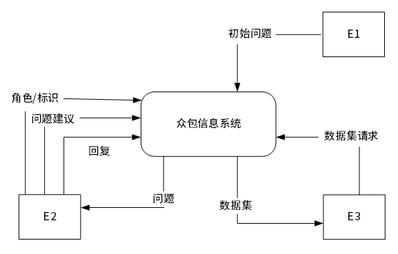
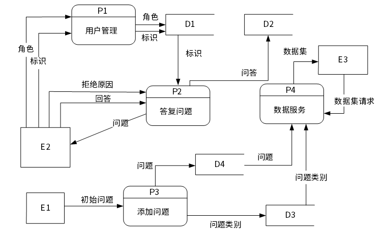

# 2023下半年选择题

- 来源标题: 2023年下半年软件设计师真题学员回忆版
- 试卷介绍页: https://wangxiao.xisaiwang.com/tiku2/136/tp30404116.html?cid=136
- 练习页: https://wangxiao.xisaiwang.com/tiku2/exam534903288.html
- 题量: 38

## 第1题（单选题）

【考生回忆版】在双核处理器中，双核是指（  ）。

- A. 执行程序时有两条指令流水线并行工作
- B. 在一个CPU中集成两个运算核心以提高运算能力
- C. 利用超线程技术实现的多任务并行处理
- D. 在主板上设置两个独立的CPU以提高处理能力

## 第2题（单选题）

【考生回忆版】以下关于折半查找的叙述中，不正确的是 （  ）。采用折半查找等概率查找某个包含8个元素的有序表，查找成功的平均查找长度为（  ）。

### 问题1
- A. 是一个分治算法
- B. 只能应用于有序表
- C. 查找成功和不成功的平均查找长度是一样的
- D. 若表长为n，时间复杂度为O（logn）
### 问题2
- A. 9/8
- B. 1/8
- C. 20/8
- D. 21/8

## 第3题（单选题）

【考生回忆版】线性表采用链表存储结构的特点中不包括（  ）。

- A. 所需空间大小与表长成正比
- B. 可随机访问表中的任一元素
- C. 插入和删除操作不需要移动元素
- D. 无须事先估计存储空间大小

## 第4题（单选题）

【考生回忆版】对采用面向对象方法开发的系统进行测试时，通常从不同层次进行测试。对类中定义的每个方法进行测试属于（  ）层。

- A. 系统
- B. 算法
- C. 类
- D. 模板

## 第5题（单选题）

【考生回忆版】统一过程模型的四个阶段中，在（  ）阶段进行需求分析和架构演进。

- A. 移交
- B. 精化
- C. 构建
- D. 起始

## 第6题（单选题）

【考生回忆版】在项目开发过程中，（  ）不属于项目估算的主要因素。

- A. 规模
- B. 类型
- C. 成本
- D. 工作量

## 第7题（单选题）

【考生回忆版】以下关于汇编语言程序的叙述中，错误的是（  ）。

- A. 汇编程序的功能是将汇编语言源程序翻译为相应的目标程序
- B. 用汇编语言编写的程序可以直接被计算机硬件执行
- C. 汇编语言是低级程序设计语言
- D. 汇编语言与计算机硬件体系结构密切相关

## 第8题（单选题）

【考生回忆版】以下关于方法重载（Overload）和方法覆盖（Overide）与多态的关系的叙述中，不正确的是（  ）。

- A. 覆盖通过动态绑定机制实现多态
- B. 重载通过动态绑定机制实现多态
- C. 重载属于编译时多态，在一个类中定义多个名称相同而参数表不同的方法
- D. 覆盖属于运行时多态，子类重新定义父类中已定义的方法

## 第9题（单选题）

【考生回忆版】浮点加（减）法运算过程中需要以下操作要素：
①零操作数检查
②规格化及舍入处理
③尾数加（减）运算
④对阶操作
正确的加（减）法操作流程是（  ）。

- A. ①③④②
- B. ①④③②
- C. ②①④③
- D. ④③②①

## 第10题（单选题）

【考生回忆版】采用贪心策略求解（  ）问题，一定可以得到最优解。

- A. 分数背包
- B. 0-1背包
- C. 旅行商
- D. 最长公共子序列

## 第11题（单选题）

【考生回忆版】下列算法中，不属于公开密钥加密算法的是（  ）。

- A. DSA
- B. ECC
- C. DES
- D. RSA

## 第12题（单选题）

【考生回忆版】POP3服务默认的TCP端口号是（  ）。

- A. 110
- B. 25
- C. 20
- D. 80

## 第13题（单选题）

【考生回忆版】以下关于基于构件的开发模型的叙述中，不正确的是（  ）。

- A. 本质上是演进模型，以迭代方式构建软件
- B. 必须采用面向对象开发技术
- C. 采用预先打包的软件构件构造软件
- D. 构件可以是组织内部开发的，也可以是商品化成品软件构件

## 第14题（单选题）

【考生回忆版】下列协议中，不属于安全协议的是（  ）。

- A. IPsec
- B. SNMP
- C. SFTP
- D. HTTPS

## 第15题（单选题）

【考生回忆版】执行以下Python语句之后，列表X为（  ）
x= [1,2,3]
x.append([4，5])

- A. [1,2,3,4,5]
- B. [1,2,3]
- C. [4,5]
- D. [1,2, 3,[4,5]]

## 第16题（单选题）

【考生回忆版】防火墙不具备（  ）功能。

- A. 病毒防治
- B. 状态检测
- C. 代理
- D. 包过滤

## 第17题（单选题）

【考生回忆版】（  ）模式可以给对象动态地添加一些额外的职责，而不改变该对象的结构。

- A. 装饰（Decorator）
- B. 外观（Facade）
- C. 组合（Composite）
- D. 享元（Flyweight）

## 第18题（单选题）

【考生回忆版】以下关于白盒测试原则的叙述中，不正确的是（  ）。

- A. 在所有的逻辑判断中，取“真”和取“假”的两种情况至少都能执行一次
- B. 程序模块中的所有独立路径至少执行一次
- C. 每个循环都应在边界条件和一般条件下各执行一次
- D. 在输入条件规定的取值范围的情况下，合理的输入和不合理的输入至少都能执行一次

## 第19题（单选题）

【考生回忆版】以下关于测试原则的叙述中，不正确的是（  ）。

- A. 充分注意测试中的群集现象
- B. 设计测试用例时，应包括合理的输入条件和不合理的输入条件
- C. 应该由程序员测试自己编写的程序
- D. 严格执行测试计划，避免测试的随意性

## 第20题（单选题）

【考生回忆版】某文件管理系统在磁盘上建立了位示图（bitmap），记录滋盘的使用情况。若计算机系统的字长为128位，磁盘的容量为1024GB，物理块的大小为8MB，那么该位示图的大小为（  ）个字。

- A. 4096
- B. 1024
- C. 2048
- D. 9600

## 第21题（单选题）

【考生回忆版】当一棵非空二叉树的（  ）时，对该二叉树进行中序遍历和后序遍历所得的序列相同。

- A. 每个非叶子结点都只有左子树
- B. 每个非叶子结点都只有右子树
- C. 每个非叶子结点的度都为1
- D. 每个非叶子结点的度都为2

## 第22题（单选题）

【考生回忆版】某队列允许在其两端进行入队操作，但仅允许在一端进行出队操作。若元素a、b、c、d依次全部入队列，之后进行出队列操作，则不能得到的出队序列是（  ）。

- A. dbac
- B. cabd
- C. acdb
- D. bacd

## 第23题（单选题）

【考生回忆版】在微型计算机中，管理键盘最适合采用的I/O控制方式是（  ）方式

- A. DMA
- B. 无条件传送
- C. 程序查询
- D. 中断

## 第24题（单选题）

【考生回忆版】在C/C++程序中，对于函数中定义的非静态局部变量，其存储空间在（  ）分配。

- A. 栈区
- B. 静态数据区
- C. 文本区
- D. 自由堆区

## 第25题（单选题）

【考生回忆版】以下关于PERT图的叙述中，不正确的是（  ）。

- A. 易于看出每个子任务的持续时间
- B. 易于看出目前项目的实际进度情况
- C. 易于看出子任务之间的衔接关系
- D. 易于识别出关键的子任务

## 第26题（单选题）

【考生回忆版】数据库的基本表、存储文件和视图的结构分别对应（  ）。

- A. 用户视图、内部视图和概念视图
- B. 用户视图、概念视图和内部视图
- C. 概念视图、用户视图和内部视图
- D. 概念视图、内部视图和用户视图

## 第27题（单选题）

【考生回忆版】一棵哈夫曼树共有127个结点，对其进行哈夫曼编码，共能得到（  ）个字符的编码。

- A. 64
- B. 127
- C. 63
- D. 126

## 第28题（单选题）

【考生回忆版】在SQL中，结束事务通常可以使用COMMTT和ROLLBACK语句。若某事务T执行了（  ）。

- A. ROLLBACK语句，则可将Ti对数据库的更新撤销
- B. ROLLBACK语句，则可将Ti对数据库的更新写入数据库
- C. COMMIT语句，则Ti对数据库影响可用ROLLBACK语句来撤销
- D. ROLLBACK语句，则表示Ti已正确地执行完毕

## 第29题（单选题）

【考生回忆版】利用报文摘要算法生成报文摘要的目的是（  ）。

- A. 防止发送的报文被篡改
- B. 对传输数据进行加密，防止数据被窃听
- C. 验证通信对方的身份，防止假冒
- D. 防止发送方否认发送过的数据

## 第30题（单选题）

【考生回忆版】采用冒泡排序算法对序列（49，38，65，97，76，13，27，49）进行非降序排序，两趟后的序列为（  ）。

- A. （49，38，65，13，27，49，76，97）
- B. （38，49，65，76，13，27，49，97）
- C. （38，49，65，13，27，49，76，97）
- D. （49，38，65，97，76，13，27，49）

## 第31题（单选题）

【考生回忆版】以下关于软件工程标准化的叙述中，不正确的是（  ）。

- A. 可以提高开发人员之间的沟通效率
- B. 有助于提高管理水平
- C. 有助于提高软件产品质量
- D. 可以提高每一位开发人员的开发技能

## 第32题（单选题）

【考生回忆版】采用简单选择排序算法对序列（34，12，49，28，31，52，51，49）进行非降序排序，两趟后的序列为（  ）。

- A. （12，28，49，34，31，52，51，49）
- B. （12，28，34，49，31，52，51，49）
- C. （12，28，31，49，34，52，51，49）
- D. （34，12，49，28，31，49，51，52）

## 第33题（单选题）

【考生回忆版】程序员甲将其编写完成的软件程序发给同事乙并进行讨论，之后由于甲对该程序极不满意，因此甲决定放弃该程序，后来乙将该程序稍加修改并署自己名在某技术论坛发布。下列说法中，正确的是（  ）。

- A. 乙对该程序进行了修改，因此乙享有该程序的软件著作权
- B. 乙的行为没有侵犯甲的软件著作权，因为甲已放弃程序
- C. 乙的行为未侵权，因其发布的场合是以交流学习为目的的技术论坛
- D. 乙的行为侵犯了甲对该程序享有的软件著作权

## 第34题（单选题）

【考生回忆版】在设计模块M和模块N时，（  ）是最佳的设计。

- A. M和N通过通信模块传送数据
- B. M和N通过公共数据域传送数据
- C. M和N通过简单数据参数交换信息
- D. M直接访问N的数据

## 第35题（单选题）

【考生回忆版】以下关于甘特图的叙述中，不正确的是（  ）。

- A. 一种进度管理的工具
- B. 易于看出每个子任务的持续时间
- C. 易于看出目前项目的实际进度情况
- D. 易于看出子任务之间的衔接关系

## 第36题（单选题）

【考生回忆版】软件文档在软件生存期中起着重要的作用，其作用不包括（  ）。

- A. 提高软件运行效率
- B. 作为开发过程的阶段工作成果和结束标记
- C. 提高开发过程的能见度
- D. 提高开发效率

## 第37题（单选题）

【考生回忆版】数据库概念结构设计阶段的工作步骤包括①~④，其正确的顺序为（  ）。
①设计局部视图 ②抽象数据 ③修改重构消除冗余 ④合并取消冲突

- A. ①→②→④→③
- B. ①→②→③→④
- C. ②→①→③→④
- D. ②→①→④→③

## 第38题（案例题）

【考生回忆版】
随着深度学习的广泛应用，现代聊天机器人系统需要大规模的训练数据集才能达到其最佳性能，而手动收集如此庞大的数据集需要耗费巨大的人力和时间成本。现欲开发一众包信息系统来辅助收集训练数据集，其主要功能是:
(1)用户管理。众包工作者提供角色和标识，并存储在用户表中。
(2)添加问题。在不同情况下接收来自众包工作者和管理员输入的问题:众包工作者输入问题建议，管理员负责添加初始问题。将问题和问题类别分别进行存储。问题类别说明问题是由众包工作者还是管理员提供的。
(3)答复问题。众包工作者回答或拒绝系统随机展示的5个问题。答复流程是，如果回答问题则提供答案，如果拒绝问题则提供拒绝原因，如果回答问题数不足5个，继续展示问题，否则众包工作者提供问题建议。无论是回答还是拒绝，数据都存储在带有不同状态标记的答复表中。
(4)数据服务。根据其它训练平台的请求，为其提供问题、问题类别、回复的数据集。
现采用结构化方法对众包信息系统进行分析与设计，获得如图1所示的上下文数据流图和图2所示的0层数据流图。

图1 上下文数据流图

图1 0层数据流图

### 补充题面

【问题1】（3分）
使用说明中的词语，给出图1中的实体E1~E3的名称。
【问题2】（4分）
使用说明中的词语，给出图2中的数据存储D1~D4的名称
【问题3】（4分）
根据说明和图中术语，补充图2中缺失的数据流及其起点和终点。
【问题4】（4分）
什么是分层数据流图中父图与子图的平衡?如何保持。
