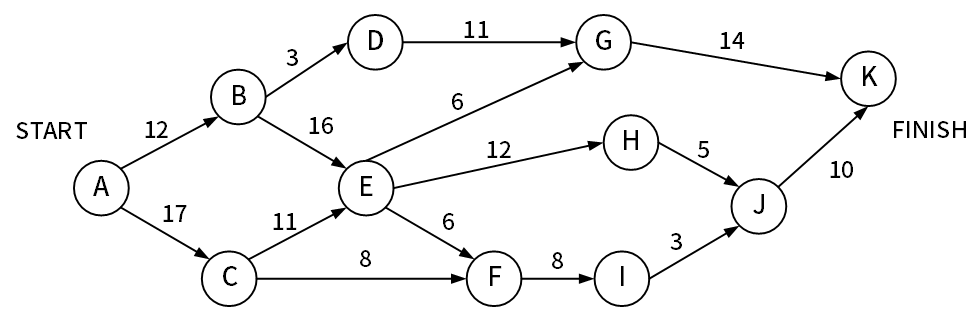
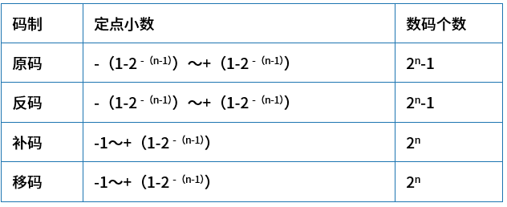
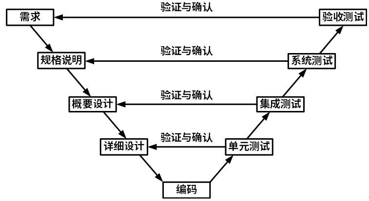
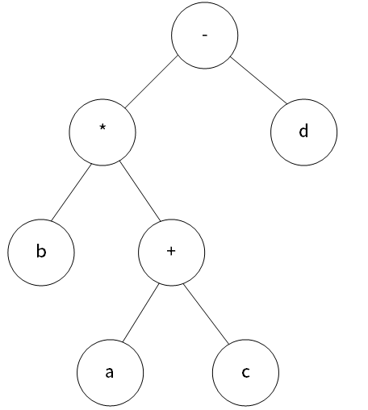
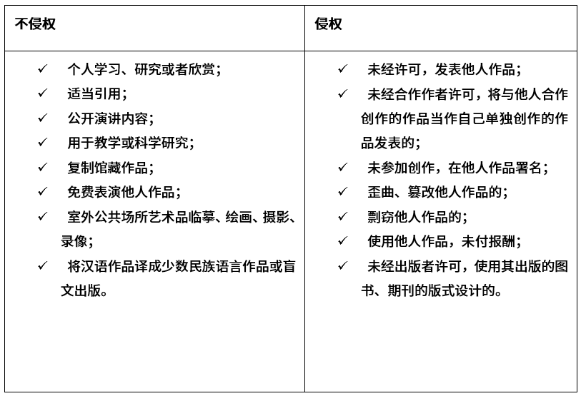
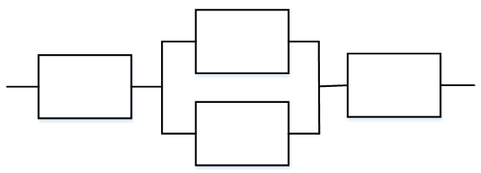

# 2024上半年选择题

- 来源标题: 2024年上半年软件设计师考试基础知识真题（专业解析+参考答案）
- 试卷介绍页: https://wangxiao.xisaiwang.com/tiku2/136/tp30407995.html?cid=136
- 练习页: https://wangxiao.xisaiwang.com/tiku2/exam534904176.html
- 题量: 30

## 第1题（单选题）

【考生回忆版】在计算机网络协议5层体系结构中，（B）工作在数据链路层。

- A. 路由器
- B. 以太网交换机
- C. 防火墙
- D. 集线器

### 正确答案

B

### 解析

本题考查计算机网络基础。
网络层：路由器、防火墙
数据链路层：交换机、网桥
物理层：中继器、集线器

## 第2题（单选题）

【考生回忆版】软件交付之后，由于软硬件环境发生变化而对软件进行修改的行为属于（B）维护。

- A. 改善性
- B. 适应性
- C. 预防性
- D. 改正性

### 正确答案

B

### 解析

本题考查软件维护的内容。
改正性维护。指为了识别和纠正软件错误、改正软件性能上的缺陷、排除实施中的错误，应当进行的诊断和改正错误的过程。
适应性维护。指使应用软件适应信息技术变化和管理需求变化而进行的修改。企业的外部市场环境和管理需求的不断变化也使得各级管理人员不断提出新的信息需求。
预防性维护。系统维护工作不应总是被动地等待用户提出要求后才进行，应进行主动的预防性维护, 通过预防性维护为未来的修改与调整奠定更好的基础。
完善性维护。扩充功能和改善性能而进行的修改。对已有的软件系统增加一些在系统分析和设计阶段中没有规定的功能与性能特征。
本题选择B选项。

## 第3题（单选题）

【考生回忆版】以下不属于函数依赖的Armstrong公理系统的是（C）。

- A. 自反规则
- B. 传递规则
- C. 合并规则
- D. 增广规律

### 正确答案

C

### 解析

本题考查数据库基础知识。
关系模式R < U，F >来说有以下的推理规律：
A1.自反律（Reflexivity）：若Y⊆X⊆U，则X →Y成立。
A2.增广律（Augmentation）：若Z⊆U且X→Y，则XZ→YZ成立。
A3.传递律（Transitivity）：若X→Y且Y→Z，则X→Z成立。
根据A1，A2，A3这三条推理规则可以得到下面三条推理规则：
合并规则：由X→Y，X→Z，有X→YZ。
伪传递规则：由X→Y，WY→Z，有XW→Z。
分解规则：由X→Y及 Z ⊆ Y，有X→Z。
合并规则属于推导规则，本质上不属于定理。

## 第4题（单选题）

【考生回忆版】结构化分析方法的基本思想是（B）。

- A. 自底向上逐步分解
- B. 自顶向下逐步分解
- C. 自底向上逐步抽象
- D. 自顶向下逐步抽象

### 正确答案

B

### 解析

本题考查软件工程开发方法。
结构化开发方法主要特征包含：自顶向下、逐步分解求精、严格区分阶段、阶段产生标准化。

## 第5题（单选题）

【考生回忆版】执行以下Python语句之后，列表y为（B）。
x=[1,2,3]
y=x+[4,5,6]

- A. 出错
- B. [1,2,3,4,5,6]
- C. [5,7,9]
- D. [1,2,3,[4,5,6]]

### 正确答案

B

### 解析

本题考查python语言基础。
在python语言中，+属于拼接，对于y=[1,2,3]+ [4,5,6]两者的拼接情况为一个列表[1,2,3,4,5,6]。
讲义：p52

## 第6题（单选题）

【考生回忆版】对于一棵树，每个结点的孩子结点个数称为结点的度，结点度数的最大值称为树的度。某树T的度为4，其中有5个度为4的结点，8个度为3的结点，6个度为2的结点，10个度为1的结点，则T中的叶子结点个数为（A）。

- A. 38
- B. 29
- C. 66
- D. 57

### 正确答案

A

### 解析

本题考查树的性质。
在树的性质中永远存在，边+1=结点
根据题目描述设叶子节点个数为x，则可得出下方等式
5*4+8*3+6*2+10*1+1=5+8+6+10+x
得出x=38

## 第7题（单选题）

【考生回忆版】下图是一个软件项目的活动图，其中顶点表示项目里程碑，连接顶点的边表示包含的活动，则一共有（B/B）条关键路径，关键路径长度为（ ）。
 

### 问题1
- A. 2
- B. 4
- C. 3
- D. 1
### 问题2
- A. 48
- B. 55
- C. 30
- D. 46

### 正确答案

B、B

### 解析

本题考查项目管理关键路径。
通过图示可以发现，找出最长的一条线路即为关键路径。
分别有4条这样的关键路径为：
ABEHJK、ABEFIJK、ACEHJK、ACEFIJK
总长度为55。

## 第8题（单选题）

【考生回忆版】对于定点纯小数的数据编码，下述说法正确的是（D）。

- A. 仅原码能表示-1
- B. 仅反码能表示-1
- C. 原码和反码均能表示-1
- D. 仅补码能表示-1

### 正确答案

D

### 解析

本题考查计算机基础码制相关内容。
对于定点小数表示的范围如下表所示：

综合分析，答案选D。

## 第9题（单选题）

【考生回忆版】软件测试过程中的系统测试主要是为了发现（D）阶段的问题。

- A. 软件实现
- B. 概要设计
- C. 详细设计
- D. 需求分析

### 正确答案

D

### 解析

本题考查软件测试的内容。
根据V模型的图示展开如下：

系统测试和验收测试都是针对于需求分析阶段进行测试的。

## 第10题（单选题）

【考生回忆版】WWW服务器与客户机之间主要采用（B）安全协议进行网页的发送和接收。

- A. HTTP
- B. HTTPS
- C. HTML
- D. SMTP

### 正确答案

B

### 解析

超文本传输协议。HTTP本身不是安全的，因为它在传输过程中不对数据进行加密。
HTTPS：安全的超文本传输协议，它通过在HTTP和TCP之间添加一个加密层（通常是SSL/TLS）来提供加密通信和身份验证。HTTPS确保在服务器和客户机之间传输的数据是安全的，并且服务器是真实的。
HTML：这是超文本标记语言（HyperText Markup Language）的缩写，用于创建网页内容。
SMTP：邮件发送发送协议，它与WWW服务器和客户机之间的网页传输不直接相关。

## 第11题（单选题）

【考生回忆版】瀑布模型的主要特点是（C）。

- A. 用户容易参与到开发活动中
- B. 易于处理可变需求
- C. 缺乏灵活性
- D. 用户与开发者沟通容易

### 正确答案

C

### 解析

本题考查开发模型。
瀑布模型是一种线性顺序的软件开发生命周期模型，其中每个阶段都必须在前一个阶段完成后才能开始。它按照需求分析、设计、编码、测试和交付的顺序进行，且每个阶段都有明确的任务和输出。
A选项，瀑布模型的一个特点是线性，这限制了用户的参与。在瀑布模型中，用户主要在需求分析阶段参与，而在后续阶段中参与度较低。
B选项，瀑布模型不善于处理需求变更。由于它的线性特性，如果在项目后期发生需求变更，那么可能需要回溯到之前的阶段，重新进行设计、编码和测试，这会导致成本和时间上的巨大开销。
C选项，这正是瀑布模型的一个主要特点。由于其严格的线性结构和阶段之间的依赖性，瀑布模型在处理需求变更、技术挑战或项目进度变化时缺乏灵活性。
D选项，在瀑布模型中，由于开发过程的高度结构化和线性化，用户与开发者之间的沟通并不总是容易的。特别是在项目后期，当用户看到实际的产品并开始提出反馈时，可能需要进行大量的沟通和协调工作。

## 第12题（单选题）

【考生回忆版】TCP序号单位是（B）。

- A. 赫兹
- B. 字节
- C. 比特
- D. 报文

### 正确答案

B

### 解析

本题考查TCP传输协议。
TCP（Transmission Control Protocol，传输控制协议）使用序列号来确保数据的可靠传输。当TCP发送数据段（segments）时，它会为每个数据段分配一个唯一的序列号。这个序列号是基于字节的，而不是比特、赫兹或报文。TCP使用序列号来确保数据段的顺序，并允许接收端在检测到丢失或乱序的数据段时请求重传。
赫兹（Hz）是频率的单位，与TCP的序列号无关。
比特（bit）是信息量的基本单位，但TCP的序列号是基于字节的。
报文（message）是TCP/IP网络中传输的信息单位，但TCP的序列号是基于每个数据段中的字节的，而不是整个报文。

## 第13题（单选题）

【考生回忆版】采用简单选择排序算法对序列（49，38，65，97，76，13，27，49）进行非降序排序，两趟后的序列为（A）。

- A. （13，27，65，97，76，49，38，49）
- B. （38，49，65，76，13，27，49，97）
- C. （13，38，65，97，76，49，27，49）
- D. （38，49，65，13，27，49，76，97）

### 正确答案

A

### 解析

本题考查选择排序类算法。
工作原理是：首先在未排序序列中找到最小（或最大）元素，存放到排序序列的起始位置，然后，再从剩余未排序元素中继续寻找最小（或最大）元素，然后放到已排序序列的末尾。以此类推，直到所有元素均排序完毕。
采用非降序（即升序排列）
第一趟排序，找到最小的数据13，将其与第一位数交换位置，故整体情况为：
（13，38，65，97，76，49，27，49）
第二趟排序，找到第二小的数据27，将其与第二位数交换位，故整体情况为：
（13，27，65，97，76，49，38，49）

## 第14题（单选题）

【考生回忆版】在计算机系统中，CPU中跟踪后继指令地址的寄存器是（C）。

- A. 指令寄存器
- B. 状态条件寄存器
- C. 程序计数器
- D. 主存地址寄存器

### 正确答案

C

### 解析

本题考查CPU组成。
指令寄存器：存储即将执行的指令。
状态条件寄存器：存状态标志与控制标志。
程序计数器：存储下一条要执行指令的地址。
主存地址寄存器：保存当前CPU访问内存单元的地址。

## 第15题（单选题）

【考生回忆版】硬盘所属的存储类别是（D）。

- A. 寄存器
- B. 缓存
- C. 主存
- D. 辅存

### 正确答案

D

### 解析

本题考查层次化存储体系结构。
CPU对应的存储类别：寄存器
Cache对应的存储类别：缓存
主存对应的存储类别：DRAM
辅存对应的存储类别：硬盘、光盘等

## 第16题（单选题）

【考生回忆版】UML类图在软件建模时，给出软件系统的一种静态设计视图，用（C）关系可明确表示两类事物之间存在的特殊/一般关系。

- A. 聚合
- B. 依赖
- C. 泛化
- D. 实现

### 正确答案

C

### 解析

本题考查UML关系。
依赖关系：一个事物发生变化影响另一个事物。
实现关系：接口与类之间的关系。
泛化关系：特殊/一般关系。
聚合关系：整体与部分生命周期不同。属于关联关系。

## 第17题（单选题）

【考生回忆版】在29个元素构成的查找表中查找任意一个元素时，可保证最多与表中5个元素进行比较即可确定查找结果，则采用的查找表及查找方法是（C）。

- A. 二叉排序树上的查找
- B. 顺序表上的顺序查找
- C. 有序顺序表上的二分查找
- D. 散列表上的哈希查找

### 正确答案

C

### 解析

本题考查查找算法相关内容。
二叉排序树上的查找：在二叉排序树上查找一个元素时，平均查找长度通常与树的深度有关。然而，题目没有给出二叉排序树的具体结构，所以我们不能确定它的深度是否满足“最多与5个元素进行比较”的条件。此外，对于最坏情况（即树非常不平衡），比较的次数可能会远超过5次。因此，A选项不能确定。
顺序表上的查找：会从头到尾（或从尾到头）遍历整个列表，直到找到目标元素或遍历完整个列表。对于29个元素的列表，顺序查找最多需要比较29次。因此，B选项显然不满足“最多与5个元素进行比较”的条件。
二分查找：每次比较都会排除一半的元素。对于一个包含29个元素的有序顺序表，二分查找的决策树深度为⌈log₂(29)⌉ = 5（向上取整）。这意味着在最坏的情况下，二分查找需要进行5次比较来确定查找结果。因此，C选项满足题目要求。
散列表的哈希查找：哈希查找的性能主要取决于哈希函数的设计以及哈希表的填充因子。理想情况下，哈希查找可以在常数时间内完成，但最坏情况下可能会退化为线性查找（如果哈希函数设计不当或哈希表过于拥挤）。题目没有提供关于哈希函数或哈希表的具体信息，因此我们不能确定哈希查找是否满足“最多与5个元素进行比较”的条件。

## 第18题（单选题）

【考生回忆版】算术表达式b*（a＋c）- d的后缀式是（D）（+、－、*表示算术的加、减、乘运算，运算符的优先级和结合性遵循惯例）。

- A. ba+cd*-
- B. bacd+*-
- C. ba*c+d*-
- D. bac＋*d-

### 正确答案

D

### 解析

本题考查程序设计语言后缀式。

后缀式（逆波兰式）根据左右根的顺序遍历，依次是bac+*d-，答案选D。

## 第19题（单选题）

【考生回忆版】面向对象软件从不同层次进行测试。（D）层测试类中定义的每个方法，相当于传统软件测试中的单元测试。

- A. 模板
- B. 系统
- C. 类
- D. 算法

### 正确答案

D

### 解析

本题考查面向对象设计过程。
面向对象测试分为四个层次执行：
算法层：测试类中定义的每个方法，基本相当于传统软件测试的单元测试。
类层：测试封装在同一个类中的所有方法与属性之间的相互作用。可以认为是面向对象测试中特有的模块测试。
模板层：测试一组协调工作的类之间的相互作用。大体上相当于传统软件测试中的集成测试。
系统层：把各个子系统组装成完整的面向对象软件系统。

## 第20题（单选题）

【考生回忆版】循环冗余校验码（CRC）利用生成多项式进行编码。设数据位为n位，校验位为k位，则CRC码的格式为（C）。

- A. k个校验位按照指定间隔位与n个数据位混淆
- B. k个校验位之后跟n个数据位
- C. n个数据位之后跟k个校验位
- D. k个校验位等间隔地放入n个数据位中

### 正确答案

C

### 解析

本题考查校验码基础知识。
奇偶校验码编码方法：由若干位有效信息（如一个字节），再加上一个二进制位（校验位）组成校验码。这个校验位可以加在最前面也可以是最后面。
CRC的编码方法是：在k位信息位之后拼接r位校验位。
海明校验码编码方法：在有效信息位中加入几个校验位形成海明码，使码距比较均匀地拉大，并把海明码的每个二进制位分配到几个奇偶校验组中。
ABD描述错误，本题选择C选项。

## 第21题（单选题）

【考生回忆版】以下关于通过解释器运行程序的叙述中，错误的是（C）。

- A. 可以由解释器直接分析并执行高级语言源程序代码
- B. 与直接运行编译后的机器码相比，通过解释器运行程序的速度更慢
- C. 解释器运行程序比运行编译和链接方式产生的机器代码效率更高
- D. 可以先将高级语言程序转换为字节码，再由解释器运行字节码

### 正确答案

C

### 解析

本题考查解释器程序。
解释器是一种计算机程序，它可以直接读取、分析并执行以高级编程语言（如Python、Ruby、JavaScript等）编写的源代码，而无需预先将其转换为机器代码。
编译型语言（如C、C++、Java等）的源代码首先会被编译成机器代码（或字节码），然后这些代码可以直接在硬件上执行。而解释型语言（如Python、Ruby等）的源代码则需要解释器一行一行地读取、分析和执行，这通常会比直接执行机器代码慢。
有些解释型语言（如Java）采用了一种中间步骤，即将源代码编译成字节码（bytecode），然后由解释器（或称为虚拟机）在运行时解释执行这些字节码。这种方式结合了编译型语言和解释型语言的特点，既可以在一定程度上提高执行效率，又保留了跨平台的能力。

## 第22题（单选题）

【考生回忆版】进行面向对象系统设计时，若存在包A依赖于包B，包B依赖于包C，包C依赖于包A，则此设计违反了（D）原则。

- A. 稳定抽象
- B. 稳定依赖
- C. 依赖倒置
- D. 无环依赖

### 正确答案

D

### 解析

本题考查面向对象设计原则。
稳定抽象原则：此原则强调的是包的抽象程度与其稳定程度一致。
稳定依赖原则：此原则要求包之间的依赖关系都应该是稳定方向依赖的，即包要依赖的包要比自己更具有稳定性。
依赖倒置原则：此原则强调的是程序应该依赖于抽象接口，而不是具体的实现，从而降低客户与实现模块间的耦合
无环依赖：这个原则明确指出，在组件的依赖关系图中不允许存在环。从给出的设计描述中，包A、包B、包C之间的依赖关系形成了一个环，这直接违反了无环依赖原则。

## 第23题（单选题）

【考生回忆版】下列算法属于Hash算法的是（A）。

- A. SHA
- B. DES
- C. IDEA
- D. RSA

### 正确答案

A

### 解析

本题考查计算机网络基础。
常用的消息摘要算法有MD5、SHA等，市场上广泛使用的MD5、SHA算法的散列值分别为128和160位，由于SHA通常采用的密钥长度较长，因此安全性高于MD5。
其中DES和IDEA都属于对称加密算法，RSA属于非对称加密算法。

## 第24题（单选题）

【考生回忆版】在关系表中选出若干属性列组成新的关系表，可以使用（A）操作实现。

- A. 投影
- B. 笛卡儿积
- C. 选择
- D. 差

### 正确答案

A

### 解析

本题考查数据库基础SQL语言。
投影：投影出某属性列。
笛卡尔积：两表之间的乘积，组成新的表之后，新表的属性列为两表之和，元组数为两表之乘积。
选择：选择某条件下的一条/多条元组记录。
差：两表之间的差集是指在该表中减去两者之间重复的元组。
本题选择A选项。

## 第25题（单选题）

【考生回忆版】在撰写学术论文时，通常需要引用某些文献资料。以下叙述中，（A）是不正确的。

- A. 既可引用发表的作品，也可引用未发表的作品
- B. 不必征得原作者的同意，不需要向他支付报酬
- C. 只能限于介绍、评论作品
- D. 只要不构成自己作品的主要部分，可适当引用资料

### 正确答案

A

### 解析

本题考查知识产权与标准化内容。
关于侵权和不侵权评定情况如下表所示：

合理使用不侵权，不需要通知作者、不需要付费，但仍然受著作权法保护。

## 第26题（单选题）

【考生回忆版】进行面向对象设计时，以下（B）不能作为继承的类型。

- A. 多重继承
- B. 分布式继承
- C. 单重继承
- D. 层次继承

### 正确答案

B

### 解析

本题考查面向对象基础。
对于面向对象的设计，支持多重继承和单重继承（多个父类和一个父类）
同时也支持层次继承（一般会同时实现继承类实现接口）
对于分布式继承不是面向对象体现的继承类型。
本题选择B选项。

## 第27题（单选题）

【考生回忆版】在采用定点二进制的运算器中，减法运算一般是通过（A）来实现的。

- A. 补码运算的二进制加法器
- B. 原码运算的二进制加法器
- C. 补码运算的二进制减法器
- D. 原码运算的二进制减法器

### 正确答案

A

### 解析

本题考查计算机基础。
在运算中，CPU分为控制器和运算器，执行算术逻辑运算的是算术逻辑运算单元，然后将其结果放到加法器执行。
其次在运算过程中，补码是正确的适合加减运算的，这个结果是符合要求的。

## 第28题（单选题）

【考生回忆版】用于收回SQL访问控制权限的操作是（C）。

- A. GRANT
- B. DELETE
- C. REVOKE
- D. DROP

### 正确答案

C

### 解析

本题考查数据库基础SQL语言部分。
GRANT：表示授权
DELETE：表示删除表内部数据
REVOKE：表示销权
DROP：表示删除表结构

## 第29题（单选题）

【考生回忆版】某系统由下图所示的冗余部件构成。若每个部件的千小时可靠度都为R，则该系统的千小时可靠度为（D）。

- A. （1-（1-R）2）（1-R）
- B. （1-R）2（1-R2）
- C. R（1-R2）R
- D. R（1-（1-R）2）R

### 正确答案

D

### 解析

本题考查计算机基础。
根据每个部件千小时可靠度都为R可得知道，该部件是有三个部分整体进行串联而得：
只不过中间整体区域又是并联，故先用逆向思维求出这个整体的可靠度为多少。
先求出不可靠性，即（1-R）2，再用1-（1-R）2为该整体的可靠度。
三者之间进行串联，故需要相乘，结果即为：R（1-（1-R）2）R

## 第30题（单选题）

【考生回忆版】已知二维数组A按行优先方式存储，每个元素占用2个存储单元，第一个元素A[0][0]的地址为100，元素A[3][3]的存储地址是220，则元素A[5][5]的地址是（A）。

- A. 300
- B. 310
- C. 306
- D. 296

### 正确答案

A

### 解析

本题考查数据结构矩阵与数组。
已知题目说明二维数组A按行进行存储，且每个元素占用2个存储单元，第一个元素A[0][0]的地址为100，A[3][3]的地址为220。
我们先设每行有X个元素，从而推到出A[0][0]距离A[3][3]应该为X-1+2X+4=3X+3
间隔地址数为220-100=120，已知每个地址为2个存储单元，则有：
2（3X+3）=120，得出X=19，可知该二维矩阵的列为19。
故A[5][5]的地址应该为220+2（15+19+6）=300
