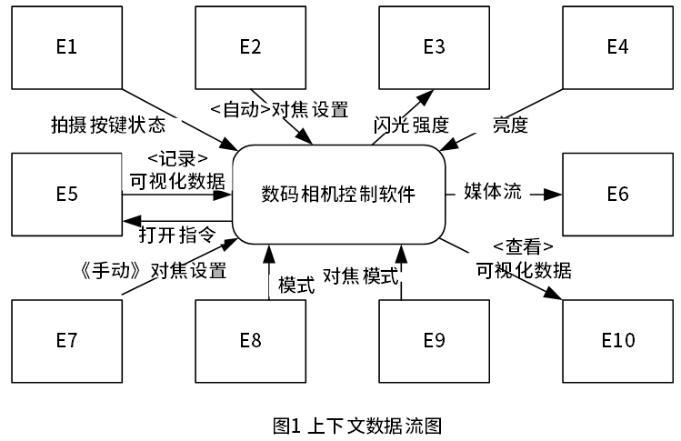
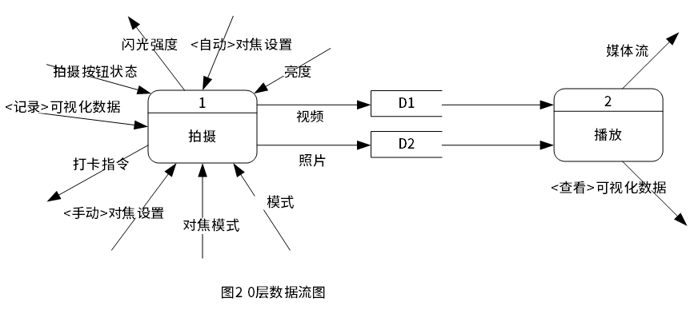
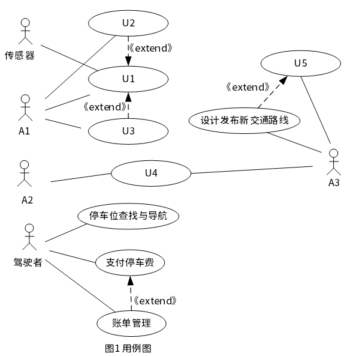
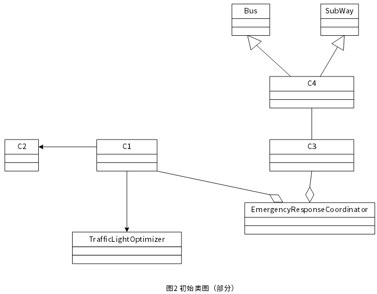

# 2024下半年案例题

- 来源标题: 2024年下半年软件设计师考试应用技术真题（专业解析+参考答案）
- 试卷介绍页: https://wangxiao.xisaiwang.com/tiku2/136/tp30411115.html?cid=136
- 练习页: https://wangxiao.xisaiwang.com/tiku2/exam534904161.html
- 题量: 2

## 第1题（案例题）

（一）（15分）
【说明】
某公司为一款数码相机开发控制软件，以控制并支持数码相机进行拍摄和播放。
相机正面视图包括镜头、手动调焦环、闪光灯、自动对焦传感器、亮度传感器、PC连接器线口、拍摄按钮；相机背面视图有显示屏、对焦开关、模式切换按钮（模式包括拍照、录像和播放）。相机功能包括。
（1）在拍照或录像模式下，在按下拍摄按钮后打开镜头，根据模式进行拍摄照片或录制视频，并显示在显示屏上；在播放模式下，显示照片或播放视频。
（2）可以根据对焦开关设置为手动还是自动进行对焦。在手动对焦模式下，从手动对焦环获取对焦设置，在自动模式下，从自动对焦传感器获取设置。
（3）环境的亮度由亮度传感器测量。该传感器的值决定镜头的光圈并在必要时激活闪光灯。闪光灯有1、2、3三种不同功率的闪光强度。
（4）照片存储为JPG格式，视频存储为AVI格式。
（5）在播放模式下，如果相机连接至电脑后，可将已存储在相机中的照片和视频以媒体流传输至电脑中。
现采用结构化方法对数码相机控制软件进行分析与设计，获得如图1所示的上下文数据流图和图2所示的0层数据流图。
 

### 补充题面

01（5分）
使用说明中的词语，给出图1中的实体E1~E10的名称。
02（2分）
使用说明中的词语，给出图2中的数据存储D1～D2的名称。
03（6分）
根据说明和图中术语，给出图中数据流条目“可视化数据”、“媒体流”、“闪光强度”的组成。
04（2分）
采用结构图对控制软件进行设计，说明结构化设计的步骤。

### 参考答案

1、
E1 拍摄按钮
E2 自动对焦传感器
E3 闪光灯
E4 亮度传感器
E5 镜头
E6 电脑
E7 手动对焦环
E8 模式切换按钮
E9 对焦开关
E10 显示屏
2、
（1）视频记录
（2）照片记录
3、可视化数据=[JPG图片|AVI视频]
 媒体流=[JPG图片|AVI视频]
 闪光强度=[功率1|功率2|功率3]
4、
a、需求分析
b、概要设计
c、详细设计
d、系统测试

### 解析

1、根据题干信息以及所给图示，可得到E1-E10对应实体。图1中E1对应操作为按键状态，很明显为拍摄按钮，E2对应操作为 < 自动 > 对焦设置,题干“在自动模式下，从自动对焦传感器获取设置”可得E2为自动对焦传感器，E3对应操作为闪光强度，题干“闪光灯有1、2、3三种不同功率的闪光强度”即得闪光灯,E4对应操作为亮度，题干“环境的亮度由亮度传感器测量”即得亮度传感器，E5为记录可视化数据，打开指令，可视化数据是视频，照片，只有镜头能够记录，同时题干“在按下拍摄按钮后打开镜头”即为打开指令，E5即镜头，E6为媒体流，题干“将已存储在相机中的照片和视频以媒体流传输至电脑中”E6即电脑，E7手动对焦设置，同E2，即E7为手动对焦环，E8对应操作为模式，题干“模式切换按钮（模式包括拍照、录像和播放）”E8即模式切换按钮，E9对应操作对焦模式，题干“可以根据对焦开关设置为手动还是自动进行对焦”E9即对焦开关，E10查看可视化数据，视频照片用显示屏去看。  
2、根据图2,视频存入D1,D1即为视频记录同理D2为照片记录。
3、可视化数据即为照片，视频。根据题干信息“照片存储为JPG格式，视频存储为AVI格式”，即可视化数据=[JPG图片|AVI视频]
媒体流，题干信息“将已存储在相机中的照片和视频以媒体流传输至电脑” 那媒体流与可视化数据类似，即媒体流=[JPG图片|AVI视频]
闪光强度，题干信息“闪光灯有1、2、3三种不同功率的闪光强度”即闪光强度=[功率1|功率2|功率3]。

## 第2题（案例题）

（三）（15分）
【说明】
某城市计划开发一个智能交通管理系统，实时监控并优化城市的交通流量。该系统的主要功能描述如下：
（1）交通流量监控（TrafficMonitor）。系统将从各种传感器（Sensor）（如路面摄像头、车辆GPS设备、交通信号灯等）收集交通数据。交警根据这些数据进行实时分析，预测交通拥堵，优化交通信号灯（TrafficLightOptimizer）的配时。
（2）公共交通管理（PublicTransportManager)。系统需管理和优化公共交通工具（Public Transport)（如公交车（Bus)、地铁（Subway）等）的调度，公交调度员根据实时路况和乘客需求调整路线和班次。
（3）应急响应管理（EmergencyRespoaseCoordinator)。在发生交通事故或者其他突发事件时，系统需要通知相关应急响应部门并给出最优的应急方案。同时，系统还需重新设计和发布新的交通路线，以避开事故区域。
（4）智能停车管理。系统将帮助驾驶者实时找到附近的停车位，并提供导航服务。还能进行停车费用的自动支付和账单管理。
采用面向对象分析与设计方法开发上述系统，得到如图1所示的用例图以及图2所示的初始类图（部分）。
 

### 补充题面

01（8分）
根据说明中的描述，给出图1中A1~A3所对应的参与者名称和U1~U5处所对应的用例名称。
02（4分）
根据说明中的描述，给出图2中C1~C4所对应的类名。
03（3分）
在应急响应管理功能中，需要根据事件的严重程度和优先级，按照应急事件的处理流程，逐步将处理任务分配给合适的应急响应单位。请用文字说明哪种设计模式适合于实现该需求并简单说明原因?

### 参考答案

1、
A1 交警
A2 调度员
A3 应急响应部门
U1 收集分析交通数据
U2 预测交通拥堵
U3 优化交通信号灯配时
U4 管理优化公共交通工具
U5 获取通知以及最优应急方案
2、
C1 TrafficMonitor
C2 Sensor
C3 PublicTransportManager
C4 PublicTransport
3、
责任链模式。
该模式用于级联处理请求。可以根据需求灵活组织处理链，直到某一级处理完就停止传递。非常灵活，适应性强。

### 解析

1、A1，有三个用例，根据题干信息“交警根据这些数据进行实时分析，预测交通拥堵，优化交通信号灯（TrafficLightOptimizer）的配时 ” A1为交警，U2、U3扩展U1，有了数据才能进行分析，才能优化配时，同时传感器也拥有U1用例，即U1为收集分析交通数据，U2、U3为预测交通拥堵，优化交通信号灯配时。A2与A3有同一用例，A3有设计发布新交通路线用例，根据题干“应急响应管理需重新设计和发布新的交通路线，以避开事故区域” A3为应急响应部门，A3根据题干“应急响应部门给出最优的应急方案。同时，系统还需重新设计和发布新的交通路线” 可得设计发布新交通路线扩展自给出最优的应急方案，U5为获取通知以及最优应急方案，与A2共同拥有的用例为管理和优化公共交通工具，一系列应急方案，重新设计发布交通路线都可归为管理和优化。U4即为管理优化公共交通工具
根据U4为管理优化公共交通工具，可得A2为调度员。
2、C1聚合EmergencyRespoaseCoordinator，关联TrafficLightOptimizer，根据题干信息C1即为交通流量监控（TrafficMonitor）C1关联C2,关联可理解为拥有，TrafficMonitor拥有Sensor，利用Sensor收集数据。C2即为Sensor,C4有两个泛化，泛化成BUS和subway，根据题干“公共交通工具（Public Transport)（如公交车（Bus)、地铁（Subway）等”C4即PublicTransport
C3即PublicTransportManager。
