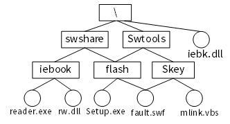
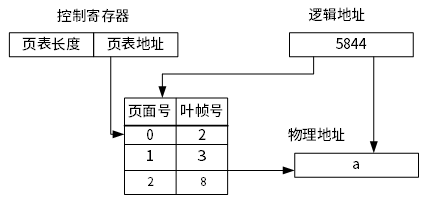

# 2024下半年选择题

- 来源标题: 2024年下半年软件设计师考试基础知识真题（专业解析+参考答案）
- 试卷介绍页: https://wangxiao.xisaiwang.com/tiku2/136/tp30411114.html?cid=136
- 练习页: https://wangxiao.xisaiwang.com/tiku2/exam534904163.html
- 题量: 31

## 第1题（单选题）

若某文件系统的目录结构如下图所示，假设用户要访问文件fault.swf，且当前工作目录为Swtools，则该文件的相对路径和绝对路径分别为（B）。

- A. \Swtools\flash\和flash\
- B. flash\和\Swtools\flash\
- C. Swtools\flash和\flash\
- D. \flash和\Swtools\flash\

### 正确答案

B

### 解析

本题考查文件目录的相对路径和绝对路径。
绝对路径从根目录开始，本题fault.swf的绝对路径为Swtools lash；AC错误。
相对路径从当前目录下一级开始，本题fault.swf的相对路径为flash。D项开头多了""。
本题选项B选项。

## 第2题（单选题）

详细设计结束后，重点审查的内容不包括（A）。

- A. 数据流图
- B. 算法
- C. 数据结构
- D. 软件界面

### 正确答案

A

### 解析

本题考查详细设计相关知识。
数据流图主要用于描述系统中数据的流动和处理过程，它更多地被用于系统分析阶段，特别是在需求分析时，用来展示信息的流动和转换。在详细设计阶段，数据流图已经不再是主要的审查对象，因为详细设计更侧重于具体的实现细节，如算法、数据结构和用户界面等。
BCD不符合题意，本题选择A选项。

## 第3题（单选题）

一个有向图具有拓扑排序序列，则该图的邻接矩阵必定为（A）矩阵。

- A. 三角
- B. 一般
- C. 对称
- D. 稀疏

### 正确答案

A

### 解析

本题考查有向图拓扑排序相关知识。
一般矩阵没有特定结构，对称矩阵中元素关于主对角线对称，即矩阵中(i, j)和(j, i)位置上的元素相等。这通常用于无向图的邻接矩阵，因为有向图中边的方向性会导致矩阵不对称。 稀疏性取决于图的边数。本题选A.

## 第4题（单选题）

以下软件工程行为中，（D）不能提高软件的可维护性

- A. 重视程序的结构设计，使程序具有较好的层次结构
- B. 尽可能在软件开发过程中保证各阶段文档的正确性
- C. 尽可能利用硬件的特点
- D. 在进行概要设计时，应加强模块间的联系

### 正确答案

D

### 解析

本题考查软件可维护性相关知识。
加强模块间的联系实际上会降低软件的可维护性。模块间的高耦合会增加修改一个模块时影响其他模块的风险，使得维护和修改变得更加困难。ABC三项均可以一定程度提高软件的可维护性，本题选择D选项。

## 第5题（单选题）

访问Web服务器默认使用的端口号是（C）。

- A. 53
- B. 110
- C. 80
- D. 23

### 正确答案

C

### 解析

53：这个端口号通常被DNS（域名系统）服务器使用，用于将域名解析为IP地址。
110：这个端口号通常用于POP3（邮局协议版本3）服务，它是一种用于从邮件服务器下载电子邮件的协议。
80：这是HTTP（超文本传输协议）默认使用的端口号。HTTP是用于在Web上传输数据的协议，因此Web服务器默认监听此端口以接收来自客户端的请求。
23：这个端口号用于Telnet服务，它允许用户远程登录到另一台计算机。

## 第6题（单选题）

在数据流图中，（A）不属于待开发系统的内容。

- A. 外部主体
- B. 数据加工
- C. 数据存储
- D. 数据流

### 正确答案

A

### 解析

本题考查数据流图相关知识。
在数据流图中，外部主体通常位于图的边界之外，表示它们不属于系统内部的一部分。
数据加工、数据存储、数据流都属于待开发的系统内容，本题选择A选项。

## 第7题（单选题）

字典是Python语言中的一个复合数据类型，现定义字典dict1如下，则不正确的语句为（C）。
dict1={'name':'David','age':10,'class':'first'}

- A. print(dict1['name'])
- B. del dict1
- C. del dict1[1]
- D. dict1['age']=15

### 正确答案

C

### 解析

[['本题考查Python基础知识。
在Python字典中，键是唯一的标识符，并且通常是不可变的（如字符串、数字等）。这里的1不是一个有效的键，因为dict1的键是'name'、'age'和'class'。尝试使用1作为键来删除键值对会导致KeyError。本题选择C选项。  ']]

## 第8题（单选题）

以下关于单链表存储结构特征的叙述中，错误的是（A）。

- A. 可随机访问表中的任一元素结点
- B. 在表中任意位置插入和删除都不用移动其他元素结点
- C. 表中结点所占用存储空间的地址不必是连续的
- D. 所需空间与结点个数成正比

### 正确答案

A

### 解析

单链表不支持随机访问。

## 第9题（单选题）

与RISC计算机相比，不属于CISC计算机特征的是（A）。

- A. 指令长度固定
- B. 寻址方式多
- C. 执行一条指令用的时钟周期多
- D. 指令类型多

### 正确答案

A

### 解析

RISC指令集通常具有固定的指令长度和格式，这简化了指令的解码过程。而CISC指令的长度是可变的，因为CISC指令集包含了许多不同长度和格式的指令。

## 第10题（单选题）

两个函数依赖集F和G等价是指（B）。

- A. F→G
- B. F+=G+
- C. G→F
- D. F=G

### 正确答案

B

### 解析

在数据库理论中，如果两个函数依赖集的闭包相同，那么它们被认为是等价的。这是因为闭包包含了所有能从函数依赖集中推导出的属性依赖关系，如果两个集合的闭包相同，那么它们描述的依赖关系也就相同。

## 第11题（单选题）

在操作系统中，进程调度的主要目的是（A）。

- A. 合理分配CPU时间，提高CPU利用率
- B. 提高计算机的运行速度
- C. 减少进程的等待时间
- D. 增加系统的吞吐量

### 正确答案

A

### 解析

本题考查进程调度相关知识。
进程调度的核心目的：通过合理的调度策略，操作系统可以确保CPU资源得到充分利用，避免CPU空闲，从而提高整体系统的效率。BCD不符合，本题选择A选项。

## 第12题（单选题）

访问控制的策略主要分为三类，正确的是（B）。

- A. 基于时间的访问控制、自主访问控制和强制访问控制
- B. 自主访问控制、强制访问控制和基于角色的访问控制
- C. 基于角色的访问控制、基于时间的访问控制和自主访问控制
- D. 强制访问控制、基于角色的访问控制和基于时间的访问控制

### 正确答案

B

### 解析

访问控制的主要策略：
自主访问控制（Discretionary Access Control，DAC）
强制访问控制（Mandatory Access Control，MAC）
基于角色的访问控制（Role-based Access Control，RBAC）

## 第13题（单选题）

以中断控制方式在CPU与外设之间交换数据的特点中不包括（A）。

- A. CPU主动查询外设状态
- B. 需要保存和恢复现场
- C. 及时响应突发事件
- D. CPU与外设并行工作

### 正确答案

A

### 解析

本题考查中断控制相关知识。
A项是轮询方式的特点，不是中断控制方式。在轮询方式中，CPU需要不断地查询外设的状态，判断是否需要处理数据。本题选择A选项。

## 第14题（单选题）

在平衡二叉树中，要求每个结点的左右子树高度差不超过1，那么高度为5的平衡二叉树最少有（C）。

- A. 15
- B. 16
- C. 12
- D. 11

### 正确答案

C

### 解析

为了使节点数最少，我们应该尽量让树“瘦高”，即每个节点都只有一个子节点（尽量左子节点或右子节点为空），同时保证满足平衡二叉树的性质。本题选C.

## 第15题（单选题）

“开发了一个没有人真正需要的软件系统”属于（A）风险。

- A. 商业
- B. 管理
- C. 技术
- D. 项目

### 正确答案

A

### 解析

本题考查项目管理相关知识。
商业风险：商业风险涉及市场需求、产品定位、销售策略等与市场接受度直接相关的因素。在这个案例中，“没有人真正需要的软件系统”直接指出了产品的市场需求问题，即开发的产品缺乏明确的市场定位或用户需求。这种风险与项目的商业成功紧密相连，因此为商业风险。
管理风险：管理风险通常与项目管理的各个方面有关，如进度控制、资源分配、团队协作等。
技术风险：技术风险涉及技术实现的难度、技术可行性、技术更新速度等。
项目风险：项目风险是一个更宽泛的概念，可能包括上述所有类型的风险以及项目执行过程中的其他不确定性。然而在这，我们可以更具体地指出风险类型为商业风险。
综上所述，开发了一个没有人真正需要的软件系统最直接地反映了市场需求的问题，这与项目的商业成功直接相关。因此，本题选择A选项。

## 第16题（单选题）

对面向对象软件从不同层次进行测试。测试一组协同工作的类之间的相互作用，属于（D）。

- A. 算法
- B. 系统
- C. 类
- D. 模板

### 正确答案

D

### 解析

测试一组协同工作的类之间的相互作用的一种测试层次。在面向对象软件测试中，这种测试层次通常被称为集成测试，D项模板最符合。

## 第17题（单选题）

在C/C++程序中，函数fun无返回值、无参数，对该函数的正确声明是（D）。

- A. fun(void);
- B. void fun(...).
- C. void fun(void, ... )
- D. void fun(void);

### 正确答案

D

### 解析

一个函数fun没有返回值（即返回类型为void）并且不接受任何参数，正确的声明方式应该明确指出返回类型和参数列表（或无参数），本题选择D选项。

## 第18题（单选题）

关系型数据库的参考完整性约束可以通过（D）来实现。

- A. 主码
- B. 候选码
- C. 超码
- D. 外码

### 正确答案

D

### 解析

本题考查数据的完整性约束相关知识。
主码：主码是关系数据库表中用于唯一标识每一行的属性或属性集。它确保了表中的每一行都是唯一的，但主码本身并不直接实现参考完整性约束。参考完整性约束关注的是不同表之间数据的关系，而不是单个表内的唯一性。
候选码：候选码是能够唯一标识表中每一行的属性或属性集，但它不是必须的，且可能不止一个。与主码类似，候选码也不直接实现参考完整性约束。
超码：超码是包含候选码的属性集，即超码可以是候选码的超集。超码也不直接用于实现参考完整性约束。
外码：外码是一个表中的属性或属性集，它不是该表的主码，但对应于另一个表的主码。外码用于在两个或多个表之间建立联系，从而确保数据的一致性。例如，在一个学生表中，专业号可以作为外码，它引用专业表的主码，以确保学生表中的专业号与专业表中的专业号相匹配。这正是参考完整性约束的目的。本题选择D选项。

## 第19题（单选题）

采用栈将一个算术表达式的中缀形式转换为后缀形式，设暂存运算符的栈S初始时为空，将算术表达式“196+(48.5-5*7)/9”转换为后级式“196 48 5 7*-9/+”的过程中，栈S中最多有（B）个元素。

- A. 3
- B. 4
- C. 2
- D. 5

### 正确答案

B

### 解析

本题考查数据结构-栈相关知识。
在后缀表达式中，遇到运算符就进行运算，再把结果存入栈中，由题目所给后缀式可知，后缀式中第一个运算符是*，它前面有4个元素，此时栈中元素最多，本题选择B选项。

## 第20题（单选题）

页式存储系统的逻辑地址是由页号和页内地址两部分组成。假定页面的大小为4k，地址变换过程如下图所示，图中逻辑地址用十进制表示。图中的逻辑地址经过变换后的十进制物理地址a应为（A）。

- A. 14036
- B. 1748
- C. 5844
- D. 9940

### 正确答案

A

### 解析

本题考查页式存储管理知识。
逻辑地址/页面大小 = 页号...偏移量
物理地址 = 物理块号*页面大小+偏移量
因此可得：
5844÷（4*1024）=1...1748
3*4*1024+1748 = 14036
本题答案选择A选项。

## 第21题（单选题）

设某线性表的元素存储在有序顺序表A[1..20]中，表中元素互异，即A[1]、A[2]、…、A[20]互不相同，用折半查找（即二分查找，向下取整）在A[]中查找key，若key等于A[13]，则查找过程中参与比较的元素依次为A[10]、（A）。

- A. A[15]、A[12]、A[13]
- B. A[16]、A[15]、A[13]
- C. A[15]、A[14]、A[13]
- D. A[16]、A[14]、A[13]

### 正确答案

A

### 解析

本题考查顺序表的二分查找相关知识。
总共20个元素，向下取整，第一次查找的是(1+20)/2=10，即A[10]，然后在A[10]右边区间继续查找，下一个是（11+20）/2=15，即A[15]。同理可得后续元素依次为A[12],A[13]，本题选择A选项。

## 第22题（单选题）

（A）不属于信息安全的基本要素。

- A. 可重用性
- B. 保密性
- C. 完整性
- D. 可控性

### 正确答案

A

### 解析

可重用性通常指的是软件或数据组件在不同系统或场景中能够被重复使用的能力。这个属性更多地与软件工程和系统设计相关，而不是直接关联到信息安全。

## 第23题（单选题）

（C）适合于面向对象的开发方法，是一种以用户需求为动力，以对象作为驱动的模型。

- A. 统一过程模型
- B. 瀑布模型
- C. 喷泉模型
- D. 螺旋模型

### 正确答案

C

### 解析

喷泉模型的核心特点是迭代和无间隙的开发流程。这意味着开发不是按照传统的线性顺序分阶段进行，而是不断接收用户的反馈，通过持续集成的方式逐步改进产品。

## 第24题（单选题）

希望用最快的速度挑选出1000个无序元素中前10个最大的元素，则最好选择（C）排序算法。

- A. 冒泡
- B. 基数
- C. 堆
- D. 快速

### 正确答案

C

### 解析

本题考查常见排序算法相关知识。
冒泡排序：这种排序算法通过重复地遍历待排序元素列，依次比较相邻的两个元素，并根据需要交换它们的位置，直至整个元素列有序。然而，冒泡排序的平均时间复杂度为O(n^2)，在处理大数据集时效率较低，不适合。
基数排序：基数排序是一种非比较型整数排序算法，其原理是将整数按位数切割成不同的数字，然后按每个位数分别比较。尽管基数排序在某些情况下效率很高，如处理大量数据且数据分布较为均匀时，但本题要求的是挑选前10个最大元素，而非对整个数据集进行完整排序。
堆排序：堆排序利用堆这种数据结构进行排序。在挑选前10个最大元素的问题中，我们可以使用最大堆（大顶堆）。首先，将前10个元素构建成一个最大堆，然后遍历剩余的元素。对于每个新元素，如果它大于堆顶元素（即当前前10个元素中的最小者），则替换堆顶元素并重新调整堆。这样，在遍历完所有元素后，堆中的元素即为前10个最大元素。堆排序在处理此类部分排序问题时效率较高，时间复杂度约为O(n log k)，其中n是元素总数，k是所需挑选的元素数量（本题中k=10）。
快速排序：快速排序是一种高效的排序算法，采用分治法的策略来将一个序列分为较小和较大的两个子序列，然后递归地排序两个子序列。虽然快速排序在平均情况下的时间复杂度为O(n log n)，但在本题中，我们只需要前10个最大元素，而无需对整个数据集进行排序。因此，使用快速排序会造成不必要的计算开销。
综上所述，本题选择C选项。

## 第25题（单选题）

（B）操作可以对SQL访问控制进行授权。

- A. DELETE
- B. GRANT
- C. REVOKE
- D. DROP

### 正确答案

B

### 解析

DELETE：这是一个数据操作语言（DML）命令，用于删除表中的数据行，而不是用于授权。
GRANT：这是一个数据定义语言（DDL）命令，用于授予用户或用户组对数据库对象的访问权限。因此，GRANT操作可以对SQL访问控制进行授权，正确。
REVOKE：虽然这也与访问控制相关，但它用于撤销之前授予的权限，而不是进行授权。
DROP：这是一个DDL命令，用于删除数据库对象（如表、视图等），而不是用于授权。

## 第26题（单选题）

可以使用（C）命令测试网络的连通性。

- A. telnet
- B. netstat
- C. ping
- D. nslookup

### 正确答案

C

### 解析

本题考查常用命令相关知识。
telnet：Telnet 是一个用于远程登录到网络设备的命令行工具。它主要用于访问远程计算机的命令行界面（CLI），而不是直接用于测试网络连通性。
netstat：Netstat 是一个网络实用程序，用于显示网络连接、路由表、接口统计信息、伪装连接和多播成员资格等信息。它主要用于诊断网络问题，而不是直接测试连通性。
ping：Ping 是一个网络工具，用于测试从本地计算机到远程主机的网络连通性。它通过发送 ICMP（Internet 控制消息协议）回显请求消息到目标主机，并等待 ICMP 回显应答消息来工作。如果收到应答，则表明网络连通性良好。
nslookup：Nslookup 是一个用于查询 DNS（域名系统）记录的工具。它主要用于查找域名对应的 IP 地址或反向查找 IP 地址对应的域名，而不是测试网络连通性。
因此，本题选择C选项。

## 第27题（单选题）

甲公司发布了一款名为“智基助手”的智能手机应用，其竞争对手乙公司紧随其后开发并发布了一故名为“智能帮手”的应用，其界面设计和功能与“智慧助手”基本一致。以下叙述中，正确的是（B）。

- A. 乙公司侵犯了甲公司的商标权
- B. 乙公司侵犯了甲公司的著作权
- C. 乙公司没有侵犯甲公司的任何知识产权
- D. 乙公司侵犯了甲公司的专利权

### 正确答案

B

### 解析

著作权保护的是作品的原创性表达，包括软件作品的代码、界面设计等。乙公司的应用界面设计和功能与甲公司的基本一致，那么乙公司的行为侵犯了甲公司的软件著作权。因此，选择B选项。

## 第28题（单选题）

根据权值集合{0.30,0.25,0.25,0.12,0.08}构造的哈夫曼树中，每个权值对应哈夫曼树中的一个叶结点，（A）。

- A. 从根结点到权值0.12和0.08所表示的叶结点路径长度相同
- B. 从根结点到权值0.30所表示的叶结点路径最长
- C. 从根结点到所有叶结点的路径长度相同
- D. 从根结点到权值0.25所表示的两个叶结点路径长度不同

### 正确答案

A

### 解析

本题考查哈夫曼树相关知识。
哈夫曼树构建中，0.12 和 0.08 都是最初被合并的，因此它们到根节点的路径长度必然相同，A项正确。B项0.30 的节点可能在构建过程中的不同阶段被合并，因此其路径长度不一定最长。C项哈夫曼树的特性是，权值较小的节点通常更接近叶子，而权值较大的节点更接近根。D项两个 0.25 的节点可能在同一层被合并，也可能在不同的层被合并，其路径长度可能相同，也可能不同。本题选择A选项。

## 第29题（单选题）

设有n阶对称矩阵Mt，将其下三角（含主对角线）的元素按行压缩存储在数组Sp[N]中，已知Mt的第一个元案Mt[0][0]存储在Sp[0]，那么Mt[i][j]（0≤i，j < n且i≥j)存储在（B）。

- A. Sp[j*(j+1)/2+i]
- B. Sp[i*(i+1)/2+j]
- C. Sp[i*(n-1)+j]
- D. Sp[j*(n-1)+i]

### 正确答案

B

### 解析

本题考查对角矩阵元素存储知识。
题目说的是下三角元素，所以具体就是
Mt[0][0]，
Mt[1][0]，
 Mt[1][1]，
 Mt[2][0]，
 Mt[2][1]， Mt[2][2]，等等。
本题考虑带入验证。因为 Mt[0][0]存储在Sp[0]，所以，Mt[2][0]存储在Sp[3]。
代入i=0,j=0，结果要等于0。
代入i=2,j=0，结果要等于3。只有B项符合，本题选B选项。

## 第30题（单选题）

对业务流程进行建模的最适合的UML图是（B）。

- A. 交互图
- B. 活动图
- C. 部署图
- D. 用例图

### 正确答案

B

### 解析

活动图用于描述系统中各种活动的执行顺序，可以清晰地展示从一个活动到另一个活动的流程，以及决策点和并发行为。适合对业务流程进行建模，因为它能够直观地展示业务流程的各个步骤和决策点。

## 第31题（单选题）

要在O(nlgn)时间内，对数据进行稳定排序，则应选择（B）排序算法。

- A. 快速
- B. 归并
- C. 堆
- D. 直接插入

### 正确答案

B

### 解析

归并排序是一种时间复杂度为O(nlogn)的排序算法。它采用分治策略，将数组分成较小的子数组进行排序，然后将已排序的子数组合并成一个有序的数组。归并排序是稳定的排序算法，因为它在合并过程中会保持相同元素的相对顺序不变。
