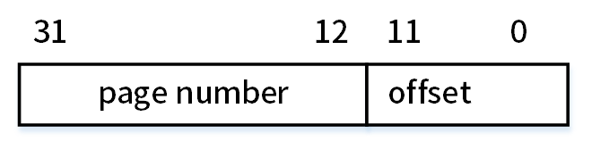

# 2025上半年选择题

- 来源标题: 2025年上半年软件设计师考试基础知识真题（专业解析+参考答案）
- 试卷介绍页: https://wangxiao.xisaiwang.com/tiku2/136/tp30414669.html?cid=136
- 练习页: https://wangxiao.xisaiwang.com/tiku2/exam534903262.html
- 题量: 30

## 第1题（单选题）

【考生回忆版】利用栈对算术表达式a*（b+c）-e求值，设栈初始时为空，则暂存操作数（或运算结果）的栈中最多需存放（）个操作数（或运算结果）。

- A. 3
- B. 1
- C. 2
- D. 4

## 第2题（单选题）

【考生回忆版】在二维平面最近点对问题中，分治法的步骤不包括以下（）。

- A. 计算所有点对的欧氏距离
- B. 递归求解左右两半中点集的最近点对问题
- C. 按x坐标排序并将点集划分为左右两半
- D. 合并时仅需检查距离中线8范围内的点

## 第3题（单选题）

【考生回忆版】已知字符集为{a,b,c,d,e,f,g,h}，若各字符的哈夫曼编码如下表所，则对编码序列010101100011001001001111的译码结果为（）。  

- A. daceabdg
- B. dabccabg
- C. dfhbabfg
- D. dfaecbfg

## 第4题（单选题）

【考生回忆版】在以阶段划分的编译器中，语义分析阶段的任务包括（）。
①识别记号 ②识别句子结构 ③检查程序中的语法错误
④填写符号表 ⑤生成中间代码

- A. ②③
- B. ③④
- C. ①②
- D. ④⑤

## 第5题（单选题）

【考生回忆版】浮点数加减运算时，（）可能导致阶码上溢。

- A. 右规
- B. 对阶
- C. 尾数运算
- D. 左规

## 第6题（单选题）

【考生回忆版】（）用于在网络中向一组特定的设备发送数据包。

- A. 网络地址
- B. 广播地址
- C. 组播地址
- D. 单播地址

## 第7题（单选题）

【考生回忆版】某软件系统在测试过程中，（）最适合发现模块之间的接口问题。

- A. 单元测试
- B. 系统测试
- C. 验收测试
- D. 集成测试

## 第8题（单选题）

【考生回忆版】用户A通过SMTP/MINE协议在邮件客户端（如Outlook）中撰写邮件正文，并添加一个Excel附件（财务数据）发送给用户B，该邮件采用的是（）。

- A. 正文加密，附件明文传输
- B. 正文、附件均加密传输
- C. 正文明文，附件加密传输
- D. 正文、附件明文传输

## 第9题（单选题）

【考生回忆版】对某有序表进行折半查找时，参与比较的关键字顺序不可能是（）。

- A. 43，65，99，85，78
- B. 99，85，78，65，43
- C. 43，99，85，65，78
- D. 99，85，65，78，43

## 第10题（单选题）

【考生回忆版】用数据流图对某医院挂号系统如下需求进行建模：
（1）患者通过终端提交挂号请求；
（2）系统验证患者信息；
（3）系统生成挂号单，并存储到挂号记录。
以下（）不是数据流。

- A. 挂号请求
- B. 患者信息
- C. 挂号记录
- D. 挂号单

## 第11题（单选题）

【考生回忆版】设链队列Q用含头结点的循环单链表表示，且仅设尾指针rear，假设队列中有n个元素结点，则入队列和出队列运算的时间复杂度分别为（）。

- A. O(1)、O(1)
- B. O(1)、O(n)
- C. O(n)、O(1)
- D. O(n)、O(n)

## 第12题（单选题）

【考生回忆版】编译器将频繁使用的临时变量（如循环计数器）优化到（）中，可以提升访问速度。

- A. 栈
- B. 堆
- C. 静态存储区
- D. 寄存器

## 第13题（单选题）

【考生回忆版】QoS是网络的一种安全机制，确保重要业务量不会延迟或丢弃。通常情况下QoS被部署在（）上保证网络的高效运行。

- A. 网闸
- B. 防火墙
- C. 路由器
- D. IDS

## 第14题（单选题）

【考生回忆版】下列各项中，具有法定时间性的知识产权是（）。
①商业秘密权 ②专利权 ③商标权 ④著作权

- A. 仅①③
- B. 仅②④
- C. ①②③④
- D. 仅②③④

## 第15题（单选题）

【考生回忆版】在一个气象监测系统中，天气变化会影响多种显示设备（如PC应用和手机应用）。这些设备需要及时更新。这一需求适合采用（）设计模式进行设计。

- A. 观察者（Observer）
- B. 备忘录（Memento）
- C. 策略（Strategy）
- D. 状态（State）

## 第16题（单选题）

【考生回忆版】在分页管理系统中，逻辑地址由页面编号和偏移值构成。如下所示的逻辑地址表示，（）。  

- A. 页面大小为2K，每个页面最大为8M
- B. 页面大小为4K，每个页面最大为1M
- C. 页面大小为8K，每个页面最大为2M
- D. 页面大小为1K，每个页面最大为16M

## 第17题（单选题）

【考生回忆版】关于开源软件的著作权，以下说法正确的是（）。

- A. 开源软件不涉及著作权问题
- B. 开源软件的著作权归使用者所有
- C. 开源软件的著作权归开发者所有，使用者不能进行任何修改
- D. 开源软件的著作权归开发者所有，但使用者可以自由使用、修改和分发

## 第18题（单选题）

【考生回忆版】以下关于数据流图分层结构的叙述中，不正确的是（）。

- A. 各层数据流图之间应该保持“平衡”关系
- B. 顶层数据流图只包含一个处理框，表示待开发的系统
- C. 数据流图的层次越多，细节程度越低
- D. 分层的数据流图可以清晰的表达系统的层次结构，使得系统更易于理解

## 第19题（单选题）

【考生回忆版】（）攻击的技术实现路径主要是通过合法开发流程渗透，利用代码混淆、数字证书伪装绕过审查。

- A. 零日漏洞
- B. 撞库攻击
- C. 供应链投毒
- D. AI赋能攻击

## 第20题（单选题）

【考生回忆版】在关系数据库中，第三范式的主要目的是消除（ ）类型的问题。

- A. 多值依赖
- B. 传递依赖
- C. 外键冗余
- D. 主键冗余

## 第21题（单选题）

某模块的各个部分，前一部分处理的输出是后一部分处理的输入，则该模块的内聚类型为（ ）。

- A. 顺序内聚
- B. 功能内聚
- C. 通信内聚
- D. 巧合内聚

## 第22题（单选题）

某电商平台“将订单处理、支付网关集成、物流跟踪等功能拆分为独 立服务。每个服务通过API通信”，这是采用了（ ）。

- A. 分层架构
- B. 事件驱动架构
- C. 面向对象架构
- D. 微服务架构

## 第23题（单选题）

下列事件中，会触发软件中断的是（ ）。

- A. 电源故障
- B. 按键输入
- C. 除零错误
- D. 定时器溢出

## 第24题（单选题）

某递归算法的时间复杂度计算公式为T（n）=4T （n/2）+nlgn，其中n为问题规模，则该算法的时间复杂度是（ ）。

- A. ⊙（nlgn）
- B. ⊙（n3）
- C. ⊙（n2）
- D. ⊙（n2lgn）

## 第25题（单选题）

某银行开发核心交易系统，需严格遵循监管审计且需求变更极少，最适合的开发模型是（ ）。

- A. 敏捷开发（Scrum）
- B. 快速应用开发（RAD）
- C. 增量模型
- D. 瀑布模型

## 第26题（单选题）

在软件项目团队中，成员的技能水平和协作能力差异较大，导致项目进度受阻。为提高团队整体效率，项目经理应优先考虑（ ）。

- A. 重新分配团队成员任务
- B. 引入外部专家指导
- C. 增加项目奖励机制
- D. 开展内部技能分享与培训

## 第27题（单选题）

以下问题中，肯定可以用贪心算法求得最优解的是（ ）。

- A. 旅行商问题（TSP）
- B. 最大公共子序列（LCS）
- C. 部分（分数）背包问题
- D. 0-1背包问题

## 第28题（单选题）

ISO/IEC 25010：2023标准中，（ ）不属于可维护性的子特性。

- A. 可修改性（Modifiability）
- B. 可分析性（Analysability）
- C. 模块化（Modularity）
- D. 容错性（Fault Tolerance）

## 第29题（单选题）

采用面向对象设计方法开发电商平台，设计负责处理用户订单的类OrderService，它不仅处理订单创建，还负责记录订单日志和发送确认邮件。OrderService类违反了面向对象设计（ ）原则。

- A. 里氏替换
- B. 单一职责
- C. 接口隔离
- D. 开放-封闭

## 第30题（单选题）

【考生回忆版】对n阶上三角矩阵A按行压缩存储，将元素Aij（0≤i,j＜n且i≤j）存储在B[k] （k≥1） 中，则k的值为（）。

- A. -i2/2+(n+1/2)i+j-n
- B. -i2/2+(n+1/2)i+j-1
- C. -i2/2+(n-1/2)i+j
- D. -i2/2+(n-1/2)i+j+1
