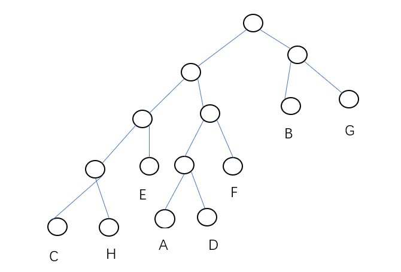

# 2025上半年选择题

- 来源标题: 2025年上半年软件设计师考试基础知识真题（专业解析+参考答案）
- 试卷介绍页: https://wangxiao.xisaiwang.com/tiku2/136/tp30414669.html?cid=136
- 练习页: https://wangxiao.xisaiwang.com/tiku2/exam534904150.html
- 题量: 30

## 第1题（单选题）

【考生回忆版】利用栈对算术表达式a*（b+c）-e求值，设栈初始时为空，则暂存操作数（或运算结果）的栈中最多需存放（A）个操作数（或运算结果）。

- A. 3
- B. 1
- C. 2
- D. 4

### 正确答案

A

### 解析

执行过程：
1. 压入a,b,c（栈中有3个操作数）；
2. 计算b+c后，压入结果（栈剩a+结果）；
3. 计算a*(结果)后，压入最终值；
4. 压入e并计算减法。
最大栈深度为3。

## 第2题（单选题）

【考生回忆版】在二维平面最近点对问题中，分治法的步骤不包括以下（A）。

- A. 计算所有点对的欧氏距离
- B. 递归求解左右两半中点集的最近点对问题
- C. 按x坐标排序并将点集划分为左右两半
- D. 合并时仅需检查距离中线8范围内的点

### 正确答案

A

### 解析

分治法的核心步骤为：排序并划分点集（C）、递归求解子问题（B）、合并时检查中线附近有限范围内的点（D）。而选项A“计算所有点对的欧氏距离”是暴力解法的步骤，不属于分治法

## 第3题（单选题）

【考生回忆版】已知字符集为{a,b,c,d,e,f,g,h}，若各字符的哈夫曼编码如下表所，则对编码序列010101100011001001001111的译码结果为（C）。  

- A. daceabdg
- B. dabccabg
- C. dfhbabfg
- D. dfaecbfg

### 正确答案

C

### 解析

哈夫曼树如图所示：

## 第4题（单选题）

【考生回忆版】在以阶段划分的编译器中，语义分析阶段的任务包括（D）。
①识别记号 ②识别句子结构 ③检查程序中的语法错误
④填写符号表 ⑤生成中间代码

- A. ②③
- B. ③④
- C. ①②
- D. ④⑤

### 正确答案

D

### 解析

本题答案选D。
语义分析阶段任务：语义分析主要负责检查源程序的语义正确性，包括类型检查、符号表管理等。
选项④：填写符号表是语义分析阶段的重要任务，用于记录程序中各种标识符的信息。
选项⑤：生成中间代码也是语义分析阶段的任务，将源程序转换为中间表示形式，便于后续的代码生成和优化。
选项①：识别记号是词法分析阶段的任务。
选项②：识别句子结构是语法分析阶段的任务。
选项③：检查程序中的语法错误是语法分析阶段的主要任务。

## 第5题（单选题）

【考生回忆版】浮点数加减运算时，（C）可能导致阶码上溢。

- A. 右规
- B. 对阶
- C. 尾数运算
- D. 左规

### 正确答案

C

### 解析

选项C：在浮点数加减运算中，尾数运算可能会产生进位，如果进位导致阶码超出了所能表示的最大范围，就会出现阶码上溢。
选项A：右规是尾数右移，阶码加1，一般不会导致阶码上溢。
选项B：对阶是小阶向大阶看齐，阶码不会超出范围。
选项D：左规是尾数左移，阶码减1，不会导致阶码上溢。

## 第6题（单选题）

【考生回忆版】（C）用于在网络中向一组特定的设备发送数据包。

- A. 网络地址
- B. 广播地址
- C. 组播地址
- D. 单播地址

### 正确答案

C

### 解析

选项C：组播地址用于在网络中向一组特定的设备发送数据包，只有加入了相应组播组的设备才能接收到组播数据包。
选项A：网络地址是标识网络的地址，不是用于向特定设备组发送数据包的。
选项B：广播地址用于向网络中的所有设备发送数据包，而不是特定的一组设备。
选项D：单播地址用于在网络中向单个设备发送数据包。

## 第7题（单选题）

【考生回忆版】某软件系统在测试过程中，（D）最适合发现模块之间的接口问题。

- A. 单元测试
- B. 系统测试
- C. 验收测试
- D. 集成测试

### 正确答案

D

### 解析

选项D：集成测试是将多个模块组合在一起进行测试，主要目的是发现模块之间的接口问题，如数据传递错误、模块间调用关系异常等。
选项A：单元测试主要针对单个模块进行测试，侧重于模块内部的功能和逻辑。
选项B：系统测试是对整个系统进行测试，验证系统是否满足需求规格说明书的要求，更关注系统的整体功能和性能。
选项C：验收测试是由用户或客户进行的测试，用于确认系统是否满足业务需求。

## 第8题（单选题）

【考生回忆版】用户A通过SMTP/MINE协议在邮件客户端（如Outlook）中撰写邮件正文，并添加一个Excel附件（财务数据）发送给用户B，该邮件采用的是（D）。

- A. 正文加密，附件明文传输
- B. 正文、附件均加密传输
- C. 正文明文，附件加密传输
- D. 正文、附件明文传输

### 正确答案

D

### 解析

本题答案选D。 SMTP（简单邮件传输协议）和MIME（多用途互联网邮件扩展）协议本身并不对邮件正文和附件进行加密。当用户A通过这些协议在邮件客户端中撰写邮件正文并添加附件发送给用户B时，邮件正文和附件通常是以明文形式传输的，除非使用了额外的加密措施。

## 第9题（单选题）

【考生回忆版】对某有序表进行折半查找时，参与比较的关键字顺序不可能是（D）。

- A. 43，65，99，85，78
- B. 99，85，78，65，43
- C. 43，99，85，65，78
- D. 99，85，65，78，43

### 正确答案

D

### 解析

本题答案选D。 折半查找每次将查找区间缩小一半，参与比较的关键字应该是逐渐逼近目标关键字的。在有序表中进行折半查找，每次比较的关键字应该是当前查找区间的中间元素。如果有序表是升序排列，每次比较的关键字应该是先中间元素，然后根据比较结果缩小查找区间，再取新的中间元素比较。 
选项D中，65之后是78，再之后应该是比65大的数，不可能是43，不符合折半查找的比较顺序。

## 第10题（单选题）

【考生回忆版】用数据流图对某医院挂号系统如下需求进行建模：
（1）患者通过终端提交挂号请求；
（2）系统验证患者信息；
（3）系统生成挂号单，并存储到挂号记录。
以下（C）不是数据流。

- A. 挂号请求
- B. 患者信息
- C. 挂号记录
- D. 挂号单

### 正确答案

C

### 解析

数据流：是指数据在系统中流动的路径，它代表了数据的传递和处理过程。
选项A：挂号请求是患者通过终端提交给系统的数据，是数据流。
选项B：患者信息在系统验证过程中流动，属于数据流。
选项C：挂号记录是系统存储挂号单的地方，是数据存储，不是数据流。
选项D：挂号单是系统生成并在系统内流动的数据，是数据流。

## 第11题（单选题）

【考生回忆版】设链队列Q用含头结点的循环单链表表示，且仅设尾指针rear，假设队列中有n个元素结点，则入队列和出队列运算的时间复杂度分别为（A）。

- A. O(1)、O(1)
- B. O(1)、O(n)
- C. O(n)、O(1)
- D. O(n)、O(n)

### 正确答案

A

### 解析

入队列操作：因为链队列Q用含头结点的循环单链表表示且仅设尾指针rear，入队列时只需在尾指针rear之后插入新结点，然后更新尾指针，操作时间复杂度为O(1)。
出队列操作：可以通过尾指针rear找到头结点的下一个结点（即队头结点），删除该结点并更新头结点的指针，时间复杂度也为O(1)。

## 第12题（单选题）

【考生回忆版】编译器将频繁使用的临时变量（如循环计数器）优化到（D）中，可以提升访问速度。

- A. 栈
- B. 堆
- C. 静态存储区
- D. 寄存器

### 正确答案

D

### 解析

选项D：寄存器是CPU内部的高速存储单元，编译器将频繁使用的临时变量（如循环计数器）优化到寄存器中，CPU可以直接快速访问这些变量，从而提升访问速度。
选项A：栈主要用于存储函数调用的局部变量、参数等，访问速度相对寄存器较慢。
选项B：堆用于动态分配内存，其访问速度也不如寄存器。
选项C：静态存储区用于存储全局变量和静态变量，访问速度也没有寄存器快。

## 第13题（单选题）

【考生回忆版】QoS是网络的一种安全机制，确保重要业务量不会延迟或丢弃。通常情况下QoS被部署在（C）上保证网络的高效运行。

- A. 网闸
- B. 防火墙
- C. 路由器
- D. IDS

### 正确答案

C

### 解析

选项C：QoS（Quality of Service）即服务质量，路由器可以根据网络流量情况和业务优先级，对数据包进行分类、调度和队列管理等操作，从而保证重要业务量不会延迟或丢弃，所以通常将QoS部署在路由器上。
选项A：网闸主要用于实现不同安全级别网络之间的安全隔离和数据交换，不主要用于QoS部署。
选项B：防火墙主要用于控制网络访问，防止非法入侵，和QoS的主要功能不同。
选项D：IDS（入侵检测系统）主要用于检测网络中的入侵行为，与QoS的作用不同。

## 第14题（单选题）

【考生回忆版】下列各项中，具有法定时间性的知识产权是（D）。
①商业秘密权 ②专利权 ③商标权 ④著作权

- A. 仅①③
- B. 仅②④
- C. ①②③④
- D. 仅②③④

### 正确答案

D

### 解析

本题答案选D。
专利权：专利权有明确的保护期限，如发明专利权的期限为二十年，实用新型专利权的期限为十年，外观设计专利权的期限为十五年，自申请日起计算。
商标权：商标权的有效期为十年，自核准注册之日起计算，期满可以续展。
著作权：著作权的保护期有一定的时间限制，如公民的作品，其发表权、使用权和获得报酬权的保护期为作者终生及其死亡后五十年。
商业秘密权：商业秘密权没有法定的时间限制，只要商业秘密符合秘密性、价值性和保密性等条件，其权利就受法律保护。

## 第15题（单选题）

【考生回忆版】在一个气象监测系统中，天气变化会影响多种显示设备（如PC应用和手机应用）。这些设备需要及时更新。这一需求适合采用（A）设计模式进行设计。

- A. 观察者（Observer）
- B. 备忘录（Memento）
- C. 策略（Strategy）
- D. 状态（State）

### 正确答案

A

### 解析

选项A：观察者模式定义了一种一对多的依赖关系，让多个观察者对象同时监听一个主题对象。在气象监测系统中，天气变化这个主题对象发生改变时，PC应用和手机应用等观察者对象可以及时收到通知并更新显示，符合本题需求。
选项B：备忘录模式主要用于保存一个对象的某个状态，以便在适当的时候恢复对象，与本题及时更新显示设备的需求无关。
选项C：策略模式定义了一系列的算法，并将每个算法封装起来，使它们可以相互替换，和本题场景不相关。
选项D：状态模式允许一个对象在其内部状态改变时改变它的行为，本题重点是主题对象通知观察者更新，并非对象状态改变导致行为改变。

## 第16题（单选题）

【考生回忆版】在分页管理系统中，逻辑地址由页面编号和偏移值构成。如下所示的逻辑地址表示，（B）。  

- A. 页面大小为2K，每个页面最大为8M
- B. 页面大小为4K，每个页面最大为1M
- C. 页面大小为8K，每个页面最大为2M
- D. 页面大小为1K，每个页面最大为16M

### 正确答案

B

### 解析

1. 页内偏移量的位数决定页面大小：
偏移量占0~11位，共12位，对应的页面大小为 2^12=4KB=4KB
2. 页号的位数决定页面总数：
页号占12~31位，共20位，因此最大页数为 2^20=1M

## 第17题（单选题）

【考生回忆版】关于开源软件的著作权，以下说法正确的是（D）。

- A. 开源软件不涉及著作权问题
- B. 开源软件的著作权归使用者所有
- C. 开源软件的著作权归开发者所有，使用者不能进行任何修改
- D. 开源软件的著作权归开发者所有，但使用者可以自由使用、修改和分发

### 正确答案

D

### 解析

开源软件是指其源代码可以被公众使用、修改和分发的软件。虽然开源软件的著作权归开发者所有，但是遵循开源许可协议，使用者可以自由使用、修改和分发该软件。
A选项：开源软件同样涉及著作权问题，只是其著作权管理遵循特定的开源许可协议。
B选项：开源软件的著作权归开发者所有，而非使用者。
C选项：使用者在遵循开源许可协议的前提下，可以对开源软件进行修改。所以本题选D。

## 第18题（单选题）

【考生回忆版】以下关于数据流图分层结构的叙述中，不正确的是（C）。

- A. 各层数据流图之间应该保持“平衡”关系
- B. 顶层数据流图只包含一个处理框，表示待开发的系统
- C. 数据流图的层次越多，细节程度越低
- D. 分层的数据流图可以清晰的表达系统的层次结构，使得系统更易于理解

### 正确答案

C

### 解析

A选项：各层数据流图之间应该保持“平衡”关系，即子图的输入输出数据流必须和父图中相应处理的输入输出数据流一致，该说法正确。
B选项：顶层数据流图只包含一个处理框，表示待开发的系统，它抽象地描述了系统的功能，该说法正确。
C选项：数据流图的层次越多，细节程度越高，而不是越低。随着分层细化，会逐步展现更多的处理过程和数据流动细节。所以C选项说法错误。
D选项：分层的数据流图可以清晰的表达系统的层次结构，使得系统更易于理解，通过将复杂系统分解为多个层次的子图，便于不同人员对系统进行分析和设计，该说法正确。

## 第19题（单选题）

【考生回忆版】（C）攻击的技术实现路径主要是通过合法开发流程渗透，利用代码混淆、数字证书伪装绕过审查。

- A. 零日漏洞
- B. 撞库攻击
- C. 供应链投毒
- D. AI赋能攻击

### 正确答案

C

### 解析

A选项：零日漏洞是指被发现后立即被恶意利用的安全漏洞，主要是利用系统未修复的漏洞进行攻击，并非通过合法开发流程渗透等方式。
B选项：撞库攻击是黑客通过收集互联网已泄露的用户和密码信息，生成对应的字典表，尝试批量登录其他网站，与题干中描述的技术实现路径不符。
C选项：供应链投毒攻击的技术实现路径主要是通过合法开发流程渗透，利用代码混淆、数字证书伪装绕过审查，将恶意代码注入到软件供应链中。所以C选项正确。
D选项：AI赋能攻击是利用人工智能技术来增强攻击的效果和效率，和题干中的技术实现方式不同。

## 第20题（单选题）

【考生回忆版】在关系数据库中，第三范式的主要目的是消除（B）类型的问题。

- A. 多值依赖
- B. 传递依赖
- C. 外键冗余
- D. 主键冗余

### 正确答案

B

### 解析

在关系数据库中，第一范式（1NF）要求数据库表的每一列都是不可分割的基本数据项；第二范式（2NF）在满足1NF的基础上，消除了非主属性对主键的部分依赖；第三范式（3NF）是在满足2NF的基础上，消除非主属性对主键的传递依赖。多值依赖是第四范式（4NF）要处理的问题；外键冗余和主键冗余并非第三范式主要解决的问题。所以本题选B。

## 第21题（单选题）

某模块的各个部分，前一部分处理的输出是后一部分处理的输入，则该模块的内聚类型为（A）。

- A. 顺序内聚
- B. 功能内聚
- C. 通信内聚
- D. 巧合内聚

### 正确答案

A

### 解析

顺序内聚：一个模块中各个处理元素和同一个功能密切相关，而且这些处理必须顺序执行，通常前一个处理元素的输出是后一个处理元素的输入。
功能内聚：模块内所有元素的各个组成部分全部都为完成同一个功能而存在，共同完成一个单一的功能，模块已不可再分。
通信内聚：指模块内所有处理元素都在同一个数据结构上操作或所有处理功能都通过公用数据而发生关联
巧合内聚：一个模块内的各处理元素之间没有任何联系，只是偶然地被凑到一起。
综上，本题答案选 A。

## 第22题（单选题）

某电商平台“将订单处理、支付网关集成、物流跟踪等功能拆分为独 立服务。每个服务通过API通信”，这是采用了（D）。

- A. 分层架构
- B. 事件驱动架构
- C. 面向对象架构
- D. 微服务架构

### 正确答案

D

### 解析

微服务架构（D）：将系统拆分为独 立部署的服务（订单处理、支付网关），通过 API 通信，符合高内聚低耦合原则。
对比其他架构：
分层架构（A）：按功能层划分（如展示层、业务层），不强调服务独 立性。
面向对象（C）：以类和对象为核心，与分布式服务无关。
事件驱动（B）：通过事件队列通信，非本题描述的 API 直接调用场景。

## 第23题（单选题）

下列事件中，会触发软件中断的是（C）。

- A. 电源故障
- B. 按键输入
- C. 除零错误
- D. 定时器溢出

### 正确答案

C

### 解析

中断分类：
软件中断（C）：由程序错误（如除零、非法指令）触发，CPU主动抛出异常。
硬件中断（B/D）：按键输入（B）、定时器溢出（D）属于外部设备触发。
电源故障（A）：系统级硬件故障，非程序逻辑引起。

## 第24题（单选题）

某递归算法的时间复杂度计算公式为T（n）=4T （n/2）+nlgn，其中n为问题规模，则该算法的时间复杂度是（C）。

- A. ⊙（nlgn）
- B. ⊙（n3）
- C. ⊙（n2）
- D. ⊙（n2lgn）

### 正确答案

C

### 解析

递归式 T(n) = 4T(n/2) + nlgn 的时间复杂度可通过 主定理 分析：
1. 主定理形式：对形如 T(n) = aT(n/b) + f(n) 的递归式，主定理通过比较 f(n) 与 n^(log_b a) 的阶来确定时间复杂度。
2. 参数分析：
a = 4，b = 2 → log_b a = log₂4 = 2，因此 n^(log_b a) = n²。
f(n) = nlgn，需与 n² 比较阶。
3.
 主定理情况判断：若 f(n) = O(n^{log_b a - ε})（存在 ε > 0），则 T(n) = Θ(n^{log_b
a})。这里 nlgn 的阶低于 n²（因为 lgn 的增长速度远慢于 n），且存在 ε = 0.5 使得 nlgn = O(n^{2 -
0.5}) = O(n^{1.5})。因此满足 情况1，时间复杂度为 Θ(n²)。

## 第25题（单选题）

某银行开发核心交易系统，需严格遵循监管审计且需求变更极少，最适合的开发模型是（D）。

- A. 敏捷开发（Scrum）
- B. 快速应用开发（RAD）
- C. 增量模型
- D. 瀑布模型

### 正确答案

D

### 解析

瀑布模型（D）：需求明确且变更少时，阶段性交付文档（如需求规格书、设计文档）便于监管审计，符合银行系统的高合规性要求。
敏捷模型（A）：适用于需求频繁变更的场景，与严格监管的文档固化需求矛盾。
RAD（B）与增量模型（C）：侧重快速迭代，难以满足核心系统的高稳定性要求。

## 第26题（单选题）

在软件项目团队中，成员的技能水平和协作能力差异较大，导致项目进度受阻。为提高团队整体效率，项目经理应优先考虑（D）。

- A. 重新分配团队成员任务
- B. 引入外部专家指导
- C. 增加项目奖励机制
- D. 开展内部技能分享与培训

### 正确答案

D

### 解析

技能差异的根本解决：成员技能差异直接影响代码质量和协作效率，内部培训（D）直接提升团队基线能力，长期效果最优。
其他选项对比：
任务重分配（A）：仅临时调整分工，未解决能力瓶颈。
外部专家（B）：短期指导难以转化为团队持续能力。
奖励机制（C）：未针对性提升技能，对复杂任务效果有限。

## 第27题（单选题）

以下问题中，肯定可以用贪心算法求得最优解的是（C）。

- A. 旅行商问题（TSP）
- B. 最大公共子序列（LCS）
- C. 部分（分数）背包问题
- D. 0-1背包问题

### 正确答案

C

### 解析

贪心算法适用场景需满足贪心选择性质与最优子结构：
部分（分数）背包问题（C）：允许分割物品，贪心策略按单位价值排序选取，能保证全局最优。
旅行商问题（A）：贪心选择最短边可能陷入局部最优，无法保证全局最短路径。
0-1背包问题（D）：不可分割物品，贪心策略可能错过更高总价值的组合。
最大公共子序列（B）：需动态规划递推求解，贪心无法处理重叠子问题

## 第28题（单选题）

ISO/IEC 25010：2023标准中，（D）不属于可维护性的子特性。

- A. 可修改性（Modifiability）
- B. 可分析性（Analysability）
- C. 模块化（Modularity）
- D. 容错性（Fault Tolerance）

### 正确答案

D

### 解析

可维护性子特性包括可修改性、可分析性、模块化等，容错性属于可靠性范畴

## 第29题（单选题）

采用面向对象设计方法开发电商平台，设计负责处理用户订单的类OrderService，它不仅处理订单创建，还负责记录订单日志和发送确认邮件。OrderService类违反了面向对象设计（B）原则。

- A. 里氏替换
- B. 单一职责
- C. 接口隔离
- D. 开放-封闭

### 正确答案

B

### 解析

OrderService同时负责订单创建、日志记录和邮件发送，承担了多个职责，违反单一职责原则

## 第30题（单选题）

【考生回忆版】对n阶上三角矩阵A按行压缩存储，将元素Aij（0≤i,j＜n且i≤j）存储在B[k] （k≥1） 中，则k的值为（D）。

- A. -i2/2+(n+1/2)i+j-n
- B. -i2/2+(n+1/2)i+j-1
- C. -i2/2+(n-1/2)i+j
- D. -i2/2+(n-1/2)i+j+1

### 正确答案

D

### 解析

代入法直接验证。
元素A[0][0],A[0][1]应是分别对应B[1],B[2]。
依次代入验证即可。
