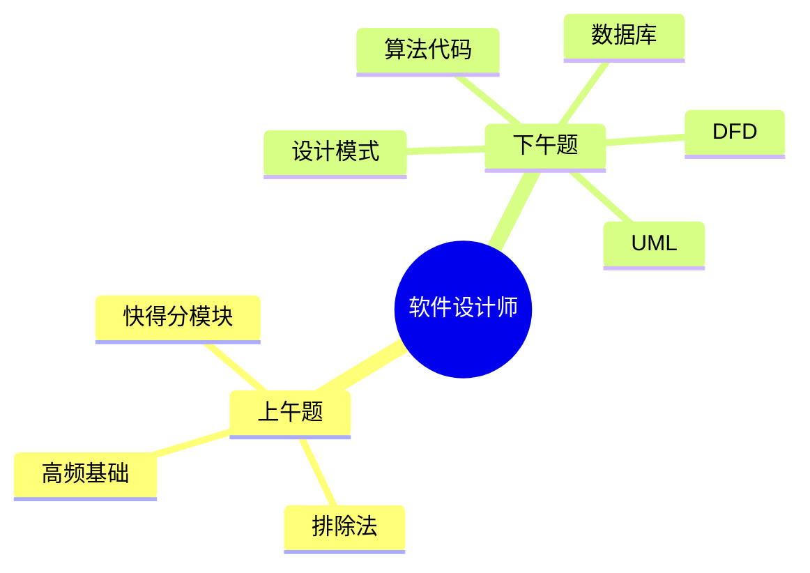

# 第 01 课：考试全景与得分路线

## 课案信息

- 适用对象：软件设计师 2026 年 5 月备考
- 建议时长：75-90 分钟
- 课程定位：开篇总览课
- 本课目标：让你知道“考什么、怎么过、分从哪来、接下来怎么学”

## 资料依据

### 主依据

- `2018软件设计师教程_第5版_-_9787302491224.pdf`
- `doc/Software-Designer-master/真题/`

### 当前考试安排参考

- 湖南省工业和信息化厅《2026年计算机技术与软件专业技术资格（水平）考试安排》：上半年考试窗口为 2026-05-23 至 2026-05-26，软件设计师在列，具体考试日期以准考证为准  
  链接：https://gxt.hunan.gov.cn/gxt/rkb/jsjbkxz/202502/t20250213_33927860.html
- 深圳市考试院《2026年上半年计算机技术与软件专业技术资格（水平）考试》：考试日程显示 2026-05-23 至 2026-05-26  
  链接：https://hrss.sz.gov.cn/szksy/ztzl/zyjsks/zyjskslb/rsjrj/jsjkszt/content/post_12632599.html
- 湖南省工业和信息化厅 2025 年组考新闻：提到“计算机化考试系统培训会议”，说明按机考方式准备更稳妥  
  链接：https://gxt.hunan.gov.cn/gxt/xxgk_71033/gzdt/gzdt_3/202504/t20250430_33659896.html
- 湖南省工业和信息化厅 2025 年下半年合格名单通知：再次引用“各科目合格标准为试卷满分的 60%”  
  链接：https://gxt.hunan.gov.cn/gxt/rkb/jsjzsbl/202601/t20260129_33905564.html

## 学习目标

1. 说清楚软件设计师考试的基本结构、过线规则和当前时间节点。
2. 知道上午题和下午题分别从哪里拿分，避免“平均用力，平均翻车”。
3. 建立从 3 月到 5 月的复习主线，不再把备考当成拆盲盒。
4. 明白接下来 16 节课为什么这么排，以及每一阶段在解决什么问题。

## 前置知识

- 无硬性前置要求。
- 只要你知道“我想过考试，但现在脑子里像开了 37 个标签页”，这节课就适合你。

## 开场热身

如果把软件设计师考试比作打副本，它不是“所有怪都一样硬”的那种地图，而是：

- 有些题是固定刷新的经验怪，熟了就稳定拿分。
- 有些题看起来很高冷，其实是纸老虎。
- 真正危险的是“我都懂一点，所以我先随便看看”。

一句话总结本课：

> 我们今天不是学具体知识点，而是先把“打分系统”和“通关路线图”装到脑子里。

## 一、考试全景：先知道自己在打什么仗

### 1.1 考试身份

- 软件设计师属于软考中级资格。
- 它考的不是“你会不会背教材”，而是“你能不能在有限时间内用工程化思路答出稳定分”。

### 1.2 2026 上半年时间窗口

- 依据湖南省工业和信息化厅与深圳市考试院的 2026 年上半年安排，考试窗口为 `2026-05-23` 到 `2026-05-26`。
- 软件设计师在开考列表中。
- 个人具体考试日期、场次和时间，仍以准考证为准。

### 1.3 过线规则

- 软件设计师通常分为两个科目：
  - 基础知识
  - 应用技术
- 每科满分 `75` 分。
- 合格标准按试卷满分的 `60%` 执行，也就是每科通常要达到 `45` 分。

### 1.4 机考准备心态

- 近年的地方考试组织信息已明确出现“计算机化考试系统培训”表述。
- 对我们备考来说，最稳的策略不是赌形式，而是直接按机考思路准备：
  - 看题更快
  - 输入更稳
  - 切题不慌
  - 草稿使用更有意识

## 二、分从哪来：别平均用力，要优先打高性价比目标

### 2.1 上午题：快准稳，像薅羊毛，但不能闭眼薅

上午题的特点：

- 单题分值低，但总量大
- 覆盖广
- 既有送分题，也有伪装成送分题的坑

重点不是“每个知识点都学成专家”，而是：

- 高频点熟练
- 低频点识别
- 选项陷阱能躲

### 2.2 下午题：固定题型，是我们的大本营

根据项目现有 README 和历年真题分布，下午题的核心高频题型比较稳定，主要围绕：

1. DFD / 结构化分析设计
2. 数据库设计
3. UML / 面向对象分析设计
4. 数据结构与算法 / C 语言代码题
5. 设计模式（Java 路线）

这意味着什么？

- 下午题不是玄学抽签。
- 你不是每年都要重新认识世界。
- 只要把固定题型做出模板，分数会比上午题更稳。

### 2.3 我们的双线螺旋策略

图的意思很简单：

- 我们不是先把全书啃成百科全书。
- 我们是先建“稳定得分骨架”，再逐步把薄弱环节补上。

## 三、真题告诉你：下午题真不是随机开盲盒

### 3.1 真题样例 1：2019 下半年下午试题一

文件：`doc/Software-Designer-master/真题/2019下.pdf`

从试卷首页就能看到，这道题围绕“二手车物流系统”展开，属于典型的 `DFD / 结构化分析` 题型，问题集中在：

- 外部实体识别
- 数据存储命名
- 缺失数据流补全

这类题的核心不是文学赏析，而是“图元素补全 + 业务语义匹配”。

### 3.2 真题样例 2：2020 下半年下午试题一

文件：`doc/Software-Designer-master/真题/2020下.pdf`

题干围绕“智能检测系统”展开，同样是 `DFD` 题，依旧要求你：

- 识别外部实体
- 识别数据存储
- 补缺失的数据流

你看，题材从二手车换成智能检测，壳子变了，骨架没怎么变。

### 3.3 本课结论

下午题最大的好消息是：

> 它喜欢换皮，不太喜欢换脑子。

这也是为什么我们课程安排里，`L04 / L06 / L08 / L09 / L10` 都是直冲固定题型。

## 四、怎么拿高分：不是做苦力，是做有顺序的苦力

### 4.1 高分路线不是“先把书看完”

常见误区：

- 误区 1：先把整本教材通读三遍再做题
- 误区 2：哪里不会补哪里，最后补成毛线球
- 误区 3：今天学数据库，明天学网络，后天突然爱上软件工程

更稳的路线是：

1. 先知道考什么
2. 先拿固定分
3. 再补广度
4. 最后整卷模拟

### 4.2 从现在到 5 月的复习节奏

#### 3 月中旬到 4 月上旬

- 建立考试地图
- 拿下 DFD、数据库、UML 这三类下午固定题
- 同步补上午的快得分模块

#### 4 月中旬到 5 月上旬

- 继续攻设计模式和算法代码题
- 上午高频模块做系统刷题
- 开始阶段测和章节复盘

#### 5 月考前两周

- 做整卷模拟
- 回看错题
- 只补高收益漏洞，不临时建大楼

## 五、16 节课为什么这么排

### 阶段 A：L01-L04

- 先立地图
- 再把 DFD 这类固定大题拿下来

### 阶段 B：L05-L08

- 把数据库和 UML 两根高分柱子立住

### 阶段 C：L09-L12

- 把下午剩余固定题型补齐
- 同时把上午高频基础压实

### 阶段 D：L13-L16

- 做综合刷题和整卷冲刺

一句人话版翻译：

> 先把大梁架起来，再糊墙；别一上来就研究门把手的艺术价值。

## 六、Mermaid 图怎么用

本课程默认使用 Mermaid。

### 6.1 直接预览

- VS Code：可用 Markdown 预览，若需要更稳的 Mermaid 体验，可安装 `Markdown Preview Mermaid Support`
- IntelliJ IDEA：启用 Markdown 预览并安装 Mermaid 相关插件

### 6.2 兜底方案

- 如果本地 Markdown 预览不出图，把 Mermaid 代码块粘贴到 https://mermaid.live/ 即可查看和导出

### 6.3 示例代码

## 七、随堂练习

### 练习 1

为什么我们不采用“先完整通读教材，再开始做真题”的路线？

### 练习 2

为什么说下午题比你想象中更适合建立稳定得分？

### 练习 3

如果考试窗口是 2026-05-23 到 2026-05-26，这对我们现在 3 月中旬的备考意味着什么？

### 练习 4

用你自己的话复述“双线螺旋”路线。

## 八、课后作业

1. 打开 `doc/Software-Designer-master/真题/2019下.pdf` 和 `doc/Software-Designer-master/真题/2020下.pdf`，只看下午试卷第一页，判断两道题为什么都属于 DFD 题。
2. 用一句话分别写出：
   - 上午题最怕什么
   - 下午题最值钱的优势是什么
3. 建一个你的错题本模板，至少留出四列：
   - 题目来源
   - 错因
   - 正确思路
   - 下次看到的识别信号
4. 如果你平时用 VS Code 或 IDEA，顺手确认一下 Mermaid 预览环境是否可用；如果不想折腾，记住 `https://mermaid.live/` 这个兜底入口。

## 九、易错点

1. 以为过线看总分，实际上要警惕单科不过线。
2. 以为下午题全靠临场灵感，实际上固定题型非常值得模板化训练。
3. 以为自己现在基础零散，所以应该先全补基础；实际上更稳的方式是先补高收益基础。
4. 以为真题只能最后刷；实际上真题应该从一开始就参与“识别题型”和“建立模板”。

## 十、复盘清单

学完本课后，你应该能回答下面 6 个问题：

1. 软件设计师考试的核心过线规则是什么？
2. 2026 年上半年考试窗口大概落在哪几天？
3. 为什么我们要按机考思路准备？
4. 下午题最值得优先攻的固定题型有哪些？
5. 为什么课程安排不是从教材第 1 章按顺序讲到第 14 章？
6. 我们的双线螺旋路线到底在解决什么问题？

## 下节课预告

下一课进入 `L02：上午快得分模块 I`。

目标很朴素：

- 先把那些“认真做不该丢”的分拿到手。
- 让你尽快体会到一件事：
  - 软件设计师备考不是拼命，而是先学会挑软柿子捏。
