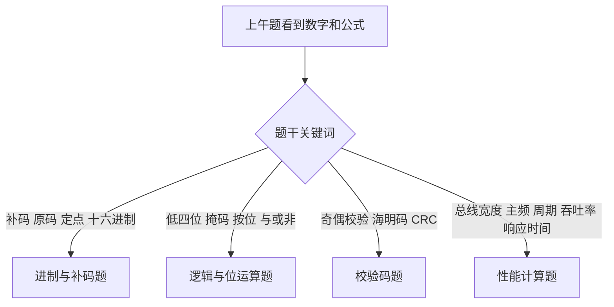
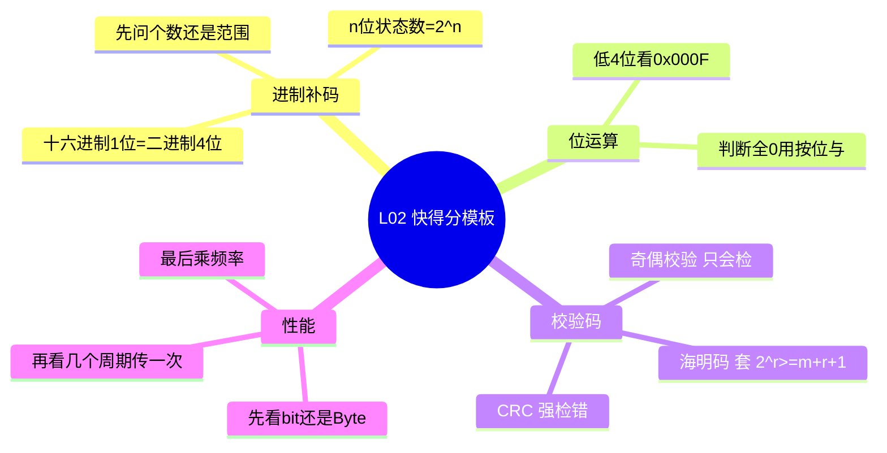

# 第 02 课：上午快得分模块 I

## 课案信息

- 适用对象：软件设计师 2026 年 5 月备考
- 建议时长：75-90 分钟
- 课程定位：上午题提速起步课
- 本课目标：先拿下那些“认真做不该丢”的基础分

## 资料依据

### 主依据

- `2018软件设计师教程_第5版_-_9787302491224.pdf`
- `doc/Software-Designer-master/真题/2015上.pdf`
- `doc/Software-Designer-master/真题/2017上.pdf`

### 题干文字校对参考

- 软题库 2015 上半年软件设计师上午卷文字版：https://www.ruantiku.com/examination/545537.html
- 软题库 2015 上半年上午第 2 题：https://www.ruantiku.com/shiti/2540529573.html
- CSDN《2017上半年软件设计师上午真题与解析》：https://blog.csdn.net/chengsw1993/article/details/100730635
- CSDN《2015年上半年软件设计师考试上午真题及答案解析》：https://blog.csdn.net/qq_36411874/article/details/115742950

> 说明：本课的真题年份与题型以本地 `真题/` PDF 为主，在线文字版只用于辅助核对题干，避免因为本地 PDF 当前不便直接抽文本而误抄题意。

## 学习目标

1. 看到进制、补码、位运算题时，能在 30 秒内判断该用什么套路。
2. 搞清楚“原码 / 反码 / 补码 / 定点表示 / 掩码判断”之间的关系，不再一见二进制就心里发虚。
3. 掌握校验码最常见的 3 个考法：奇偶校验、海明码、CRC 的作用边界。
4. 掌握上午题最常见的性能计算套路：总线带宽、数据传输率、响应时间和吞吐率的区分。
5. 建立这类题的“识别信号”，减少计算量，优先用排除法和公式秒杀。

## 前置知识

- 知道 `1 Byte = 8 bit`
- 知道二进制和十六进制长什么样
- 不要求你现在就会复杂计算，这节课我们从“识别题型”开始

## 开场热身

上午题里有一类题很像自动售货机：

- 你投对硬币，它就稳定出分。
- 你投错的原因，往往不是不会，而是看漏单位、忘了补码、或者把按位与写成了按位或。

一句话总结本课：

> 这节课不是拼天赋，而是把固定套路装进手里。

## 一、题型地图：哪些题最值得先拿下

L02 先盯住 4 类高频快得分题：

1. 进制与补码
2. 逻辑与位运算
3. 校验码
4. 性能计算

## 二、进制与补码：先别慌，先认“题眼”

### 2.1 这类题常见题眼

- `n 位补码`
- `能表示多少个不同的数`
- `十六进制转二进制`
- `定点整数 / 定点小数`
- `带符号 / 无符号`

### 2.2 必会结论

1. `十六进制 1 位 = 二进制 4 位`
2. `n 位二进制` 一共能表示 `2^n` 种不同状态
3. 补码题先分清：题目问的是
   - 表示个数
   - 表示范围
   - 具体数值转换

### 2.3 真题例 1：2015 上半年上午第 2 题

题意压缩版：

- “用 `n` 位补码表示的定点小数，能表示的不同数值个数是多少？”

题眼：

- 不是问范围
- 不是问精度
- 是问“不同数值个数”

秒杀思路：

- `n` 位编码一共有 `2^n` 种状态
- 只要编码和数值是一一对应，就能表示 `2^n` 个不同值

结论：

- 选 `2^n`

### 2.4 这类题的易错点

- 一看到“带符号”就下意识写成 `2^(n-1)`
- 把“表示范围”和“表示个数”混成一件事
- 看见小数就慌，实际上很多题只是在换皮

## 三、逻辑与位运算：把掩码当筛子用

### 3.1 高频考法

- 某数“低 4 位全为 0”
- 某数“第 k 位是否为 1”
- 用位运算快速完成某种判断

### 3.2 必会套路

1. 判断某几位是不是全 0：`x & 掩码`
2. 只关心低 4 位：掩码就是 `0x000F`
3. 只关心低 8 位：掩码就是 `0x00FF`

### 3.3 真题例 2：2017 上半年上午第 2 题

题意压缩版：

- “若要判断整数 `a` 的低 4 位是否全为 0，应使用哪一个条件表达式？”

秒杀思路：

- 先把低 4 位筛出来：`a & 0x000F`
- 如果低 4 位全为 0，筛出来的结果就等于 0

结论：

- `((a & 0x000F) == 0)`

### 3.4 识别信号

只要题目出现这些词，你就优先想到掩码：

- `低 n 位`
- `高 n 位`
- `按位`
- `屏蔽`
- `保留某几位`

## 四、校验码：先分清“能发现”还是“能纠正”

### 4.1 三兄弟的功能边界

1. 奇偶校验：
   - 适合检错
   - 只能发现部分错误
   - 不能定位错误位，也不能纠错
2. 海明码：
   - 能检错
   - 常考“最少需要多少位校验位”
   - 经典场景下可纠正 1 位错
3. CRC：
   - 强在检错
   - 题目爱考“适合做什么”
   - 不要把它当成自动纠错码

### 4.2 海明码公式

若数据位为 `m`，校验位为 `r`，则至少满足：

`2^r >= m + r + 1`

### 4.3 真题例 3：2017 上半年上午第 5 题

题意压缩版：

- “若信息码字为 16 位，采用海明码，至少需要多少位校验位？”

计算：

- `r = 4` 时，`2^4 = 16`，但 `16 < 16 + 4 + 1 = 21`，不够
- `r = 5` 时，`2^5 = 32`，且 `32 >= 16 + 5 + 1 = 22`

结论：

- 最少需要 `5` 位校验位

### 4.4 本节先掌握到什么程度

- 奇偶校验：知道它“能干嘛，不能干嘛”
- 海明码：会直接套公式
- CRC：先记住“擅长检错，不负责纠错”

## 五、性能计算：别让单位偷你分

### 5.1 高频关键词

- 总线宽度
- 主频 / 时钟频率
- 每隔多少个时钟周期传送一次
- 吞吐率
- 响应时间

### 5.2 一眼先看什么

1. 单位是 `bit` 还是 `Byte`
2. 传一次数据要几个周期
3. 题目问的是“速率”还是“完成一次要多久”

### 5.3 真题例 4：2015 上半年上午第 5 题

题意压缩版：

- 总线宽度 `32 bit`
- 总线时钟频率 `200 MHz`
- 一个总线周期只能传送 `1` 个 `32 bit` 字
- 每 `5` 个时钟周期传送一次
- 问总线带宽约是多少 `MB/s`

秒杀步骤：

1. 每次传送数据量：`32 bit = 4 Byte`
2. 传送次数：`200 MHz / 5 = 40 M 次/秒`
3. 带宽：`4 Byte * 40 M = 160 MB/s`

结论：

- 总线带宽约为 `160 MB/s`

### 5.4 常见混淆

- `吞吐率`：单位时间完成多少任务 / 传多少数据
- `响应时间`：完成一次任务花多久
- `时延变小` 和 `吞吐率变大` 常相关，但不是同一个量

## 六、上午题秒杀模板

## 七、Mermaid 预览说明

### 7.1 本地预览

- VS Code：直接打开 Markdown 预览；若 Mermaid 显示不稳定，可安装 `Markdown Preview Mermaid Support`
- IntelliJ IDEA：启用 Markdown 预览，并安装 Mermaid 相关插件

### 7.2 兜底方案

- 如果本地预览不方便，把 Mermaid 代码块粘贴到 https://mermaid.live/ 查看即可

## 八、随堂练习

### 练习 1

为什么“`n` 位补码能表示多少个不同值”这类题，第一反应应该是 `2^n`，而不是 `2^(n-1)`？

### 练习 2

若要判断整数 `x` 的低 8 位是否全为 0，你会写出什么表达式？

### 练习 3

信息位为 `32` 位时，海明码至少需要多少位校验位？

### 练习 4

一条总线宽度为 `16 bit`，时钟频率为 `100 MHz`，每 `4` 个周期传一次数据，则理论带宽是多少 `MB/s`？

## 九、课后作业

1. 回看 `doc/Software-Designer-master/真题/2015上.pdf`，把“补码个数题”和“总线带宽题”各找出来，写出你的题眼。
2. 回看 `doc/Software-Designer-master/真题/2017上.pdf`，把“低 4 位判断题”和“海明码题”各找出来，写出你的秒杀步骤。
3. 用一句话分别解释：
   - 奇偶校验为什么不能纠错
   - CRC 为什么不能当海明码用
4. 自己编 2 道小题：
   - 1 道位运算判断题
   - 1 道带宽计算题

## 十、常见错误

1. 把 `bit` 和 `Byte` 混着算，最后大错特错。
2. 把“表示个数”和“表示范围”混在一起。
3. 看见“低 4 位”却没想到掩码，反而去硬算二进制。
4. 记住了海明码名字，却忘了公式 `2^r >= m + r + 1`。
5. 把 CRC、奇偶校验、海明码当成一回事。

## 十一、复盘清单

学完本课后，你应该能回答：

1. 为什么 `n` 位补码常对应 `2^n` 个不同编码状态？
2. 为什么判断低 4 位常用 `0x000F`？
3. 海明码求校验位数时为什么要用 `2^r >= m + r + 1`？
4. CRC 和海明码最大的功能差别是什么？
5. 总线带宽题里，为什么一定要先看 `bit / Byte` 和“几周期传一次”？

## 下节课预告

下一课进入 `L03：数据结构与算法 I`。

目标会从“秒杀型快得分题”切到“上午题和下午代码题共用地基”：

- 线性表、栈、队列、树、图先建立整体地图
- 把复杂题拆回基础结构，不再见算法就头大
