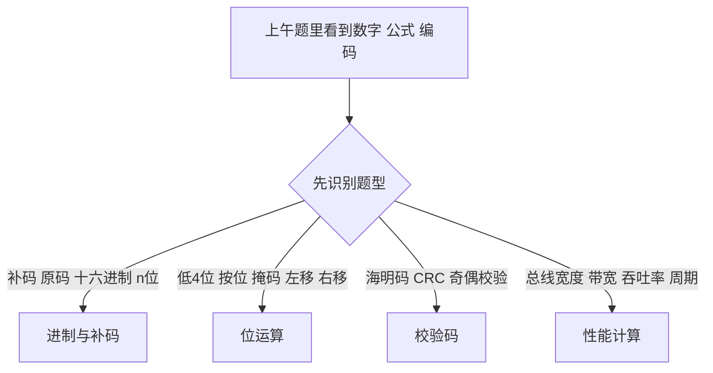
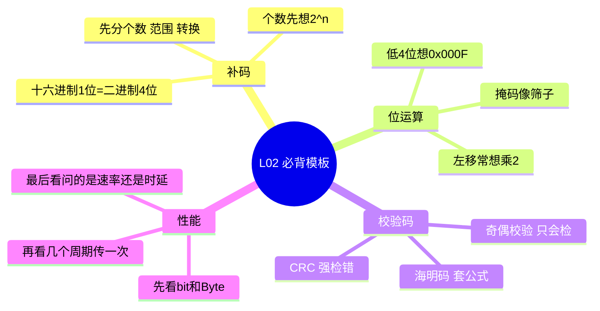

# 第 02 课：上午快得分模块 I（重写版）

## 课案信息

- 适用对象：软件设计师 2026 年 5 月备考
- 建议时长：90-110 分钟
- 使用前提：不要求你先看教材
- 课程定位：零基础快得分起步课
- 本课目标：把上午卷里“该稳拿但最容易粗心丢分”的题型，先做成可复用模板

## 本课承诺

这份课案按“你没看过教材”来写，不默认你已经会：

- 原码、反码、补码
- 掩码、位运算
- 海明码、CRC
- 总线带宽、吞吐率、响应时间

如果你现在这些概念还模糊，不是问题。这一课的任务不是把你变成底层专家，而是先让你：

> 看到题目能认门，认完门能套模板，套完模板能拿分。

## 资料依据

### 主依据

- `2018软件设计师教程_第5版_-_9787302491224.pdf`

### 已验证上午题样本窗口

1. `2014年上半年软件设计师考试上午真题（一）`  
   `https://www.educity.cn/rk/zhenti/prog/prog201405zonghe.pdf`
2. `2015年上半年软件设计师考试上午真题（一）`  
   `https://www.educity.cn/rk/1772037.html`
3. `2016年上半年软件设计师考试上午真题（一）`  
   `https://www.educity.cn/rk/1787673.html`
4. `2017年上半年软件设计师考试上午真题（一）`  
   `https://www.educity.cn/rk/1790278.html`

> 说明：`L02` 的样本频次与权重，基于上面这 4 份已验证上午题样本窗口，不表述为“全历年精确频次”。

## 高频考点总览

| 模块 | 已验证样本频次 | 频次系数 | 单题常见分值 | 模块优先级 |
| --- | --- | --- | --- | --- |
| 补码/编码个数/数值转换 | 3 / 4 | 3 | 1 | 高 |
| 位运算/掩码/移位 | 2 / 4 | 2 | 1 | 中高 |
| 校验码/海明码 | 2 / 4 | 2 | 1 | 中高 |
| 性能计算/总线带宽/流水线 | 2 / 4 | 2 | 1 | 中高 |

## 权重怎么算

- 单题分值：上午单选题通常按 `1 分` 记
- 频次系数：
  - `3`: 当前样本窗口中出现 `3` 次
  - `2`: 当前样本窗口中出现 `1-2` 次
- `权重 = 分值 × 频次系数`

例子：

- 一道“补码表示个数”题，若分值 `1`，频次系数 `3`，则权重 `3`
- 一道“海明码求校验位”题，若分值 `1`，频次系数 `2`，则权重 `2`

结论很直接：

> 权重越高，越应该先练熟，再谈扩展题。

## 一、为什么先学这四类

因为它们特别像考试里的“固定收费口”：

- 知道套路，就拿分
- 不知道套路，就在题干里兜圈子

很多人不是不会，而是：

- 单位看错
- 题目问“个数”却答成“范围”
- 明明该按位与，却写成了按位或
- 明明是检错码，却拿纠错思路去想

一句话总结本课：

> 本课先不追求花活，先把稳定得分的骨架钉死。

## 二、进制与补码：先把最容易绕晕的地方讲透

### 2.1 你现在必须先知道什么

#### 二进制和十六进制

- 二进制只有 `0` 和 `1`
- 十六进制每 1 位，对应二进制 4 位

所以：

- `A` 对应 `1010`
- `F` 对应 `1111`
- 一个十六进制数如果有 2 位，就可以直接看成 8 位二进制

#### 原码、反码、补码

这三个名字很多人一看就烦，但考试里你先抓最实用的：

1. 原码：最直观，符号位 + 数值位
2. 反码：正数不变，负数符号位不变，其余位取反
3. 补码：反码再加 `1`

但是请注意：

> 上午题很多时候并不要求你完整手算补码全过程，而是更常问“能表示多少个值”“某个编码对应什么数”“某个十六进制补码换算成什么”。

### 2.2 这类题最容易错在哪

1. 题目问“不同数值个数”，你却去算范围
2. 一看到“带符号”就下意识写 `2^(n-1)`
3. 看到十六进制转补码就慌，其实很多题只是先让你拆成二进制，再判断最高位

### 2.3 最先背住的 3 个结论

1. `n` 位编码状态总数是 `2^n`
2. 十六进制 `1` 位等于二进制 `4` 位
3. 补码题先问自己：
   - 它问的是“个数”？
   - “范围”？
   - 还是“具体数值转换”？

### 2.4 真题原型 1：补码表示不同数值个数

已验证样本：

- `2015 上半年上午真题`

题型骨架：

- “用 `n` 位补码表示的定点小数，能表示多少个不同数值？”

标准思路：

1. 看清题目问的是“个数”
2. `n` 位编码一共就 `2^n` 种状态
3. 若编码与数值一一对应，就能表示 `2^n` 个不同值

结论：

- 选 `2^n`

### 2.5 真题原型 2：补码数值转换

已验证样本：

- `2016 上半年上午真题`

这类题比“个数题”更进一步，会给你一个十六进制或二进制补码，让你判断它代表的十进制值。

稳做法：

1. 先把十六进制拆成二进制
2. 看最高位
3. 最高位为 `0`，通常是非负数
4. 最高位为 `1`，通常说明它是负数补码，再按补码规则还原

### 2.6 这类题的秒杀模板

- 题目问“个数”：先想 `2^n`
- 题目问“转换”：先拆二进制，再看最高位
- 题目问“范围”：才去考虑正负和边界

## 三、位运算：不是语法题，是“筛位题”

### 3.1 先把 4 个符号弄明白

1. `&` 按位与
   - 只有 `1 & 1 = 1`
   - 其余都为 `0`
2. `|` 按位或
   - 只要有一个 `1`，结果就是 `1`
3. `^` 按位异或
   - 相同为 `0`
   - 不同为 `1`
4. `~` 按位取反
   - `0` 变 `1`
   - `1` 变 `0`

### 3.2 什么叫“掩码”

你可以把掩码理解成“筛子”。

题目要你只看某几位，就拿一个掩码把别的位置都盖掉。

例如：

- 只看低 4 位：掩码是 `0x000F`
- 只看低 8 位：掩码是 `0x00FF`

### 3.3 真题原型 1：判断低 4 位是否全为 0

已验证样本：

- `2017 上半年上午真题`

题型骨架：

- “若要判断整数 `a` 的低 4 位是否全为 0，应使用哪个条件表达式？”

标准思路：

1. 先把低 4 位筛出来：`a & 0x000F`
2. 如果低 4 位全为 0，筛出来的结果就等于 `0`

结论：

- `((a & 0x000F) == 0)`

### 3.4 真题原型 2：移位与乘除关系

已验证样本：

- `2016 上半年上午真题`

这类题爱考：

- 左移一位相当于什么
- 右移一位相当于什么
- 哪个表达式能得到目标结果

先记住最常见口径：

- 左移 1 位：通常相当于乘 `2`
- 右移 1 位：通常相当于除 `2` 取整

### 3.5 这类题的秒杀模板

- 出现“低 n 位”：先想掩码
- 出现“按位”：先别拿十进制硬算
- 出现“左移/右移”：先想乘除 `2`

## 四、校验码：先搞清它们到底能干嘛，不能干嘛

### 4.1 奇偶校验、海明码、CRC，别混

#### 奇偶校验

- 主要用途：检错
- 局限：不能定位错误位，不能纠错

#### 海明码

- 主要用途：检错 + 经典场景下纠 1 位错
- 高频考法：给定信息位数，求至少需要多少校验位

#### CRC

- 主要用途：强检错
- 不要把它当成自动纠错码

### 4.2 海明码公式为什么最值得先背

如果信息位有 `m` 位，校验位有 `r` 位，则至少满足：

`2^r >= m + r + 1`

你先不用管它为什么推出来，第一轮先会用。

### 4.3 真题原型：求最少校验位数

已验证样本：

- `2014 上半年上午真题`
- `2017 上半年上午真题`

题型骨架：

- “若信息位为 16 位，采用海明码，至少需要多少位校验位？”

解法：

1. 试 `r = 4`
   - `2^4 = 16`
   - `m + r + 1 = 16 + 4 + 1 = 21`
   - `16 < 21`，不够
2. 试 `r = 5`
   - `2^5 = 32`
   - `m + r + 1 = 16 + 5 + 1 = 22`
   - `32 >= 22`，够

结论：

- 最少 `5` 位

### 4.4 这类题最容易错在哪

1. 忘公式
2. 会代数值，但不会逐步试
3. 把 CRC 和海明码混成一类

## 五、性能计算：不要被单位偷分

### 5.1 本节只先抓最常见的 3 种量

1. 数据量
2. 传输次数
3. 单位时间

### 5.2 真题里最危险的坑

1. `bit` 和 `Byte` 混算
2. “每几个周期传一次”漏看
3. 题目问“带宽”，你却按“完成一次花多久”去算

### 5.3 真题原型 1：总线带宽

已验证样本：

- `2015 上半年上午真题`

题型骨架：

- 总线宽度 `32 bit`
- 时钟频率 `200 MHz`
- 每 `5` 个周期传送一次
- 问带宽是多少 `MB/s`

解法：

1. 每次数据量：`32 bit = 4 Byte`
2. 每秒传送次数：`200 MHz / 5 = 40 M 次`
3. 带宽：`4 × 40 = 160 MB/s`

结论：

- `160 MB/s`

### 5.4 真题原型 2：流水线性能

已验证样本：

- `2014 上半年上午真题`

这类题会让你比较：

- 流水线周期
- 吞吐率
- 总执行时间

你先不用一口气掌握所有模型，第一轮先记住：

> 性能题不是死算，是先把“每次处理多少、多久处理一次、总共处理几次”拆开。

### 5.5 性能题统一模板

1. 看单位：`bit` 还是 `Byte`
2. 看频率：每秒几次
3. 看周期：是不是每几个周期才传一次
4. 看题目到底问的是：
   - 带宽
   - 吞吐率
   - 响应时间

## 六、贴近真题的随堂练习

### 练习 1

`[分值 1 | 样本频次 3/4 | 频次系数 3 | 权重 3 | 掌握级别：必会]`

若某题问“`n` 位补码可表示多少个不同数值”，你第一反应为什么应是 `2^n`，而不是 `2^(n-1)`？

### 练习 2

`[分值 1 | 样本频次 2/4 | 频次系数 2 | 权重 2 | 掌握级别：必会]`

若要判断整数 `x` 的低 8 位是否全为 0，应写出什么表达式？请解释每一部分在做什么。

### 练习 3

`[分值 1 | 样本频次 2/4 | 频次系数 2 | 权重 2 | 掌握级别：必会]`

信息位为 `32` 位时，海明码至少需要多少位校验位？请写出试值过程。

### 练习 4

`[分值 1 | 样本频次 2/4 | 频次系数 2 | 权重 2 | 掌握级别：必会]`

总线宽度为 `16 bit`，时钟频率为 `100 MHz`，每 `4` 个周期传送一次数据，则理论带宽是多少 `MB/s`？

## 七、加深理解的课后练习

### 练习 5

`[分值 1 | 样本频次 3/4 | 频次系数 3 | 权重 3 | 掌握级别：必会]`

某 8 位补码写成十六进制是 `90H`。请先写成二进制，再判断它表示正数还是负数，并说明原因。

### 练习 6

`[分值 1 | 样本频次 2/4 | 频次系数 2 | 权重 2 | 掌握级别：必会]`

为什么判断“低 4 位全为 0”适合用按位与，而不适合先把整个数完整换成二进制再手工检查？

### 练习 7

`[分值 1 | 样本频次 2/4 | 频次系数 2 | 权重 2 | 掌握级别：中高]`

请分别用一句话解释：

1. 奇偶校验为什么不能纠错
2. CRC 为什么不能直接替代海明码

### 练习 8

`[分值 1 | 样本频次 2/4 | 频次系数 2 | 权重 2 | 掌握级别：中高]`

性能题里，“吞吐率”和“响应时间”为什么不能当成一回事？请给出你自己的区分口径。

## 八、严格批改标准

### 判定规则

1. 只写答案，不写理由：
   - 客观题可算“结论对”
   - 但问答题最多算半对
2. 理由方向对，但术语不准：
   - 算半对
3. 审题没扣准：
   - 例如“个数”答成“范围”
   - 直接判错
4. 计算题单位错：
   - 通常直接判错

### 本课最常见失分点

1. `2^n` 和 `2^(n-1)` 混
2. 掩码概念不清，只会生算
3. 海明码只记结论，不会试 `r`
4. 带宽题忘换 `Byte`

## 九、复盘清单

学完本课后，你应该能自己回答：

1. 为什么补码“表示个数题”优先想 `2^n`
2. 为什么低 4 位判断优先想到 `0x000F`
3. 海明码公式怎么用
4. CRC 和海明码最大的区别是什么
5. 为什么性能题一定先看单位和周期
