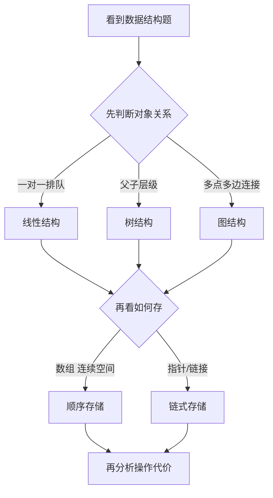
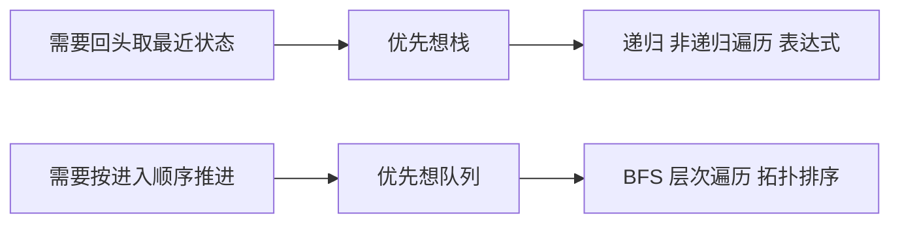
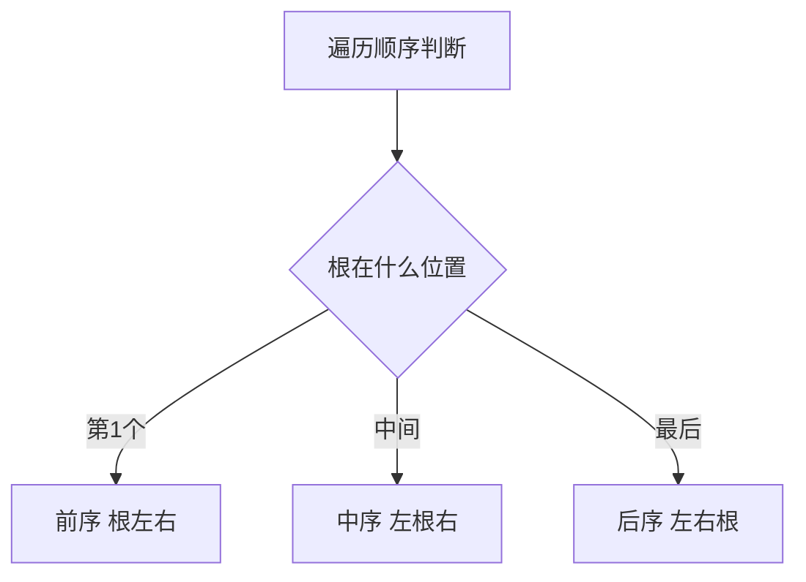
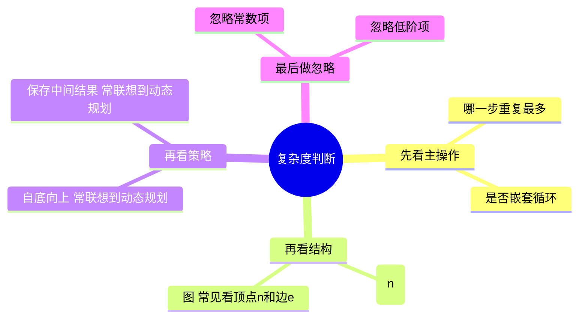

# 第 03 课：数据结构与算法 I

## 课案信息

- 适用对象：软件设计师 2026 年 5 月备考
- 建议时长：80-90 分钟
- 课程定位：上午基础模块与下午算法题的共同地基课
- 本课目标：把“结构怎么存、算法怎么跑、复杂度怎么看”先搭成一个稳定骨架

## 资料依据

### 主依据

- `2018软件设计师教程_第5版_-_9787302491224.pdf`
- `doc/Software-Designer-master/真题/2009上.pdf`
- `doc/Software-Designer-master/真题/2010上.pdf`
- `doc/Software-Designer-master/真题/2016上.pdf`

### 本课使用的真题锚点

1. `2009上.pdf`
   - 涉及“借助栈实现二叉树非递归中序遍历”的算法阅读题
2. `2010上.pdf`
   - 涉及“拓扑排序中使用队列与栈会导致序列不同”的图算法题
3. `2016上.pdf`
   - 涉及“动态规划策略与时间复杂度分析”的算法题

> 说明：教材作为知识框架主线，本课的例题锚点以仓库内本地真题 PDF 为准；在线资料不作为本课主要依据。

## 学习目标

1. 搞清楚数据结构课到底在考什么，不再把“链表、栈、树、图”看成一锅乱炖。
2. 能用一句人话说清：什么是逻辑结构，什么是存储结构，为什么它们会影响算法效率。
3. 看到算法题时，先判断它更像哪一类套路：遍历、递归、动态规划、图处理，而不是直接慌。
4. 初步掌握软件设计师考试里最常见的 5 个切入口：
   - 线性表
   - 栈与队列
   - 二叉树遍历
   - 图与拓扑排序
   - 时间复杂度
5. 为后续下午算法代码题和上午选择题建立统一语言。

## 前置知识

- 会看最基础的流程和循环
- 知道数组、下标、变量这些最基本概念
- 不要求你现在就会写复杂代码，本课重点是“识别结构 + 识别套路”

## 开场热身

很多人一看到“数据结构与算法”这六个字，脑子里就会自动响起警报：

- “坏了，要开始刷 LeetCode 了。”
- “坏了，要背一堆 C 代码了。”
- “坏了，这是不是要跟天才比智商了。”

先把心放回胸腔里。

软件设计师考试里的数据结构与算法，核心不是让你现场发明新算法，而是让你：

> 认出结构，读懂过程，判断效率，少犯低级错误。

一句话总结本课：

> 先学会看懂这台机器怎么转，再谈你要不要自己造机器。

## 一、先立总图：数据结构考的不是“背名词”，而是“结构影响算法”

### 1.1 两个最容易混的概念

1. 逻辑结构：
   - 说的是“元素之间是什么关系”
   - 例如线性关系、树形关系、网状关系
2. 存储结构：
   - 说的是“这些关系在计算机里怎么放”
   - 例如顺序存储、链式存储

### 1.2 为什么这件事重要

因为同一个逻辑结构，换一种存储方式，算法成本就可能变。

比如：

- 线性表可以顺序存，也可以链式存
- 图可以用邻接矩阵，也可以用邻接表
- 二叉树既可以递归遍历，也可以借助栈做非递归遍历

考试真正爱问的是：

- 这种结构适合做什么
- 换个实现后复杂度会怎样
- 代码里这一步为什么要用栈、队列或数组

## 二、线性表：别把“数组”和“链表”只当成语法题

### 2.1 线性表考什么

线性表本质上就是：

- 除了第一个和最后一个元素
- 大多数元素都只有一个前驱和一个后继

它最常见的两种实现：

1. 顺序表
   - 一段连续存储空间
   - 适合按下标快速访问
2. 链表
   - 元素位置可以不连续
   - 靠指针把逻辑次序串起来

### 2.2 秒判思路

看到题目时先问三件事：

1. 它是不是强调“随机访问”快
2. 它是不是强调“插入删除”频繁
3. 它是不是强调“空间连续”

常用判断：

- 要按下标直接取第 `i` 个元素，顺序表更自然
- 中间频繁插入删除，又不强调按下标直取，链表往往更合适

### 2.3 上午题常见坑

- 把“逻辑结构相同”误以为“性能一样”
- 只记住数组快，却忘了插入删除可能代价大
- 只记住链表插入方便，却忘了定位元素常常不快

## 三、栈与队列：一个是“后进先出”，一个是“先进先出”

### 3.1 为什么这两个结构这么爱考

因为它们不是独立知识点，它们经常被拿来做“算法辅助工具”：

- 栈经常帮递归“落地”
- 队列经常帮层次遍历、广度优先搜索、拓扑排序

### 3.2 栈的题眼

- 后进先出
- 递归调用现场
- 表达式求值
- 非递归遍历

### 3.3 队列的题眼

- 先进先出
- 层次推进
- 宽度优先
- 拓扑排序中保存当前入度为 0 的顶点

### 3.4 一句人话记忆法

- 栈像一摞盘子，最后放上去的先拿
- 队列像食堂排队，先来先办

## 四、二叉树：先把遍历顺序和辅助结构想明白

### 4.1 二叉树最常考的是什么

不是让你现场画出一整片森林。

最常考的是：

1. 前序 / 中序 / 后序遍历
2. 递归与非递归实现
3. 结点访问顺序
4. 栈在遍历中的作用

### 4.2 三种深度优先遍历

1. 前序：根 -> 左 -> 右
2. 中序：左 -> 根 -> 右
3. 后序：左 -> 右 -> 根

很多人不是不会，是顺序一紧张就串台。

一个稳的办法是：

- 先看“根”放在第几位
- 根在前就是前序
- 根在中就是中序
- 根在后就是后序

### 4.3 真题例 1：2009 上半年算法阅读题

本地真题 `doc/Software-Designer-master/真题/2009上.pdf` 中，出现了一个很有代表性的题眼：

- “借助栈实现二叉树的非递归中序遍历”

这类题要抓住的不是代码枝节，而是过程骨架：

1. 一直沿左孩子向下走
2. 走过的结点先压栈保存现场
3. 走到头后弹栈，访问根
4. 再转向右子树

所以你看到“非递归 + 中序遍历 + 二叉树”时，第一反应不是硬背代码，而是：

> 这题八成要靠栈保存回退路径。

### 4.4 本节先掌握到什么程度

- 能区分三种遍历顺序
- 知道为什么非递归遍历常借助栈
- 知道栈保存的是“还没处理完的路径信息”

## 五、图与拓扑排序：这是下午题很爱出的结构化算法入口

### 5.1 图题常见关键词

- 顶点、边、弧
- 入度、出度
- 邻接矩阵、邻接表
- 拓扑排序
- 最短路径

### 5.2 先记住一个高频事实

只要题目出现：

- “有向无环图”
- “前置关系”
- “依赖顺序”

你就要优先想到：

> 这很可能是拓扑排序。

### 5.3 真题例 2：2010 上半年图算法题

本地真题 `doc/Software-Designer-master/真题/2010上.pdf` 给了一个非常有代表性的考法：

- 先让你对有向图执行拓扑排序
- 再追问：如果把保存入度为 0 顶点的“队列”改成“栈”，结果序列会怎样变化

这个题的核心结论非常适合考试：

1. 拓扑排序并不一定唯一
2. 当同时出现多个入度为 0 的顶点时
3. 你选它们的顺序不同，最后得到的合法拓扑序列也可能不同

所以：

- 用队列，通常更像“按出现顺序往前推”
- 用栈，通常更像“后出现的先处理”

题目的关键不是“谁对谁错”，而是你要知道：

> 只要依赖关系不被破坏，不同的合法拓扑序列都可能成立。

### 5.4 图结构为什么要顺带记存储方式

因为考试还会问复杂度。

同样是图：

- 邻接表更适合稀疏图
- 邻接矩阵更直接，但空间通常更大

而一旦切到复杂度题，存储方式就会影响遍历和算法成本。

## 六、时间复杂度：别把它当成数学折磨，先把“谁循环几层”看出来

### 6.1 考试到底想让你做什么

多数情况下不是让你写形式化证明，而是让你：

1. 看出主要操作重复了多少次
2. 忽略低阶项和常数项
3. 写成 `O(...)`

### 6.2 最常见的识别套路

1. 一重循环，常见是 `O(n)`
2. 两重嵌套循环，常见是 `O(n^2)`
3. 树或递归题，要先看每个结点访问次数
4. 图题要看顶点数 `n`、边数 `e`

### 6.3 真题例 3：2016 上半年算法题

本地真题 `doc/Software-Designer-master/真题/2016上.pdf` 给出了非常标准的考法：

- 题目先让你阅读 C 代码
- 再问算法采用了什么设计策略
- 最后问几个函数的时间复杂度

从真题解析信息可以抓到三个特别值得记的点：

1. 算法策略是动态规划
2. `maxNum` 含两重循环，因此复杂度是 `O(n^2)`
3. `constructSet` 含一重循环，因此复杂度是 `O(n)`

这类题的稳法不是先猜名词，而是先看：

- 有没有“自底向上”
- 有没有把子问题结果先存下来
- 有没有重复子结构

如果有，动态规划的概率就很高。

### 6.4 一张复杂度判断小地图

## 七、把五个点串起来：L03 的统一题感

你现在可以把本课内容合成一句更考试化的话：

- 线性表，解决“怎么排”
- 栈和队列，解决“怎么辅助过程”
- 树，解决“怎么层次化组织与遍历”
- 图，解决“怎么表达多对多依赖”
- 复杂度，解决“这个过程贵不贵”

考试并不是把这些拆成五门独立学科，而是经常混着问。

例如：

- 二叉树非递归遍历，树 + 栈
- 拓扑排序，图 + 队列/栈 + 复杂度
- 动态规划，算法策略 + 复杂度

## 八、Mermaid 预览说明

### 8.1 本地预览

- VS Code：直接打开 Markdown 预览；若 Mermaid 显示不稳，可安装 `Markdown Preview Mermaid Support`
- IntelliJ IDEA：启用 Markdown 预览，并安装 Mermaid 相关插件

### 8.2 兜底方案

- 如果本地预览不方便，把 Mermaid 代码块粘贴到 https://mermaid.live/ 查看即可

## 九、随堂练习

### 练习 1

为什么说“逻辑结构”和“存储结构”不是一回事？请用线性表举一个例子说明。

### 练习 2

如果题目要求“非递归实现二叉树中序遍历”，为什么应该优先想到栈，而不是队列？

### 练习 3

为什么拓扑排序题里，把“保存入度为 0 顶点”的结构从队列改成栈后，结果序列可能变化，但仍可能是正确答案？

### 练习 4

如果一个算法主体是两重循环，另一个辅助恢复答案的过程是一重循环，那么这两个过程的时间复杂度通常分别怎么判断？

## 十、课后作业

1. 回看 `doc/Software-Designer-master/真题/2009上.pdf`，用自己的话写出“非递归中序遍历为什么需要栈”。
2. 回看 `doc/Software-Designer-master/真题/2010上.pdf`，解释“为什么同一张 DAG 可以有多个合法拓扑序列”。
3. 回看 `doc/Software-Designer-master/真题/2016上.pdf`，总结“动态规划”在这道题里是如何体现出来的。
4. 自己补一张小抄，标题就叫《我一看到这些关键词就该想到什么》：
   - 非递归遍历
   - 入度为 0
   - 自底向上
   - 两重循环

## 十一、常见错误

1. 只背定义，不会把结构和算法过程连起来。
2. 看到树就只会背前中后序，忘了题目常把它和栈绑定考。
3. 看到拓扑排序，只记住“删入度为 0 顶点”，却不知道结果可能不唯一。
4. 复杂度分析时把所有语句都平均对待，没有抓住主操作。
5. 看到动态规划，只会喊名字，不会找“自底向上、保存子问题结果”的证据。

## 十二、复盘清单

学完本课后，你应该能回答：

1. 线性表的逻辑结构和顺序/链式存储之间是什么关系？
2. 为什么二叉树非递归中序遍历常要借助栈？
3. 为什么拓扑排序的结果可能不唯一？
4. 动态规划题最常见的识别信号是什么？
5. 为什么分析复杂度时，重点是抓主操作而不是数每一行代码？
