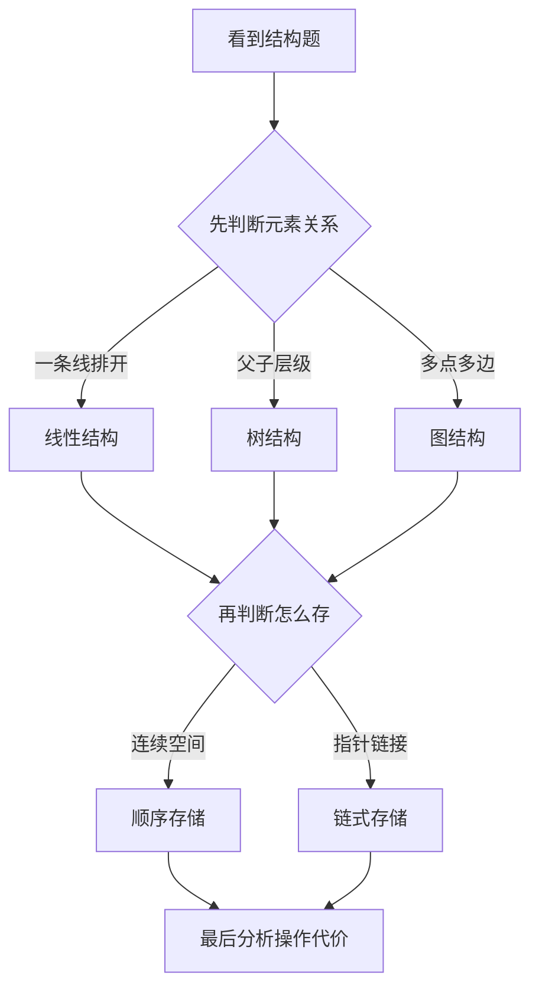
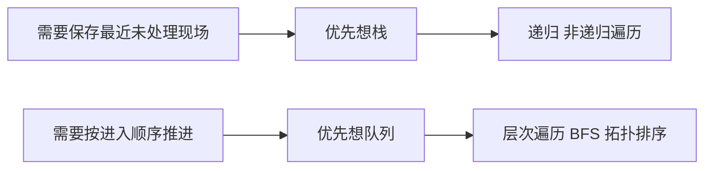
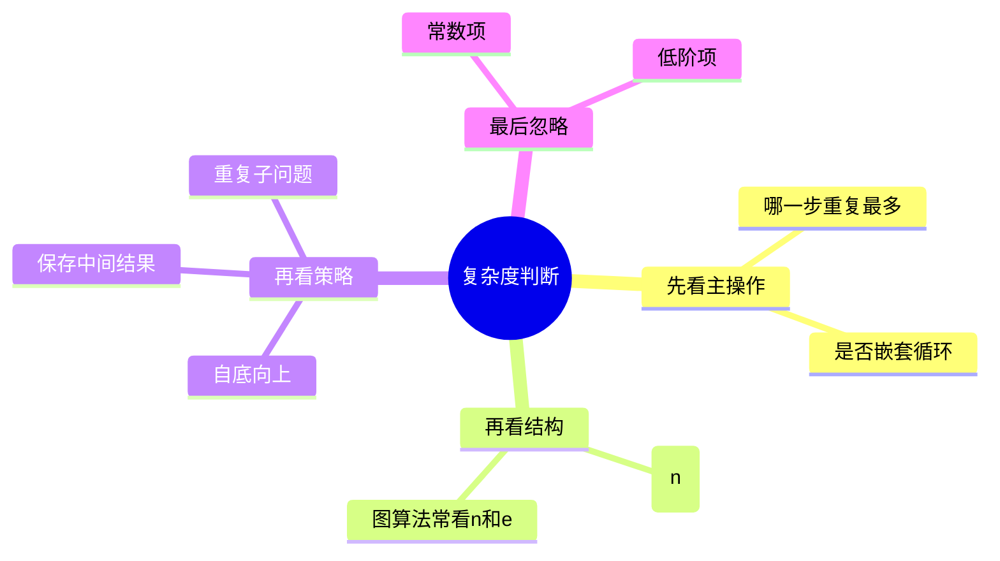

# 第 03 课：数据结构与算法 I（重写版）

## 课案信息

- 适用对象：软件设计师 2026 年 5 月备考
- 建议时长：95-120 分钟
- 使用前提：不要求你先看教材
- 课程定位：上午基础模块与下午算法题的共同地基课
- 本课目标：让你看懂“结构是什么、算法在做什么、复杂度为什么这么算”

## 资料依据

### 主依据

- `2018软件设计师教程_第5版_-_9787302491224.pdf`

### 本地真题锚点

- `doc/Software-Designer-master/真题/2009上.pdf`
- `doc/Software-Designer-master/真题/2010上.pdf`
- `doc/Software-Designer-master/真题/2016上.pdf`

### 当前本地可读样本频次结论

- `复杂度/动态规划`：高频，当前可读样本中多次出现
- `栈/队列`：高频
- `二叉树遍历`：中高频
- `图/拓扑排序`：中频
- `线性表`：当前可读样本里没有独立命中，但它是后续高频结构题的前置基础

## 高频考点总览

| 模块 | 当前样本频次 | 频次系数 | 单题常见分值 | 模块优先级 |
| --- | --- | --- | --- | --- |
| 复杂度 / 动态规划识别 | 6+ | 4 | 1-6 | 最高 |
| 栈 / 队列 | 4 | 3 | 1-5 | 高 |
| 二叉树遍历 | 3 | 3 | 1-5 | 高 |
| 图 / 拓扑排序 | 2 | 2 | 1-6 | 中高 |
| 线性表 | 0（基础前置） | 1 | 1 | 基础必懂 |

## 权重怎么算

- `权重 = 分值 × 频次系数`

例子：

- 一道 `1` 分的复杂度识别题，频次系数 `4`，权重 `4`
- 一道 `5` 分的拓扑排序阅读题，频次系数 `2`，权重 `10`

结论：

> 下午算法阅读题虽然题量少，但单题分值高，所以一旦叠加频次系数，权重会非常大。

## 一、你先别把“数据结构与算法”想成高等数学

这门内容在软件设计师考试里，最常见的并不是：

- 让你发明新算法
- 让你背完整教材
- 让你和竞赛选手比智商

更常见的是：

- 给你一个结构
- 给你一段代码或伪代码
- 问你：它在干什么、为什么这么做、复杂度是多少

所以这一课的核心不是“造轮子”，而是：

> 会看结构，会跟过程，会判断代价。

## 二、先立总框架：什么是逻辑结构，什么是存储结构

### 2.1 逻辑结构

逻辑结构说的是：

- 元素之间是什么关系

常见关系：

1. 线性关系
2. 树形关系
3. 网状关系

### 2.2 存储结构

存储结构说的是：

- 这些关系在计算机里怎么放

常见方式：

1. 顺序存储
2. 链式存储

### 2.3 为什么这两个一定要分开

因为同一个逻辑结构，换一种存法，算法代价就会变。

例如：

- 线性表可以顺序存，也可以链式存
- 图可以用邻接矩阵，也可以用邻接表
- 二叉树遍历可以递归做，也可以借助栈做非递归

## 三、线性表：它本身不难，但它是后面所有结构的起点

### 3.1 什么是线性表

线性表的特点是：

- 大多数元素只有一个前驱、一个后继

它最常见的两种实现：

1. 顺序表
2. 链表

### 3.2 顺序表和链表差别到底在哪

#### 顺序表

- 连续空间
- 按下标访问快
- 中间插入删除可能代价大

#### 链表

- 空间不要求连续
- 依靠指针串联
- 已定位位置后，插入删除更自然
- 但随机访问不如顺序表直观

### 3.3 为什么这一节要讲它

不是因为它在当前样本里最爱独立出题，而是因为：

- 后面的栈、队列、树、图，理解起来都要靠它垫底

所以它在本课里的角色是：

> 基础前置，不是主刷分模块，但必须懂。

## 四、栈与队列：两个最常见的“算法辅助工具”

### 4.1 栈

核心特征：

- 后进先出

典型用途：

- 保存递归现场
- 实现非递归遍历

### 4.2 队列

核心特征：

- 先进先出

典型用途：

- 层次推进
- 广度优先搜索
- 拓扑排序中保存当前入度为 0 的顶点

### 4.3 为什么它们高频

因为很多算法题表面在考“树”或“图”，本质却在考：

- 你知不知道该用栈还是队列做辅助

### 4.4 一句人话记忆法

- 栈像一摞盘子：最后放上去的先拿
- 队列像窗口排队：先来的先办

## 五、二叉树：考试最爱拿它考“遍历 + 辅助结构”

### 5.1 三种深度优先遍历

1. 前序：根 -> 左 -> 右
2. 中序：左 -> 根 -> 右
3. 后序：左 -> 右 -> 根

### 5.2 不要死背，先找“根”的位置

- 根在前：前序
- 根在中：中序
- 根在后：后序

### 5.3 真题锚点：2009 上半年

已验证本地真题锚点：

- `2009上.pdf`

代表性考法：

- 借助栈实现二叉树的非递归中序遍历

这题最关键的不是代码细节，而是过程理解：

1. 一直沿左孩子下探
2. 路上遇到的结点先压栈保存
3. 走到头后弹栈，访问当前根
4. 再转向右子树

所以你看到：

- 非递归
- 中序
- 二叉树

第一反应就该是：

> 这题大概率要靠栈保存“稍后还要回来处理”的祖先路径。

### 5.4 这类题为什么容易丢分

1. 只会背“左根右”，不会解释过程
2. 知道要用栈，但说不清栈里保存的是什么
3. 把队列也拉进来乱用

## 六、图与拓扑排序：它不是玄学，是依赖顺序题

### 6.1 什么时候优先想到图

看到这些词就要警觉：

- 顶点、边、弧
- 入度、出度
- 邻接表、邻接矩阵
- 前置依赖
- 有向无环图

### 6.2 什么是拓扑排序

你可以把它理解成：

- 给一组“有先后约束”的任务排顺序

规则是：

- 每个结点都必须排在它所有后继之前

### 6.3 真题锚点：2010 上半年

已验证本地真题锚点：

- `2010上.pdf`

代表性考法：

1. 给一个 DAG
2. 要你写出拓扑排序结果
3. 再追问：如果把保存入度为 0 顶点的结构从队列改成栈，结果会怎样

核心结论：

1. 拓扑排序不一定唯一
2. 若同时有多个入度为 0 的顶点
3. 你取它们的顺序不同，合法拓扑序列就可能不同

但只要：

- 每个顶点仍在其所有前驱之后输出

那结果就还是对的。

### 6.4 为什么这里常和队列/栈绑定

因为“当前入度为 0 的顶点集合”总得找个结构保存：

- 用队列，更像按出现顺序推进
- 用栈，更像后压入的先处理

## 七、复杂度与动态规划：这是本课权重最高的部分

### 7.1 为什么它权重最高

因为当前本地可读样本里，这一类内容出现频率最高，而且经常直接出现在下午阅读题里。

它一旦和下午算法题绑定，通常不是 `1` 分，而是 `4-6` 分量级。

### 7.2 什么是时间复杂度

它不是“程序跑了多少秒”，而是：

- 当数据规模变大时，算法的主要操作次数怎么增长

上午题和下午题里，最常见的其实只是让你：

1. 找主操作
2. 看循环几层
3. 忽略常数和低阶项

### 7.3 最常见判断法

1. 一重循环：常见 `O(n)`
2. 两重嵌套循环：常见 `O(n^2)`
3. 树遍历：若每个结点只访问一次，常见 `O(n)`
4. 图算法：常看顶点数 `n` 与边数 `e`

### 7.4 真题锚点：2016 上半年

已验证本地真题锚点：

- `2016上.pdf`

代表性考法：

1. 给你一段 C 代码
2. 让你判断算法设计策略
3. 再问若干函数的时间复杂度

这题特别值得记住的结论：

- 算法策略是动态规划
- `maxNum` 含两重循环，因此是 `O(n^2)`
- `constructSet` 含一重循环，因此是 `O(n)`

### 7.5 什么信号提示你要想到动态规划

1. 自底向上
2. 保存中间结果
3. 子问题重复出现
4. 当前结果依赖更小规模结果

## 八、把整课串起来

如果把本课压成 5 句人话：

1. 线性表告诉你：元素怎么排
2. 栈和队列告诉你：算法过程怎么辅助
3. 二叉树告诉你：层级结构怎么遍历
4. 图告诉你：依赖关系怎么表示
5. 复杂度告诉你：这个过程贵不贵

考试不会把它们完全拆开问，常见的是混着来：

- 二叉树 + 栈
- 图 + 队列/栈
- 动态规划 + 复杂度

## 九、贴近真题的随堂练习

### 练习 1

`[分值 1 | 样本频次 0 | 频次系数 1 | 权重 1 | 掌握级别：基础前置]`

请用自己的话说明：线性表的逻辑结构和顺序/链式存储为什么不是一回事？

### 练习 2

`[分值 1 | 样本频次 4 | 频次系数 3 | 权重 3 | 掌握级别：必会]`

如果题目要求“非递归实现二叉树中序遍历”，为什么应优先想到栈，而不是队列？

### 练习 3

`[分值 1 | 样本频次 2 | 频次系数 2 | 权重 2 | 掌握级别：必会]`

为什么拓扑排序中，把“保存入度为 0 顶点”的结构从队列改成栈后，结果序列可能变化，但仍可能合法？

### 练习 4

`[分值 1 | 样本频次 6+ | 频次系数 4 | 权重 4 | 掌握级别：必会]`

如果一个算法主体是两重循环，另一个恢复答案的过程是一重循环，那么这两个过程通常分别是什么复杂度？整个算法总复杂度又是什么？

## 十、加深理解的课后练习

### 练习 5

`[分值 5 | 样本频次 4 | 频次系数 3 | 权重 15 | 掌握级别：高]`

请不用代码，只用文字描述“非递归中序遍历”的完整过程，并说明栈中保存的是什么信息。

### 练习 6

`[分值 5 | 样本频次 2 | 频次系数 2 | 权重 10 | 掌握级别：中高]`

请画一个最小的 DAG 例子，证明拓扑排序结果可以不唯一。

### 练习 7

`[分值 5 | 样本频次 6+ | 频次系数 4 | 权重 20 | 掌握级别：最高]`

请用自己的话说明：为什么“自底向上 + 保存中间结果”常提示这是动态规划，而不是普通暴力枚举？

### 练习 8

`[分值 5 | 样本频次 6+ | 频次系数 4 | 权重 20 | 掌握级别：最高]`

若某算法有三部分：

1. 初始化一重循环
2. 主体两重嵌套循环
3. 回溯答案一重循环

请说明为什么总复杂度仍常写成 `O(n^2)`。

## 十一、严格批改标准

### 判定规则

1. 只写名词，不解释为什么：
   - 最多算半对
2. 方向对，但术语混乱：
   - 算半对
3. 审题没扣准：
   - 例如题目问“分别复杂度”，你只写“总复杂度”
   - 不算全对
4. 把栈和队列的职责说反：
   - 直接判错

### 本课最常见失分点

1. 把逻辑结构和存储结构混为一谈
2. 会背前中后序，不会解释非递归为什么要用栈
3. 知道拓扑排序，但不知道结果可能不唯一
4. 复杂度只会背 `O(n^2)`，不会说明为什么
5. 把动态规划和暴力枚举、递归搜索混成一类

## 十二、复盘清单

学完本课后，你应该能回答：

1. 为什么逻辑结构和存储结构必须分开理解
2. 为什么二叉树非递归中序遍历常借助栈
3. 为什么拓扑排序结果可能不唯一
4. 什么信号提示你想到动态规划
5. 为什么复杂度分析重点是抓主操作而不是数每一行代码
