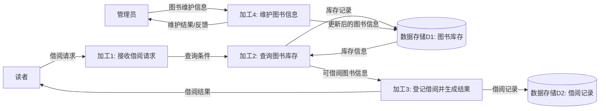
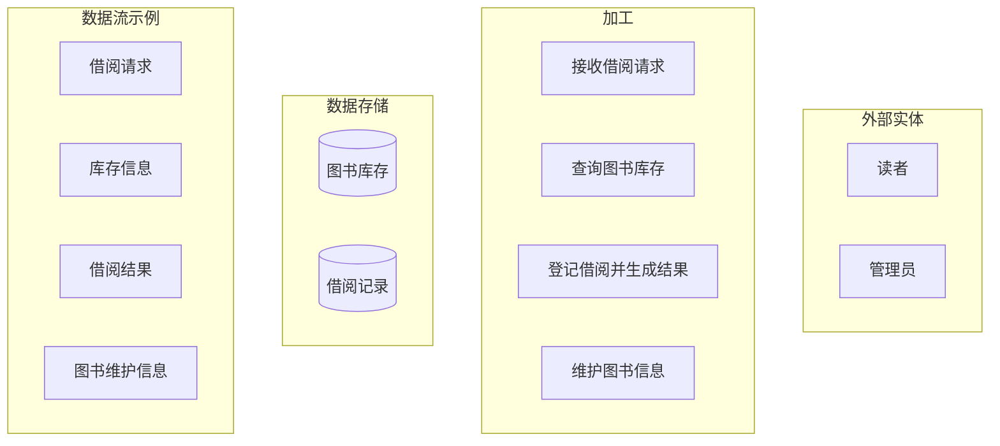
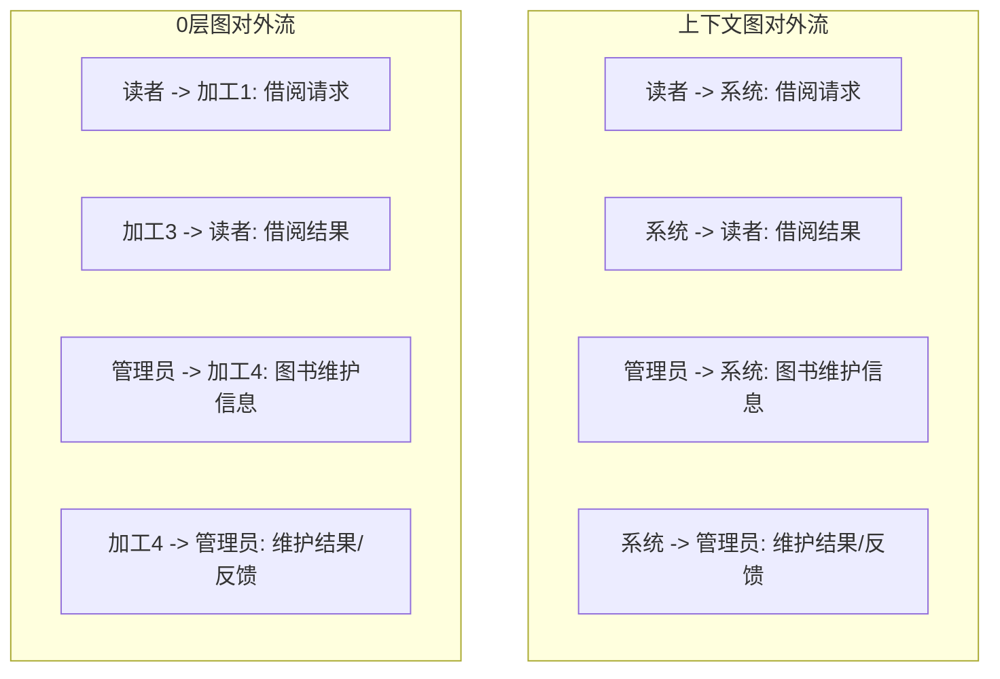
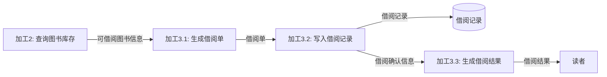

# 第 04 课：下午专题 I：DFD（重写版）

## 课案信息

- 适用对象：软件设计师 2026 年 5 月备考
- 建议时长：100-130 分钟
- 使用前提：已完成 `L01-L03`
- 课程定位：下午案例分析第一类固定大题模板课
- 本课目标：看到 DFD 题时，先能看懂图，再能照着图答题

## Mermaid 预览说明

- 本课默认图示语言为 `Mermaid`
- 本地可用支持 Mermaid 的 Markdown 预览插件查看
- 若本地预览不方便，可直接粘贴到 [Mermaid Live Editor](https://mermaid.live/) 查看

## 资料依据

### 主依据

- `2018软件设计师教程_第5版_-_9787302491224.pdf`

### 本地真题锚点

- `doc/Software-Designer-master/真题/2014上.pdf`
- `doc/Software-Designer-master/真题/2015上.pdf`
- `doc/Software-Designer-master/真题/2016上.pdf`
- `doc/Software-Designer-master/真题/2017上.pdf`
- `doc/Software-Designer-master/真题/2018上.pdf`
- `doc/Software-Designer-master/真题/2019上.pdf`
- `doc/Software-Designer-master/真题/2020下.pdf`

### 当前本地样本结论

- `DFD/数据流图`：极高频，近年本地样本几乎年年命中
- 最稳定主线：`上下文图 -> 0层图 -> 子加工分解 -> 平衡检查`
- 高频问法集中在：
  - 外部实体识别
  - 0层图补全
  - 加工分解
  - 平衡判断
  - 数据存储/数据流命名

## 学习目标

学完本课，你应该能做到：

1. 用一张图看懂系统边界
2. 区分 `外部实体 / 加工 / 数据流 / 数据存储`
3. 看懂 `上下文图` 和 `0层图` 的关系
4. 用“平衡”检查上下层图是否一致
5. 按下午题固定套路作答

## 前置知识

1. 知道“系统内”和“系统外”不是一回事
2. 能从题干里抽出角色、动作、输入、输出
3. 不要求你先读过教材

## 一、这节课不先背定义，先看一整套图

这轮我们不用抽象业务，直接用一个你熟悉的小场景贯穿全课：

> `图书借阅系统`

业务只有 5 句：

1. 读者提交借阅请求
2. 系统查询图书库存
3. 系统登记借阅记录
4. 系统向读者返回借阅结果
5. 管理员维护图书信息

你先记住一句话：

> DFD 不关心按钮长什么样，也不关心数据库 SQL 怎么写，它只关心数据在系统里怎么流。

## 二、先看第一张图：上下文图到底在干什么

### 2.1 图 1：图书借阅系统上下文图

### 2.2 先别急着记术语，先看这张图回答三个问题

1. 系统边界是谁？
   - 中间这个唯一总加工：`图书借阅系统`
2. 系统外面有谁？
   - `读者`
   - `管理员`
3. 系统和外面交换了什么数据？
   - `借阅请求`
   - `借阅结果`
   - `图书维护信息`
   - `维护结果/反馈`

### 2.3 这张图告诉你什么

这就是 `上下文图` 的本质：

- 先定系统边界
- 先找系统外部角色
- 先列系统和外部之间的输入输出

它**不负责**告诉你系统内部到底拆成了多少步。

所以你现在就可以用一句话记：

> 上下文图回答的是：`系统跟谁打交道，以及交换什么数据。`

## 三、第二张图：0层图为什么一展开就更复杂

### 3.1 图 2：图书借阅系统 0 层图

### 3.2 现在你应该立刻看到的变化

和上下文图相比，这张图多了三类东西：

1. 一个总加工变成了多个加工
2. 出现了数据存储
3. 数据在系统内部的流动被拆开了

### 3.3 0层图回答的是什么问题

0层图回答的是：

> 系统内部主流程是怎么拆开的。

这时候你再对比图 1 和图 2：

- 图 1 只告诉你“读者向系统提交借阅请求”
- 图 2 则继续告诉你：
  - 先接收请求
  - 再查库存
  - 再登记借阅
  - 最后返回结果

所以一句话区分就是：

- 上下文图：`系统和外部怎么交换数据`
- 0层图：`系统内部主流程怎么处理这些数据`

## 四、第三张图：四类元素到底怎么认

### 4.1 图 3：把图 2 拆成“身份识别图”

### 4.2 你不用死记定义，按这套辨认法就够了

#### 外部实体

看起来像：

- 系统外的人
- 系统外的部门
- 系统外的别的系统

在这个例子里：

- `读者`
- `管理员`

#### 加工

看起来像：

- 系统内部在做的动作

在这个例子里：

- `接收借阅请求`
- `查询图书库存`
- `登记借阅并生成结果`
- `维护图书信息`

#### 数据流

看起来像：

- 在元素之间流动的“数据内容”

在这个例子里：

- `借阅请求`
- `库存信息`
- `借阅结果`
- `图书维护信息`

#### 数据存储

看起来像：

- 系统内部长期保存的信息集合

在这个例子里：

- `图书库存`
- `借阅记录`

### 4.3 最常见误判

1. 把 `管理员` 写成加工
2. 把 `审核`、`维护` 这种动作写成数据流
3. 把 `库存信息` 这种数据内容写成加工

你可以用一句土话判断：

> 人、部门、外系统是“谁”；动词短语是“做什么”；名词性信息是“流什么”；长期保存的是“存什么”。

## 五、第四张图：为什么“平衡”是下午 DFD 题的核心

### 5.1 图 4：平衡检查图

### 5.2 这张图要你看什么

平衡不是说图画得好不好看，而是说：

> 上层图已经定义好的对外输入输出，下层图展开后仍然要保留其本质对应关系。

换成这道题就是：

- 上下文图里有 `借阅请求`
- 0层图里也必须找得到这条对外输入

- 上下文图里有 `借阅结果`
- 0层图里也必须找得到这条对外输出

### 5.3 什么叫不平衡

如果图 2 被你改成这样：

- 有 `读者 -> 系统: 借阅请求`
- 却没有任何地方输出 `借阅结果`

那就是不平衡。

如果你又凭空加了一条：

- `财务系统 -> 系统: 扣费结果`

但上下文图里根本没这个外部交互，那也不平衡。

### 5.4 你做题时怎么粗暴检查

先列两张清单：

1. 上层图所有对外输入
2. 上层图所有对外输出

然后去下层图逐条找对应项。

这一步非常值分，而且非常稳。

## 六、第五张图：子加工分解到底怎么拆，不是自由发挥

### 6.1 图 5：把“登记借阅并生成结果”继续分解

### 6.2 你要学会的是这个拆法逻辑

加工分解不是脑补新业务，而是把题干已有动作按顺序拆细。

原来一句话是：

- 登记借阅并生成结果

继续拆后可能变成：

1. 生成借阅单
2. 写入借阅记录
3. 生成借阅结果

这仍然是原动作的细化，不是凭空加需求。

## 七、把五张图连起来，你就得到 DFD 下午题的固定模板

做题顺序固定成下面四步：

1. 先画或先认 `上下文图`
   - 找系统边界
   - 找外部实体
   - 找对外输入输出
2. 再画或再认 `0层图`
   - 把总加工拆成主流程
   - 把长期保存的信息抽成数据存储
3. 若题目要求分解某加工
   - 只按题干已有业务动作继续细化
4. 最后做 `平衡检查`
   - 核对上下层图对外输入输出是否一致

这就是这类下午题最稳的答题骨架。

## 八、真题锚点怎么落到这套模板里

### 8.1 2014 上半年

- 核心看点：`上下文图 + 0层图`
- 稳定问法：识别外部实体、补图中缺项
- 你的反应应该是：
  - 先定系统边界
  - 先抓外部角色

### 8.2 2015 上半年

- 核心看点：`0层图补全 + 加工分解`
- 稳定问法：根据题干动作链继续拆加工
- 你的反应应该是：
  - 分解不是自由发挥
  - 必须紧扣原业务步骤

### 8.3 2016-2020

- 核心看点持续稳定
- 说明 DFD 不是偶发题，而是长期固定大题

## 九、看图做题：随堂练习

### 练习 1

`[分值 2 | 样本频次 6+ | 频次系数 4 | 权重 8 | 掌握级别：必会]`

回看图 1。下面哪个对象是外部实体？

A. 图书库存  
B. 图书借阅系统  
C. 读者  
D. 接收借阅请求

### 练习 2

`[分值 3 | 样本频次 6+ | 频次系数 4 | 权重 12 | 掌握级别：必会]`

回看图 2。下面哪个名称最适合作为数据流名称？

A. 查询  
B. 借阅请求  
C. 维护  
D. 处理库存

### 练习 3

`[分值 4 | 样本频次 5+ | 频次系数 4 | 权重 16 | 掌握级别：高]`

回看图 4。如果 0层图里删除 `加工3 -> 读者: 借阅结果`，最可能出现什么问题？

A. 数据存储过多  
B. 图不平衡  
C. 外部实体命名不规范  
D. 加工数量不足

### 练习 4

`[分值 4 | 样本频次 5+ | 频次系数 4 | 权重 16 | 掌握级别：高]`

回看图 5。对加工 `3` 的继续分解，最重要的约束是什么？

A. 子加工必须全部两个字  
B. 子加工数量必须等于 3  
C. 分解后仍应保持原加工对外边界一致  
D. 必须新增一个数据存储

## 十、课后练习

### 练习 5

`[分值 5 | 样本频次 6+ | 频次系数 4 | 权重 20 | 掌握级别：最高]`

不看文字，只看图 1 和图 2，回答：

1. 哪张图在回答“系统跟谁交换数据”
2. 哪张图在回答“系统内部主流程怎么拆”
3. 为什么这两张图不是重复关系

### 练习 6

`[分值 5 | 样本频次 5+ | 频次系数 4 | 权重 20 | 掌握级别：最高]`

请你仿照图 4，用自己的话说明：

1. 什么叫“平衡”
2. 什么情况下会出现“不平衡”
3. 为什么平衡检查是 DFD 下午题的固定拿分点

### 练习 7

`[分值 6 | 样本频次 5+ | 频次系数 4 | 权重 24 | 掌握级别：最高]`

请把“请假审批系统”画成最小 DFD：

1. 画一个上下文图
2. 画一个 0层图
3. 至少包含 2 个外部实体
4. 至少包含 1 个数据存储
5. 最后说明你的上下层图如何保持平衡

## 十一、常见错误

1. 文字看懂了，但不肯回到图上逐条核对
2. 只会背“DFD 是数据流图”，不会在图上认四类元素
3. 用动作词给数据流命名
4. 分解加工时自由发挥，写成新增需求
5. 不做平衡检查，导致上下层图前后不一致

## 十二、复盘清单

学完本课后，你应该能回答：

1. 图 1 和图 2 各自在回答什么问题
2. 在图里怎么区分外部实体、加工、数据流、数据存储
3. 为什么下层图不能破坏上层图对外输入输出
4. 加工分解为什么不是自由发挥
5. 做一题 DFD 下午题时，最稳的顺序是什么
