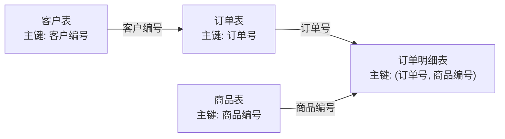
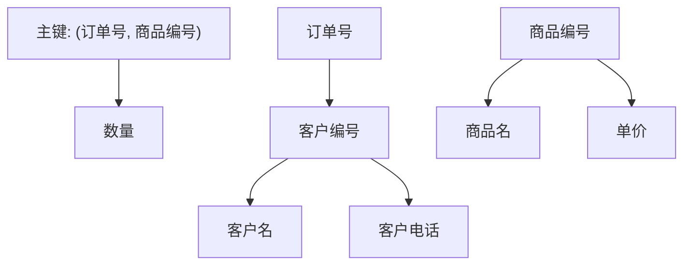
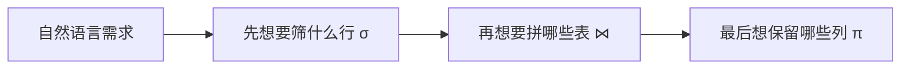

# 第 05 课：数据库 I（重写版）

## 课案信息

- 适用对象：软件设计师 2026 年 5 月备考
- 建议时长：100-130 分钟
- 使用前提：已完成 `L01-L04`，且本轮接受 `L04` 未完全闭环但继续推进
- 课程定位：上午数据库高频题地基课，也是 `L06` 数据库设计下午题的前置课
- 本课目标：先看懂 `键 / 范式 / 关系代数 / SQL` 四件套，再能按考试口径做题

## Mermaid 预览说明

- 本课默认图示语言为 `Mermaid`
- 本地可用支持 Mermaid 的 Markdown 预览插件查看
- 若本地预览不方便，可直接粘贴到 [Mermaid Live Editor](https://mermaid.live/) 查看

## 资料依据

### 主依据

- `2018软件设计师教程_第5版_-_9787302491224.pdf`

### 本地课程与样本锚点

- `doc/agent/plans/20260311_sdes-course-plan_plan_v01.md`
- `doc/Software-Designer-master/README.md`
- `doc/Software-Designer-master/真题/2018上.pdf`

### 本地证据限制说明

- 当前仓库内可直接稳定读取到的近年真题 PDF 以`下午卷案例题`为主
- 因此本课会保持`真题导向`，但不会把所有练习冒充成“近年上午原题逐字复现”
- 本课对上午数据库部分采用`高频题型锚定 + 贴近真题风格练习`的保守口径

## 当前本课结论

- `L05` 的核心不是背数据库定义，而是先打通 4 个最稳拿分点：
  - 键与完整性
  - 1NF / 2NF / 3NF
  - 关系代数
  - SQL 基础判断
- `README` 已明确区分：
  - 上午题要按章节刷题
  - 下午数据库题是固定题型
- 所以这节课的职责很清楚：

> 先把上午数据库基本盘打稳，再为 `L06` 的下午数据库设计题做准备。

## 学习目标

学完本课，你应该能做到：

1. 用一句人话解释“为什么数据库不能什么都塞进一张表”
2. 区分 `候选键 / 主键 / 外键`
3. 看出一个关系模式为什么停在 `1NF`、为什么能到 `2NF`、为什么还没到 `3NF`
4. 读懂最常见的关系代数表达式
5. 看懂 `WHERE / GROUP BY / HAVING / ORDER BY` 在 SQL 题里的职责分工

## 前置知识

1. 能区分“数据内容”和“处理动作”
2. 知道表、字段、记录这些最基础的词
3. 不要求你先读过教材

## 一、先别背术语，先看一个“看起来方便，其实很危险”的大表

假设有一个销售系统，很多初学者最爱先写出这样一张表：

| 订单号 | 下单日期 | 客户编号 | 客户名 | 客户电话 | 商品编号 | 商品名 | 单价 | 数量 |
| --- | --- | --- | --- | --- | --- | --- | --- | --- |
| O001 | 2026-04-01 | C01 | 张三 | 13800000001 | P01 | 机械键盘 | 399 | 2 |
| O001 | 2026-04-01 | C01 | 张三 | 13800000001 | P02 | 鼠标 | 99 | 1 |

这张表“能不能用”？

- 能暂时用
- 但一看就埋了很多坑

为什么？

1. 一个订单买多个商品时，订单信息会重复
2. 客户改电话时，要改很多行
3. 商品改名时，也要改很多行
4. 一旦只删了一行，可能把本来不想删的业务事实一起删掉

所以数据库题最核心的直觉不是：

- “怎么把表写得越大越全”

而是：

> 一条事实尽量只在一个合适的位置保存一次。

这句话就是后面“键、范式、关系分解”的出发点。

## 二、键到底是什么：不是玄学，就是“靠谁唯一定位”

### 2.1 先用生活比喻理解

- `候选键`：像一组“理论上能唯一认出这个人/这条记录”的证件
- `主键`：从候选键里正式挑一个，作为系统主用的唯一标识
- `外键`：本表里拿来指向另一张表主键的那根“关联线索”

### 2.2 用订单系统看一遍

我们拆成三张表：

- `客户(客户编号, 客户名, 客户电话)`
- `订单(订单号, 下单日期, 客户编号)`
- `订单明细(订单号, 商品编号, 数量)`



### 2.3 这时候四个词怎么落地

#### 候选键

- 能唯一标识元组的最小属性组
- 关键词：`唯一` + `最小`

#### 主键

- 从候选键中选定的那个主用标识
- 关键词：`唯一` + `通常不为空`

#### 外键

- 某表中引用另一表主键或候选键的属性
- 关键词：`建立关联`

### 2.4 考试里怎么快速判断

1. 先找“谁能唯一定位一条记录”
2. 再看它是不是“最小”的
3. 外键不负责唯一，它负责“指过去”

### 2.5 快速陷阱

1. 把“经常出现”的字段误判成主键
2. 把“能关联别的表”的字段误判成候选键
3. 看到复合主键就慌，其实它只是“要两个字段合起来才能唯一”

## 三、范式不要死背定义，先看“依赖错位”到底错在哪

### 3.1 一句最重要的人话

范式不是考试发明出来折磨人的。

它是在问：

> 这张表里，非主属性是不是老老实实依赖它该依赖的东西？

### 3.2 先给你一个典型关系模式

设：

`R(订单号, 商品编号, 客户编号, 客户名, 客户电话, 商品名, 单价, 数量)`

且已知：

1. `(订单号, 商品编号) -> 数量`
2. `订单号 -> 客户编号`
3. `客户编号 -> 客户名, 客户电话`
4. `商品编号 -> 商品名, 单价`

主键是：

- `(订单号, 商品编号)`

### 3.3 为什么它至少是 1NF

因为这里每个字段看起来都已经是“不可再分的单值字段”。

所以：

- 没有“一个单元格里塞多个商品编号”
- 没有“电话1, 电话2, 电话3”那种重复组

这说明它满足：

- `1NF`

### 3.4 为什么它还到不了 2NF

因为有些非主属性没有依赖整个主键，而只依赖主键的一部分：

- `商品编号 -> 商品名, 单价`
- `订单号 -> 客户编号`

这叫：

- `部分函数依赖`

只要主键是复合主键，而非主属性只依赖其中一部分，就上不了 `2NF`。

### 3.5 为什么它也到不了 3NF

因为还有一条更典型的链：

- `订单号 -> 客户编号`
- `客户编号 -> 客户名, 客户电话`

于是形成：

- `订单号 -> 客户编号 -> 客户名 / 客户电话`

这叫：

- `传递依赖`

所以它也上不了 `3NF`。

### 3.6 用图把依赖关系看明白



### 3.7 考试化判断模板

看到范式题，按这 4 步走：

1. 先找主键
2. 再看是不是存在重复组，不是就先认为至少 `1NF`
3. 如果主键是复合主键，重点查`部分函数依赖`
4. 再查有没有“非主属性依赖非主属性”，也就是`传递依赖`

### 3.8 一句话死记版

- `1NF`：字段先原子化
- `2NF`：非主属性别只依赖复合主键的一部分
- `3NF`：非主属性别再拐弯依赖别的非主属性

## 四、关系代数别怕符号，它本质就是“先筛，再取，再拼”

### 4.1 先翻成人话

- `σ`：选择，筛行
- `π`：投影，取列
- `⋈`：连接，把相关表拼起来
- `∪`：并，合并同类结果
- `-`：差，做排除

### 4.2 你最容易混的就两个

1. `σ` 是按条件筛记录
2. `π` 是保留哪些字段

很多题不是不会做，而是把这两个搞反了。

### 4.3 看一个借书场景

有三张表：

- `读者(读者编号, 姓名)`
- `借阅(读者编号, 图书编号, 是否归还)`
- `图书(图书编号, 书名)`

题目：

> 查询借过《数据库系统原理》且尚未归还的读者姓名。

关系代数表达式可以写成：

`π姓名(读者 ⋈ 借阅 ⋈ σ书名='数据库系统原理' and 是否归还='否'(图书))`

考试时你不一定要写到最优，但至少要看懂逻辑顺序：

1. 先筛出目标图书
2. 再和借阅信息关联
3. 再和读者表关联
4. 最后取姓名列



### 4.4 考试快招

1. 题目里有“满足某条件的记录”时，先想 `σ`
2. 题目里有“输出哪些属性”时，最后想 `π`
3. 题目里跨表取信息时，基本要有 `⋈`

## 五、SQL 高频点：不是背语法，而是分清“筛行”和“筛组”

### 5.1 先记一句最值钱的话

> `WHERE` 管行，`HAVING` 管组。

这是数据库选择题里最稳定的区分点之一。

### 5.2 先看一个成绩表

`SC(学号, 课程号, 成绩)`

题目：

> 查询平均成绩大于等于 `80` 分的学号及其平均成绩。

正确写法：

```sql
SELECT 学号, AVG(成绩) AS 平均成绩
FROM SC
GROUP BY 学号
HAVING AVG(成绩) >= 80;
```

为什么不能把 `AVG(成绩) >= 80` 写进 `WHERE`？

因为：

- `WHERE` 发生在分组前
- 平均值是分组之后才算出来的

### 5.3 再补一条常见考点

#### `COUNT(*)` 和 `COUNT(列名)`

- `COUNT(*)`：数行
- `COUNT(列名)`：只统计该列`非 NULL`的行

#### `NULL`

- 不能用 `= NULL`
- 要用 `IS NULL`

### 5.4 SQL 题最常见的出题点

1. `WHERE` 和 `HAVING` 混用
2. 分组后查询的列不合法
3. 聚合函数的含义搞错
4. `NULL` 判断写错

### 5.5 够用的考试顺序感

在软件设计师层级，记这套顺序就够了：

1. `FROM / JOIN`
2. `WHERE`
3. `GROUP BY`
4. `HAVING`
5. `SELECT`
6. `ORDER BY`

## 六、为什么 L05 现在必须上，而不是继续在 L04 原地打转

因为课程总表里 `L05 -> L06` 是一组连续模块：

- `L05` 先把上午数据库基础打稳
- `L06` 再进入下午数据库设计固定题

而且本地 `2018上.pdf` 的下午数据库案例已经说明：

- 数据库题不是冷门边角
- 它既会在下午题里稳定出现，也反向要求你有上午数据库基础

所以本轮推进策略是：

> 接受 `L04` 仍有局部薄弱项，但不回退重讲整课，先让数据库主线启动。

## 七、随堂练习

说明：

- 本轮练习按`严格考试口径`批改
- 若术语不准、因果链不完整、只是方向对但不够考试化，都不能按满分算

### 练习 1：键的识别

- 分值：`3 分`
- 频次/优先级：`高频 / 最高`

关系：

`选课(学号, 课程号, 学生姓名, 课程名, 成绩)`

已知：

- 一个学生可以选多门课
- 一门课可以被多个学生选

问题：

1. 该关系最自然的主键是什么？
2. `学生姓名` 为什么不能作为主键？

### 练习 2：范式判断

- 分值：`5 分`
- 频次/优先级：`高频 / 最高`

仍用关系：

`R(订单号, 商品编号, 客户编号, 客户名, 客户电话, 商品名, 单价, 数量)`

主键为 `(订单号, 商品编号)`。

问题：

1. 它至少满足哪一范式？
2. 为什么不满足 `2NF`？
3. 为什么不满足 `3NF`？

### 练习 3：关系代数翻译

- 分值：`4 分`
- 频次/优先级：`中高频 / 高`

有关系：

- `读者(读者编号, 姓名)`
- `借阅(读者编号, 图书编号, 是否归还)`
- `图书(图书编号, 书名)`

问题：

用关系代数表达：

> 查询尚未归还图书的读者姓名。

要求至少说明：

1. 哪一步在筛行
2. 哪一步在连接
3. 哪一步在取列

### 练习 4：SQL 判断

- 分值：`4 分`
- 频次/优先级：`高频 / 高`

题目：

> 查询平均成绩大于等于 `80` 分的学号。

下面两种写法哪一个正确？为什么？

```sql
SELECT 学号
FROM SC
WHERE AVG(成绩) >= 80
GROUP BY 学号;
```

```sql
SELECT 学号
FROM SC
GROUP BY 学号
HAVING AVG(成绩) >= 80;
```

### 练习 5：易错点快判

- 分值：`4 分`
- 频次/优先级：`高频 / 中高`

判断下列说法对错，并给一句考试化理由：

1. `COUNT(列名)` 与 `COUNT(*)` 总是等价
2. 外键一定唯一
3. `WHERE` 可以直接筛选聚合结果
4. `π` 运算是按条件筛记录

## 八、课后作业

1. 用你自己的话写出 `1NF / 2NF / 3NF` 的一句人话定义，每条不超过 `25` 字
2. 把“订单、客户、商品、订单明细”四张表之间的键关系画成一张 `Mermaid` 图
3. 自拟一个“学生选课”场景，写出一条需要 `GROUP BY + HAVING` 的 SQL
4. 回答：为什么关系代数里的 `σ` 和 `π` 很容易混，但本质上一个管行、一个管列？

## 九、常见错误

1. 把“能关联别的表”误认为“这个字段就一定是主键”
2. 一见范式题就只会背定义，不会先找主键和依赖链
3. 把 `部分函数依赖` 和 `传递依赖` 混成一句空话
4. 把 `σ` 和 `π` 的职责搞反
5. 把 `WHERE` 和 `HAVING` 搞反
6. 忘了 `NULL` 不能用 `=`

## 十、复盘清单

做完本课后，你至少应能独立回答：

1. 为什么数据库设计不能什么都塞进一张表？
2. 候选键、主键、外键各自解决什么问题？
3. `1NF / 2NF / 3NF` 分别卡在哪一步？
4. 为什么 `σ` 是筛行，`π` 是取列？
5. 为什么 `AVG(成绩) >= 80` 应该放在 `HAVING` 而不是 `WHERE`？

## 十一、交作业时的答题要求

你后续把答案发回来时，尽量按下面格式作答：

1. `练习1：...`
2. `练习2：...`
3. `练习3：...`
4. `练习4：...`
5. `练习5：...`

我会继续按严格口径批改，明确区分：

- 完全正确
- 基本通过
- 方向对但不达考试标准
- 错误
