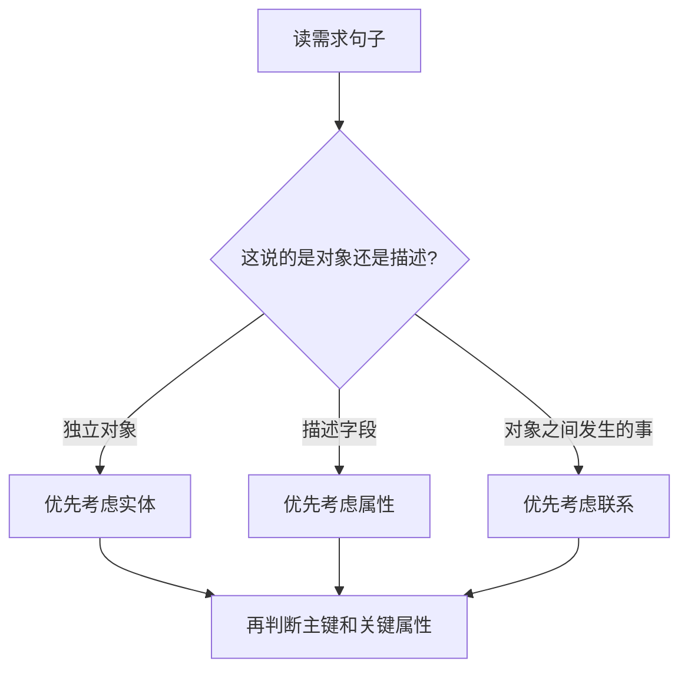

# 第 06 课：下午专题 II：数据库设计（重写版）

## 课案信息

- 适用对象：软件设计师 2026 年 5 月备考
- 建议时长：110-140 分钟
- 使用前提：已完成 `L05 数据库 I`
- 课程定位：下午数据库设计固定题模板课
- 本课目标：让你看到数据库设计大题时，先能读需求、再能补 ER 图、再能改关系模式

## Mermaid 预览说明

- 本课默认图示语言为 `Mermaid`
- 本地可用支持 Mermaid 的 Markdown 预览插件查看
- 若本地预览不方便，可直接粘贴到 [Mermaid Live Editor](https://mermaid.live/) 查看

## 资料依据

### 主依据

- `2018软件设计师教程_第5版_-_9787302491224.pdf`

### 本地真题锚点

- `doc/Software-Designer-master/真题/2018上.pdf`

### 辅助依据

- `doc/Software-Designer-master/README.md`
- `doc/agent/plans/20260311_sdes-course-plan_plan_v01.md`

## 当前样本结论

- 数据库设计下午题稳定核心不是写 SQL，而是：
  - 读需求
  - 抽实体
  - 抽联系
  - 落主键外键
  - 把 ER 图翻成关系模式
- `2018上.pdf` 已验证的 3 个稳定问法是：
  - `补全 ER 图`
  - `补全不完整关系模式`
  - `新增弱实体并修改关系模式`

## 学习目标

学完本课，你应该能做到：

1. 知道数据库设计下午题到底在考什么
2. 能从需求描述里抽出实体、属性、联系
3. 能看懂并补全基本 ER 图
4. 能把 ER 图翻译为关系模式，并识别应放在哪张表里的主键/外键
5. 知道弱实体为什么是数据库设计题的常见升级点

## 前置知识

1. 已掌握 `L05` 的基本概念：
   - 主键
   - 外键
   - 关系模式
   - `1NF / 2NF / 3NF`
2. 不要求你已经熟练会画 ER 图

## 一、先建立直觉：数据库设计下午题不是“画图比赛”，而是“把业务事实放对位置”

很多人第一次做数据库设计下午题，会误以为它主要在考：

- 你会不会背 ER 图符号
- 你会不会把矩形和菱形画得很整齐

这都不是核心。

真正核心是：

> 你能不能把业务里的“谁”“什么信息”“谁和谁发生什么关系”放到对的位置上。

如果位置放对了：

- ER 图就不会乱
- 关系模式就不会乱
- 主键外键也会跟着顺

如果位置放错了：

- 本来该是实体的被你写成属性
- 本来该单独建表的被你塞进主表
- 本来该用外键表示的联系被你写成一堆文字说明

所以这节课最重要的起手动作只有一句：

> 先分清“谁是东西，谁是东西之间的事”。  

## 二、用 2018 上半年数据库设计题建立全流程框架

这套题的业务背景很朴素：

- 海外代购公司要做信息化管理系统
- 里面有员工、顾客、商品、托运公司、订单
- 员工又分代购员和配送员
- 一份订单可能涉及多个商品、多名代购员
- 配送完成后交由托运公司发运

你先不要急着画图，先把需求翻成几类句子：

### 2.1 哪些是“业务对象”

这里明显能看出来的实体有：

1. 员工
2. 商品
3. 顾客
4. 托运公司
5. 订单

### 2.2 哪些是“角色细分”

需求里说：

- 员工分为代购员和配送员

这类信息通常在下午题里意味着：

- 可能是同一实体的子类型
- 也可能在题目给定图里已经拆成两个相关实体/角色框让你补联系

### 2.3 哪些是“对象之间发生的事”

例如：

- 代购员根据顾客订单采购商品
- 配送员根据订单组合货品后交给托运公司发运

这类句子常常对应：

- 联系
- 联系属性
- 或中间关系模式

## 三、先学最关键的一刀：怎么区分实体、属性、联系

### 3.1 一个最省脑子的判断法

#### 实体

像“能独立存在、值得单独记一张表的东西”

例如：

- 员工
- 商品
- 顾客
- 订单
- 托运公司

#### 属性

像“用来描述实体的字段”

例如：

- 工号
- 身份证号
- 商品名称
- 电话
- 地址
- 支付凭证编号

#### 联系

像“实体和实体之间发生的业务关系”

例如：

- 代购员代购商品
- 配送员运送订单

### 3.2 一个很常见的误判

很多人会把“订单”写成联系。

为什么这常错？

因为“下单”像一个动作。

但在数据库题里：

- 如果这个东西有自己独立编号
- 有多项属性
- 还会和多个别的对象发生关系

那它往往就是实体，不只是一个动作。

所以：

- “下单”是业务行为
- “订单”是需要独立存储的业务对象

## 四、ER 图下午题的第一固定得分点：补实体和联系

### 4.1 这类题在问什么

所谓“补 ER 图”，本质通常不是让你从零开始重画整张图，而是在一张不完整的图上补：

1. 缺失实体
2. 缺失联系
3. 缺失联系两端的参与对象

### 4.2 用 2018 上题型来体会

本地样本中的不完整图里，已经给出了：

- 员工
- 代购员
- 配送员
- 托运公司
- 商品
- 顾客

图中还有：

- `代购`
- `运送`
- `订单`

这时你做题不能慌，按下面顺序扫：

1. 题干里出现过哪些“独立对象”，图上还没体现清楚？
2. 哪些对象之间一定有业务关系？
3. 这条关系是“一次业务事件”还是“长期属性”？

### 4.3 读题时的脑内模板

## 五、第二固定得分点：把 ER 图翻成关系模式

### 5.1 你先别背规则，先记最朴素的一句

> 一个稳定实体，通常先落成一张关系表。  

所以像：

- 员工
- 商品
- 顾客
- 托运公司

先各自成表，没什么悬念。

### 5.2 难点往往不在“实体表”，而在“联系怎么落表”

因为数据库设计下午题很喜欢把难度放在：

- 多对多联系
- 带业务含义的联系
- 联系本身也需要编号或属性

例如题里已有：

- `代购(代购ID, 代购员工号, (b))`
- `运送(运送ID, 配送员工号, 托运公司编号, 订单ID, 发运时间)`

这说明：

- `代购` 和 `运送` 并不是简单一句“谁和谁有关系”就结束
- 它们已经被落成了独立关系模式

### 5.3 为什么会这样

因为这些“联系”已经有了自己的业务身份：

- 谁做的
- 对哪个订单做的
- 什么时候做的
- 可能还涉及哪些商品或数量

所以你看到这类题时，不要死背“联系一定不建表”。

考试更常见的真实规则是：

> 简单联系未必要单独建表；但多对多联系、带属性联系、业务上要独立记录的联系，往往就要落成关系模式。  

## 六、第三固定得分点：空缺字段该补到哪

题目里最稳的一类问法就是：

- 给你一个不完整关系模式
- 问你 `(a)`、`(b)` 该填什么

这时候不要猜字段名，按“业务来源”倒推。

### 6.1 先看题中给定模式

`订单(订单ID, (a), 商品数量, 运送方式, 支付凭证编号)`

`代购(代购ID, 代购员工号, (b))`

### 6.2 怎么想 `(a)`

订单是谁下的？

- 顾客下的

所以订单表里最自然应该带：

- 顾客编号

也就是把“订单属于哪个顾客”落下来。

### 6.3 怎么想 `(b)`

代购是谁在替谁代购什么？

题干里说：

- 代购员根据顾客订单在超市采购对应商品

所以 `代购` 这个关系模式至少要把业务对象串起来。常见落法会围绕：

- 订单 ID
- 商品条码

来补足“代购的是哪份订单里的哪个商品”。

### 6.4 下午题快招

看到空缺字段，先问三句：

1. 这个表记录的到底是哪一类业务事实？
2. 这类事实最少需要关联哪些对象才能成立？
3. 哪个编号应该进这个表，而不是只留在图里？

## 七、第四固定得分点：弱实体为什么爱考

### 7.1 先用人话解释弱实体

弱实体不是“弱小的实体”。

它的意思是：

> 它自己单独拎出来，往往不够独立，得依附于某个强实体才能唯一识别。  

例如：

- 顾客地址

为什么它很适合做弱实体？

因为“地址”本身通常不作为全局独立业务对象存在，但它又明显属于某个顾客，而且一个顾客还可能有多组地址。

### 7.2 这类题为什么常升级成弱实体

因为出题人很爱在最后一问说：

- 现在业务变了
- 一个顾客可以保存多组收货地址
- 请增加弱实体并修改关系模式

这道题一出来，考的其实是你能不能从“一个字段”升级成“一个附属实体”。

### 7.3 你要立刻意识到的变化

原来：

- `顾客(编号, 姓名, 身份证号, 手机号, 收货地址)`

现在：

- 一位顾客可以有多组地址

这时还把 `收货地址` 塞在顾客表里就不合适了。

更稳的做法是拆成：

- `顾客(顾客编号, ...)`
- `顾客地址(顾客编号, 地址序号, 收货地址, ...)`

其中：

- `顾客地址` 依附于 `顾客`
- 主键常常是“顾客编号 + 地址内局部编号”

## 八、把整道数据库设计下午题压缩成一套答题模板

### 8.1 第一步：扫需求，先圈对象

看到名词类业务对象先圈出来：

- 员工
- 顾客
- 商品
- 订单
- 托运公司

### 8.2 第二步：扫句子，找关系

看到“谁对谁做什么”时，优先怀疑联系：

- 代购员代购商品
- 配送员运送订单

### 8.3 第三步：看编号，定主键

题干里凡是明确说“唯一标识”的，优先就是键线索：

- 工号
- 条码
- 顾客编号
- 托运公司编号
- 订单 ID

### 8.4 第四步：翻关系模式

问自己：

1. 哪些稳定实体先落独立表？
2. 哪些联系需要单独落表？
3. 哪些编号应作为外键进入哪张表？

### 8.5 第五步：遇到业务变化，先想“字段要不要升级成实体”

比如：

- 一个顾客只有一个地址时，地址可能先是字段
- 一个顾客有多组地址时，地址就很可能该升级成弱实体

## 九、随堂练习

说明：

- 本轮继续按严格考试口径批改
- 术语不稳、关系放错、表落错、把属性写成实体，都要扣分

### 练习 1：实体 / 属性 / 联系判断

- 分值：`4 分`
- 频次/优先级：`高频 / 最高`

某图书商城系统有如下描述：

1. 记录图书信息：图书编号、书名、定价
2. 记录会员信息：会员编号、姓名、手机号
3. 会员提交订单购买图书
4. 一张订单可以包含多本图书

问题：

1. 哪些应当作为实体？
2. 哪些是典型属性？
3. “购买”更接近属性还是联系？为什么？

### 练习 2：关系模式补空

- 分值：`5 分`
- 频次/优先级：`高频 / 最高`

已知：

- 顾客(顾客编号, 姓名, 电话)
- 商品(商品编号, 商品名, 单价)
- 订单(订单编号, (a), 下单时间)
- 订单明细(订单编号, 商品编号, 数量)

问题：

1. `(a)` 最合理应填什么？
2. 为什么它应放在订单表而不是订单明细表？

### 练习 3：下午题风格判断

- 分值：`5 分`
- 频次/优先级：`高频 / 高`

某系统原有：

- 顾客(顾客编号, 姓名, 电话, 收货地址)

现在需求变为：

- 一个顾客可以保存多组收货地址

问题：

1. 为什么原设计不再合适？
2. “顾客地址”为什么适合作为弱实体？
3. 新关系模式的主键可以怎么设计？

### 练习 4：读题模板

- 分值：`4 分`
- 频次/优先级：`中高频 / 高`

请你用不超过 `80` 字回答：

> 做数据库设计下午题时，你看到需求后，前 3 步先做什么？

## 十、课后作业

1. 用你自己的话写出：
   - 为什么“订单”通常是实体，而不是属性
   - 为什么“购买”通常是联系，而不是实体
2. 把“顾客 - 订单 - 商品 - 订单明细”画成一版标准 `Mermaid` 关系图
3. 把“一个顾客保存多组地址”的场景，写成 2 张关系模式，并说明主键 / 外键
4. 回答：
   - 为什么数据库设计下午题里，最后一问常常是在“改模型”，而不是重新从零画图？

## 十一、常见错误

1. 把“订单”这种独立业务对象误判成联系
2. 把“购买”这种业务关系误判成属性
3. 看到关系模式空缺就猜字段名，不先倒推业务事实
4. 不会判断什么时候该把字段升级成弱实体
5. 主键、外键、联系表三者位置经常放乱

## 十二、复盘清单

做完本课后，你至少应能独立回答：

1. ER 图里怎么区分实体、属性、联系？
2. 数据库设计下午题最稳定的 3 类问法是什么？
3. 什么时候一条联系要落成关系模式？
4. 为什么“顾客地址”在一对多场景下适合作为弱实体？
5. 看到 `(a)`、`(b)` 这类空缺时，应该怎样倒推？
