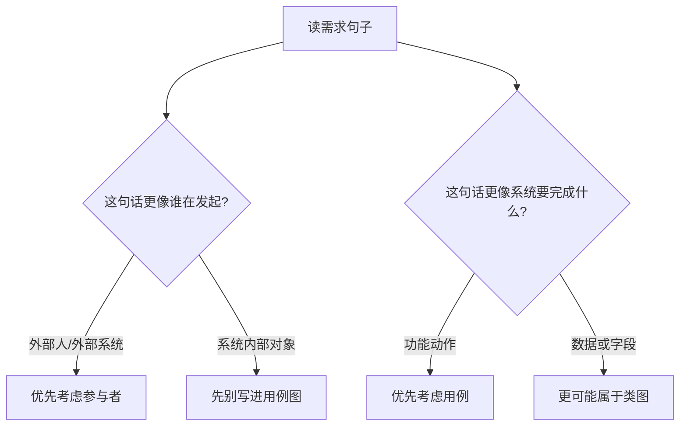
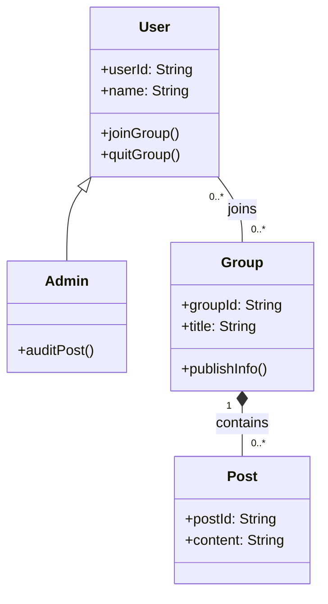

# 第 07 课：面向对象与 UML I（重写版）

## 课案信息

- 适用对象：软件设计师 2026 年 5 月备考
- 建议时长：110-140 分钟
- 使用前提：已完成 `L05` 与 `L06` 的阶段 B 广度推进
- 课程定位：`L08` 下午专题前的基础承接课
- 本课目标：让你看到 OO/UML 题时，不再把它当“记符号”，而是先看懂“谁在和系统交互、系统要做什么、系统里有哪些类、类之间怎么连”

## Mermaid 预览说明

- 本课默认图示语言为 `Mermaid`
- 本地可用支持 Mermaid 的 Markdown 预览插件查看
- 若本地预览不方便，可直接粘贴到 [Mermaid Live Editor](https://mermaid.live/) 查看

## 资料依据

### 主依据

- `2018软件设计师教程_第5版_-_9787302491224.pdf`

### 本地真题锚点

- `doc/Software-Designer-master/真题/2018上.pdf`
- `doc/Software-Designer-master/真题/2018下.pdf`
- `doc/Software-Designer-master/真题/2016上.pdf`
- `doc/Software-Designer-master/真题/2016下.pdf`

### 辅助依据

- `doc/Software-Designer-master/README.md`
- `doc/agent/plans/20260311_sdes-course-plan_plan_v01.md`

## 当前样本结论

- 近年可直接核验的本地样本表明，OO/UML 不是单独考抽象定义，而是稳定落在：
  - `根据需求识别参与者与用例`
  - `根据需求或给定图识别分析类/类图`
  - `根据新增需求修改类图或补全缺失类`
- `L07` 先解决“识图、读图、从需求映射到 UML 元素”的基础问题。
- `L08` 再处理更接近下午题整题链路的 `连续案例 + 多问联动 + 改图`。
- 本课会提到真题里确实会出现设计模式判断，但模式识别的系统化讲授仍放在 `L09`。

## 学习目标

学完本课，你应该能做到：

1. 用人话说清什么叫“面向对象”
2. 区分 `对象 / 类 / 属性 / 操作`
3. 看懂 UML 里最常考的 `用例图` 和 `类图`
4. 从需求描述中先圈出参与者、用例、候选类
5. 区分类之间最常见的关系：`关联 / 泛化 / 聚合 / 组合`
6. 为 `L08` 的下午题模板课打基础

## 前置知识

1. 不要求你已经学过正式 OO 课程
2. 只要求你已经适应当前课程的“先读需求、再抽结构”的节奏
3. 默认你还不熟 UML 符号，本课会从直觉开始讲

## 一、先建立直觉：面向对象不是“面向术语”，而是“先把系统里的角色和东西分出来”

很多人第一次学面向对象，会先被一串词打懵：

- 类
- 对象
- 封装
- 继承
- 多态
- UML

但考试里真正先用到的，不是这些名词本身，而是下面这件更朴素的事：

> 先把“谁在用系统”“系统要干什么”“系统里有哪些东西”分清。

例如一个社交群组平台：

- 谁在用系统？用户、管理员
- 系统要干什么？创建群组、加入群组、发布信息
- 系统里有哪些东西？用户、群组、帖子、通知

这就是 OO/UML 题的起点。

所以你可以先把它理解成：

- `用例图` 更像“系统功能清单 + 谁来触发”
- `类图` 更像“系统内部零件图 + 零件之间怎么连”

先把这两张图的职责分开，后面就不容易乱。

## 二、先讲对象和类：为什么“张三”不是类，“用户”才是类

### 2.1 用最省脑子的方式理解

- `对象`：现实里或系统里一个具体实例
- `类`：一批相似对象的共同模板

例如：

- `用户` 是类
- `游工` 是对象
- `群组` 是类
- `数据库学习群` 是对象

### 2.2 属性和操作怎么区分

- `属性`：这个东西“有什么”
- `操作`：这个东西“能做什么”

例如 `用户` 这个类：

- 属性：用户编号、昵称、手机号
- 操作：加入群组、退出群组、发布消息

### 2.3 一个最常见误判

很多人会把“发布消息”写成属性。

这是错位。

因为：

- “消息内容”可以是属性
- “发布消息”是动作，通常应落在用例或操作

一句快记：

> 名词先怀疑是类或属性，动词先怀疑是用例或操作。

## 三、用真题建立第一层直觉：题目到底在怎么考 OO/UML

### 3.1 `2018上.pdf` 给出的信号

本地样本显示，这道 OO 题不是让你背定义，而是给出需求后：

- 提供 `用例图`
- 提供 `分析类图`
- 让你根据题干去判断缺失类名或结构

这说明考试很重视：

1. 你能不能从需求映射到参与者与功能
2. 你能不能把功能背后的核心对象抽成类

### 3.2 `2016上.pdf` 给出的信号

这套题给出了：

- `用例图`
- `初始类图`

而且题干里能看出：

- 有自动控制与手动控制两类行为
- 有错误提示
- 有解释器、解析器之类的类

这说明真实题并不只考“画一个简单类图”，而是会考：

- 行为怎么分
- 错误信息属于谁负责
- 某个职责更该落在哪个类

### 3.3 `2016下.pdf` 给出的信号

这套题把：

- 用例规约
- 状态图
- 类图

放在同一组题里。

它说明一个重要事实：

> 下午 OO 题并不是孤立背一张图，而是多个 UML 视角一起服务同一个系统。

但这节 `L07` 先不展开状态图整题，只先把最核心的 `用例图 + 类图` 打稳。

### 3.4 `2018下.pdf` 给出的信号

社交群组平台那题明确出现了：

- 先给类图
- 再给新需求
- 再问你该怎么改类图

这正是 `L08` 会重点处理的整题风格。

本课先把“改图之前你得先会读图”解决掉。

## 四、先学用例图：它回答的是“谁让系统做什么”

### 4.1 用人话理解

用例图不是数据库表，也不是程序源码结构图。

它只回答两个问题：

1. 谁在和系统交互？
2. 他希望系统完成什么事？

所以用例图里你先找：

- `参与者 Actor`
- `用例 Use Case`

### 4.2 一个最稳的识别法

- 系统外部的人或外部系统，优先怀疑是 `参与者`
- “登录、下单、发布、查询、审核” 这种功能动作，优先怀疑是 `用例`

### 4.3 先别急着管 include / extend

软件设计师确实可能碰到 `include / extend`，但在当前阶段你先把最核心的两层打牢：

- 谁是参与者
- 哪些是核心用例

如果连这两层都没稳，后面关系只会更乱。

### 4.4 读需求时的脑内流程

## 五、再学类图：它回答的是“系统里有哪些类，以及它们怎么连”

### 5.1 类图先看什么

第一次看类图，不要先看符号细节，先看三件事：

1. 有哪些类
2. 每个类大概负责什么
3. 类和类之间是什么关系

### 5.2 最常考的 4 种关系

#### 关联 Association

就是“有业务联系”。

例如：

- 用户加入群组
- 订单包含商品

#### 泛化 Generalization

就是“是一种”。

例如：

- 管理员是一种用户
- 配送员是一种员工

#### 聚合 Aggregation

就是“整体和部分有关，但部分能独立存在”。

例如：

- 部门包含员工

员工离开部门，员工本身依然存在。

#### 组合 Composition

就是“整体没了，部分通常也没意义”。

例如：

- 订单包含订单项

订单删除后，订单项通常也跟着失去独立意义。

### 5.3 不要把聚合和组合背成死定义

考试里最稳的做法不是死背“空心菱形还是实心菱形”，而是先问：

> 这个部分离开整体后，还值不值得独立存在？

如果通常还独立存在，更像聚合。  
如果通常跟着整体一起生灭，更像组合。

## 六、用一个小图把类图关系一次看懂

你应该先看出：

1. `Admin` 是 `User` 的一种，所以是泛化
2. `User` 和 `Group` 是普通业务联系，所以是关联
3. `Group` 和 `Post` 更像“整体-组成项”，所以这里用组合

## 七、从需求到 UML：怎么把一句业务话翻成图上元素

### 7.1 一个非常实用的翻译表

| 需求里的表达 | 优先怀疑的 UML 元素 |
| --- | --- |
| 用户、管理员、顾客 | 参与者或类 |
| 登录、查询、发布、审核 | 用例或操作 |
| 编号、名称、时间、状态 | 属性 |
| A 属于 B、A 管理 B | 关联 |
| A 是一种 B | 泛化 |
| A 由多个 B 组成 | 聚合/组合 |

### 7.2 为什么同一个名词有时是参与者，有时是类

比如“用户”：

- 在 `用例图` 里，它表示“谁在用系统”，所以可以是参与者
- 在 `类图` 里，它表示“系统内部被管理的数据对象”，所以又可以是类

这不是冲突，而是两个视角不同。

一句快记：

> 用例图看交互视角，类图看结构视角。

## 八、本课绑定真题的 3 个核心考点

### 8.1 考点一：从需求中圈参与者和用例

#### 真题实际考查范围

- `2016上`、`2018上` 都体现了从需求到用例图的映射

#### 当前课案是否已讲透

- 已讲到基础识别层

#### 若未讲透，本轮需要补的知识点

- `include / extend` 的细分关系不作为本轮主线

### 8.2 考点二：从需求或给定图中识别类、属性、操作

#### 真题实际考查范围

- `2016上`、`2018上` 会要求根据描述判断缺失类或职责归属

#### 当前课案是否已讲透

- 已讲到基础识别层

#### 若未讲透，本轮需要补的知识点

- 更复杂的分析类边界、控制类拆分，放到 `L08`

### 8.3 考点三：根据新需求改类图

#### 真题实际考查范围

- `2018下` 明确体现“已有类图 + 新需求 + 改图”

#### 当前课案是否已讲透

- 本轮只做到“为改图做准备”

#### 若未讲透，本轮需要补的知识点

- 连续案例整题改图，放到 `L08`

## 九、真题风格例题

### 例题 1：先判断谁该进用例图

场景：

- 用户可以创建群组
- 用户可以加入群组
- 管理员可以审核群组信息
- 群组中发布新消息时，系统自动通知成员

问：

1. 哪些更适合作为参与者？
2. 哪些更适合作为用例？

标准思路：

- 参与者先看系统外部交互者：`用户`、`管理员`
- 用例先看系统功能：`创建群组`、`加入群组`、`审核群组信息`
- `自动通知成员` 更偏系统内部行为或某个用例后的结果，不优先当独立参与者

### 例题 2：先判断哪些该进类图

场景：

- 订单有订单号、下单时间、金额
- 一个订单由多条订单项组成
- 每条订单项记录商品、数量、小计

问：

1. 哪些更像类？
2. 哪些更像属性？
3. `订单` 与 `订单项` 更像聚合还是组合？

标准思路：

- 类：`订单`、`订单项`、`商品`
- 属性：`订单号`、`下单时间`、`金额`、`数量`、`小计`
- `订单` 与 `订单项` 更稳地答 `组合`

## 十、随堂练习

说明：

- 本轮继续按严格考试口径批改
- 只答方向、不答术语；只答名词、不答关系；都要扣分

### 练习 1：参与者与用例识别

- 分值：`6 分`
- 频次/优先级：`高频 / 最高`

某在线选课系统有如下描述：

1. 学生登录系统后可查询课程并提交选课申请
2. 教师可查看自己所授课程的选课名单
3. 教务员可审核特殊选课申请
4. 系统会在选课成功后向学生发送提醒

问题：

1. 哪些应优先作为参与者？
2. 哪些应优先作为用例？
3. “发送提醒”更适合作为独立参与者、用例，还是系统内部结果？说明理由

### 练习 2：类、属性、操作识别

- 分值：`6 分`
- 频次/优先级：`高频 / 最高`

某图书借阅系统中有如下信息：

- 读者编号、姓名、手机号
- 图书编号、书名、库存
- 借阅单号、借阅日期
- 读者借书、还书、续借

问题：

1. 哪些更适合作为类？
2. 哪些更适合作为属性？
3. `借书 / 还书 / 续借` 更像用例、操作，还是属性？

### 练习 3：类图关系判断

- 分值：`8 分`
- 频次/优先级：`高频 / 高`

已知一个系统包含：

- `员工`
- `配送员`
- `订单`
- `订单项`

并满足：

1. 配送员是一种员工
2. 一个订单由多条订单项组成
3. 员工可以处理多个订单

问题：

1. `配送员` 与 `员工` 是什么关系？
2. `订单` 与 `订单项` 最稳该答什么关系？
3. `员工` 与 `订单` 最稳该答什么关系？
4. 请用一句话说明第 `2` 问为什么不是普通属性关系

## 十一、课后作业

1. 用自己的话各写一句：
   - 什么是 `类`
   - 什么是 `对象`
   - 什么是 `用例图`
   - 什么是 `类图`
2. 把“在线选课系统”画成一版 `Mermaid` 功能关系草图，至少包含：
   - 学生
   - 教师
   - 教务员
   - 查询课程
   - 提交选课申请
   - 审核特殊申请
3. 把“订单 - 订单项 - 员工 - 配送员”画成一版 `Mermaid classDiagram`
4. 回答：
   - 为什么真实 OO/UML 下午题里，经常先给需求或部分图，而不是直接让你从零背定义？

## 十二、常见错误

1. 把系统外部角色和系统内部类混成一类
2. 把动作写成属性，把字段写成用例
3. 把“是一种”关系误写成普通关联
4. 分不清聚合和组合，只会背符号不会判断业务含义
5. 看见真题里出现设计模式，就误以为整道 OO/UML 题等于设计模式题

## 十三、复盘清单

做完本课后，你至少应能独立回答：

1. `对象` 和 `类` 的区别是什么？
2. 用例图到底回答什么问题？
3. 类图到底回答什么问题？
4. 如何从需求句子里圈出参与者、用例、类、属性、操作？
5. `关联 / 泛化 / 聚合 / 组合` 的最朴素判断法分别是什么？
6. 为什么 `L07` 先学识图与读图，`L08` 再学整题改图？
