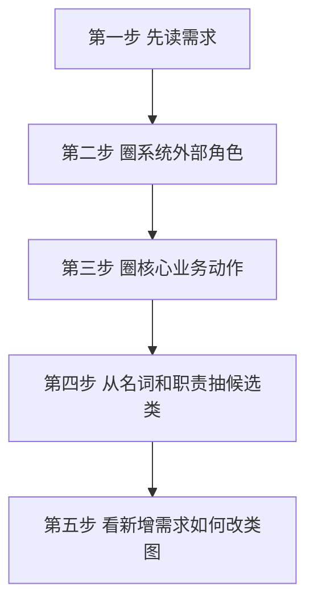
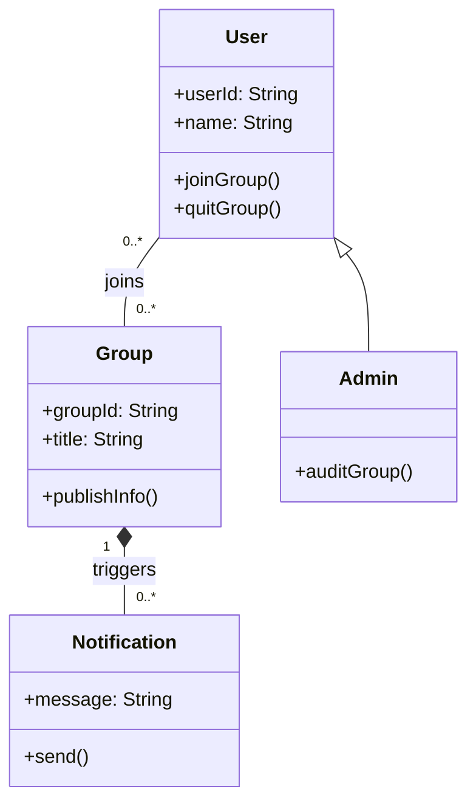

# 第 08 课：下午专题 III：UML / OO 设计（重写版）

## 课案信息

- 适用对象：软件设计师 2026 年 5 月备考
- 建议时长：120-150 分钟
- 使用前提：已完成 `L07 面向对象与 UML I`
- 课程定位：下午 OO/UML 固定大题模板课
- 本课目标：让你看到 OO/UML 下午题时，能按固定顺序读需求、看用例、读类图、改类图，而不是被术语和图形吓住

## Mermaid 预览说明

- 本课默认图示语言为 `Mermaid`
- 本地可用支持 Mermaid 的 Markdown 预览插件查看
- 若本地预览不方便，可直接粘贴到 [Mermaid Live Editor](https://mermaid.live/) 查看

## 资料依据

### 主依据

- `2018软件设计师教程_第5版_-_9787302491224.pdf`

### 本地真题锚点

- `doc/Software-Designer-master/真题/2018上.pdf`
- `doc/Software-Designer-master/真题/2018下.pdf`
- `doc/Software-Designer-master/真题/2016下.pdf`

### 辅助依据

- `doc/Software-Designer-master/README.md`
- `doc/agent/plans/20260311_sdes-course-plan_plan_v01.md`

## 当前样本结论

- 可直接核验的近年样本表明，下午 OO/UML 题的主轴通常不是“背定义”，而是：
  - `根据需求与给定图识别参与者/用例`
  - `根据需求与给定图识别类、关系、职责`
  - `在新增需求下修改类图或补全缺失类`
- `2018上` 能支撑：
  - `用例图 + 分析类图` 识别链路
- `2018下` 能支撑：
  - `已有类图 + 新需求 + 改图`
- `2016下` 能支撑：
  - OO 题并不总是只有一张类图，可能还带 `用例规约` 或 `状态图`
- 但本课主模板仍收敛在：
  - `读需求 -> 圈参与者/用例 -> 读类图 -> 处理新增需求改图`

## 学习目标

学完本课，你应该能做到：

1. 知道下午 OO/UML 大题通常在考什么
2. 形成一套稳定起手模板，而不是见题乱猜
3. 能从需求和用例规约里圈出参与者、核心用例、候选类
4. 能根据类图判断类关系、职责归属和缺失类
5. 能在“新增需求”场景下判断类图该怎么改
6. 为 `L09` 的设计模式题留出清晰边界，不再混课

## 前置知识

1. 已完成 `L07` 的基础识图训练
2. 已知道：
   - `对象 / 类 / 属性 / 操作`
   - `用例图` 看交互
   - `类图` 看结构
   - `关联 / 泛化 / 聚合 / 组合` 的基本判断法
3. 允许仍有术语不稳，但本课要把它们放进整题链路里用起来

## 一、先建立直觉：下午 OO/UML 大题不是“画图比赛”，而是“把需求翻译成结构”

很多人一看到下午 OO/UML 题，就会慌在这几件事上：

- 图很多
- 术语多
- 题干长
- 不知道先看哪

但真实考试里，你最先要做的不是“读懂每个符号”，而是：

> 把需求里的角色、功能、类、关系，按固定顺序翻译出来。

所以这道题本质上不是：

- 让你从零背 UML 教材

而是：

- 给你一个业务场景
- 给你一部分图或规约
- 看你能不能补出剩下的结构

你可以把这类题理解成：

- `第一层`：系统外面是谁在用它
- `第二层`：系统要完成哪些核心事情
- `第三层`：系统里面有哪些核心类
- `第四层`：当需求变了，哪些类和关系要跟着改

## 二、先看真实题到底怎么问

### 2.1 `2018上` 的稳定问法

这套样本显示：

- 题干先给需求
- 然后给用例图和分析类图
- 再问你图中的缺失项

这意味着它重点考：

1. 你能不能把需求映射到参与者和用例
2. 你能不能把功能背后的核心对象抽成分析类

### 2.2 `2018下` 的稳定问法

这套样本显示：

- 先给已有类图
- 再给一个新增需求
- 再问你类图怎么调整

这意味着它重点考：

1. 你不是只会看静态图
2. 你还得会在变化中改结构

### 2.3 `2016下` 的补充信号

这套样本说明：

- 同一题组里可能同时出现：
  - 用例规约
  - 状态图
  - 类图

所以你要建立的不是“只会一张图”，而是：

> 先抓主轴，再把其他图当辅助证据。

但这节课不把重点放在状态图模板，而是先把 OO/UML 下午题最常见、最稳定的主链条吃透。

## 三、下午 OO/UML 大题的固定起手模板

### 3.1 五步走

### 3.2 每一步具体在干什么

#### 第一步：先读需求，不先看图

很多人一上来就死盯图。

这是错的。

因为图只是题目已经替你做过一次抽象的结果，你先不读需求，就不知道：

- 哪些是主功能
- 哪些是附带行为
- 哪些是角色
- 哪些是系统内部对象

#### 第二步：圈系统外部角色

看谁在发起交互：

- 用户
- 管理员
- 驾驶员
- 顾客

这些通常优先考虑为 `参与者`。

#### 第三步：圈核心业务动作

看系统要做什么：

- 购买饮料
- 提交选课申请
- 发布群组信息
- 审核申请

这些通常优先考虑为 `用例` 或主业务动作。

#### 第四步：从名词和职责抽候选类

看系统内部要管理哪些东西：

- 用户
- 群组
- 订单
- 订单项
- 通知

这些通常优先考虑为 `类`。

#### 第五步：看新增需求如何改类图

这是下午题后半段最容易丢分的位置。

因为它不是让你再重复画一次原图，而是问你：

> 新需求进来后，旧结构哪里不够用了？

## 四、第一问最稳模板：用例与参与者怎么抓

### 4.1 最核心的一句

> 用例图看的是“谁希望系统帮他完成什么”。  

所以你先分清：

- `参与者`：系统外部角色
- `用例`：角色希望系统完成的功能

### 4.2 典型误判

#### 误判一：把系统内部对象当参与者

例如：

- 通知
- 日志
- 订单

这些通常不是参与者，而是系统内部对象或结果。

#### 误判二：把系统附带动作当核心用例

例如：

- 发送提醒
- 记录日志

它们可能出现在业务链路里，但未必都是题目想让你单独抽出来的主用例。

判断关键不是“有没有做”，而是：

> 它是不是由外部角色单独发起的独立业务目标。

### 4.3 答题快招

看到一个动作时，先问三句：

1. 谁发起它？
2. 这个动作是不是系统要对外提供的核心功能？
3. 它是独立目标，还是主流程完成后的附带行为？

## 五、第二问最稳模板：类图到底怎么读

### 5.1 看类图先看 4 件事

1. 有哪些类
2. 每个类大概负责什么
3. 类之间是什么关系
4. 哪个职责放错地方了

### 5.2 下午题常见失分点

#### 失分点一：类名不考试化

把：

- `读者`

写成：

- `读者信息`

这种表达虽然不完全错，但不够稳。

下午题更稳的是写“类”，不是写“信息表标题”。

#### 失分点二：把动作当属性

例如把：

- 借书
- 还书
- 续借

写成普通属性。

更稳的处理是：

- 在需求视角里，它们更像用例
- 在类职责里，它们更像操作

#### 失分点三：关系能看懂，但说不准

比如会说：

- “配送员和员工有关”

但答不到：

- `配送员` 是 `员工` 的特化 / 子类

这就会丢术语分。

### 5.3 一个小图把下午题常见关系再压一遍

你要先看出：

1. `Admin` 是 `User` 的一种，所以是泛化
2. `User` 与 `Group` 是关联
3. `Notification` 是主流程的附带结果，不应反过来当主参与者

## 六、第三问最稳模板：新增需求怎么改类图

### 6.1 这是 OO/UML 下午题最像“真本事”的地方

题目常常不会只让你识图，而是会说：

- 现在新需求来了
- 旧设计不够了
- 你要对图做什么修改

### 6.2 你不能只会“加一个类”

看到新需求，不要机械反应成：

- 再加一张框

你要先判断：

1. 旧类里哪个职责已经装不下了？
2. 是新增类，还是改关系，还是改继承层次？
3. 新需求会不会引起“一类对象可以包含另一类同类对象”这种递归结构？

### 6.3 用 `2018下` 的典型信号理解

样本里出现了：

- 一个群体可以作为另一个群体中的成员

这类变化考的不是死记答案，而是：

> 你能不能意识到“成员”不一定只是一类普通用户，类关系可能要支持更一般的组合结构。  

所以这类题常见的正确方向是：

- 调整关联关系
- 增加抽象层
- 引入更一般的成员结构

而不是只在原图里随便补一个框。

## 七、把整道 OO/UML 下午题压成一套答题模板

### 7.1 第一问：先从题干和用例规约抓参与者/用例

固定问自己：

1. 谁在用系统？
2. 这些人分别想让系统做什么？
3. 哪些动作是主用例，哪些是附带结果？

### 7.2 第二问：再从业务对象与职责抓类图

固定问自己：

1. 系统内部管理哪些核心对象？
2. 每个对象有哪些关键属性和操作？
3. 谁和谁是泛化、关联、聚合、组合？

### 7.3 第三问：最后看变化点怎么改图

固定问自己：

1. 新需求打破了旧图的哪条假设？
2. 哪个类或关系必须调整？
3. 这次变化是局部补丁，还是结构层级要升级？

## 八、真题风格综合例题

### 例题：社交群组平台

场景摘要：

- 用户可以创建群组、加入群组、退出群组
- 群组有标题、管理员和成员
- 成员可查看群组主页内容
- 群组主页发布或更新信息后，成员自动收到通知
- 新需求：一个群体可以作为另一个群体中的成员

问题：

1. 哪些应首先作为参与者，哪些应首先作为用例？
2. 在类图里，哪些应作为核心类？
3. “自动通知”为什么更适合看成系统结果，而不是主参与者？
4. 新需求为什么会逼着你修改原有类关系？

标准思路：

- 参与者优先看系统外部角色：`用户`、`管理员`
- 用例优先看外部角色的业务目标：`创建群组`、`加入群组`、`退出群组`
- 核心类优先看系统内部长期存在的结构：`用户`、`群组`、`通知`
- 新需求不是简单“再加一个字段”，而是可能改变“成员”这件事的抽象层级

## 九、随堂练习

说明：

- 本轮开始，练习更贴近下午题连续案例
- 继续严格考试口径批改
- 若只是“方向差不多”但结构和术语不稳，仍要扣分

### 综合练习：在线社群活动平台

- 总分：`15 分`
- 频次/优先级：`高频 / 最高`
- 类型：`下午题风格连续案例`

某在线社群活动平台有如下需求：

1. 用户可以创建活动群、加入活动群、退出活动群
2. 群主可以发布活动安排，成员可以查看活动安排
3. 平台会在活动安排更新后向群成员发送通知
4. 每个活动群包含群编号、群名称、群主、成员列表
5. 现在提出新需求：一个活动群可以作为另一个活动群的成员加入上级群

问题：

1. 哪些应优先作为参与者？哪些应优先作为主用例？  
   分值：`5 分`
2. 若从类图角度建模，至少应有哪些核心类？它们之间最核心的两类关系是什么？  
   分值：`5 分`
3. 面对第 `5` 条新需求，原有类图为什么可能不够？你认为应优先改“类”、改“关系”，还是改“抽象层级”？说明理由。  
   分值：`5 分`

## 十、课后作业

1. 用自己的话各写一句：
   - OO/UML 下午题第一眼先看什么
   - 用例图在整题里负责什么
   - 类图在整题里负责什么
   - 新需求改图题最容易错在哪里
2. 把“在线社群活动平台”画成一版 `Mermaid` 结构草图，至少包含：
   - 用户
   - 群主
   - 活动群
   - 通知
   - 用户与活动群的关系
3. 用不超过 `120` 字写出：
   - 为什么“自动通知”通常不是主参与者
4. 用不超过 `150` 字写出：
   - 当“一个群体可以成为另一个群体成员”时，为什么这通常不是简单加字段就能解决的问题

## 十一、常见错误

1. 把整个下午题当成“认图题”，不先读需求
2. 只会列参与者和用例，不会落到类图
3. 只会看静态类图，不会处理新增需求改图
4. 把系统附带动作误判成主用例或主参与者
5. 看见设计模式影子，就把整道题误做成设计模式题

## 十二、复盘清单

做完本课后，你至少应能独立回答：

1. 下午 OO/UML 大题的固定起手模板是什么？
2. 为什么必须先读需求，再看图？
3. 如何区分主用例和附带结果？
4. 如何从需求与图中判断核心类和类关系？
5. 新需求进来时，先看“旧图哪条假设失效”是什么意思？
6. 为什么 `L08` 是 OO/UML 整题模板课，而 `L09` 才是设计模式模板课？
