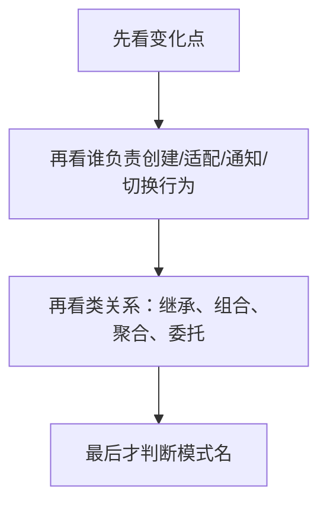
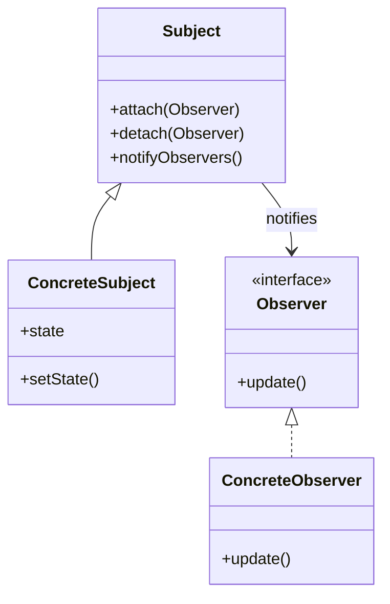

# 第 09 课：设计模式 Java 路线（重写版）

## 课案信息

- 适用对象：软件设计师 2026 年 5 月备考
- 建议时长：120-150 分钟
- 使用前提：已完成 `L07-L08`，能看懂基本类图、用例图与职责划分
- 课程定位：下午设计模式固定题模板课，也是 Java 路线的模式识别与落图课
- 本课目标：让你看到设计模式题时，不再只会背名字，而是先判断“这里为什么要用模式、角色各是谁、Java 里通常怎么落”

## Mermaid 预览说明

- 本课默认图示语言为 `Mermaid`
- 本地可用支持 Mermaid 的 Markdown 预览插件查看
- 若本地预览不方便，可直接粘贴到 [Mermaid Live Editor](https://mermaid.live/) 查看

## 资料依据

### 主依据

- `2018软件设计师教程_第5版_-_9787302491224.pdf`

### 本地真题锚点

- `doc/Software-Designer-master/真题/2017上.pdf`
- `doc/Software-Designer-master/真题/2018下.pdf`
- `doc/Software-Designer-master/真题/2019下.pdf`

### 辅助依据

- `doc/Software-Designer-master/README.md`
- `doc/agent/plans/20260311_sdes-course-plan_plan_v01.md`

### 本地证据口径说明

- 当前仓库内可稳定确认：
  - `2017上.pdf` 含生成器模式（Builder）相关样本
  - `2018下.pdf` 的 OO/UML 下午题中明确出现“采用了哪一种设计模式”的问法
  - `2019下.pdf` 可稳定命中观察者（Observer）模式样本
- 但并非每个模式都能在当前自动抽取链中稳定逐字还原题干
- 因此本课会把内容分成两层：
  - `稳定本地题源锚点`：明确标到本地 PDF 来源
  - `保守真题式案例`：保持软考常见问法和结构，但不伪装成官方逐字原题

## 当前样本结论

- 设计模式题真正考的不是“背 23 个名字”，而是：
  - 看类图或代码结构识别模式
  - 判断各角色类的职责
  - 解释为什么这样设计
  - 在新增需求下知道该改哪里
- Java 路线下，最常见的稳考法不是写完整工程，而是：
  - 给类图，问模式名和角色
  - 给代码骨架，补接口、抽象类、具体类
  - 给业务变化，问为什么某种模式更合适
- 本课重点不是覆盖所有模式，而是把考试真正高频、最容易互相混淆的模式讲透

## 学习目标

学完本课，你应该能做到：

1. 用人话解释“为什么会出现设计模式”
2. 区分“业务需求导致的变化点”和“只是代码写法不同”
3. 看类图或代码结构时，先从角色职责而不是模式名入手
4. 识别并说明 `单例 / 工厂方法 / 生成器 / 适配器 / 桥接 / 组合 / 装饰 / 外观 / 观察者 / 策略`
5. 用 Java 路线解释接口、抽象类、组合关系在模式中的落点
6. 形成一套下午设计模式题的固定答题模板

## 前置知识

1. 已掌握 `L07-L08` 的类、对象、接口、继承、组合等基本 OO/UML 概念
2. 允许你还不能完整手写 Java 模式代码
3. 本课会先讲“为什么要这样拆类”，再讲正式术语和答题模板

## 一、先别背模式名，先搞懂模式为什么会出现

很多人第一次学设计模式，最容易犯两个错误：

1. 以为模式是一套必须套上的“标准答案”
2. 以为模式题就是背定义题

这两个都不对。

模式出现的根本原因只有一句：

> 代码里某类变化经常重复出现，直接硬写会让职责混乱、耦合变高、扩展困难，于是人们把比较稳的拆法总结成了模式。

例如：

- 如果“对象怎么创建”总在变化，就会出现创建型模式
- 如果“一个类怎样兼容另一套接口”总在变化，就会出现结构型模式
- 如果“对象之间怎样协作、怎样通知、怎样切换行为”总在变化，就会出现行为型模式

所以考试里最重要的第一反应不是：

- “这像不像我背过的某张表”

而是：

> 这里到底哪件事经常变，原设计为什么扛不住了？

## 二、什么时候不用模式

这是考试外最重要、但考试内也能帮你判断的一点。

如果：

1. 变化根本不存在
2. 只有一个实现，短期也不会扩展
3. 引入中间层只会把代码搞得更绕

那就不要为了“显得高级”硬套模式。

例如：

- 一个配置类全局只需一份实例，且生命周期明确，用单例可能合理
- 但一个普通工具类如果只是无状态静态方法，强行改单例没有收益
- 一个系统只有一种支付方式时，先直接写一个实现类比先造“策略家族”更稳

所以答模式题时，除了说“为什么用”，你也要隐含知道：

> 模式不是装饰品，而是为了解决变化点、降低耦合、明确职责。

## 三、下午设计模式题到底怎么问

从本地可确认样本看，常见问法稳定收敛在这几类：

1. 给类图，问采用了哪种模式
2. 给模式意图或业务背景，问类图中各角色对应什么类
3. 给 Java 代码骨架，问应补哪个接口、抽象类或具体实现
4. 给新需求，问为什么原结构要改成另一种模式
5. 问某模式的优点、适用场景、与相近模式的区别

你可以把设计模式下午题压成下面这个流程：



顺序千万别反。

因为很多模式一眼看名字很像，但如果你从“职责和变化点”入手，反而更好分。

## 四、先打底：Java 路线里最重要的 4 个设计直觉

### 4.1 面向接口编程

人话是：

> 先约定“能做什么”，再决定“具体谁来做”。

例如：

- `MessageSender` 是接口
- `EmailSender`、`SmsSender` 是具体实现

模式里很多“可替换性”都建立在这个直觉上。

### 4.2 组合优于继承

人话是：

> 如果只是“需要一个对象来帮我做事”，优先考虑把它当成员变量，而不是一上来就继承它。

这条直觉对 `桥接`、`装饰`、`策略`、`观察者` 都很关键。

### 4.3 一类一责

如果某个类同时负责：

- 创建对象
- 执行业务
- 发通知
- 切换策略

那它多半已经该拆了。

### 4.4 找变化点

考试里最值钱的不是记角色名，而是知道：

- 是“产品种类”在变
- 还是“构建步骤”在变
- 还是“算法行为”在变
- 还是“通知对象集合”在变

一旦变化点找准，模式就容易认了。

## 五、创建型模式：对象怎么创建最稳

### 5.1 单例模式 Singleton

#### 人话定义

整个系统里，这个类通常只应该有一个实例，而且要提供全局访问点。

#### 直觉类比

像一栋楼只有一个总配电柜。你不会每次用电都新建一个总配电柜。

#### Java 落点

- 私有构造方法
- 静态成员保存唯一实例
- 提供 `getInstance()`

#### 稳定识别信号

1. 构造器私有
2. 类自己持有自己的唯一实例
3. 外部只能通过静态方法拿实例

#### 什么时候不用

- 无状态工具类
- 有明确容器生命周期管理的对象
- 多线程延迟加载要求复杂且收益不大时

### 5.2 工厂方法模式 Factory Method

#### 人话定义

把“具体创建哪个产品对象”这件事，从业务使用者手里分离出去，交给工厂层或子类决定。

#### 直觉类比

你只说“我要点一杯饮料”，至于做成咖啡、奶茶还是果汁，不该散落在十几个业务类里到处 `new`。

#### 稳定识别信号

1. 有抽象产品接口
2. 有多个具体产品
3. 有创建者角色，负责返回产品对象
4. 业务方依赖抽象产品，不依赖具体类名

#### 和简单工厂的区别

- 简单工厂：一个工厂类里集中 `if/else` 或 `switch`
- 工厂方法：把“创建哪个产品”的差异下沉到不同工厂子类

#### 考试快招

如果题目重点在：

- “新增产品类型时尽量不改原业务逻辑”
- “把对象创建和使用分开”

优先想到工厂类家族。

### 5.3 生成器模式 Builder

#### 人话定义

对象很复杂，创建过程有多个步骤，而且“构建步骤”和“最终表示”最好分离。

#### 直觉类比

点一份套餐，步骤可能都是：

1. 选主食
2. 选饮料
3. 选配菜

但“商务套餐”和“儿童套餐”最后拼出来的内容不同。

#### 稳定本地题源锚点

- `2017上.pdf` 可稳定确认生成器模式样本

#### 稳定识别信号

1. 有 `Builder` 抽象构建者
2. 有 `ConcreteBuilder`
3. 有 `Director` 或显式构建流程控制者
4. 强调“按步骤构造复杂对象”

#### 和工厂方法的区别

- 工厂方法更关心“创建哪一种对象”
- 生成器更关心“复杂对象按什么步骤组装出来”

## 六、结构型模式：类和对象怎么连得更稳

### 6.1 适配器模式 Adapter

#### 人话定义

一个现有类很好用，但接口不符合当前系统期望，于是包一层“翻译器”。

#### 类比

国标插头插不进英标插座，中间要转接头。

#### 稳定识别信号

1. 系统期望的是 `Target`
2. 现有可复用类是 `Adaptee`
3. `Adapter` 负责把旧接口转成新接口

#### 什么时候想到它

- 老系统接新系统
- 第三方类库接口改不了
- 旧类本身没错，只是接口不兼容

### 6.2 桥接模式 Bridge

#### 人话定义

把“抽象部分”和“实现部分”拆成两个可独立变化的维度，再用组合连起来。

#### 类比

遥控器和电视品牌是两个维度：

- 遥控器可以有基础版、增强版
- 电视可以是索尼、海信、TCL

如果直接继承，会炸成很多组合类；如果桥接，就让“遥控器持有电视实现”。

#### 稳定识别信号

1. `Abstraction` 持有 `Implementor`
2. 两条变化线可以独立扩展
3. 不是简单兼容旧接口，而是“避免多维度类爆炸”

### 6.3 组合模式 Composite

#### 人话定义

把“单个对象”和“对象组合”统一对待，形成树形结构。

#### 类比

文件系统里：

- 单个文件
- 文件夹

用户希望它们都能执行“显示、统计、删除”等操作，但文件夹里面还能再套文件夹。

#### 稳定识别信号

1. 明显树形结构
2. 叶子对象和容器对象共享统一接口
3. 容器里能递归包含同类型组件

### 6.4 装饰模式 Decorator

#### 人话定义

不改原类，不大量派生子类，而是在运行时一层层包上新职责。

#### 类比

一杯咖啡，可以按需加奶、加糖、加冰。不是为“咖啡加奶加糖加冰”每一种组合都单独建子类。

#### 稳定识别信号

1. 装饰者和被装饰对象实现同一接口
2. 装饰者内部持有组件对象
3. 新职责通过“包裹”叠加

### 6.5 外观模式 Facade

#### 人话定义

子系统很复杂，对外提供一个统一入口，帮你把繁琐调用流程收起来。

#### 类比

去政务大厅办事，不需要自己分别敲十个处室的门，而是先到一个统一窗口。

#### 稳定识别信号

1. 后面是一堆复杂子系统
2. 前面有一个简单统一接口
3. 重点在“简化使用”，不是“增强职责”

## 七、行为型模式：对象之间怎么协作最稳

### 7.1 观察者模式 Observer

#### 人话定义

一个对象状态变化时，依赖它的多个对象要自动得到通知并更新。

#### 稳定本地题源锚点

- `2019下.pdf` 可稳定确认观察者模式样本
- `2018下.pdf` 的社交群组平台题可作为“通知型需求如何指向观察者”的稳定本地样本

#### 类比

公众号发消息，订阅它的人会收到更新。

#### Java 落点

- `Subject` 维护观察者列表
- `Observer` 提供更新接口
- 状态变化时遍历通知



#### 考试快招

只要题干出现：

- 发布后自动通知
- 状态变化后多个对象同步更新
- 订阅 / 广播 / 推送

优先想到观察者。

### 7.2 策略模式 Strategy

#### 人话定义

把一组可互换的算法或行为封装起来，让调用方在运行时切换。

#### 类比

打车路线可以走：

- 最短距离
- 最短时间
- 避开收费

路线规则在变，但“计算路线”这个任务没变。

#### 稳定识别信号

1. 有抽象策略接口
2. 有多个具体策略类
3. 上下文对象持有策略引用并可切换

#### 和状态模式的区别

- 策略：调用者通常主动选算法
- 状态：对象随内部状态变化而切换行为

## 八、最容易混的模式，怎么一刀分开

| 容易混淆 | 关键区别 |
| --- | --- |
| 工厂方法 vs 生成器 | 一个更关心“创建哪种产品”，一个更关心“复杂对象如何分步构建” |
| 适配器 vs 外观 | 一个解决“接口不兼容”，一个解决“调用太复杂” |
| 桥接 vs 适配器 | 一个是提前按两维拆开避免类爆炸，一个是事后兼容旧接口 |
| 装饰 vs 继承扩展 | 一个运行时包裹叠加职责，一个编译期靠子类展开 |
| 观察者 vs 策略 | 一个是通知关系，一个是算法切换 |
| 组合 vs 聚合/普通关联 | 组合模式强调“树形统一处理”，不只是整体部分关系 |

## 九、下午设计模式题固定答题模板

### 9.1 第一步：先写变化点

例如：

- 新增产品种类
- 新增通知对象
- 新增构建步骤
- 需要兼容旧接口

### 9.2 第二步：再写角色职责

例如：

- 抽象产品
- 具体产品
- 抽象工厂 / 具体工厂
- 主题 / 观察者
- 抽象构建者 / 具体构建者

### 9.3 第三步：最后写模式名和好处

常用收益词：

- 降低耦合
- 易于扩展
- 屏蔽具体实现
- 支持运行时切换
- 统一访问入口

### 9.4 一句考试化表述模板

你可以直接套：

> 该设计主要解决的是“______ 经常变化而调用方不希望直接依赖具体实现”的问题，因此采用 `______` 模式。图中的 `A` 对应 `______` 角色，`B` 对应 `______` 角色。这样做的好处是 `______`。

## 十、真题锚点与真题式案例

### 稳定本地题源锚点

1. `2017上.pdf`
   - 可稳定确认生成器模式样本
   - 适合绑定“复杂对象分步创建”的讲解
2. `2018下.pdf`
   - 可稳定确认“图中采用了哪一种设计模式”的问法
   - 适合绑定“先看类关系再认模式名”的讲解
3. `2019下.pdf`
   - 可稳定确认观察者模式样本
   - 适合绑定“状态变化通知多个对象”的讲解

### 保守真题式案例

以下案例保持软考常见问法，但不冒充官方逐字原题：

#### 案例 1：消息通知平台

- 业务变化：新增短信、邮件、站内信等通知渠道
- 稳定结论：若只是“切换发送算法”，更像 `策略`
- 若是“用户订阅后自动收到状态更新”，更像 `观察者`

#### 案例 2：报表导出平台

- 业务变化：新增 PDF、Excel、HTML 导出格式
- 稳定结论：如果重点在“创建不同产品对象”，优先想到 `工厂`

#### 案例 3：复杂配置对象构建

- 业务变化：同一对象有多种构建顺序与组合
- 稳定结论：优先想到 `生成器`

## 十一、设计模式全考点详解：按考试可识别信号来学

这一节是对前面内容的补强。设计模式不能只学“名字 + 定义”，否则题目一换类名就会失效。每个模式都按下面四个问题学习：

1. 它解决什么变化点
2. 类图或代码里有什么识别信号
3. Java 路线下通常怎么落地
4. 它最容易和谁混

### 11.1 创建型模式总览：把 `new` 从业务代码里拿出来

创建型模式的共同问题是：

> 对象创建过程会变化，业务代码不应该到处直接依赖具体类。

如果题里出现大量 `new ConcreteClass()`，且新增类型时到处改调用方，就要想到创建型模式。

| 模式 | 解决的问题 | 典型识别信号 |
| --- | --- | --- |
| Singleton 单例 | 全局只需要一个实例 | 私有构造器、静态实例、`getInstance()` |
| Simple Factory 简单工厂 | 集中创建不同产品 | 一个工厂方法里按参数分支创建 |
| Factory Method 工厂方法 | 创建逻辑交给工厂子类 | 抽象产品 + 具体产品 + 抽象工厂 + 具体工厂 |
| Abstract Factory 抽象工厂 | 创建一整族相关产品 | 一个工厂能创建多个相关产品接口 |
| Builder 生成器 | 复杂对象分步骤构建 | Builder、ConcreteBuilder、Director、步骤方法 |
| Prototype 原型 | 复制已有对象创建新对象 | `clone()`、复制原型、对象创建成本高 |

### 11.2 抽象工厂：不是“更高级的工厂方法”，而是“一族产品一起换”

#### 人话定义

抽象工厂解决的是：

> 系统需要创建一组相互配套的产品，而且希望整组产品可以一起切换。

#### 直觉例子

做一套 UI 主题：

- Windows 风格按钮 + Windows 风格文本框
- Mac 风格按钮 + Mac 风格文本框

你不希望出现：

- Windows 按钮 + Mac 文本框

所以要让一个工厂负责创建同一族产品。

#### Java 落点

```java
interface UIFactory {
    Button createButton();
    TextBox createTextBox();
}

class WindowsFactory implements UIFactory {
    public Button createButton() { return new WindowsButton(); }
    public TextBox createTextBox() { return new WindowsTextBox(); }
}
```

#### 考试识别信号

1. 产品不止一种
2. 产品之间属于同一“族”
3. 切换工厂后，一组产品一起变化

#### 易混点

- 工厂方法：一个工厂方法常聚焦一种产品等级结构
- 抽象工厂：一个工厂接口里常有多个创建方法，创建一族产品

### 11.3 原型模式：不是普通复制，而是用已有对象当模板

#### 人话定义

如果创建一个对象很麻烦，或者对象结构已经调好，就复制已有对象来生成新对象。

#### 直觉例子

你做了一份复杂简历模板，后面不是每次从零排版，而是复制一份再改姓名和项目。

#### Java 落点

- 实现 `Cloneable`
- 重写 `clone()`
- 注意浅拷贝和深拷贝

#### 考试识别信号

1. 题干强调“复制已有对象”
2. 创建成本高
3. 对象结构复杂但已有原型可复用

#### 易错点

不要把“只要 new 一个对象”都叫原型。必须有“以已有实例为模板复制”的意思。

### 11.4 结构型模式总览：把类和对象连得更稳

结构型模式共同问题是：

> 已有类、接口、对象之间怎样组合，才能少改代码、少爆炸、少耦合。

| 模式 | 解决的问题 | 典型识别信号 |
| --- | --- | --- |
| Adapter 适配器 | 旧接口和新接口不兼容 | Target、Adapter、Adaptee |
| Bridge 桥接 | 两个维度独立变化 | Abstraction 持有 Implementor |
| Composite 组合 | 树形结构统一处理 | Component、Leaf、Composite |
| Decorator 装饰 | 动态叠加职责 | 装饰者和组件同接口，装饰者持有组件 |
| Facade 外观 | 简化复杂子系统入口 | 一个统一门面类调用多个子系统 |
| Flyweight 享元 | 大量细粒度对象共享 | 内部状态共享、外部状态传入 |
| Proxy 代理 | 控制对真实对象访问 | Proxy 和 RealSubject 同接口 |

### 11.5 享元模式：大量对象重复时，先问能不能共享

#### 人话定义

享元模式解决的是：

> 系统里有大量相似小对象，如果每个都完整保存，会浪费内存；把可共享部分抽出来复用。

#### 直觉例子

棋盘上有很多棋子，但“黑棋样式”“白棋样式”可以共享，每颗棋子只单独保存位置。

#### 正式区分

- 内部状态：可共享，不随场景变化
- 外部状态：不可共享，由调用方传入

#### 考试识别信号

1. 大量对象
2. 对象粒度小
3. 很多属性重复
4. 题干强调节省内存

#### 易混点

享元不是缓存一切对象。它强调“共享内部状态”，不是简单把结果放 Map 里。

### 11.6 代理模式：不是替换对象，而是控制访问

#### 人话定义

代理模式让一个代理对象站在真实对象前面，控制访问、延迟加载、记录日志或做权限检查。

#### 直觉例子

你不能直接找老板签合同，要先经过助理安排、审核、转交。

#### Java 落点

- 代理类和真实类实现同一接口
- 代理类内部持有真实对象
- 调用前后增加控制逻辑

#### 常见类型

- 远程代理：代表远程对象
- 虚拟代理：延迟创建昂贵对象
- 保护代理：权限控制
- 智能引用：访问时额外计数、日志等

#### 和装饰模式的区别

- 装饰：重点是动态增强功能
- 代理：重点是控制访问

### 11.7 行为型模式总览：对象之间怎么分工协作

行为型模式共同问题是：

> 多个对象之间的行为、职责、通知、算法、状态怎样变化，才能不把所有逻辑塞进一个大类。

| 模式 | 解决的问题 | 典型识别信号 |
| --- | --- | --- |
| Chain of Responsibility 职责链 | 请求沿链传递，谁能处理谁处理 | 后继者、处理请求、链式传递 |
| Command 命令 | 把请求封装成对象 | Command、Invoker、Receiver、execute |
| Interpreter 解释器 | 解释一种语言或表达式 | 文法、表达式类、解释方法 |
| Iterator 迭代器 | 顺序访问聚合对象内部元素 | `hasNext()`、`next()` |
| Mediator 中介者 | 多对象复杂交互集中协调 | 同事类不直接互相调用 |
| Memento 备忘录 | 保存并恢复对象状态 | Originator、Memento、Caretaker |
| Observer 观察者 | 状态变化通知多个依赖对象 | Subject、Observer、notify |
| State 状态 | 对象状态变化导致行为变化 | Context 持有 State |
| Strategy 策略 | 多种算法可互换 | Context 持有 Strategy |
| Template Method 模板方法 | 固定算法骨架，子类改步骤 | 抽象类定义流程，钩子方法 |
| Visitor 访问者 | 新操作频繁增加，对象结构稳定 | Visitor、Element、accept |

### 11.8 职责链模式：请求不是一次性指定处理者，而是沿链找人

#### 人话定义

多个对象都有机会处理请求，请求沿链传递，直到某个对象处理或链结束。

#### 直觉例子

报销审批：

- 组长能批 1000 以下
- 经理能批 10000 以下
- 总监能批更高金额

申请人不需要知道最终谁批，只把请求交给链头。

#### 考试识别信号

1. 多个处理者
2. 每个处理者持有下一个处理者
3. 自己不能处理就传递

#### 易混点

它不是普通 `if/else`。职责链强调处理者对象可以动态组成链，并解耦发送者和具体处理者。

### 11.9 命令模式：把“要做的事”封装成对象

#### 人话定义

把请求封装成命令对象，让调用者不直接依赖执行者。

#### 直觉例子

遥控器按钮不需要知道电视内部怎么开机，只持有一个“开机命令”。

#### Java 落点

```java
interface Command {
    void execute();
}

class TurnOnCommand implements Command {
    private TV tv;
    public void execute() { tv.turnOn(); }
}
```

#### 考试识别信号

1. 有 `Command` 接口
2. 有 `execute()`
3. 有调用者 `Invoker`
4. 有真正执行者 `Receiver`

#### 适用

- 撤销 / 重做
- 队列请求
- 日志记录
- 宏命令

### 11.10 模板方法：流程固定，步骤可变

#### 人话定义

父类定义算法骨架，某些步骤留给子类实现。

#### 直觉例子

泡饮料流程固定：

1. 烧水
2. 冲泡
3. 倒入杯中
4. 加调料

泡茶和泡咖啡的“冲泡”和“加调料”不同，但整体流程一致。

#### 考试识别信号

1. 抽象类中有一个固定流程方法
2. 流程方法按顺序调用若干抽象步骤
3. 子类重写步骤，不改整体流程

#### 和策略模式的区别

- 模板方法靠继承，流程骨架在父类
- 策略模式靠组合，算法对象可替换

### 11.11 状态模式：不是主动选择算法，而是状态变了行为跟着变

#### 人话定义

对象内部状态不同，同一个操作表现不同。

#### 直觉例子

订单可以处于：

- 待支付
- 已支付
- 已发货
- 已取消

同样是 `cancel()`，不同状态下结果不同。

#### 考试识别信号

1. `Context` 持有 `State`
2. 状态对象封装行为
3. 状态切换会改变后续行为

#### 和策略模式的区别

- 策略：外部通常主动选择算法
- 状态：对象状态自然演变导致行为改变

### 11.12 备忘录模式：保存状态，但不破坏封装

#### 人话定义

在不暴露对象内部细节的情况下，保存对象某一时刻状态，以便之后恢复。

#### 直觉例子

编辑器的撤销功能。

#### 考试识别信号

1. 原发器保存自身状态
2. 备忘录对象保存快照
3. 管理者负责保存备忘录，但不直接改内部状态

### 11.13 中介者模式：多对象乱连时，用一个中介统一协调

#### 人话定义

对象之间关系太复杂，不让它们互相直接调用，而是通过中介者协调。

#### 直觉例子

机场塔台协调飞机起降。飞机之间不互相喊话，统一听塔台。

#### 考试识别信号

1. 很多对象互相依赖
2. 引入 `Mediator`
3. 同事类只与中介者通信

#### 和外观模式的区别

- 外观：给外部简化访问子系统
- 中介者：协调系统内部多个对象交互

### 11.14 访问者模式：对象结构稳定，但新操作经常增加

#### 人话定义

把作用于对象结构中各元素的操作封装成访问者，使新增操作时不用改元素类。

#### 直觉例子

一组固定的报表元素：

- 标题
- 表格
- 图表

现在要支持导出 PDF、导出 HTML、统计字数。元素结构稳定，但操作类型不断增加。

#### 考试识别信号

1. 有 `Visitor`
2. 元素有 `accept(Visitor)`
3. 访问者里有针对不同元素的访问方法

#### 易错点

访问者适合对象结构稳定。如果元素类型经常增加，访问者反而麻烦。

### 11.15 解释器模式：小语言、小语法才适合

#### 人话定义

给定一种语言的文法表示，并定义解释器来解释句子。

#### 直觉例子

规则表达式：

- `A AND B`
- `A OR B`
- `NOT A`

可以把每种语法结构建成表达式类。

#### 考试识别信号

1. 出现文法、语法树、表达式
2. 每类表达式有解释方法
3. 问题规模通常不大

### 11.16 迭代器模式：遍历集合，但不暴露内部结构

#### 人话定义

提供一种顺序访问聚合对象元素的方法，而不暴露底层存储结构。

#### Java 落点

- `Iterator`
- `hasNext()`
- `next()`

#### 考试识别信号

1. 聚合对象内部可能是数组、链表、树
2. 外部只想按统一方式遍历

## 十二、设计原则：模式题背后的判分语言

设计模式题经常不是只问模式名，也会问“为什么这样设计”。这时可以用设计原则组织答案。

### 12.1 开闭原则

人话：

> 对扩展开放，对修改关闭。

新增功能时尽量加新类，而不是改老类核心逻辑。

### 12.2 单一职责原则

人话：

> 一个类只负责一类变化原因。

如果一个类既创建对象、又处理业务、又发通知，基本就违反了。

### 12.3 依赖倒置原则

人话：

> 高层模块不要依赖低层具体实现，都依赖抽象。

Java 里常体现为依赖接口而不是依赖具体类。

### 12.4 里氏替换原则

人话：

> 子类对象应该能替换父类对象而不破坏程序正确性。

如果子类为了复用父类却推翻父类行为，继承关系就不稳。

### 12.5 接口隔离原则

人话：

> 不要强迫类实现它用不到的方法。

大而全接口容易导致空实现和职责污染。

### 12.6 迪米特法则

人话：

> 一个对象尽量少知道其他对象的内部细节。

降低耦合，避免“牵一发动全身”。

## 十三、随堂练习

说明：

- 本轮继续按严格考试口径批改
- 若只会说“像某某模式”，但说不出变化点、角色职责、为什么不是相近模式，不能按满分算

### 练习 1：模式识别

- 分值：`6 分`
- 频次/优先级：`高频 / 最高`

某系统中有：

- `Subject` 维护订阅者列表
- `Observer` 定义 `update()`
- 当 `Subject` 状态变化时，自动遍历并调用所有观察者的 `update()`

问题：

1. 该结构最稳应判断为什么模式？
2. 它解决的变化点是什么？
3. 为什么它不是策略模式？

### 练习 2：工厂与生成器区分

- 分值：`8 分`
- 频次/优先级：`高频 / 高`

场景 A：

- 系统有 `PdfReport`、`ExcelReport`、`HtmlReport`
- 调用方只关心 `Report` 接口

场景 B：

- 系统要构建一份复杂部署清单
- 构建步骤固定为“准备基础信息 -> 选择组件 -> 生成脚本 -> 生成摘要”
- 不同部署类型最终结果不同

问题：

1. 场景 A 更像哪类模式？为什么？
2. 场景 B 更像哪类模式？为什么？
3. 两者最核心的区别是什么？

### 练习 3：适配器、外观、桥接区分

- 分值：`8 分`
- 频次/优先级：`中高频 / 高`

问题：

1. “旧支付 SDK 很好用，但接口和当前系统不一致”，更像什么模式？
2. “支付子系统很复杂，对外想只暴露一个 `pay()` 入口”，更像什么模式？
3. “支付方式和结算渠道两条维度都要独立扩展”，更像什么模式？
4. 请分别用一句人话说明理由。

### 练习 4：Java 落地判断

- 分值：`6 分`
- 频次/优先级：`高频 / 中高`

某 Java 代码中：

- 构造器私有
- 类中有一个 `private static` 成员保存自身实例
- 提供 `public static getInstance()`

问题：

1. 这是什么模式？
2. 为什么这样写？
3. 在什么情况下不必强行这么写？

## 十四、课后作业

1. 用自己的话各写一句：
   - 为什么设计模式会出现
   - 为什么模式不是越多越好
   - 为什么答题时应先看变化点
2. 把 `观察者模式` 画成一版 `Mermaid classDiagram`
3. 自拟一个“导出报表”业务，分别写出：
   - 若用工厂方法，变化点是什么
   - 若用策略模式，变化点是什么
4. 回答：
   - 为什么 `适配器` 不是“任何中间层都算”

## 十五、常见错误

1. 一上来先背模式名，不先找变化点
2. 看见接口很多，就误判成策略或工厂
3. 把“兼容旧接口”和“统一简化入口”混成一种模式
4. 把“复杂对象分步构造”和“创建不同产品对象”混成一类
5. 只会说优点，不会说什么时候不用
6. 看到通知机制就喊观察者，却说不出主题、观察者各是谁

## 十六、复盘清单

做完本课后，你至少应能独立回答：

1. 设计模式到底是在解决什么问题？
2. 为什么答题顺序应是“变化点 -> 角色职责 -> 模式名”？
3. 工厂方法和生成器怎么区分？
4. 适配器、桥接、外观怎么区分？
5. 观察者和策略怎么区分？
6. Java 路线里，接口、抽象类、组合为什么反复出现？
