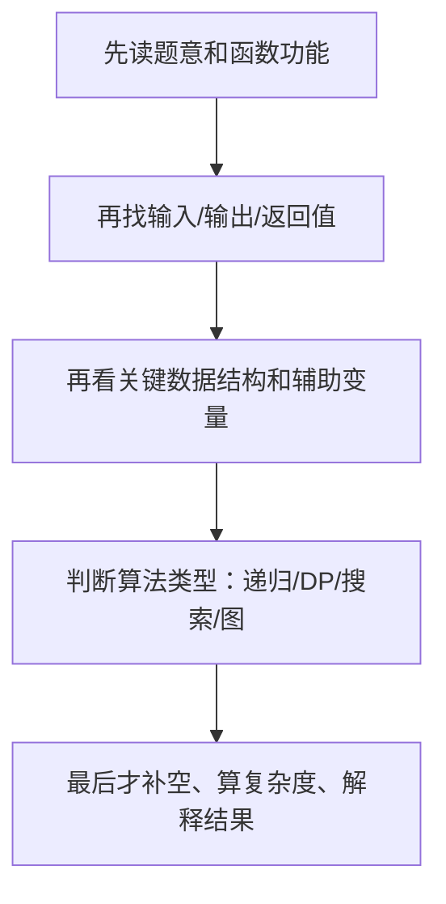

# 第 10 课：算法与代码题 II（重写版）

## 课案信息

- 适用对象：软件设计师 2026 年 5 月备考
- 建议时长：120-150 分钟
- 使用前提：已完成 `L03`，知道基础数据结构、复杂度、二叉树、图、动态规划的入门直觉
- 课程定位：下午算法与代码题模板课，不是 `L03` 的复读，而是“怎么把基础知识放进下午题里用”
- 本课目标：让你看到代码阅读、补空、递推、图算法、复杂度题时，先按模板拆题，而不是只会看懂一点点代码就停住

## Mermaid 预览说明

- 本课默认图示语言为 `Mermaid`
- 本地可用支持 Mermaid 的 Markdown 预览插件查看
- 若本地预览不方便，可直接粘贴到 [Mermaid Live Editor](https://mermaid.live/) 查看

## 资料依据

### 主依据

- `2018软件设计师教程_第5版_-_9787302491224.pdf`

### 本地真题锚点

- `doc/Software-Designer-master/真题/2016上.pdf`
- `doc/Software-Designer-master/真题/2018上.pdf`
- `doc/Software-Designer-master/真题/2019上.pdf`
- `doc/Software-Designer-master/真题/2019下.pdf`

### 辅助依据

- `doc/Software-Designer-master/README.md`
- `doc/agent/plans/20260311_sdes-course-plan_plan_v01.md`
- 已有重写课案 `03_数据结构与算法I_重写版.md`

### 本地证据口径说明

- 当前仓库内可稳定确认：
  - `2016上.pdf` 含递归式与动态规划代码样本
  - `2018上.pdf` 含钢条切割类递归 / 自顶向下 / 自底向上样本
  - `2019上.pdf` 可命中回溯类样本
  - `2019下.pdf` 可命中背包类递归式与代码样本
- 但并非每题都能稳定无噪声逐字提取
- 因此本课对“原题题干”只在做题轮回到原 PDF，本课内主要用“稳定题型锚点 + 保守真题式案例”

## 当前样本结论

- 下午算法与代码题真正拉分的，不是你记住多少代码，而是你能不能：
  - 先判断题属于哪一类算法套路
  - 读懂变量和递推关系
  - 知道该从输入输出、循环不变量、状态定义、辅助结构四个角度拆
- `L03` 解决的是“基础概念能看懂”
- `L10` 解决的是“考试时看到完整大题，怎么按固定模板拿分”

## 学习目标

学完本课，你应该能做到：

1. 看到一段 C/伪代码时，先定位输入、输出、状态和关键循环
2. 看递归式时，能判断它更像 `递归搜索 / 动态规划 / 回溯`
3. 遇到树和图题时，能快速判断该看 `栈 / 队列 / 邻接关系 / 松弛过程 / 入度`
4. 遇到补空题时，知道先补“含义”和“边界”，再补具体语句
5. 遇到复杂度题时，能从循环层数、递归分支、图规模参数入手
6. 把下午算法题压成可复用的答题模板

## 前置知识

1. 已掌握 `L03` 的基础内容：
   - 栈、队列、树、图
   - 复杂度
   - 动态规划入门直觉
2. 不要求你能独立完整手写所有算法
3. 但必须接受：考试里“看懂并判断”通常比“默写整段代码”更重要

## 一、为什么 L10 不是 L03 的重复

`L03` 更像打地基：

- 什么是栈
- 为什么树遍历常配合栈
- 拓扑排序为什么不唯一
- 动态规划为什么是“保存子问题结果”

`L10` 更像上楼：

- 给你一段真实题风格代码，怎么读
- 给你递推式，怎么转成状态定义
- 给你补空，先补哪一行最稳
- 给你图算法，怎么识别它是拓扑、最短路还是搜索

所以本课最重要的一句不是某个算法定义，而是：

> 下午题要先认“模板”，再认“细节”。

## 二、下午算法题固定起手模板

这五步比你记代码更重要。

## 三、第一大类：代码阅读题怎么读

### 3.1 先不要逐行翻译，先回答四个问题

1. 这段代码想求什么？
2. 输入是什么？
3. 输出是什么？
4. 中间最关键的状态变量是谁？

例如遇到：

- `maxValue`
- `best`
- `dist`
- `visited`
- `dp`

你就要立刻警觉：这些不是普通局部变量，它们往往就是算法核心状态。

### 3.2 再看控制结构

#### 循环题

重点看：

- 循环层数
- 边界条件
- 每轮更新了什么

#### 递归题

重点看：

- 终止条件
- 递归调用参数怎么变
- 返回值如何合并

#### 图题

重点看：

- 邻接矩阵还是邻接表
- `dist` / `indegree` / `visited` 这些变量是什么意思
- 是否有“松弛”或“删除入度为 0 顶点”的过程

### 3.3 考试快招

如果一段代码你看不懂，不要立刻从第一行死抠。先看：

- 函数名
- 返回语句
- 关键数组
- 最内层更新语句

很多题的灵魂只藏在这几个位置。

## 四、第二大类：递归、记忆化、动态规划怎么区分

### 4.1 先用人话区分

- `递归搜索`：把大问题拆成更小问题，直接往下试
- `记忆化搜索`：递归搜索，但把已经求过的结果存起来
- `动态规划`：明确状态和转移，按顺序把小问题结果推到大问题

### 4.2 你最该先找的不是“这是不是 DP”

而是：

1. 状态是什么？
2. 状态怎么转？
3. 初始条件是什么？
4. 结果在哪个状态里？

### 4.3 稳定本地题源锚点

1. `2016上.pdf`
   - 可稳定确认“递归式 + C 代码 + 最优子结构”样本
2. `2018上.pdf`
   - 可稳定确认钢条切割类样本，明确出现：
     - 递归式
     - 自顶向下
     - 自底向上
3. `2019下.pdf`
   - 可稳定确认背包类递归 / 状态定义样本

### 4.4 钢条切割为什么是理解 DP 的好例子

因为它把 4 件事放在一题里：

1. 目标函数：求最大收益
2. 递归式：从所有切法中取最大值
3. 重叠子问题：同长度钢条的最优收益会重复算
4. 两种实现：记忆化和自底向上

这说明：

> DP 不是“看见表格才叫 DP”，而是“有状态、有最优子结构、有重叠子问题，并且结果可复用”。

### 4.5 动态规划识别信号

1. 题目在求最优值、最大值、最小值、方案数
2. 问题能拆成相似子问题
3. 同一个子问题会反复出现
4. 可以按某种顺序从小规模推出大规模

### 4.6 和回溯的区别

- 回溯：试错、撤销、继续枚举
- DP：复用已求结果，不走回头路

一句快记：

> 回溯更像“把路都试一遍”，DP 更像“把算过的答案存起来反复用”。

## 五、第三大类：树与递归代码题怎么拿分

### 5.1 树题常见问法

1. 遍历顺序是什么
2. 非递归实现为什么要用栈
3. 某节点在递归返回时做了什么
4. 某算法的时间复杂度和空间复杂度是什么

### 5.2 先认结构，再认语句

只要你看到：

- 左右孩子
- 先递归左子树再递归右子树
- 栈保存结点

就要先判断：

- 这是前序、中序、后序哪一种
- 是递归版本还是非递归版本

### 5.3 非递归题为什么常配栈

因为栈最像“替你保存递归调用现场”。

例如中序遍历：

1. 一路向左压栈
2. 出栈访问
3. 再转向右子树

所以遇到“非递归 + 树遍历”时，第一反应不是死背代码，而是：

> 栈里保存的是“后续还要回来处理的结点”。

## 六、第四大类：图算法题怎么识别

### 6.1 图题别先怕公式，先看关键词

| 题面信号 | 优先想到 |
| --- | --- |
| 任务依赖、先后顺序、A 先于 B | 拓扑排序 |
| 最短路径、最小代价、源点到各点距离 | 最短路径 |
| 连通、最小成本把点连起来 | 最小生成树 |
| 遍历所有可能路径 | 搜索 / 回溯 |

### 6.2 拓扑排序最值钱的两句话

1. 只适用于有向无环图
2. 结果不一定唯一

如果代码里出现：

- `indegree`
- 入度为 `0` 的顶点入队或入栈

那它大概率就是拓扑排序。

### 6.3 最短路径的稳定识别信号

如果代码里出现：

- `dist[]`
- 不断更新 `dist[v] = min(dist[v], dist[u] + w)`

那你至少要想到“松弛”。

至于具体是 Dijkstra 还是 Floyd，再看：

- 单源还是全源
- 是邻接矩阵三重循环，还是每轮选一个当前最短未确定点

### 6.4 图题复杂度怎么想

不要只盯 `n`。

图题常同时看：

- 顶点数 `n`
- 边数 `e`

因此很多标准答案会写成：

- `O(n + e)`
- `O(n^2)`
- `O(n^3)`

## 七、第五大类：回溯题和搜索题怎么判断

### 7.1 稳定本地题源锚点

- `2019上.pdf` 可稳定命中回溯类样本

### 7.2 回溯题典型特征

1. 试一个选择
2. 若不合适则撤销
3. 再试下一个选择

典型场景：

- `n` 皇后
- 排列组合
- 子集枚举
- 图中路径搜索

### 7.3 你该重点看什么

1. 当前层在决定什么
2. 约束条件是什么
3. 失败后怎么撤销
4. 什么时候记录答案

如果代码里反复出现：

- `place`
- `check`
- `undo`
- `return`

多半就是回溯风格。

## 八、第六大类：补空题怎么做

很多人补空题丢分，不是因为不会算法，而是补空顺序错了。

最稳顺序是：

1. 先补变量含义
2. 再补边界条件
3. 再补转移语句
4. 最后补输出或返回

### 8.1 为什么先补边界

因为边界错了，后面全错。

例如 DP 题最常见的坑就是：

- `dp[0]` 是多少
- 第一行第一列怎么初始化

### 8.2 为什么不要一上来猜某个公式

因为很多空其实不是考你会不会背，而是在考你有没有先看清：

- 这行是在比较
- 还是在累加
- 还是在取最小
- 还是在保存路径

## 九、第七大类：复杂度题怎么速算

### 9.1 循环题

- 单层循环：多半 `O(n)`
- 两层嵌套：多半 `O(n^2)`
- 三层嵌套：多半 `O(n^3)`

### 9.2 递归题

先问：

1. 每层分几个分支
2. 深度多大
3. 是否有重复子问题被缓存

### 9.3 图题

先看：

- 遍历所有顶点和边，常见 `O(n + e)`
- 邻接矩阵三重循环，常见 `O(n^3)`

### 9.4 DP 题

复杂度常由“状态总数 × 每个状态转移代价”决定。

例如：

- `dp[i]` 只枚举一个常数级选择，可能 `O(n)`
- `dp[i][j]` 再枚举一重切分点，可能 `O(n^3)` 或 `O(mn)`

## 十、真题锚点与真题式案例

### 稳定本地题源锚点

1. `2016上.pdf`
   - 递归式、最优子结构、C 代码
2. `2018上.pdf`
   - 钢条切割，明确适合讲 `递归 -> 记忆化 -> 自底向上`
3. `2019上.pdf`
   - 回溯类样本
4. `2019下.pdf`
   - 背包类递归 / 状态定义样本

### 保守真题式案例

#### 案例 1：最优收益问题

- 问法：给收益数组和长度，求最大收益
- 重点：识别状态、转移、边界

#### 案例 2：任务调度问题

- 问法：给前驱关系，输出一组合法执行顺序
- 重点：识别拓扑排序，不误写成普通遍历

#### 案例 3：树遍历补空题

- 问法：补足栈操作，完成非递归中序遍历
- 重点：解释栈里到底保存什么

## 十一、下午算法代码题全考点详解

这一节补齐 `L10` 的核心缺口：算法题不是“知道一些名词”就能做，而是要能把题目拆成输入、状态、循环、递推、边界和复杂度。下面按考试常见考点逐个讲。

### 11.1 数组与线性表：最基础，但最容易藏边界

#### 人话理解

数组和线性表题通常不是考你会不会定义“顺序存储”，而是考：

- 下标从哪里开始
- 插入删除时元素怎么移动
- 边界会不会越界

#### 典型考法

1. 给伪代码，问循环次数
2. 给数组插入删除，问移动元素个数
3. 给顺序查找或二分查找，问比较次数

#### 二分查找必须讲透

二分查找适用于有序序列。每次比较中间元素：

- 目标小于中间值，就去左半边
- 目标大于中间值，就去右半边
- 相等则找到

复杂度为什么是 `O(log n)`？

因为每次都把候选范围砍半，不是一个一个排除。

#### 易错点

- `while (low <= high)` 和 `while (low < high)` 的边界含义不同
- `mid = (low + high) / 2` 在真实工程里可能溢出，但软考更关注逻辑边界
- 二分查找前提是有序，不是任何数组都能二分

### 11.2 排序：不用背所有代码，但要知道代价和稳定性

#### 为什么排序常考

排序是复杂度、比较次数、稳定性、存储结构的综合题。

#### 必须掌握的排序对比

| 排序 | 核心思想 | 平均复杂度 | 稳定性 | 适合记法 |
| --- | --- | --- | --- | --- |
| 直接插入排序 | 把新元素插入已排序部分 | `O(n^2)` | 稳定 | 像整理扑克牌 |
| 冒泡排序 | 相邻比较，大元素后移 | `O(n^2)` | 稳定 | 每轮冒出最大或最小 |
| 简单选择排序 | 每轮选最小放前面 | `O(n^2)` | 不稳定 | 选位置 |
| 快速排序 | 分区递归 | 平均 `O(n log n)` | 不稳定 | 基准划分 |
| 归并排序 | 分治后合并 | `O(n log n)` | 稳定 | 两路归并 |
| 堆排序 | 建堆、取堆顶 | `O(n log n)` | 不稳定 | 完全二叉树 |

#### 稳定性怎么理解

如果两个元素关键字相同，排序后相对顺序不变，就叫稳定。

例子：

- `90分的张三`
- `90分的李四`

如果排序后张三仍在李四前面，就是稳定。

#### 考试快招

- 问“稳定性”：直接插入、冒泡、归并通常稳定
- 问“平均最快”：快排、归并、堆排都是 `O(n log n)`
- 问“最坏仍 O(n log n)”：归并、堆排更稳；快排最坏可到 `O(n^2)`

### 11.3 串与 KMP：不要背 next，先懂为什么不回退主串

#### 人话定义

串匹配是在主串中找模式串出现的位置。

朴素匹配失败后，主串位置会回退再试。KMP 的价值是：

> 主串指针不回退，利用模式串自身的重复结构跳过不必要比较。

#### 直觉例子

如果你已经知道模式串前面一段和后面一段相同，失败时就没必要从头再比。

#### 题里常考什么

1. 给 `next` 数组，问匹配过程
2. 给匹配代码，补失败后模式串下标怎么移动
3. 问 KMP 为什么比朴素匹配快

#### 快招

看到：

- `next[]`
- 模式串下标回退
- 主串下标不回退

优先想到 KMP。

### 11.4 树：遍历、线索、堆、哈夫曼都要分清

#### 二叉树遍历

- 前序：根、左、右
- 中序：左、根、右
- 后序：左、右、根
- 层序：按层从左到右，通常用队列

#### 根据遍历序列还原树

最常考组合：

- 前序 + 中序
- 后序 + 中序

为什么必须有中序？

因为中序能把左右子树分开。

#### 哈夫曼树

人话：

> 权值越大的字符，编码越短；整体带权路径长度最小。

构造方法：

1. 每次取两个最小权值节点合并
2. 新节点权值为两者之和
3. 重复直到只剩一棵树

考点：

- 求带权路径长度
- 判断编码是否前缀码

#### 堆

堆是一棵完全二叉树。

- 大根堆：父节点不小于孩子
- 小根堆：父节点不大于孩子

堆常和优先队列、堆排序绑定。

### 11.5 图：四类题要一眼分开

#### 图的存储

- 邻接矩阵：适合稠密图，查两点是否相连快，空间 `O(n^2)`
- 邻接表：适合稀疏图，空间接近 `O(n+e)`

#### DFS 与 BFS

- DFS：深度优先，常用栈或递归
- BFS：广度优先，常用队列

#### 最小生成树

适用对象：

- 无向连通带权图

目标：

- 用最小总权值连接所有顶点

典型算法：

- Prim：从点集扩展
- Kruskal：按边权从小到大选边，避免成环

#### 最短路径

- Dijkstra：单源最短路径，常要求权值非负
- Floyd：任意两点最短路径，典型三重循环

#### 拓扑排序

适用对象：

- 有向无环图

核心过程：

1. 找入度为 0 的顶点
2. 输出它
3. 删除它及其出边
4. 更新后继顶点入度

### 11.6 分治、贪心、动态规划、回溯：四个策略怎么分

#### 分治

人话：

> 把大问题拆成相互独立的小问题，分别解决后合并。

典型：

- 归并排序
- 快速排序
- 二分查找

识别信号：

- 分解
- 求解子问题
- 合并

#### 贪心

人话：

> 每一步都选当前看起来最好的选择，希望最终也最好。

典型：

- 活动选择
- 最小生成树
- 哈夫曼编码

易错点：

不是所有“选最大的 / 最小的”都是正确贪心。必须满足贪心选择性质。

#### 动态规划

人话：

> 子问题会重复，保存它们的答案，再按状态转移推结果。

必须说清四件事：

1. 状态
2. 转移
3. 边界
4. 结果位置

#### 回溯

人话：

> 一步步试，发现不行就撤销，再试别的路。

典型：

- n 皇后
- 子集枚举
- 排列

### 11.7 补空题专项：常见空到底在考什么

| 空的位置 | 通常考什么 | 做法 |
| --- | --- | --- |
| 初始化前几行 | 边界条件 | 先看 `0`、`1`、空串、空集合 |
| 循环条件 | 范围控制 | 看是否包含最后一个元素 |
| if 条件 | 约束判断 | 看什么时候更新、什么时候跳过 |
| 数组更新 | 状态转移 | 找等号左边状态含义 |
| return | 结果位置 | 看题目最终要求什么 |

补空题的核心不是猜语法，而是先解释：

> 这一空在算法里承担什么职责。

### 11.8 C 代码阅读最小语法包

软件设计师下午算法题常用 C 语言，但你不需要成为 C 专家。至少要能看懂：

- 数组下标从 `0` 或 `1` 开始
- `for` 循环边界
- `while` 循环终止条件
- 指针和数组的简单访问
- 函数返回值
- 结构体字段访问

常见坑：

- `=` 是赋值，`==` 是比较
- `&&` 是且，`||` 是或
- `i++` 是先用后加，`++i` 是先加后用
- 数组越界在题目里通常通过边界空来考

### 11.9 复杂度专项：不能只会数循环

#### 常见复杂度从小到大

`O(1) < O(log n) < O(n) < O(n log n) < O(n^2) < O(n^3) < O(2^n) < O(n!)`

#### 递归复杂度怎么看

如果每层分成两个子问题，每次规模减半，常见是 `O(n log n)`，如归并排序。

如果每层分成两个子问题，每次规模减一，可能指数级。

#### DP 复杂度怎么看

看：

- 状态总数
- 每个状态计算代价

例如：

- 一维 `dp[n]`，每个状态常数转移：`O(n)`
- 二维 `dp[n][m]`，每个状态常数转移：`O(nm)`
- 每个状态还枚举一个切分点：再乘一层

### 11.10 下午算法题答题模板

遇到算法题，按下面顺序写草稿：

1. 功能：这段程序要解决什么问题
2. 输入：输入变量分别代表什么
3. 状态：关键数组或变量代表什么
4. 边界：最小规模时答案是什么
5. 转移：每一步如何从旧状态得到新状态
6. 结果：最终输出或返回哪个值
7. 复杂度：循环、递归或状态规模是多少

这套模板比直接背代码稳，因为大多数下午题就是围绕这些空提问。

## 十二、随堂练习

说明：

- 本轮继续按严格考试口径批改
- 只答“像动态规划”但说不出状态和边界，不按满分算

### 练习 1：算法分类

- 分值：`6 分`
- 频次/优先级：`高频 / 最高`

下面 4 个场景分别更像哪类算法？请各给一句理由：

1. 求装满背包的最大价值
2. 输出任务依赖图的一种合法执行顺序
3. 枚举 `n` 皇后的所有放法
4. 在二叉树中用非递归方式做中序遍历

### 练习 2：DP 四件套

- 分值：`8 分`
- 频次/优先级：`高频 / 高`

某题已知递归式：

`f(n) = max{price[i] + f(n-i)}`

问题：

1. 这类题为什么容易想到动态规划？
2. 状态是什么？
3. 转移是什么？
4. 边界至少应考虑什么？

### 练习 3：图算法判断

- 分值：`8 分`
- 频次/优先级：`高频 / 高`

某段伪代码中有：

- `indegree[]`
- “将所有入度为 0 的顶点入队”
- “弹出顶点后，将其后继顶点入度减 1”

问题：

1. 该算法是什么？
2. 它适用于哪类图？
3. 为什么答案序列不一定唯一？

### 练习 4：复杂度速算

- 分值：`6 分`
- 频次/优先级：`高频 / 中高`

判断下列说法对错，并给一句理由：

1. 只要用了递归，复杂度一定比循环高
2. 图算法复杂度只看顶点数，不看边数
3. 动态规划复杂度通常和状态总数有关
4. 非递归树遍历常见辅助空间与树高有关

## 十三、课后作业

1. 回答：
   - 为什么下午算法题先认模板比先抠代码更重要？
2. 用你自己的话写出：
   - 动态规划的 4 个核心问题：状态、转移、边界、结果
3. 画一张 `Mermaid` 流程图，表示“算法题如何判断更像递归、DP、回溯还是图算法”
4. 自拟一个“最短路径”或“任务调度”的场景，说明你会先看哪些关键变量

## 十四、常见错误

1. 一拿到代码就逐行翻译，不先找输入输出
2. 看见递归就喊 DP，看见搜索就喊回溯
3. 不会区分“算法思想”和“具体代码细节”
4. 拓扑排序不会抓“入度为 0”的核心
5. 动态规划只会背结论，不会说状态和边界
6. 复杂度题只会机械数循环，不会看图规模和递归分支

## 十五、复盘清单

做完本课后，你至少应能独立回答：

1. 下午算法题固定起手模板是什么？
2. 如何区分递归搜索、记忆化搜索、动态规划？
3. 树题为什么常和栈绑定？
4. 图题怎么快速识别是拓扑排序还是最短路径？
5. 补空题为什么先补边界再补转移？
6. 复杂度题为什么不能只看循环层数？
