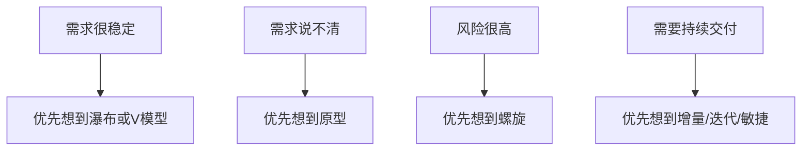

# 第 11 课：软件工程与测试（重写版）

## 课案信息

- 适用对象：软件设计师 2026 年 5 月备考
- 建议时长：120-150 分钟
- 使用前提：已完成 `L01-L10` 的主线推进，尤其是已适应“先人话、再类比、再题型模板”的学习方式
- 课程定位：上午软件工程与测试高频综合模块课
- 本课目标：让你看到生命周期模型、需求、测试、质量、配置管理、项目管理题时，不再把它们看成零散名词，而是看成一条完整的软件交付链

## Mermaid 预览说明

- 本课默认图示语言为 `Mermaid`
- 本地可用支持 Mermaid 的 Markdown 预览插件查看
- 若本地预览不方便，可直接粘贴到 [Mermaid Live Editor](https://mermaid.live/) 查看

## 资料依据

### 主依据

- `2018软件设计师教程_第5版_-_9787302491224.pdf`

### 本地真题池

- `doc/Software-Designer-master/真题/2016下.pdf`
- `doc/Software-Designer-master/真题/2017下.pdf`
- `doc/Software-Designer-master/真题/2019下.pdf`
- `doc/Software-Designer-master/真题/2020下.pdf`

### 辅助依据

- `doc/Software-Designer-master/README.md`
- `doc/agent/plans/20260311_sdes-course-plan_plan_v01.md`

### 本地证据口径说明

- 本模块的近年本地 PDF 在自动文本抽取时，题号级、逐字级还原稳定性弱于数据库、UML、设计模式、算法几条线
- 因此本课采用如下口径：
  - `知识讲解` 以主教材为主
  - `真题导向判断` 以本地真题池的长期高频范围为准
  - `案例部分` 只写保守真题式案例，不冒充官方逐字原题
- 后续如果进入“做题 / 批改轮”，默认回到上述本地 PDF 原题池，不在本课内自行改写整题题干

## 当前样本结论

- 软件工程与测试不是一堆孤立名词，而是一条从“怎么做软件”到“怎么验证软件”的链
- 上午题在这一模块最爱考的不是“你背了多少英文缩写”，而是：
  - 生命周期模型的适用场景
  - 需求、设计、维护各在解决什么问题
  - 测试层次和测试方法如何区分
  - 质量、配置管理、项目管理中的核心概念差异
- 如果你只是死背“瀑布、白盒、黑盒、基线”，很容易在选项稍微变形后失分

## 学习目标

学完本课，你应该能做到：

1. 用人话解释常见软件过程模型的差异
2. 知道需求、设计、编码、测试、维护各自解决什么问题
3. 区分 `单元 / 集成 / 系统 / 验收` 测试
4. 区分 `白盒 / 黑盒`，并识别常见测试方法
5. 理解软件质量、配置管理、变更控制、基线、审计的职责边界
6. 形成上午软件工程与测试题的固定判断模板

## 前置知识

1. 不要求你有完整软件项目管理经验
2. 只要求你理解“软件不是一口气写完就结束，而是有生命周期”
3. 本课默认你还没把这些术语串成一条线，这正是本课要解决的问题

## 一、先建立主线：软件工程到底在解决什么

### 1.1 最重要的人话定义

软件工程不是“会写代码”。

它更像：

> 用可控、可重复、可管理的方式把软件做出来、交出去、维护住。

为什么要这样？

因为真实项目不是一个人一晚写完的小脚本，而是会遇到：

- 需求变化
- 团队协作
- 质量风险
- 版本回退
- 交付压力
- 维护成本

所以软件工程题真正考的是：

> 你知不知道在一个项目里，不同阶段各自解决什么问题。

### 1.2 一个最省脑子的类比

把盖房子搬过来理解：

- 需求：客户到底要几层、几室几厅
- 设计：结构图、施工图怎么画
- 编码：真正施工
- 测试：验房、查漏水、查承重
- 维护：入住后维修与改造

如果你把这些步骤混在一起，就会像“房子盖一半才问客户要几层”一样混乱。

## 二、生命周期模型：项目怎么走完全程

### 2.1 先别背名字，先看“变化多不多”

模型的选择，核心不在定义，而在项目特征：

- 需求稳不稳
- 风险高不高
- 是否需要频繁交付
- 用户能不能持续参与反馈

### 2.2 瀑布模型 Waterfall

#### 人话定义

把项目按阶段顺序往下走，前一阶段结果作为后一阶段输入。

#### 类比

像做标准化考试教材出版：

1. 先确定目录
2. 再写稿
3. 再审稿
4. 再排版
5. 再印刷

#### 适用场景

- 需求稳定
- 变更少
- 过程规范明确

#### 风险

- 用户反馈来得晚
- 前期错了，后期返工成本高

### 2.3 原型模型 Prototype

#### 人话定义

先做一个可交流的雏形，让用户尽快看到效果，帮助澄清需求。

#### 类比

装修前先做效果图或样板间。

#### 适用场景

- 用户自己也说不清需求
- 界面、交互、业务流程需要尽快对齐

#### 风险

- 用户误把原型当成最终产品
- 团队把“试探用原型”硬变成正式系统基础

### 2.4 螺旋模型 Spiral

#### 人话定义

每一轮都做一小圈，但每一圈都先重点分析风险。

#### 类比

先做小范围试点，评估风险，再决定下一轮扩多大。

#### 适用场景

- 高风险项目
- 技术、业务、成本不确定性高

#### 关键词

- 风险驱动

### 2.5 增量模型与迭代模型

#### 人话理解

- 增量：每次交付一部分可用功能
- 迭代：同一功能不断优化完善

很多题里这两个会一起出现，你只要先抓住一句：

> 都比“最后一次性全部交付”更灵活。

### 2.6 敏捷开发 Agile

#### 人话定义

需求会变，就用短周期、小步快跑、持续反馈的方式开发。

#### 适用信号

- 用户参与频繁
- 需求变化快
- 希望尽快交付可用版本

#### 不要误解

敏捷不是“不写文档”“不做设计”“不测试”。

它是：

> 更强调持续协作、快速反馈和迭代交付。

### 2.7 模型选型快招



## 三、需求、设计、编码、维护分别在做什么

### 3.1 需求阶段

核心问题不是“写文档”，而是：

- 系统到底要解决什么业务问题
- 谁会用它
- 哪些功能是必须的
- 哪些约束不能违反

一句快记：

> 需求阶段先搞清“要什么”，不是先决定“怎么写代码”。

### 3.2 设计阶段

设计分两层理解就够用：

- 概要设计：模块怎么分、系统怎么搭
- 详细设计：每个模块内部怎么实现

如果题目问：

- 架构
- 模块划分
- 接口设计
- 数据结构选择

这些都更偏设计阶段。

### 3.3 编码阶段

就是把设计落成程序，但考试一般不在本模块深究编码细节，而更关心：

- 编码规范
- 可维护性
- 与测试、配置管理的配合

### 3.4 维护阶段

维护不是“代码出 bug 才修”。

教材和考试常把维护分成：

- 改正性维护：修故障
- 适应性维护：适应环境变化
- 完善性维护：增强功能、提升性能
- 预防性维护：为未来问题提前处理

你不用死背英文，只要先抓住“为什么改”。

## 四、测试层次：软件是怎么一层层验的

### 4.1 单元测试 Unit Test

验证最小可测单元是否正确。

直觉上更像：

- 测一个函数
- 测一个类
- 测一个模块内部逻辑

### 4.2 集成测试 Integration Test

验证模块之间接口和协作是否正确。

例如：

- 登录模块和权限模块对接
- 订单模块和支付模块联调

### 4.3 系统测试 System Test

验证整个系统是否满足整体需求。

### 4.4 验收测试 Acceptance Test

更强调：

- 用户或甲方视角
- 是否达到交付标准

一句快记：

> 单元测“自己”，集成测“连接”，系统测“整体”，验收测“交付”。

### 4.5 一个常见误区

很多人把“黑盒”“白盒”当测试层次。

其实不是。

- 单元/集成/系统/验收：是按测试对象和范围分层
- 黑盒/白盒：是按测试设计方法分类

## 五、白盒测试与黑盒测试：别再混

### 5.1 白盒测试

#### 人话定义

知道程序内部结构，按逻辑路径和控制结构去设计测试。

#### 常见考点

- 语句覆盖
- 判定覆盖
- 条件覆盖
- 路径覆盖

#### 快速理解

- 语句覆盖：每条语句至少执行一次
- 判定覆盖：每个判断结果都至少出现真、假
- 条件覆盖：复合条件中的每个条件都取到真、假
- 路径覆盖：尽量覆盖不同执行路径

### 5.2 黑盒测试

#### 人话定义

不关心内部代码怎么写，只关心输入输出和业务规则。

#### 常见考点

- 等价类划分
- 边界值分析
- 判定表
- 因果图

### 5.3 最稳的一刀

- 白盒：看代码内部结构
- 黑盒：看外部行为和规则

### 5.4 边界值为什么高频

因为很多 bug 不出在“中间正常值”，而出在：

- 最小值
- 最大值
- 临界值
- 越界一点点

## 六、质量、配置管理、项目管理三件事别再混

### 6.1 软件质量

质量不是“有没有 bug”这么简单。

考试里常见质量属性包括：

- 功能性
- 可靠性
- 易用性
- 效率
- 可维护性
- 可移植性

你不必一口气背所有大词，但要知道：

> 质量属性是在问“这个软件好在哪一类能力”，不是在问“开发流程做到了哪一步”。

### 6.2 配置管理

配置管理更像：

> 把软件相关工件管住，不让版本、变更、状态、责任失控。

常见词：

- 配置项
- 基线
- 版本控制
- 变更控制
- 状态报告
- 配置审计

#### 基线怎么理解

可以把基线想成：

> 当前已确认、可追踪、后续修改必须走控制流程的正式版本。

### 6.3 项目管理

项目管理关心的是：

- 进度
- 成本
- 人员
- 风险
- 范围

它比“写代码”更上层。

如果题目提到：

- 关键路径
- 里程碑
- 工期压缩
- 风险应对

这些通常是项目管理口径。

### 6.4 CMMI 怎么记

不用硬背长定义，先记成熟度是“过程管理能力”的分级。

软件设计师层级下，先知道它在衡量：

- 过程是否可管理
- 是否可度量
- 是否持续优化

就够应付大多数选择题。

## 七、把整个模块压成一套上午判断模板

### 7.1 先判断题在问哪一层

1. 在问开发过程模型？
2. 在问生命周期阶段职责？
3. 在问测试层次？
4. 在问测试方法？
5. 在问质量属性？
6. 在问配置管理还是项目管理？

### 7.2 再看关键词

| 关键词 | 优先想到 |
| --- | --- |
| 需求不清、先做雏形 | 原型模型 |
| 风险分析 | 螺旋模型 |
| 需求稳定、阶段顺序明确 | 瀑布/V 模型 |
| 输入输出、边界、规则 | 黑盒测试 |
| 路径、分支、条件、语句 | 白盒测试 |
| 版本、基线、变更审批 | 配置管理 |
| 工期、成本、资源、风险 | 项目管理 |

### 7.3 一句考试化答题模板

> 本题考查的是 `______` 的职责 / 适用场景。因为题干强调 `______`，所以应优先判断为 `______`，而不是 `______`。

## 八、保守真题式案例

### 案例 1：教务系统建设

场景：

- 校方需求一开始不够清晰
- 希望先做一个可以演示的选课界面

稳定结论：

- 这类题先想到 `原型模型`

### 案例 2：支付系统测试

场景：

- 金额字段允许 `0~99999`
- 问你如何设计测试数据

稳定结论：

- 先想到 `边界值分析`

### 案例 3：发布流程治理

场景：

- 每次发版前都要确认当前代码、文档、测试报告处于同一正式版本

稳定结论：

- 先想到 `基线` 与 `配置管理`

## 九、软件工程全考点详解：从“想做什么”到“交付后怎么维护”

这一节补齐软件工程模块的完整考点。不要把软件工程学成名词表，要把它看成一条链：


### 9.1 可行性研究：不是“能不能写代码”，而是“值不值得做”

#### 人话定义

可行性研究是在项目正式投入前判断：

> 这个系统从技术、经济、法律、运行环境上是否值得做、能不能做。

#### 四类常考可行性

| 类型 | 人话解释 | 题目关键词 |
| --- | --- | --- |
| 技术可行性 | 技术上能不能实现 | 技术路线、平台、性能、人员能力 |
| 经济可行性 | 投入产出是否划算 | 成本、收益、投资回收期 |
| 操作可行性 | 用户和组织能不能用起来 | 用户接受度、业务流程、培训 |
| 法律可行性 | 是否违反法规或合同 | 版权、隐私、合规、许可 |

#### 易错点

不要把“技术上能写出来”当成全部可行性。考试题经常把“用户不接受”“成本过高”“违反法规”放进干扰项。

### 9.2 需求工程：把“用户想要”变成“系统应当做什么”

#### 人话定义

需求工程不是简单记录用户原话，而是要把模糊、冲突、遗漏的想法整理成可分析、可设计、可验证的需求。

#### 需求工程常见活动

1. 需求获取：访谈、问卷、观察、原型、资料分析
2. 需求分析：消除冲突、补齐遗漏、建立模型
3. 需求规格说明：形成 SRS 等正式文档
4. 需求验证：检查需求是否正确、完整、一致、可行
5. 需求管理：后续需求变化要可追踪、可控制

#### 功能需求和非功能需求

- 功能需求：系统要做什么，比如登录、查询、下单、审批
- 非功能需求：系统做得怎么样，比如性能、安全、可靠性、易用性、可维护性

#### 例子

“系统应支持用户查询订单”是功能需求。

“订单查询响应时间不超过 2 秒”是非功能需求。

#### 易错点

不要把“性能高、安全好”当成功能需求。它们通常是质量或约束要求。

### 9.3 结构化分析与面向对象分析：两个视角不要混

#### 结构化分析

更关注：

- 数据怎么流动
- 加工怎么处理数据
- 数据存储在哪里

典型工具：

- DFD 数据流图
- 数据字典
  - 数据流定义
  - 数据存储定义
  - 加工说明

#### 面向对象分析

更关注：

- 系统里有哪些对象
- 对象有什么属性和操作
- 对象之间如何协作

典型工具：

- 用例图
- 类图
- 顺序图
- 状态图

#### 考试快招

题目出现：

- 外部实体、加工、数据流、数据存储：优先结构化分析
- 参与者、用例、类、对象、消息：优先 OO/UML

### 9.4 软件设计：概要设计和详细设计不是一回事

#### 概要设计

人话：

> 先把系统切成哪些大块，确定模块、接口、数据总体结构和架构。

常见产物：

- 模块结构图
- 系统架构
- 数据库总体设计
- 外部接口设计

#### 详细设计

人话：

> 具体到每个模块内部怎么做，算法、数据结构、类、函数逻辑是什么。

常见产物：

- 程序流程图
- N-S 图
- PAD 图
- 伪代码
- 类方法详细说明

#### 内聚和耦合

这是设计题高频。

##### 内聚

模块内部各元素联系有多紧。

越高越好。

从差到好大致可以理解为：

- 偶然内聚：一堆不相干功能凑一起，最差
- 逻辑内聚：逻辑上类似但由参数选择具体功能
- 时间内聚：同一时间执行的一堆操作放一起
- 过程内聚：按流程顺序相关
- 通信内聚：操作同一数据
- 顺序内聚：前一部分输出是后一部分输入
- 功能内聚：只完成一个明确功能，最好

##### 耦合

模块之间依赖有多强。

越低越好。

从差到好可按直觉记：

- 内容耦合：直接访问别人内部，最差
- 公共耦合：共享全局数据
- 外部耦合：依赖外部协议、设备、格式
- 控制耦合：传控制信号决定别人内部逻辑
- 标记耦合：传复杂数据结构，只用其中一部分
- 数据耦合：只传必要数据，较好
- 非直接耦合：模块之间无直接关系，最好

#### 设计原则快招

> 高内聚、低耦合，是软件设计题最常用的判断方向。

### 9.5 软件复用与构件：不是复制粘贴

#### 人话定义

软件复用是把已有的软件资产用于新系统，以降低成本、提高质量和效率。

可复用对象包括：

- 需求模型
- 设计模型
- 代码模块
- 测试用例
- 文档
- 构件

#### 构件

构件可以理解为：

> 有明确接口、可独立部署或组合的软件单元。

#### 易错点

复制粘贴代码不是高质量复用。高质量复用强调接口清晰、可组合、可维护。

### 9.6 软件维护全考点：先看“为什么改”

维护题不要先背四类名称，先看变更原因。

| 维护类型 | 为什么改 | 例子 |
| --- | --- | --- |
| 改正性维护 | 原来有错 | 修复支付金额计算 bug |
| 适应性维护 | 外部环境变了 | 适配新浏览器、新操作系统、新法规 |
| 完善性维护 | 用户想更好用 | 增加报表、优化性能 |
| 预防性维护 | 预防未来问题 | 重构、清理技术债、增强可测试性 |

#### 维护成本为什么高

因为维护时经常要面对：

- 老代码没人懂
- 文档不全
- 原设计不清晰
- 改一处影响多处

所以前期设计质量会影响后期维护成本。

### 9.7 软件质量模型：每个质量属性都要能举例

| 质量属性 | 人话解释 | 例子 |
| --- | --- | --- |
| 功能性 | 功能是否满足需求 | 能否正确完成下单 |
| 可靠性 | 能否稳定运行 | 长时间运行不崩溃 |
| 易用性 | 用户是否容易学会和操作 | 界面清楚、错误提示友好 |
| 效率 | 时间和资源消耗是否合理 | 响应时间短、CPU 占用低 |
| 可维护性 | 是否容易修改和定位问题 | 模块清晰、日志完整 |
| 可移植性 | 是否容易迁移到新环境 | 支持多平台部署 |

#### 易错点

“系统跑得快”不是可靠性，而更接近效率。

“系统坏了容易修”不是可靠性，而更接近可维护性。

### 9.8 软件评审：不是测试，但也在找问题

#### 人话定义

评审是在软件生命周期中，由人对需求、设计、代码、测试文档等进行检查。

#### 常见类型

- 同行评审
- 走查
- 审查

#### 和测试区别

- 评审：不一定运行程序，靠检查工件发现问题
- 测试：运行程序或执行测试过程发现问题

### 9.9 风险管理：不是出事后救火

风险是可能发生、会造成损失的不确定事件。

常见步骤：

1. 风险识别
2. 风险分析
3. 风险规划
4. 风险监控

应对策略：

- 规避：改变计划，让风险不发生
- 转移：把风险影响转给第三方，如保险、外包
- 缓解：降低概率或影响
- 接受：知道风险存在，但成本上选择接受

### 9.10 项目进度：关键路径是工期底线

如果题目给活动网络图，常考：

- 最早开始时间
- 最晚开始时间
- 总时差
- 关键路径
- 最短工期

#### 人话理解关键路径

关键路径是：

> 从开始到结束耗时最长的那条活动路径，它决定项目最短完成时间。

关键路径上的活动如果延误，项目整体通常也延误。

### 9.11 配置管理全考点：管的是“受控的软件资产”

配置管理不是普通文件管理。它要确保：

- 谁改了什么
- 改的是哪个版本
- 为什么改
- 改完是否批准
- 当前交付物是不是一致

核心活动：

1. 配置项识别
2. 版本控制
3. 变更控制
4. 配置状态报告
5. 配置审计

#### 配置项

可以被配置管理控制的软件资产，例如：

- 源代码
- 需求文档
- 设计文档
- 测试用例
- 用户手册

#### 基线

基线不是备份。

基线是：

> 已正式评审确认、作为后续开发和变更基础的受控版本。

### 9.12 能力成熟度与过程改进：考的是“过程能力”

题里如果出现：

- 组织过程
- 成熟度等级
- 可管理、可度量、持续优化

就要想到软件过程能力或 CMMI 这类概念。

不用把所有等级细节背死，但要知道它不是在评价某个程序功能，而是在评价组织的软件过程管理能力。

## 十、测试全考点详解：从“测什么”到“怎么设计用例”

### 10.1 测试目标：证明有错，不是证明无错

软件测试的经典思想是：

> 测试只能证明缺陷存在，不能证明缺陷不存在。

所以测试题里如果说“通过测试可证明程序完全无错”，通常是错误表述。

### 10.2 测试阶段完整链条

| 阶段 | 测试对象 | 重点 |
| --- | --- | --- |
| 单元测试 | 函数、类、模块 | 模块内部逻辑 |
| 集成测试 | 模块之间 | 接口、数据传递、协作 |
| 确认测试 | 软件是否满足需求 | 需求符合性 |
| 系统测试 | 完整系统 | 性能、安全、可靠性等整体行为 |
| 验收测试 | 交付给用户 | 用户是否接受 |

注意：不同教材对“确认测试 / 验收测试”的边界表述可能略有差异，考试中以题干语境判断。

### 10.3 回归测试：每次改完都要防旧功能坏掉

人话：

> 修改软件后，重新测试已有功能，确认新改动没有破坏旧功能。

场景：

- 修了登录 bug，要确认注册、权限、退出没有被影响

### 10.4 白盒覆盖标准从弱到强

| 覆盖 | 人话解释 | 强度 |
| --- | --- | --- |
| 语句覆盖 | 每条语句至少执行一次 | 弱 |
| 判定覆盖 | 每个判断结果真假都走到 | 较强 |
| 条件覆盖 | 每个基本条件真假都取到 | 较强 |
| 判定/条件覆盖 | 判定结果和条件取值都覆盖 | 更强 |
| 条件组合覆盖 | 条件组合都覆盖 | 强 |
| 路径覆盖 | 尽量覆盖执行路径 | 很强但可能不可行 |

#### 例子

判断：

```text
if (A && B) then X else Y
```

- 语句覆盖可能只测一次 `A=true, B=true`
- 判定覆盖要让整个判断为真和为假都出现
- 条件覆盖要让 A、B 各自都出现真和假
- 条件组合覆盖要测 `(T,T)、(T,F)、(F,T)、(F,F)`

### 10.5 黑盒方法逐个讲清

#### 等价类划分

把输入划分成若干类，每类中任选代表值测试。

例子：

- 年龄要求 `18~60`
- 有效等价类：18 到 60
- 无效等价类：小于 18、大于 60、非数字

#### 边界值分析

重点测边界及边界附近。

例如 `18~60`：

- 17
- 18
- 19
- 59
- 60
- 61

为什么高频？

因为程序最容易在 `<=`、`<`、数组边界、临界值处出错。

#### 判定表

适用于：

- 多个条件组合
- 不同组合对应不同动作

例如优惠规则：

- 是否会员
- 是否满 300
- 是否节假日

这些组合适合判定表。

#### 因果图

因果图把输入原因和输出结果之间的逻辑关系画出来，再转成判定表。

考试里不用画得很复杂，但要知道它适合处理输入条件之间存在逻辑约束的场景。

#### 错误推测

基于经验猜哪里容易出错。

例如：

- 空输入
- 超长字符串
- 特殊字符
- 重复提交

### 10.6 测试用例必须包括什么

一个完整测试用例通常包括：

- 用例编号
- 测试目的
- 前置条件
- 输入数据
- 操作步骤
- 预期结果
- 实际结果

考试题如果问“测试用例设计不完整”，就看这些要素缺了什么。

### 10.7 调试和测试不是一回事

- 测试：发现错误
- 调试：定位并修复错误

测试人员发现“这里有问题”，开发人员调试找到“为什么有问题”。

## 十一、上午题速判总表

| 题干关键词 | 判断方向 |
| --- | --- |
| 先做可运行雏形 | 原型模型 |
| 风险分析驱动 | 螺旋模型 |
| 阶段严格顺序 | 瀑布模型 |
| 短周期、持续反馈 | 敏捷 / 迭代 |
| 高内聚低耦合 | 软件设计质量 |
| 程序路径、分支、条件 | 白盒测试 |
| 输入输出、边界、等价类 | 黑盒测试 |
| 修改后重测旧功能 | 回归测试 |
| 正式受控版本 | 基线 |
| 版本、变更、审计 | 配置管理 |
| 工期、成本、关键路径 | 项目管理 |

## 十二、随堂练习

说明：

- 本轮继续按严格考试口径批改
- 若只会背术语，不会判断适用场景和职责边界，不按满分算

### 练习 1：模型识别

- 分值：`8 分`
- 频次/优先级：`高频 / 最高`

请判断下面场景更适合哪类过程模型，并各给一句理由：

1. 需求很稳定、文档要求严格、变更很少
2. 用户自己说不清需求，想先看一个能演示的系统雏形
3. 项目风险高，技术路线也不完全确定
4. 需要两周一交付、持续接受用户反馈

### 练习 2：测试层次与方法区分

- 分值：`8 分`
- 频次/优先级：`高频 / 最高`

问题：

1. “验证一个函数对边界输入的返回值是否正确”更像哪种测试层次、哪种测试方法？
2. “验证支付模块和订单模块接口联通是否正确”更像哪种测试层次？
3. “验证整套系统是否达到甲方验收标准”更像哪种测试层次？
4. “设计一组输入覆盖所有判断分支”更像白盒还是黑盒？

### 练习 3：配置管理与项目管理区分

- 分值：`6 分`
- 频次/优先级：`高频 / 高`

判断下列说法更偏配置管理还是项目管理，并说明理由：

1. 审批需求变更
2. 管理版本与基线
3. 评估项目工期和人力投入
4. 汇总风险清单并跟踪处理

### 练习 4：维护分类

- 分值：`6 分`
- 频次/优先级：`中高频 / 高`

判断下列维护行为属于哪类维护：

1. 修复线上崩溃问题
2. 为适配新操作系统做改动
3. 提升查询性能并补充统计功能
4. 重构旧模块，减少未来故障概率

## 十三、课后作业

1. 用自己的话写出：
   - 为什么软件工程不是“会写代码”就够了
2. 画一张 `Mermaid` 流程图，表示：
   - 需求 -> 设计 -> 编码 -> 测试 -> 维护
3. 分别写一句：
   - 白盒测试更关注什么
   - 黑盒测试更关注什么
4. 回答：
   - 为什么“基线”不是普通备份文件，而是正式受控版本

## 十四、常见错误

1. 把生命周期模型当成死定义题，不看项目特征
2. 把测试层次和测试方法混在一起
3. 把白盒、黑盒只记成两个名词，不会抓关键词
4. 把质量、配置管理、项目管理混成“管理类概念”
5. 把维护只理解为修 bug
6. 把敏捷误解成“不需要文档、不需要测试”

## 十五、复盘清单

做完本课后，你至少应能独立回答：

1. 软件工程到底在解决什么问题？
2. 瀑布、原型、螺旋、敏捷各自更适合什么场景？
3. 单元、集成、系统、验收测试分别在测什么？
4. 白盒和黑盒最稳的区分线是什么？
5. 配置管理和项目管理为什么不是一回事？
6. 基线、变更控制、维护分类分别在解决什么问题？
