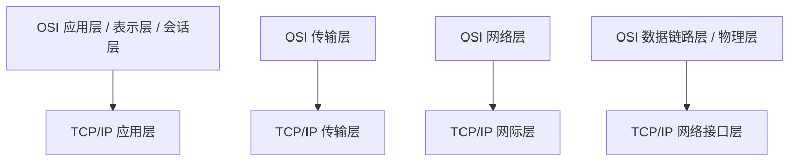
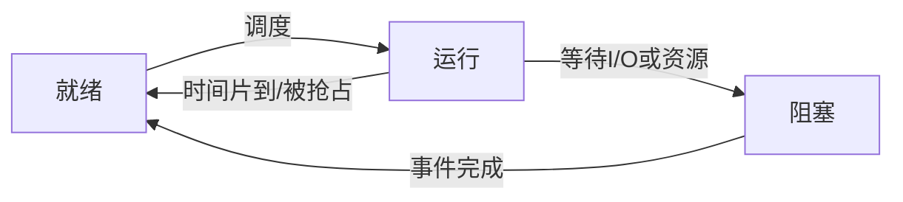
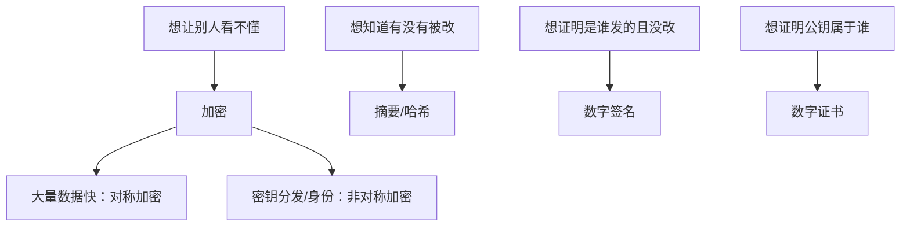

# 第 12 课：操作系统 / 网络 / 安全（重写版）

## 课案信息

- 适用对象：软件设计师 2026 年 5 月备考
- 建议时长：130-160 分钟
- 使用前提：已完成前 11 课，具备基本计算机系统常识
- 课程定位：上午高频基础压缩整合课，负责把操作系统、网络、安全三大块压成能做题的统一框架
- 本课目标：让你看到 `进程线程 / 调度死锁 / 存储管理 / OSI 与 TCP/IP / IP 与路由 / 加密摘要签名` 这些题时，不再觉得是三本书，而是能按“系统如何运行、如何通信、如何防护”的链条理解

## Mermaid 预览说明

- 本课默认图示语言为 `Mermaid`
- 本地可用支持 Mermaid 的 Markdown 预览插件查看
- 若本地预览不方便，可直接粘贴到 [Mermaid Live Editor](https://mermaid.live/) 查看

## 资料依据

### 主依据

- `2018软件设计师教程_第5版_-_9787302491224.pdf`

### 本地真题池

- `doc/Software-Designer-master/真题/2016上.pdf`
- `doc/Software-Designer-master/真题/2017下.pdf`
- `doc/Software-Designer-master/真题/2018下.pdf`
- `doc/Software-Designer-master/真题/2019下.pdf`
- `doc/Software-Designer-master/真题/2020下.pdf`

### 辅助依据

- `doc/Software-Designer-master/README.md`
- `doc/agent/plans/20260311_sdes-course-plan_plan_v01.md`

### 本地证据口径说明

- 本模块在近年本地真题 PDF 中属于“长期稳定高频，但自动抽取题号级定位不够干净”的类型
- 因此本课采用如下口径：
  - `核心知识` 以主教材为准
  - `真题导向` 以本地真题池的长期高频范围为准
  - `题型案例` 采用保守真题式案例，不伪装成官方逐字原题
- 真正进入做题轮时，默认回到上述本地 PDF 原题池原题

## 当前样本结论

- 这一大块最容易给人“范围太大”的错觉，但软件设计师上午题真正反复考的核心并不散：
  - 操作系统：进程、线程、同步、死锁、存储管理、调度
  - 网络：分层、常见协议、地址与路由、TCP/UDP
  - 安全：对称加密、非对称加密、摘要、数字签名、证书、常见攻击
- 如果把这三块拆开孤立背，很快就乱
- 如果按“程序如何跑、主机如何通信、数据如何防护”串起来，题就好做很多

## 学习目标

学完本课，你应该能做到：

1. 区分进程、线程、程序三者
2. 看懂死锁形成条件与常见处理思路
3. 理解调度、周转时间、内存管理的基本考法
4. 能把 OSI 和 TCP/IP 模型对上
5. 理解 `IP / 子网 / 路由 / TCP / UDP / HTTP / HTTPS` 的基本分工
6. 区分 `加密 / 摘要 / 数字签名 / 证书`
7. 形成操作系统、网络、安全上午题的统一答题模板

## 前置知识

1. 不要求你上过完整操作系统或计算机网络课程
2. 允许你只对这些词有模糊印象
3. 本课会先讲直觉，再讲正式术语和做题快招

## 一、先把三大块串起来：系统如何运行、如何通信、如何防护

### 1.1 一句总纲

- 操作系统：回答“程序在机器上怎么跑起来”
- 网络：回答“机器和机器之间怎么说话”
- 安全：回答“这段话能不能被偷看、篡改、冒充”

如果你能把这三句背后含义想清楚，后面很多术语都会自动归位。

### 1.2 一个生活类比

把公司办公楼类比成计算机系统：

- 操作系统：像大楼物业，负责安排房间、电梯、门禁、资源分配
- 网络：像楼和楼之间的道路、快递、地址系统
- 安全：像门禁卡、监控、印章和验章流程

## 二、操作系统 I：进程、线程、同步、死锁

### 2.1 进程和线程怎么区分

#### 人话定义

- `程序`：静态代码
- `进程`：程序的一次运行实例，是资源分配的基本单位
- `线程`：进程中的执行流，是 CPU 调度的基本单位

#### 类比

- 程序：菜谱
- 进程：按菜谱实际做一桌菜
- 线程：厨房里具体某个厨师手上的那条工作流

### 2.2 为什么线程比进程更“轻”

因为同一进程里的线程通常共享：

- 代码段
- 数据段
- 打开的文件等资源

但每个线程仍有自己的：

- 程序计数器
- 栈
- 寄存器上下文

### 2.3 并发为什么会出问题

因为多个执行流可能同时碰同一份资源。

典型问题：

- 两个线程同时改库存
- 一个线程还没写完，另一个线程已经读了

所以才需要：

- 临界区
- 互斥
- 同步

### 2.4 PV 操作和信号量怎么理解

不用先背字母，先记人话：

- `P`：申请资源，如果没有就等
- `V`：释放资源，让别人有机会继续

信号量可以理解成“还能允许多少人进来”的计数器。

### 2.5 死锁的四个必要条件

最稳的一组必背点：

1. 互斥
2. 请求并保持
3. 不可剥夺
4. 环路等待

一句快记：

> 四个条件同时成立，死锁才可能出现。

### 2.6 死锁的处理思路

- 预防：破坏四个必要条件之一
- 避免：动态判断，尽量不走进危险状态
- 检测与解除：先允许发生，再检测、恢复

考试常问的不是你会不会写银行家算法，而是你知不知道：

> 预防、避免、检测与解除，分别是三种不同管理思路。

## 三、操作系统 II：调度、周转时间、存储管理

### 3.1 调度在考什么

本质是在考：

- 谁先运行
- 谁等多久
- 整体效率如何

### 3.2 常见调度算法

- 先来先服务 FCFS
- 短作业优先 SJF
- 时间片轮转 RR
- 优先级调度

### 3.3 周转时间和带权周转时间

#### 人话定义

- 周转时间：从作业提交到完成的总时间
- 带权周转时间：周转时间 / 实际运行时间

#### 为什么要看带权

因为同样等了 10 分钟：

- 对一个本来只需 2 分钟的小作业，代价很大
- 对一个本来要跑 2 小时的大作业，影响没那么夸张

### 3.4 存储管理最核心的几件事

#### 分区、分页、分段

- 分页：按固定大小页划分
- 分段：按逻辑意义划分，如代码段、数据段、栈段

一句快记：

> 页更像“物理上便于管理”，段更像“逻辑上便于理解”。

#### 虚拟存储

人话是：

> 让程序觉得自己有一大片连续内存，但真正常驻内存的只是当前活跃部分。

#### 页面置换

常见考点：

- FIFO
- LRU

题目一般会给访问序列，让你判断缺页次数或置换过程。

## 四、网络 I：分层和协议，不要背成散词

### 4.1 为什么要分层

因为网络通信太复杂，要把大问题拆开。

最朴素的分工是：

- 应用层：关心“我要传什么业务数据”
- 传输层：关心“端到端怎么传、靠不靠谱”
- 网络层：关心“怎么找到目标主机”
- 数据链路层：关心“本地链路上一跳怎么传”
- 物理层：关心“比特怎么变成电信号”

### 4.2 OSI 与 TCP/IP 怎么对

考试通常不是让你复述整套定义，而是要你知道：

- HTTP 在应用层
- TCP/UDP 在传输层
- IP 在网络层

### 4.3 常见协议分工

| 协议 | 最稳功能理解 |
| --- | --- |
| HTTP / HTTPS | Web 应用层通信 |
| DNS | 域名解析 |
| SMTP / POP3 / IMAP | 邮件 |
| TCP | 面向连接、可靠传输 |
| UDP | 无连接、尽力而为、开销小 |
| IP | 寻址与路由 |
| ARP | IP 地址到 MAC 地址解析 |

## 五、网络 II：地址、路由、可靠传输怎么考

### 5.1 IP 地址和子网

不要先怕点分十进制，先抓本质：

- IP 地址标识主机或接口
- 子网划分是在“网络号”和“主机号”之间重新分界

考试常考：

- 给子网掩码，问可用主机数
- 判断两个地址是否在同一子网

### 5.2 路由在干什么

人话就是：

> 决定数据包下一跳往哪走。

所以看到“路由表”“下一跳”“最优路径”，不要先想到应用层。

### 5.3 TCP 为什么可靠

你不用背所有报文字段，先抓这几件事：

1. 建立连接
2. 确认应答
3. 重传机制
4. 流量控制
5. 拥塞控制

一句快记：

> TCP 更慢一点，但更稳；UDP 更轻一点，但不保证到达。

## 六、安全 I：加密、摘要、签名怎么一刀分开

### 6.1 对称加密

#### 人话定义

加密和解密用同一把密钥。

#### 特点

- 快
- 适合大量数据加密
- 密钥分发是痛点

#### 常见代表

- DES
- AES

### 6.2 非对称加密

#### 人话定义

公钥和私钥成对出现。

#### 特点

- 适合密钥交换、身份相关场景
- 通常比对称加密慢

#### 常见代表

- RSA

### 6.3 摘要 Digest

#### 人话定义

把任意长度数据压成固定长度“指纹”。

#### 用途

- 验证完整性

#### 关键点

- 摘要不是加密，不能靠它还原原文

### 6.4 数字签名

很多人最容易在这里混。

先记一句：

> 数字签名解决的是“这条消息是不是你发的、有没有被改过”。

常见理解方式：

1. 发送者先对消息做摘要
2. 再用私钥对摘要进行签名
3. 接收者用公钥验证签名，并比对摘要

因此数字签名主要对应：

- 身份认证
- 不可否认
- 完整性验证

### 6.5 HTTPS 和证书

软件设计师层级下，先抓住：

- HTTPS = HTTP + TLS/SSL
- 证书用来绑定“公钥”和“身份”

你不需要把握握手细节到协议级，但要知道 HTTPS 不是单纯“HTTP 加密版”的一句空话，而是依赖证书与密钥体系建立可信连接。

## 七、安全 II：常见攻击怎么抓关键词

### 7.1 SQL 注入

信号词：

- 拼接 SQL
- 未做参数化

### 7.2 XSS

信号词：

- 恶意脚本注入页面
- 浏览器端执行

### 7.3 拒绝服务 DoS / DDoS

信号词：

- 大量请求拖垮服务

### 7.4 重放攻击

信号词：

- 合法消息被截获后重复发送

所以做安全题时，先别背长定义，先看攻击到底是在：

- 偷看
- 篡改
- 冒充
- 压垮
- 重放

## 八、把本模块压成一套上午判断模板

### 8.1 先判断属于哪一块

1. 在问程序运行与资源分配？优先操作系统
2. 在问主机通信和协议分层？优先网络
3. 在问保密、完整性、身份认证？优先安全

### 8.2 再看关键词

| 关键词 | 优先想到 |
| --- | --- |
| 临界区、信号量、互斥 | 同步 |
| 四个条件同时成立 | 死锁 |
| 入队、时间片、周转时间 | 调度 |
| 页、段、缺页、置换 | 存储管理 |
| 域名解析 | DNS |
| 可靠传输、确认、重传 | TCP |
| 无连接、开销小 | UDP |
| 公钥、私钥 | 非对称加密 |
| 指纹、完整性 | 摘要 |
| 不可否认、验签 | 数字签名 |

### 8.3 一句考试化答题模板

> 本题考查的是 `______`。题干中的关键信号是 `______`，因此应优先判断为 `______`，而不是 `______`。

## 九、保守真题式案例

### 案例 1：库存并发更新

场景：

- 多个线程同时扣减库存

稳定结论：

- 先想到临界区、互斥与同步

### 案例 2：访问序列页面置换

场景：

- 给页面访问序列和页框数，问缺页情况

稳定结论：

- 先想到 FIFO / LRU 一类页面置换题

### 案例 3：文件传输协议选择

场景：

- 实时语音更看重低延迟
- 账单传输更看重可靠到达

稳定结论：

- 实时语音更偏 UDP
- 账单传输更偏 TCP

### 案例 4：消息验真

场景：

- 问“如何证明消息未被篡改且确为发送方发出”

稳定结论：

- 先想到摘要 + 数字签名，而不是只想到“加密”

## 十、操作系统全考点详解

操作系统题不要学成散点。它本质上都围绕一句话：

> 操作系统负责管理计算机资源，并为程序运行提供服务。

资源包括：

- 处理机
- 内存
- 文件
- 设备

### 10.1 操作系统的四大管理职能

| 职能 | 管什么 | 高频考点 |
| --- | --- | --- |
| 处理机管理 | CPU 给谁用、用多久 | 进程、线程、调度、同步、死锁 |
| 存储管理 | 内存如何分配和保护 | 分页、分段、虚拟存储、页面置换 |
| 文件管理 | 文件如何组织和访问 | 文件目录、文件存取、文件保护 |
| 设备管理 | I/O 设备如何使用 | 中断、缓冲、假脱机 |

### 10.2 进程状态转换：不是只有“运行”和“不运行”

常见状态：

- 就绪：已具备运行条件，等 CPU
- 运行：正在占用 CPU
- 阻塞：等某个事件，如 I/O 完成

状态转换：

#### 易错点

阻塞不能直接回到运行。它必须先回到就绪，等待调度。

### 10.3 进程同步与互斥：两个词不是一回事

#### 互斥

人话：

> 同一时刻只允许一个进程进入临界区。

例子：

- 两个窗口不能同时修改同一个账户余额

#### 同步

人话：

> 多个进程按某种先后关系协作。

例子：

- 生产者先生产，消费者后消费

#### 临界资源和临界区

- 临界资源：一次只允许一个进程使用的资源
- 临界区：访问临界资源的代码段

### 10.4 PV 操作题怎么做

#### 信号量含义

信号量可以表示资源数量，也可以表示某事件是否发生。

- `P(S)`：申请资源，`S = S - 1`，若不满足则等待
- `V(S)`：释放资源，`S = S + 1`，唤醒等待者

#### 生产者消费者模型

常用信号量：

- `empty`：空缓冲区数
- `full`：满缓冲区数
- `mutex`：互斥访问缓冲区

生产者：

1. `P(empty)`
2. `P(mutex)`
3. 放入产品
4. `V(mutex)`
5. `V(full)`

消费者：

1. `P(full)`
2. `P(mutex)`
3. 取出产品
4. `V(mutex)`
5. `V(empty)`

#### 易错点

互斥信号量和资源计数信号量不能混用。`mutex` 管“同一时刻谁能进”，`empty/full` 管“有没有资源”。

### 10.5 死锁题必须讲透

#### 死锁人话解释

多个进程互相等对方释放资源，结果谁也走不下去。

#### 四个必要条件再解释

1. 互斥：资源不能共享，只能一个进程占
2. 请求并保持：已经拿着资源，还继续申请别的资源
3. 不可剥夺：别人不能强行抢走它手里的资源
4. 环路等待：进程之间形成等待环

#### 处理方式

| 方式 | 人话解释 | 例子 |
| --- | --- | --- |
| 死锁预防 | 破坏必要条件 | 一次性申请所有资源 |
| 死锁避免 | 分配前判断是否安全 | 银行家算法 |
| 死锁检测 | 允许发生，事后检测 | 资源分配图检测环 |
| 死锁解除 | 发现后处理 | 撤销进程、剥夺资源 |

#### 银行家算法核心

它不是在算钱，而是在判断：

> 当前资源分配后，系统是否仍存在一种安全执行序列。

### 10.6 调度算法逐个讲

#### 先来先服务 FCFS

- 谁先到谁先执行
- 简单
- 对短作业不友好

#### 短作业优先 SJF

- 运行时间短的先执行
- 平均等待时间可能较小
- 长作业可能饥饿

#### 时间片轮转 RR

- 每个进程分一个时间片
- 时间片用完就排队尾
- 适合分时系统

#### 优先级调度

- 优先级高的先运行
- 可能导致低优先级饥饿

#### 抢占与非抢占

- 抢占：运行中可能被更高优先级或时间片机制打断
- 非抢占：一旦运行，通常直到完成或主动阻塞

### 10.7 存储管理详细讲

#### 地址重定位

程序里的逻辑地址要转换为内存中的物理地址。

#### 分页

特点：

- 页面大小固定
- 逻辑地址分成页号和页内地址
- 通过页表映射到物理块

优点：

- 便于离散分配
- 减少外部碎片

#### 分段

特点：

- 段按逻辑意义划分
- 段长可变
- 逻辑地址由段号和段内地址组成

优点：

- 方便共享和保护
- 符合程序逻辑结构

#### 页式 vs 段式

| 对比项 | 页式 | 段式 |
| --- | --- | --- |
| 划分依据 | 固定大小 | 逻辑单位 |
| 长度 | 相等 | 可变 |
| 用户是否感知 | 通常不感知 | 更贴近用户逻辑 |
| 主要目的 | 内存管理方便 | 逻辑组织与保护 |

#### 页面置换

常见算法：

- FIFO：淘汰最早进入内存的页
- LRU：淘汰最长时间未使用的页
- OPT：淘汰未来最长时间不用的页，理论最优

题目给访问串时，要逐步记录：

1. 当前内存页框
2. 是否缺页
3. 淘汰哪一页
4. 缺页次数

### 10.8 文件管理与设备管理

#### 文件目录

目录用于把文件名映射到文件控制信息。

常见目录结构：

- 一级目录：简单但重名冲突严重
- 二级目录：按用户区分
- 树形目录：最常见，层次清晰

#### 文件存取方式

- 顺序存取：从头到尾读
- 随机存取：可直接访问指定位置

#### I/O 管理

常见概念：

- 中断：设备完成后通知 CPU
- 缓冲：平衡高速 CPU 和低速设备
- SPOOLing 假脱机：把独占设备改造成可共享的逻辑设备

典型例子：

- 打印机假脱机

## 十一、网络全考点详解

网络题本质上都围绕：

> 数据从一台主机到另一台主机，中间经历哪些层、哪些地址、哪些协议。

### 11.1 OSI 七层逐层讲

| OSI 层 | 人话职责 | 常见关键词 |
| --- | --- | --- |
| 物理层 | 比特怎么在介质上传 | 电压、光信号、网线 |
| 数据链路层 | 相邻节点一跳怎么可靠传 | 帧、MAC、交换机 |
| 网络层 | 包怎么跨网络找路 | IP、路由器、路由 |
| 传输层 | 端到端进程通信 | TCP、UDP、端口 |
| 会话层 | 管理会话 | 建立、维护、释放会话 |
| 表示层 | 数据表示转换 | 加密、压缩、编码 |
| 应用层 | 面向应用服务 | HTTP、FTP、SMTP、DNS |

考试高频：

- 交换机常对应数据链路层
- 路由器常对应网络层
- TCP/UDP 对应传输层
- HTTP/DNS/SMTP/FTP 对应应用层

### 11.2 TCP/IP 模型

| TCP/IP 层 | 对应理解 |
| --- | --- |
| 应用层 | OSI 上三层合并 |
| 传输层 | TCP/UDP |
| 网际层 | IP |
| 网络接口层 | 数据链路 + 物理 |

### 11.3 IP 地址和子网计算

#### IP 地址结构

IPv4 是 32 位，通常写成点分十进制。

子网掩码用于区分：

- 网络位
- 主机位

#### 可用主机数

如果主机位有 `h` 位，则可用主机数通常是：

`2^h - 2`

减 2 是因为：

- 全 0 表示网络地址
- 全 1 表示广播地址

#### 判断同一子网

做法：

1. IP 地址和子网掩码做按位与
2. 得到网络地址
3. 网络地址相同则在同一子网

### 11.4 TCP 与 UDP 详细区分

| 对比项 | TCP | UDP |
| --- | --- | --- |
| 连接 | 面向连接 | 无连接 |
| 可靠性 | 可靠，确认重传 | 不保证可靠 |
| 顺序 | 保证有序 | 不保证有序 |
| 开销 | 较大 | 较小 |
| 适用 | 文件、网页、邮件 | 语音、视频、DNS 查询 |

#### TCP 三次握手人话理解

目的不是考试要你背报文位，而是理解：

> 通信双方先确认彼此能发送、能接收，再开始可靠传输。

#### 流量控制和拥塞控制

- 流量控制：别把接收方撑爆
- 拥塞控制：别把网络撑爆

### 11.5 常见应用协议

| 协议 | 功能 | 默认端口常识 |
| --- | --- | --- |
| HTTP | Web 明文传输 | 80 |
| HTTPS | Web 安全传输 | 443 |
| FTP | 文件传输 | 20/21 |
| SMTP | 发邮件 | 25 |
| POP3 | 收邮件 | 110 |
| IMAP | 在线邮件访问 | 143 |
| DNS | 域名解析 | 53 |
| DHCP | 动态分配 IP | 67/68 |
| Telnet | 远程登录，明文 | 23 |
| SSH | 安全远程登录 | 22 |

不要求死背所有端口，但 HTTP、HTTPS、DNS、FTP、SMTP 常见。

### 11.6 网络设备

| 设备 | 工作层次 | 人话职责 |
| --- | --- | --- |
| 集线器 Hub | 物理层 | 只放大转发信号 |
| 交换机 Switch | 数据链路层 | 按 MAC 转发帧 |
| 路由器 Router | 网络层 | 按 IP 路由转发 |
| 网关 Gateway | 高层或协议转换 | 不同协议/网络间转换 |

## 十二、安全全考点详解

安全题不要看到“加密”就全选加密。先判断安全目标。

### 12.1 安全目标

| 目标 | 人话解释 | 对应手段 |
| --- | --- | --- |
| 机密性 | 不让未授权者看懂 | 加密 |
| 完整性 | 不让内容被改而不知 | 摘要、MAC、签名 |
| 可用性 | 系统能正常提供服务 | 防 DoS、容灾 |
| 认证 | 确认对方是谁 | 证书、口令、签名 |
| 不可否认 | 事后不能抵赖 | 数字签名 |

### 12.2 对称加密、非对称加密、摘要、签名一张图

### 12.3 数字签名完整流程

发送方：

1. 对原文做摘要
2. 用自己的私钥加密摘要，形成签名
3. 把原文和签名发出

接收方：

1. 用发送方公钥解开签名得到摘要 A
2. 对收到的原文重新做摘要得到摘要 B
3. 比较 A 和 B

如果一致，说明：

- 内容未被篡改
- 签名确实来自对应私钥持有者

### 12.4 数字证书和 CA

问题：

> 我怎么知道这个公钥真属于某网站？

答案：

- 由可信第三方 CA 签发数字证书
- 证书把主体身份和公钥绑定起来

### 12.5 常见攻击与防护

| 攻击 | 人话解释 | 防护方向 |
| --- | --- | --- |
| SQL 注入 | 把恶意 SQL 拼进输入 | 参数化查询、输入校验 |
| XSS | 把恶意脚本注入页面 | 输出编码、过滤、CSP |
| CSRF | 借用户登录态伪造请求 | Token、SameSite、校验来源 |
| DoS/DDoS | 大量请求压垮服务 | 限流、清洗、扩容 |
| 重放攻击 | 把截获的合法消息再发一次 | 时间戳、随机数、序列号 |
| 中间人攻击 | 攻击者夹在通信双方之间 | HTTPS、证书校验 |

### 12.6 防火墙、入侵检测、病毒木马

#### 防火墙

根据规则过滤网络流量，控制哪些通信可以进出。

#### IDS / IPS

- IDS：入侵检测，发现并报警
- IPS：入侵防御，发现后尝试阻断

#### 病毒、蠕虫、木马

- 病毒：通常依附宿主文件传播
- 蠕虫：可自我复制传播
- 木马：伪装成正常程序，暗中执行恶意行为

## 十三、综合速判表

| 题干关键词 | 优先判断 |
| --- | --- |
| 就绪、阻塞、运行 | 进程状态 |
| P/V、信号量、缓冲区 | 同步互斥 |
| 四条件、等待环 | 死锁 |
| 时间片 | 轮转调度 |
| 页号、页内地址、缺页 | 分页 / 页面置换 |
| 段号、段内地址 | 分段 |
| MAC、帧、交换机 | 数据链路层 |
| IP、路由器、路由表 | 网络层 |
| TCP、UDP、端口 | 传输层 |
| HTTP、DNS、SMTP | 应用层 |
| 公钥、私钥 | 非对称加密 |
| 哈希、指纹 | 摘要 |
| 私钥签名、公钥验签 | 数字签名 |
| CA、证书 | 身份与公钥绑定 |

## 十四、随堂练习

说明：

- 本轮继续按严格考试口径批改
- 只会背术语，不会抓关键词和职责边界，不按满分算

### 练习 1：操作系统判断

- 分值：`8 分`
- 频次/优先级：`高频 / 最高`

问题：

1. 程序、进程、线程三者最稳的区别是什么？
2. 为什么多个线程共享资源时需要同步？
3. 死锁的四个必要条件是什么？
4. 为什么说打破其中一个条件就能预防死锁？

### 练习 2：调度与存储

- 分值：`8 分`
- 频次/优先级：`高频 / 高`

问题：

1. 周转时间和带权周转时间有什么区别？
2. 分页和分段最稳的一刀区别是什么？
3. 虚拟存储为什么不是“无限内存”？
4. 页面置换题最常见会让你算什么？

### 练习 3：网络协议区分

- 分值：`8 分`
- 频次/优先级：`高频 / 高`

请分别说明：

1. DNS 负责什么
2. TCP 和 UDP 最稳的区别是什么
3. IP 层更关注什么
4. HTTP 和 HTTPS 的关系是什么

### 练习 4：安全概念区分

- 分值：`8 分`
- 频次/优先级：`高频 / 高`

判断下列说法更对应什么概念，并给一句理由：

1. 用同一把密钥加密和解密
2. 生成固定长度指纹判断内容是否被改
3. 用私钥签名、用公钥验证
4. 证明网站身份可信

## 十五、课后作业

1. 用自己的话写出：
   - 为什么线程比进程更“轻”
2. 画一张 `Mermaid` 图，把 OSI 与 TCP/IP 对应起来
3. 回答：
   - 为什么 TCP 的“可靠”不是一句空话，而是依赖一整套机制
4. 分别用一句话说明：
   - 对称加密、非对称加密、摘要、数字签名各解决什么问题

## 十六、常见错误

1. 把程序、进程、线程混成一类
2. 会背死锁四条件，但不知道它们为什么会导致互相等待
3. 把分页、分段、虚拟存储混成“内存管理名词”
4. 把 TCP/UDP 只背成“一个可靠一个不可靠”，不会联系场景
5. 把加密、摘要、签名混成“都是保护安全”
6. 看到 HTTPS 就只会说“更安全”，说不出证书和身份绑定

## 十七、复盘清单

做完本课后，你至少应能独立回答：

1. 操作系统、网络、安全三块各自在回答什么问题？
2. 进程、线程、同步、死锁之间的关系是什么？
3. 调度和存储管理最常考哪些点？
4. OSI 与 TCP/IP 怎么对应？
5. TCP、UDP、IP、DNS、HTTP、HTTPS 各自负责什么？
6. 对称加密、非对称加密、摘要、数字签名分别解决什么问题？
