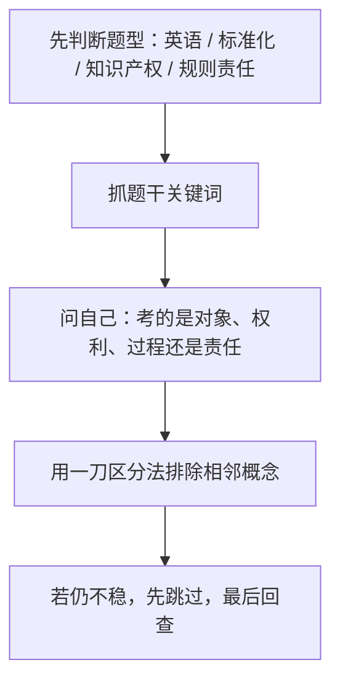

# 第 13 课：上午送分题清扫（重写版）

## 课案信息

- 适用对象：软件设计师 2026 年 5 月备考
- 建议时长：100-130 分钟
- 使用前提：已完成前 12 课主体学习，至少对上午常规模块已有一轮接触
- 课程定位：上午查漏补缺与送分题速判课
- 本课目标：把最容易因为“觉得简单”而失分的模块一次清干净，建立稳定速判模板

## Mermaid 预览说明

- 本课默认图示语言为 `Mermaid`
- 本地可用支持 Mermaid 的 Markdown 预览插件查看
- 若本地预览不方便，可直接粘贴到 [Mermaid Live Editor](https://mermaid.live/) 查看

## 资料依据

### 主依据

- `2018软件设计师教程_第5版_-_9787302491224.pdf`

### 本地真题池

- `doc/Software-Designer-master/真题/2016上.pdf`
- `doc/Software-Designer-master/真题/2017上.pdf`
- `doc/Software-Designer-master/真题/2018上.pdf`
- `doc/Software-Designer-master/真题/2019上.pdf`
- `doc/Software-Designer-master/真题/2020下.pdf`

### 辅助依据

- `doc/Software-Designer-master/README.md`
- `doc/agent/plans/20260311_sdes-course-plan_plan_v01.md`

### 本地证据口径说明

- 本课覆盖的是上午题里长期高频、但单题分值不高、最容易被轻视的模块：
  - 专业英语
  - 标准化与常识类判断
  - 知识产权与法律责任
  - 合同、招投标、职业规范等规则型题
- 这些题在近年本地真题中长期可见，但自动抽取到“题号级、逐字级”的稳定度不如 DFD、数据库、算法这几条线
- 因此本课采用以下口径：
  - `知识归纳` 以主教材和长期题型稳定性为主
  - `真题导向` 以本地真题池的高频范围为准
  - `案例演练` 采用保守真题式案例，不冒充官方逐字原题

## 当前样本结论

- 上午所谓“送分题”最容易失分，不是因为它难，而是因为考生经常：
  - 读得太快
  - 觉得眼熟就选
  - 把相邻概念混在一起
- 这类题真正的拿分方式不是“背更多”，而是：
  - 先识别题属于哪一类规则
  - 再抓关键词
  - 最后用一刀区分法排除相近干扰项
- 本课的核心任务不是扩知识面，而是把“低成本失分点”一次堵住

## 学习目标

学完本课，你应该能做到：

1. 看到英语题时，先抓核心名词和修饰关系，而不是逐词翻译
2. 用最省脑子的方式区分标准、规范、协议、模型、开放系统等常见术语
3. 区分著作权、专利权、商标权、商业秘密的保护对象与取得方式
4. 对招投标、合同、职业规范类题目建立关键词速判法
5. 在上午题里快速判断哪些题该秒拿、哪些题该先跳
6. 用一套固定清单完成上午“送分题扫尾”

## 前置知识

1. 已完成至少一轮主体课案学习
2. 不要求你记住所有法条和英文单词
3. 但必须接受一个事实：

> 送分题不是“随便做都对”，而是“有规则就该稳拿，不该白丢”

## 一、为什么“送分题”最容易白丢分

很多人丢这类分，不是因为不会，而是因为做法错了。

最常见的失分路径：

1. 看见熟词就秒选，没看限定词
2. 知道概念，但不知道它和旁边那个概念怎么一刀分开
3. 看到法律或规则类题，凭生活经验猜，而不是按考试口径判断

所以本课最重要的一句不是某个定义，而是：

> 送分题要靠“识别模板”，不是靠“感觉差不多”。

## 二、英语题：不是翻译比赛，而是结构识别题

### 2.1 人话定义

软件设计师英语题通常不是考你写作文，而是考你能否在技术语境里识别：

- 主体对象是谁
- 它具有什么性质
- 它执行什么动作
- 选项里哪一个和句意最匹配

### 2.2 最稳做法：三步走

1. 先找中心名词
2. 再看修饰词是“功能、性质还是范围”
3. 最后用技术常识校验整句

例如：

- `fault-tolerant system`
- `throughput`
- `authentication`
- `maintainability`

如果你逐词死抠，速度会很慢；如果你先识别这是“系统性质”还是“性能指标”，题就快很多。

### 2.3 高频词先按功能记，不按字典记

- `reliability`：可靠性，强调持续正确运行
- `availability`：可用性，强调可提供服务
- `maintainability`：可维护性，强调修改和修复方便
- `scalability`：可扩展性，强调负载增长后还能扩
- `throughput`：吞吐量，强调单位时间完成量
- `latency` / `delay`：延迟，强调响应等待时间
- `encryption`：加密
- `authentication`：认证，确认“你是谁”
- `authorization`：授权，确认“你能做什么”

### 2.4 英语题最稳排除法

- 如果两个选项都是“看起来很像的好词”，优先看题干问的是：
  - 身份确认
  - 权限授予
  - 性能快慢
  - 质量属性
- 不要把“会不会访问”与“是不是本人”混掉

## 三、标准化与开放系统：先看层级，再看用途

### 3.1 为什么这类题容易混

因为它们都长得像“规范词”：

- 标准
- 规范
- 协议
- 模型
- 接口

如果不先问“它解决什么问题”，就很容易把词看花。

### 3.2 最省脑子的分类法

- `标准`：大家共同遵守的规则
- `协议`：系统之间如何通信、交换信息
- `模型`：帮助理解和分层抽象
- `规范`：对实现、过程或文档的要求

### 3.3 开放系统到底在强调什么

不是“开源”，也不是“谁都能改”。

在考试语境里，它更强调：

- 互连
- 互操作
- 可移植
- 标准接口

所以一旦选项里出现“厂家私有封闭实现更方便管理”之类表述，通常就不是开放系统想强调的方向。

### 3.4 标准化题的速判问题

做题时先问自己：

1. 这是在考“谁制定”还是“拿来干什么”？
2. 这是在考“分层结构”还是“通信规则”？
3. 这个选项是在讲“开放互通”，还是在讲“内部专用实现”？

## 四、知识产权：最怕概念眼熟，边界不清

### 4.1 先用人话区分四类权利

- `著作权`：保护作品表达
- `专利权`：保护技术方案或设计方案
- `商标权`：保护标识，防止品牌混淆
- `商业秘密`：保护未公开且有经济价值的信息

### 4.2 软件最常考的是哪条线

软件设计师里最常考的是：

- 软件著作权
- 专利与著作权区别
- 商业秘密与公开发表之间的边界

### 4.3 一刀区分法

- 保护“写出来的具体表达”时，优先想著作权
- 保护“技术方案”时，优先想专利
- 保护“名称、标识、图形品牌”时，优先想商标
- 保护“没公开、靠保密维持价值的信息”时，优先想商业秘密

### 4.4 最常见陷阱

1. 把软件著作权理解成“保护算法思想”
2. 把“先公开再申请专利”看成没影响
3. 把“别人没抄源码”就理解为一定不侵权
4. 把商标、版权、专利都当成“知识产权总称，差不多”

## 五、合同、招投标、职业规范：别用生活经验猜

### 5.1 为什么这类题会翻车

因为很多表述在生活里听起来很顺，但考试判断看的是规则边界。

### 5.2 招投标题怎么判断

先看它在问什么：

- 问程序是否合规
- 问谁承担什么责任
- 问哪个动作属于哪个阶段

不要上来就回忆新闻或现实经验。

### 5.3 合同题怎么判断

最稳的思路不是背细枝末节，而是抓：

- 合同双方是谁
- 义务是什么
- 违约或变更发生后，问的是责任、效力还是程序

### 5.4 职业规范类题怎么判断

这类题一般不是考“情商”，而是考：

- 是否保护用户和公众利益
- 是否遵守法律与合同
- 是否如实披露风险
- 是否越权使用数据或资源

如果一个选项看起来“为了效率可以先做、以后再补手续”，通常要提高警惕。

## 六、把送分题压成一套速判模板

### 6.1 秒拿题

- 核心概念单一
- 关键词直接
- 没有复合限定条件

### 6.2 中档题

- 两个选项都像对
- 需要区分相近概念
- 需要把题干条件读完整

### 6.3 易坑题

- 出现“最可能 / 最不恰当 / 不属于 / 不正确”
- 同时混入两个知识域
- 选项里故意用生活常识诱导你

## 七、稳定本地题源锚点与保守真题式案例

### 7.1 稳定本地题源锚点

- `2016上.pdf` 至 `2020下.pdf` 的上午题中，长期稳定覆盖：
  - 专业英语
  - 标准化/开放系统
  - 知识产权
  - 法律责任与职业规范
- 当前自动抽取链不足以把这些题全都稳定定位到“逐字原题 + 精确题号”
- 因此本课只把它们作为“本地长期高频题源”使用，不伪装成官方逐字原题

### 7.2 保守真题式案例

案例 A：

- 题干出现 `authentication`、`authorization`
- 问哪个术语对应“确认用户身份”

稳做法：

- 先判这是安全英语词汇区分
- 身份确认选 `authentication`
- 权限控制才是 `authorization`

案例 B：

- 题干问“某权利主要保护软件代码这一作品表达”

稳做法：

- 先抓“作品表达”
- 优先想到著作权，而不是专利权

案例 C：

- 题干强调“不同厂商系统之间可互连、互操作”

稳做法：

- 优先往开放系统和标准接口方向判断
- 不要选“封闭私有实现更利于统一管理”这类反向干扰项

## 八、上午送分题高频速记表

- `认证`：确认你是谁
- `授权`：确认你能干什么
- `可靠性`：持续正确运行
- `可用性`：现在能不能用
- `著作权`：保护表达
- `专利权`：保护技术方案
- `商标权`：保护标识
- `商业秘密`：保护未公开信息
- `开放系统`：强调互连、互操作、可移植

## 九、随堂练习

说明：

- 本轮继续按严格考试口径批改
- 只会说大概意思、说不出关键词和边界，不按满分算

### 练习 1：英语速判

- 分值：`8 分`
- 频次/优先级：`高频 / 最高`

请分别说明下列术语最稳对应什么含义，并给一句理由：

1. `authentication`
2. `authorization`
3. `throughput`
4. `maintainability`

### 练习 2：标准化判断

- 分值：`6 分`
- 频次/优先级：`中高频 / 高`

问题：

1. 开放系统最强调什么？
2. 为什么“厂家私有、不能互通”通常不是开放系统追求的方向？
3. 协议和模型最稳的一刀区别是什么？

### 练习 3：知识产权区分

- 分值：`8 分`
- 频次/优先级：`高频 / 高`

请判断下列场景更优先对应哪类权利：

1. 保护软件源代码这一表达
2. 保护一个新的技术实现方案
3. 保护产品名称和标识
4. 保护公司未公开的算法参数与客户名单

### 练习 4：规则责任题

- 分值：`8 分`
- 频次/优先级：`中高频 / 中高`

问题：

1. 为什么合同、招投标、职业规范题不能只按生活经验猜？
2. 如果某选项是“先越权读取数据，事后补手续”，为什么要高度警惕？
3. 职业规范题最稳先看哪两个维度？

## 十、课后作业

1. 用自己的话写出：
   - 为什么送分题最容易白丢分
   - 为什么“眼熟”不等于“能稳做”
2. 整理一个你自己的 `送分题一刀区分表`，至少包含：
   - 认证 / 授权
   - 著作权 / 专利权 / 商标权 / 商业秘密
   - 标准 / 协议 / 模型 / 规范
3. 从本课内容里任选 6 个术语，写成“题眼词 -> 正确判断 -> 易混点”三列表
4. 回答：
   - 为什么上午最后阶段必须留一轮时间清扫这类题

## 十一、常见错误

1. 觉得送分题简单，所以题干没读完
2. 见到英语词就逐字翻译，反而把技术语义翻丢了
3. 把著作权、专利权、商标权都混成“知识产权差不多”
4. 把开放系统理解成开源系统
5. 用现实印象代替考试规则去猜合同和职业规范题
6. 知道中文定义，但做题时说不出一刀区分法

## 十二、复盘清单

做完本课后，你至少应能独立回答：

1. 上午送分题为什么最容易白丢分？
2. 英语题最稳的三步走是什么？
3. 开放系统最强调哪几个关键词？
4. 著作权、专利权、商标权、商业秘密怎么一刀分开？
5. 规则责任题为什么不能凭生活经验猜？
6. 如果我现在开始做一套上午卷，哪些题应先秒拿、哪些题可先跳？
