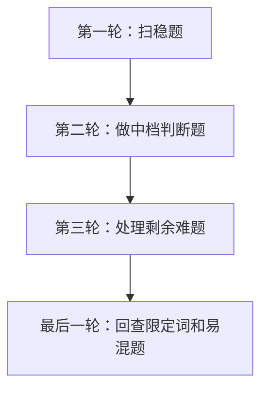

# 第 14 课：上午综合刷题课（重写版）

## 课案信息

- 适用对象：软件设计师 2026 年 5 月备考
- 建议时长：120-150 分钟
- 使用前提：已完成 `L01-L13` 的主要知识铺底
- 课程定位：上午整卷策略、排除法与复盘模板训练课
- 本课目标：把“会知识点”进一步变成“会做整套上午题”

## Mermaid 预览说明

- 本课默认图示语言为 `Mermaid`
- 本地可用支持 Mermaid 的 Markdown 预览插件查看
- 若本地预览不方便，可直接粘贴到 [Mermaid Live Editor](https://mermaid.live/) 查看

## 资料依据

### 主依据

- `2018软件设计师教程_第5版_-_9787302491224.pdf`

### 本地真题池

- `doc/Software-Designer-master/真题/2016上.pdf`
- `doc/Software-Designer-master/真题/2017上.pdf`
- `doc/Software-Designer-master/真题/2018上.pdf`
- `doc/Software-Designer-master/真题/2019上.pdf`
- `doc/Software-Designer-master/真题/2020下.pdf`

### 辅助依据

- `doc/Software-Designer-master/README.md`
- 既有重写课案 `02` 至 `13`

### 本地证据口径说明

- 本课不是某一个知识模块课，而是把上午卷常见题型和做题节奏整合成整卷训练方法
- 因此本课对本地真题的使用口径是：
  - `整卷节奏判断` 依据近年上午卷长期稳定结构
  - `模块难点归类` 依据现有课案已覆盖的高频模块
  - `演练题` 采用保守真题式小套题，不冒充某年某题逐字原文

## 当前样本结论

- 上午题最常见的失败，不是“知识完全不会”，而是：
  - 稳题没稳拿
  - 难题卡太久
  - 回查时间不够
  - 错题只看答案，不做结构复盘
- 整卷训练的核心不是再背一遍知识点，而是建立三件事：
  - 时间分配
  - 题目分层
  - 排除与回查机制

## 学习目标

学完本课，你应该能做到：

1. 把上午题按 `稳拿 / 需判断 / 暂跳` 三层分类
2. 用统一节奏完成一整套上午卷
3. 遇到两个都像对的选项时，优先用排除法而不是硬猜
4. 建立错题复盘表，而不是只记“这题答案是 C”
5. 知道哪些题应追求速度，哪些题应追求条件完整性
6. 形成上午综合刷题的固定动作清单

## 前置知识

1. 已完成主要知识模块学习
2. 允许你还有很多模糊点
3. 本课重点不是再扩知识面，而是把现有知识转成得分动作

## 一、上午综合刷题到底在练什么

很多人以为上午刷题就是：

- 多做题
- 对答案
- 记住答案

这不够。

上午综合刷题真正训练的是：

1. 你能不能快速识别题型
2. 你能不能判断这题该不该立刻做
3. 你能不能在有限时间里把稳分先收入袋
4. 你能不能把错题复盘成“以后不再错”的规则

所以本课不是知识点复读，而是答题动作训练。

## 二、整卷作答节奏：先把分装进口袋

### 2.1 最稳总策略

### 2.2 第一轮做什么

- 做你一眼能判断题型、且核心概念明确的题
- 不和难题硬耗
- 目标是快速建立得分底盘

### 2.3 第二轮做什么

- 处理需要区分相近概念的题
- 例如：
  - 可靠性 vs 可用性
  - 认证 vs 授权
  - 进程 vs 线程
  - 工厂方法 vs 生成器

### 2.4 第三轮做什么

- 再回头啃需要较多演算或需要连续思考的题
- 例如性能计算、复杂度判断、图论过程题

### 2.5 最后一轮回查什么

- `不正确 / 不属于 / 最可能 / 最合适`
- 单位换算
- 限定范围
- 你第一眼想选、但当时没完全确认的题

## 三、A / B / C 题位分类法

### 3.1 A 类：稳拿题

特点：

- 题型一眼识别
- 关键词直接
- 不需要长计算

例如：

- 概念边界清楚的送分题
- 术语定义明确的题
- 典型高频题眼题

### 3.2 B 类：判断题

特点：

- 两个选项像对
- 需要区分相近概念
- 要读完整条件

这类题不是不会，而是要慢半拍。

### 3.3 C 类：暂跳题

特点：

- 读完题干还是不清楚它在问什么
- 需要连续计算或连续推演
- 当前做会明显打乱节奏

暂跳不是放弃，而是防止难题吞掉稳分时间。

## 四、五种最常用的排除法

### 4.1 关键词排除法

看题干到底在问：

- 身份
- 权限
- 性能
- 可靠
- 表达
- 技术方案

先把明显不是一个维度的选项排掉。

### 4.2 范围排除法

如果题干问的是“哪一层负责”，你却选了“整个系统都相关”的泛化项，通常不稳。

### 4.3 反义排除法

很多错项不是“略错”，而是方向反了：

- 开放系统强调互通，错项却强调封闭私有
- 数据摘要强调完整性，错项却说它主要用于保密

### 4.4 过度绝对化排除法

看到：

- 一定
- 必然
- 完全
- 所有情况下

要提高警惕。

考试里很多正确说法都是“通常、适合、常见”，不是绝对。

### 4.5 相邻概念一刀排除法

把最常混的成对概念做成脑内快捷键：

- 认证 / 授权
- 著作权 / 专利权
- 进程 / 线程
- 白盒 / 黑盒
- 单元测试 / 集成测试

## 五、上午卷最容易连续失分的四类坑

### 5.1 计算题坑

- 公式记住了，但单位没统一
- 复杂度会看趋势，不会判断主导项

### 5.2 相近概念坑

- 知道都听过，但边界不清
- 选项里只换了一个关键字就翻车

### 5.3 英语与规则坑

- 觉得自己“差不多懂”
- 没把题干限定条件读完整

### 5.4 熟题错觉坑

- 觉得像以前做过
- 没发现这次问的是“错误项”或“最不合适项”

## 六、错题复盘：不是记答案，是记为什么会错

### 6.1 错题复盘四列法

1. 题型
2. 错因
3. 正确判断关键词
4. 下次一刀区分法

### 6.2 常见错因标签

- `没读限定词`
- `概念混淆`
- `公式或单位错误`
- `节奏失控`
- `凭印象选`

### 6.3 最有价值的错题，不是最难题

真正该反复复盘的是：

- 你本来应该做对
- 但因为粗心或混淆做错

这类题最能提分。

## 七、上午综合刷题固定动作清单

1. 开始前先提醒自己：先收稳分，不先证明自己会难题
2. 第一轮快速扫 `A 类题`
3. 第二轮处理 `B 类题`
4. 第三轮再看 `C 类题`
5. 最后一轮只查：
   - 否定词
   - 单位
   - 易混对
6. 做完后立刻整理错题，不要隔天再补

## 八、综合小套题的做法示范

假设你连续遇到 5 题：

1. 英语术语题
2. 数据结构复杂度题
3. 标准化概念题
4. 操作系统调度题
5. 知识产权边界题

最稳做法不是按出现顺序全部硬做，而是：

- 先收 `1、3、5` 这种概念边界明确题
- 再做 `2、4` 这种需要判断或演算的题

这就是整卷节奏的本质：

> 不是先做简单知识点，而是先做当前最稳能拿的题。

## 九、保守真题式综合案例

### 案例 1：术语边界

- 题干问“确认用户是否为合法本人”
- 选项含 `authentication`、`authorization`

稳做法：

- 先识别安全英语词汇题
- 身份确认选 `authentication`

### 案例 2：复杂度判断

- 给一段双重循环代码
- 其中内层循环次数和 `n` 成比例

稳做法：

- 先判主导项
- 再排除低阶项和常数项

### 案例 3：知识产权

- 问“保护软件名称和图形标识”

稳做法：

- 先抓“名称、标识”
- 优先想到商标

## 十、随堂练习

说明：

- 本轮继续按严格考试口径批改
- 只说“我感觉是这个”而不能说清关键词，不按满分算

### 练习 1：题目分层

- 分值：`8 分`
- 频次/优先级：`高频 / 最高`

请说明：

1. 什么样的题应归入 `A 类稳拿题`？
2. 什么样的题应归入 `B 类判断题`？
3. 什么样的题应归入 `C 类暂跳题`？

### 练习 2：排除法应用

- 分值：`8 分`
- 频次/优先级：`高频 / 高`

问题：

1. 为什么看到“最不正确”必须提高警惕？
2. 过度绝对化选项为什么常常危险？
3. 请各举一个“反义排除法”和“相邻概念一刀排除法”的例子。

### 练习 3：小套题作答顺序

- 分值：`8 分`
- 频次/优先级：`中高频 / 高`

假设你连续遇到以下题：

1. 英语术语题
2. 复杂计算题
3. 知识产权概念题
4. 网络协议区分题

请给出你最稳的作答顺序，并说明原因。

### 练习 4：错题复盘

- 分值：`6 分`
- 频次/优先级：`高频 / 中高`

请写出一个你认为高质量的错题复盘记录，至少包括：

- 题型
- 错因
- 正确关键词
- 下次防错动作

## 十一、课后作业

1. 按本课模板整理你自己的 `上午卷作答流程卡`
2. 建一个 `错题复盘表`，至少先设计好列名
3. 从前面课案里任选 10 个高频概念，做成“相邻概念一刀区分表”
4. 回答：
   - 为什么上午卷的核心不是“每题都不放过”，而是“先把稳分装进口袋”

## 十二、常见错误

1. 一上来先啃最难题，导致节奏崩
2. 不做题目分层，把所有题都当成同一优先级
3. 复盘时只记答案，不记错因
4. 知识点会一点，但不会用于排除法
5. 回查阶段不查限定词，只重新看一遍题面
6. 把“暂跳”误解成“放弃”

## 十三、复盘清单

做完本课后，你至少应能独立回答：

1. 上午综合刷题到底在练什么？
2. `A / B / C` 三类题怎么区分？
3. 五种最常用的排除法分别适合什么场景？
4. 为什么错题复盘不能只写答案？
5. 一套上午卷最稳的作答节奏是什么？
6. 如果我明天开始刷整卷，我的第一张动作清单应该写什么？
