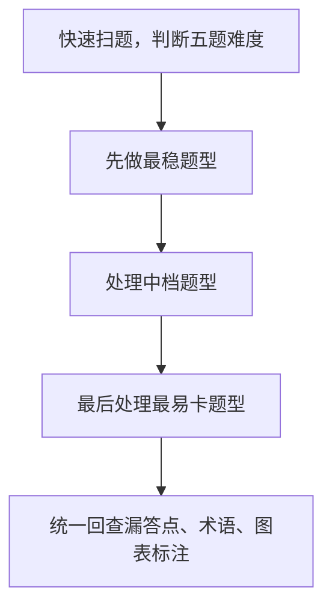

# 第 15 课：下午综合套卷 I（重写版）

## 课案信息

- 适用对象：软件设计师 2026 年 5 月备考
- 建议时长：150-180 分钟
- 使用前提：已完成 `L04-L12` 五大固定题型课案学习
- 课程定位：下午整套卷串题与切题训练课
- 本课目标：把五类下午固定题真正串成一整张卷子来做，而不是分模块各会一点

## Mermaid 预览说明

- 本课默认图示语言为 `Mermaid`
- 本地可用支持 Mermaid 的 Markdown 预览插件查看
- 若本地预览不方便，可直接粘贴到 [Mermaid Live Editor](https://mermaid.live/) 查看

## 资料依据

### 主依据

- `2018软件设计师教程_第5版_-_9787302491224.pdf`

### 本地真题池

- `doc/Software-Designer-master/真题/2016下.pdf`
- `doc/Software-Designer-master/真题/2017上.pdf`
- `doc/Software-Designer-master/真题/2018下.pdf`
- `doc/Software-Designer-master/真题/2019下.pdf`
- `doc/Software-Designer-master/真题/2020下.pdf`

### 辅助依据

- 已有重写课案 `04` 至 `12`
- `doc/Software-Designer-master/README.md`
- `doc/agent/plans/20260311_sdes-course-plan_plan_v01.md`

### 本地证据口径说明

- 下午卷的稳定高频题型已经在本仓库现有课案中分模块沉淀：
  - DFD
  - 数据库设计
  - UML / OO 设计
  - 算法与代码
  - 设计模式
- 本课不追求逐字复刻某一整年下午卷，而是把近年本地题风稳定出现的题型结构与答题动作整合成一节综合套卷课
- 因此本课案例采用：
  - `稳定题型锚点`：来自本地真题池的长期固定题型
  - `保守套卷式案例`：按软考下午卷真实风格组织，但不伪装成某年官方逐字原卷

## 当前样本结论

- 下午题最容易出现的误区不是“题不会”，而是“题与题之间切换时丢分”
- 真正拉开差距的不是单题神发挥，而是：
  - 你能不能快速进入当前题型的固定模板
  - 你能不能控制答题顺序和每题停留时间
  - 你能不能在陌生业务背景下仍旧抓住题型本质
- 所以下午综合套卷训练的本质，是训练：
  - 切题速度
  - 模板调用
  - 跨题型稳定性

## 学习目标

学完本课，你应该能做到：

1. 说清楚五类下午固定题各自最先看什么
2. 在一整套下午卷中安排更稳的答题顺序
3. 用每题的固定检查表快速定位可拿分点
4. 在题型切换时，把上一题思维及时清空
5. 知道哪些题应先保守拿分，哪些题可以追求高分展开
6. 形成下午综合套卷的整套动作模板

## 前置知识

1. 已完成对应专题课案阅读：
   - `04_下午专题I_DFD_重写版.md`
   - `06_下午专题II_数据库设计_重写版.md`
   - `08_下午专题III_UML_OO设计_重写版.md`
   - `10_算法与代码题II_重写版.md`
   - `09_设计模式_Java路线_重写版.md`
2. 不要求你每题都能高分展开
3. 但必须能接受：下午综合卷不只是知识考察，更是切题与模板调用考察

## 一、下午综合套卷到底在练什么

如果把五类下午题拆开单练，你会觉得自己“都会一点”。

但真正到整套卷里，最容易出问题的是：

1. 第一题没收住，写太多
2. 第二题切过去时脑子还停留在上一题
3. 算法题卡住后，后面设计模式也被拖慢
4. 每题都想写满，结果稳定分没拿全

所以下午综合套卷练的不是“新知识”，而是：

> 在有限时间内，把五类固定题型按最稳模板连续打出来。

## 二、整套卷最稳的节奏，不是死记顺序

### 2.1 基本原则

- 先做自己当前最稳的题型
- 再做中档题
- 最后处理最容易卡住的题

### 2.2 为什么不建议机械死守题号顺序

因为不同人当前强项不同：

- 有人 DFD、数据库稳
- 有人 UML、设计模式更顺
- 有人算法题一旦卡住就会拖崩全卷

所以更稳的做法是：

- 先用 1-2 分钟扫全卷
- 判断今天哪几题最稳
- 按“先稳后险”的策略排顺序

### 2.3 下午整卷流程图

## 三、五类题的起手动作，必须条件反射化

### 3.1 DFD 题先看什么

- 系统边界
- 外部实体
- 数据流名称
- 上下文图与 0 层图是否平衡

最怕一上来就钻局部加工细节，反而把整体结构看丢。

### 3.2 数据库设计题先看什么

- 业务对象是谁
- 关键联系是什么
- 主键、外键、基数关系在哪
- 后续关系模式与范式问题会落到哪里

### 3.3 UML / OO 题先看什么

- 题干在描述谁负责什么职责
- 类、接口、控制、实体是否分层清楚
- 图里真正稳定的关系是继承、实现还是关联

### 3.4 算法与代码题先看什么

- 题目功能
- 输入 / 输出
- 关键状态变量
- 代码属于递归、DP、搜索还是图算法

### 3.5 设计模式题先看什么

- 变化点是什么
- 谁负责创建 / 适配 / 通知 / 切换行为
- 类关系里是继承、组合还是委托

## 四、每题固定检查表

### 4.1 DFD 检查表

1. 系统边界是否清楚
2. 外部实体是否漏写
3. 数据流命名是否像“数据”而不是“动作”
4. 上下层图是否平衡

### 4.2 数据库设计检查表

1. 实体是否完整
2. 联系和基数是否合理
3. 主键外键是否交代清楚
4. 关系模式是否出现明显冗余

### 4.3 UML / OO 检查表

1. 职责分配是否合理
2. 类图关系是否匹配题意
3. 控制类、实体类、边界类是否混乱
4. 新需求扩展点是否说明清楚

### 4.4 算法题检查表

1. 功能是否先说清楚
2. 状态定义是否准确
3. 补空是否先补边界和含义
4. 复杂度是否交代主导项

### 4.5 设计模式检查表

1. 变化点是否指出
2. 模式名是否和角色职责匹配
3. 是否说明为什么不是相近模式
4. Java 路线下接口、抽象类、组合关系是否落稳

## 五、跨题型最容易丢的不是知识，是表达

下午题很多分其实丢在“表达不稳”：

- 名词没对齐
- 图和文字不一致
- 只给结论，不给理由
- 用自己的口语替代考试判分词

所以每题都要提醒自己：

> 不只是知道答案，还要写成判卷老师看得懂、能给分的答案。

## 六、最稳的跨题型切换动作

### 6.1 一题结束时做什么

1. 画或写完最后一个答案点
2. 检查是否漏答小问
3. 划掉草稿中的无关思路
4. 脑中清空上题词汇

### 6.2 下一题开始时做什么

1. 先问“这题是什么题型”
2. 立刻调用对应检查表
3. 不把上一题的思路硬套进来

这一步非常关键。

很多人不是不会，而是把 DFD 的“流程感”带进了数据库题，把算法题的“细节阅读”带进了设计模式题。

## 七、保守套卷式案例

### 案例结构

假设一套卷包含：

1. 图书借阅系统 DFD
2. 订单数据库设计
3. 设备维修系统 UML / OO
4. 最短路径代码补空
5. 消息通知设计模式识别

### 最稳顺序示例

如果你当前最稳的是 `DFD -> 数据库 -> 设计模式 -> UML -> 算法`，那就可以：

1. 先收 `DFD`
2. 再做 `数据库`
3. 再做 `设计模式`
4. 然后 `UML`
5. 最后集中处理 `算法`

重点不是照抄这个顺序，而是：

- 你必须知道自己的强弱顺序
- 你必须让“稳题先入袋”

## 八、综合评分口径：先拿稳分，再争展开分

### 8.1 稳分点

- 题型识别准确
- 术语不乱
- 小问不漏
- 基本图表结构正确

### 8.2 展开分

- 理由说完整
- 相近方案区分清楚
- 表达有层次
- 能说明“为什么”

如果时间紧，先保住稳分点。

## 九、下午整卷动作清单

1. 开卷先扫全卷
2. 先定顺序，不盲目题号顺做
3. 每题先调用检查表
4. 一题结束先查漏问，再切题
5. 最后统一查：
   - 漏答
   - 术语
   - 图表标注
   - 前后表述一致性

## 十、随堂练习

说明：

- 本轮继续按严格考试口径批改
- 只会说“这题我大概知道”而不能给出固定检查表，不按满分算

### 练习 1：题型起手动作

- 分值：`10 分`
- 频次/优先级：`高频 / 最高`

请分别写出以下五题的第一步动作：

1. DFD
2. 数据库设计
3. UML / OO
4. 算法与代码
5. 设计模式

### 练习 2：顺序安排

- 分值：`8 分`
- 频次/优先级：`高频 / 高`

如果你当前强弱顺序是：

- 数据库最稳
- DFD 次稳
- 算法最容易卡

请给出你这一套下午卷最稳的做题顺序，并说明理由。

### 练习 3：检查表应用

- 分值：`8 分`
- 频次/优先级：`高频 / 高`

请任选两类下午题，分别写出它们最关键的 4 条检查项。

### 练习 4：跨题型切换

- 分值：`6 分`
- 频次/优先级：`中高频 / 中高`

问题：

1. 为什么一题结束后要先查漏答再切题？
2. 为什么不能把上一题的思路带到下一题？
3. 你自己的“切题动作”准备怎么写？

## 十一、课后作业

1. 写出你自己的 `下午卷顺序策略卡`
2. 为五类固定题各整理一张 `检查表`
3. 任选一个你最弱的下午题型，补一份“最容易卡住的 5 个点”
4. 回答：
   - 为什么下午卷真正拉分点是“连续稳定输出”，而不是某一道题超常发挥

## 十二、常见错误

1. 每题都想按题号顺序做，结果最难题把节奏拖崩
2. 知道每类题怎么做，但不会整卷切换
3. 图和文字分别写得不错，但彼此不一致
4. 只写结论，不写判分老师能给分的理由
5. 一题写太满，后面时间不够
6. 把稳分点和展开分混在一起，导致两头都没拿稳

## 十三、复盘清单

做完本课后，你至少应能独立回答：

1. 下午综合套卷到底在练什么？
2. 五类题各自最先看什么？
3. 为什么下午卷不一定要死守题号顺序？
4. 每题固定检查表的价值是什么？
5. 跨题型切换时最该防什么？
6. 如果我明天开始做一整套下午卷，我的第一张动作卡该怎么写？
