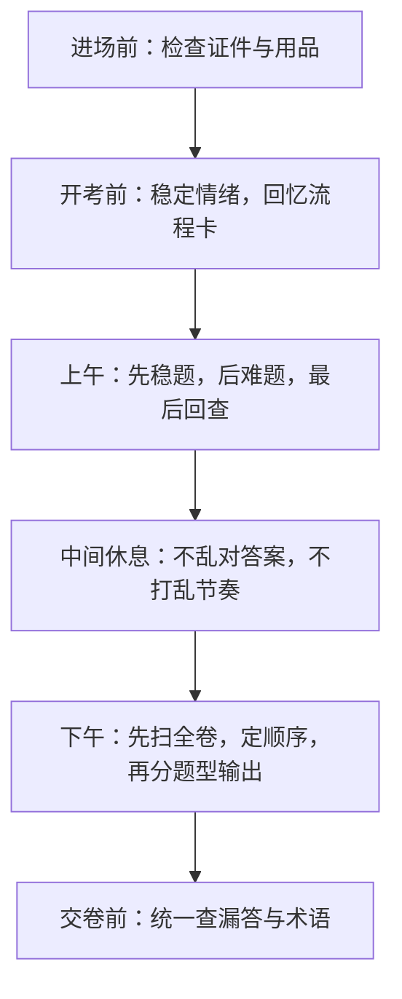

# 第 16 课：全真模拟与考前总复盘（重写版）

## 课案信息

- 适用对象：软件设计师 2026 年 5 月备考
- 建议时长：120-150 分钟
- 使用前提：已完成 `L01-L15` 全部课案学习或至少已具备完整课案资料
- 课程定位：考前模拟、总复盘与执行清单课
- 本课目标：把最后阶段的备考从“想到什么看什么”变成“按计划稳收尾”

## Mermaid 预览说明

- 本课默认图示语言为 `Mermaid`
- 本地可用支持 Mermaid 的 Markdown 预览插件查看
- 若本地预览不方便，可直接粘贴到 [Mermaid Live Editor](https://mermaid.live/) 查看

## 资料依据

### 主依据

- `2018软件设计师教程_第5版_-_9787302491224.pdf`

### 本地真题池

- `doc/Software-Designer-master/真题/2016上.pdf`
- `doc/Software-Designer-master/真题/2016下.pdf`
- `doc/Software-Designer-master/真题/2017上.pdf`
- `doc/Software-Designer-master/真题/2018上.pdf`
- `doc/Software-Designer-master/真题/2018下.pdf`
- `doc/Software-Designer-master/真题/2019上.pdf`
- `doc/Software-Designer-master/真题/2019下.pdf`
- `doc/Software-Designer-master/真题/2020下.pdf`

### 辅助依据

- 全部现有课案 `01` 至 `15`
- `doc/Software-Designer-master/README.md`
- `doc/agent/plans/20260311_sdes-course-plan_plan_v01.md`

### 本地证据口径说明

- 本课是考前执行课，不依赖某一题型或某一年份的逐字原题
- 本地真题池在这里的用途是：
  - 提供全真模拟卷来源
  - 提供错题回炉素材
  - 提供上午、下午分卷训练材料
- 本课只写稳定备考策略，不在课案正文里固化需要实时联网核验的报名、准考证或临时组考细节

## 当前样本结论

- 考前阶段最怕的不是“还没学到新东西”，而是：
  - 乱刷题
  - 乱翻资料
  - 不做整卷
  - 只看错题答案，不做复盘
- 最后阶段的提分，主要来自三件事：
  - 用整卷模拟发现节奏问题
  - 用错题回炉堵漏洞
  - 用执行清单降低考试当天失误

## 学习目标

学完本课，你应该能做到：

1. 制定考前 7 天或 5 天的稳定收尾计划
2. 知道全真模拟该怎么做，做完后又该怎么复盘
3. 明确上午和下午临考前各该复什么、不该复什么
4. 建立考试当天的动作清单，减少非知识性失误
5. 区分“知识没掌握”与“节奏失控”两类问题
6. 用最终复盘清单把所有课案串起来

## 前置知识

1. 已具备完整课案资料
2. 允许你仍有薄弱点
3. 本课目标不是再开新战线，而是把已有成果压缩成最后可执行方案

## 一、考前总复盘到底复什么

很多人到最后一周会犯一个错：

- 看见什么都觉得还不稳
- 于是哪里都翻一点
- 结果没有任何一块真正稳住

考前总复盘不是把 16 课重学一遍，而是做三件事：

1. 把高频模板再压缩一遍
2. 把自己的薄弱点逐个堵上
3. 把考试当天动作提前排练好

## 二、最后阶段先分三类问题

### 2.1 知识性漏洞

特点：

- 某概念确实不懂
- 某题型模板确实没建立

处理方式：

- 回到对应课案做定向补强

### 2.2 节奏性漏洞

特点：

- 知识点会
- 但整卷时顺序乱、时间乱、回查乱

处理方式：

- 做整卷模拟
- 复盘时间分配与切题动作

### 2.3 心态性漏洞

特点：

- 明明会，考试或模拟时慌
- 一题卡住就连带后面崩

处理方式：

- 预设“卡住后的动作”
- 提前演练整卷节奏

## 三、考前 7 天稳妥收尾模板

如果离考试还有一周，最稳可以按这个思路安排：

### 第 1-2 天

- 做一套上午卷
- 做一套下午卷
- 不求分数漂亮，先找真实漏洞

### 第 3-4 天

- 按错题回到对应课案定向补洞
- 上午补概念边界、公式和送分题
- 下午补固定题型模板和检查表

### 第 5 天

- 再做一次整卷或半套卷
- 验证补洞是否见效

### 第 6 天

- 只看自己的错题复盘表、模板卡、检查表
- 不再大面积翻新资料

### 第 7 天

- 轻复盘
- 调状态
- 准备考试日用品和动作清单

## 四、如果时间只剩 3-5 天，怎么压缩

核心原则：

- 不再全面铺开
- 只看高频和自己最容易白丢分的点

优先级建议：

1. 上午送分题与易混概念
2. 下午五类固定题型检查表
3. 自己的错题复盘
4. 至少一次整卷或分卷节奏演练

## 五、全真模拟到底怎么做，才不算白做

### 5.1 模拟前

- 先准备完整时间段
- 尽量按正式考试状态做
- 中途不随意暂停查资料

### 5.2 模拟中

- 上午卷照 `L14` 的分层与回查节奏做
- 下午卷照 `L15` 的顺序与检查表做

### 5.3 模拟后

不要只看总分。

必须分别问：

1. 哪些题是知识不会？
2. 哪些题是节奏失误？
3. 哪些题是本来能对却白丢？

### 5.4 模拟复盘四问

1. 我上午卷稳题拿够了吗？
2. 我上午最常错的是哪类题？
3. 我下午哪一题最容易卡？
4. 我下一次模拟最该优先改什么？

## 六、上午考前总复盘：只看能立刻转分的东西

### 6.1 必看

- 易混概念一刀区分表
- 公式与单位换算清单
- 送分题速判表
- 错题本里“本来该对却错”的题

### 6.2 少看

- 冷门边角知识
- 长篇背景解释
- 你已经稳定会的内容

### 6.3 上午最后提醒

> 上午卷真正危险的不是难题，而是本来该拿的分没拿到。

## 七、下午考前总复盘：只看模板，不再开新脑洞

### 7.1 必看

- 五类固定题型检查表
- 自己的顺序策略卡
- 每题最容易漏的点
- 常用判分术语和图表标注习惯

### 7.2 少看

- 新题型猜测
- 过度追求某一题极限高分
- 复杂但你短期内提分很小的细枝末节

### 7.3 下午最后提醒

> 下午卷最值钱的是连续稳定输出，不是某一题写得像论文。

## 八、考试当天动作清单

### 8.1 进场前

- 确认证件、文具、必要物品
- 尽量不要临时加新资料
- 不在最后时刻刷陌生难题

### 8.2 上午开考前

- 提醒自己先收稳分
- 想起 `A / B / C` 分层法

### 8.3 上午结束后

- 不和别人激烈对答案
- 不让上一场情绪带进下一场

### 8.4 下午开考前

- 想起自己的顺序策略卡
- 提醒自己：每题先调用检查表

## 九、最后总复盘：16 课到底压成了什么

### 上午线

- `L02`：快得分模块
- `L03`：数据结构与算法地基
- `L11`：软件工程与测试
- `L12`：操作系统 / 网络 / 安全
- `L13`：送分题清扫
- `L14`：上午整卷节奏

### 下午线

- `L04`：DFD
- `L06`：数据库设计
- `L08`：UML / OO
- `L09`：设计模式
- `L10`：算法与代码
- `L15`：下午综合套卷

### 总控线

- `L01`：考试全景与路线
- `L16`：最终模拟与执行清单

## 十、随堂练习

说明：

- 本轮继续按严格考试口径批改
- 只说“我准备考前多看几遍”而没有执行计划，不按满分算

### 练习 1：问题分类

- 分值：`8 分`
- 频次/优先级：`高频 / 最高`

请分别举例说明：

1. 什么是知识性漏洞
2. 什么是节奏性漏洞
3. 什么是心态性漏洞

### 练习 2：模拟复盘

- 分值：`8 分`
- 频次/优先级：`高频 / 高`

如果一次模拟后出现：

- 上午错了很多本来眼熟的题
- 下午算法题卡太久

请分别说明你下一步怎么调整。

### 练习 3：最后 5 天安排

- 分值：`8 分`
- 频次/优先级：`高频 / 高`

请写出你自己的最后 5 天安排，至少包括：

- 整卷模拟
- 错题回炉
- 上午复盘
- 下午复盘

### 练习 4：考试当天动作

- 分值：`6 分`
- 频次/优先级：`中高频 / 中高`

请写出你自己的考试当天动作清单，至少包含：

- 上午起手动作
- 上午结束后动作
- 下午起手动作
- 交卷前检查项

## 十一、课后作业

1. 产出你自己的：
   - 上午流程卡
   - 下午顺序策略卡
   - 错题复盘表
2. 至少完成一次分卷或整卷模拟
3. 把你目前最弱的 3 个点，分别归类为：
   - 知识性漏洞
   - 节奏性漏洞
   - 心态性漏洞
4. 回答：
   - 为什么考前最后阶段最怕“哪里都看一点，但没有任何一块真正稳住”

## 十二、常见错误

1. 最后阶段继续四处找新资料，导致主线崩
2. 做模拟只看分数，不看错因
3. 明知自己节奏有问题，却还只补知识点
4. 下午顺序策略一直不固定，场上临时决定
5. 上午送分题仍靠感觉，不靠速判表
6. 考试当天过度被别人节奏影响

## 十三、复盘清单

做完本课后，你至少应能独立回答：

1. 考前总复盘真正该复什么？
2. 我的问题主要是知识、节奏还是心态？
3. 全真模拟做完后，我会从哪四个问题开始复盘？
4. 上午和下午最后阶段分别该看什么？
5. 考试当天我最怕的失误是什么，对应预案是什么？
6. 现在把 16 课压缩成 3 张卡片，我分别会写什么？
