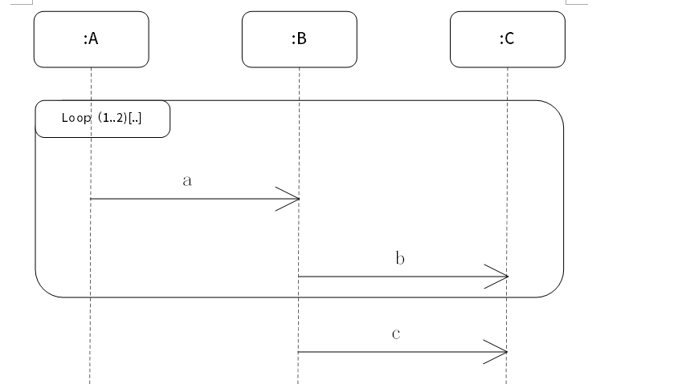

# 第12章 软件系统分析与设计：真题驱动重制版

## 1. 本章定位与证据来源

本课案用于软件设计师教程第5版第12章“软件系统分析与设计”。固化教材目录确认本章范围为：

- 12.1 结构化分析与设计
- 12.2 数据库分析与设计
- 12.3 面向对象分析与设计
- 12.4 算法分析与设计
- 12.5 面向对象的程序设计与实现

本地 PDF 正文在当前环境中不可抽取文本，因此本课案不假设你已经读过教材正文，而是按固化教材目录、本地上午真题和本地 Markdown 真题仓重新组织。真题来源优先级如下：

- 章节范围：`doc/agent/sdes-textbook-catalog_20260417-181907/reports/20260417_sdes-textbook-catalog_report_v01.md`
- 本地题库索引：`doc/Software-Designer-master/真题/xisai_md/xisai_md_总索引.md`
- 本地上午题仓：`doc/Software-Designer-master/真题/xisai_md/题目/*选择题.md`

本章仍处于教材章节阶段，因此只使用上午选择题，不混入下午案例题。

## 2. 本地候选题池与知识点权重

本轮实际筛选了 2015-2025 年本地 Markdown 上午题中与第12章直接相关的 28 个候选题。每题只归入一个主知识点，权重按“该知识点主测题数 / 28”计算。

| 排序 | 主知识点 | 权值 | 说明 |
| --- | --- | ---: | --- |
| 1 | UML 与面向对象建模 | 8/28 | 用例图、类图、顺序图、活动图、包图、UML关系 |
| 2 | 结构化分析与 DFD | 5/28 | 自顶向下、数据流图、分层平衡、加工规格说明 |
| 3 | 模块结构、内聚、耦合与可维护性 | 5/28 | 模块结构图、低耦合高内聚、可维护性设计 |
| 4 | 面向对象设计原则、实现与测试 | 4/28 | 单一职责、无环依赖、重载/覆盖、OO测试层次 |
| 5 | 算法分析与设计策略 | 4/28 | 分治、贪心、折半查找、最小生成树 |
| 6 | 数据库分析与设计 | 2/28 | E-R 转关系、概念/逻辑/物理设计阶段 |

这个分布说明：本章上午题最常考的是“建模图怎么识别、关系怎么判断、分析/设计阶段产物怎么区分”。学习顺序按权重从高到低安排。

## 3. UML 与面向对象建模（权值：8/28，约28.6%）

### 3.1 必须掌握什么

UML 是统一建模语言，用图形把系统的需求、结构、行为和部署表达出来。考试不要求你画完整项目模型，但会要求你判断“这是什么图”“这个关系叫什么”“这个图适合表达什么”。

常见图的用途：

- 用例图：从用户视角描述系统要提供哪些外部可见功能。核心元素是参与者和用例。
- 类图：描述类、属性、操作以及类之间的静态关系。
- 顺序图：按时间顺序描述对象之间如何发送消息。
- 活动图：描述业务流程、控制流、分支、并发和汇合。
- 状态图：描述一个对象在生命周期中如何因事件触发而改变状态。
- 包图：描述模型组织单元及包之间的依赖。

UML 关系的高频区分：

- 依赖：一个事物变化会影响另一个事物，通常是“临时使用、参数使用、调用使用”。
- 关联：对象之间有结构性连接，例如学生选课、医生治疗病人。
- 聚合：整体与部分关系，部分可脱离整体存在，例如班级和学生。
- 组合：更强的整体与部分关系，部分通常不能脱离整体独立存在。
- 泛化：一般与特殊关系，也就是继承关系，例如“车辆”与“汽车”。
- 实现：类实现接口，承诺提供接口规定的行为。

做题时先问三个问题：

- 题目是在问外部用户能做什么吗？优先考虑用例图。
- 题目是在问类、属性、方法、继承、关联吗？优先考虑类图。
- 题目是在问时间顺序上的消息调用吗？优先考虑顺序图。
- 题目是在问业务步骤、流程分支、并发执行吗？优先考虑活动图。

常见陷阱：

- 把活动图误判成状态图。活动图的节点多是“动作/活动”，状态图的节点多是“状态”，迁移常由事件触发。
- 把泛化与聚合混淆。泛化是“是一种”，聚合/组合是“有一个/由……组成”。
- 把用例图当成流程图。用例图表达系统边界和外部可见服务，不表达内部步骤。

### 3.2 代表真题 1：UML 关系

题源：`2024上半年选择题.md` 第16题

题干：UML类图在软件建模时，给出软件系统的一种静态设计视图，用（ ）关系可明确表示两类事物之间存在的特殊/一般关系。

- A. 聚合
- B. 依赖
- C. 泛化
- D. 实现

答案：C

解析：题干里的“特殊/一般关系”就是判断入口。一般类可以表示上位概念，特殊类继承一般类的结构和行为，所以对应 UML 的泛化关系。聚合强调整体与部分，依赖强调影响，实现强调接口契约，都不是“特殊/一般”。

### 3.3 代表真题 2：顺序图识别

题源：`2023上半年选择题.md` 第35题

题干：如下所示的 UML 图中，展现了（ ）；下图中（ ）是可能的消息序列。

问题1：

- A. 系统在它的周边环境的语境中所提供的外部可见服务
- B. 某一时刻一组对象以及它们之间的关系
- C. 系统内从一个活动到另一个活动的流程
- D. 以时间顺序组织的对象之间的交互活动

问题2：

- A. a→b→c→a→b
- B. c
- C. a→b→a→b→c
- D. a→b→c→a→b→c

答案：D、C

解析：顺序图的核心不是“有哪些类”，而是“对象之间的消息按什么时间顺序发生”。如果图中出现对象生命线、从上到下排列的消息箭头、循环片段，就优先判断为顺序图。题中 loop 表示循环，1..2 表示循环次数范围，因此可能的消息序列要符合循环片段的重复约束，选 C。

## 4. 结构化分析与 DFD（权值：5/28，约17.9%）

### 4.1 必须掌握什么

结构化分析的基本思想是自顶向下、逐步分解。它先从系统整体功能入手，再逐层细化为子功能。核心产物通常包括数据流图、数据字典和加工规格说明。

数据流图 DFD 用来描述数据在系统中如何流动、被处理、被存储。DFD 的基本元素：

- 外部实体：系统外部的人、组织、设备或其他系统。它与系统交互，但不属于系统内部。
- 加工：把输入数据流转换为输出数据流的处理过程。
- 数据流：数据从一个地方流到另一个地方的路径。
- 数据存储：系统内部保存数据的地方，例如订单表、挂号记录、库存文件。

分层 DFD 的关键规则是“平衡”：父图中某个加工的输入/输出数据流，必须与其子图整体的输入/输出保持一致。层次越往下，细节越多，而不是越少。

加工规格说明用于描述一个基本加工如何把输入数据流转换为输出数据流。它应描述业务规则，但不应写代码实现细节。常用表达方式包括结构化语言、判定表和判定树。

解题步骤：

- 先判断题目是在讲需求分析还是设计实现。DFD 属于需求分析/结构化分析，不是代码实现。
- 看到“系统外的人/组织/设备”，判断为外部实体。
- 看到“表、文件、记录、库”，多半是数据存储，不是数据流。
- 看到“分层数据流图”，优先检查父子图输入输出是否平衡。

常见陷阱：

- 把数据存储误认为数据流。例如“挂号记录”是存储位置，不是流动的数据。
- 认为分层越多越抽象。实际是越分解越细。
- 在加工规格说明里写实现细节。分析阶段只写转换规则，不写程序实现。

### 4.2 代表真题 1：分层 DFD

题源：`2025上半年选择题.md` 第18题

题干：以下关于数据流图分层结构的叙述中，不正确的是（ ）。

- A. 各层数据流图之间应该保持“平衡”关系
- B. 顶层数据流图只包含一个处理框，表示待开发的系统
- C. 数据流图的层次越多，细节程度越低
- D. 分层的数据流图可以清晰的表达系统的层次结构，使得系统更易于理解

答案：C

解析：A、B、D 都是 DFD 分层的基本规则。C 错在“越多越低”。顶层图最抽象，向下分解后会出现更多加工、数据流和数据存储，细节程度更高。

### 4.3 代表真题 2：基本加工说明

题源：`2023上半年选择题.md` 第14题

题干：以下关于数据流图中基本加工的叙述中，不正确的是（ ）。

- A. 对每一个基本加工，必须有一个加工规格说明
- B. 加工规格说明必须描述把输入数据流变换为输出数据流的加工规则
- C. 加工规格说明要给出实现加工的细节
- D. 决策树、决策表可以用来表示加工规格说明

答案：C

解析：基本加工需要加工规格说明，说明“输入如何变成输出”。但 DFD 和加工规格说明属于分析阶段，关注业务规则，不关注代码实现。实现细节属于后续详细设计或编码阶段。

## 5. 模块结构、内聚、耦合与可维护性（权值：5/28，约17.9%）

### 5.1 必须掌握什么

结构化设计要把分析阶段得到的需求模型转成模块结构。模块是能完成相对独立功能的程序单元。好的模块结构应该高内聚、低耦合。

内聚描述模块内部各成分之间联系有多紧密。常见内聚从弱到强大致为：

- 巧合内聚：没有明显关系的功能被硬凑在一个模块里，最差。
- 逻辑内聚：把逻辑上相似的功能放一起，由参数决定执行哪一个。
- 时间内聚：把同一时间段执行的功能放一起，例如初始化。
- 过程内聚：按处理流程顺序组织，但数据联系不一定强。
- 通信内聚：多个处理操作同一数据结构或同一输入/输出。
- 顺序内聚：前一处理的输出是后一处理的输入。
- 功能内聚：模块只完成一个明确功能，最理想。

耦合描述模块之间依赖有多强。常见耦合从弱到强大致为：

- 数据耦合：只通过简单数据参数传递信息，最好。
- 标记耦合：传递复合数据结构，调用方只用其中一部分。
- 控制耦合：传递控制参数，决定对方执行哪段逻辑。
- 公共耦合：多个模块共享全局数据。
- 内容耦合：一个模块直接访问或修改另一个模块内部内容，最差。

解题步骤：

- 问模块内部：所有动作是否围绕一个功能？是否同一数据？是否前后输出输入相接？
- 问模块之间：传的是简单数据、复合数据、控制标志，还是共享全局/直接访问内部？
- 看到“可维护性”，优先考虑低耦合、高内聚、清晰层次和正确文档。

常见陷阱：

- “模块功能越单纯越好”不等于无脑拆碎。模块大小也要适中。
- 为了传数据引入公共数据域，会提高耦合，不是好设计。
- 加强模块间联系通常会降低可维护性。

### 5.2 代表真题 1：内聚类型

题源：`2025上半年选择题.md` 第21题

题干：某模块的各个部分，前一部分处理的输出是后一部分处理的输入，则该模块的内聚类型为（ ）。

- A. 顺序内聚
- B. 功能内聚
- C. 通信内聚
- D. 巧合内聚

答案：A

解析：题干明确说“前一部分输出是后一部分输入”，这是顺序内聚的典型特征。功能内聚要求整个模块只完成一个单一功能；通信内聚强调同一数据结构；巧合内聚几乎无关联。

### 5.3 代表真题 2：耦合类型

题源：`2023上半年选择题.md` 第27题

题干：若模块A通过控制参数来传递信息给模块B，从而确定执行模块B中的哪部分语句，则这两个模块的耦合类型是（ ）耦合。

- A. 数据
- B. 标记
- C. 控制
- D. 公共

答案：C

解析：关键字是“控制参数”和“确定执行哪部分语句”。这不是普通数据交换，而是在控制另一个模块的内部分支，因此是控制耦合。若只传简单输入/输出数据才是数据耦合。

## 6. 面向对象设计原则、实现与测试（权值：4/28，约14.3%）

### 6.1 必须掌握什么

面向对象方法把系统看成一组相互协作的对象。对象把状态和行为封装在一起，类定义对象的共同属性和操作，继承用于复用和扩展，多态允许同一消息在不同对象上产生不同结果。

常考原则：

- 单一职责原则：一个类只承担一类变化原因。一个类同时处理订单、日志、邮件，通常违反该原则。
- 开放-封闭原则：对扩展开放，对修改关闭。
- 里氏替换原则：子类对象应能替换父类对象而不破坏程序正确性。
- 接口隔离原则：不强迫客户端依赖它不需要的接口。
- 依赖倒置原则：高层模块不依赖低层模块，二者都依赖抽象。
- 无环依赖原则：包或组件依赖图中不能形成环。

重载与覆盖：

- 重载 Overload：同一个类中方法名相同、参数列表不同，编译期决定调用哪个方法，属于编译时多态。
- 覆盖 Override：子类重新定义父类方法，运行时按实际对象类型决定调用哪个方法，属于运行时多态，依赖动态绑定。

面向对象测试层次：

- 算法层：测试类中单个方法，类似传统单元测试。
- 类层：测试一个类整体。
- 模板层：测试一组协同工作的类之间的相互作用。
- 系统层：测试整个系统。

常见陷阱：

- 把重载说成动态绑定。重载通常是编译期绑定。
- 把“类承担多个不相关职责”看成复用。它实际会降低可维护性。
- 包之间循环依赖会让修改风险传递，违反无环依赖原则。

### 6.2 代表真题 1：单一职责原则

题源：`2025上半年选择题.md` 第29题

题干：采用面向对象设计方法开发电商平台，设计负责处理用户订单的类 OrderService，它不仅处理订单创建，还负责记录订单日志和发送确认邮件。OrderService 类违反了面向对象设计（ ）原则。

- A. 里氏替换
- B. 单一职责
- C. 接口隔离
- D. 开放-封闭

答案：B

解析：OrderService 同时负责订单创建、日志记录、邮件发送，变化原因至少有三个。订单规则变、日志规则变、邮件模板变都可能迫使它修改，所以违反单一职责原则。

### 6.3 代表真题 2：重载、覆盖与多态

题源：`2023下半年选择题.md` 第8题

题干：以下关于方法重载（Overload）和方法覆盖（Override）与多态的关系的叙述中，不正确的是（ ）。

- A. 覆盖通过动态绑定机制实现多态
- B. 重载通过动态绑定机制实现多态
- C. 重载属于编译时多态，在一个类中定义多个名称相同而参数表不同的方法
- D. 覆盖属于运行时多态，子类重新定义父类中已定义的方法

答案：B

解析：重载靠参数列表区分，编译时通常已经能决定调用哪个方法；覆盖才是在运行时按实际对象类型决定调用哪个实现。因此 B 错。

## 7. 算法分析与设计策略（权值：4/28，约14.3%）

### 7.1 必须掌握什么

第12章中的算法分析与设计，重点不是重新学习所有数据结构，而是能根据问题描述判断算法设计策略。

常见策略：

- 分治：把问题分成若干规模更小、结构相同或相近的子问题，分别求解后合并结果。折半查找、归并排序、最近点对常见。
- 贪心：每一步选择当前看来最优的局部选择，并且该选择能导向全局最优。Kruskal、Prim、Dijkstra、分数背包常见。
- 动态规划：问题有最优子结构且子问题重叠，用表保存子问题结果。0-1背包、最长公共子序列常见。
- 回溯：按搜索树尝试可能解，不满足约束则退回。排列组合、八皇后、0-1背包搜索解常见。

解题步骤：

- 是否每次把规模减半或拆成子问题？优先考虑分治。
- 是否每一步都选当前最优，且题目是最小生成树、最短路径、分数背包？优先考虑贪心。
- 是否出现“状态”“递推”“最优子结构”“重叠子问题”？优先考虑动态规划。
- 是否要枚举可能方案、发现不行就撤销？优先考虑回溯。

常见陷阱：

- 贪心不是“看起来快”就能用。0-1背包、旅行商、最长公共子序列不能保证靠贪心得到最优解。
- 分治不是暴力枚举。最近点对的分治不会计算所有点对距离。
- 动态规划和分治都拆子问题，但动态规划强调重叠子问题并保存结果。

### 7.2 代表真题 1：分治法

题源：`2025上半年选择题.md` 第2题

题干：在二维平面最近点对问题中，分治法的步骤不包括以下（ ）。

- A. 计算所有点对的欧氏距离
- B. 递归求解左右两半中点集的最近点对问题
- C. 按 x 坐标排序并将点集划分为左右两半
- D. 合并时仅需检查距离中线一定范围内的点

答案：A

解析：分治的关键是划分、递归求解、合并。计算所有点对距离是暴力法，不是分治法。若题目出现“所有点对”，通常要警惕它是否把分治说成了穷举。

### 7.3 代表真题 2：贪心法适用范围

题源：`2025上半年选择题.md` 第27题

题干：以下问题中，肯定可以用贪心算法求得最优解的是（ ）。

- A. 旅行商问题（TSP）
- B. 最大公共子序列（LCS）
- C. 部分（分数）背包问题
- D. 0-1背包问题

答案：C

解析：分数背包允许把物品切开，所以按单位价值从高到低选择能保证最优。0-1背包不能切开，局部最优可能错过全局最优；最大公共子序列通常用动态规划；旅行商问题不能靠简单贪心保证最优。

## 8. 数据库分析与设计（权值：2/28，约7.1%）

### 8.1 必须掌握什么

数据库分析与设计在第12章里通常不是考 SQL 细节，而是考“数据库设计处于哪个阶段”“E-R 模型如何转关系模型”。

典型阶段：

- 需求分析：明确用户的数据、功能、性能等需求，可能产生数据流图、数据字典、需求说明书。
- 概念设计：用 E-R 模型表达现实世界的数据需求，与具体数据库产品无关。
- 逻辑设计：把概念模型转换为数据库支持的逻辑模型，例如关系模式；规范化通常在这个阶段进行。
- 物理设计：确定存储结构、索引、访问路径、物理布局等。

E-R 转关系的常考规则：

- 实体通常转成一个关系模式。
- 1:1 联系可并入任一端，也可单独建表，视题目约束而定。
- 1:N 联系通常把 1 端主键加入 N 端关系模式。
- M:N 联系必须转成独立关系模式，主键通常由两端实体主键组合而成，联系自身属性也放入该关系模式。
- 多值属性通常需要拆成独立关系模式，并带上原实体主键。

常见陷阱：

- 把 E-R 模型当成逻辑设计产物。E-R 属于概念设计。
- 把关系规范化放在概念设计。规范化属于逻辑设计。
- 多对多联系只用其中一端主键是不够的，必须用两端主键组合才能唯一标识一条联系。

### 8.2 代表真题 1：多对多联系转换

题源：`2022下半年选择题.md` 第43题

题干：E-R 模型向关系模型转换时，两个实体 E1 和 E2 之间的多对多联系 R 应该转换为一个独立的关系模式，且该关系模式的关键字由（ ）组成。

- A. 联系 R 的属性
- B. E1 或 E2 的关键字
- C. E1 和 E2 的关键字
- D. E1 和 E2 的关键字加上 R 的属性

答案：C

解析：多对多联系需要独立建表。要唯一确定“一条联系”，只知道 E1 或 E2 的一端都不够，必须同时知道两端实体的关键字。联系自身属性可以作为普通属性加入，但通常不是关键字的必要组成。

### 8.3 代表真题 2：规范化阶段

题源：`2016上半年选择题.md` 第43题

题干：关系规范化在数据库设计的（ ）阶段进行。

- A. 需求分析
- B. 概念设计
- C. 逻辑设计
- D. 物理设计

答案：C

解析：规范化处理的是关系模式中的依赖、冗余和异常问题，它发生在把概念模型转成关系模型之后，因此属于逻辑设计阶段。

## 9. 本章做题总方法

遇到第12章上午题，按以下顺序判断：

1. 先定位阶段：需求分析、概要设计、详细设计、编码实现、测试，题目通常先考“产物属于哪个阶段”。
2. 再识别模型：DFD、E-R、UML图、模块结构图分别表达不同内容，不要混用。
3. 再看关键词：数据流/数据存储、外部实体、泛化/聚合、控制参数、前一输出后一输入、动态绑定等都是强提示。
4. 最后排除干扰：题目常把“实现细节”放进分析阶段，把“强联系”伪装成可维护性，把“贪心”套到不能保证最优的问题上。

## 10. 本章训练安排

第12章第一轮训练题已单独落盘，不在课案中给出答案。训练题与本课案代表例题不重复。建议先完成训练，再把答案按题号发给我，我会只讲错题和你标记不会的题，并把缺失知识点补充回本课案相应位置。

