Owner: Codex
Task: 第16课“设计模式专项”深化复盘：软件设计师考试用 GoF 23 种设计模式总复盘
Status: Draft v01
Updated: 2026-04-29

# 软件设计师考试用 23 种设计模式总复盘

> 本复盘面向“软件设计师下午设计模式大题”，重点不是背通用定义，而是训练：看题干识别模式、看类图填角色、看代码补方法名、判断类之间关系、写出稳妥的答题关键词。

## 资料边界

- 主参考：RefactoringGuru 中文站设计模式目录与各模式详情页，见 <https://refactoringguru.cn/design-patterns>。
- 说明：RefactoringGuru 中文站当前公开目录覆盖 22 种模式，不包含 GoF 23 种中的“解释器模式”。解释器模式部分结合 GoF 常见角色结构和 Java 解释器模式资料补充。
- 本文没有读取旧课案作为写作参考；内容按软考下午题风格重新组织。

## 先会读类图：下午题最常用的 5 种关系

1. 继承 / 泛化：`A --|> B`，表示 A 是 B 的子类。考试常问“具体类继承抽象类”。
2. 实现：`A ..|> I`，表示 A 实现接口 I。考试常问“具体产品实现产品接口”。
3. 关联：`A --> B`，表示 A 知道或使用 B。比如客户端使用抽象产品。
4. 聚合：`A o-- B`，弱拥有，B 可离开 A 独立存在。比如班级聚合学生。
5. 组合：`A *-- B`，强拥有，A 管理 B 生命周期。比如树节点组合子节点。

软考答题时不要只写“有关系”。要写成“ConcreteDecorator 持有 Component 类型引用，二者是关联/聚合关系；ConcreteDecorator 继承 Decorator，并通过委托扩展 Component 行为”。

## 一页总览：按题干关键词先定位

| 类型 | 模式 | 一眼关键词 | 软考最常考点 |
|---|---|---|---|
| 创建型 | 工厂方法 | 子类决定创建哪种产品，一个工厂方法返回抽象产品 | 填 Creator / Product / factoryMethod |
| 创建型 | 抽象工厂 | 创建一族相关产品，保证产品族一致 | 填 AbstractFactory / ConcreteFactory / ProductA / ProductB |
| 创建型 | 生成器 | 分步骤构造复杂对象，构造过程和表示分离 | 填 Builder / Director / buildPart |
| 创建型 | 原型 | 复制已有对象，clone，不依赖具体类创建 | 填 Prototype / clone |
| 创建型 | 单例 | 全局唯一实例，私有构造，静态获取 | 填 getInstance / private constructor |
| 结构型 | 适配器 | 接口不兼容，转换接口，已有类复用 | 填 Adapter / Target / Adaptee |
| 结构型 | 桥接 | 抽象和实现分离，两个维度独立变化 | 填 Abstraction 持有 Implementor |
| 结构型 | 组合 | 树形结构，整体和部分一致处理 | 填 Component / Leaf / Composite |
| 结构型 | 装饰 | 动态增加职责，和被装饰对象同接口 | 填 Decorator 持有 Component |
| 结构型 | 外观 | 为复杂子系统提供统一入口 | 填 Facade 调用多个 Subsystem |
| 结构型 | 享元 | 大量细粒度对象共享内部状态 | 填 FlyweightFactory / intrinsic / extrinsic |
| 结构型 | 代理 | 通过代理控制对真实对象访问 | 填 Proxy 与 RealSubject 同接口 |
| 行为型 | 责任链 | 请求沿链传递，多个处理者按顺序处理 | 填 Handler / successor / handleRequest |
| 行为型 | 命令 | 请求封装为对象，可撤销、排队、日志 | 填 Command / Receiver / Invoker |
| 行为型 | 解释器 | 文法规则、表达式树、解释上下文 | 填 AbstractExpression / TerminalExpression |
| 行为型 | 迭代器 | 不暴露聚合内部，顺序访问元素 | 填 Iterator / Aggregate / next |
| 行为型 | 中介者 | 对象间多对多通信改由中介集中协调 | 填 Mediator / Colleague |
| 行为型 | 备忘录 | 保存并恢复对象状态，不破坏封装 | 填 Originator / Memento / Caretaker |
| 行为型 | 观察者 | 一对多依赖，状态变化自动通知 | 填 Subject / Observer / notify |
| 行为型 | 状态 | 状态对象封装状态相关行为，状态切换 | 填 Context / State |
| 行为型 | 策略 | 算法族封装，可运行时替换 | 填 Strategy / Context |
| 行为型 | 模板方法 | 父类固定算法骨架，子类实现步骤 | 填 templateMethod / primitiveOperation |
| 行为型 | 访问者 | 对对象结构新增操作，双分派 accept/visit | 填 Visitor / Element / accept |

---

# 一、创建型模式

创建型模式解决的共同问题是：对象怎么创建，才能不让客户端代码紧耦合具体类。下午题通常会给一段“需要根据类型创建对象、希望扩展新对象不修改原代码、构造过程复杂”等描述，让你填类名、接口名或工厂方法名。

## 1. 工厂方法模式 Factory Method

### 核心意图

在父类中定义一个创建产品对象的工厂方法，让子类决定实例化哪一个具体产品。客户端只依赖抽象产品和抽象创建者，不直接 `new ConcreteProduct()`。

### 典型类图角色和关系

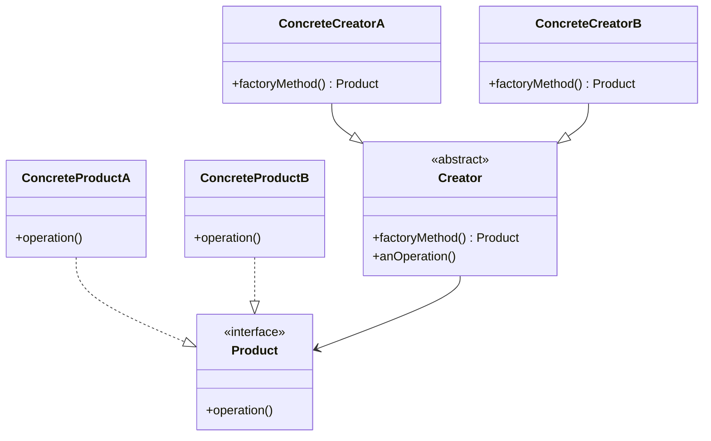
```mermaid
classDiagram
    class Product {
        <<interface>>
        +operation()
    }
    class ConcreteProductA {
        +operation()
    }
    class ConcreteProductB {
        +operation()
    }
    class Creator {
        <<abstract>>
        +factoryMethod() Product
        +anOperation()
    }
    class ConcreteCreatorA {
        +factoryMethod() Product
    }
    class ConcreteCreatorB {
        +factoryMethod() Product
    }
    ConcreteProductA ..|> Product
    ConcreteProductB ..|> Product
    ConcreteCreatorA --|> Creator
    ConcreteCreatorB --|> Creator
    Creator --> Product
```

角色解释：

- `Product`：抽象产品，声明所有产品共有操作。
- `ConcreteProduct`：具体产品，实现抽象产品接口。
- `Creator`：抽象创建者，声明 `factoryMethod()`，并在业务方法中使用抽象产品。
- `ConcreteCreator`：具体创建者，重写工厂方法，返回某个具体产品。

### 为什么这个结构能解决问题

如果客户端直接写 `new ConcreteProductA()`，新增产品 B 时就要修改客户端判断逻辑。工厂方法把“创建哪一种产品”推迟到子类，客户端只调用 `Product` 的公共操作。这样新增产品时，通常新增一个具体产品和一个具体创建者，不改原有客户端主流程，符合开闭原则。

### 题干关键字

- “父类定义创建对象的接口，由子类决定实例化哪一个类”
- “将对象创建延迟到子类”
- “框架需要让用户扩展内部组件”
- “不同平台/不同环境创建不同产品，但使用方式一致”

### 典型 Java 代码骨架

```java
interface Product {
    void operation();
}

class ConcreteProductA implements Product {
    public void operation() {
        System.out.println("A");
    }
}

abstract class Creator {
    public void anOperation() {
        Product product = factoryMethod();
        product.operation();
    }

    protected abstract Product factoryMethod();
}

class ConcreteCreatorA extends Creator {
    protected Product factoryMethod() {
        return new ConcreteProductA();
    }
}
```

### 典型使用场景

- 跨平台 UI：`Dialog` 创建不同平台的 `Button`。
- 日志框架：不同创建者生成文件日志、数据库日志、远程日志。
- 支付接口：不同子类创建微信支付、支付宝支付、银行卡支付对象。

### 常见考法和答题关键词

- 填类名：`Product`、`ConcreteProduct`、`Creator`、`ConcreteCreator`。
- 填方法名：`factoryMethod()`、`createProduct()`。
- 判断关系：具体产品实现产品接口；具体创建者继承抽象创建者；创建者依赖抽象产品。
- 稳妥关键词：`定义创建对象的接口`、`子类决定实例化`、`客户端依赖抽象产品`、`扩展产品不修改原业务逻辑`。

### 容易混淆

- 和简单工厂：简单工厂通常一个工厂类里用 `if/switch` 创建产品，不属于 GoF 23 种；工厂方法用子类重写工厂方法。
- 和抽象工厂：工厂方法创建一个产品等级结构中的一个产品；抽象工厂创建一族相关产品。

## 2. 抽象工厂模式 Abstract Factory

### 核心意图

提供一个创建一族相关或相互依赖对象的接口，而无需指定它们的具体类。重点是“产品族一致性”。

### 典型类图角色和关系

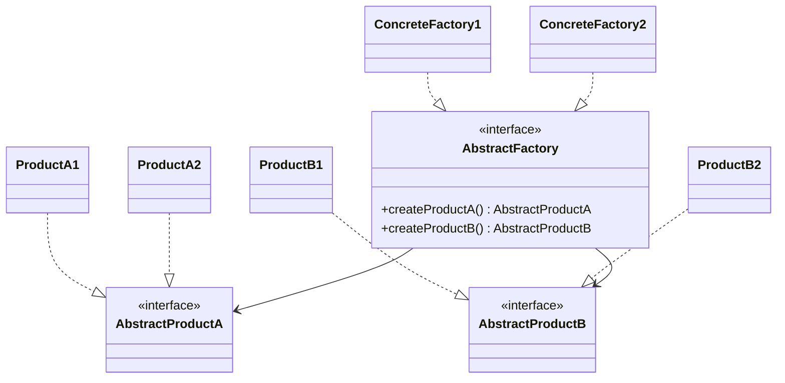
```mermaid
classDiagram
    class AbstractFactory {
        <<interface>>
        +createProductA() AbstractProductA
        +createProductB() AbstractProductB
    }
    class ConcreteFactory1
    class ConcreteFactory2
    class AbstractProductA {
        <<interface>>
    }
    class AbstractProductB {
        <<interface>>
    }
    class ProductA1
    class ProductA2
    class ProductB1
    class ProductB2
    ConcreteFactory1 ..|> AbstractFactory
    ConcreteFactory2 ..|> AbstractFactory
    ProductA1 ..|> AbstractProductA
    ProductA2 ..|> AbstractProductA
    ProductB1 ..|> AbstractProductB
    ProductB2 ..|> AbstractProductB
    AbstractFactory --> AbstractProductA
    AbstractFactory --> AbstractProductB
```

### 为什么这个结构能解决问题

如果一个系统需要同时创建“Windows 按钮 + Windows 文本框”或“Mac 按钮 + Mac 文本框”，单独创建每个对象容易混用产品族。抽象工厂把同一族产品的创建方法放在一个工厂中，客户端拿到 `WindowsFactory` 后，只能创建 Windows 族产品，从结构上保证一致。

### 题干关键字

- “创建一系列相关或相互依赖的对象”
- “产品族”
- “保证同一风格/同一平台的一组对象配套使用”
- “不指定具体类”

### 典型 Java 代码骨架

```java
interface Button {
    void paint();
}

interface TextField {
    void input();
}

interface GuiFactory {
    Button createButton();
    TextField createTextField();
}

class WindowsFactory implements GuiFactory {
    public Button createButton() {
        return new WindowsButton();
    }

    public TextField createTextField() {
        return new WindowsTextField();
    }
}

class WindowsButton implements Button {
    public void paint() {}
}

class WindowsTextField implements TextField {
    public void input() {}
}
```

### 典型使用场景

- 跨平台控件族：按钮、文本框、菜单必须同平台风格。
- 数据库访问族：Oracle 连接、命令、结果集配套使用。
- 游戏皮肤族：森林地图的树、地面、怪物；沙漠地图的一组对象。

### 常见考法和答题关键词

- 填类名：`AbstractFactory`、`ConcreteFactory`、`AbstractProductA/B`。
- 填方法：`createProductA()`、`createProductB()`。
- 判断关系：具体工厂实现抽象工厂；具体产品实现抽象产品；客户端只使用抽象工厂和抽象产品。
- 稳妥关键词：`产品族`、`一组相关对象`、`保证兼容性`、`不暴露具体类`。

### 容易混淆

- 和工厂方法：抽象工厂通常包含多个创建方法，创建一族产品；工厂方法通常一个方法创建一个产品等级结构。
- 和生成器：抽象工厂强调产品族；生成器强调复杂对象的分步构造过程。

## 3. 生成器模式 Builder

### 核心意图

将一个复杂对象的构造过程与它的表示分离，使同样的构造过程可以创建不同表示。

### 典型类图角色和关系

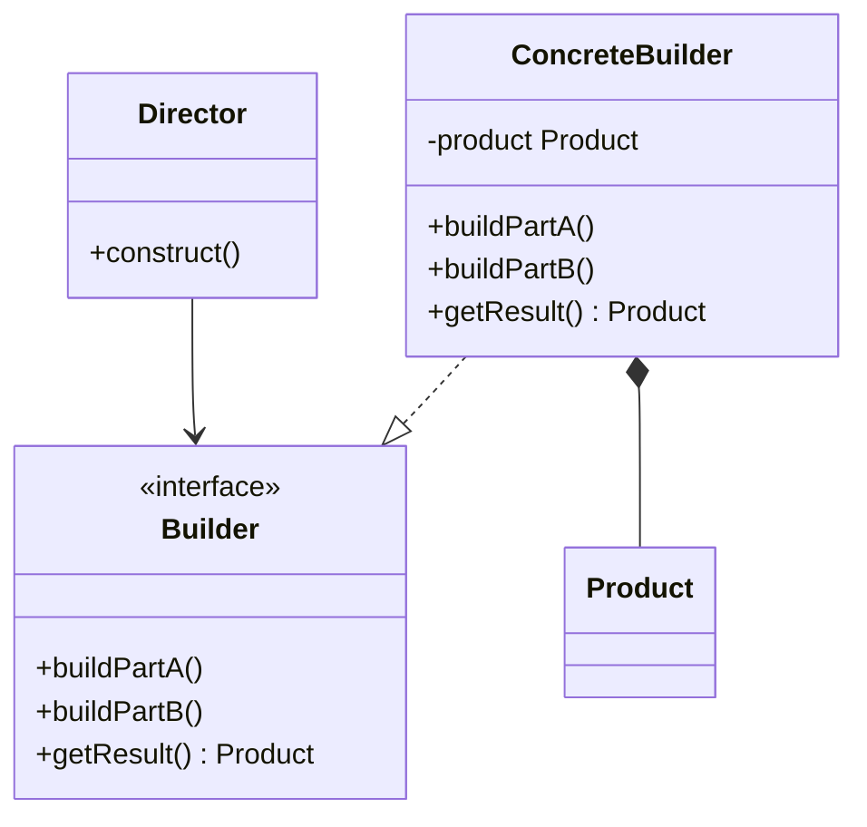
```mermaid
classDiagram
    class Director {
        +construct()
    }
    class Builder {
        <<interface>>
        +buildPartA()
        +buildPartB()
        +getResult() Product
    }
    class ConcreteBuilder {
        -product Product
        +buildPartA()
        +buildPartB()
        +getResult() Product
    }
    class Product
    Director --> Builder
    ConcreteBuilder ..|> Builder
    ConcreteBuilder *-- Product
```

### 为什么这个结构能解决问题

复杂对象往往有很多部件和构建顺序。如果把构建步骤都塞进构造函数，参数会膨胀，代码难读。生成器把“怎么一步步建”放进 `Builder`，把“按什么顺序建”放进 `Director`，最终产品由具体生成器维护。这样同一套步骤可以产生不同表示，例如普通报告、HTML 报告、PDF 报告。

### 题干关键字

- “复杂对象”
- “分步骤构建”
- “构造过程与表示分离”
- “相同构建过程产生不同表示”
- “Director 指挥 Builder”

### 典型 Java 代码骨架

```java
class Product {
    private String partA;
    private String partB;
    public void setPartA(String partA) { this.partA = partA; }
    public void setPartB(String partB) { this.partB = partB; }
}

interface Builder {
    void buildPartA();
    void buildPartB();
    Product getResult();
}

class ConcreteBuilder implements Builder {
    private final Product product = new Product();
    public void buildPartA() { product.setPartA("A"); }
    public void buildPartB() { product.setPartB("B"); }
    public Product getResult() { return product; }
}

class Director {
    public Product construct(Builder builder) {
        builder.buildPartA();
        builder.buildPartB();
        return builder.getResult();
    }
}
```

### 典型使用场景

- 报表、邮件、套餐、复杂配置对象。
- 需要按固定顺序组装多个部件。
- 构造参数很多，且有可选项。

### 常见考法和答题关键词

- 填角色：`Director`、`Builder`、`ConcreteBuilder`、`Product`。
- 填方法：`buildPart()`、`getResult()`、`construct()`。
- 判断关系：Director 依赖 Builder；ConcreteBuilder 实现 Builder 并组合 Product。
- 稳妥关键词：`分步构造`、`构造过程和表示分离`、`相同过程不同产品表示`。

### 容易混淆

- 和抽象工厂：抽象工厂一次返回一族产品；生成器分多步构造一个复杂产品。
- 和模板方法：模板方法是算法步骤固定在父类中；生成器是构建步骤由 Director 调度，Builder 负责创建产品部件。

## 4. 原型模式 Prototype

### 核心意图

通过复制已有对象来创建新对象，使客户端无需依赖被复制对象的具体类。

### 典型类图角色和关系

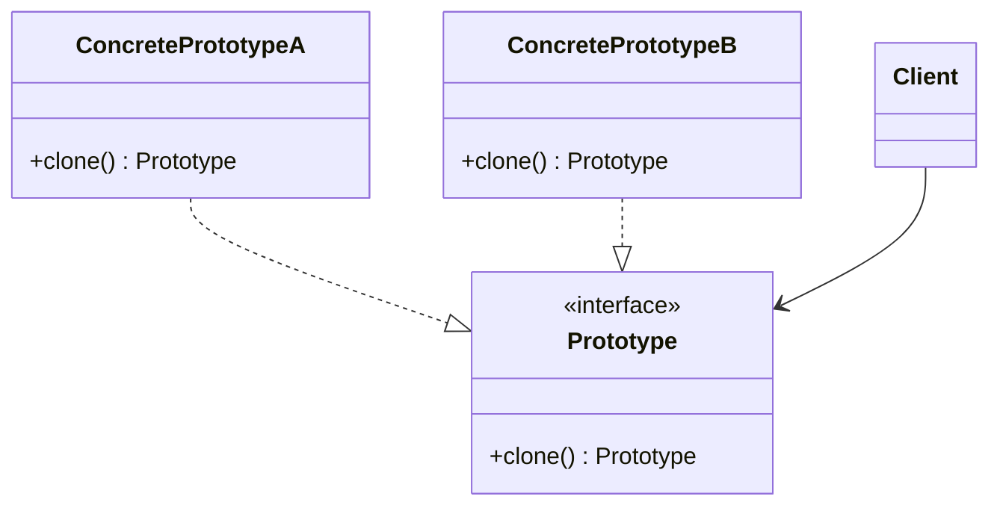
```mermaid
classDiagram
    class Prototype {
        <<interface>>
        +clone() Prototype
    }
    class ConcretePrototypeA {
        +clone() Prototype
    }
    class ConcretePrototypeB {
        +clone() Prototype
    }
    class Client
    ConcretePrototypeA ..|> Prototype
    ConcretePrototypeB ..|> Prototype
    Client --> Prototype
```

### 为什么这个结构能解决问题

如果对象初始化成本高，或者客户端只知道接口不知道具体类，直接 `new` 不合适。原型模式让对象自己负责复制自己，私有字段也能由对象内部复制。客户端只调用 `clone()`，不关心真实类型。

### 题干关键字

- “复制已有对象”
- “克隆”
- “对象初始化复杂，创建成本高”
- “不依赖具体类创建相同对象”
- “原型注册表”

### 典型 Java 代码骨架

```java
interface Prototype {
    Prototype copy();
}

class Report implements Prototype {
    private String title;
    private String content;

    public Report(String title, String content) {
        this.title = title;
        this.content = content;
    }

    private Report(Report source) {
        this.title = source.title;
        this.content = source.content;
    }

    public Prototype copy() {
        return new Report(this);
    }
}
```

### 典型使用场景

- 复制图形对象、报表模板、配置模板。
- 对象创建成本高，需要从模板对象快速复制。
- 对象具体类型运行时才知道。

### 常见考法和答题关键词

- 填角色：`Prototype`、`ConcretePrototype`、`Client`。
- 填方法：`clone()`、`copy()`。
- 判断关系：具体原型实现原型接口；客户端依赖原型接口。
- 稳妥关键词：`通过克隆创建对象`、`避免依赖具体类`、`适合复杂初始化对象`。

### 容易混淆

- 和备忘录：原型复制完整对象用于创建；备忘录保存状态用于恢复。
- 和工厂方法：工厂方法通常通过子类决定创建；原型通过已有对象复制。

## 5. 单例模式 Singleton

### 核心意图

保证一个类只有一个实例，并提供全局访问点。

### 典型类图角色和关系

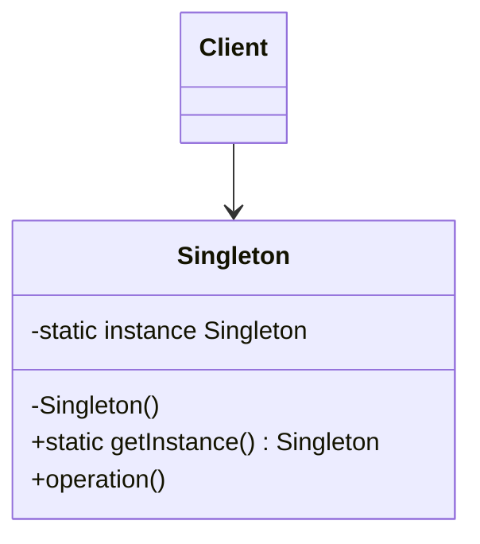
```mermaid
classDiagram
    class Singleton {
        -static instance Singleton
        -Singleton()
        +static getInstance() Singleton
        +operation()
    }
    class Client
    Client --> Singleton
```

### 为什么这个结构能解决问题

有些对象本质上应全局唯一，例如配置管理器、日志对象、连接池管理器。单例通过私有构造函数阻止外部 `new`，通过静态字段保存唯一实例，通过静态方法返回该实例。

### 题干关键字

- “唯一实例”
- “全局访问点”
- “私有构造方法”
- “静态实例、静态 getInstance”
- “配置管理器、日志管理器”

### 典型 Java 代码骨架

```java
class Singleton {
    private static final Singleton INSTANCE = new Singleton();

    private Singleton() {
    }

    public static Singleton getInstance() {
        return INSTANCE;
    }

    public void operation() {
    }
}
```

### 典型使用场景

- 系统配置、日志、缓存管理器、线程池管理器。
- 需要共享状态且严格只允许一个实例。

### 常见考法和答题关键词

- 填方法：`getInstance()`。
- 填字段：`private static Singleton instance`。
- 判断构造：构造方法必须 `private`。
- 稳妥关键词：`唯一实例`、`全局访问点`、`私有构造`、`静态实例`。

### 容易混淆

- 和工具类：工具类通常全是静态方法，不一定有对象实例；单例仍是对象，可实现接口、可延迟初始化。
- 和享元：单例强调一个类一个实例；享元强调大量细粒度对象共享内部状态，不一定只有一个对象。

---

# 二、结构型模式

结构型模式解决的共同问题是：类或对象如何组合，才能形成更灵活的结构。下午题经常要求判断“持有引用”“继承同一接口”“组合树结构”“代理和真实主题同接口”等 UML 关系。

## 6. 适配器模式 Adapter

### 核心意图

将一个类的接口转换成客户端期望的另一个接口，使原本接口不兼容的类可以协同工作。

### 典型类图角色和关系

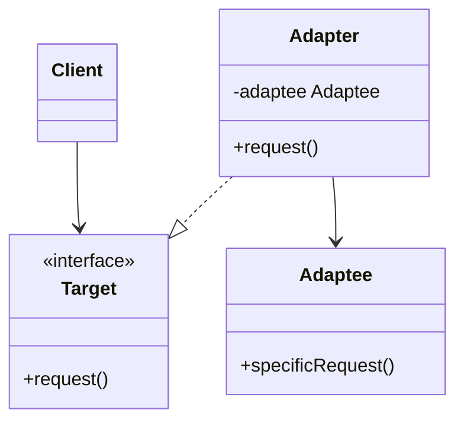
```mermaid
classDiagram
    class Target {
        <<interface>>
        +request()
    }
    class Adapter {
        -adaptee Adaptee
        +request()
    }
    class Adaptee {
        +specificRequest()
    }
    class Client
    Adapter ..|> Target
    Adapter --> Adaptee
    Client --> Target
```

### 为什么这个结构能解决问题

客户端只认识 `Target.request()`，已有类只提供 `Adaptee.specificRequest()`。适配器实现目标接口，在 `request()` 中调用被适配者的方法，把不兼容接口包一层转换掉。这样可以复用已有类，又不修改客户端。

### 题干关键字

- “接口不兼容”
- “已有类不能直接使用”
- “将一个接口转换成另一个接口”
- “包装已有类”
- “兼容旧系统/第三方库”

### 典型 Java 代码骨架

```java
interface Target {
    void request();
}

class Adaptee {
    void specificRequest() {
    }
}

class Adapter implements Target {
    private final Adaptee adaptee;

    Adapter(Adaptee adaptee) {
        this.adaptee = adaptee;
    }

    public void request() {
        adaptee.specificRequest();
    }
}
```

### 典型使用场景

- 新系统接入旧接口。
- 第三方 SDK 方法名、参数和系统接口不一致。
- 数据格式转换，如 XML 接口适配 JSON 调用。

### 常见考法和答题关键词

- 填角色：`Target`、`Adapter`、`Adaptee`、`Client`。
- 填方法：`request()` 调用 `specificRequest()`。
- 判断关系：Adapter 实现 Target，持有 Adaptee。
- 稳妥关键词：`接口转换`、`复用已有类`、`客户端面向目标接口`。

### 容易混淆

- 和装饰：适配器改变接口；装饰保持同一接口并增加职责。
- 和代理：代理和真实主题接口一致，控制访问；适配器解决接口不兼容。

## 7. 桥接模式 Bridge

### 核心意图

将抽象部分与实现部分分离，使它们可以独立变化。

### 典型类图角色和关系

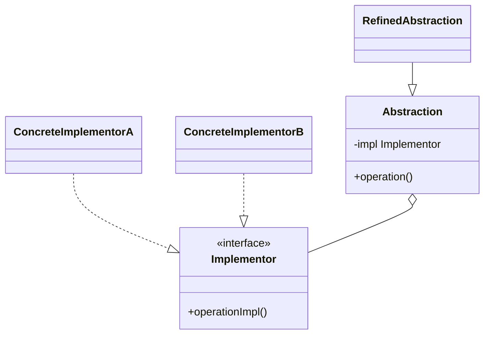
```mermaid
classDiagram
    class Abstraction {
        -impl Implementor
        +operation()
    }
    class RefinedAbstraction
    class Implementor {
        <<interface>>
        +operationImpl()
    }
    class ConcreteImplementorA
    class ConcreteImplementorB
    RefinedAbstraction --|> Abstraction
    ConcreteImplementorA ..|> Implementor
    ConcreteImplementorB ..|> Implementor
    Abstraction o-- Implementor
```

### 为什么这个结构能解决问题

如果“形状类型”和“绘制平台”两个维度都变化，使用继承会形成 `WindowsCircle`、`LinuxCircle`、`WindowsRectangle` 等组合爆炸。桥接把一个维度做成抽象类层次，另一个维度做成实现接口，抽象类持有实现接口引用。两个维度各自扩展，不互相膨胀。

### 题干关键字

- “抽象和实现分离”
- “两个维度独立变化”
- “避免多层继承导致类爆炸”
- “Abstraction 持有 Implementor”

### 典型 Java 代码骨架

```java
interface DrawApi {
    void drawCircle(int x, int y, int r);
}

class OpenGlDrawApi implements DrawApi {
    public void drawCircle(int x, int y, int r) {}
}

abstract class Shape {
    protected final DrawApi drawApi;

    protected Shape(DrawApi drawApi) {
        this.drawApi = drawApi;
    }

    abstract void draw();
}

class Circle extends Shape {
    Circle(DrawApi drawApi) {
        super(drawApi);
    }

    void draw() {
        drawApi.drawCircle(0, 0, 10);
    }
}
```

### 典型使用场景

- 图形类型和绘制平台独立变化。
- 消息类型和发送渠道独立变化。
- 遥控器抽象和设备实现独立变化。

### 常见考法和答题关键词

- 填角色：`Abstraction`、`RefinedAbstraction`、`Implementor`、`ConcreteImplementor`。
- 判断关系：Abstraction 聚合 Implementor；实现类实现 Implementor。
- 稳妥关键词：`两个变化维度`、`组合代替多重继承`、`抽象部分委托实现部分`。

### 容易混淆

- 和适配器：适配器通常用于已有接口不兼容；桥接通常在设计初期拆分两个变化维度。
- 和策略：策略替换算法；桥接拆分抽象和实现两个类层次。

## 8. 组合模式 Composite

### 核心意图

将对象组合成树形结构，使客户端可以用一致方式处理单个对象和组合对象。

### 典型类图角色和关系

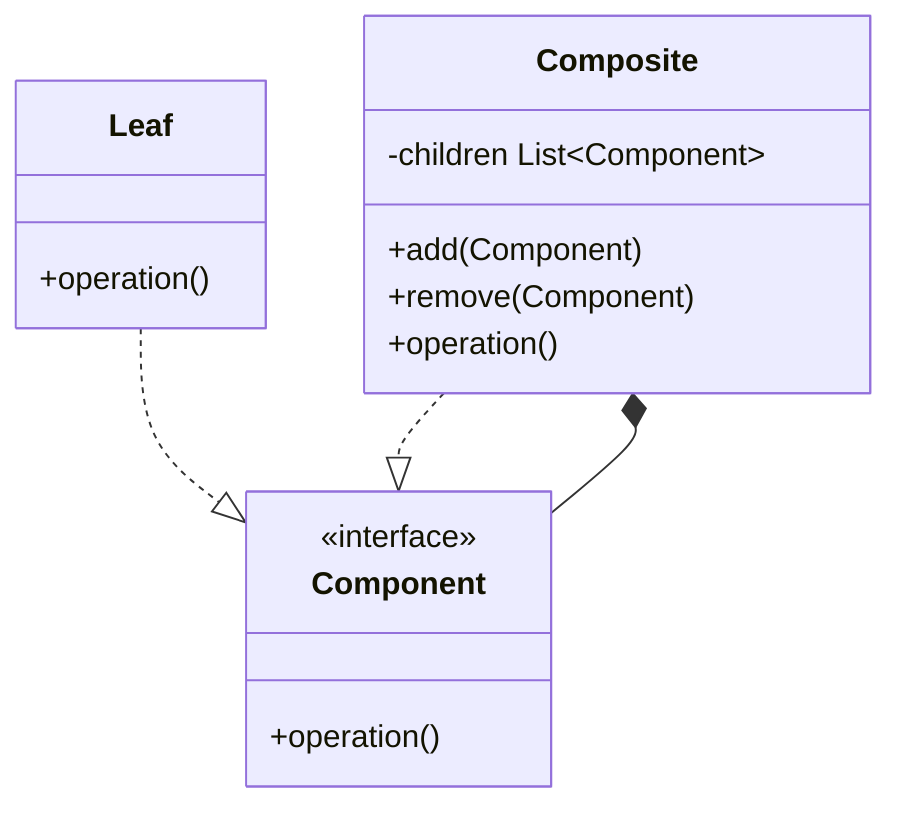
```mermaid
classDiagram
    class Component {
        <<interface>>
        +operation()
    }
    class Leaf {
        +operation()
    }
    class Composite {
        -children List~Component~
        +add(Component)
        +remove(Component)
        +operation()
    }
    Leaf ..|> Component
    Composite ..|> Component
    Composite *-- Component
```

### 为什么这个结构能解决问题

树形结构中，叶子节点和容器节点经常需要被统一处理。组合模式让 `Leaf` 和 `Composite` 都实现 `Component`，客户端只面对 `Component`。组合对象内部保存子组件列表，并把操作递归委托给子节点。

### 题干关键字

- “树形结构”
- “整体-部分”
- “一致处理单个对象和组合对象”
- “递归组合”
- “文件夹和文件、菜单和菜单项”

### 典型 Java 代码骨架

```java
interface Component {
    void operation();
}

class Leaf implements Component {
    public void operation() {}
}

class Composite implements Component {
    private final java.util.List<Component> children = new java.util.ArrayList<>();

    public void add(Component child) {
        children.add(child);
    }

    public void operation() {
        for (Component child : children) {
            child.operation();
        }
    }
}
```

### 典型使用场景

- 文件系统：文件夹包含文件和子文件夹。
- 菜单系统：菜单包含菜单项和子菜单。
- 组织机构：部门包含员工和子部门。

### 常见考法和答题关键词

- 填角色：`Component`、`Leaf`、`Composite`。
- 填方法：`add()`、`remove()`、`getChild()`、`operation()`。
- 判断关系：Composite 组合多个 Component。
- 稳妥关键词：`树形结构`、`整体-部分一致处理`、`递归调用`。

### 容易混淆

- 和装饰：组合是树形整体-部分；装饰是链式包裹对象以增强职责。
- 和责任链：责任链是一条处理链；组合是对象树。

## 9. 装饰模式 Decorator

### 核心意图

在不改变对象接口、不使用大量子类的情况下，动态地给对象增加职责。

### 典型类图角色和关系

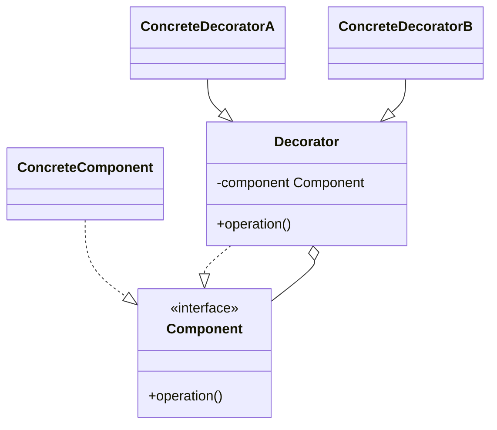
```mermaid
classDiagram
    class Component {
        <<interface>>
        +operation()
    }
    class ConcreteComponent
    class Decorator {
        -component Component
        +operation()
    }
    class ConcreteDecoratorA
    class ConcreteDecoratorB
    ConcreteComponent ..|> Component
    Decorator ..|> Component
    ConcreteDecoratorA --|> Decorator
    ConcreteDecoratorB --|> Decorator
    Decorator o-- Component
```

### 为什么这个结构能解决问题

如果用继承给对象增加功能，功能组合会导致子类爆炸。装饰模式让装饰类和原对象实现同一接口，装饰类内部持有一个 `Component`，在调用前后增加行为。多个装饰器可以层层包裹，形成运行时组合。

### 题干关键字

- “动态增加职责”
- “不改变接口”
- “比继承更灵活”
- “包装对象，调用前后增强”
- “多层装饰”

### 典型 Java 代码骨架

```java
interface DataSource {
    String read();
}

class FileDataSource implements DataSource {
    public String read() {
        return "data";
    }
}

abstract class DataSourceDecorator implements DataSource {
    protected final DataSource source;

    protected DataSourceDecorator(DataSource source) {
        this.source = source;
    }

    public String read() {
        return source.read();
    }
}

class EncryptionDecorator extends DataSourceDecorator {
    EncryptionDecorator(DataSource source) {
        super(source);
    }

    public String read() {
        return decrypt(super.read());
    }

    private String decrypt(String value) {
        return value;
    }
}
```

### 典型使用场景

- Java IO 流：缓冲流、数据流、对象流层层包装。
- 消息发送：邮件通知外再叠加短信、微信通知。
- 数据读写：压缩、加密、缓存增强。

### 常见考法和答题关键词

- 填角色：`Component`、`ConcreteComponent`、`Decorator`、`ConcreteDecorator`。
- 填方法：装饰器的 `operation()` 调用被装饰对象的 `operation()`。
- 判断关系：Decorator 实现 Component 并持有 Component。
- 稳妥关键词：`动态扩展职责`、`透明包装`、`组合优于继承`、`同一接口`。

### 容易混淆

- 和适配器：装饰不改变接口；适配器改变接口。
- 和代理：代理控制访问；装饰增加职责。

## 10. 外观模式 Facade

### 核心意图

为复杂子系统提供一个统一、简化的高层接口，使客户端更容易使用子系统。

### 典型类图角色和关系

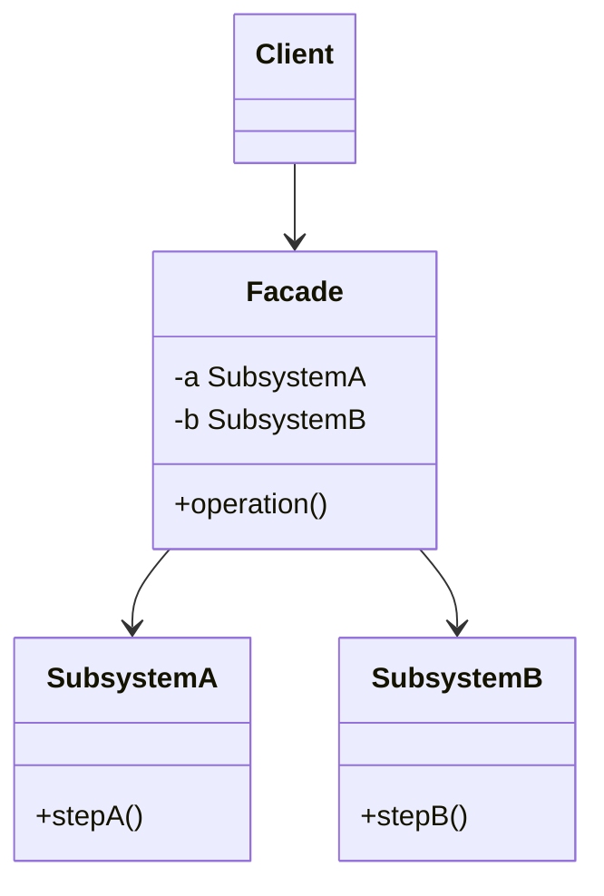
```mermaid
classDiagram
    class Facade {
        -a SubsystemA
        -b SubsystemB
        +operation()
    }
    class SubsystemA {
        +stepA()
    }
    class SubsystemB {
        +stepB()
    }
    class Client
    Client --> Facade
    Facade --> SubsystemA
    Facade --> SubsystemB
```

### 为什么这个结构能解决问题

复杂子系统可能有很多类和调用顺序。客户端如果直接调用每个子系统类，就会高度耦合。外观类封装常用流程，客户端只调用一个高层方法。子系统仍可被高级客户端直接使用，但普通客户端通过外观降低复杂度。

### 题干关键字

- “统一入口”
- “简化复杂子系统”
- “降低客户端与子系统耦合”
- “高层接口”
- “一键完成多个子系统调用”

### 典型 Java 代码骨架

```java
class CompilerFacade {
    private final Lexer lexer = new Lexer();
    private final Parser parser = new Parser();
    private final CodeGenerator generator = new CodeGenerator();

    public void compile(String source) {
        Tokens tokens = lexer.scan(source);
        Ast ast = parser.parse(tokens);
        generator.generate(ast);
    }
}

class Lexer { Tokens scan(String source) { return new Tokens(); } }
class Parser { Ast parse(Tokens tokens) { return new Ast(); } }
class CodeGenerator { void generate(Ast ast) {} }
class Tokens {}
class Ast {}
```

### 典型使用场景

- 编译器一键编译。
- 多媒体转换库封装读取、解码、转换、编码。
- 业务服务封装多个 DAO 或外部系统调用。

### 常见考法和答题关键词

- 填角色：`Facade`、`Subsystem`、`Client`。
- 判断关系：Facade 依赖多个子系统类；客户端依赖 Facade。
- 稳妥关键词：`统一高层接口`、`简化调用`、`降低耦合`。

### 容易混淆

- 和中介者：外观简化对子系统的访问，子系统类之间未必通过外观通信；中介者协调同事对象之间的交互。
- 和代理：代理与真实主题同接口并控制访问；外观提供新接口简化多个子系统。

## 11. 享元模式 Flyweight

### 核心意图

通过共享大量细粒度对象的内部状态，减少内存占用。

### 典型类图角色和关系

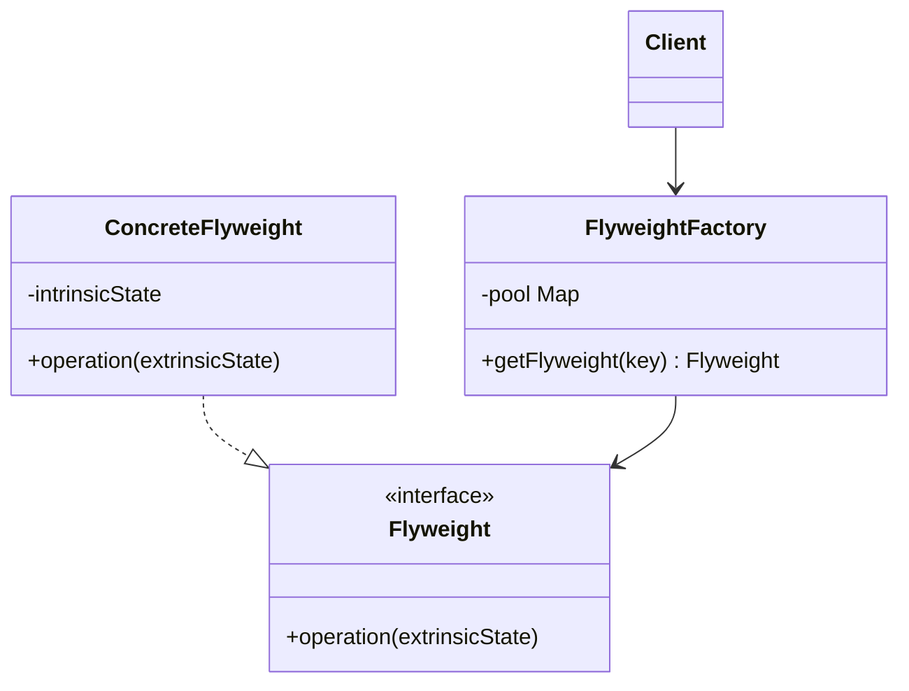
```mermaid
classDiagram
    class Flyweight {
        <<interface>>
        +operation(extrinsicState)
    }
    class ConcreteFlyweight {
        -intrinsicState
        +operation(extrinsicState)
    }
    class FlyweightFactory {
        -pool Map
        +getFlyweight(key) Flyweight
    }
    class Client
    ConcreteFlyweight ..|> Flyweight
    FlyweightFactory --> Flyweight
    Client --> FlyweightFactory
```

### 为什么这个结构能解决问题

如果系统创建大量相似对象，例如棋子、字符、树木，每个对象都保存重复数据会浪费内存。享元模式把可共享、不随场景变化的内部状态放进享元对象，把随场景变化的外部状态由客户端传入。工厂负责复用已有享元。

### 题干关键字

- “大量细粒度对象”
- “共享对象”
- “内部状态/外部状态”
- “对象池”
- “减少内存”

### 典型 Java 代码骨架

```java
interface TreeType {
    void draw(int x, int y);
}

class SharedTreeType implements TreeType {
    private final String name;
    private final String color;

    SharedTreeType(String name, String color) {
        this.name = name;
        this.color = color;
    }

    public void draw(int x, int y) {
    }
}

class TreeTypeFactory {
    private final java.util.Map<String, TreeType> pool = new java.util.HashMap<>();

    public TreeType getTreeType(String name, String color) {
        String key = name + ":" + color;
        return pool.computeIfAbsent(key, k -> new SharedTreeType(name, color));
    }
}
```

### 典型使用场景

- 文本编辑器字符对象共享字形。
- 棋盘棋子类型共享。
- 大地图中成千上万棵树共享树种、颜色、纹理。

### 常见考法和答题关键词

- 填角色：`Flyweight`、`ConcreteFlyweight`、`FlyweightFactory`。
- 填字段：`pool`、`Map`、`intrinsicState`。
- 判断状态：内部状态可共享；外部状态由客户端传入。
- 稳妥关键词：`共享细粒度对象`、`内部状态共享`、`外部状态参数化`、`节省内存`。

### 容易混淆

- 和单例：单例保证一个类一个实例；享元是按 key 共享多个对象。
- 和原型：原型复制对象；享元复用对象。

## 12. 代理模式 Proxy

### 核心意图

为其他对象提供一个代理，以控制对真实对象的访问。

### 典型类图角色和关系

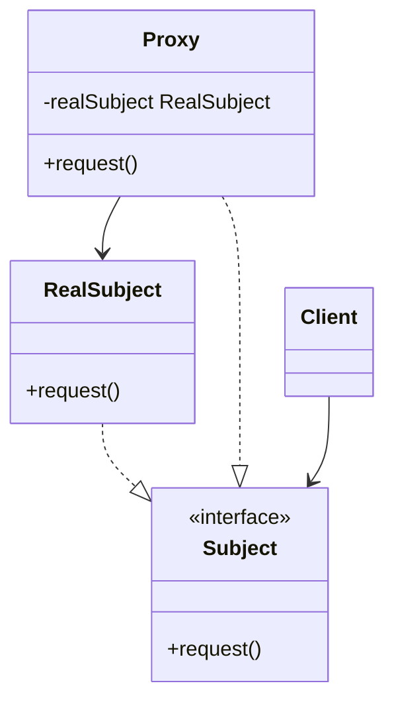
```mermaid
classDiagram
    class Subject {
        <<interface>>
        +request()
    }
    class RealSubject {
        +request()
    }
    class Proxy {
        -realSubject RealSubject
        +request()
    }
    class Client
    RealSubject ..|> Subject
    Proxy ..|> Subject
    Proxy --> RealSubject
    Client --> Subject
```

### 为什么这个结构能解决问题

客户端想访问真实对象，但访问前可能需要权限检查、延迟加载、缓存、远程调用等控制逻辑。代理和真实对象实现同一接口，客户端无感知地调用代理，代理再决定是否、何时、如何调用真实对象。

### 题干关键字

- “控制访问”
- “真实主题”
- “代理对象和真实对象同接口”
- “远程代理、虚拟代理、保护代理、缓存代理”
- “延迟加载”

### 典型 Java 代码骨架

```java
interface Image {
    void display();
}

class RealImage implements Image {
    private final String fileName;

    RealImage(String fileName) {
        this.fileName = fileName;
        loadFromDisk();
    }

    private void loadFromDisk() {}

    public void display() {}
}

class ImageProxy implements Image {
    private final String fileName;
    private RealImage realImage;

    ImageProxy(String fileName) {
        this.fileName = fileName;
    }

    public void display() {
        if (realImage == null) {
            realImage = new RealImage(fileName);
        }
        realImage.display();
    }
}
```

### 典型使用场景

- 图片懒加载。
- 权限校验代理。
- 远程服务本地代理。
- 缓存代理。

### 常见考法和答题关键词

- 填角色：`Subject`、`RealSubject`、`Proxy`。
- 判断关系：Proxy 和 RealSubject 实现同一接口；Proxy 持有 RealSubject。
- 稳妥关键词：`控制访问`、`代理与真实主题同接口`、`延迟加载/权限/缓存/远程访问`。

### 容易混淆

- 和装饰：装饰增加职责，可多层叠加；代理控制访问，通常代表真实对象。
- 和外观：外观简化多个子系统；代理控制单个真实对象访问。

---

# 三、行为型模式

行为型模式解决的共同问题是：对象之间怎样分配职责、怎样通信、怎样封装变化行为。下午题常考 `handleRequest`、`execute`、`interpret`、`notify`、`accept/visit`、`templateMethod` 等方法名。

## 13. 责任链模式 Chain of Responsibility

### 核心意图

将请求沿着处理者链传递，使多个对象都有机会处理请求，发送者无需知道具体处理者。

### 典型类图角色和关系

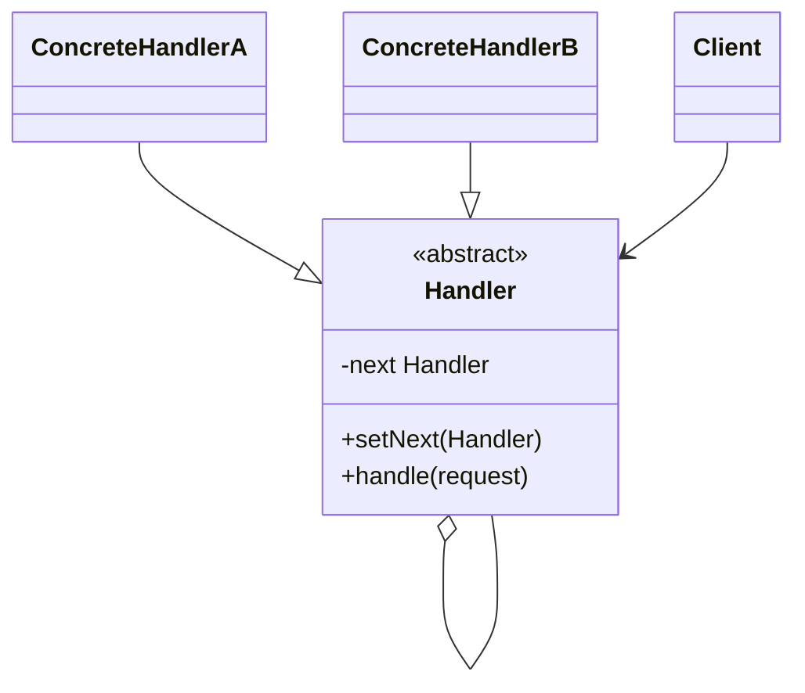
```mermaid
classDiagram
    class Handler {
        <<abstract>>
        -next Handler
        +setNext(Handler)
        +handle(request)
    }
    class ConcreteHandlerA
    class ConcreteHandlerB
    class Client
    ConcreteHandlerA --|> Handler
    ConcreteHandlerB --|> Handler
    Handler o-- Handler
    Client --> Handler
```

### 为什么这个结构能解决问题

请求可能需要多个处理步骤，或者由哪个对象处理在运行时才确定。责任链让每个处理者保存下一个处理者引用，自己能处理就处理，否则转发。客户端只把请求交给链头，不关心后续对象。

### 题干关键字

- “请求沿链传递”
- “多个对象都有机会处理请求”
- “处理者可决定是否传给下一个”
- “审批流、过滤器链、请假审批”

### 典型 Java 代码骨架

```java
abstract class Handler {
    private Handler next;

    public Handler setNext(Handler next) {
        this.next = next;
        return next;
    }

    public void handle(int amount) {
        if (canHandle(amount)) {
            doHandle(amount);
        } else if (next != null) {
            next.handle(amount);
        }
    }

    protected abstract boolean canHandle(int amount);
    protected abstract void doHandle(int amount);
}

class Manager extends Handler {
    protected boolean canHandle(int amount) { return amount <= 1000; }
    protected void doHandle(int amount) {}
}
```

### 典型使用场景

- 请假/报销审批。
- Web 过滤器链。
- 日志级别处理。
- GUI 事件冒泡。

### 常见考法和答题关键词

- 填角色：`Handler`、`ConcreteHandler`、`Client`。
- 填字段：`successor`、`next`。
- 填方法：`handleRequest()`、`setSuccessor()`。
- 稳妥关键词：`请求发送者与接收者解耦`、`链式传递`、`多个处理者有机会处理`。

### 容易混淆

- 和装饰：责任链强调请求传递和处理选择；装饰强调增强同一对象行为。
- 和状态：状态切换由 Context 当前状态决定；责任链是多个处理者按链路判断。

## 14. 命令模式 Command

### 核心意图

将请求封装为对象，使请求可参数化、排队、记录日志、撤销或重做。

### 典型类图角色和关系

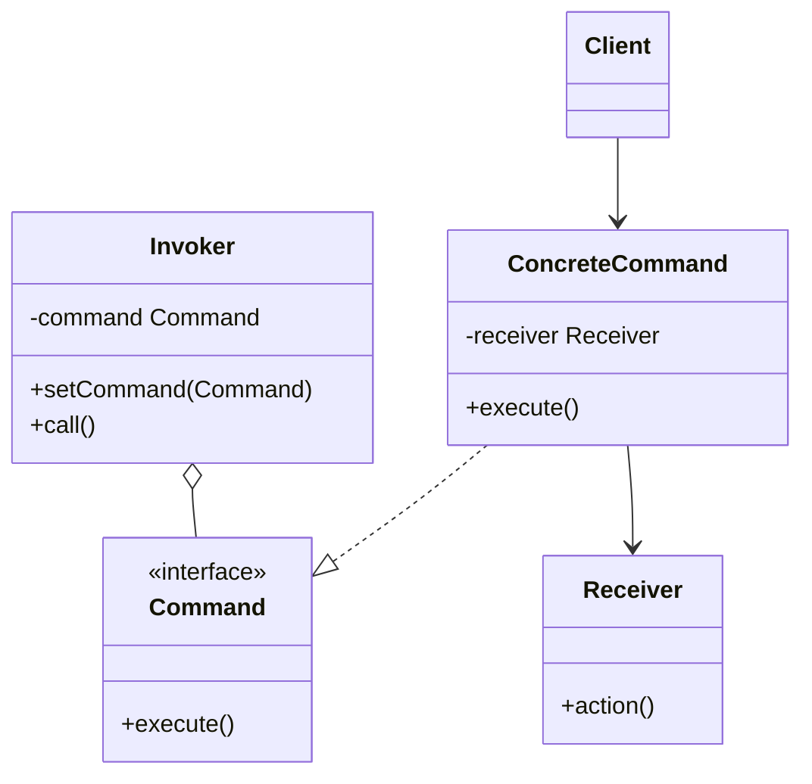
```mermaid
classDiagram
    class Command {
        <<interface>>
        +execute()
    }
    class ConcreteCommand {
        -receiver Receiver
        +execute()
    }
    class Receiver {
        +action()
    }
    class Invoker {
        -command Command
        +setCommand(Command)
        +call()
    }
    class Client
    ConcreteCommand ..|> Command
    ConcreteCommand --> Receiver
    Invoker o-- Command
    Client --> ConcreteCommand
```

### 为什么这个结构能解决问题

如果按钮、菜单、快捷键都直接调用业务对象，会造成调用者和接收者紧耦合。命令模式把一次请求封装成 `Command` 对象，调用者只执行 `command.execute()`。命令对象内部知道哪个接收者执行哪个动作，因此命令可以排队、撤销、记录。

### 题干关键字

- “将请求封装为对象”
- “撤销/重做”
- “队列请求、日志请求”
- “调用者 Invoker 与接收者 Receiver 解耦”
- “execute”

### 典型 Java 代码骨架

```java
interface Command {
    void execute();
}

class Light {
    void on() {}
}

class LightOnCommand implements Command {
    private final Light light;

    LightOnCommand(Light light) {
        this.light = light;
    }

    public void execute() {
        light.on();
    }
}

class Button {
    private Command command;

    void setCommand(Command command) {
        this.command = command;
    }

    void click() {
        command.execute();
    }
}
```

### 典型使用场景

- 按钮、菜单项、快捷键绑定操作。
- 事务命令、任务队列。
- 撤销/重做系统。

### 常见考法和答题关键词

- 填角色：`Command`、`ConcreteCommand`、`Receiver`、`Invoker`、`Client`。
- 填方法：`execute()`、`undo()`。
- 判断关系：ConcreteCommand 持有 Receiver；Invoker 持有 Command。
- 稳妥关键词：`请求对象化`、`调用者和接收者解耦`、`支持撤销、队列、日志`。

### 容易混淆

- 和责任链：命令封装请求；责任链传递请求给多个处理者。
- 和策略：策略封装算法供 Context 选择；命令封装一次操作请求，常用于执行、撤销、排队。

## 15. 解释器模式 Interpreter

### 核心意图

给定一种语言，定义它的文法表示，并定义解释器来解释语言中的句子。

### 典型类图角色和关系

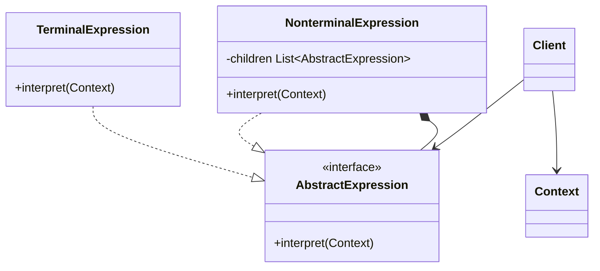
```mermaid
classDiagram
    class AbstractExpression {
        <<interface>>
        +interpret(Context)
    }
    class TerminalExpression {
        +interpret(Context)
    }
    class NonterminalExpression {
        -children List~AbstractExpression~
        +interpret(Context)
    }
    class Context
    class Client
    TerminalExpression ..|> AbstractExpression
    NonterminalExpression ..|> AbstractExpression
    NonterminalExpression *-- AbstractExpression
    Client --> AbstractExpression
    Client --> Context
```

### 为什么这个结构能解决问题

当问题可以表达为简单语言或规则表达式时，可以把每条语法规则建成一个表达式类。终结符表达式处理不可再拆的元素，非终结符表达式组合多个表达式。客户端构建表达式树，再调用 `interpret(context)` 得到结果。

### 题干关键字

- “文法”
- “语言的句子”
- “解释表达式”
- “终结符表达式、非终结符表达式”
- “Context 上下文”
- “规则引擎、表达式求值、SQL/正则的简化子集”

### 典型 Java 代码骨架

```java
interface Expression {
    boolean interpret(String context);
}

class TerminalExpression implements Expression {
    private final String data;

    TerminalExpression(String data) {
        this.data = data;
    }

    public boolean interpret(String context) {
        return context.contains(data);
    }
}

class OrExpression implements Expression {
    private final Expression left;
    private final Expression right;

    OrExpression(Expression left, Expression right) {
        this.left = left;
        this.right = right;
    }

    public boolean interpret(String context) {
        return left.interpret(context) || right.interpret(context);
    }
}
```

### 典型使用场景

- 简单表达式求值。
- 查询条件组合。
- 规则判断。
- 小型领域语言解释。

### 常见考法和答题关键词

- 填角色：`AbstractExpression`、`TerminalExpression`、`NonterminalExpression`、`Context`。
- 填方法：`interpret(Context context)`。
- 判断关系：非终结符表达式组合多个抽象表达式。
- 稳妥关键词：`文法表示`、`解释句子`、`表达式树`、`上下文`。

### 容易混淆

- 和组合：解释器常用组合结构组织表达式树，但目的在于解释语言；组合目的在于整体-部分一致处理。
- 和策略：策略选择算法；解释器按文法解释表达式。

## 16. 迭代器模式 Iterator

### 核心意图

在不暴露聚合对象内部表示的情况下，顺序访问其元素。

### 典型类图角色和关系

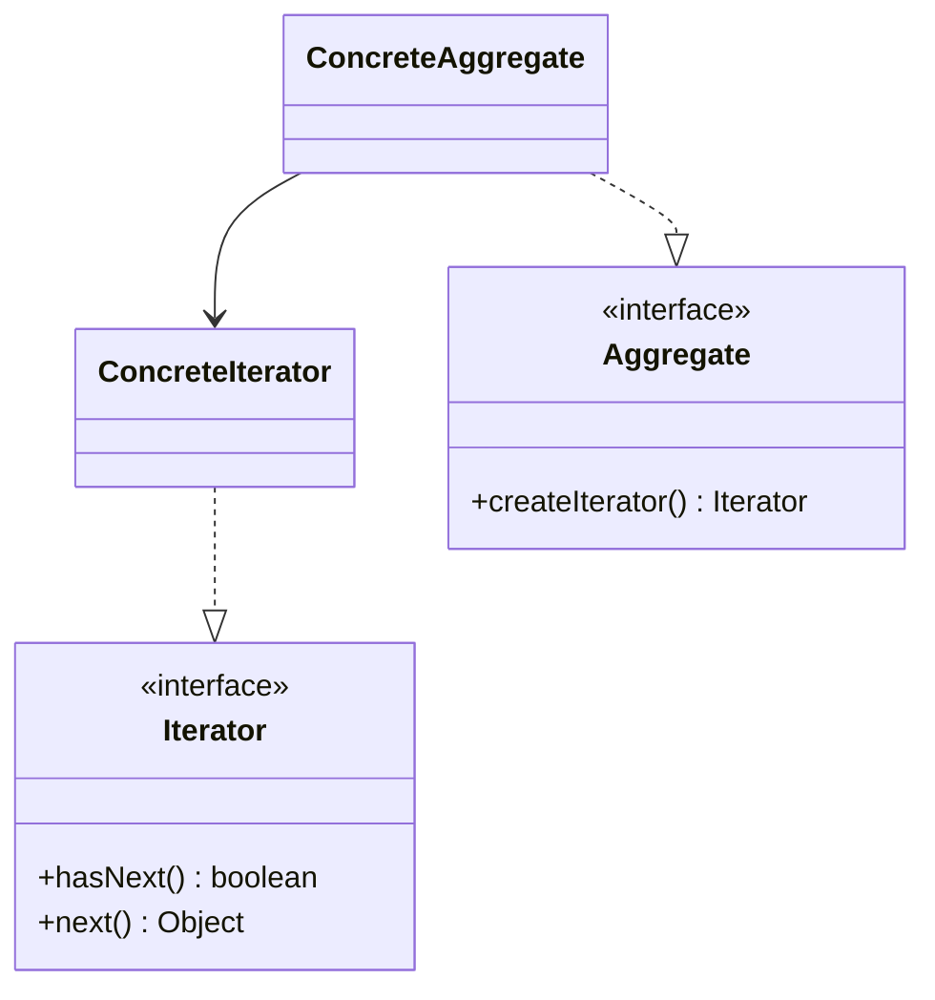
```mermaid
classDiagram
    class Iterator {
        <<interface>>
        +hasNext() boolean
        +next() Object
    }
    class ConcreteIterator
    class Aggregate {
        <<interface>>
        +createIterator() Iterator
    }
    class ConcreteAggregate
    ConcreteIterator ..|> Iterator
    ConcreteAggregate ..|> Aggregate
    ConcreteAggregate --> ConcreteIterator
```

### 为什么这个结构能解决问题

集合内部可能是数组、链表、树。客户端如果直接访问内部结构，会和具体实现耦合。迭代器把遍历逻辑封装成对象，客户端只使用 `hasNext()` 和 `next()`，不用知道集合内部怎么存。

### 题干关键字

- “顺序访问聚合对象元素”
- “不暴露内部表示”
- “遍历集合”
- “hasNext / next”

### 典型 Java 代码骨架

```java
interface MyIterator<E> {
    boolean hasNext();
    E next();
}

interface Aggregate<E> {
    MyIterator<E> iterator();
}

class NameList implements Aggregate<String> {
    private final String[] names = {"A", "B"};

    public MyIterator<String> iterator() {
        return new NameIterator();
    }

    private class NameIterator implements MyIterator<String> {
        private int index;
        public boolean hasNext() { return index < names.length; }
        public String next() { return names[index++]; }
    }
}
```

### 典型使用场景

- 集合遍历。
- 树结构前序/后序遍历。
- 分页数据遍历。

### 常见考法和答题关键词

- 填角色：`Iterator`、`ConcreteIterator`、`Aggregate`、`ConcreteAggregate`。
- 填方法：`hasNext()`、`next()`、`createIterator()`。
- 稳妥关键词：`遍历聚合对象`、`不暴露内部结构`、`封装遍历算法`。

### 容易混淆

- 和访问者：迭代器负责遍历元素；访问者负责对元素执行新操作。
- 和组合：组合组织树形对象；迭代器遍历聚合。

## 17. 中介者模式 Mediator

### 核心意图

用一个中介对象封装一组对象之间的交互，使对象之间不再显式相互引用，从而降低耦合。

### 典型类图角色和关系

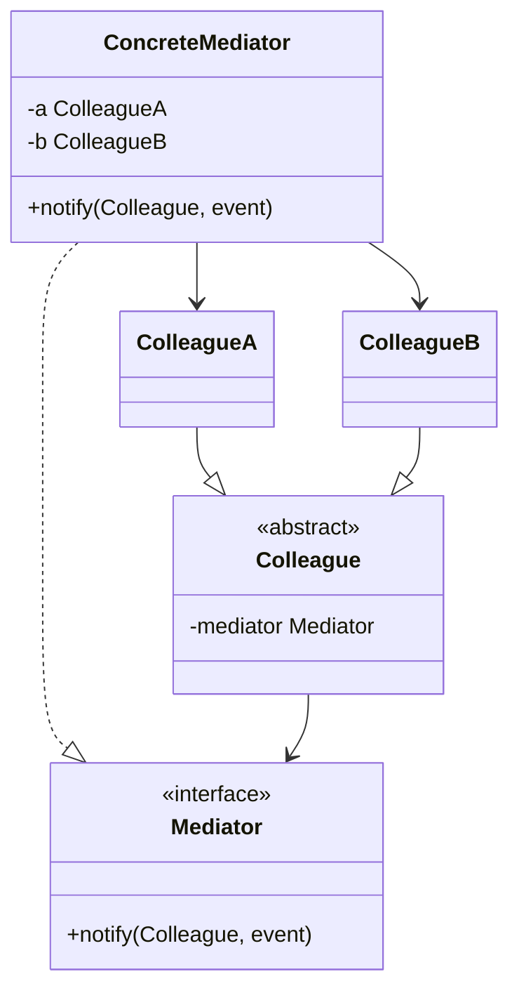
```mermaid
classDiagram
    class Mediator {
        <<interface>>
        +notify(Colleague, event)
    }
    class ConcreteMediator {
        -a ColleagueA
        -b ColleagueB
        +notify(Colleague, event)
    }
    class Colleague {
        <<abstract>>
        -mediator Mediator
    }
    class ColleagueA
    class ColleagueB
    ConcreteMediator ..|> Mediator
    ColleagueA --|> Colleague
    ColleagueB --|> Colleague
    Colleague --> Mediator
    ConcreteMediator --> ColleagueA
    ConcreteMediator --> ColleagueB
```

### 为什么这个结构能解决问题

如果多个界面控件或业务对象互相调用，会形成网状依赖。中介者把协调逻辑集中到一个对象，同事对象只通知中介者“我发生了事件”，由中介者决定通知谁、怎么处理。

### 题干关键字

- “对象之间复杂网状交互”
- “集中协调”
- “同事对象”
- “不直接相互引用”
- “聊天室、对话框控件联动”

### 典型 Java 代码骨架

```java
interface Mediator {
    void notify(Component sender, String event);
}

abstract class Component {
    protected Mediator mediator;

    Component(Mediator mediator) {
        this.mediator = mediator;
    }
}

class Button extends Component {
    Button(Mediator mediator) { super(mediator); }
    void click() { mediator.notify(this, "click"); }
}

class DialogMediator implements Mediator {
    public void notify(Component sender, String event) {
        if ("click".equals(event)) {
            // coordinate other components
        }
    }
}
```

### 典型使用场景

- GUI 对话框控件联动。
- 聊天室用户通信。
- 航空管制中心协调飞机。

### 常见考法和答题关键词

- 填角色：`Mediator`、`ConcreteMediator`、`Colleague`、`ConcreteColleague`。
- 判断关系：同事对象持有中介者；具体中介者知道并协调多个同事对象。
- 稳妥关键词：`封装对象交互`、`集中协调`、`降低多对多耦合`。

### 容易混淆

- 和外观：外观是简化访问入口；中介者是协调对象之间交互。
- 和观察者：观察者是发布订阅通知；中介者包含业务协调逻辑。

## 18. 备忘录模式 Memento

### 核心意图

在不破坏封装的前提下，保存对象内部状态，并在以后恢复该状态。

### 典型类图角色和关系

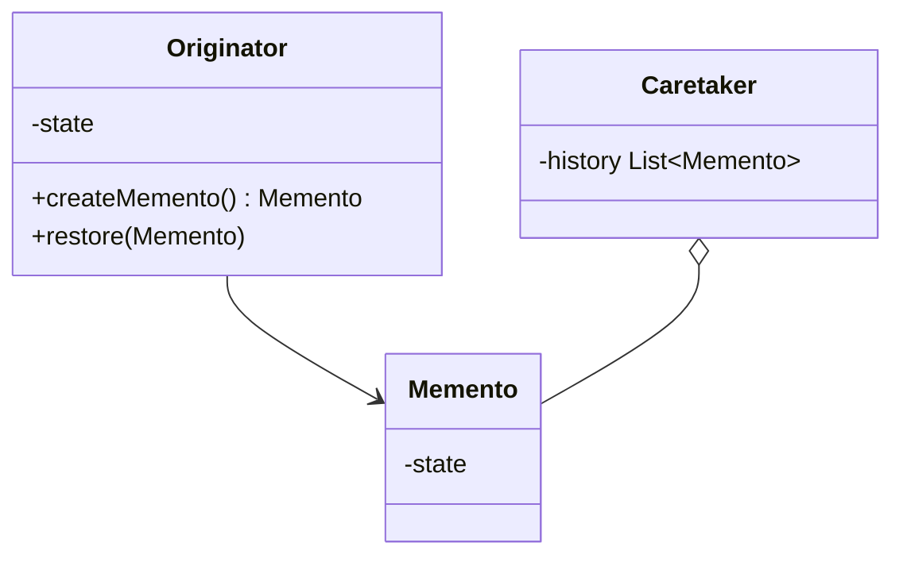
```mermaid
classDiagram
    class Originator {
        -state
        +createMemento() Memento
        +restore(Memento)
    }
    class Memento {
        -state
    }
    class Caretaker {
        -history List~Memento~
    }
    Originator --> Memento
    Caretaker o-- Memento
```

### 为什么这个结构能解决问题

撤销功能需要保存对象状态，但外部对象不应该直接读取私有字段。备忘录让状态拥有者 `Originator` 自己创建快照 `Memento`，负责人 `Caretaker` 只保存快照，不读取内容。恢复时再交给原发器。

### 题干关键字

- “保存和恢复状态”
- “撤销/回滚”
- “不破坏封装”
- “快照”
- “Originator / Memento / Caretaker”

### 典型 Java 代码骨架

```java
class Editor {
    private String text;

    public Memento save() {
        return new Memento(text);
    }

    public void restore(Memento memento) {
        this.text = memento.getState();
    }

    static class Memento {
        private final String state;

        private Memento(String state) {
            this.state = state;
        }

        private String getState() {
            return state;
        }
    }
}

class History {
    private final java.util.Stack<Editor.Memento> stack = new java.util.Stack<>();
}
```

### 典型使用场景

- 文本编辑器撤销。
- 游戏存档。
- 事务失败回滚。

### 常见考法和答题关键词

- 填角色：`Originator`、`Memento`、`Caretaker`。
- 填方法：`createMemento()`、`restore()`。
- 判断封装：Caretaker 不直接访问状态内容。
- 稳妥关键词：`状态快照`、`恢复原状态`、`不暴露内部细节`。

### 容易混淆

- 和原型：原型复制对象用于创建新对象；备忘录保存状态用于恢复旧状态。
- 和命令：命令可结合备忘录实现撤销；命令封装操作，备忘录保存状态。

## 19. 观察者模式 Observer

### 核心意图

定义对象间一对多依赖，当一个对象状态改变时，所有依赖者都会自动收到通知并更新。

### 典型类图角色和关系

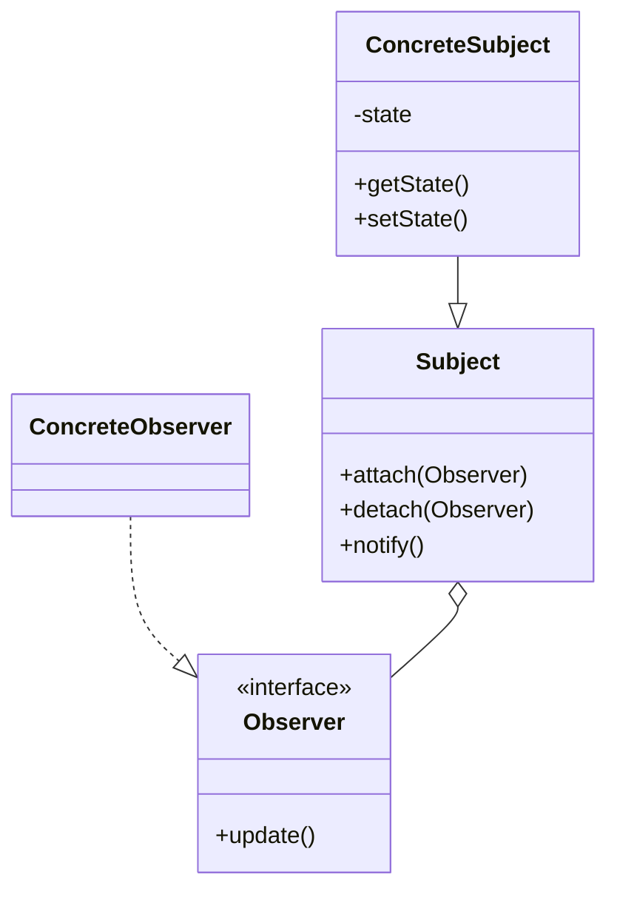
```mermaid
classDiagram
    class Subject {
        +attach(Observer)
        +detach(Observer)
        +notify()
    }
    class ConcreteSubject {
        -state
        +getState()
        +setState()
    }
    class Observer {
        <<interface>>
        +update()
    }
    class ConcreteObserver
    ConcreteSubject --|> Subject
    ConcreteObserver ..|> Observer
    Subject o-- Observer
```

### 为什么这个结构能解决问题

一个对象状态变化后，如果手动调用所有依赖对象，会造成强耦合。观察者模式让主题维护观察者列表，状态变化时统一 `notify()`。观察者只需实现 `update()` 并注册到主题。

### 题干关键字

- “一对多依赖”
- “状态变化自动通知”
- “发布-订阅”
- “注册、删除、通知观察者”
- “Subject / Observer”

### 典型 Java 代码骨架

```java
interface Observer {
    void update(String message);
}

class Subject {
    private final java.util.List<Observer> observers = new java.util.ArrayList<>();

    void attach(Observer observer) {
        observers.add(observer);
    }

    void notifyObservers(String message) {
        for (Observer observer : observers) {
            observer.update(message);
        }
    }
}

class EmailObserver implements Observer {
    public void update(String message) {}
}
```

### 典型使用场景

- 事件监听。
- 消息订阅。
- MVC 中模型变化通知视图。
- 股票价格变化通知多个显示面板。

### 常见考法和答题关键词

- 填角色：`Subject`、`ConcreteSubject`、`Observer`、`ConcreteObserver`。
- 填方法：`attach()`、`detach()`、`notify()`、`update()`。
- 稳妥关键词：`一对多`、`状态变化通知`、`发布订阅`、`松耦合`。

### 容易混淆

- 和中介者：观察者是主题通知多个观察者；中介者集中协调同事对象交互。
- 和责任链：观察者通知所有订阅者；责任链沿链传递，可能只由一个处理者处理。

## 20. 状态模式 State

### 核心意图

允许对象在内部状态改变时改变其行为，使对象看起来像改变了类。

### 典型类图角色和关系

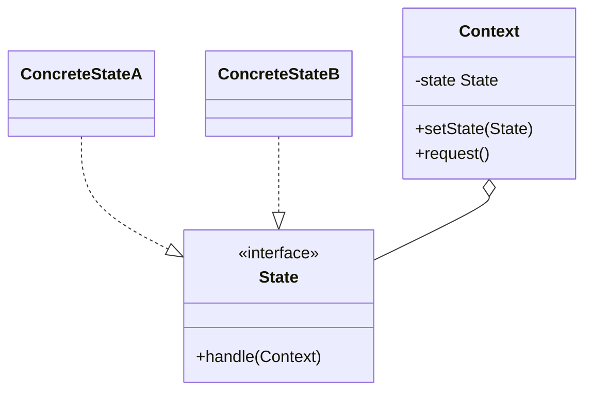
```mermaid
classDiagram
    class Context {
        -state State
        +setState(State)
        +request()
    }
    class State {
        <<interface>>
        +handle(Context)
    }
    class ConcreteStateA
    class ConcreteStateB
    ConcreteStateA ..|> State
    ConcreteStateB ..|> State
    Context o-- State
```

### 为什么这个结构能解决问题

当对象行为依赖状态时，代码容易写成大量 `if (state == ...)`。状态模式把每种状态对应的行为封装到状态类中，`Context` 持有当前状态，请求委托给当前状态处理。状态对象还可以决定是否切换到下一个状态。

### 题干关键字

- “对象行为随状态改变”
- “消除大量状态判断”
- “状态对象”
- “Context 持有 State”
- “状态转换”

### 典型 Java 代码骨架

```java
interface State {
    void handle(Player player);
}

class PlayingState implements State {
    public void handle(Player player) {
        player.setState(new PausedState());
    }
}

class PausedState implements State {
    public void handle(Player player) {
        player.setState(new PlayingState());
    }
}

class Player {
    private State state = new PausedState();

    void setState(State state) {
        this.state = state;
    }

    void click() {
        state.handle(this);
    }
}
```

### 典型使用场景

- 播放器播放/暂停/停止。
- 订单待支付/已支付/已发货/已完成。
- TCP 连接状态。

### 常见考法和答题关键词

- 填角色：`Context`、`State`、`ConcreteState`。
- 填方法：`handle()`、`setState()`。
- 判断关系：Context 持有 State；ConcreteState 实现 State。
- 稳妥关键词：`状态封装为对象`、`行为随状态变化`、`消除条件分支`。

### 容易混淆

- 和策略：状态模式的状态切换通常由状态对象或 Context 内部控制；策略通常由客户端选择算法。
- 和责任链：状态是当前状态处理请求；责任链是多个处理者依次传递请求。

## 21. 策略模式 Strategy

### 核心意图

定义一系列算法，把每个算法封装起来，并使它们可以相互替换。

### 典型类图角色和关系

```mermaid
classDiagram
    class Context {
        -strategy Strategy
        +setStrategy(Strategy)
        +execute()
    }
    class Strategy {
        <<interface>>
        +algorithm()
    }
    class ConcreteStrategyA
    class ConcreteStrategyB
    ConcreteStrategyA ..|> Strategy
    ConcreteStrategyB ..|> Strategy
    Context o-- Strategy
```

### 为什么这个结构能解决问题

多个算法如果都写在 `if/switch` 中，新增算法要修改 Context。策略模式把每种算法封装成策略类，Context 只持有策略接口并调用统一方法。运行时可替换策略，扩展新算法只新增策略类。

### 题干关键字

- “算法族”
- “算法可以互换”
- “运行时选择算法”
- “避免大量条件语句”
- “Context 使用 Strategy”

### 典型 Java 代码骨架

```java
interface PayStrategy {
    void pay(int amount);
}

class AliPayStrategy implements PayStrategy {
    public void pay(int amount) {}
}

class WechatPayStrategy implements PayStrategy {
    public void pay(int amount) {}
}

class Order {
    private PayStrategy strategy;

    void setPayStrategy(PayStrategy strategy) {
        this.strategy = strategy;
    }

    void checkout(int amount) {
        strategy.pay(amount);
    }
}
```

### 典型使用场景

- 支付方式选择。
- 排序算法选择。
- 路径规划算法选择。
- 促销折扣算法。

### 常见考法和答题关键词

- 填角色：`Strategy`、`ConcreteStrategy`、`Context`。
- 填方法：`algorithm()`、`setStrategy()`。
- 稳妥关键词：`封装算法族`、`算法可替换`、`运行时选择`、`消除条件判断`。

### 容易混淆

- 和状态：策略通常由外部选择；状态通常由对象内部状态转换驱动。
- 和模板方法：策略基于组合，运行时替换；模板方法基于继承，算法骨架固定。

## 22. 模板方法模式 Template Method

### 核心意图

在父类中定义算法骨架，将某些步骤延迟到子类实现，使子类不改变算法结构即可重定义部分步骤。

### 典型类图角色和关系

```mermaid
classDiagram
    class AbstractClass {
        +templateMethod()
        #primitiveOperation1()
        #primitiveOperation2()
        #hook()
    }
    class ConcreteClass
    ConcreteClass --|> AbstractClass
```

### 为什么这个结构能解决问题

多个类的处理流程大体相同，只有个别步骤不同。如果每个类都完整复制流程，会重复且容易不一致。模板方法把固定流程放到父类的 `templateMethod()` 中，把变化步骤定义为抽象方法或钩子方法，由子类实现。

### 题干关键字

- “算法骨架”
- “步骤延迟到子类”
- “不改变算法结构”
- “primitiveOperation”
- “hook 钩子方法”

### 典型 Java 代码骨架

```java
abstract class DataImporter {
    public final void importData() {
        open();
        read();
        convert();
        close();
    }

    protected abstract void open();
    protected abstract void read();

    protected void convert() {
        // default step
    }

    protected void close() {
    }
}

class CsvImporter extends DataImporter {
    protected void open() {}
    protected void read() {}
}
```

### 典型使用场景

- 文件导入流程：打开、读取、解析、关闭。
- 测试框架：准备、执行、清理。
- 报表生成：取数、计算、渲染、导出。

### 常见考法和答题关键词

- 填角色：`AbstractClass`、`ConcreteClass`。
- 填方法：`templateMethod()`、`primitiveOperation()`、`hook()`。
- 判断关系：具体类继承抽象类，重写步骤方法，不重写模板方法。
- 稳妥关键词：`父类固定算法骨架`、`子类实现可变步骤`、`复用公共流程`。

### 容易混淆

- 和策略：模板方法用继承，编译期结构更固定；策略用组合，可运行时替换算法。
- 和工厂方法：工厂方法可以作为模板方法中的一个步骤。

## 23. 访问者模式 Visitor

### 核心意图

在不改变元素类的前提下，定义作用于对象结构中各元素的新操作。

### 典型类图角色和关系

```mermaid
classDiagram
    class Visitor {
        <<interface>>
        +visitElementA(ElementA)
        +visitElementB(ElementB)
    }
    class ConcreteVisitor
    class Element {
        <<interface>>
        +accept(Visitor)
    }
    class ElementA
    class ElementB
    ConcreteVisitor ..|> Visitor
    ElementA ..|> Element
    ElementB ..|> Element
    Element --> Visitor
```

### 为什么这个结构能解决问题

当对象结构稳定，但要频繁增加新操作时，把操作写进元素类会不断修改元素类。访问者模式把新操作封装到 Visitor 中，元素只提供 `accept(visitor)`，在其中调用 `visitor.visit(this)`。这样新增操作时新增访问者类，不改元素类。

### 题干关键字

- “对象结构稳定，操作经常变化”
- “在不改变元素类的情况下增加新操作”
- “accept / visit”
- “双分派”
- “编译器语法树、报表导出”

### 典型 Java 代码骨架

```java
interface Visitor {
    void visitCircle(Circle circle);
    void visitRectangle(Rectangle rectangle);
}

interface Shape {
    void accept(Visitor visitor);
}

class Circle implements Shape {
    public void accept(Visitor visitor) {
        visitor.visitCircle(this);
    }
}

class Rectangle implements Shape {
    public void accept(Visitor visitor) {
        visitor.visitRectangle(this);
    }
}

class ExportVisitor implements Visitor {
    public void visitCircle(Circle circle) {}
    public void visitRectangle(Rectangle rectangle) {}
}
```

### 典型使用场景

- 对语法树节点增加类型检查、代码生成、格式化等操作。
- 对复杂对象结构增加导出、统计、校验操作。
- 对稳定元素集合增加多种报表。

### 常见考法和答题关键词

- 填角色：`Visitor`、`ConcreteVisitor`、`Element`、`ConcreteElement`、`ObjectStructure`。
- 填方法：`accept(Visitor visitor)`、`visitConcreteElement()`。
- 判断关系：元素接受访问者；具体访问者为每种元素实现 visit 方法。
- 稳妥关键词：`对象结构稳定`、`新增操作`、`双分派`、`accept/visit`。

### 容易混淆

- 和迭代器：迭代器负责遍历对象结构；访问者负责对元素执行操作。
- 和策略：策略替换一个算法；访问者为一组不同元素增加一组操作。

---

# 四、软考常见混淆对比

## 1. 工厂方法 vs 抽象工厂 vs 生成器 vs 原型

| 对比 | 判断重点 |
|---|---|
| 工厂方法 | 一个工厂方法，子类决定创建哪一个产品 |
| 抽象工厂 | 一个工厂创建一族相关产品，强调产品族一致 |
| 生成器 | 分步骤构造复杂对象，强调构造过程 |
| 原型 | 通过 clone/copy 复制已有对象，强调复制 |

答题稳句：

- “若题干强调产品族、同一风格、多个相关产品，应优先考虑抽象工厂。”
- “若题干强调分步骤构造复杂对象，应优先考虑生成器。”
- “若题干强调克隆已有对象、复制模板，应优先考虑原型。”

## 2. 适配器 vs 装饰 vs 代理 vs 外观

| 对比 | 是否同接口 | 主要目的 |
|---|---|---|
| 适配器 | 通常对外变成目标接口 | 解决接口不兼容 |
| 装饰 | 和被装饰对象同接口 | 动态增加职责 |
| 代理 | 和真实主题同接口 | 控制访问 |
| 外观 | 提供新的高层接口 | 简化复杂子系统 |

答题稳句：

- “接口不兼容选适配器。”
- “同接口、加功能选装饰。”
- “同接口、控制访问选代理。”
- “面对多个子系统、统一入口选外观。”

## 3. 桥接 vs 策略 vs 状态

| 对比 | 变化点 |
|---|---|
| 桥接 | 两个维度独立变化，抽象持有实现 |
| 策略 | 一个算法族可替换，Context 持有 Strategy |
| 状态 | 行为随内部状态变化，Context 持有 State |

答题稳句：

- “桥接看两个维度，策略看算法互换，状态看状态转换。”

## 4. 组合 vs 责任链 vs 解释器

| 对比 | 结构相似点 | 关键区别 |
|---|---|---|
| 组合 | 树 | 处理整体-部分一致性 |
| 责任链 | 链 | 请求沿处理者传递 |
| 解释器 | 表达式树 | 按文法解释句子 |

答题稳句：

- “看见树形整体-部分是组合；看见请求传递是责任链；看见文法表达式是解释器。”

## 5. 观察者 vs 中介者

| 对比 | 通信方式 |
|---|---|
| 观察者 | 主题变化后通知多个观察者，重点是一对多依赖 |
| 中介者 | 同事对象都通过中介协调，重点是多对多交互集中化 |

答题稳句：

- “发布订阅、一对多通知选观察者；对象网状交互、集中协调选中介者。”

## 6. 模板方法 vs 策略

| 对比 | 实现方式 | 变化时机 |
|---|---|---|
| 模板方法 | 继承 | 子类重写步骤，结构较固定 |
| 策略 | 组合 | 运行时替换算法 |

答题稳句：

- “父类固定流程、子类填步骤是模板方法；Context 换算法对象是策略。”

## 7. 访问者 vs 迭代器

| 对比 | 目的 |
|---|---|
| 迭代器 | 顺序访问元素，不暴露内部结构 |
| 访问者 | 给元素结构增加新操作 |

答题稳句：

- “遍历选迭代器；对稳定对象结构增加操作选访问者。”

---

# 五、下午题答题模板

## 1. 识别模式题

建议写法：

> 该设计采用了 X 模式。因为题干中出现了“关键词”，并且类图中 `角色A` 与 `角色B` 的关系符合 X 模式：`角色A` 负责……，`角色B` 负责……，客户端通过抽象接口使用对象，从而达到……目的。

例：

> 该设计采用抽象工厂模式。题干强调创建一组风格一致的界面控件，类图中抽象工厂声明 `createButton()` 和 `createTextField()`，具体工厂创建同一产品族的具体按钮和文本框，客户端只依赖抽象工厂和抽象产品，因此可以保证产品族一致并降低耦合。

## 2. 填类名题

先按关系定位：

- 被多个具体类实现的接口，多半是 `Product`、`Strategy`、`State`、`Observer`、`Command`。
- 持有同接口引用并调用它，多半是 `Decorator`、`Proxy`、`Context`、`Invoker`。
- 保存子节点列表，多半是 `Composite`。
- 保存下一个处理者，多半是 `Handler`。
- 有 `accept(Visitor)` 的是 `Element`；有多个 `visitXxx()` 的是 `Visitor`。

## 3. 填方法名题

高频方法表：

| 模式 | 高频方法 |
|---|---|
| 工厂方法 | `factoryMethod()` / `createProduct()` |
| 抽象工厂 | `createProductA()` / `createProductB()` |
| 生成器 | `buildPart()` / `getResult()` / `construct()` |
| 原型 | `clone()` / `copy()` |
| 单例 | `getInstance()` |
| 责任链 | `handleRequest()` / `setSuccessor()` |
| 命令 | `execute()` / `undo()` |
| 解释器 | `interpret()` |
| 迭代器 | `hasNext()` / `next()` |
| 观察者 | `attach()` / `detach()` / `notify()` / `update()` |
| 模板方法 | `templateMethod()` / `primitiveOperation()` |
| 访问者 | `accept()` / `visit()` |

## 4. 判断类之间关系题

常用表达：

- “ConcreteXxx 实现 Xxx 接口。”
- “ConcreteXxx 继承 AbstractXxx。”
- “Context 聚合 Strategy/State，通过组合委托具体行为。”
- “Decorator 持有 Component 类型引用，并实现 Component 接口。”
- “Composite 组合多个 Component，形成树形结构。”
- “Proxy 持有 RealSubject，并与 RealSubject 实现同一 Subject 接口。”

---

# 六、下一轮训练建议

第16课下一轮不要平均铺开 23 种。建议从软考下午最容易拿分、也最容易混淆的结构开始：

1. 第一组：工厂方法、抽象工厂、生成器、原型。目标是区分“创建一个产品 / 一族产品 / 分步骤构造 / 克隆”。
2. 第二组：适配器、装饰、代理、外观。目标是区分“改接口 / 加职责 / 控访问 / 统一入口”。
3. 第三组：策略、状态、模板方法。目标是区分“算法替换 / 状态驱动 / 父类骨架”。
4. 第四组：观察者、中介者、责任链、命令。目标是区分对象通信和请求封装。
5. 第五组：组合、迭代器、访问者、备忘录、享元、桥接、解释器。目标是补齐类图识别和低频模式。

如果只先做一轮深化训练，建议从“适配器 / 装饰 / 代理 / 外观”开始，因为这组在类图上都可能出现“包装、持有、委托”，但考试关键词差异非常明确，练熟后提分最快。

---

# 参考来源

- RefactoringGuru 中文站设计模式目录：<https://refactoringguru.cn/design-patterns>
- RefactoringGuru 工厂方法：<https://refactoringguru.cn/design-patterns/factory-method>
- RefactoringGuru 抽象工厂：<https://refactoringguru.cn/design-patterns/abstract-factory>
- RefactoringGuru 生成器：<https://refactoringguru.cn/design-patterns/builder>
- RefactoringGuru 原型：<https://refactoringguru.cn/design-patterns/prototype>
- RefactoringGuru 单例：<https://refactoringguru.cn/design-patterns/singleton>
- RefactoringGuru 适配器：<https://refactoringguru.cn/design-patterns/adapter>
- RefactoringGuru 桥接：<https://refactoringguru.cn/design-patterns/bridge>
- RefactoringGuru 组合：<https://refactoringguru.cn/design-patterns/composite>
- RefactoringGuru 装饰：<https://refactoringguru.cn/design-patterns/decorator>
- RefactoringGuru 外观：<https://refactoringguru.cn/design-patterns/facade>
- RefactoringGuru 享元：<https://refactoringguru.cn/design-patterns/flyweight>
- RefactoringGuru 代理：<https://refactoringguru.cn/design-patterns/proxy>
- RefactoringGuru 责任链：<https://refactoringguru.cn/design-patterns/chain-of-responsibility>
- RefactoringGuru 命令：<https://refactoringguru.cn/design-patterns/command>
- RefactoringGuru 迭代器：<https://refactoringguru.cn/design-patterns/iterator>
- RefactoringGuru 中介者：<https://refactoringguru.cn/design-patterns/mediator>
- RefactoringGuru 备忘录：<https://refactoringguru.cn/design-patterns/memento>
- RefactoringGuru 观察者：<https://refactoringguru.cn/design-patterns/observer>
- RefactoringGuru 状态：<https://refactoringguru.cn/design-patterns/state>
- RefactoringGuru 策略：<https://refactoringguru.cn/design-patterns/strategy>
- RefactoringGuru 模板方法：<https://refactoringguru.cn/design-patterns/template-method>
- RefactoringGuru 访问者：<https://refactoringguru.cn/design-patterns/visitor>
- Baeldung Java Interpreter Pattern：<https://www.baeldung.com/java-interpreter-pattern>
