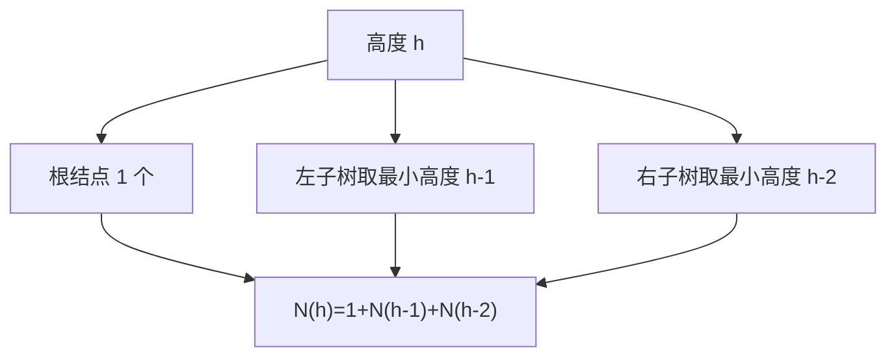
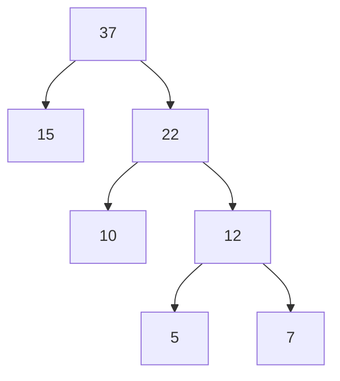
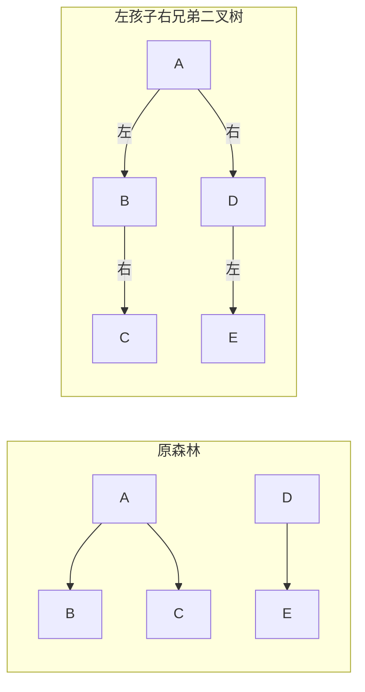

# 第3章 数据结构

## 适用范围

- 本文件只沉淀当前会话前已经通过真题练习、判分或讲解覆盖到的第3章知识点。
- 本文件按教材第3章主线组织为：
  - 线性结构
  - 数组、矩阵与广义表
  - 树与二叉树
  - 图
  - 查找
  - 排序
- 本文件不是整章教材重写，不把本轮未覆盖的内容伪装成“已经学完”。

## 本轮已覆盖知识点

### 1. 线性结构、栈、队列

- 线性表的核心特征是：
  - 除首尾外，每个元素都只有一个直接前驱和一个直接后继
  - 逻辑上是一条线
- 单链表结点至少包含：
  - 数据域
  - 指针域
- 单链表的存储单元地址通常不连续，所以：
  - 逻辑相邻不等于物理相邻
  - 不能像顺序表那样直接按下标随机访问
- 循环链表的核心变化不是“多了新结点”，而是：
  - 终端结点的指针不再是 `NULL`
  - 而是回到头结点或首元结点

#### 1.1 单链表、循环链表、链队列的指针边界

```text
单链表：
head -> [data|next] -> [data|next] -> [data|NULL]

循环单链表：
head -> [data|next] -> [data|next] -> [data|回到head或首元]

带 front / rear 的链队列：
front -> [data|next] -> [data|next] -> [data|NULL] <- rear
```

- 链队列最稳的实现是同时维护 `front` 和 `rear`：
  - 入队：改 `rear->next`，再移动 `rear`
  - 出队：移动 `front`
  - 两者都可做到 `O(1)`
- 若链队列只设 `rear` 而不设 `front`：
  - 入队仍可 `O(1)`
  - 但出队要找到队头或其前驱，通常不能保持 `O(1)`
- 空队列边界一定要单独记：
  - 初始化时常见 `front = rear = NULL`
  - 或带头结点时 `front = rear = 头结点`
  - 出队删到最后一个结点后，要把 `rear` 同步改回空队列状态

#### 1.2 栈与表达式

- 栈的关键词是：
  - `后进先出`
  - `只在一端插入/删除`
- 表达式题里常考三件事：
  - 中缀转后缀
  - 用后缀式求值
  - 求操作数栈或运算符栈的最大深度
- 这类题的本质不是背答案，而是按扫描过程数“栈里此刻有多少东西”。
- 记忆规则：
  - 遇到操作数，操作数栈深度 `+1`
  - 遇到双目运算符，通常弹 `2` 压 `1`，净变化 `-1`
  - 遇到左括号，运算符栈深度 `+1`
  - 遇到右括号，会把对应括号内运算符逐步弹出

### 2. 数组、矩阵与压缩存储

#### 2.1 为什么矩阵能压缩存储

- 不是所有矩阵都值得压缩。
- 能压缩的原因是：
  - 很多位置天然重复
  - 或很多位置固定为 `0`
  - 或上三角 / 下三角与另一半完全对称
- 所以“压缩存储”本质是：
  - 只存有信息量的那一半
  - 不再给重复值单独开空间

#### 2.2 什么时候优先想到压缩存储

- 上三角矩阵：
  - 主对角线以下全部相同，常见为 `0`
- 下三角矩阵：
  - 主对角线以上全部相同，常见为 `0`
- 对称矩阵：
  - `a[i][j] = a[j][i]`
  - 只存一半即可
- 稀疏矩阵：
  - 非零元素很少
  - 适合三元组或十字链表思路

#### 2.3 上三角矩阵如何数位置

```text
n = 4 的上三角矩阵（按行压缩，只存 i <= j）

(1,1) (1,2) (1,3) (1,4)
      (2,2) (2,3) (2,4)
            (3,3) (3,4)
                  (4,4)

总元素数 = 4 + 3 + 2 + 1 = 4*5/2
一般化后：n(n+1)/2
```

```text
如果把压缩后的一维数组记为 B[k]，k 从 1 开始：

第1行： (1,1)->1  (1,2)->2  (1,3)->3  (1,4)->4
第2行： (2,2)->5  (2,3)->6  (2,4)->7
第3行： (3,3)->8  (3,4)->9
第4行： (4,4)->10
```

- 若按行存储上三角矩阵，且下标从 `1` 开始：
  - 第 `i` 行之前一共存了
    - `(n) + (n-1) + ... + (n-i+2)`
  - 即
    - `(i-1)(2n-i+2)/2`
- 所以当 `i <= j` 时，位置序号
  - `k = (i-1)(2n-i+2)/2 + (j-i+1)`
- 真题里不要死背式子，先做两步：
  - 先数“前面完整行”有几个
  - 再数“本行排第几个”

#### 2.3.1 把公式拆成你能手算的样子

- 问 `(i,j)` 在哪，永远只做两件事：
  - 第一步：前面几行已经放了多少个元素
  - 第二步：这一行里它排第几个

```text
例：n=4，求 (2,4) 的位置

第1步：第2行前面只有第1行
第1行有 4 个元素
所以前面已经放了 4 个

第2步：(2,4) 在第2行里排第几个？
第2行是：(2,2) (2,3) (2,4)
所以它排第 3 个

结论：k = 4 + 3 = 7
```

```text
再看 (3,4)

前面完整两行有：
第1行 4 个
第2行 3 个
一共 7 个

第3行里：(3,3) (3,4)
所以 (3,4) 排第 2 个

结论：k = 7 + 2 = 9
```

- 你可以把公式理解成“把上面两步压成一行写法”，不是另一套神秘规则。

#### 2.4 对称矩阵如何压缩与定位

- 对称矩阵满足：
  - `a[i][j] = a[j][i]`
- 所以只存下三角或只存上三角都可以。
- 若按行压缩下三角，且下标从 `1` 开始：
  - 当 `i >= j` 时
  - `k = i(i-1)/2 + j`
- 当 `i < j` 时，不重新算上三角，而是先对称过去：
  - `a[i][j] -> a[j][i]`
  - 再代下三角公式

```text
n = 4，只存下三角时：

(1,1)
(2,1) (2,2)
(3,1) (3,2) (3,3)
(4,1) (4,2) (4,3) (4,4)
```

```text
压缩到一维数组 B[k]：

(1,1)->1
(2,1)->2  (2,2)->3
(3,1)->4  (3,2)->5  (3,3)->6
(4,1)->7  (4,2)->8  (4,3)->9  (4,4)->10
```

#### 2.4.1 对称矩阵最关键的一步是“先翻过去”

```text
例：求 (2,4) 的位置

因为这是上三角位置，不能直接在“只存下三角”的表里找

先翻过去：
(2,4) -> (4,2)

再在下三角里数：
第4行前面有
1 + 2 + 3 = 6 个

第4行是：
(4,1) (4,2) (4,3) (4,4)

(4,2) 在本行排第 2 个

所以 k = 6 + 2 = 8
```

- 这就是为什么很多题虽然问的是 `(i,j)`，你第一反应却应该是：
  - 它是不是先要对称成 `(j,i)`

#### 2.5 一个最容易错的点

- 上三角矩阵和对称矩阵都能压缩，但原因不一样：
  - 上三角矩阵是“另一半固定相同值”
  - 对称矩阵是“另一半与这一半镜像相等”

### 3. 树与二叉树

#### 3.1 树的度与叶子结点计数

- 树中所有结点出度之和 = 边数 = 结点总数 `-1`
- 若已知不同度数结点个数，可先求：
  - 出度总和
  - 非叶子结点总数
  - 再反推叶子结点数
- 真题里常错在：
  - 只看“某个度出现几次”
  - 忘了整棵树边数守恒关系

#### 3.2 平衡二叉树最少结点递推

- 平衡二叉树最少结点问题，本质是：
  - 想让高度尽量高
  - 但每个结点左右子树高度差不能超过 `1`
- 若把只有一个结点的树高度记为 `1`，则：
  - `N(1) = 1`
  - `N(2) = 2`
  - `N(h) = N(h-1) + N(h-2) + 1`
- 为什么是这个递推：
  - 为了让结点数最少，左右子树都尽量小
  - 同时又要满足平衡条件
  - 所以一边取高度 `h-1`
  - 另一边只能取高度 `h-2`

```text
N(h) = 1 + N(h-1) + N(h-2)

高度: 1  2  3  4   5
最少: 1  2  4  7  12
```



```text
把“最少结点”画成结构图，就是：

        h
        *
       / \
   h-1*   *h-2

意思不是随便分左右子树，
而是：
要想结点最少，
左边只能尽量小，高度 h-1
右边也尽量小，高度 h-2

所以：
N(h) = 1 + N(h-1) + N(h-2)
```

- 看到“高度为 5 的平衡二叉树最少结点”，不要现场画树，直接递推。

#### 3.3 哈夫曼树与哈夫曼编码

- 哈夫曼树是带权路径长度最小的二叉树。
- 构造规则只有一句话：
  - 每次取当前权值最小的两个结点合并
- 权值大的结点通常离根更近，因为这样能减少总带权路径长度。
- 哈夫曼编码的规则：
  - 左分支记 `0`，右分支记 `1`
  - 或反过来也可以
  - 但同一棵树内部必须一致
- 哈夫曼编码一定是：
  - 前缀码
  - 即任何一个编码都不是另一个编码的前缀

```text
例：权值 5, 7, 10, 15

先并 5 和 7 -> 12
再并 10 和 12 -> 22
再并 15 和 22 -> 37

所以构造顺序永远是“每轮挑两个最小的”
```



```text
更直观地看：

          37
         /  \
       15    22
            /  \
          10    12
               /  \
              5    7

读编码时，只要顺着根往叶子走：
左记 0，右记 1

15: 左           -> 0
10: 右 左        -> 10
5 : 右 右 左     -> 110
7 : 右 右 右     -> 111
```

- 若约定左 `0` 右 `1`，上图可读出一组合法编码：
  - `15 -> 0`
  - `10 -> 10`
  - `5 -> 110`
  - `7 -> 111`

- 做题时常见两个陷阱：
  - 看见权值集合就凭感觉画树，没有按“每轮两个最小”来
  - 判断编码方案时，只看长短，不检查“前缀冲突”

#### 3.4 森林转二叉树

- 森林转二叉树用的是：
  - 左孩子右兄弟表示法
- 翻译规则是：
  - 每个结点的第一个孩子 -> 左孩子
  - 该结点的下一个兄弟 -> 右孩子
- 所以二叉树里的“右链”往往表示兄弟，不一定表示原树中的右孩子。



```text
如果你觉得 Mermaid 不直观，就直接看这个：

原森林：

  A        D
 / \      /
B   C    E

转成二叉树后：

      A
     / \
    B   D
     \ /
      C E

这里最关键的不是图长什么样，
而是记住：
B 是 A 的第一个孩子，所以挂到 A 的左边
C 是 B 的兄弟，所以挂到 B 的右边
D 是 A 这棵树后面的下一棵树，所以挂到 A 的右边
E 是 D 的第一个孩子，所以挂到 D 的左边
```

- 真题里问“右子树包含多少结点”，一定要先搞清：
  - 这里的右边到底在表示兄弟链
  - 还是原树中的孩子关系

### 4. 图

#### 4.1 邻接矩阵与邻接表

- 邻接矩阵：
  - 适合边较多的稠密图
  - 判断两点是否相连很快
  - 存储空间通常是 `O(n^2)`
- 邻接表：
  - 适合边较少的稀疏图
  - 存储空间通常是 `O(n+e)`
  - 遍历某个顶点的所有邻接边更自然

#### 4.1.1 看到邻接矩阵，先怎么判断它是什么图

- 第一步先看矩阵是否关于主对角线对称：
  - 若 `a[i][j] = a[j][i]`，通常是无向图
  - 若不对称，通常是有向图
- 第二步再看是否每个顶点都和其他所有顶点相连：
  - 若全部相连，才可能是完全图
- 第三步再看连通性：
  - 强连通图要求任意两个顶点互相可达
  - 不能只看“有边”，还要看“能不能绕路到达”

```text
例：
v0 -> v1 = 18
但 v1 -> v0 = ∞

说明：
a[0][1] != a[1][0]

所以这个矩阵不对称
结论：它不是无向图，而是有向图
```

- 这类单选题最稳的顺序是：
  - 先排“无向图”
  - 再排“完全图”
  - 再排“强连通图”
  - 剩下往往就是“有向图”

#### 4.2 DFS 与 BFS

- DFS：
  - 深度优先搜索
  - 一条路先走到底，再回溯
  - 常和递归或栈配合
- BFS：
  - 广度优先搜索
  - 一层一层向外扩展
  - 常和队列配合
- 若图用邻接表存储：
  - DFS / BFS 的时间复杂度通常都是 `O(n+e)`
- 若图用邻接矩阵存储：
  - 常写成 `O(n^2)`

```text
DFS：像走迷宫时“先顺一条路冲到底”
BFS：像往水里丢石子，“一圈一圈扩散”
```

#### 4.2.1 用邻接矩阵做 BFS，到底怎么扫

- BFS 只看“有没有边”，不看权值大小。
- `18`、`17`、`20` 这些数在 BFS 里只表示“有边”，不是“先走权值小的”。
- 若题目说顶点顺序是 `v0, v1, v2, v3, v4, v5`，又给的是邻接矩阵：
  - 扫描某一行时，默认按列从左到右看
  - 也就是按 `v0 -> v5` 的顺序检查邻接点

```text
本题矩阵可读成：

v0 -> v1, v2
v1 -> v3, v4
v2 -> v1, v3
v3 -> v5
v4 -> v5
v5 -> 无
```

```text
从 v0 开始做 BFS：

初始：
队列 [v0]
访问序列：

1. 出队 v0
   扫第0行，发现 v1、v2
   队列 [v1, v2]
   访问序列：v0

2. 出队 v1
   扫第1行，发现 v3、v4
   队列 [v2, v3, v4]
   访问序列：v0, v1

3. 出队 v2
   扫第2行，能到 v1、v3
   但它们已经访问过或已入队，不重复加入
   队列 [v3, v4]
   访问序列：v0, v1, v2

4. 出队 v3
   扫第3行，发现 v5
   队列 [v4, v5]
   访问序列：v0, v1, v2, v3

5. 出队 v4
   扫第4行，也能到 v5
   但 v5 已入队，不重复加入
   队列 [v5]
   访问序列：v0, v1, v2, v3, v4

6. 出队 v5
   没有新顶点
   队列 []
   访问序列：v0, v1, v2, v3, v4, v5
```

- 所以这题的两个核心结论是：
  - 图的类型：`有向图`
  - 从 `v0` 开始的 BFS 序列：`v0, v1, v2, v3, v4, v5`

#### 4.2.2 这类题的固定做法

```text
看到“邻接矩阵 + BFS”：

1. 先把每一行翻译成“这个点能到谁”
2. 用队列做
3. 每次出队一个点
4. 按顶点编号顺序扫描这一行
5. 新顶点才入队，已访问或已入队的不重复加
```

- 高频误区：
  - 把边权大小当成 BFS 次序
  - 忘了这是有向图，只按行看“从谁出发能到谁”
  - 已经入队的顶点再次入队
  - 扫描顺序乱掉，没有按 `v0, v1, v2...` 的列顺序检查

#### 4.3 拓扑排序

- 拓扑排序只讨论：
  - 有向无环图 `DAG`
- 若图中有环：
  - 就不存在合法拓扑序
- 常规做法是：
  - 先找入度为 `0` 的顶点
  - 输出它
  - 删去它发出的边
  - 再继续找新的入度为 `0` 顶点
- 拓扑排序不一定唯一：
  - 某一步若有多个入度为 `0` 顶点可选，就可能产生不同合法序列


- 真题里若给的是邻接矩阵，且问“可拓扑排序的图属于哪类”：
  - 核心判断不是存储结构
  - 而是它是否为有向无环图

### 5. 查找

#### 5.1 折半查找

- 折半查找要求：
  - 顺序表
  - 关键字有序
- 查找长度是对数级：
  - `O(logn)`
- `29` 个元素最多比较 `5` 次，是因为：
  - `2^5 = 32`
  - 已足够覆盖 `29`

#### 5.2 为什么某些比较序列不可能

- 判断折半查找比较序列是否可能，关键不是“看起来像不像”。
- 真规则只有一句：
  - 每比较一次，剩余候选区间都会被严格缩小到左半或右半
- 所以一个不可能的序列，通常违背了下面某条：
  - 前一步已经把某个值排除，后一步却又回到被排除区间
  - 前后比较结果对应的大小关系互相冲突
  - 中间元素变化方向与剩余区间不一致

```text
第一次比中点 M

若目标 > M
只可能继续去右半区

若后面序列又出现左半区元素
这个比较序列就不可能
```

- 所以这类题最稳的方法不是代选项硬猜，而是：
  - 画出当前合法区间
  - 每比一次就缩一次
  - 看下一个比较值是否还落在合法区间内

### 6. 排序

#### 6.1 排序先按“大类”记，不要每种都散着背

- 软考里常见的排序分类，不是为了背术语，而是为了帮助你抓住：
  - 这一类排序每轮到底在干什么
  - 它为什么会有这样的时间复杂度和稳定性

| 分类 | 核心动作 | 常见代表 |
|---|---|---|
| 插入类 | 把当前元素插进前面有序区 | 直接插入，希尔排序 |
| 选择类 | 每轮选一个最值放到边界 | 简单选择，堆排序 |
| 交换类 | 通过交换把元素逐步推向正确区间 | 冒泡排序，快速排序 |
| 归并类 | 先分，再把两个有序段合并 | 归并排序 |
| 分配类 | 按关键字位或桶分配再收集 | 基数排序 |

- 看到题目问“某排序属于哪一类”，最稳的判断法是：
  - 插入类：关键词是“插到前面有序区”
  - 选择类：关键词是“每轮选最小/最大”
  - 交换类：关键词是“比较后交换位置”
  - 归并类：关键词是“分成两半再合并”
  - 分配类：关键词是“按位、按桶、按关键字分配”

```text
最容易混的两组：

堆排序 vs 快速排序
  堆排序：本质是“每轮选堆顶最值” -> 选择类
  快速排序：本质是“围绕 pivot 做交换划分” -> 交换类

直接插入 vs 简单选择
  直接插入：把当前元素插进去 -> 插入类
  简单选择：每轮挑最小值放前面 -> 选择类
```

#### 6.2 五种高频排序要会看到“每轮在干什么”

##### 直接插入排序

- 思想：
  - 把当前元素插到前面已经有序的子表里
- 每轮变化：
  - 已排序区扩大 `1`
  - 当前元素向前找插入位置
- 特点：
  - 序列越接近有序，越快
  - 稳定

```text
例：49 38 65 97 76 13

开始时默认第1个元素自己有序：
[49] 38 65 97 76 13

第1轮：处理 38
看排序区 [49]
因为 49 > 38，所以 49 要向后挪一格腾位置

[49] 38 65 97 76 13
 -> [49 49] 65 97 76 13
 -> [38 49] 65 97 76 13

第2轮：处理 65
看排序区 [38 49]
因为 65 比 49 还大，不需要任何后移

[38 49] 65 97 76 13
 -> [38 49 65] 97 76 13

如果你想看“真的发生大规模后移”是什么样，
单独看这个局部例子：

[38 49 65 97] 13 76

13 要插到最前面，
所以排序区里所有比 13 大的元素都要整体后移一格：

[38 49 65 97] 13 76
 -> [38 49 65 97 97] 76
 -> [38 49 65 65 97] 76
 -> [38 49 49 65 97] 76
 -> [38 38 49 65 97] 76
 -> [13 38 49 65 97] 76

所以你刚才问的这个点是对的：
插入不是“啪一下塞进去”，
而是：
先把排序区里比它大的元素一个个向后移动，
给它腾出空位，
再把它放进去。
```

##### 简单选择排序

- 思想：
  - 每轮从未排序区选最小值，放到最前面
- 每轮变化：
  - 第 `i` 轮确定第 `i` 小元素
- 特点：
  - 交换次数少
  - 但比较次数通常不省
  - 不稳定

```text
例：49 38 65 97 76 13

第1轮：在全体里找最小 13，放到最前
49 38 65 97 76 [13]
 -> 13 38 65 97 76 49

核心：每轮只确定一个“本轮最小值”的最终位置
```

##### 堆排序

- 思想：
  - 先建堆，再反复把堆顶最大或最小元素取出
- 分类上它属于：
  - 选择类排序
  - 不是插入类、不是归并类
- 每轮变化：
  - 堆顶与末尾交换
  - 缩小堆范围
  - 再调整成堆
- 特点：
  - `O(nlogn)`
  - 不稳定
  - 适合 Top-K

```text
大顶堆：
        97
      /    \
    76      65
   /  \
 38   49

第1轮：
1. 堆顶 97 与末尾交换
2. 97 就位到最终位置
3. 剩余部分重新调堆
```

###### 建堆后的数组表示到底怎么看

- 数组表示堆时，默认按：
  - 层序遍历
  - 从上到下、从左到右
- 所以“建成大顶堆后的数组”问的不是：
  - 最终排好序的结果
  - 也不是你肉眼觉得“差不多大的放前面”
- 真正要检查的是：
  - 每个父结点都 `>=` 它的孩子结点

```text
例：A = (2,8,7,1,3,5,6,4)

一个合法的大顶堆数组可以是：
(8,4,7,2,3,5,6,1)
```

```text
把它画成完全二叉树：

        8
      /   \
     4     7
    / \   / \
   2   3 5   6
  /
 1
```

- 检查方法只有一句：
  - 父结点都要大于等于孩子结点
- 上例中：
  - `8 >= 4,7`
  - `4 >= 2,3`
  - `7 >= 5,6`
  - `2 >= 1`
  - 所以它是合法大顶堆
- 高频误区：
  - 把“建堆”误当成“已经排好序”
  - 看到 `8,7,6,5,4,3,2,1` 就觉得一定对
  - 其实那是降序序列，不是一般意义下“建堆后数组”的唯一形态

##### 归并排序

- 思想：
  - 先分，再把两个有序段合并
- 设计策略：
  - 分治
- 每轮变化：
  - 合并两个更小的有序段
  - 逐步得到更大的有序段
- 特点：
  - 稳定
  - `O(nlogn)`
  - 需要额外辅助空间

```text
例：49 38 65 13

先分：
[49 38] [65 13]
 -> [49] [38] [65] [13]

再并：
[38 49] [13 65]
 -> [13 38 49 65]

核心：每轮是在“合并两个已有序小段”
```

###### 为什么归并排序最好和最坏都一样是 `nlogn`

- 归并排序不管原序列本来是否接近有序：
  - 都要一直二分到底
  - 也都要一层层合并回来
- 所以它不像插入排序那样会因为“原本就接近有序”而明显变快
- 最稳的记法是：
  - 最好：`Θ(nlogn)`
  - 最坏：`Θ(nlogn)`
- 若题目只给 `O` 记法，也常写成：
  - `O(nlogn)` 和 `O(nlogn)`

##### 快速排序

- 思想：
  - 选一个枢轴 `pivot`
  - 把比它小的放左边，比它大的放右边
  - 再递归处理左右两段
- 每轮变化：
  - 枢轴归位
  - 左右区间分别继续划分
- 特点：
  - 平均 `O(nlogn)`
  - 最坏 `O(n^2)`
  - 额外空间较小
  - 不稳定

```text
例：49 38 65 97 76 13，取 49 为 pivot

划分前：
[49 38 65 97 76 13]

一轮划分后：
[38 13] 49 [65 97 76]

核心：
这一轮不是全排好，
只是让 pivot 一次归位
```

###### 若以“最后一个元素”为基准做一趟划分

- 这类题常专门卡你两个点：
  - 基准元素是谁
  - 一趟划分后只有谁的位置一定确定
- 若题目明确说：
  - 以最后一个元素为基准
- 那就不要再按“第一个元素作 pivot”的习惯去想

```text
例：A = (2,8,7,1,3,5,6,4)
取最后一个元素 4 为基准

一趟划分后可得到：
(2,3,1,4,7,5,6,8)
```

- 这一趟完成后：
  - `4` 左边都不大于 `4`
  - `4` 右边都不小于 `4`
  - 所以 `4` 的最终位置已经确定
- 但左右两边内部：
  - 还没有整体排好序
- 一趟划分的计算时间：
  - `O(n)`
  - 因为本质只是顺着序列扫一遍并做交换

###### 哪些排序“第一趟后一定有元素归位”

- 这是排序题里特别高频的比较点。
- 对一个初始无序序列，第一趟结束后，一定能让某个元素最终位置确定的常见算法有：
  - 冒泡排序
  - 简单选择排序
  - 堆排序
  - 快速排序
- 不能这么保证的常见算法有：
  - 直接插入排序
  - 归并排序

```text
为什么？

冒泡：
  第一趟会把最大元素“冒”到最后，最后一个位置确定

简单选择：
  第一趟会把最小元素放到最前，第一个位置确定

堆排序：
  第一趟会把堆顶最大元素换到末尾，最后一个位置确定

快速排序：
  第一趟划分后，pivot 归位，它的位置确定

直接插入：
  只是把当前元素插进前面有序区，不保证谁已到最终全局位置

归并：
  第一轮只是把更小的有序段并出来，不保证全局最终位置
```

###### 快速排序的三种常见一趟划分法，要能区分

- 同一个数组、同一个基准元素，用不同划分实现：
  - 一趟划分后的具体数组可能不同
- 但共同点不变：
  - `pivot` 归位
  - 左边都不大于它
  - 右边都不小于它

```text
统一例子：
A = (2,8,7,1,3,5,6,4)
pivot = 4（最后一个元素）
```

####### 1. 挖坑法

- 想法是：
  - 先把 `pivot` 拿走，留下一个“坑”
  - 左边找一个大的填右坑
  - 右边找一个小的填左坑
  - 最后把 `pivot` 填回中间

```text
开始：
(2,8,7,1,3,5,6,□)    pivot=4

从左找第一个 >4 的：8
填到右坑：
(2,□,7,1,3,5,6,8)

从右找第一个 <4 的：3
填到左坑：
(2,3,7,1,□,5,6,8)

再从左找第一个 >4 的：7
填到右坑：
(2,3,□,1,7,5,6,8)

再从右找第一个 <4 的：1
填到左坑：
(2,3,1,□,7,5,6,8)

最后把 4 填回：
(2,3,1,4,7,5,6,8)
```

- 这正是你这轮真题对应的结果。

####### 2. 前后指针交换法

- 想法是：
  - 一个指针从左找“大于 pivot”的
  - 一个指针从右找“小于 pivot”的
  - 找到后直接交换
  - 最后再把 `pivot` 放回中间

```text
仍用：
(2,8,7,1,3,5,6,4)

左指针先停在 8
右指针先停在 3
交换：
(2,3,7,1,8,5,6,4)

左指针再停在 7
右指针再停在 1
交换：
(2,3,1,7,8,5,6,4)

左右相遇后，把 4 放回：
(2,3,1,4,8,5,6,7)
```

- 注意：
  - 这也是合法的一趟划分结果
  - 但和挖坑法的中间细节不同，所以最终数组也可能不同

####### 3. Lomuto 单向扫描法

- 想法是：
  - 从左到右扫一遍
  - 维护一个“最后一个小于等于 pivot 的位置”
  - 遇到小元素就把它交换到前面
  - 最后把 `pivot` 放到小元素区后面

```text
开始：
(2,8,7,1,3,5,6,4)

小元素区初始只含 2

扫到 1：
(2,1,7,8,3,5,6,4)

扫到 3：
(2,1,3,8,7,5,6,4)

最后把 pivot=4 放到小元素区后面：
(2,1,3,4,7,5,6,8)
```

- 所以如果你看到有题问：
  - 为什么不是 `(2,3,1,4,7,5,6,8)` 而是 `(2,1,3,4,7,5,6,8)`
- 根因通常不是你算错了，而是：
  - 题目默认的划分实现不同

####### 4. 这三种方法你考试里怎么用

- 如果题目给了标准教材/题库上下文，通常默认一种固定实现。
- 若题目明确给了：
  - “挖坑法”
  - “前后指针法”
  - 或伪代码
  - 就按它来
- 若题目没给实现，只问“哪项不可能是一趟划分结果”，就只检查三件事：
  - `pivot` 是否归位
  - 左边是否都 `<= pivot`
  - 右边是否都 `>= pivot`

#### 6.3 稳定性、时间复杂度、空间复杂度

| 排序 | 平均时间 | 最坏时间 | 辅助空间 | 稳定性 |
|---|---|---|---|---|
| 直接插入 | `O(n^2)` | `O(n^2)` | `O(1)` | 稳定 |
| 简单选择 | `O(n^2)` | `O(n^2)` | `O(1)` | 不稳定 |
| 堆排序 | `O(nlogn)` | `O(nlogn)` | `O(1)` | 不稳定 |
| 归并排序 | `O(nlogn)` | `O(nlogn)` | `O(n)` | 稳定 |
| 快速排序 | `O(nlogn)` | `O(n^2)` | `O(logn)` 量级递归栈 | 不稳定 |

#### 6.4 为什么工程里常说快排很常用

- 不是因为它“理论最强”，而是因为：
  - 平均性能很好
  - 常数因子通常较小
  - 原地划分，额外空间压力较小
  - 对缓存友好，实际跑起来常很快
- 真正工程实现通常不会用“最朴素快排”直接裸奔，而会配合：
  - 随机枢轴
  - 三数取中
  - 小区间切插入排序
  - 或直接上 introsort
- 所以考试里记：
  - 快排平均快
  - 最坏不稳
  - 工程上常通过改良避免坏情况

#### 6.5 为什么堆适合 Top-K

- 若只要前 `k` 大，不需要把全部 `n` 个元素排完。
- 最常见思路是维护一个大小为 `k` 的小顶堆：
  - 堆里始终放当前前 `k` 大
  - 新元素若不比堆顶大，直接丢弃
  - 若更大，就替换堆顶并调整
- 这样复杂度常写成：
  - `O(nlogk)`
- 当 `k << n` 时，明显比全量排序更划算。

```text
求前10大，不需要把1000个元素完全排成序
只要维护“当前最大的10个候选”即可
```

## 本轮真题暴露出的易错点

### 1. 公式会背，但不会按结构去数

- 上三角矩阵压缩位置
- 对称矩阵映射位置
- 平衡二叉树最少结点递推

### 2. 知道概念名，但边界条件不稳

- 单链表与顺序表差异
- 链队列 `front / rear` 的空队列边界
- 循环链表尾指针回连位置

### 3. 对“过程型题”还容易跳步

- 简单选择排序“每一趟到底确定了什么”
- 快速排序与堆排序“每轮调整对象是谁”
- 折半查找比较序列合法性判断

### 4. 易把“能压缩”与“为什么能压缩”混在一起

- 上三角矩阵是“另一半固定值”
- 对称矩阵是“另一半镜像重复”
- 这两类题公式不同，不能混用

## 本轮仍需补练

- 图中更复杂的：
  - 最短路径
  - 最小生成树
- 查找中的：
  - 二叉排序树查找过程
  - 散列表冲突处理
- 排序中的：
  - 希尔排序
  - 冒泡排序与稳定性对比
  - 快排划分过程手算题

## 当前阶段结论

- 第3章已经不再是“只会背名词”的状态。
- 你当前已经覆盖到的高频题型包括：
  - 栈与表达式
  - 链表 / 链队列边界
  - 压缩矩阵存储
  - 平衡二叉树最少结点
  - 哈夫曼树与编码
  - 森林转二叉树
  - 图的存储与遍历
  - 拓扑排序
  - 折半查找
  - 高频排序算法
- 但现阶段更像是：
  - 核心骨架已经搭起来
  - 一些题能做
  - 一旦碰到“过程展开”“指针边界”“公式定位”，还需要继续刷到条件反射

## 下一步建议

- 下一轮第3章上午题，优先继续围绕：
  - 线性结构边界
  - 图与遍历
  - 折半查找序列
  - 排序过程题
  - 矩阵压缩定位
- 出题时避免重复已经做过的原题，但可以继续考同类变式。
