# 第7章 面向对象技术

## 0. 本课生成口径

- 本课只使用本地题库中的上午客观题。
- 为保证可读性，我采用 `22` 题代表性题池做权值统计。
- 权值定义：`该知识点题数 / 22`。

## 1. 本地题池与知识点权值

1. UML 图基础：`8/22`
2. 面向对象基本概念与原则：`7/22`
3. 设计模式：`7/22`

## 一、UML 图基础（权值：8/22，约36.4%）

### 2.1 这个知识点到底在讲什么

UML 是统一建模语言，用来把系统的结构和行为画出来。

这一块最常考的不是“你会不会画图”，而是：

- 某张图叫什么
- 某种图适合描述什么
- 图中的元素表示什么

### 2.2 核心概念详细讲解

常见 UML 图：

- `用例图`：看系统提供哪些功能，谁在使用这些功能
- `类图`：看类、属性、方法以及类之间关系
- `状态图`：看对象状态如何变化
- `序列图`：看对象之间消息按时间顺序怎样交互
- `活动图`：看流程和控制流转移
- `组件图 / 部署图`：看实现和部署层面的关系

`参与者`：

- 是系统外部和系统交互的角色
- 可以是人，也可以是硬件、外部系统

`关联`：

- 是类与类之间的一种结构关系
- 两个类之间可以有多个由不同角色标识的关联

`泛化`：

- 表示特殊 / 一般关系，本质上就是“子类继承父类”
- 在类图里，凡是题目问“特殊类和一般类之间是什么关系”，优先想到泛化

`活动图`：

- 用来描述活动的执行流程、分支、并发和汇合
- 最适合拿来描述业务流程、审批流、操作步骤流转

`包图`：

- 用来表达模型的组织单元以及包之间的依赖关系
- 一个元素只能被一个包直接拥有，但一个包可以嵌套别的包

`构件图`：

- 看系统的静态实现视图
- 关注“系统由哪些构件组成，构件之间怎样依赖，提供 / 需要什么接口”

`部署图`：

- 看系统的物理部署视图
- 关注“软件构件最终部署到哪些硬件节点或运行节点上”

最容易混的一组图一定要这样记：

- `活动图`：看业务流程怎么走
- `包图`：看模型怎么分组
- `构件图`：看软件实现部件怎么组织
- `部署图`：看软件和硬件怎样落地对应

`状态图`：

- 看对象在不同状态之间如何迁移
- 重点不在“流程先后”，而在“什么事件触发从哪个状态切到哪个状态”
- 判断关键：状态图里经常能看到事件、监护条件、状态迁移

`通信图`：

- 属于交互图的一种
- 重点看对象之间的组织关系以及它们如何互相发送消息
- 如果图里强调“对象和对象的连线关系”，而不是纵向时间轴，优先想到通信图

`序列图`：

- 也是交互图
- 重点看消息发生的时间先后顺序
- 如果图里有明显的生命线和自上而下的消息时间流，优先想到序列图

`对象图`：

- 是类图在某一时刻的实例快照
- 重点不是“类怎么设计”，而是“具体有哪些对象、对象之间当时怎么连接”
- 常见判断点：对象图经常出现对象名与类名的实例写法，而不是纯类定义

### 2.2A UML 图例与图中元素概念总表

这一节专门解决“我认识图，但选项里的概念不清楚”的问题。做 UML 概念题时，不要先背整句话，先把图拆成图元：框是什么、线是什么、箭头是什么、线上的文字是什么。

#### 2.2A.1 用例图：系统给外部角色提供什么服务

用例图描述系统边界外的参与者怎样使用系统功能。它不描述类、数据库表、接口调用，也不描述内部算法步骤。

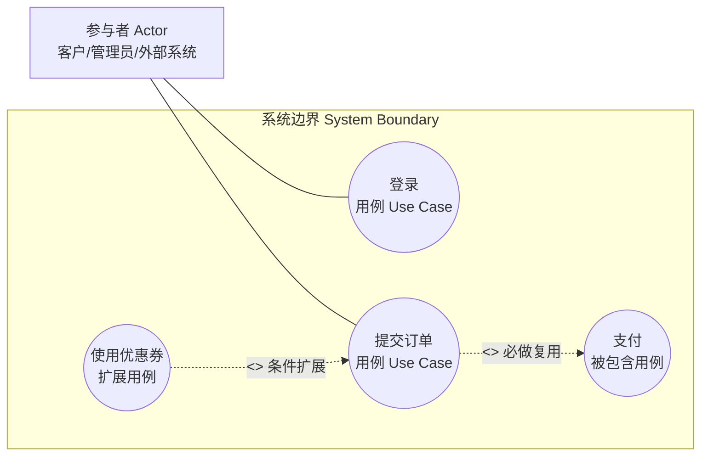

| 图中元素 | 概念 | 考试判断 |
|---|---|---|
| 参与者 Actor | 系统外部与系统交互的角色，可以是人、设备、其他系统 | 不是某个具体用户本人，而是角色 |
| 用例 Use Case | 系统向参与者提供的可观察服务或目标 | 椭圆里应是“登录、下单、查询成绩”这类用户目标 |
| 系统边界 | 哪些用例属于当前系统 | 边界外是参与者，边界内是系统功能 |
| 关联 | 参与者和用例之间的通信关系 | 只表示“这个角色参与这个功能” |
| `include` | 一个用例必然包含另一个公共用例 | “每次都要做”的公共步骤 |
| `extend` | 在特定条件下对基础用例做可选扩展 | “有条件才发生”的附加行为 |
| 泛化 | 参与者之间或用例之间的一般/特殊关系 | 子参与者继承父参与者可做的事 |

易错边界：用例图讲“系统对外提供什么服务”，活动图讲“服务内部流程怎么走”。如果题目问审批步骤、分支、并发，不要选用例图。

#### 2.2A.2 类图：类、属性、方法和类之间的静态关系

类图描述系统的类型结构。它回答的是：系统中有哪些类，每个类有什么属性和操作，类与类之间有什么结构关系。

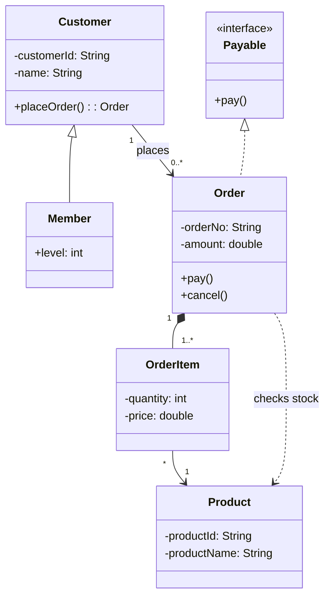

| 图中元素 | 概念 | 考试判断 |
|---|---|---|
| 类名 | 一类对象的抽象类型 | 通常在三格矩形第一格 |
| 属性 | 类保存的数据 | 常见写法：`-name: String` |
| 操作/方法 | 类能执行的行为 | 常见写法：`+pay(): boolean` |
| 可见性 `+` | public，公开 | 外部可访问 |
| 可见性 `-` | private，私有 | 仅类内部访问 |
| 可见性 `#` | protected，受保护 | 类及子类访问 |
| 可见性 `~` | package，包内可见 | 同包访问 |
| 抽象类/抽象操作 | 不能直接实例化或没有完整实现 | 常见斜体或 `{abstract}` |
| 接口 | 只声明能力契约 | 常见 `<<interface>>` 或棒棒糖接口 |
| 关联 Association | 类之间稳定连接 | 一个类长期知道另一个类 |
| 多重度 Multiplicity | 一端能对应多少个对象 | `1`、`0..1`、`0..*`、`1..*` |
| 角色名 Role | 关联一端扮演的角色 | 说明这个对象在关系中的身份 |
| 导航性 Navigability | 是否能从一端访问另一端 | 箭头表示可导航方向 |
| 依赖 Dependency | 临时使用对方 | 虚线箭头，方法参数/局部变量常见 |
| 泛化 Generalization | 继承，特殊/一般关系 | 实线空心三角，能说“A 是一种 B” |
| 实现 Realization | 类实现接口 | 虚线空心三角 |
| 聚合 Aggregation | 弱整体-部分 | 空心菱形，部分可独立存在 |
| 组合 Composition | 强整体-部分 | 实心菱形，部分生命周期依附整体 |

类图关系强弱要这样记：

| 关系 | 口语判断 | 典型线索 |
|---|---|---|
| 依赖 | 临时用一下 | 方法参数、局部变量、调用工具类 |
| 关联 | 长期认识 | 成员属性、稳定连接 |
| 聚合 | 弱拥有 | 班级-学生，整体没了部分还能存在 |
| 组合 | 强拥有 | 订单-订单明细，整体没了部分也没意义 |
| 泛化 | 是一种 | 子类继承父类 |
| 实现 | 按接口办事 | 类实现接口或抽象契约 |

#### 2.2A.3 对象图：类图在某一时刻的实例快照

对象图不是再画一遍类图，而是把某个运行时刻的具体对象、属性值和对象链接画出来。

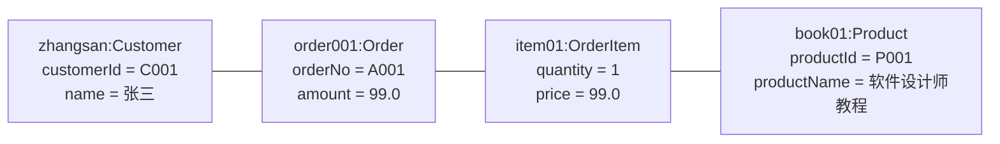

| 图中元素 | 概念 | 考试判断 |
|---|---|---|
| 对象名 | 某个具体实例的名字 | 如 `order001` |
| 类名 | 对象所属类型 | 常见写法：`对象名:类名` |
| 匿名对象 | 只写 `:类名`，不写对象名 | 表示某个未命名实例 |
| 属性值 | 该对象当前属性的具体取值 | 如 `amount = 99.0` |
| 链接 Link | 对象之间在这一刻存在的连接 | 是关联在对象层面的实例 |

类图和对象图最稳的区分：

| 判断点 | 类图 | 对象图 |
|---|---|---|
| 关注对象 | 类型/模板 | 具体实例/快照 |
| 名称写法 | `Order` | `order001:Order` 或 `:Order` |
| 属性写法 | `amount: double` | `amount = 99.0` |
| 方法 | 常出现方法 | 通常不列方法 |
| 线 | 类之间的关系 | 对象之间的链接 |

一句话：类图是“设计图纸”，对象图是“运行现场照片”。

#### 2.2A.4 活动图：业务流程、控制流和并发流程

活动图描述一个业务过程怎样一步一步执行，适合表达流程、分支、循环、并发和泳道职责。

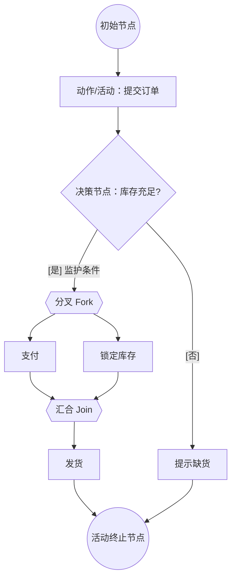

| 图中元素 | 概念 | 考试判断 |
|---|---|---|
| 初始节点 | 流程开始 | 实心圆 |
| 动作 Action | 一个不可再细分或当前不再展开的步骤 | 如“支付”“发货” |
| 活动 Activity | 可以由多个动作组成的过程 | 比动作粒度更大 |
| 控制流 | 控制从一个动作流向另一个动作 | 普通箭头 |
| 对象流 | 对象或数据在动作间流动 | 题目强调数据对象时出现 |
| 决策节点 | 根据条件选择一条路径 | 菱形，一个入口多个出口 |
| 合并节点 | 多个可选路径汇合 | 菱形，多个入口一个出口 |
| 监护条件 Guard | 路径成立条件 | 常写成 `[是]`、`[金额>100]` |
| 分叉 Fork | 一条流分成多条并发流 | 粗横线或粗竖线 |
| 汇合 Join | 多条并发流同步为一条 | 要等并发分支都到达 |
| 泳道 Swimlane | 按角色/部门划分职责 | 看“谁负责哪个动作” |
| 活动终止节点 | 整个活动结束 | 外圈圆加内实心圆 |
| 流终止节点 | 某一条流结束，不一定结束整个活动 | 小圆带叉，软考少考 |

易错边界：活动图的节点多是“动词短语”，状态图的节点多是“名词状态”。`审核材料`偏活动图，`审核中`偏状态图。

#### 2.2A.5 状态图：一个对象从出生到结束的状态变化

状态图描述某个对象在生命周期中处于哪些稳定状态，以及什么事件会触发状态迁移。它不等同于流程图。

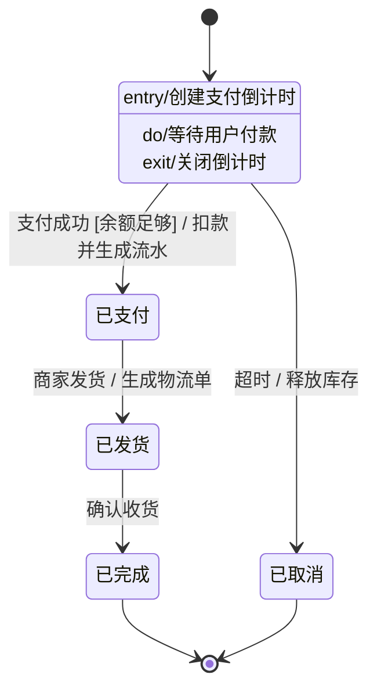

状态迁移标签按这个模板读：

```text
源状态 --> 目标状态 : 事件触发器 [监护条件] / 动作或效果
```

| 图中元素 | 概念 | 考试判断 |
|---|---|---|
| 状态 State | 对象在一段时间内稳定满足的情况 | 如“待支付”“已发货” |
| 初始状态 | 对象状态机开始 | 实心圆或 `[*]` |
| 终止状态 | 对象状态机结束 | 终止圆或 `[*]` |
| 转移 Transition | 从一个状态到另一个状态的边 | 连接状态，但不包含状态 |
| 源状态 | 转移发生前的状态 | 边的起点 |
| 目标状态 | 转移发生后的状态 | 边的终点 |
| 事件触发器 Event Trigger | 什么事情发生后可能触发转移 | 如“支付成功” |
| 监护条件 Guard | 事件发生后还必须满足的条件 | 如 `[余额足够]` |
| 动作/效果 Effect | 转移发生时执行的行为 | `/ 扣款并生成流水` |
| 进入动作 Entry | 进入某状态时执行 | `entry/动作` |
| 退出动作 Exit | 离开某状态时执行 | `exit/动作` |
| 持续活动 Do Activity | 处于状态期间持续执行 | `do/活动` |
| 自转换 | 状态迁移后仍回到自身 | 常用于事件发生但状态不变 |
| 复合状态 | 状态内部还有子状态 | 大状态中嵌套小状态 |

你截图里的错题就卡在这里：转移可以带 `事件触发器`、`监护条件`、`动作/效果`，但不能说“转移包含状态”。状态是转移的两端，不是转移内部组成。

#### 2.2A.6 顺序图：对象之间按时间顺序发送消息

顺序图属于交互图，强调消息发生的先后。时间方向默认从上到下。

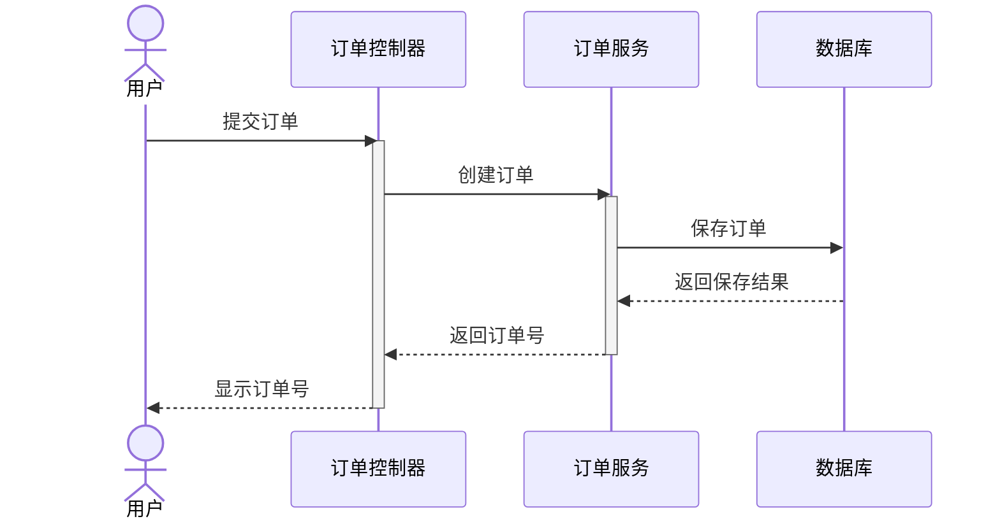

| 图中元素 | 概念 | 考试判断 |
|---|---|---|
| 参与者/对象 | 交互中的角色或对象 | 图顶部的框 |
| 生命线 Lifeline | 对象存在的时间线 | 竖向虚线 |
| 激活 Activation | 对象正在执行操作的时间段 | 生命线上的窄矩形 |
| 同步消息 | 调用方等待返回 | 常见实线实心箭头 |
| 异步消息 | 调用方不等待返回 | 常见开放箭头，软考概念题可能出现 |
| 返回消息 | 调用结果返回 | 常见虚线箭头 |
| 创建消息 | 创建新对象 | 指向新对象生命线起点 |
| 销毁消息 | 对象生命结束 | 生命线末端 `X` |
| 组合片段 | `alt`、`opt`、`loop` 等控制结构 | 表达分支、可选、循环 |

顺序图和通信图都讲交互。区别是：顺序图靠纵向时间轴，通信图靠对象链接和消息编号。

#### 2.2A.7 通信图：对象如何连接并按编号发送消息

通信图也属于交互图，但它更强调对象之间的组织关系。消息顺序主要靠编号表示。

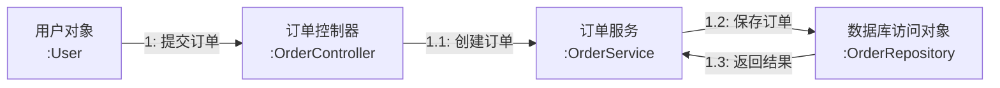

| 图中元素 | 概念 | 考试判断 |
|---|---|---|
| 对象 | 参与交互的实例 | 常见 `对象名:类名` 或 `:类名` |
| 链接 | 对象之间可通信的连接 | 没有链接通常不能直接发消息 |
| 消息 | 一个对象发给另一个对象的请求 | 箭头旁的文字 |
| 消息编号 | 表示消息顺序和层次 | `1`、`1.1`、`1.2` |
| 条件/迭代 | 消息发送条件或重复 | 可能写 `[条件]`、`*` |

易错边界：通信图不是对象图。对象图只表达静态快照，通信图还表达对象之间发送消息。

#### 2.2A.8 构件图：软件实现部件及其接口依赖

构件图描述系统由哪些可替换、可部署的软件构件组成，以及构件之间依赖什么接口。

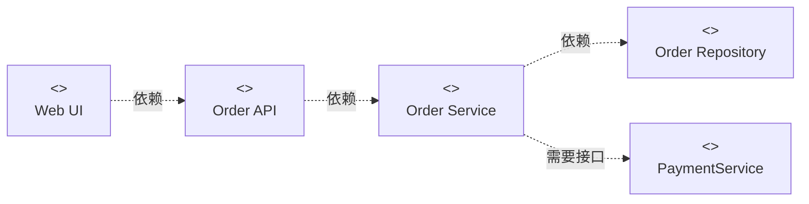

| 图中元素 | 概念 | 考试判断 |
|---|---|---|
| 构件 Component | 可替换、可部署的软件部件 | 如模块、服务、库、子系统 |
| 接口 Interface | 构件提供或需要的服务契约 | 常见提供接口/需要接口 |
| 提供接口 Provided Interface | 构件向外提供的能力 | 棒棒糖符号常见 |
| 需要接口 Required Interface | 构件运行所依赖的外部能力 | 插座符号常见 |
| 端口 Port | 构件对外交互的边界点 | 复杂构件图可能出现 |
| 依赖 Dependency | 一个构件使用另一个构件或接口 | 虚线箭头 |
| 制品 Artifact | 物理文件形式的软件产物 | 如 jar、dll、exe，常和部署图关联 |

易错边界：构件图看软件实现部件，部署图看硬件/运行节点。题目出现“静态实现视图、构件、接口、依赖”，优先构件图。

#### 2.2A.9 部署图：软件制品部署到哪些硬件或运行节点

部署图描述运行时的物理结构：服务器、设备、执行环境，以及软件制品部署在哪里。

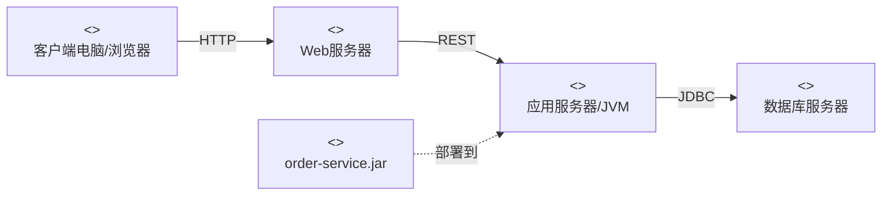

| 图中元素 | 概念 | 考试判断 |
|---|---|---|
| 节点 Node | 具有计算能力或执行能力的资源 | 服务器、设备、运行环境 |
| 设备 Device | 物理硬件节点 | PC、手机、服务器 |
| 执行环境 Execution Environment | 软件运行容器 | JVM、Web容器、操作系统进程 |
| 制品 Artifact | 被部署的软件文件 | jar、war、exe、配置文件 |
| 部署关系 | 制品放到节点上运行 | “软件部署到硬件/节点” |
| 通信路径 | 节点之间的物理或网络连接 | HTTP、TCP、JDBC 等 |

易错边界：题干说“软件组件和硬件之间的物理关系”，就是部署图，不是构件图。

#### 2.2A.10 包图：模型元素如何分组和依赖

包图描述模型组织结构，常用于把类、用例、构件等模型元素分组。

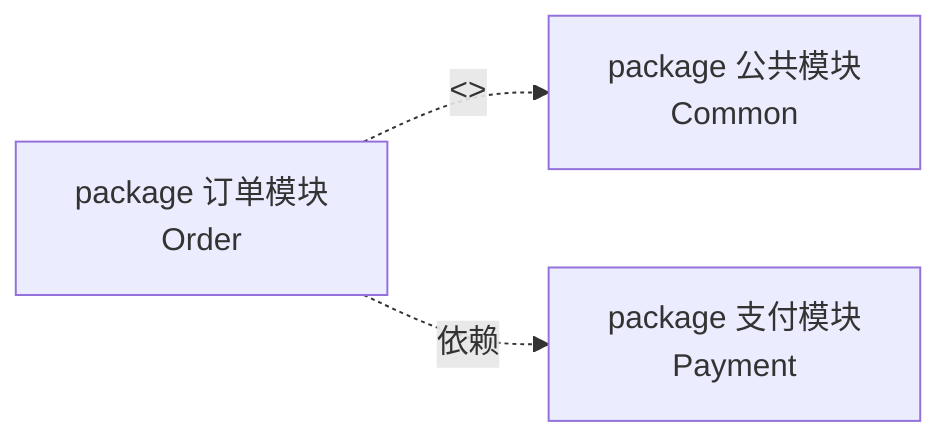

| 图中元素 | 概念 | 考试判断 |
|---|---|---|
| 包 Package | 模型元素的组织单元 | 类似命名空间/分组 |
| 包嵌套 | 包中包含子包 | 表示层次组织 |
| 包导入 Import | 一个包使用另一个包中公开元素 | 常见 `<<import>>` |
| 包合并 Merge | 把一个包的定义合并进另一个包 | 常见 `<<merge>>`，软考较少 |
| 依赖 | 一个包依赖另一个包 | 虚线箭头 |
| 拥有关系 | 元素属于某个包 | 一个模型元素只能被一个包直接拥有 |

易错边界：包图不是部署目录图。它讲模型组织，不等于真实文件夹路径。

#### 2.2A.11 组合结构图：类或构件内部由哪些部件协作

组合结构图描述一个类、构件或协作在内部运行时由哪些部分组成，以及这些部分通过端口和连接器怎样协作。软设不如类图高频，但概念题可能把它和类图、构件图混在一起。

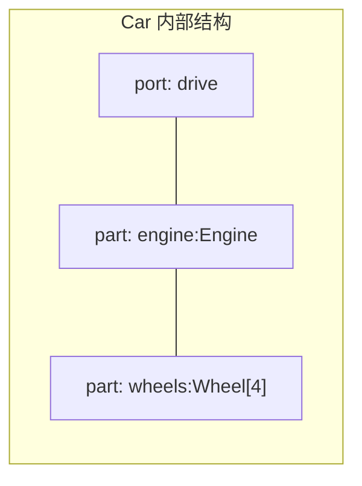

| 图中元素 | 概念 | 考试判断 |
|---|---|---|
| 结构化类/构件 | 被展开内部结构的整体 | 如 `Car` 内部有哪些部件 |
| 部件 Part | 整体内部的运行时角色 | 如 `engine:Engine` |
| 端口 Port | 整体对外提供/需要交互的位置 | 边界上的小方块 |
| 连接器 Connector | 内部部件之间的通信连接 | 连接 part 与 part 或 port |
| 协作 Collaboration | 多个角色共同完成某个功能 | 强调角色协作结构 |

易错边界：类图看类与类的静态关系；组合结构图看某个结构内部的部件和连接。

#### 2.2A.12 交互概览图：用活动图的外壳组织多个交互片段

交互概览图属于交互图，用活动图的控制流把多个交互过程串起来。软设很少要求细画，但要知道它既不是普通活动图，也不是单纯顺序图。

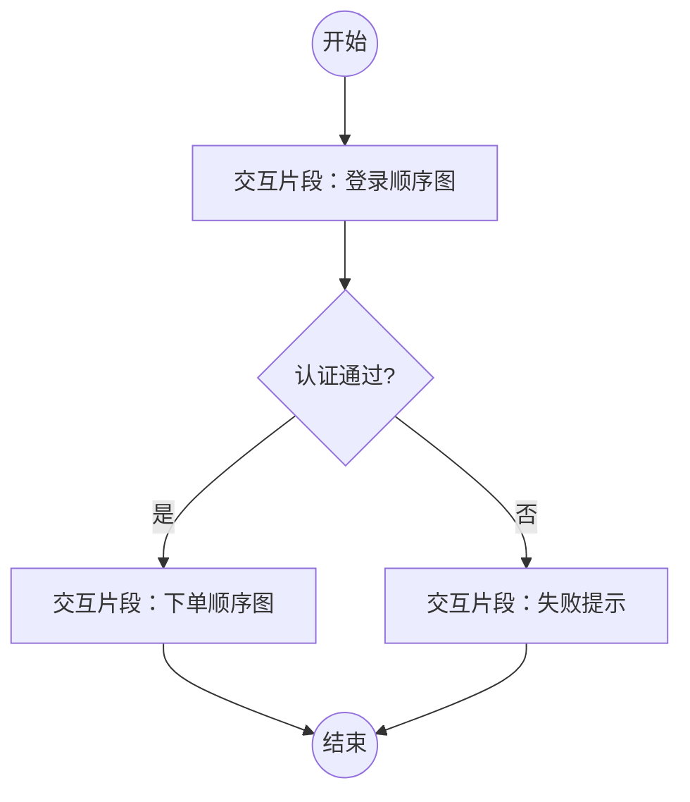

| 图中元素 | 概念 | 考试判断 |
|---|---|---|
| 交互片段 | 一个可引用的交互过程 | 通常对应顺序图等 |
| 控制流 | 决定交互片段执行顺序 | 类似活动图 |
| 决策/合并 | 在交互片段之间做分支和汇合 | 复用活动图概念 |

易错边界：活动图的节点是业务动作；交互概览图的节点往往是一个交互片段。

#### 2.2A.13 定时图/时序图：状态或值随时间怎样变化

定时图强调时间轴上对象状态或属性值的变化，常用于实时系统、通信协议、硬件相关场景。注意这里的“时序图/定时图”不是“顺序图”。

```text
时间:     t0      t1      t2      t3
订单状态: 待支付  待支付  已支付  已发货
信号值:   0       1       1       0
```

| 图中元素 | 概念 | 考试判断 |
|---|---|---|
| 时间轴 | 横向或纵向表示时间推进 | 重点是具体时间约束 |
| 生命线 | 某对象或属性随时间变化 | 和顺序图生命线含义不同 |
| 状态/值轨迹 | 对象状态或值的变化曲线 | 如信号从 0 变 1 |
| 时间约束 | 必须在某时间范围内发生 | 如 `t < 5s` |
| 持续时间约束 | 某状态持续多久 | 实时系统常见 |

易错边界：顺序图强调对象之间消息先后；定时图强调状态/值相对于时间的变化。

#### 2.2A.14 轮廓图：给 UML 扩展领域专用标记

轮廓图用于扩展 UML 元模型，给模型元素加领域专用的构造型、标记值和约束。软设低频，知道它是“扩展 UML 表达能力”的图即可。

```text
<<stereotype>> Entity
适用于：Class
标记值：tableName
约束：必须有主键属性
```

| 图中元素 | 概念 | 考试判断 |
|---|---|---|
| 轮廓 Profile | 一组 UML 扩展定义 | 面向特定领域或平台 |
| 构造型 Stereotype | 给 UML 元素贴的扩展标签 | 如 `<<entity>>`、`<<controller>>` |
| 标记值 Tagged Value | 构造型附带的属性 | 如 `tableName = "order"` |
| 约束 Constraint | 对模型元素的限制条件 | 常用 `{}` 表示 |
| 元类 Metaclass | 被扩展的 UML 基础元素 | 如 Class、Component |

易错边界：轮廓图不是业务流程图，也不是类图本身；它是对 UML 语言做扩展说明。

### 2.3 易错点

1. 把用例图和类图混淆。
2. 把“参与者”理解成“某个具体用户本人”，其实它是角色抽象。
3. 把“关联只能有一个”当成绝对规则。
4. 把“特殊 / 一般关系”误写成依赖、聚合或实现，实际上这是泛化。
5. 把业务流程建模误写成用例图。用例图看“系统提供什么服务”，活动图看“流程怎么流转”。
6. 把构件图和部署图混淆。构件图看静态实现，部署图看物理落地。
7. 把包图里的“拥有”理解成可以被多个包重复拥有，这是错的。
8. 把状态图和活动图混淆。状态图看“状态+事件迁移”，活动图看“流程步骤”。
9. 把通信图和序列图混淆。通信图强调对象组织，序列图强调时间顺序。
10. 把对象图看成类图。对象图是实例快照，类图是类型结构。

### 2.4 真题示例

题目：

在 UML 用例图中，参与者表示（A）。

- A. 人、硬件或其他系统可以扮演的角色
- B. 可以完成多种动作的相同用户
- C. 不管角色的实际物理用户
- D. 带接口的物理系统或者硬件设计

正确答案：`A`

详细解析：

- 参与者不是系统内部对象，而是系统外部与系统发生交互的“角色”。
- 这个角色可以是人，也可以是外部系统或硬件。
- 因此 A 正确。
- B、C 都把参与者理解得过窄或过偏。
- D 则偏向实现层面，不是用例图里的标准说法。

补强例题 1：

题目：

UML构件图（component diagram）展现了一组构件之间的组织和依赖，专注于系统的静态（B）视图，图中通常包括构件、接口以及各种关系。

- A. 关联
- B. 实现
- C. 结构
- D. 行为

正确答案：`B`

详细解析：

- 构件图考的不是“对象怎么运行”，而是“系统最终由哪些软件构件组成，它们之间怎样依赖”。
- 所以它对应的是系统的`静态实现视图`，不是一般意义上模糊的“结构视图”。
- A“关联”是关系类型，不是视图名称。
- C“结构”听起来像对，但题库这里的标准说法是“实现视图”，这是软设客观题常考的固定表述。
- D“行为”显然不对，行为通常对应交互图、状态图、活动图这类动态图。

补强例题 2：

题目：

在UML图中，（D）图用于展示所交付系统中软件组件和硬件之间的物理关系。

- A. 类
- B. 组件
- C. 通信
- D. 部署

正确答案：`D`

详细解析：

- 这题的关键词是`软件组件和硬件之间的物理关系`。
- 只要题目强调“运行节点、服务器、设备、硬件、物理部署”，优先选`部署图`。
- 类图看静态设计结构。
- 组件图看软件构件组织。
- 通信图看对象之间如何交互发消息。
- 因此本题只能选 D。

补强例题 3：

题目：

如下所示的 UML 状态图中，（C）时，不一定会离开状态 B。

正确答案：`C`

详细解析：

- 这题的关键不是记图，而是理解状态图的迁移是“有条件的”。
- 事件 `e2` 发生，不代表一定离开状态 B；只有当当前确实处在能响应 `e2` 的子状态时，迁移才会发生。
- 所以只说“事件 `e2` 发生”这个条件还不够，答案选 C。
- 你这类题容易错的根因通常是把“事件发生”直接等同于“状态一定迁移”，但状态图里迁移是否发生，要看当前所处状态是否满足那条迁移边的前提。

补强例题 4：

题目：

以下 UML 图是（C），图中带 `:` 的框表示（B），连线箭头上的标注表示（D）。

正确答案：`C、B、D`

详细解析：

- 本题考的是通信图，不是序列图，也不是状态图。
- 通信图看的是对象之间的组织关系，所以题图重点是“谁和谁连着，谁给谁发消息”。
- 带 `:` 的框表示的是`对象`，不是类。类是类型定义，对象是运行时实例。
- 对象之间连线箭头旁边的标识表示的是`消息`，不是流名称。
- 你这类题如果再错，通常不是 UML 大类没背，而是没抓住两个图元判断点：
- `带冒号的框 -> 对象`
- `连线箭头文字 -> 消息`

### 2.5 面向对象里的关系到底有哪些，怎么分辨

软设客观题里，最常混的不是“图叫什么”，而是“类和类之间到底是什么关系”。这一块不要死背，先抓两个判断轴：

1. 这两个类之间是“会用到”还是“本来就连着”  
2. 如果本来就连着，是“普通连接”还是“整体 - 部分”

按这个逻辑往下走：

`依赖（Dependency）`：

- 一个类`临时使用`另一个类
- 常见表现：某个类把另一个类作为方法参数、局部变量、临时调用对象
- 关键词：`用一下`、`调用一下`、`变化会影响我`
- 判断口诀：`关系短、接触浅、方法里见`，优先看依赖

`关联（Association）`：

- 一个类和另一个类之间存在`稳定连接`
- 常见表现：一个类长期知道另一个类，通常作为成员属性保存引用
- 关键词：`拥有联系`、`知道对方`、`长期连接`
- 判断口诀：`关系稳、对象间一直认识`，优先看关联

`聚合（Aggregation）`：

- 是一种较弱的整体 - 部分关系
- 整体和部分可以`各自独立存在`
- 例如：班级和学生、部门和员工
- 判断口诀：`拿走整体，部分还能单独活`，就是聚合

`组合（Composition）`：

- 是一种更强的整体 - 部分关系
- 部分的生命周期依赖整体
- 例如：页面和页面中的某个专属部件、订单和订单明细这类强依附对象
- 判断口诀：`整体没了，部分也没意义`，就是组合

`泛化（Generalization）`：

- 特殊 / 一般关系，本质就是继承
- 关键词：`某某是一种某某`
- 例如：Car 是一种 Vehicle
- 判断口诀：能不能说成“`A 是一种 B`”，能的话优先看泛化

`实现（Realization）`：

- 类对接口或抽象契约的实现
- 关键词：`实现接口`、`兑现约定`
- 判断口诀：如果一边是接口 / 抽象规范，另一边是具体类，优先看实现

最实用的一张判断表：

- `只是临时调用`：依赖
- `长期持有引用`：关联
- `整体和部分可独立存在`：聚合
- `整体和部分同生共死`：组合
- `A 是一种 B`：泛化
- `类去实现接口`：实现

再补两个最常错的区分：

- `聚合`：弱整体 - 部分。比如购物车和商品，商品可以离开这个购物车继续存在。
- `组合`：强整体 - 部分。比如网店里的商品结构、页面里的专属子部件，整体没了，部分也就没意义。

做题时碰到“整体 - 部分”关系，先别急着选组合，先问一句：

- 这个部分能不能脱离整体独立存在？
- 能：优先聚合
- 不能：优先组合

### 2.6 UML 图完整分类补充

前面我已经讲了本章常考的图，但如果你想把这一块真正讲透，最好把 UML 图先按大类装进脑子里。

UML 2.x 常见口径可以分成 `结构图` 和 `行为图` 两大组，其中交互图是行为图里的一个子组。

`结构图`主要看“系统静态长什么样”：

- 类图（Class Diagram）
- 对象图（Object Diagram）
- 构件图 / 组件图（Component Diagram）
- 部署图（Deployment Diagram）
- 包图（Package Diagram）
- 组合结构图（Composite Structure Diagram）
- 轮廓图（Profile Diagram）

`行为图`主要看“系统怎么动”：

- 用例图（Use Case Diagram）
- 活动图（Activity Diagram）
- 状态图（State Machine Diagram）
- 交互图（Interaction Diagrams）

`交互图`常见再细分为：

- 序列图（Sequence Diagram）：强调时间顺序
- 通信图（Communication Diagram）：强调对象组织关系
- 交互概览图（Interaction Overview Diagram）
- 时序图 / 定时图（Timing Diagram）

软设上午题里，你最该优先掌握的是这 9 个：

- 用例图
- 类图
- 对象图
- 活动图
- 状态图
- 序列图
- 通信图
- 构件图
- 部署图

它们的分辨逻辑不要死背名字，按“题目到底在问什么”来分：

- 问`系统提供什么服务、谁来用`：用例图
- 问`类、属性、方法、静态关系`：类图
- 问`某一时刻对象实例快照`：对象图
- 问`业务流程、审批流、控制流`：活动图
- 问`状态如何变化、事件怎么触发迁移`：状态图
- 问`消息按时间先后怎么传`：序列图
- 问`对象之间怎么组织并通信`：通信图
- 问`软件部件怎样组织依赖`：构件图
- 问`软件最终怎样部署到硬件节点`：部署图

## 二、面向对象基本概念与原则（权值：7/22，约31.8%）

### 3.1 这个知识点到底在讲什么

面向对象并不是“类很多的程序设计”，它有一整套思维方式。

最核心的几个关键词是：

- 对象
- 类
- 封装
- 继承
- 多态

### 3.2 核心概念详细讲解

`对象`：

- 是运行时实体
- 既有数据，也有行为

`类`：

- 是同类对象的抽象模板

`封装`：

- 把数据和操作数据的方法包在一起

`继承`：

- 让子类获得父类已有结构和行为

`多态`：

- 同一消息发给不同对象，可以得到不同结果

`动态绑定` 与 `静态绑定`：

- `动态绑定`：运行时才决定具体调用哪个实现，是运行时多态成立的基础
- `静态绑定`：编译期就已经确定调用目标

`重载` 与 `覆盖`：

- `重载`：同一个类中，方法名相同但参数列表不同，属于编译时多态
- `覆盖`：子类重写父类同名方法，依赖动态绑定，属于运行时多态

`面向对象分析`：

- 第一步通常是从需求描述里先找`名词`
- 因为名词更可能对应对象、实体、参与者、业务概念

`面向对象测试四层`：

- `算法层`：测类里的单个方法，最接近传统单元测试
- `类层`：测类内属性和方法的相互作用
- `模板层`：测一组协同工作的类，近似集成测试
- `系统层`：测完整面向对象系统

`单一职责原则`：

- 一个类最好只有一个引起它变化的原因
- 题目里如果一个类既做主业务，又写日志、又发邮件、又做权限，一般就是违反单一职责

`继承类型`：

- 常见的是单重继承、多重继承、层次继承
- `分布式继承`不是这里的标准继承类型

`喷泉模型`：

- 以对象为驱动，强调迭代、无明显阶段边界
- 是软设里和面向对象开发方法绑定最紧的开发模型之一

做题时要特别注意“对象”和“类”的边界：

- 类是模板
- 对象是实例

`面向对象开发阶段任务辨析`：

| 阶段 | 该阶段主要做什么 | 做题识别口径 |
| --- | --- | --- |
| 面向对象分析 | 认定对象、组织对象、描述对象间的相互作用、确定基于对象的操作 | 偏“需求里有哪些对象、对象怎样协作、对象要承担哪些操作” |
| 面向对象设计 | 识别类及对象、定义属性、定义服务、识别关系、识别包 | 题干出现“识别类及对象、定义属性、定义服务、识别关系、识别包”时，选面向对象设计；类似选项里 D 符合该描述 |
| 面向对象程序设计 | 采用面向对象程序设计范型，并选择一种 OOPL 实现 | `OOPL` 是 Object-Oriented Programming Language，即面向对象程序设计语言 |
| 面向对象测试 | 按算法层、类层、模板层、系统层逐层测试 | 算法层偏单个方法，类层偏单个类，模板层偏一组协作类，系统层偏完整系统 |

背诵时不要把“分析”和“设计”混在一起：分析更像“从需求里找对象和协作”，设计更像“把对象落实成类、属性、服务、关系和包”。

### 3.3 真题示例

题目：

对象、类、继承和消息传递是面向对象的 4 个核心概念。其中对象是封装（D）的整体。

- A. 命名空间
- B. 要完成任务
- C. 一组数据
- D. 数据和行为

正确答案：`D`

详细解析：

- 面向对象里的对象不是只有属性，也不是只有操作。
- 真正的对象一定同时包含：
  - 属性（数据）
  - 方法（行为）
- 所以 D 正确。
- C 只说数据，不完整。

### 3.4 本轮补强点

1. 只要题目问“运行时把调用和响应代码结合起来”，答案就是`动态绑定`，不要和静态绑定混。
2. 只要题目问“分析阶段首先认定对象”，先想“从名词识别对象”。
3. 只要题目问“类中每个方法相当于传统单元测试”，答案指向`算法层`。
4. 只要题目出现“一个类承担多个变化原因”，优先判断违反`单一职责原则`。
5. 只要题目问“哪种不是继承类型”，警惕`分布式继承`这种伪干扰项。
6. 只要题目问“哪种模型适合面向对象、以对象驱动”，优先想到`喷泉模型`。
7. 遇到“重载和覆盖”时，先死记一个判断式：

- `重载 = 同类不同参数 = 编译时`
- `覆盖 = 子类改父类实现 = 运行时 = 动态绑定`

## 三、设计模式（权值：7/22，约31.8%）

### 4.1 这个知识点到底在讲什么

设计模式本质上是：反复出现的设计问题，对应的经典解法。

软设客观题里最常见的模式不是一大堆一起考，而是反复围绕几个“母题”：

- 观察者
- 单例
- 工厂
- 抽象工厂
- 适配器
- 享元

### 4.2 核心概念详细讲解

`观察者模式`：

- 一对多依赖
- 一个主题变化，多个观察者收到通知
- 最典型场景：发布 / 订阅

`单例模式`：

- 保证某个类只有一个实例

- 属于`创建型模式`
- 题干如果强调“唯一实例”“全局访问点”，优先想到单例
- 如果选项里出现“创建一系列相关对象”，那是抽象工厂，不是单例

`抽象工厂模式`：

- 提供创建一组相关对象的接口

- 属于`创建型模式`
- 核心不是“只创建一个对象”，而是“创建同一产品族的一组对象”
- 题干里如果出现“不同平台对应一整套组件 / 控件 / 界面对象”，优先想到抽象工厂

`享元模式`：

- 共享细粒度对象，减少内存开销

- 属于`结构型模式`
- 题干里如果强调“对象很多、内存开销大、希望共享复用”，优先想到享元
- 它解决的是“对象太多”的问题，不是“创建一组对象”的问题

`策略模式`：

- 定义一组可互相替换的算法
- 题目如果说“不同场景选择不同定价、不同促销、不同计算规则”，优先想到策略

`适配器模式`：

- 把一个现有接口转换成客户希望使用的另一个接口
- 题目如果强调“已有多个不同接口，但客户端希望统一调用”，优先想到适配器

`命令模式`：

- 把请求封装成对象
- 适合做请求参数化、排队、日志记录、撤销操作
- 典型角色是：`Command` 声明执行接口，`ConcreteCommand` 具体实现命令，`Invoker` 触发命令

`桥接模式`：

- 把抽象部分和实现部分分离，使它们可以独立变化
- 一边是“抽象维度”，一边是“实现维度”
- 只要题目说“两个变化维度都要独立扩展”，就要高度怀疑桥接模式

模式分类也要记死：

- `命令模式`属于`行为型对象模式`
- `桥接模式`属于`结构型对象模式`

很多题还会继续细分成`类模式`和`对象模式`，这个不要硬背，先抓核心区别：

`类模式`：

- 主要靠`类与类之间的继承关系`完成设计
- 结构大多在编译期就确定下来
- 题目如果强调“父类规定框架、子类重写实现”，优先往类模式想

`对象模式`：

- 主要靠`对象之间的组合、引用、委托`完成设计
- 运行时更容易替换内部部件或协作对象
- 题目如果强调“一个对象里持有另一个对象，通过组合协作完成功能”，优先往对象模式想

最实用的判断口诀：

- `继承优先，看类模式`
- `组合优先，看对象模式`

为什么这样分：

- 继承是把关系写死在类层次里，所以更偏`类模式`
- 组合是让对象在运行时拼装和协作，所以更偏`对象模式`

考试时可以直接用下面这套推断法：

1. 先判断它属于创建型、结构型还是行为型
2. 再问自己：它主要靠继承，还是主要靠组合
3. 如果核心是“父类定骨架、子类改步骤”，偏`类模式`
4. 如果核心是“对象持有对象、运行时替换协作部件”，偏`对象模式`

把常考模式放进去理解：

- `桥接模式`是`结构型对象模式`
- 原因：不是靠子类无限扩展，而是让抽象对象持有实现对象，两条维度靠组合连接

- `命令模式`是`行为型对象模式`
- 原因：请求被封装成对象，由调用者、命令对象、接收者协作完成

- `策略模式`通常也按对象模式理解
- 原因：上下文对象持有一个策略对象，运行时可以替换策略

- `模板方法模式`更典型地属于类模式
- 原因：父类给出算法骨架，子类通过继承重写某些步骤

所以看到`结构型类模式 / 结构型对象模式`这类说法时，不要先背名字，先问：

- 这个结构问题是靠`继承`解决，还是靠`组合`解决？
- 如果靠继承，往类模式靠
- 如果靠组合，往对象模式靠

所以设计模式题通常不是考代码，而是考“哪个场景最像哪个模式”。

### 4.3 真题示例

题目：

（C）设计模式最适合用于发布/订阅消息模型，即当订阅者注册一个主题后，此主题有新消息到来时订阅者就会收到通知。

- A. 适配器（Adapter）
- B. 通知（Notifier）
- C. 观察者（Observer）
- D. 状态（State）

正确答案：`C`

详细解析：

- 发布 / 订阅模型的核心是一对多通知。
- 主题一变化，所有订阅者都收到更新，这正是观察者模式的定义。
- A 适配器是接口转换。
- D 状态模式是状态变化驱动行为变化。

补强例题 1：

题目：

股票交易中，股票代理（Broker）根据客户发出的股票操作指示进行股票的买卖操作，设计如下所示类图。该设计采用（A）模式将一个请求封装为一个对象，从而使得可以用不同的请求对客户进行参数化；对请求排队或记录请求日志，以及支持可撤销的操作。其中，（A）声明执行操作的接口。该模式属于（D）模式，该模式适用于：（B）。

正确答案：`A、A、D、B`

详细解析：

- 题干里“将请求封装为对象、支持排队、日志、可撤销”是命令模式的标准原句。
- 所以第一空必须是`命令模式`。
- 在命令模式里，真正声明执行接口的是`Command`抽象命令角色，这里题库对应 `Operation`。
- 命令模式按软设分类属于`行为型对象模式`，不是结构型，也不是创建型。
- 适用场景是“把动作抽象出来，作为参数交给别的对象调用”，所以第四空选 B。

为什么这题容易错：

- 很多人一看到“Broker 代理”就被单词误导成代理模式，这是典型陷阱。
- 软设判断模式时，优先看`题干意图`，不要被类名表面字样带偏。

补强例题 2：

题目：

假设现在要创建一个Web应用框架，基于此框架能够创建不同的具体Web应用，比如博客、新闻网站和网上商店等；并可以为每个Web应用创建不同的主题样式，如浅色或深色等。这一业务需求的类图设计适合采用（D）模式。其中（A）是客户程序使用的主要接口，维护对主题类型的引用。此模式为（B），体现的最主要的意图是（A）。

正确答案：`D、A、B、A`

详细解析：

- 题目里有两个独立变化维度：
- 一类是`WebApplication`的种类变化
- 另一类是`Theme`的种类变化
- 当两个维度都要独立扩展时，最典型的就是`桥接模式`。
- 客户程序主要操作的是抽象部分，因此这里第二空是 `WebApplication`。
- 桥接模式按软设分类属于`结构型对象模式`，这是本轮易错点。
- 它的核心意图就是：`将抽象部分与实现部分分离，使它们都可以独立地变化`。

再压一遍判断口诀：

- 只有一个算法维度反复切换，优先想`策略模式`
- 现有接口不兼容，但想统一调用，优先想`适配器模式`
- 请求要被封装成对象，优先想`命令模式`
- 两个变化维度要独立扩展，优先想`桥接模式`

补强例题 3：

题目：

以下关于 Singleton（单例）设计模式的叙述中，不正确的是（D）。

- A. 单例模式是创建型模式
- B. 单例模式保证一个类仅有一个实例
- C. 单例类提供一个访问唯一实例的全局访问点
- D. 单例类提供一个创建一系列相关或相互依赖对象的接口

正确答案：`D`

详细解析：

- A、B、C 都是单例模式的标准定义。
- D 说的是`抽象工厂模式`的意图，不是单例模式。
- 所以这题最关键不是记单例，而是要学会把`单例`和`抽象工厂`分开：
- `单例`看唯一实例
- `抽象工厂`看一组相关对象

补强例题 4：

题目：

为图形用户界面（GUI）组件定义不同平台的并行类层次结构，适合采用（B）模式。

- A. 享元（Flyweight）
- B. 抽象工厂（Abstract Factory）
- C. 外观（Facade）
- D. 装饰器（Decorator）

正确答案：`B`

详细解析：

- “不同平台 + 一整套 GUI 组件”就是典型的产品族问题。
- 例如 Windows 平台一套按钮、文本框、菜单；Linux 平台又是一套按钮、文本框、菜单。
- 这不是共享对象，也不是包装对象，而是要按平台成组创建对象，所以优先选`抽象工厂`。

补强例题 5：

题目：

因使用大量的对象而造成很大的存储开销时，适合采用（B）模式进行对象共享，以减少对象数量从而达到较少的内存占用并提升性能。

- A. 组合（Composite）
- B. 享元（Flyweight）
- C. 迭代器（Iterator）
- D. 备忘录（Memento）

正确答案：`B`

详细解析：

- 本题的关键词是`大量对象`、`存储开销大`、`对象共享`。
- 这三个关键词一出现，就要优先怀疑`享元模式`。
- 享元模式的本质就是把可共享的细粒度对象抽出来复用，减少重复对象带来的内存负担。
- 组合模式解决的是整体 - 部分层次；迭代器解决遍历；备忘录解决状态保存，都和本题无关。

### 4.4 设计模式到底有哪些类型，怎么不用死背去推

设计模式先别上来背 23 个名字，先抓它们解决的问题属于哪一类。软设上午题最实用的分类法就是三大类：

`创建型模式`：

- 关心“对象怎么创建”
- 题目核心矛盾是：创建过程复杂、对象家族要统一、某个类只能有一个实例、想复制现有对象
- 常见模式：工厂方法、抽象工厂、单例、建造者、原型

`结构型模式`：

- 关心“类和对象怎么组织起来”
- 题目核心矛盾是：接口不兼容、整体与部分、抽象与实现要分离、想给对象套一层职责、想做代理控制访问、想共享细粒度对象
- 常见模式：适配器、桥接、组合、装饰、代理、外观、享元

`行为型模式`：

- 关心“对象之间怎么协作、怎么分配职责、怎么传递请求或状态”
- 题目核心矛盾是：算法要切换、对象状态变化要通知别人、请求要排队或撤销、状态变化导致行为变化、要在一组对象间分派职责
- 常见模式：策略、观察者、命令、状态、责任链、模板方法、访问者、中介者、备忘录、解释器、迭代器

如果不靠背，怎么推某个模式属于哪一类？用下面这套三问法：

1. 题目主要在烦“怎么造对象”吗  
如果是，先往`创建型`想。

2. 题目主要在烦“怎么把几个类 / 对象拼起来”吗  
如果是，先往`结构型`想。

3. 题目主要在烦“对象之间怎么配合、怎么切换算法、怎么响应状态”吗  
如果是，先往`行为型`想。

把这三问再压成一句：

- `造对象`看创建型
- `搭结构`看结构型
- `管行为`看行为型

再给你一套从题干反推模式类别的逻辑方法。

第一步，看题干里的动词：

- 出现`创建、实例、工厂、一组产品、唯一实例`，优先创建型
- 出现`适配、组合、包装、桥接、代理、共享、统一接口`，优先结构型
- 出现`通知、切换、封装请求、状态改变、算法变化、职责传递`，优先行为型

第二步，看题目要你解决的“变化”落在哪：

- 变化落在`创建方式`，多半是创建型
- 变化落在`连接方式 / 组织方式`，多半是结构型
- 变化落在`算法 / 请求 / 状态 / 协作方式`，多半是行为型

第三步，看标准意图句：

- `创建一系列相关对象`：抽象工厂，创建型
- `保证只有一个实例`：单例，创建型
- `将接口转换成客户希望的另一个接口`：适配器，结构型
- `将抽象与实现分离`：桥接，结构型
- `整体 - 部分层次结构`：组合，结构型
- `支持大量细粒度对象共享`：享元，结构型
- `定义一系列算法并可替换`：策略，行为型
- `一对多通知`：观察者，行为型
- `将请求封装成对象`：命令，行为型
- `状态变，行为也变`：状态，行为型

最后给你一个最实用的考试推理模板：

1. 先问：题目在解决“创建 / 结构 / 行为”哪一类问题  
2. 再问：题目中的变化点是什么  
3. 再对照该类里最典型的标准意图句  
4. 最后再看类图 / 场景细节做排除

这样做的好处是：你不需要一上来死背 23 个模式，而是先把题目压缩到一个小类，再在小类里选最像的那个。

## 2. 本课复习顺序

1. UML 图基础
2. 面向对象基本概念与原则
3. 设计模式

