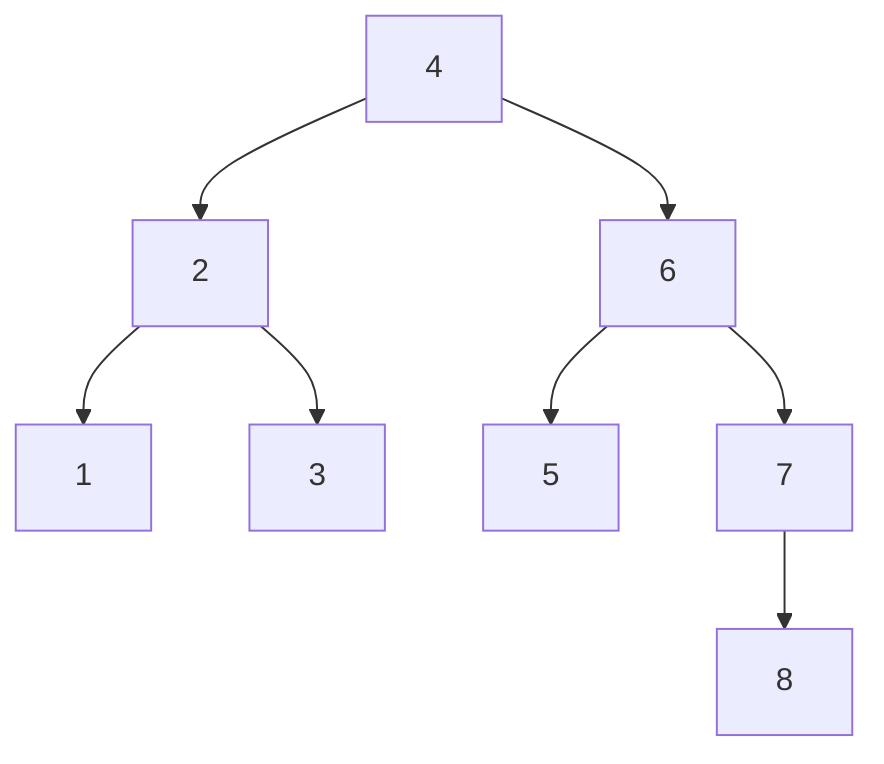
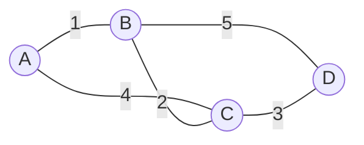
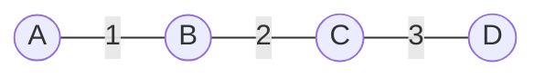

# 第8章 算法设计与分析

## 0. 本课生成口径

- 本课只使用本地上午客观题。
- 采用 `20` 题代表性题池做权值统计。
- 权值定义：`该知识点题数 / 20`。

## 1. 本地题池与知识点权值

1. 算法设计策略：`7/20`
2. 排序与查找算法：`6/20`
3. 复杂度与递推分析：`4/20`
4. 经典综合算法题：`3/20`

## 一、算法设计策略（权值：7/20，约35.0%）

### 2.1 这个知识点到底在讲什么

这一块研究的是：面对不同类型的问题，应该用什么“解题思想”。

最常见的策略有：

- 分治
- 动态规划
- 贪心
- 回溯
- 分支限界

### 2.2 核心概念详细讲解

`分治`：

- 把大问题分成若干相同或相似的小问题
- 递归求解后合并结果

`动态规划`：

- 也会拆子问题
- 但子问题存在重叠
- 核心是“记住已经算过的结果”

动态规划最容易卡住的地方，不是“背出这四个字”，而是读不懂题目里给出的状态定义和递推式。下面把 `0-1` 背包这类最典型的写法拆开讲清楚。

先看状态定义：

- 常写成 `c(i, j)`
- 它的含义不是某个神秘公式，而是：
- `只看前 i 个物品`
- `当前背包容量为 j`
- `在这种限制下能得到的最大价值`

例如：

- `c(1, 2)`：只允许看第 `1` 个物品，容量是 `2` 时，最大价值是多少
- `c(3, 5)`：只允许看前 `3` 个物品，容量是 `5` 时，最大价值是多少
- `c(n, W)`：看全部 `n` 个物品，背包容量为 `W` 时的最优值

为什么递推式里一定会出现“选第 `i` 个物品”和“不选第 `i` 个物品”？

- 因为当我们在求 `c(i, j)` 时，新加入考虑范围的最后一个物品就是第 `i` 个物品
- 它只有两种处理方式：
- 不选它
- 选它

于是递推关系自然就出来了。

`不选第 i 个物品` 时：

- 背包容量仍然是 `j`
- 但可选物品变成前 `i-1` 个
- 所以价值就是 `c(i-1, j)`

`选第 i 个物品` 时，前提是它放得下，也就是 `w_i <= j`

- 一旦选它，先得到它本身的价值 `v_i`
- 同时背包剩余容量变成 `j - w_i`
- 剩下的问题变成：在前 `i-1` 个物品里，用容量 `j - w_i` 继续取最优
- 所以这一支的总价值是 `c(i-1, j-w_i) + v_i`

把这两种情况合起来：

- 如果 `w_i > j`，第 `i` 个物品太重，根本放不下，只能不选
- 所以 `c(i, j) = c(i-1, j)`

- 如果 `w_i <= j`，就比较“选它”和“不选它”谁更好
- 所以 `c(i, j) = max(c(i-1, j), c(i-1, j-w_i) + v_i)`

边界条件也必须看懂：

- `c(0, j) = 0`
- `c(i, 0) = 0`

它的含义分别是：

- 没有物品可选时，最大价值只能是 `0`
- 背包容量为 `0` 时，再多物品也装不进去，最大价值仍然是 `0`

`自底向上` 和 `自顶向下` 的区别，不在递推式本身，而在“按什么顺序算这些状态”。

`自底向上`：

- 先把最简单的小问题算出来
- 通常表现为“填表”
- 例如先填 `i=0` 或 `j=0` 的边界，再一行一行、一列一列推到 `c(n, W)`
- 好处是思路稳定，考试里最常见

`自顶向下`：

- 先盯着最终目标 `c(n, W)`
- 再把它递归拆成它依赖的更小状态
- 通常表现为“递归 + 记忆化”
- 好处是更接近人脑“先问大题，再拆小题”的思路

这两种写法本质上用的是同一套状态定义和同一个递推式，区别只是：

- 自底向上：`先算小题，再推大题`
- 自顶向下：`先问大题，再拆小题`

`贪心`：

- 每一步只做当前最优选择
- 不回头修改

`回溯`：

- 深度优先搜索解空间
- 走不通就回退

`分支限界`：

- 在解空间树上搜索
- 常用广度优先或最小代价优先

### 2.3 易错点

1. 把动态规划和分治混为一谈。
2. 把回溯和分支限界混为一谈。
3. 看到“最优子结构”却没想到动态规划。
4. 看见 `c(i, j)`、`c(i-1, j-w_i)` 这种写法就慌，不把它先翻译成“前几个物品、剩余多少容量”的白话。
5. 把 `0-1` 背包和部分背包混为一谈，以为都可以按单位价值直接贪心。

### 2.4 真题示例

题目：

在求解某问题时，经过分析发现该问题具有最优子结构和重叠子问题性质。则适宜采用（C/D）算法设计策略得到最优解；若定义问题的解空间，并以广度优先的方式搜索解空间，则采用的是（ ）算法设计策略。

问题1：

- A. 分治
- B. 贪心
- C. 动态规划
- D. 回溯

问题2：

- A. 动态规划
- B. 贪心
- C. 回溯
- D. 分支限界

正确答案：`C、D`

详细解析：

- `最优子结构 + 重叠子问题` 是动态规划的标志。
- `广度优先搜索解空间` 是分支限界的典型特征。
- 回溯更偏向深度优先。

## 二、排序与查找算法（权值：6/20，约30.0%）

### 3.1 这个知识点到底在讲什么

排序与查找题不只是让你记名称，更常考“算法性质”：

- 是否稳定
- 第一趟后是否能确定元素最终位置
- 构堆结果是什么
- 哪种查找序列不可能出现

### 3.2 核心概念详细讲解

`稳定排序`：

- 相同关键字排序前后的相对顺序不变

`大顶堆`：

- 每个结点都大于等于其孩子结点

`折半查找`：

- 只适用于有序顺序表
- 每次比较的都是当前查找区间的中间元素
- 若题目明确说“向下取整”，则中间位置按 `floor((low+high)/2)` 计算
- 真题里常考两类：
- 某个元素的比较路径
- 成功或失败时的平均查找长度

`成功平均查找长度` 怎么算：

- 不要背结论，要先把元素按位置编号
- 然后把“查到每一个元素分别要比较几次”全部算出来
- 把这些比较次数加总
- 再除以元素个数

例如对 `8` 个元素做折半查找，且中间位置按“向下取整”计算：

- 第一次一定先比较第 `4` 个元素，所以第 `4` 个元素只需 `1` 次比较
- 左半区 `1..3` 的中间元素是第 `2` 个，所以第 `2` 个元素需 `2` 次比较
- 继续往左和往右拆，就能得到 `1、3、5、7` 都是 `3` 次
- 第 `6` 个元素是 `2` 次
- 第 `8` 个元素最深，要 `4` 次

于是 `8` 个元素成功查找时的比较次数分别是：

- `3, 2, 3, 1, 3, 2, 3, 4`

总和为：

- `3+2+3+1+3+2+3+4=21`

所以成功平均查找长度为：

- `21/8`

`判定树`：

- 这个词不要被吓住，它本质上就是“把查找过程画成一棵树”
- 根结点表示第一次拿来比较的元素
- 如果待查关键字比当前元素小，就走左边分支
- 如果待查关键字比当前元素大，就走右边分支
- 一直走到查找成功，或者走到空位置查找失败

为什么折半查找也能画成判定树？

- 因为折半查找每次都会挑当前区间的中间元素来比较
- 所以“第一次比较谁、第二次可能比较谁、第三次可能比较谁”这些关系，天然就能组织成一棵二叉树

折半查找判定树最重要的结论不是“长得像树”，而是：

- 它更接近`平衡二叉树`
- 而不是`完全二叉树`

原因要分清：

- `平衡二叉树`强调的是左右子树高度差尽量小
- `完全二叉树`强调的是除最后一层外必须全满，最后一层还要尽量向左靠齐

折半查找的核心动作是“每次取中间元素”，这会让左右两边规模尽量接近，所以它符合的是“平衡”的特点。

但它不要求每一层必须像堆那样尽量填满，所以不能想当然地说“折半查找判定树一定是完全二叉树”。

也不要把它和`哈夫曼树`混掉：

- `哈夫曼树`是为了让带权路径长度最小
- `折半查找判定树`是为了表示查找时的比较过程
- 两者长得都像二叉树，但服务的目标完全不同

如果你还是觉得“只看文字有点虚”，那就直接把折半查找的判定树画出来。

例如对有序表：

- `1 2 3 4 5 6 7 8`

按“向下取整”的折半查找，第一次先比 `4`，然后再决定去左半区还是右半区。它的判定树可以画成：

这张图要这样读：

- 根结点 `4`：表示第一次先比较第 `4` 个位置
- 走向 `2`：表示目标比 `4` 小，于是继续到左半区比较 `2`
- 走向 `6`：表示目标比 `4` 大，于是继续到右半区比较 `6`

例如：

- 查 `6` 的比较路径是：`4 -> 6`
- 查 `1` 的比较路径是：`4 -> 2 -> 1`
- 查 `8` 的比较路径是：`4 -> 6 -> 7 -> 8`

所以这棵树表达的不是“数据本身长成什么样”，而是：

- 折半查找时“先比谁，再比谁”的判断过程

这也是为什么它叫`判定树`，不是“原始存储树”。

### 3.3 真题示例

题目：

对于一个初始无序的关键字序列，在下面的排序方法中，（C）第一趟排序结束后，一定能将序列中的某个元素在最终有序序列中的位置确定下来。
①直接插入排序 ②冒泡排序 ③简单选择排序 ④堆排序 ⑤快速排序 ⑥归并排序

- A. ①②③⑥
- B. ①②③⑤⑥
- C. ②③④⑤
- D. ③④⑤⑥

正确答案：`C`

详细解析：

- 冒泡排序第一趟后，至少一个最大元素会到最终位置。
- 简单选择排序第一趟后，最小元素会到最终位置。
- 堆排序与快速排序第一轮处理后，也能确定部分元素位置。
- 归并排序第一趟后一般还不能确定最终位置。

### 3.4 真题示例

题目：

【考生回忆版】以下关于折半查找的叙述中，不正确的是（ ）。采用折半查找等概率查找某个包含 `8` 个元素的有序表，查找成功的平均查找长度为（ ）。

问题1：

- A. 是一个分治算法
- B. 只能应用于有序表
- C. 查找成功和不成功的平均查找长度是一样的
- D. 若表长为 `n`，时间复杂度为 `O(logn)`

问题2：

- A. `9/8`
- B. `1/8`
- C. `20/8`
- D. `21/8`

正确答案：`C、D`

详细解析：

第一问考的是概念辨析：

- 折半查找确实是分治思想
- 也确实只适用于有序表
- 但成功和失败时的平均查找长度并不一样
- 所以第一问选 `C`

第二问考的是“成功平均查找长度”的具体计算过程。

先把 `8` 个元素按位置编号：

- `1 2 3 4 5 6 7 8`

题目要求“向下取整”，所以第一次比较的位置是：

- `floor((1+8)/2)=4`

因此：

- 查找第 `4` 个元素，比较 `1` 次成功

左半区是 `1..3`：

- 中间位置是 `floor((1+3)/2)=2`
- 所以查找第 `2` 个元素，要比较 `4 -> 2`，共 `2` 次
- 查找第 `1` 个元素，要比较 `4 -> 2 -> 1`，共 `3` 次
- 查找第 `3` 个元素，要比较 `4 -> 2 -> 3`，共 `3` 次

右半区是 `5..8`：

- 中间位置是 `floor((5+8)/2)=6`
- 所以查找第 `6` 个元素，要比较 `4 -> 6`，共 `2` 次
- 查找第 `5` 个元素，要比较 `4 -> 6 -> 5`，共 `3` 次
- 区间 `7..8` 的中间位置是 `floor((7+8)/2)=7`
- 所以查找第 `7` 个元素，要比较 `4 -> 6 -> 7`，共 `3` 次
- 查找第 `8` 个元素，要比较 `4 -> 6 -> 7 -> 8`，共 `4` 次

于是 `8` 个元素成功查找时的比较次数分别是：

- `3, 2, 3, 1, 3, 2, 3, 4`

加总得到：

- `3+2+3+1+3+2+3+4=21`

因为题目说“等概率查找”，所以每个元素被查到的概率都相同，平均值就是：

- `21/8`

所以第二问选 `D`

### 3.5 真题示例

题目：

对长度为 `n` 的有序顺序表进行折半查找（即二分查找）的过程可用一棵判定树表示，该判定树的形态符合（ ）的特点。

- A. 最优二叉树（即哈夫曼树）
- B. 平衡二叉树
- C. 完全二叉树
- D. 最小生成树

正确答案：`B`

详细解析：

先别急着选，先把题目翻译成人话：

- “判定树”就是把折半查找每一步比较谁画成树
- 根结点表示第一次比较的元素
- 左右子树表示后续去左半区还是右半区继续查

折半查找每次都取中间元素，所以左右两边规模会尽量接近。

这说明它的核心特征是：

- 左右子树尽量平衡

因此最符合的是：

- `B. 平衡二叉树`

为什么不是 `C. 完全二叉树`？

- 因为完全二叉树要求层次形状很规整
- 但折半查找只要求“左右规模接近”，并不要求每层都填满

为什么不是 `A. 哈夫曼树`？

- 哈夫曼树解决的是“带权路径最短”
- 这里讨论的是“比较过程怎么展开”
- 不是同一类问题

这类题最重要的不是背 `21/8`，而是固定按下面顺序做：

1. 先给元素编号
2. 再按题目规定决定中间位置是否向下取整
3. 把每个元素被查到时的比较路径写出来
4. 最后求平均

## 三、复杂度与递推分析（权值：4/20，约20.0%）

### 4.1 这个知识点到底在讲什么

这部分考的是：

- 时间复杂度怎么判断
- 递推式怎么估计
- 最坏 / 平均情况怎么理解

### 4.2 核心概念详细讲解

常见时间复杂度从小到大大致是：

- `O(1)`
- `O(log n)`
- `O(n)`
- `O(n log n)`
- `O(n^2)`
- `O(n^3)`

做复杂度题时，优先看：

1. 循环嵌套层数
2. 每层规模缩小方式
3. 是否有递归式

如果题目给出了递归式，很多人会卡在一个看起来像“凭空出现”的比较基准：

- `n^(log_b a)`

它不是死记硬背出来的，而是可以从递归树直接推出。

对于形如：

- `T(n)=aT(n/b)+f(n)`

先暂时只看前半段：

- `aT(n/b)`

它的含义是：

- 一个规模为 `n` 的问题
- 被拆成 `a` 个子问题
- 每个子问题规模为 `n/b`

递归树会拆多少层？

- 第 `0` 层，问题规模是 `n`
- 第 `1` 层，问题规模是 `n/b`
- 第 `2` 层，问题规模是 `n/b^2`

一直拆到子问题规模变成 `1` 为止，所以有：

- `n / b^h = 1`
- 即 `b^h = n`
- 所以 `h = log_b n`

这里的 `h` 就是递归树高度。

再看每一层的问题个数：

- 第 `0` 层：`1`
- 第 `1` 层：`a`
- 第 `2` 层：`a^2`
- 第 `h` 层：`a^h`

把刚才的 `h = log_b n` 代进去：

- 最底层叶子数 = `a^(log_b n)`

它又可以等价改写成：

- `n^(log_b a)`

这就是递归主干的“基准量”。可以把它理解成：

- 如果暂时不管额外代价 `f(n)`，光看递归不断分裂本身，问题规模最终大约会长到什么量级

所以做递归式复杂度题的常用顺序是：

1. 先算 `n^(log_b a)`
2. 再比较 `f(n)` 和它谁大谁小
3. 再判断最终复杂度由谁主导

直观地说：

- 如果 `f(n)` 比这个基准量小，说明递归主干更重
- 如果 `f(n)` 和它差不多，说明两者同级
- 如果 `f(n)` 比它还大，说明额外代价更重

这里有一条非常重要、必须单独记住的判定规则：

- **同阶，就乘一个 `log n`**

更准确地说，对于形如：

- `T(n)=aT(n/b)+f(n)`

如果：

- `f(n)` 与 `n^(log_b a)` 同阶

那么最终结果就是：

- `Θ(n^(log_b a) * log n)`

这条规则为什么重要？

- 因为很多人算出基准量 `n^(log_b a)` 以后，就误以为这已经是最终答案
- 实际上它只是拿来和 `f(n)` 比较的基准
- 一旦 `f(n)` 恰好与它同阶，最终结果不能直接停在基准量本身，而是还要再多乘一个 `log n`

最常见的典型例子就是：

- `T(n)=2T(n/2)+n`

这时：

- `a=2`
- `b=2`
- 所以 `n^(log_2 2)=n`

而后项：

- `f(n)=n`

它与基准量 `n` 同阶，所以最终不是 `Θ(n)`，而是：

- `Θ(n log n)`

可以把这条规则压成考试时的最短判断句：

1. 先算 `n^(log_b a)`
2. 再看 `f(n)` 是否与它同阶
3. 如果同阶，就把“基准量”再乘一个 `log n`

### 4.3 真题示例

题目：

最大子段和问题描述为，在 n 个整数（包含负数）的数组 A 中，求元素之和最大的非空连续子数组……通过不断二分子问题来求解，该算法的时间复杂度为（A）。

- A. `O(nlgn)`
- B. `O(n2)`
- C. `O(n2lgn)`
- D. `O(n3)`

正确答案：`A`

详细解析：

- 题目说“不断二分”，说明用了分治。
- 分治深度是 `log n`。
- 每层要做线性扫描求跨中间的最大值，代价是 `O(n)`。
- 所以总复杂度是 `O(n log n)`。

如果把它和上面的判定规则对上，会更牢：

- 递推式是 `T(n)=2T(n/2)+O(n)`
- 这里 `a=2`，`b=2`
- 所以基准量是 `n^(log_2 2)=n`
- 后项 `f(n)=n` 与基准量 `n` 同阶
- 因此按“同阶，就乘一个 `log n`”这条规则，最终结果就是：
- `Θ(n log n)`

再补一类更容易卡住的递归式：

- `T(n)=4T(n/2)+nlogn`

很多人不是不会比较，而是不知道为什么“基准量”会是 `n^2`。

这时直接套上面的推导：

- `a=4`
- `b=2`
- 所以基准量是 `n^(log_2 4)=n^2`

再比较：

- 额外代价是 `nlogn`
- 递归主干基准量是 `n^2`

显然：

- `nlogn < n^2`

所以最后复杂度由 `n^2` 主导，结果是：

- `Θ(n^2)`

这类题的常见误区是：

- 看到递归式后半段有 `nlogn`
- 就想当然地把结果写成 `n^2logn`

这是错误的。递归式不能靠“看起来像乘法”来猜，必须先看：

- 递归主干本身长到什么量级
- 再看后半段是否足以压过它

## 四、经典综合算法题（权值：3/20，约15.0%）

### 5.1 这个知识点到底在讲什么

这一类题不只考某个算法名，而是把算法思想落到具体题目：

- 背包
- 活动安排
- 堆
- 最大子段和
- 最小生成树

其中“最小生成树”类题，很容易在概念上先卡住。这里先把最基础的词讲成人话。

先把图理解成“点和线”：

- 点：可以理解成城市、村庄、站点、路口
- 线：表示两个点之间有连接
- 线上的数字：表示距离、费用、代价，这个数字就叫“权值”

如果从原图中挑出一部分边，满足：

- 所有点都连起来了
- 没有绕出一个圈

那这部分边组成的结构，就叫一棵“生成树”。

进一步地：

- `生成树`：从原图里挑边，把所有点连起来，而且不形成回路
- `最小生成树`：在所有可能的生成树中，总权值最小的那一棵

所以：

- “最小生成树”是目标
- “Prim”是求这个目标的一种方法

除了 Prim，还要认识另一种高频方法：`Kruskal`。

`Kruskal` 的视角和 Prim 不一样：

- Prim 是“从一个已经在树里的点集出发，向外扩”
- Kruskal 是“先看全图所有边，按权值从小到大挑边”

Kruskal 的动作也非常固定：

1. 先把所有边按权值从小到大排序
2. 从最小边开始看
3. 如果这条边接上的两个点还不连通，就把它收下
4. 如果这条边会让图中形成回路，就跳过
5. 一直做到已经选了 `n-1` 条边为止

怎么理解“形成回路”？

- 如果这条边的两个端点，其实已经通过之前选过的边连在一起了
- 你再把它加进来，就会绕出一个圈
- 生成树不允许有圈，所以这条边必须丢掉

为什么 Kruskal 也属于贪心？

- 因为它每一步都优先拿“当前还能拿的最小边”
- 它不会把所有可能的边组合列完再统一比较
- 所以它和 Prim 一样，本质上都是贪心算法

Prim 和 Kruskal 的考试区分点，最容易混在这里：

- Prim：候选边必须从“当前已进树的点”连向“树外新点”
- Kruskal：候选边来自全图排序后的边表，关键只看“会不会成环”

所以遇到题目时，可以这样快速判断：

- 如果题干强调“从某个起点开始，一步步把新点并进来”，优先想到 Prim
- 如果题干强调“边按权值排序，再依次选择且避免回路”，优先想到 Kruskal

如果你对“最小生成树到底长什么样”还是不够直观，就先看一个很小的图。

原图如下：

这张图里：

- 点表示顶点
- 边表示连接关系
- 边上的数字表示权值

现在我们要做的事不是“把所有边都留下”，而是：

- 只挑出一部分边
- 让所有点都连通
- 同时不能形成回路
- 并且总权值最小

如果最后挑出来的是这三条边：

那它就是一棵生成树，而且总权值为：

- `1 + 2 + 3 = 6`

这张图就是“最小生成树长什么样”的直观样子。

你要特别注意，它和判定树完全不是一回事：

- 这里画的是“原图里最后保留下来的边”
- 不是“算法比较过程”

所以最小生成树的图，重点看的是：

- 哪些边被选中了
- 有没有把所有点连起来
- 有没有成环
- 总权值是不是最小

Prim 的动作非常固定：

1. 先任选一个起点
2. 从“已经进树的点”出发，列出所有能接到外部新点的候选边
3. 在这些候选边里，选权值最小的一条
4. 把这条边和新点并进来
5. 重复，直到所有点都进入树中

为什么 Prim 属于贪心？

- 因为它每一步都只做“当前最便宜”的选择
- 不会把所有未来情况全部列出来再统一决策
- 所以它体现的正是贪心思想

做这类题时，不要一上来盯着“最后总和是多少”，而要机械地按这个顺序走：

1. 先圈出当前已经进树的点
2. 列出这些点通向外部新点的所有候选边
3. 只在候选边里选最小边
4. 选完后把新点并进来，再继续下一轮

这样做的好处是：

- 不容易漏点
- 不容易把两个都已在树中的点又连起来而成环
- 最后总权值也会自然得出

### 5.2 真题示例

题目：

对数组 `A=(2,8,7,1,3,5,6,4)` 构建大顶堆为（C）（用数组表示）。

- A. `(1,2,3,4,5,6,7,8)`
- B. `(1,2,5,4,3,7,6,8)`
- C. `(8,4,7,2,3,5,6,1)`
- D. `(8,7,6,5,4,3,2,1)`

正确答案：`C`

详细解析：

- 大顶堆要求每个父结点都不小于孩子结点。
- 不是只看整体是否降序，而是看树结构下的父子关系。
- C 满足堆结构要求。
- D 虽然整体降序，但不一定对应合法堆的层次排列。

### 5.3 真题示例

题目：

考虑一个背包问题，共有 `n=5` 个物品，背包容量为 `W=10`，物品的重量和价值分别为：`w={2，2，6，5，4}`，`v={6, 3，5，4，6}`，求背包问题的最大装包价值。若此为 `0-1` 背包问题，分析该问题具有最优子结构，定义递归式为：

其中 `c(i, j)` 表示 `i` 个物品、容量为 `j` 的 `0-1` 背包问题的最大装包价值，最终要求解 `c(n, W)`。采用自底向上的动态规划方法求解，得到最大装包价值为（ ），算法的时间复杂度为（ ）。若此为部分背包问题，首先采用归并排序算法，根据物品的单位重量价值从大到小排序，然后依次将物品放入背包直至所有物品放入背包中或者背包再无容量，则得到的最大装包价值为（ ），算法的时间复杂度为（ ）。

问题1：

- A. `11`
- B. `14`
- C. `15`
- D. `16.67`

问题2：

- A. `Θ(nW)`
- B. `Θ(nlgn)`
- C. `Θ(n2)`
- D. `Θ(nlgnW)`

问题3：

- A. `11`
- B. `14`
- C. `15`
- D. `16.67`

问题4：

- A. `Θ(nW)`
- B. `Θ(nlgn)`
- C. `Θ(n2)`
- D. `Θ(nlgnW)`

正确答案：`C、A、D、B`

详细解析：

先把两种背包分开。

`0-1` 背包：

- 每个物品只能整件拿或不拿
- 不能拆开
- 这时不能只看单位价值做贪心，因为局部看起来最值钱的选择，不一定能拼成全局最优

本题几个关键组合如下：

- `1 + 2 + 5`：重量 `2+2+4=8`，价值 `6+3+6=15`
- `1 + 2 + 3`：重量 `2+2+6=10`，价值 `14`
- `3 + 5`：重量 `10`，价值 `11`

因此 `0-1` 背包最大价值是 `15`，第一空选 `C`。

为什么第二空是 `Θ(nW)`？

- 状态写成 `c(i, j)`，表示前 `i` 个物品、容量 `j` 下的最优值
- 这张表大约有 `n * W` 个状态
- 每个状态只做常数次比较
- 所以总复杂度是 `Θ(nW)`

光知道“有一张表”还不够，还要真正看懂这张表到底是什么。

在这道题里：

- 行 `i` 表示“只看前 `i` 个物品”
- 列 `j` 表示“当前背包容量为 `j`”
- 表中的值 `c(i, j)` 表示“在这种限制下能取得的最大价值”

本题的物品数据是：

- 1号：重量 `2`，价值 `6`
- 2号：重量 `2`，价值 `3`
- 3号：重量 `6`，价值 `5`
- 4号：重量 `5`，价值 `4`
- 5号：重量 `4`，价值 `6`

最终要求的是：

- `c(5, 10)`

也就是：

- 看全部 `5` 个物品
- 背包容量是 `10`
- 最大价值是多少

采用自底向上填表时，先填边界：

- 第 `0` 行全为 `0`，因为没有物品可选
- 第 `0` 列全为 `0`，因为容量为 `0`

这张表的关键结果如下：

| `i \\ j` | `0` | `1` | `2` | `3` | `4` | `5` | `6` | `7` | `8` | `9` | `10` |
| --- | ---: | ---: | ---: | ---: | ---: | ---: | ---: | ---: | ---: | ---: | ---: |
| `0` | 0 | 0 | 0 | 0 | 0 | 0 | 0 | 0 | 0 | 0 | 0 |
| `1` | 0 | 0 | 6 | 6 | 6 | 6 | 6 | 6 | 6 | 6 | 6 |
| `2` | 0 | 0 | 6 | 6 | 9 | 9 | 9 | 9 | 9 | 9 | 9 |
| `3` | 0 | 0 | 6 | 6 | 9 | 9 | 9 | 9 | 11 | 11 | 14 |
| `4` | 0 | 0 | 6 | 6 | 9 | 9 | 9 | 10 | 11 | 13 | 14 |
| `5` | 0 | 0 | 6 | 6 | 9 | 9 | 12 | 12 | 15 | 15 | 15 |

真正要学会的不是背表，而是会推关键格子。

先看 `c(2, 4)`：

- 第 `2` 个物品重量是 `2`，价值是 `3`
- 容量 `4` 放得下它
- 不选它：`c(1, 4)=6`
- 选它：`c(1, 2)+3=6+3=9`
- 所以 `c(2, 4)=9`

再看 `c(3, 10)`：

- 第 `3` 个物品重量是 `6`，价值是 `5`
- 容量 `10` 放得下它
- 不选它：`c(2, 10)=9`
- 选它：`c(2, 4)+5=9+5=14`
- 所以 `c(3, 10)=14`

再看最终目标 `c(5, 10)`：

- 第 `5` 个物品重量是 `4`，价值是 `6`
- 不选它：`c(4, 10)=14`
- 选它：`c(4, 6)+6=9+6=15`
- 所以 `c(5, 10)=15`

这就是“自底向上”的真正含义：

- 先把更小的状态都算出来
- 等算大格子时，直接查左上方已经求好的值
- 最后一路推到 `c(n, W)`

如果改成“自顶向下”看这题，顺序就相反：

- 先问 `c(5,10)` 是多少
- 再把它拆成 `c(4,10)` 和 `c(4,6)+6`
- 再继续往下拆
- 直到拆到边界 `c(0,j)=0` 或 `c(i,0)=0`

所以：

- 自底向上是“先填小格子，再推大格子”
- 自顶向下是“先问大格子，再拆小格子”

两者用的是同一个递推式，区别只在计算顺序。

`部分背包`：

- 允许把物品拆开拿一部分
- 这时正确方法是按“单位重量价值”从大到小贪心装入

各物品单位价值为：

- 1号：`6/2=3`
- 2号：`3/2=1.5`
- 3号：`5/6≈0.83`
- 4号：`4/5=0.8`
- 5号：`6/4=1.5`

先拿 `1号 + 2号 + 5号`：

- 总重量 `2+2+4=8`
- 总价值 `6+3+6=15`
- 还剩容量 `2`

此时 3号物品单位价值高于 4号物品，所以优先取 3号的一部分：

- 3号整件重 `6`、值 `5`
- 剩余容量只有 `2`
- 只能拿 `2/6`
- 于是增加价值 `5 * 2/6 = 1.67`

所以部分背包最大价值约为：

- `15 + 1.67 = 16.67`

第三空选 `D`。

为什么第四空是 `Θ(nlgn)`？

- 先按单位价值排序：`Θ(nlgn)`
- 再线性扫描装包：`Θ(n)`
- 总复杂度由排序主导，所以是 `Θ(nlgn)`

这道题最重要的不是记住选项，而是先会判断：

- 不能拆：优先想 `动态规划`
- 能拆：优先想 `贪心 + 单位价值排序`

### 5.4 真题示例

题目：

实现 Prim 算法利用的算法是（ ），采用 Prim 算法求解下图的最小生成树，该最小生成树的权值是（ ）。

问题1：

- A. 分治法
- B. 动态规划法
- C. 贪心算法
- D. 递归算法

问题2：

- A. `15`
- B. `18`
- C. `24`
- D. `27`

正确答案：`C、A`

详细解析：

第一问先抓 Prim 的动作特点：

- 先从某个起点开始
- 每一步只看“当前已进树的点”通向外部新点的候选边
- 在这些候选边里选最小的一条

这正是典型的贪心思想：

- 每一步都只做当前最优选择

所以第一问选：

- `C. 贪心算法`

第二问不要直接盯着总权值去猜，而要按 Prim 的固定动作一步一步选边。

题库这道题对应的最小生成树边为：

- `AC = 1`
- `DF = 2`
- `BE = 3`
- `CF = 4`
- `BC = 5`

这些边满足三件事：

- 把所有顶点都连起来了
- 没有形成回路
- 总权值最小

所以总权值为：

- `1 + 2 + 3 + 4 + 5 = 15`

因此第二问选：

- `A. 15`

这类题最容易犯的错误有两个：

1. 只看全图里最小的边，不看它是否属于“当前候选边”
2. 把已经进树的两个点又连起来，导致成环

所以考试时一定要守住 Prim 的固定步骤：

1. 先确定当前哪些点已经进树
2. 再列候选边
3. 只在候选边里选最小边
4. 选完后把新点并进来，再继续下一轮

### 5.5 真题示例

题目：

采用 Kruskal 算法求解下图的最小生成树，采用的算法设计策略是（ ）。该最小生成树的权值是（ ）。

问题1：

- A. 分治法
- B. 动态规划
- C. 贪心法
- D. 追溯法

问题2：

- A. `14`
- B. `16`
- C. `20`
- D. `32`

正确答案：`C、A`

详细解析：

第一问先抓算法性质：

- Kruskal 是把边按权值从小到大排序
- 然后每一步都优先收下当前最小、且不会成环的边

这就是标准的贪心思路，所以第一问选：

- `C. 贪心法`

第二问不要乱猜总和，要机械地按 Kruskal 的步骤走：

1. 先把所有边按权值从小到大看
2. 遇到最小边，若不会成环就收下
3. 一旦某条边会把已经连通的两部分再绕成圈，就跳过
4. 直到收满 `顶点数-1` 条边

按这个过程，这道题最终留下的边总权值为：

- `14`

所以第二问选：

- `A. 14`

这类题最容易错在两个地方：

1. 只记“拿最小边”，忘了“不能成环”
2. 把 Prim 的“从当前树向外扩”步骤错套到 Kruskal 上

## 2. 本课复习顺序

1. 算法设计策略
2. 排序与查找算法
3. 复杂度与递推分析
4. 经典综合算法题

