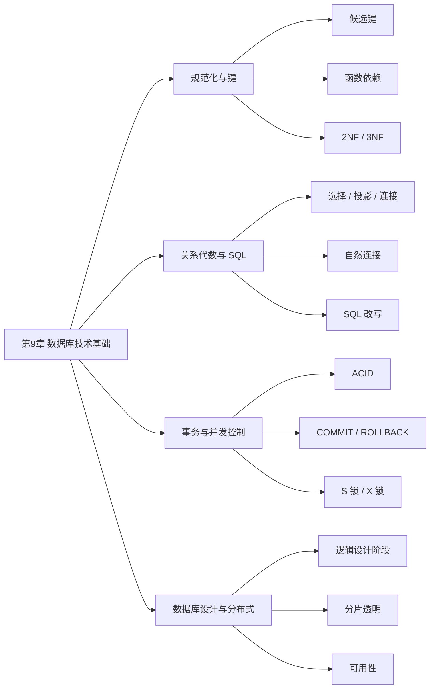

# 第9章 数据库技术基础

## 0. 本课说明

- 本课对应教材第 `9` 章：`数据库技术基础`。
- 本课按仓库当前规则重建，不默认你看过教材，也不要求你先补教材。
- 本课使用的主证据是：
  - 教材目录固化文档确认的章节边界：`9.1` 到 `9.6`
  - 本地真题索引与本地 Markdown 真题仓
  - `2016-2023` 年本地上午选择题中可直接检索到的数据库相关题
- 当前环境下，本地 PDF 正文文本层无法稳定抽取，因此本课的详细讲解以“教材章节框架 + 本地真题高频考法”重建；这一点在证据边界上是明示的，不伪装成逐页照抄教材。

## 1. 章节定位

### 1.1 教材章节范围

- `9.1` 基本概念
- `9.2` 数据模型
- `9.3` 关系代数
- `9.4` 关系数据库 SQL 语言简介
- `9.5` 关系数据库的规范化
- `9.6` 数据库的控制功能

### 1.2 这一章在考试里的真实作用

这章不是“背定义”就能过的章节，而是上午题里一组非常稳定的得分模块。它常见的四种出题方式是：

1. 给一组函数依赖，让你判断候选键、主属性、冗余依赖、最高范式。
2. 给关系代数表达式，让你判断自然连接后的列数，或者把它改写成 SQL。
3. 给事务、锁、`COMMIT`、`ROLLBACK`、并发场景，让你判断 ACID 或封锁兼容性。
4. 给分布式数据库或数据库设计场景，让你判断逻辑设计阶段、分片透明、可用性等概念。

结论先说：第9章最容易丢分的原因，不是知识点太多，而是每个点都“看着像会，真做题就混”。

## 2. Mermaid 总览



## 3. 本地题池结论

### 3.1 本轮实际检查到的本地题池

- 范围：`2016-2023` 年本地上午选择题
- 方式：按题干关键词检索数据库相关客观题
- 实际命中的候选题：`48` 道

### 3.2 按“每题只归一个主知识点”后的权值

1. 规范化与键：`20/48`，约 `41.7%`
2. 关系代数与 SQL：`14/48`，约 `29.2%`
3. 数据库设计与分布式：`9/48`，约 `18.8%`
4. 事务与并发控制：`5/48`，约 `10.4%`

### 3.3 这组权值意味着什么

- 先学“规范化与键”，因为这是这章最重的稳定分。
- 再学“关系代数与 SQL”，因为它既单独考，也经常和数据库设计题混考。
- “事务与并发控制”题量没前两块高，但属于该拿的分，不能因为少就放弃。
- “数据库设计与分布式”是很多人误判的区域，尤其容易把“逻辑设计”“分片透明”“位置透明”“可用性”混成一锅。

## 4. 学习目标

学完本课，你至少要能独立做到下面四件事：

1. 看到函数依赖题，能按步骤判断候选键、主属性、冗余依赖和最高范式。
2. 看到 `R⋈S`、`R×S`、`σ`、`π`，能判断结果列和改写 SQL。
3. 看到事务与锁题，能快速区分 `COMMIT`、`ROLLBACK`、`S 锁`、`X 锁`、`ACID`。
4. 看到数据库设计和分布式概念题，能区分“逻辑设计阶段、分片透明、可用性”。

## 5. 前置知识

你不需要先学完数据库教材，但要接受下面三个最小前提：

1. 一张表可以理解为“按列定义、按行存记录”的结构。
2. “主键”大意就是“能唯一确定一行”的列或列组合。
3. SQL 大致是“用来查和改表”的语言。

如果这三个前提你也不熟，本课里我会就地解释，不要求你回去翻书。

## 6. 主体讲解

## 一、规范化与键（权值：20/48，约 41.7%）

### 6.1 这块到底在讲什么

这一块在回答四个问题：

1. 什么属性组合能唯一确定一条记录？
2. 哪些依赖是真的必要，哪些是冗余的？
3. 一张表有没有“部分依赖”“传递依赖”这种结构问题？
4. 这张表最高能达到几范式？

数据库题里，很多题面看着花，其实内核只有一句话：  
“你能不能顺着函数依赖，把表的结构看明白？”

### 6.2 关键术语先讲人话

`函数依赖`

- 记作 `X → Y`
- 意思是：只要 `X` 的值确定了，`Y` 的值也就跟着确定
- 你可以把它理解成“X 决定 Y”

`超键`

- 只要能唯一标识一行记录，就是超键
- 可能带了多余属性

`候选键`

- 能唯一标识一行
- 并且已经尽可能精简，去掉任何一个属性都不行

`主键`

- 多个候选键里，实际选中的那一个

`主属性`

- 出现在某个候选键中的属性

`非主属性`

- 不出现在任何候选键中的属性

`部分依赖`

- 一个非主属性只依赖联合键的一部分

`传递依赖`

- 键先决定了中间属性，中间属性再决定别的非主属性

### 6.3 为什么考试喜欢考它

因为这类题能同时考你：

- 概念是否真的懂
- 推理是否有步骤
- 是否会把“背定义”落到“做结构判断”

### 6.4 新手最稳的解题顺序

1. 先找“入度为 0”的属性。
   - 也就是没有出现在箭头右边的属性。
   - 这类属性通常必须在候选键里。
2. 试着求属性闭包。
   - 从某个属性组出发，看能不能推出全体属性。
3. 找候选键后，再区分主属性和非主属性。
4. 再看有没有：
   - 非主属性对联合键的部分依赖
   - 非主属性对键的传递依赖
5. 最后判断范式。

### 6.5 范式只记这条最够用的判断线

- `1NF`：字段值不可再分
- `2NF`：在 `1NF` 基础上，非主属性完全依赖候选键，不允许“只依赖联合键的一部分”
- `3NF`：在 `2NF` 基础上，不允许非主属性传递依赖候选键

考试中最常见的不是让你证明到 `BCNF`，而是：

- 这题最多到 `2NF` 还是 `3NF`
- 哪个依赖是冗余
- 哪些属性一定出现在候选键中

### 6.6 代表题 1

来源：`2016下半年选择题` 第 `44` 题

题干：

给定关系模式 `R（U，F）`，其中：`U` 为关系模式 `R` 中的属性集，`F` 是 `U` 上的一组函数依赖。假设  
`U={A1，A2，A3，A4}`，  
`F={A1→A2，A1A2→A3，A1→A4，A2→A4}`，  
那么关系 `R` 的主键应为（A/C）。函数依赖集 `F` 中的（ ）是冗余的。

问题 1

- A. `A1`
- B. `A1A2`
- C. `A1A3`
- D. `A1A2A3`

问题 2

- A. `A1→A2`
- B. `A1A2→A3`
- C. `A1→A4`
- D. `A2→A4`

正确答案：`A、C`

解析：

1. 先看谁像候选键。`A1` 没出现在右边，优先检查。
2. 用 `A1` 推导：
   - `A1→A2`
   - 已知 `A1A2→A3`，所以可推出 `A3`
   - `A1→A4`
3. 所以 `A1` 可以推出全部属性，是候选键，也是这里的主键。
4. 再看冗余依赖：
   - 已有 `A1→A2`
   - 又有 `A2→A4`
   - 由传递性可推出 `A1→A4`
5. 既然 `A1→A4` 能由其他依赖推出，它就是冗余依赖。

这题的核心不是“记结论”，而是你必须会走这一遍推理链。

### 6.7 代表题 2

来源：`2018上半年选择题` 第 `38` 题

题干：

给定关系模式 `R < U，F >`，其中 `U` 为属性集，`F` 是 `U` 上的一组函数依赖，那么 Armstrong 公理系统的伪传递律是指（B）。

- A. 若 `X→Y`，`X→Z`，则 `X→YZ` 为 `F` 所蕴涵
- B. 若 `X→Y`，`WY→Z`，则 `XW→Z` 为 `F` 所蕴涵
- C. 若 `X→Y`，`Y→Z` 为 `F` 所蕴涵，则 `X→Z` 为 `F` 所蕴涵
- D. 若 `X→Y` 为 `F` 所蕴涵，且 `Z⊆U`，则 `XZ→YZ` 为 `F` 所蕴涵

正确答案：`B`

解析：

- 这题不是硬背名词，而是让你把几条常见推理规则分清楚。
- `C` 是普通传递律。
- `D` 是增广思想。
- `A` 是合并规则。
- 只有 `B` 对应伪传递律。

新手建议：

- 不要一上来背“伪传递”三个字。
- 先记住结构长什么样：`X→Y`，`WY→Z`，所以 `XW→Z`。

### 6.7.1 先把题里这些字母是什么意思讲清楚

在函数依赖题里，`X`、`Y`、`Z`、`W` 不是具体某一列，而是“属性集”的占位符。

例如一张学生选课表有这些属性：

- `学号`
- `姓名`
- `课程号`
- `课程名`
- `教师`

那么：

- `X` 可以代表 `{学号}`
- `Y` 可以代表 `{姓名}`
- `W` 可以代表 `{课程号}`
- `Z` 可以代表 `{教师}`

所以 `X→Y` 的意思不是“字母 X 指向字母 Y”，而是：

> 只要属性集 `X` 的值确定，属性集 `Y` 的值就被确定。

比如：

- `{学号}→{姓名}`：知道学号，就能确定学生姓名。
- `{课程号}→{课程名, 教师}`：知道课程号，就能确定课程名和任课教师。
- `{学号, 课程号}→{成绩}`：单独知道学号不够，单独知道课程号也不够，必须两者合起来才能确定成绩。

这就是后面所有定律的共同基础。

### 6.7.2 Armstrong 三条基本公理

Armstrong 公理是函数依赖推理的基础。你可以把它理解为“从已有依赖推出新依赖的合法规则”。考试不要求你证明它，但要求你能识别它。

#### 1. 自反律

形式：

`若 Y⊆X，则 X→Y`

人话：

如果 `Y` 本来就是 `X` 的一部分，那么知道 `X`，当然知道 `Y`。

示例：

- 已知属性集 `{学号, 姓名}`
- 那么 `{学号, 姓名}→{学号}` 成立
- `{学号, 姓名}→{姓名}` 也成立

为什么？

因为 `{学号}` 和 `{姓名}` 都已经包含在 `{学号, 姓名}` 里面。你知道一整包东西，当然知道包里的某一项。

考试识别：

- 看到“右边属性是左边属性集的子集”，通常就是自反律。

#### 2. 增广律

形式：

`若 X→Y，则 XZ→YZ`

人话：

如果 `X` 能决定 `Y`，那么在左右两边同时加上一组相同属性 `Z`，依赖仍然成立。

示例：

- 已知 `{学号}→{姓名}`
- 两边同时加 `{课程号}`
- 得到 `{学号, 课程号}→{姓名, 课程号}`

为什么？

因为 `{学号}` 已经能决定 `{姓名}`，多带一个 `{课程号}` 不会破坏这个事实。左右两边都带上同一个额外信息，推理仍然安全。

考试识别：

- 看到题目说“若 `X→Y`，且 `Z⊆U`，则 `XZ→YZ`”，这就是增广律。
- 代表题 2 的 `D` 选项就是这个方向，所以 `D` 不是伪传递律。

#### 3. 传递律

形式：

`若 X→Y，且 Y→Z，则 X→Z`

人话：

如果 `X` 能决定 `Y`，而 `Y` 又能决定 `Z`，那么 `X` 就能间接决定 `Z`。

示例：

- `{学号}→{学院号}`
- `{学院号}→{学院名}`
- 所以 `{学号}→{学院名}`

为什么？

知道学号就知道学院号，知道学院号就知道学院名，所以学号可以一路推出学院名。

考试识别：

- 看到“中间属性串起来”，通常是传递律。
- 范式判断里，传递依赖就是由这条思想来的。例如 `{员工号}→{岗位}`，`{岗位}→{基本工资}`，于是 `{员工号}→{基本工资}`，这就是非主属性通过中间属性传递依赖于键。

### 6.7.3 三条常用推论

下面三条不是最原始的公理，但能由三条基本公理推出。考试常把它们和基本公理混在一起考。

#### 4. 合并规则

形式：

`若 X→Y，且 X→Z，则 X→YZ`

人话：

如果同一个 `X` 能分别决定 `Y` 和 `Z`，那么 `X` 就能同时决定 `Y` 和 `Z`。

示例：

- `{课程号}→{课程名}`
- `{课程号}→{教师}`
- 所以 `{课程号}→{课程名, 教师}`

为什么？

同一个课程号既能查到课程名，也能查到教师，那当然能同时查到二者。

考试识别：

- 看到“左边相同，右边合起来”，就是合并规则。
- 代表题 2 的 `A` 选项就是合并规则，所以 `A` 不是伪传递律。

#### 5. 分解规则

形式：

`若 X→YZ，则 X→Y，且 X→Z`

人话：

如果 `X` 能决定一组属性，那么 `X` 也能决定这组属性中的每一个部分。

示例：

- `{课程号}→{课程名, 教师}`
- 所以 `{课程号}→{课程名}`
- 也可以推出 `{课程号}→{教师}`

为什么？

既然课程号能确定“课程名和教师”这一整组信息，当然也能单独确定其中的课程名或教师。

考试识别：

- 看到“右边一大组属性拆开”，就是分解规则。
- 做候选键闭包时经常默认用它。例如 `A→BC` 可以拆成 `A→B` 和 `A→C`。

#### 6. 伪传递规则

形式：

`若 X→Y，且 WY→Z，则 XW→Z`

人话：

如果 `X` 能决定 `Y`，而 `W` 加上 `Y` 又能决定 `Z`，那么把 `Y` 换成能推出它的 `X`，就得到 `XW` 能决定 `Z`。

示例：

- `{学号}→{班级}`
- `{班级, 课程号}→{上课教室}`
- 所以 `{学号, 课程号}→{上课教室}`

为什么？

知道学号，就能知道班级；再加上课程号，就相当于知道了“班级 + 课程号”；而“班级 + 课程号”能决定上课教室，所以“学号 + 课程号”也能决定上课教室。

把它对照形式看：

- `X = {学号}`
- `Y = {班级}`
- `W = {课程号}`
- `Z = {上课教室}`
- `X→Y` 对应 `{学号}→{班级}`
- `WY→Z` 对应 `{课程号, 班级}→{上课教室}`
- 结论 `XW→Z` 对应 `{学号, 课程号}→{上课教室}`

考试识别：

- 伪传递最显著的形状是：第二个依赖左边含有 `Y`，而第一个依赖正好能推出 `Y`。
- 最后结论不是 `X→Z`，而是 `XW→Z`，因为第二步还需要额外的 `W`。
- 代表题 2 的 `B` 选项正是这个形状，所以正确答案是 `B`。

### 6.7.4 把六条规则放在一张速记表里

| 规则 | 形式 | 人话判断 |
| --- | --- | --- |
| 自反律 | `Y⊆X，则 X→Y` | 知道一整包，就知道包里的一部分 |
| 增广律 | `X→Y，则 XZ→YZ` | 依赖两边同时加同一组属性仍成立 |
| 传递律 | `X→Y，Y→Z，则 X→Z` | 中间属性能串起来 |
| 合并规则 | `X→Y，X→Z，则 X→YZ` | 左边相同，右边可以合并 |
| 分解规则 | `X→YZ，则 X→Y，X→Z` | 右边一组属性可以拆开 |
| 伪传递规则 | `X→Y，WY→Z，则 XW→Z` | 用能推出 `Y` 的 `X` 替换第二步里的 `Y` |

### 6.7.5 做这类选择题的稳定方法

1. 先看题目问的是哪条规则，不要先看选项里的字母长得复杂不复杂。
2. 把每个选项改写成人话：
   - 右边是左边的一部分：自反律
   - 两边同时加东西：增广律
   - `X→Y→Z`：传递律
   - 同左边合右边：合并规则
   - 大右边拆小右边：分解规则
   - `X→Y`，再用 `W+Y` 推 `Z`：伪传递
3. 伪传递一定要检查有没有额外的 `W`。如果没有额外的 `W`，大概率只是普通传递律。

### 6.8 这一块最容易错的点

1. 把“候选键”当成“单字段主键”。
2. 只会背 `2NF/3NF` 定义，不会用“部分依赖/传递依赖”去判题。
3. 看见题目有很多属性就慌，不会先找入度为 `0` 的属性。
4. 把伪传递律误看成普通传递律，忽略第二个依赖里额外需要的 `W`。
5. 把合并规则和分解规则只当成“格式变化”，没有意识到它们会直接影响候选键闭包推导。

### 6.9 知识点补强：候选键、主属性、范式

从近年真题看，“函数依赖 + 候选键 + 范式”经常合在一道题里考。课案前面已经讲了基本概念，但还需要把三件事压实：

1. 候选键必须靠闭包验证。
2. 主属性要从全部候选键合并得到。
3. 存在传递依赖通常说明不能达到 `3NF`，不能反向理解。

#### 6.9.1 先看候选键：闭包要一步步写

判断一组属性是不是候选键，要问两个问题：

1. 它的闭包能不能推出全集 `U`。
2. 它是不是最小的，去掉任意一个属性后还是否能推出全集。

示例：

```text
U={A1,A2,A3,A4,A5,A6}
F={
  A1→A3,
  A1A2→A4,
  A5A6→A1,
  A3A5→A6,
  A2A5→A6
}
```

检查 `A2A5`：

```text
(A2A5)+
= {A2,A5}
```

```text
用 A2A5→A6：
{A2,A5,A6}
```

```text
用 A5A6→A1：
{A1,A2,A5,A6}
```

```text
用 A1→A3：
{A1,A2,A3,A5,A6}
```

```text
用 A1A2→A4：
{A1,A2,A3,A4,A5,A6}
```

已经覆盖全集 `U`，所以 `A2A5` 是候选键。

这类题的关键是：不要看哪个选项“长得像主键”，而是看它的闭包能不能推出全集。

#### 6.9.2 传递依赖不能推出 3NF，反而通常卡住 3NF

如果题目里能形成这样的链：

```text
候选键 → 中间非主属性 → 另一个非主属性
```

这就是传递依赖。传递依赖通常说明关系模式不能达到 `3NF`。

所以不能写：

```text
存在传递依赖，故为 3NF
```

这句话方向反了。

更稳的判断是：

```text
没有部分依赖，但存在传递依赖 → 最高通常到 2NF
```

所以看到“存在传递依赖，故达到 3NF”这种说法要警惕。传递依赖不是达到 `3NF` 的理由，而是阻止达到 `3NF` 的常见原因。

#### 6.9.3 主属性和非主属性要从“全部候选键”合并看

如果一个关系模式有多个候选键，主属性不是只看某一个候选键，而是看所有候选键中出现过的属性。

示例：

`U={A1,A2,A3,A4}`

`F={A1A3→A2，A1A2→A3，A2→A4}`

先找候选键：

`A1A2` 的闭包：

```text
A1A2 → A3
A2 → A4
所以 (A1A2)+ = {A1,A2,A3,A4}
```

`A1A3` 的闭包：

```text
A1A3 → A2
A2 → A4
所以 (A1A3)+ = {A1,A2,A3,A4}
```

所以候选键有两个：

```text
A1A2
A1A3
```

主属性不是只看某一个候选键，而是看所有候选键中出现过的属性。

因此主属性是：

```text
A1、A2、A3
```

非主属性是：

```text
A4
```

结论：

```text
主属性 = 出现在任意候选键中的属性
非主属性 = 不出现在任何候选键中的属性
```

#### 6.9.4 传递依赖的典型短链

示例：

`U={A,B,C,D}`

`F={A→BC，AC→D，B→D}`

先分解 `A→BC`：

```text
A→B
A→C
```

再结合 `B→D`：

```text
A→B
B→D
所以 A→D
```

这就是传递依赖。

同时：

```text
A+ = {A,B,C,D}
```

所以候选键是 `A`。

这类题的判断重点是：

```text
A 是候选键
A→B，B→D，因此 A→D 是传递依赖
```

#### 6.9.5 为什么传递依赖会带来冗余和异常

范式题不只是问“达到几范式”，还经常问：

```text
是否存在冗余、修改异常、插入异常、删除异常
```

这几个词都和表结构设计是否合理有关。

`冗余`

- 意思是同一个事实被重复存了很多次。
- 如果 `岗位→薪资`，那么“讲师对应 8000 元”这个事实不应该在每个讲师记录里重复出现。
- 重复越多，后续修改越容易漏改。

`修改异常`

- 意思是同一个事实重复出现在多行里，修改时必须改很多处；只要漏改一处，数据就前后矛盾。
- 如果 `岗位→薪资`，表里有很多“讲师→8000 元”的教师记录。当讲师薪资调整为 `8500` 元时，所有讲师记录都要改。
- 如果有的行改成 `8500`，有的行仍是 `8000`，同一个岗位就对应了两个薪资，数据库内部出现不一致。

`插入异常`

- 意思是想插入一个独立事实，但因为表结构绑在一起，插不进去。
- 如果岗位薪资标准也存在教师表里，那么想先登记“助教→6000 元”，但还没有任何助教教师时，就没有教师号可填，无法单独插入岗位薪资标准。

`删除异常`

- 意思是删除一条记录时，把本来还应该保留的另一个事实也删掉了。
- 如果全校只有一个教授，删除这个教授的教师记录后，“教授→16000 元”这个岗位薪资标准也跟着丢了。

这类问题通常来自传递依赖。

示例：

```text
教师号 → 岗位
岗位 → 薪资
```

于是：

```text
教师号 → 岗位 → 薪资
```

`薪资` 不是直接由教师号这个实体身份本身决定，而是通过 `岗位` 间接决定。把教师个人信息和岗位薪资标准混在同一张表里，就会导致：

1. 同一岗位薪资反复出现，形成冗余。
2. 岗位薪资调整时必须修改多行，漏改会形成修改异常。
3. 新岗位还没有教师时，岗位薪资标准插不进去，形成插入异常。
4. 删除最后一个某岗位教师时，岗位薪资标准也被删掉，形成删除异常。

解决思路是拆表：

```text
教师(教师号, 姓名, 部门号, 岗位, 联系地址)
岗位薪资(岗位, 薪资)
```

拆开后：

- 教师表只管教师是谁、属于什么岗位。
- 岗位薪资表只管岗位对应多少薪资。
- `岗位→薪资` 不再混在教师表里，冗余、修改异常、插入异常、删除异常就会减少。

#### 6.9.6 本组快判口诀

1. 候选键：算闭包，能推出全集才算。
2. 主属性：出现在任意候选键里的属性都是主属性。
3. 非主属性：不在任何候选键里的属性。
4. 2NF：非主属性不能只依赖联合键的一部分。
5. 3NF：不能有非主属性对候选键的传递依赖。
6. 看到“存在传递依赖，故为 3NF”要警惕，通常是错误方向。
7. 看到“键→中间属性→非主属性”，要联想到冗余、修改异常、插入异常、删除异常。

## 二、关系代数与 SQL（权值：14/48，约 29.2%）

### 7.1 这块到底在讲什么

这一块在讲两件事：

1. 用关系代数描述“怎么查”
2. 把关系代数翻译成 SQL，或者反过来

你可以把关系代数理解成“数据库查询的数学骨架”，把 SQL 理解成“你真正写给数据库执行的语言”。

### 7.2 最常考的三个动作

`选择 σ`

- 筛行
- 相当于 SQL 里的 `WHERE`

`投影 π`

- 取列
- 相当于 SQL 里 `SELECT` 选择哪些列

`连接 ⋈`

- 把两个表按共同字段拼起来

### 7.3 什么是自然连接

自然连接是考试高频点。

它有两个关键特征：

1. 按同名属性、且值相等去连接
2. 结果里重复列只保留一份

所以自然连接后结果列数不是简单相加，而是：

`左表列数 + 右表列数 - 重复属性列数`

### 7.4 SQL 里最容易混的两个词

`WHERE`

- 对原始记录过滤
- 发生在分组之前

`HAVING`

- 对分组后的结果再过滤
- 发生在 `GROUP BY` 之后

一句话快记：

- 先 `WHERE`
- 再 `GROUP BY`
- 后 `HAVING`

### 7.5 代表题 1

来源：`2016下半年选择题` 第 `45` 题

题干：

给定关系 `R（A，B，C，D）` 和关系 `S（A，C，E，F）`，对其进行自然连接运算 `R⋈S` 后的属性列为（C/B）个；与 `σR.B > S.E（R⋈S）` 等价的关系代数表达式为（ ）。

问题 1

- A. `4`
- B. `5`
- C. `6`
- D. `8`

问题 2

- A. `σ2 > 7（R×S）`
- B. `π1,2,3,4,7,8（σ1=5^2 > 7^3=6（R×S））`
- C. `σ2 > '7'（R×S）`
- D. `π1,2,3,4,7,8（σ1=5^2 > '7'^3=6（R×S））`

正确答案：`C、B`

解析：

### 7.5.1 先把符号翻译成人话

这题里出现了几个关系代数符号，先不要急着算。

`R（A，B，C，D）`

- 关系 `R` 可以先理解成一张表。
- 这张表有 `4` 列，列名依次是 `A、B、C、D`。

`S（A，C，E，F）`

- 关系 `S` 也可以先理解成一张表。
- 这张表也有 `4` 列，列名依次是 `A、C、E、F`。

`R⋈S`

- `⋈` 是自然连接。
- 它会自动找两个关系里的同名属性。
- 本题同名属性是 `A` 和 `C`。
- 所以自然连接隐含两个条件：
  - `R.A = S.A`
  - `R.C = S.C`
- 自然连接结果里，同名列只保留一份。

`R×S`

- `×` 是笛卡尔积。
- 它先不管两个表有没有关系，只是把 `R` 的每一行和 `S` 的每一行硬拼起来。
- 拼完以后，列会全部保留，不会自动去掉重复列。

`σ`

- 读作“选择”。
- 作用是筛行。
- 括号里的条件就是筛选条件。
- 例如 `σ2>7（R×S）` 的意思是：在 `R×S` 的结果里，筛出“第 `2` 列大于第 `7` 列”的行。

`π`

- 读作“投影”。
- 作用是取列。
- 例如 `π1,2,3（某关系）` 的意思是：只保留第 `1、2、3` 列。

`^`

- 本题选项里的 `^` 表示“并且”，相当于逻辑与 `AND`。
- 所以 `σ1=5^2>7^3=6` 要读成：
  - 第 `1` 列等于第 `5` 列
  - 并且第 `2` 列大于第 `7` 列
  - 并且第 `3` 列等于第 `6` 列

### 7.5.2 先做问题 1：自然连接后有几列

`R` 的列是：

| R 的列序号 | 列名 |
| --- | --- |
| 1 | `A` |
| 2 | `B` |
| 3 | `C` |
| 4 | `D` |

`S` 的列是：

| S 的列序号 | 列名 |
| --- | --- |
| 1 | `A` |
| 2 | `C` |
| 3 | `E` |
| 4 | `F` |

两个关系都有的同名列是：

- `A`
- `C`

自然连接 `R⋈S` 会把同名列按相等条件连接，并且结果里重复列只保留一份。

所以列数是：

`R 的 4 列 + S 的 4 列 - 重复的 2 列 = 6 列`

因此问题 1 选 `C`。

这一空的关键不是记公式，而是要看出：

- `A` 重复一次
- `C` 重复一次
- 两个重复列都要减掉

### 7.5.3 再做问题 2：把 `R⋈S` 改写成 `R×S`

问题 2 的原表达式是：

`σR.B > S.E（R⋈S）`

先翻译成人话：

1. 先做 `R⋈S`，也就是自然连接。
2. 再在自然连接结果里筛选满足 `R.B > S.E` 的行。

但是选项都写成了 `R×S` 的形式，所以我们必须把自然连接 `R⋈S` 改写成“笛卡尔积 + 筛选条件”。

自然连接 `R⋈S` 等价于：

`R×S` 之后，再筛选同名列相等。

本题同名列是 `A` 和 `C`，所以自然连接隐含条件是：

- `R.A = S.A`
- `R.C = S.C`

再加上题目本身的条件：

- `R.B > S.E`

所以完整筛选条件应该是：

`R.A = S.A AND R.B > S.E AND R.C = S.C`

这就是选项里 `σ` 后面要表达的内容。

### 7.5.4 为什么要先给 `R×S` 编号

选项里没有直接写 `R.A`、`S.A`，而是写 `1=5`、`2>7`、`3=6`。

这是因为在 `R×S` 里，通常按“先放 `R` 的所有列，再放 `S` 的所有列”编号。

本题 `R×S` 的列顺序如下：

| `R×S` 列序号 | 实际列 |
| --- | --- |
| 1 | `R.A` |
| 2 | `R.B` |
| 3 | `R.C` |
| 4 | `R.D` |
| 5 | `S.A` |
| 6 | `S.C` |
| 7 | `S.E` |
| 8 | `S.F` |

现在把三个条件翻成序号：

`R.A = S.A`

- `R.A` 是第 `1` 列
- `S.A` 是第 `5` 列
- 所以写成 `1=5`

`R.B > S.E`

- `R.B` 是第 `2` 列
- `S.E` 是第 `7` 列
- 所以写成 `2>7`

`R.C = S.C`

- `R.C` 是第 `3` 列
- `S.C` 是第 `6` 列
- 所以写成 `3=6`

因此完整的选择条件是：

`σ1=5^2>7^3=6（R×S）`

也就是：

`在 R×S 中筛出 1=5 并且 2>7 并且 3=6 的那些行`

### 7.5.5 为什么还要有 `π1,2,3,4,7,8`

到这里还没结束。

因为 `R×S` 有 `8` 列：

`R.A，R.B，R.C，R.D，S.A，S.C，S.E，S.F`

但自然连接 `R⋈S` 的结果不能保留重复的 `S.A` 和 `S.C`。

自然连接结果应该保留：

- `R.A`
- `R.B`
- `R.C`
- `R.D`
- `S.E`
- `S.F`

对应 `R×S` 的列序号就是：

- `1`
- `2`
- `3`
- `4`
- `7`
- `8`

所以要再用投影：

`π1,2,3,4,7,8`

它的意思是：

`只保留第 1、2、3、4、7、8 列，把重复的第 5 列 S.A 和第 6 列 S.C 去掉`

所以完整表达式是：

`π1,2,3,4,7,8（σ1=5^2>7^3=6（R×S））`

对应选项 `B`。

### 7.5.6 四个选项逐个排除

`A. σ2 > 7（R×S）`

- 它只表达了 `R.B > S.E`。
- 它没有表达自然连接隐含的 `R.A=S.A` 和 `R.C=S.C`。
- 它也没有用 `π` 去掉重复列。
- 所以 `A` 不对。

`B. π1,2,3,4,7,8（σ1=5^2 > 7^3=6（R×S））`

- `1=5` 表示 `R.A=S.A`。
- `2>7` 表示 `R.B>S.E`。
- `3=6` 表示 `R.C=S.C`。
- `π1,2,3,4,7,8` 表示去掉重复的 `S.A` 和 `S.C`。
- 所以 `B` 正确。

`C. σ2 > '7'（R×S）`

- `'7'` 是字符常量，不是第 `7` 列。
- 题目要比较的是 `R.B` 和 `S.E`，也就是第 `2` 列和第 `7` 列。
- 所以 `C` 不对。

`D. π1,2,3,4,7,8（σ1=5^2 > '7'^3=6（R×S））`

- 它虽然有投影，也有 `1=5` 和 `3=6`。
- 但中间写成了 `2>'7'`，仍然是拿第 `2` 列和字符 `'7'` 比较。
- 题目要求的是 `2>7`，也就是第 `2` 列大于第 `7` 列。
- 所以 `D` 不对。

### 7.5.7 这类题的固定转换模板

看到“把自然连接表达式改写成笛卡尔积表达式”时，按这 `5` 步走：

1. 写出 `R×S` 的列顺序。
2. 找两个关系的同名列。
3. 把同名列变成相等条件。
4. 把题目额外给出的筛选条件也翻成列序号。
5. 用 `π` 去掉自然连接结果中不该保留的重复列。

这题最核心的一句话是：

`R⋈S = 先 R×S，再 σ 同名列相等，最后 π 去掉重复列`

### 7.6 代表题 2

来源：`2019下半年选择题` 第 `37` 题

题干：

给定关系 `R（A，B，C，D）` 和 `S（B，C，E，F）` 与关系代数表达式  
`π1,5,7（σ2=5（R×S））` 等价的 SQL 语句如下：

`SELECT（B/A）`

`FROM R，S（ ）；`

问题 1

- A. `R.A，R.B，S.F`
- B. `R.A，S.B，S.E`
- C. `R.A，S.E，S.F`
- D. `R.A，S.B，S.F`

问题 2

- A. `WHERE R.B=S.B`
- B. `HAVING R.B=S.B`
- C. `WHERE R.B=S.E`
- D. `HAVING R.B=S.E`

正确答案：`B、A`

解析：

1. `R×S` 的列顺序是：
   - `R.A，R.B，R.C，R.D，S.B，S.C，S.E，S.F`
2. 所以 `π1,5,7` 取的是：
   - `R.A`
   - `S.B`
   - `S.E`
3. 条件 `σ2=5` 表示第 `2` 列等于第 `5` 列，也就是 `R.B=S.B`
4. 这里还没分组，所以必须写在 `WHERE`，不能写 `HAVING`

### 7.7 这一块最容易错的点

1. 自然连接后忘记去掉重复列。
2. 把 `WHERE` 和 `HAVING` 混用。
3. 看到 `σ` 和 `π` 就背不出含义，其实它们就是“筛行”和“取列”。

### 7.8 知识点补强：关系代数不能丢连接键

关系代数题不只是看最终输出哪些列，还要看中间连接需要哪些列。真题经常利用这一点设置干扰项：某个选项看起来取了有用信息，但提前把后续连接需要的键删掉了。

#### 7.8.1 自然连接改写仍然按五步走

自然连接改写为笛卡尔积表达式时，仍按五步走：

1. 写出 `R×S` 的列顺序。
2. 找两个关系的同名列。
3. 把同名列变成相等条件。
4. 把题目额外给出的筛选条件也翻成列序号。
5. 用 `π` 去掉自然连接结果中不该保留的重复列。

示例：

```text
R(A,B,C,D)
S(A,D,E,F)
```

同名属性是：

```text
A
D
```

所以自然连接后的列数是：

```text
4 + 4 - 2 = 6
```

若改写成 `R×S`，先编号：

| `R×S` 列号 | 实际属性 |
| --- | --- |
| 1 | `R.A` |
| 2 | `R.B` |
| 3 | `R.C` |
| 4 | `R.D` |
| 5 | `S.A` |
| 6 | `S.D` |
| 7 | `S.E` |
| 8 | `S.F` |

自然连接隐含条件：

```text
R.A=S.A → 1=5
R.D=S.D → 4=6
```

题目额外条件：

```text
R.B>S.F → 2>8
```

所以选择条件是：

```text
σ1=5∧2>8∧4=6(R×S)
```

自然连接结果还要去掉重复的 `S.A` 和 `S.D`，也就是去掉第 `5、6` 列，保留：

```text
1,2,3,4,7,8
```

因此完整表达式是：

```text
π1,2,3,4,7,8(σ1=5∧2>8∧4=6(R×S))
```

#### 7.8.2 查询表达式里，投影不能把连接键丢掉

查询型关系代数题常见结构是：

```text
先筛实体表 → 再投影需要字段 → 再与联系表连接
```

危险点在投影：不能只保留最终输出字段，还要保留后续连接需要的关键字。

示例关系：

```text
S(学号, 姓名, 学院名, 电话, 家庭住址)
C(课程号, 课程名, 选修课程号)
SC(学号, 课程号, 成绩)
```

查询目标是“张晋”选修了“市场营销”课程的：

```text
学号、学生名、学院名、成绩
```

第一步筛学生：

`S` 的第 `2` 列是姓名，所以：

```text
σ2='张晋'(S)
```

字符串必须加引号，所以 `σ2=张晋(S)` 这种写法不严谨。

第二步筛课程：

`C` 的列是：

| 列号 | 属性 |
| --- | --- |
| 1 | 课程号 |
| 2 | 课程名 |
| 3 | 选修课程号 |

筛课程名为“市场营销”：

```text
σ2='市场营销'(C)
```

但筛完后不能只保留“课程名、选修课程号”。因为后面要和 `SC(学号,课程号,成绩)` 连接，必须保留 `课程号`。

因此应该投影：

```text
π1,2(σ2='市场营销'(C))
```

而不是：

```text
π2,3(σ2='市场营销'(C))
```

后者把 `课程号` 丢掉了，后续无法可靠地和 `SC` 的课程号连接。

#### 7.8.3 本组快判口诀

1. `σ` 是筛行，先问“筛哪张表、按哪一列筛”。
2. `π` 是取列，不能只看最终要输出什么，还要保留后续连接需要的列。
3. 与 `SC`、`EP` 这类联系表连接时，通常必须保留两端实体的主键。
4. 字符串常量要加引号，例如 `'张晋'`、`'市场营销'`。

## 三、数据库设计与分布式（权值：9/48，约 18.8%）

### 8.1 这块到底在讲什么

这一块讲的是：

1. 数据库设计在开发流程里的位置
2. `E-R` 模型怎么往关系模型转
3. 分布式数据库对用户“透明”到什么程度
4. 系统在多副本场景下如何保证可用

### 8.2 先记一个最重要的流程点

关系规范化发生在数据库设计的 `逻辑设计阶段`。

为什么不是需求分析阶段？

- 需求分析讲“业务要什么”
- 概念设计讲“实体、联系怎么抽象”
- 逻辑设计才真正落到“关系模式怎么拆、范式怎么判”

### 8.3 分布式数据库最爱考的两个词

`分片透明`

- 用户不需要知道一张逻辑表具体是怎么切成多块存储的

`可用性`

- 某个场地故障时，系统仍能借助其他场地副本继续工作，不至于整体瘫痪

### 8.4 代表题 1

来源：`2018下半年选择题` 第 `41` 题

题干：

在分布式数据库中，（C）是指用户或应用程序不需要知道逻辑上访问的表具体如何分块存储。

- A. 逻辑透明
- B. 位置透明
- C. 分片透明
- D. 复制透明

正确答案：`C`

解析：

- 题干强调的是“如何分块存储”
- 这对应的是“怎么分片”
- 所以应该选 `分片透明`

区分方法：

- 不知道存在哪个站点：位置透明
- 不知道有没有副本：复制透明
- 不知道怎么切分：分片透明

### 8.5 代表题 2

来源：`2019上半年选择题` 第 `49` 题

题干：

当某一场地故障时，系统可以使用其他场地上的副本而不至于使整个系统瘫痪。这称为分布式数据库的（C）。

- A. 共享性
- B. 自治性
- C. 可用性
- D. 分布性

正确答案：`C`

解析：

- 题干核心是“一个点挂了，系统还能继续跑”
- 这考的不是“数据放在多个点上”本身
- 而是“系统在故障下还能提供服务”的能力
- 所以选 `可用性`

### 8.6 这一块最容易错的点

1. 把“逻辑设计阶段”和“概念设计阶段”混掉。
2. 把“分片透明、位置透明、复制透明”混掉。
3. 看到“多副本”就只想到复制，不去看题干到底问的是“透明性”还是“可用性”。

### 8.7 知识点补强：E-R 合并冲突与多对多转换

数据库设计题不是算闭包，而是考“概念结构设计到逻辑结构设计”的转换规则。真题里常见两个薄弱点：分 `E-R` 图合并冲突、多对多联系转换。

#### 8.7.1 属性冲突、命名冲突、结构冲突怎么分

先看三类冲突：

| 类型 | 判断方式 | 例子 |
| --- | --- | --- |
| 属性冲突 | 同一属性的类型、单位、取值范围不同 | 一个系统里工资用元，另一个系统里工资用万元 |
| 命名冲突 | 同名异义或异名同义 | 一个叫职工号，一个叫员工编号，其实是同一含义 |
| 结构冲突 | 同一对象在不同局部模型中结构不同 | 一个模型建为职工实体，另一个模型单独建教师实体 |

示例：

人力部门定义：

```text
职工(职工号, 姓名, 性别, 出生日期)
```

教学部门定义：

```text
教师(教师号, 姓名, 职称)
```

这不是单个属性的类型或单位不同，而是同一现实对象在不同分 `E-R` 图中被建成了不同结构：一个叫“职工”，一个叫“教师”，属性集合也不同。

所以这是：

```text
结构冲突
```

如果教师是职工的一类，合并时更合适的处理是：

```text
在职工实体中加入职称属性，删除教师实体
```

也就是把教师的特有属性并入统一的职工结构。

#### 8.7.2 多对多联系必须独立成关系模式

规则是：

```text
多对多联系 → 单独转换成一个关系模式
```

这个独立关系模式一般包含：

```text
E1 的关键字
E2 的关键字
联系 R 自身的属性
```

但它的关键字通常由：

```text
E1 的关键字 + E2 的关键字
```

组成。

例子：

```text
学生(学号, 姓名)
课程(课程号, 课程名)
选课(学号, 课程号, 成绩)
```

`学生` 和 `课程` 是多对多。转换出的 `选课` 是独立关系模式。

其中：

- `学号` 来自学生实体关键字
- `课程号` 来自课程实体关键字
- `成绩` 是联系自身属性

关键字是：

```text
学号 + 课程号
```

不是：

```text
学号 + 课程号 + 成绩
```

因为同一个学生选同一门课一般只有一条选课记录，成绩只是这条联系上的描述属性。

#### 8.7.3 本组快判口诀

1. 单个属性定义不一致，多半是属性冲突。
2. 名字不一致或同名不同义，多半是命名冲突。
3. 同一对象在不同局部图中建模结构不同，多半是结构冲突。
4. 多对多联系一定独立成关系模式。
5. 多对多联系关系的关键字一般是两端实体关键字的组合。

## 四、事务与并发控制（权值：5/48，约 10.4%）

### 9.1 这块到底在讲什么

它在回答：

1. 一组操作如何“要么全成，要么全撤”
2. 多个事务同时操作数据时，怎么避免互相踩踏

虽然这一块题量不如前两块大，但全是稳定的送分题。

### 9.2 ACID 用人话记

`A` 原子性

- 要么都做，要么都不做

`C` 一致性

- 事务前后，数据库要从一个正确状态到另一个正确状态

`I` 隔离性

- 多个事务并发时，彼此的中间结果不应乱看乱碰

`D` 持久性

- 一旦提交成功，即使系统后面崩了，结果也不能丢

### 9.3 `COMMIT` 和 `ROLLBACK`

`COMMIT`

- 提交
- 修改正式生效

`ROLLBACK`

- 回滚
- 撤销尚未提交的修改

一句话：

- `COMMIT = 我确认生效`
- `ROLLBACK = 当作刚才没做`

### 9.4 锁只记两种就够

`S 锁` 共享锁 / 读锁

- 别人还能加 `S`
- 不能加 `X`

`X 锁` 排它锁 / 写锁

- 别人不能再加任何锁

### 9.5 代表题 1

来源：`2017上半年选择题` 第 `40` 题

题干：

若事务 `T1` 对数据 `D1` 加了共享锁，事务 `T2`、`T3` 分别对数据 `D2`、`D3` 加了排它锁，则事务 `T1` 对数据（D/C）；事务 `T2` 对数据（ ）。

问题 1

- A. `D2、D3` 加排它锁都成功
- B. `D2、D3` 加共享锁都成功
- C. `D2` 加共享锁成功，`D3` 加排它锁失败
- D. `D2、D3` 加排它锁和共享锁都失败

问题 2

- A. `D1、D3` 加共享锁都失败
- B. `D1、D3` 加共享锁都成功
- C. `D1` 加共享锁成功，`D3` 加排它锁失败
- D. `D1` 加排它锁成功，`D3` 加共享锁失败

正确答案：`D、C`

解析：

- `D2`、`D3` 已经被别的事务加了 `X` 锁
- 所以 `T1` 无论想再加 `S` 还是 `X`，都不行
- `D1` 上已有 `S` 锁，别的事务还可以再加 `S` 锁
- 但不能加 `X` 锁

### 9.6 代表题 2

来源：`2019下半年选择题` 第 `38` 题

题干：

事务的（D）是指，当某个事务提交（`COMMIT`）后，对数据库的更新操作可能还停留在服务器磁盘缓冲区而未写入到磁盘时，即使系统发生故障，事务的执行结果仍不会丢失。

- A. 原子性
- B. 一致性
- C. 隔离性
- D. 持久性

正确答案：`D`

解析：

- 题干关键词是“提交后、系统故障、结果仍不丢失”
- 这就是 `持久性`
- 如果题干强调“要么都做，要么都不做”，那才是原子性

### 9.7 这一块最容易错的点

1. 把 `COMMIT` 和 `ROLLBACK` 的作用说反。
2. 只记住了 `ACID` 的英文，不会根据题干判断。
3. 看到“共享锁”就以为谁都能加锁，忘了它只允许其他事务再加共享锁。

### 9.8 知识点补强：事务故障类型

数据库恢复题里，“事务故障、系统故障、介质故障”容易混。判断时先看故障发生在哪一层：是某个事务内部失败，还是系统环境崩溃，还是存储介质损坏。

#### 9.8.1 事务故障

事务故障是某个事务自身执行失败。

典型情况：

- 除数为 `0`
- 输入数据非法
- 程序逻辑导致本事务无法继续
- 事务主动回滚

例如 `x/y` 且 `y=0`，这是事务内部计算异常，所以属于：

```text
事务故障
```

#### 9.8.2 系统故障

系统故障是数据库系统或运行环境整体出问题。

典型情况：

- 操作系统崩溃
- 数据库进程异常退出
- 断电
- 服务器宕机

系统故障影响的通常不是某一条语句本身，而是运行环境。

#### 9.8.3 介质故障

介质故障是存储介质出问题。

典型情况：

- 磁盘损坏
- 存储设备坏道
- 数据文件所在介质不可读

介质故障通常比系统故障更严重，因为数据本身所在的存储介质可能已经损坏。

#### 9.8.4 本组快判口诀

1. 某个事务内部算错、输入错、逻辑错：事务故障。
2. 系统崩溃、断电、数据库进程挂掉：系统故障。
3. 磁盘、存储介质坏了：介质故障。
4. 看到 `x/y` 且 `y=0`，优先判断为事务故障，不要选系统故障。

## 7. 本课一页答题模板

### 7.1 看到函数依赖题

1. 找入度为 `0` 的属性
2. 做闭包
3. 判候选键
4. 区分主属性 / 非主属性
5. 查部分依赖 / 传递依赖
6. 判范式

### 7.2 看到关系代数题

1. 先认清 `σ` 是筛行，`π` 是取列
2. 看是不是自然连接
3. 如果是 `R×S` 改写，补齐连接条件
4. 注意重复列是否去重

### 7.3 看到事务题

1. 先判断是在问 `ACID` 哪一项
2. 再看是否涉及 `COMMIT / ROLLBACK`
3. 若是锁题，只看 `S` 和 `X` 是否兼容

### 7.4 看到分布式数据库概念题

1. 问“怎么切块”就是分片透明
2. 问“放在哪”就是位置透明
3. 问“有没有副本”就是复制透明
4. 问“挂一个点还能不能继续跑”就是可用性

## 8. 随堂小测建议

本课正式训练文件已单独落盘到：

- `doc/Software-Designer-master/真题/xisai_md/真题训练/第9章第一轮真题训练.md`

建议顺序：

1. 先做训练文件，不翻本课案
2. 按真实考试口径作答
3. 只写答案，不写长解释

## 9. 常见错误清单

1. 用“感觉像主键”代替闭包推理。
2. 把自然连接当成简单拼表，不会扣掉重复列。
3. 把 `WHERE` 和 `HAVING` 混掉。
4. 看到 `ROLLBACK` 还以为是“事务已完成”。
5. 把“分片透明”和“位置透明”混掉。

## 10. 本课复盘清单

如果你能不看资料回答下面这些问题，第9章就算入门了：

1. 候选键和主键的区别是什么？
2. 传递依赖为什么会导致范式降低？
3. 自然连接后的列数怎么算？
4. `WHERE` 和 `HAVING` 的区别是什么？
5. `COMMIT` 和 `ROLLBACK` 的作用分别是什么？
6. `S` 锁和 `X` 锁的兼容关系是什么？
7. 分片透明和可用性分别在问什么？

## 11. 本课结论

第9章不是“数据库大杂烩”，而是四个稳定得分模块：

1. 规范化与键
2. 关系代数与 SQL
3. 数据库设计与分布式
4. 事务与并发控制

只要你按这四块来做题，而不是把数据库题混成一坨，上午题这章的分是能稳住的。
